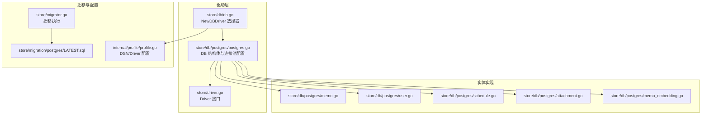
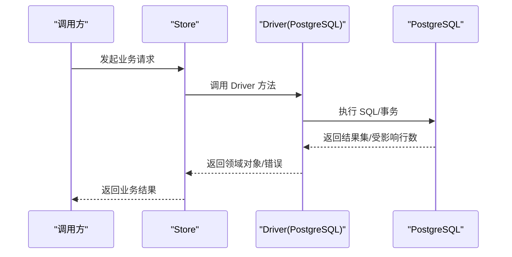
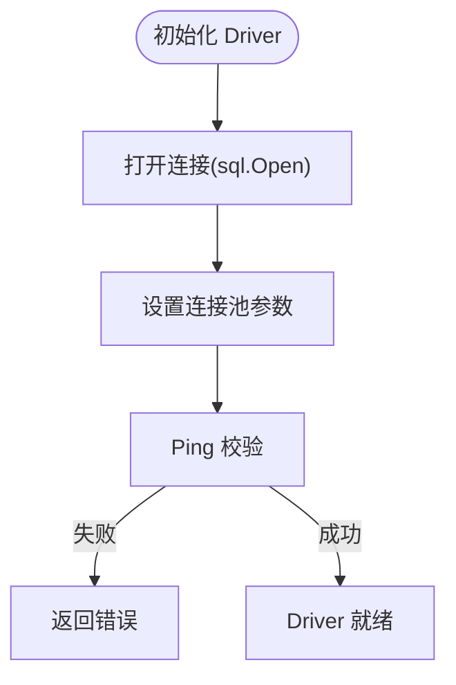
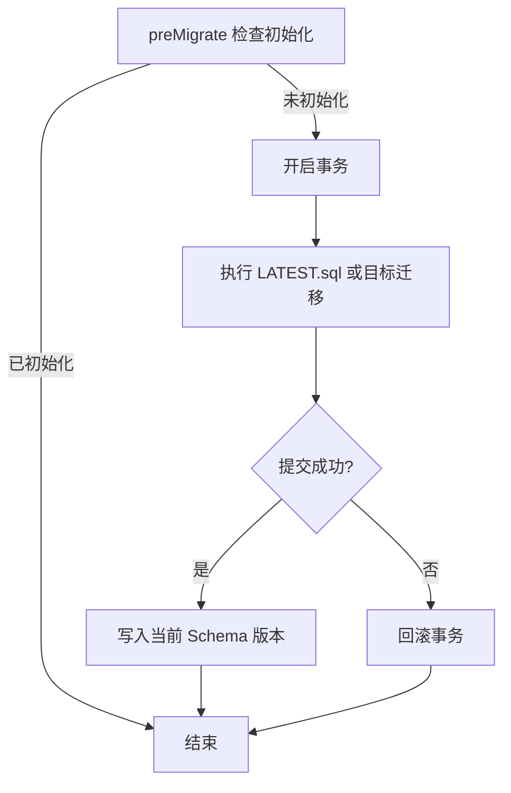
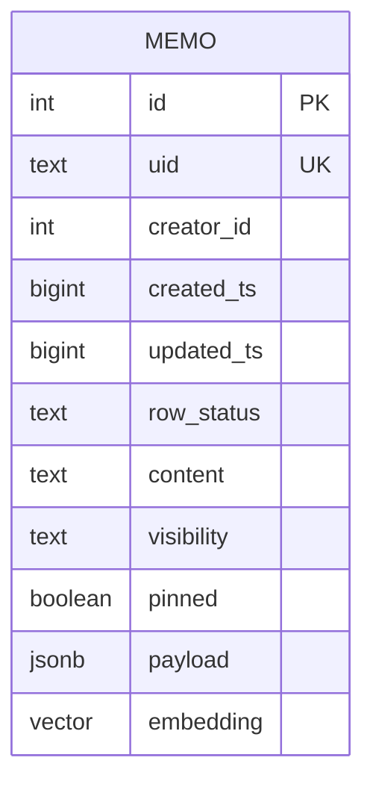
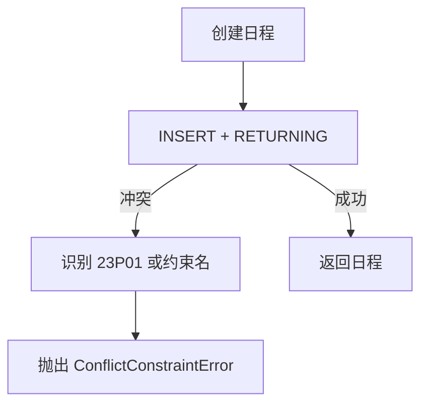
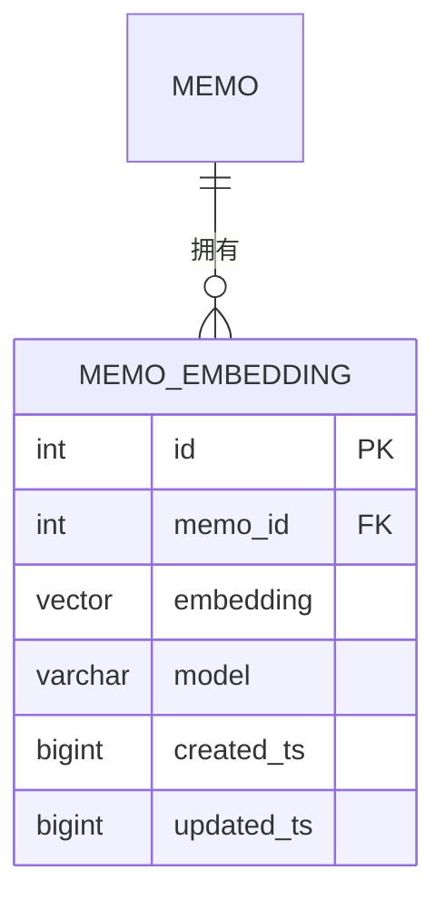
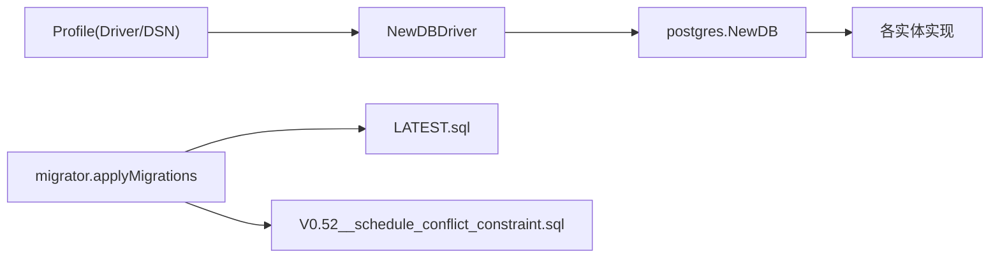

# PostgreSQL 驱动

<cite>
**本文引用的文件**
- [store/db/postgres/postgres.go](file://store/db/postgres/postgres.go)
- [store/db/db.go](file://store/db/db.go)
- [store/driver.go](file://store/driver.go)
- [store/db/postgres/memo.go](file://store/db/postgres/memo.go)
- [store/db/postgres/user.go](file://store/db/postgres/user.go)
- [store/db/postgres/schedule.go](file://store/db/postgres/schedule.go)
- [store/db/postgres/attachment.go](file://store/db/postgres/attachment.go)
- [store/db/postgres/memo_embedding.go](file://store/db/postgres/memo_embedding.go)
- [store/migration/postgres/LATEST.sql](file://store/migration/postgres/LATEST.sql)
- [store/migration/postgres/V0.52__schedule_conflict_constraint.sql](file://store/migration/postgres/V0.52__schedule_conflict_constraint.sql)
- [internal/profile/profile.go](file://internal/profile/profile.go)
- [store/store.go](file://store/store.go)
- [store/migrator.go](file://store/migrator.go)
- [docs/specs/AI-006-postgres-vector-search.md](file://docs/specs/AI-006-postgres-vector-search.md)
</cite>

## 目录
1. [简介](#简介)
2. [项目结构](#项目结构)
3. [核心组件](#核心组件)
4. [架构总览](#架构总览)
5. [详细组件分析](#详细组件分析)
6. [依赖关系分析](#依赖关系分析)
7. [性能考量](#性能考量)
8. [故障排查指南](#故障排查指南)
9. [结论](#结论)
10. [附录](#附录)

## 简介
本文件系统化梳理 Memos 在生产环境使用的 PostgreSQL 驱动实现，涵盖连接池管理、事务处理、并发控制、实体模型映射、SQL 优化与索引策略、以及 PostgreSQL 特有功能（向量搜索、全文搜索、高级数据类型）的落地方式。文档同时提供性能优化建议、最佳实践与排障指引，帮助读者在不同规模场景下稳定、高效地运行基于 PostgreSQL 的服务。

## 项目结构
PostgreSQL 驱动位于 store/db/postgres 目录，通过统一的 Driver 接口对外暴露能力，并由 store/db/db.go 根据配置选择具体驱动实现。迁移脚本位于 store/migration/postgres，定义了表结构、扩展、索引与约束。

**图表来源**
- [store/db/postgres/postgres.go](file://store/db/postgres/postgres.go#L34-L89)
- [store/db/db.go](file://store/db/db.go#L27-L44)
- [store/driver.go](file://store/driver.go#L10-L103)
- [store/db/postgres/memo.go](file://store/db/postgres/memo.go#L16-L49)
- [store/db/postgres/user.go](file://store/db/postgres/user.go#L13-L28)
- [store/db/postgres/schedule.go](file://store/db/postgres/schedule.go#L14-L57)
- [store/db/postgres/attachment.go](file://store/db/postgres/attachment.go#L17-L44)
- [store/db/postgres/memo_embedding.go](file://store/db/postgres/memo_embedding.go#L15-L42)
- [store/migration/postgres/LATEST.sql](file://store/migration/postgres/LATEST.sql#L1-L200)
- [store/migrator.go](file://store/migrator.go#L148-L256)
- [internal/profile/profile.go](file://internal/profile/profile.go#L15-L30)

**章节来源**
- [store/db/postgres/postgres.go](file://store/db/postgres/postgres.go#L34-L89)
- [store/db/db.go](file://store/db/db.go#L27-L44)
- [store/driver.go](file://store/driver.go#L10-L103)

## 核心组件
- 连接池与生命周期
  - 使用 lib/pq 驱动，初始化后设置最大连接数、空闲连接、连接最大生命周期与空闲超时，确保单用户场景下的低资源占用与快速响应。
  - 提供 Ping 校验与 Close 生命周期管理。
- 驱动接口
  - Driver 接口统一抽象所有实体的 CRUD、向量搜索、全文搜索、计划任务冲突检测等能力，便于切换 SQLite 或扩展其他数据库。
- 存储层封装
  - Store 对 Driver 进行组合，提供缓存与统一关闭流程；迁移器在启动前检查初始化状态并原子执行迁移。

**章节来源**
- [store/db/postgres/postgres.go](file://store/db/postgres/postgres.go#L34-L89)
- [store/driver.go](file://store/driver.go#L10-L103)
- [store/store.go](file://store/store.go#L11-L58)
- [store/migrator.go](file://store/migrator.go#L148-L256)

## 架构总览
PostgreSQL 驱动采用“接口 + 具体实现”的分层设计，配合迁移器保证数据库 Schema 的一致性与演进。核心交互如下：

**图表来源**
- [store/store.go](file://store/store.go#L47-L87)
- [store/driver.go](file://store/driver.go#L10-L103)
- [store/db/postgres/postgres.go](file://store/db/postgres/postgres.go#L34-L89)

## 详细组件分析

### 连接池与并发控制
- 连接池配置
  - 最大并发连接：5
  - 空闲连接：2
  - 连接最大生命周期：2 小时
  - 空闲连接最大存活：15 分钟
- 并发控制
  - 通过连接池上限限制并发，避免高负载下资源耗尽。
  - 事务层面使用 Begin/Commit/Rollback 确保迁移与初始化的原子性。
- 错误处理
  - Ping 失败直接返回错误，避免无效连接进入后续流程。

**图表来源**
- [store/db/postgres/postgres.go](file://store/db/postgres/postgres.go#L44-L67)

**章节来源**
- [store/db/postgres/postgres.go](file://store/db/postgres/postgres.go#L51-L67)
- [store/migrator.go](file://store/migrator.go#L157-L162)

### 事务处理与迁移
- 初始化检查
  - 通过 information_schema 判断是否已存在基础表，决定是否需要一次性应用最新 Schema。
- 原子迁移
  - 在单个事务中顺序执行迁移文件，失败自动回滚，成功后写入当前 Schema 版本。
- 计划任务冲突约束
  - 通过 EXCLUDE + GIST tsrange 约束在数据库层阻止重叠日程，结合专用错误识别函数进行上层友好提示。

**图表来源**
- [store/migrator.go](file://store/migrator.go#L221-L256)
- [store/migration/postgres/V0.52__schedule_conflict_constraint.sql](file://store/migration/postgres/V0.52__schedule_conflict_constraint.sql#L8-L17)

**章节来源**
- [store/migrator.go](file://store/migrator.go#L148-L256)
- [store/migration/postgres/V0.52__schedule_conflict_constraint.sql](file://store/migration/postgres/V0.52__schedule_conflict_constraint.sql#L1-L35)

### 实体：Memo（备忘录）
- 关键字段与类型
  - payload 使用 JSONB，embedding 使用 vector(1024)，支持 HNSW 索引。
- 查询优化
  - 支持按 ID/UID/创建者/可见性/时间排序等条件动态拼接 WHERE。
  - 限制最大返回条数与偏移，防止超大结果集。
- 向量搜索
  - 使用 1 - (embedding <-> query::vector) 计算余弦相似度，返回相似度分数与内容。
- 全文搜索
  - 使用 to_tsvector('simple', content) 与 plainto_tsquery 结合 ts_rank 进行 BM25 排序。

**图表来源**
- [store/migration/postgres/LATEST.sql](file://store/migration/postgres/LATEST.sql#L31-L44)
- [store/db/postgres/memo.go](file://store/db/postgres/memo.go#L267-L340)

**章节来源**
- [store/db/postgres/memo.go](file://store/db/postgres/memo.go#L16-L49)
- [store/db/postgres/memo.go](file://store/db/postgres/memo.go#L51-L197)
- [store/db/postgres/memo.go](file://store/db/postgres/memo.go#L267-L340)
- [store/db/postgres/memo_embedding.go](file://store/db/postgres/memo_embedding.go#L111-L192)
- [store/db/postgres/memo_embedding.go](file://store/db/postgres/memo_embedding.go#L259-L332)

### 实体：User（用户）
- 关键字段与类型
  - 角色、邮箱、昵称、密码哈希、头像 URL 等，均以文本存储。
- 查询与更新
  - 支持按 ID/用户名/角色/邮箱/昵称等条件过滤，更新时仅变更指定字段。
- 约束
  - username 唯一，row_status 默认 NORMAL。

**章节来源**
- [store/db/postgres/user.go](file://store/db/postgres/user.go#L13-L28)
- [store/db/postgres/user.go](file://store/db/postgres/user.go#L87-L168)

### 实体：Schedule（日程）
- 关键字段与类型
  - 包含标题、描述、地点、起止时间、全天标记、时区、重复规则、提醒、payload 等。
- 冲突检测
  - 通过 EXCLUDE 约束与 GIST tsrange 防止同一用户 NORMAL 状态日程重叠。
  - 提供 isConflictConstraintError 辅助判断并返回友好错误。
- 查询模式
  - 支持 AUTO/STANDARD/STRICT 三种查询模式，分别对应不同的时间范围包含策略。

**图表来源**
- [store/db/postgres/schedule.go](file://store/db/postgres/schedule.go#L14-L57)
- [store/db/postgres/schedule.go](file://store/db/postgres/schedule.go#L304-L326)

**章节来源**
- [store/db/postgres/schedule.go](file://store/db/postgres/schedule.go#L14-L57)
- [store/db/postgres/schedule.go](file://store/db/postgres/schedule.go#L59-L205)
- [store/db/postgres/schedule.go](file://store/db/postgres/schedule.go#L304-L326)
- [store/migration/postgres/V0.52__schedule_conflict_constraint.sql](file://store/migration/postgres/V0.52__schedule_conflict_constraint.sql#L8-L17)

### 实体：Attachment（附件）
- 关键字段与类型
  - 支持二进制 blob、文件路径、缩略图路径、OCR 文本、提取文本、存储类型等。
- 查询优化
  - 支持按文件名模糊匹配（转义特殊字符）、按 Memo 关联、按存储类型过滤。
  - 提供 GIN 索引加速对 extracted_text 与 ocr_text 的全文检索。
- 更新与删除
  - 仅更新指定字段，删除时返回受影响行数。

**章节来源**
- [store/db/postgres/attachment.go](file://store/db/postgres/attachment.go#L17-L44)
- [store/db/postgres/attachment.go](file://store/db/postgres/attachment.go#L46-L223)
- [store/db/postgres/attachment.go](file://store/db/postgres/attachment.go#L225-L289)
- [store/migration/postgres/LATEST.sql](file://store/migration/postgres/LATEST.sql#L82-L86)

### 实体：MemoEmbedding（备忘录嵌入）
- 关键字段与类型
  - memo_id + model 唯一键，embedding 为 vector(1024)，记录创建/更新时间。
- 能力
  - Upsert：按 memo_id + model 去重更新。
  - VectorSearch：基于余弦距离检索，返回分数与内容。
  - BM25Search：基于 to_tsvector('simple', content) 的 BM25 排序。
  - FindMemosWithoutEmbedding：查找缺失特定模型嵌入的备忘录，用于批量生成。

**图表来源**
- [store/migration/postgres/LATEST.sql](file://store/migration/postgres/LATEST.sql#L130-L147)
- [store/db/postgres/memo_embedding.go](file://store/db/postgres/memo_embedding.go#L15-L42)
- [store/db/postgres/memo_embedding.go](file://store/db/postgres/memo_embedding.go#L111-L192)
- [store/db/postgres/memo_embedding.go](file://store/db/postgres/memo_embedding.go#L259-L332)

**章节来源**
- [store/db/postgres/memo_embedding.go](file://store/db/postgres/memo_embedding.go#L15-L42)
- [store/db/postgres/memo_embedding.go](file://store/db/postgres/memo_embedding.go#L111-L192)
- [store/db/postgres/memo_embedding.go](file://store/db/postgres/memo_embedding.go#L194-L257)
- [store/db/postgres/memo_embedding.go](file://store/db/postgres/memo_embedding.go#L259-L332)

### PostgreSQL 特有功能支持
- 向量搜索（pgvector）
  - 使用 HNSW 索引与余弦距离，支持大规模向量检索。
  - 提供 UpsertMemoEmbedding、VectorSearch、FindMemosWithoutEmbedding。
- 全文搜索（ts_vector + BM25）
  - 使用 'simple' 配置，适配多语言混合内容。
  - BM25Search 返回相关性分数并按分数与更新时间排序。
- 高级数据类型
  - JSONB 用于灵活元数据存储。
  - vector 用于语义检索。
  - tsrange 用于时间区间约束与索引。

**章节来源**
- [store/migration/postgres/LATEST.sql](file://store/migration/postgres/LATEST.sql#L46-L49)
- [store/migration/postgres/LATEST.sql](file://store/migration/postgres/LATEST.sql#L145-L147)
- [store/db/postgres/memo_embedding.go](file://store/db/postgres/memo_embedding.go#L259-L332)
- [docs/specs/AI-006-postgres-vector-search.md](file://docs/specs/AI-006-postgres-vector-search.md#L1-L124)

## 依赖关系分析
- 驱动选择
  - NewDBDriver 根据 Profile.Driver 选择 postgres 或 sqlite。
- 运行时依赖
  - lib/pq 驱动、pgvector-go 向量库、pgvector 扩展。
- 迁移依赖
  - LATEST.sql 定义表结构与索引；V0.52__schedule_conflict_constraint.sql 引入冲突约束与索引。

**图表来源**
- [store/db/db.go](file://store/db/db.go#L27-L44)
- [internal/profile/profile.go](file://internal/profile/profile.go#L15-L30)
- [store/migrator.go](file://store/migrator.go#L148-L256)
- [store/migration/postgres/LATEST.sql](file://store/migration/postgres/LATEST.sql#L1-L200)
- [store/migration/postgres/V0.52__schedule_conflict_constraint.sql](file://store/migration/postgres/V0.52__schedule_conflict_constraint.sql#L1-L35)

**章节来源**
- [store/db/db.go](file://store/db/db.go#L27-L44)
- [internal/profile/profile.go](file://internal/profile/profile.go#L15-L30)
- [store/migrator.go](file://store/migrator.go#L148-L256)

## 性能考量
- 连接池配置
  - 单用户场景建议保持较低并发上限，减少连接切换开销；根据峰值 QPS 调整最大连接数与空闲连接。
  - 合理设置连接最大生命周期，平衡连接复用与资源回收。
- 索引策略
  - Memo/HNSW：embedding 上建立 HNSW(cosine_ops)，并配置 m 与 ef_construction 参数。
  - MemoEmbedding/HNSW：同上，且增加 memo_id 索引。
  - Attachment/GIN：对 extracted_text 与 ocr_text 建 GIN 索引，加速全文检索。
  - Schedule：对 (creator_id, start_ts) 与 GIST tsrange 建索引，提升冲突检测与查询性能。
- 查询优化
  - 控制返回条数与偏移上限，避免超大结果集。
  - 使用占位符与动态 WHERE 拼接，避免全表扫描。
  - 向量搜索与 BM25 搜索均按相关性排序，必要时引入最小分数阈值。
- 内存与序列化
  - ProtoJSON 序列化 payload，注意大对象时的内存分配，建议分页或延迟加载。
- 事务与锁
  - 迁移与初始化在单事务中执行，失败回滚，避免中间态。
  - 日程冲突通过数据库约束在写入阶段拦截，降低应用层复杂度。

[本节为通用性能建议，不直接分析具体文件，故无“章节来源”]

## 故障排查指南
- 连接失败
  - 检查 DSN 是否正确，确认数据库可达；查看 Ping 错误与日志。
- 迁移失败
  - 查看迁移文件执行顺序与错误位置，确认事务回滚是否生效；核对 LATEST.sql 与目标迁移文件。
- 冲突错误
  - 创建日程报错时，若为 23P01 或包含 no_overlapping_schedules 字样，则为冲突约束触发；调整时间范围或合并日程。
- 向量/全文搜索异常
  - 确认 pgvector 扩展已安装且版本满足要求；检查 HNSW 索引是否存在；验证查询参数（模型、维度、限制）。
- 附件检索问题
  - 确认 GIN 索引存在；LIKE 查询需对 %/_ 进行转义。

**章节来源**
- [store/db/postgres/postgres.go](file://store/db/postgres/postgres.go#L44-L67)
- [store/migrator.go](file://store/migrator.go#L157-L162)
- [store/db/postgres/schedule.go](file://store/db/postgres/schedule.go#L304-L326)
- [store/migration/postgres/LATEST.sql](file://store/migration/postgres/LATEST.sql#L127-L147)
- [store/db/postgres/attachment.go](file://store/db/postgres/attachment.go#L62-L64)

## 结论
PostgreSQL 驱动在本项目中提供了生产级的完整能力：稳定的连接池、完善的事务与迁移机制、面向实体的高效 SQL 实现、以及 PostgreSQL 特有的向量与全文搜索能力。通过合理的索引与查询限制、严格的约束与错误处理，能够在不同规模场景下保持高性能与高可靠性。建议在部署时结合业务峰值与数据规模，持续优化连接池与索引参数，并定期评估迁移与备份策略。

[本节为总结性内容，不直接分析具体文件，故无“章节来源”]

## 附录
- 配置要点
  - Profile.Driver 选择 postgres；Profile.DSN 提供连接字符串。
- 扩展与索引
  - pgvector 扩展、HNSW 索引、GIN 索引、EXCLUDE + GIST tsrange 约束。
- 相关规范
  - 向量搜索实现规格参考 AI-006 规范文档。

**章节来源**
- [internal/profile/profile.go](file://internal/profile/profile.go#L15-L30)
- [store/migration/postgres/LATEST.sql](file://store/migration/postgres/LATEST.sql#L127-L147)
- [docs/specs/AI-006-postgres-vector-search.md](file://docs/specs/AI-006-postgres-vector-search.md#L1-L124)