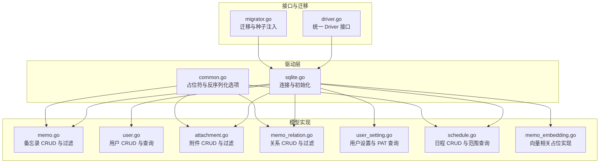
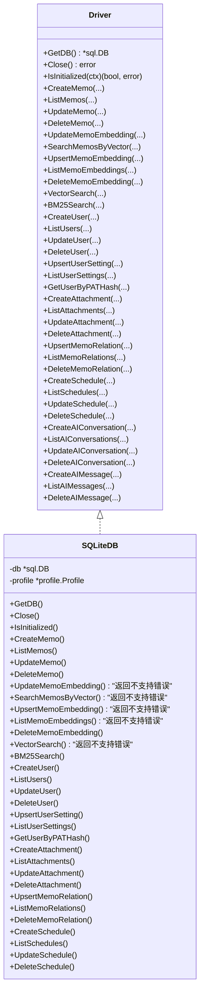
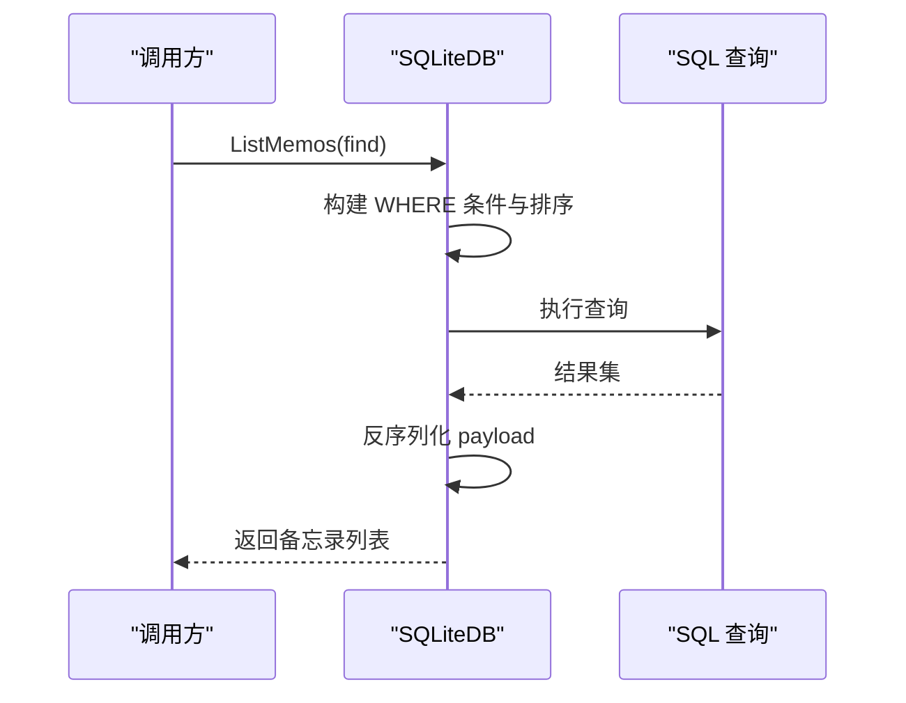
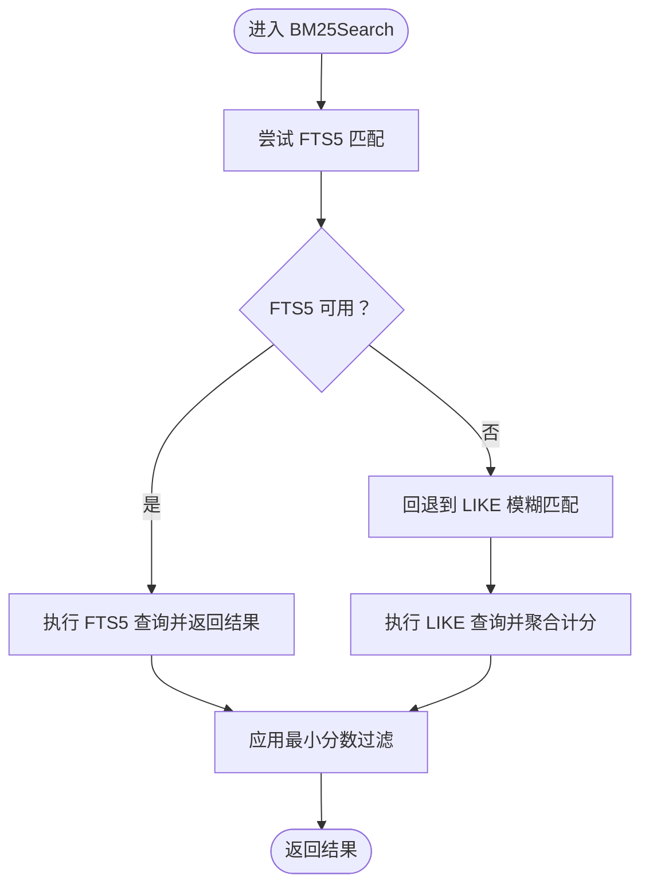
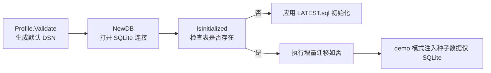

# SQLite 驱动

<cite>
**本文引用的文件**
- [store/db/sqlite/sqlite.go](file://store/db/sqlite/sqlite.go)
- [store/driver.go](file://store/driver.go)
- [store/db/sqlite/memo.go](file://store/db/sqlite/memo.go)
- [store/db/sqlite/user.go](file://store/db/sqlite/user.go)
- [store/db/sqlite/common.go](file://store/db/sqlite/common.go)
- [store/db/sqlite/memo_embedding.go](file://store/db/sqlite/memo_embedding.go)
- [store/db/sqlite/memo_relation.go](file://store/db/sqlite/memo_relation.go)
- [store/db/sqlite/attachment.go](file://store/db/sqlite/attachment.go)
- [store/db/sqlite/user_setting.go](file://store/db/sqlite/user_setting.go)
- [store/db/sqlite/schedule.go](file://store/db/sqlite/schedule.go)
- [store/migrator.go](file://store/migrator.go)
- [internal/profile/profile.go](file://internal/profile/profile.go)
- [docs/specs/AI-005-driver-interface.md](file://docs/specs/AI-005-driver-interface.md)
- [docs/specs/AI-006-postgres-vector-search.md](file://docs/specs/AI-006-postgres-vector-search.md)
</cite>

## 目录
1. [简介](#简介)
2. [项目结构](#项目结构)
3. [核心组件](#核心组件)
4. [架构总览](#架构总览)
5. [详细组件分析](#详细组件分析)
6. [依赖关系分析](#依赖关系分析)
7. [性能与并发特性](#性能与并发特性)
8. [最佳实践](#最佳实践)
9. [故障排查指南](#故障排查指南)
10. [结论](#结论)

## 简介
本文件系统化梳理 SQLite 数据库驱动的设计理念、实现细节与使用边界，重点说明以下方面：
- 设计原则：以“尽力而为”的策略支持开发与测试场景，明确不支持的功能与限制。
- 实体实现：覆盖主要模型（备忘录、用户、附件、关系、用户设置、日程、AI 对话等）的 SQL 适配、参数占位符与数据类型处理。
- 功能限制：解释为何 SQLite 不支持并发写入、全文检索的混合搜索、高级 AI 能力（向量搜索与嵌入），以及这些限制带来的替代方案。
- 迁移与初始化：说明 SQLite 的预迁移初始化流程、种子数据注入与版本跟踪。
- 最佳实践：文件路径管理、并发访问限制、性能优化建议与常见问题解决。

## 项目结构
SQLite 驱动位于 store/db/sqlite 目录，围绕统一的 Driver 接口实现各模型的数据访问层，并通过通用的 SQL 构造器与占位符函数适配 SQLite 的语法与参数绑定。

图表来源
- [store/db/sqlite/sqlite.go](file://store/db/sqlite/sqlite.go#L38-L100)
- [store/db/sqlite/common.go](file://store/db/sqlite/common.go#L15-L28)
- [store/db/sqlite/memo.go](file://store/db/sqlite/memo.go#L16-L52)
- [store/db/sqlite/user.go](file://store/db/sqlite/user.go#L13-L29)
- [store/db/sqlite/attachment.go](file://store/db/sqlite/attachment.go#L17-L40)
- [store/db/sqlite/memo_relation.go](file://store/db/sqlite/memo_relation.go#L12-L39)
- [store/db/sqlite/user_setting.go](file://store/db/sqlite/user_setting.go#L13-L26)
- [store/db/sqlite/schedule.go](file://store/db/sqlite/schedule.go#L12-L48)
- [store/db/sqlite/memo_embedding.go](file://store/db/sqlite/memo_embedding.go#L22-L48)
- [store/driver.go](file://store/driver.go#L10-L103)
- [store/migrator.go](file://store/migrator.go#L105-L146)

章节来源
- [store/db/sqlite/sqlite.go](file://store/db/sqlite/sqlite.go#L38-L100)
- [store/db/sqlite/common.go](file://store/db/sqlite/common.go#L15-L28)
- [store/driver.go](file://store/driver.go#L10-L103)
- [store/migrator.go](file://store/migrator.go#L105-L146)

## 核心组件
- 连接与初始化
  - 通过 modernc.org/sqlite 驱动打开数据库，显式设置 PRAGMA：禁用外键缓存、设置忙等待超时、启用 WAL 日志模式，确保单连接本地使用下的稳定性。
  - 设置连接池：最大连接数为 1，空闲连接为 1，无生命周期与空闲超时，适合本地文件型 SQLite。
  - 初始化检测：通过检查 sqlite_master 是否存在 memo 表判断是否已初始化。
- 统一接口
  - Driver 接口定义了所有模型的 CRUD 与查询方法，SQLite 驱动实现其中大部分，同时对不支持的向量能力提供明确错误提示。
- 通用工具
  - 占位符函数 placeholder 与 placeholders 返回 SQLite 专用的 ? 参数占位符，保证 SQL 注入安全与跨平台一致性。
  - protojson 反序列化选项 DiscardUnknown，避免未知字段导致解析失败。

章节来源
- [store/db/sqlite/sqlite.go](file://store/db/sqlite/sqlite.go#L46-L89)
- [store/driver.go](file://store/driver.go#L10-L103)
- [store/db/sqlite/common.go](file://store/db/sqlite/common.go#L15-L28)

## 架构总览
SQLite 驱动采用“接口 + 多模型实现”的分层设计，所有模型方法均基于原生 SQL 与参数绑定，避免 ORM 带来的复杂性与性能损耗；同时通过统一的占位符与过滤引擎，尽可能复用查询构造逻辑。

图表来源
- [store/driver.go](file://store/driver.go#L10-L103)
- [store/db/sqlite/sqlite.go](file://store/db/sqlite/sqlite.go#L38-L41)

## 详细组件分析

### 备忘录（Memo）
- 创建与更新
  - 使用动态字段拼接与占位符生成 INSERT/UPDATE 语句，支持可选的时间戳字段。
  - Payload 通过 protojson 序列化后存入 blob 字段，读取时反序列化回结构体。
- 查询与过滤
  - 支持多种过滤条件（ID/UID、创建者、可见性、行状态、排除评论等），通过过滤引擎生成 WHERE 条件。
  - 支持排序（时间升序/降序、置顶优先、ID 作为断点）与分页。
- 向量能力
  - 更新嵌入与向量搜索方法在 SQLite 中直接返回“不支持”错误，提示改用 PostgreSQL。

图表来源
- [store/db/sqlite/memo.go](file://store/db/sqlite/memo.go#L54-L192)

章节来源
- [store/db/sqlite/memo.go](file://store/db/sqlite/memo.go#L16-L52)
- [store/db/sqlite/memo.go](file://store/db/sqlite/memo.go#L54-L192)
- [store/db/sqlite/memo.go](file://store/db/sqlite/memo.go#L249-L259)

### 用户（User）
- 创建与更新
  - 支持多字段更新，返回完整用户信息。
- 查询
  - 不支持过滤表达式，仅支持基本字段匹配与排序。
- 删除
  - 基于 ID 删除。

章节来源
- [store/db/sqlite/user.go](file://store/db/sqlite/user.go#L13-L29)
- [store/db/sqlite/user.go](file://store/db/sqlite/user.go#L31-L86)
- [store/db/sqlite/user.go](file://store/db/sqlite/user.go#L88-L163)
- [store/db/sqlite/user.go](file://store/db/sqlite/user.go#L165-L177)

### 附件（Attachment）
- 创建与更新
  - 支持存储类型、参考链接、payload 等字段，payload 同样使用 protojson。
- 查询
  - 支持多种过滤（ID/UID、创建者、文件名、关联备忘录、存储类型等），可选择是否返回二进制内容。
- 删除
  - 基于 ID 删除。

章节来源
- [store/db/sqlite/attachment.go](file://store/db/sqlite/attachment.go#L17-L40)
- [store/db/sqlite/attachment.go](file://store/db/sqlite/attachment.go#L42-L171)
- [store/db/sqlite/attachment.go](file://store/db/sqlite/attachment.go#L173-L222)

### 关系（MemoRelation）
- 上下文
  - 支持“评论”等关系类型，提供 Upsert、List、Delete。
  - List 支持通过过滤引擎对关联 Memo 进行条件筛选。
- 冲突处理
  - 使用 ON CONFLICT(memo_id, related_memo_id, type) DO UPDATE 确保唯一性与一致性。

章节来源
- [store/db/sqlite/memo_relation.go](file://store/db/sqlite/memo_relation.go#L12-L39)
- [store/db/sqlite/memo_relation.go](file://store/db/sqlite/memo_relation.go#L41-L98)
- [store/db/sqlite/memo_relation.go](file://store/db/sqlite/memo_relation.go#L100-L123)

### 用户设置（UserSetting）与个人访问令牌（PAT）
- 用户设置
  - 支持按 (user_id, key) 唯一键插入或更新值。
- PAT 查询
  - 通过 JSON 解析 user_setting 中的 PERSONAL_ACCESS_TOKENS 字段，定位匹配的 token 并返回用户信息。

章节来源
- [store/db/sqlite/user_setting.go](file://store/db/sqlite/user_setting.go#L13-L26)
- [store/db/sqlite/user_setting.go](file://store/db/sqlite/user_setting.go#L28-L70)
- [store/db/sqlite/user_setting.go](file://store/db/sqlite/user_setting.go#L72-L110)

### 日程（Schedule）
- 创建与更新
  - 支持可选时间戳字段，payload 与 reminders 默认值处理与 PostgreSQL 行为对齐。
- 查询
  - 支持按时间范围重叠查询，按开始时间升序排序，支持分页。
- 删除
  - 基于 ID 删除并校验是否存在。

章节来源
- [store/db/sqlite/schedule.go](file://store/db/sqlite/schedule.go#L12-L48)
- [store/db/sqlite/schedule.go](file://store/db/sqlite/schedule.go#L50-L158)
- [store/db/sqlite/schedule.go](file://store/db/sqlite/schedule.go#L160-L216)
- [store/db/sqlite/schedule.go](file://store/db/sqlite/schedule.go#L218-L232)

### 全文检索（BM25）与向量能力
- BM25 搜索
  - 优先尝试 FTS5 匹配，若不可用则回退到 LIKE 模糊匹配；两者均支持最小分数过滤。
- 向量能力
  - SQLite 驱动对 Upsert/List/Delete 向量与 VectorSearch 提供占位实现，统一返回“需要 PostgreSQL + pgvector”的错误，避免部分功能导致的误导。

图表来源
- [store/db/sqlite/memo_embedding.go](file://store/db/sqlite/memo_embedding.go#L50-L120)
- [store/db/sqlite/memo_embedding.go](file://store/db/sqlite/memo_embedding.go#L122-L215)

章节来源
- [store/db/sqlite/memo_embedding.go](file://store/db/sqlite/memo_embedding.go#L13-L21)
- [store/db/sqlite/memo_embedding.go](file://store/db/sqlite/memo_embedding.go#L22-L48)
- [store/db/sqlite/memo_embedding.go](file://store/db/sqlite/memo_embedding.go#L50-L120)
- [store/db/sqlite/memo_embedding.go](file://store/db/sqlite/memo_embedding.go#L122-L215)

## 依赖关系分析
- 接口与实现
  - Driver 接口由 store/driver.go 定义，SQLite 驱动在 sqlite.go 中实现；其他模型方法分布在各自文件中。
- 迁移与种子
  - 迁移系统根据当前模式与版本决定是否应用增量迁移或直接初始化最新架构；种子数据仅在 SQLite 的 demo 模式下注入。
- 配置与 DSN
  - Profile.Validate 自动为 SQLite 生成默认 DSN（memos_{mode}.db），确保数据目录存在且可访问。

图表来源
- [internal/profile/profile.go](file://internal/profile/profile.go#L146-L152)
- [store/db/sqlite/sqlite.go](file://store/db/sqlite/sqlite.go#L46-L89)
- [store/migrator.go](file://store/migrator.go#L221-L264)
- [store/migrator.go](file://store/migrator.go#L277-L308)

章节来源
- [store/driver.go](file://store/driver.go#L10-L103)
- [store/migrator.go](file://store/migrator.go#L105-L146)
- [internal/profile/profile.go](file://internal/profile/profile.go#L146-L152)

## 性能与并发特性
- 连接池与并发
  - SQLite 采用单连接（SetMaxOpenConns=1），避免 WAL 模式下的锁竞争；适合本地开发与单用户场景。
- 查询性能
  - 通过占位符与字符串拼接构建 SQL，减少 ORM 层开销；对大结果集建议使用 Limit/Offset 或更精细的过滤条件。
- 全文检索
  - FTS5 提供近生产级的 BM25 能力；若未启用 FTS5，则回退到 LIKE，性能与相关性均不及 FTS5。
- 向量能力
  - SQLite 不支持向量存储与相似度计算，无法进行嵌入向量的 Upsert、查询与重排；建议在生产使用 PostgreSQL + pgvector。

章节来源
- [store/db/sqlite/sqlite.go](file://store/db/sqlite/sqlite.go#L71-L79)
- [store/db/sqlite/memo_embedding.go](file://store/db/sqlite/memo_embedding.go#L50-L120)
- [docs/specs/AI-006-postgres-vector-search.md](file://docs/specs/AI-006-postgres-vector-search.md#L66-L108)

## 最佳实践
- 文件路径管理
  - 使用 Profile.Validate 自动生成 SQLite DSN（memos_{mode}.db），确保数据目录存在；生产环境建议将数据目录指向持久化卷。
- 并发访问限制
  - 仅适用于单用户本地使用；多用户或多进程写入会导致锁冲突与性能下降。
- 性能优化
  - 优先使用索引字段过滤（如创建者、时间范围）；避免全表扫描；合理使用 Limit/Offset。
  - 若需要向量搜索与高级 AI 能力，请切换至 PostgreSQL + pgvector。
- 开发与测试
  - dev/demo 模式可自动初始化与注入种子数据；生产模式严格禁止向量相关方法在 SQLite 上使用。

章节来源
- [internal/profile/profile.go](file://internal/profile/profile.go#L146-L152)
- [store/migrator.go](file://store/migrator.go#L277-L308)
- [store/db/sqlite/sqlite.go](file://store/db/sqlite/sqlite.go#L71-L79)

## 故障排查指南
- “需要 PostgreSQL + pgvector”
  - 症状：调用 UpsertMemoEmbedding、VectorSearch、SearchMemosByVector 等方法返回错误。
  - 原因：SQLite 不支持向量存储与相似度计算。
  - 处理：在生产环境切换到 PostgreSQL，并安装 pgvector 扩展。
- “FTS5 不可用”
  - 症状：BM25Search 返回回退结果，相关性不如预期。
  - 处理：确认 SQLite 编译时启用了 FTS5；或接受 LIKE 回退方案。
- “数据库未初始化”
  - 症状：首次启动报错或查询失败。
  - 处理：确认 IsInitialized 检查逻辑与 LATEST.sql 应用流程；确保 DSN 指向有效文件。
- “并发写入失败”
  - 症状：多进程同时写入导致锁等待或失败。
  - 处理：仅在单进程单连接下运行；避免多实例同时写入同一 SQLite 文件。

章节来源
- [store/db/sqlite/memo_embedding.go](file://store/db/sqlite/memo_embedding.go#L22-L48)
- [store/db/sqlite/memo_embedding.go](file://store/db/sqlite/memo_embedding.go#L50-L120)
- [store/db/sqlite/sqlite.go](file://store/db/sqlite/sqlite.go#L91-L99)
- [store/db/sqlite/sqlite.go](file://store/db/sqlite/sqlite.go#L71-L79)

## 结论
SQLite 驱动以“开发与测试优先”的策略实现了核心业务模型的 CRUD 与查询能力，通过占位符与过滤引擎保证了可维护性与一致性。对于向量搜索、并发写入与复杂迁移等高成本/低收益特性，采取了清晰的“不支持”策略并提供明确的替代路径（PostgreSQL + pgvector）。结合合理的文件路径管理与单连接并发模型，SQLite 仍可在本地开发与演示场景中高效稳定地运行。