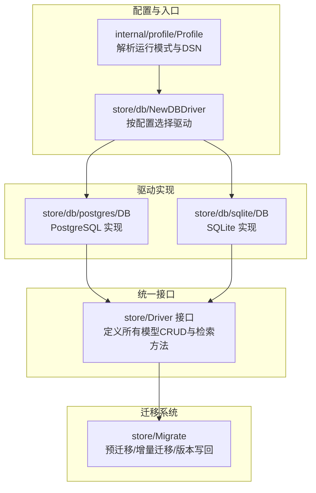
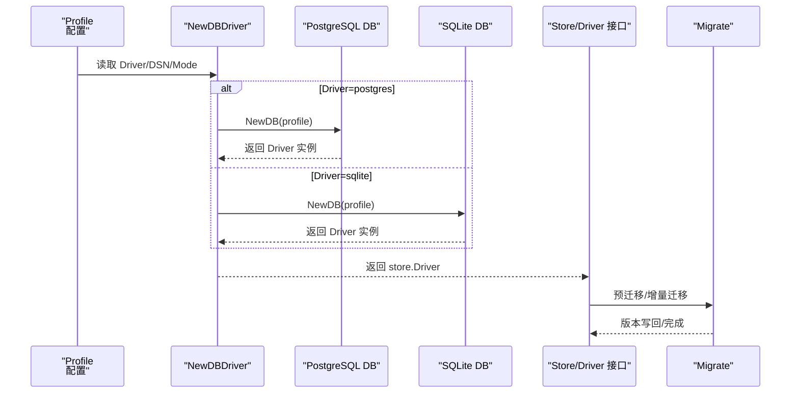
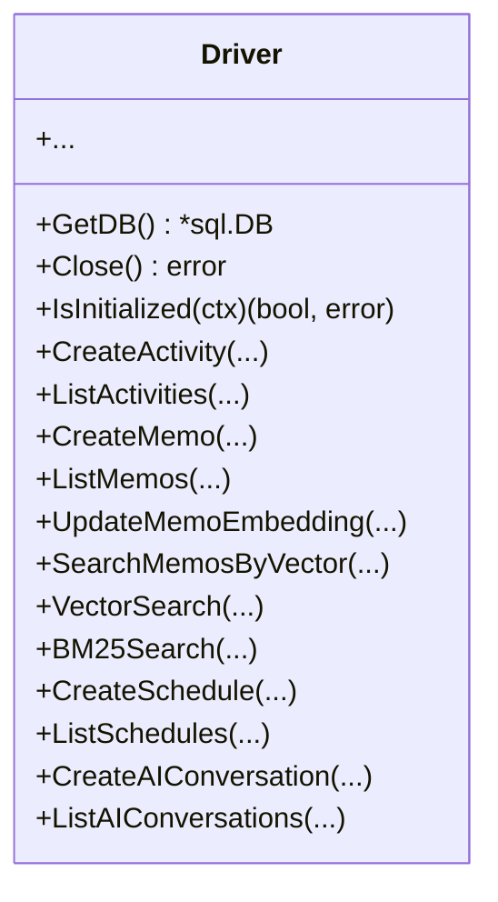
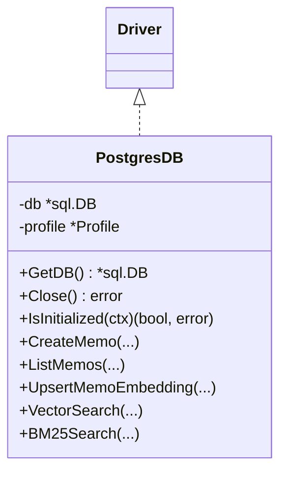
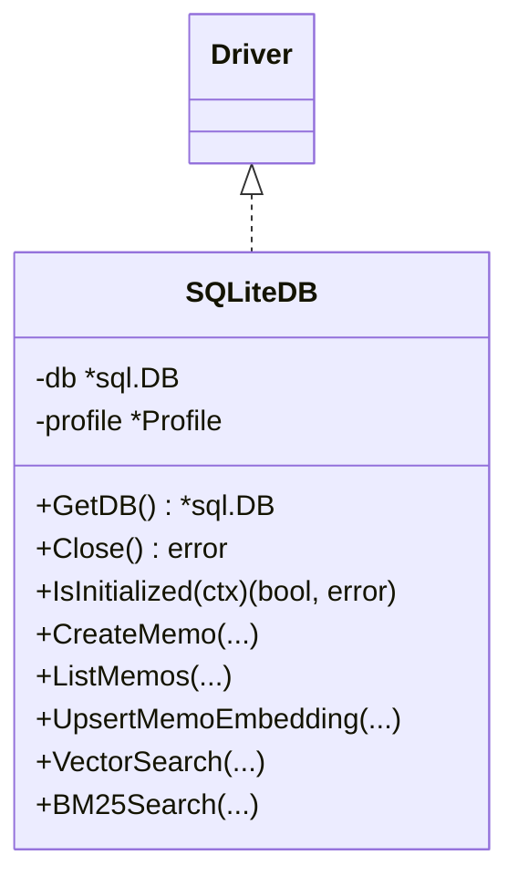
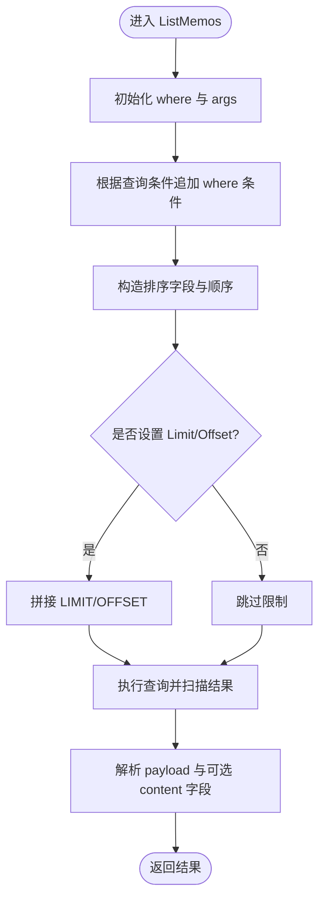
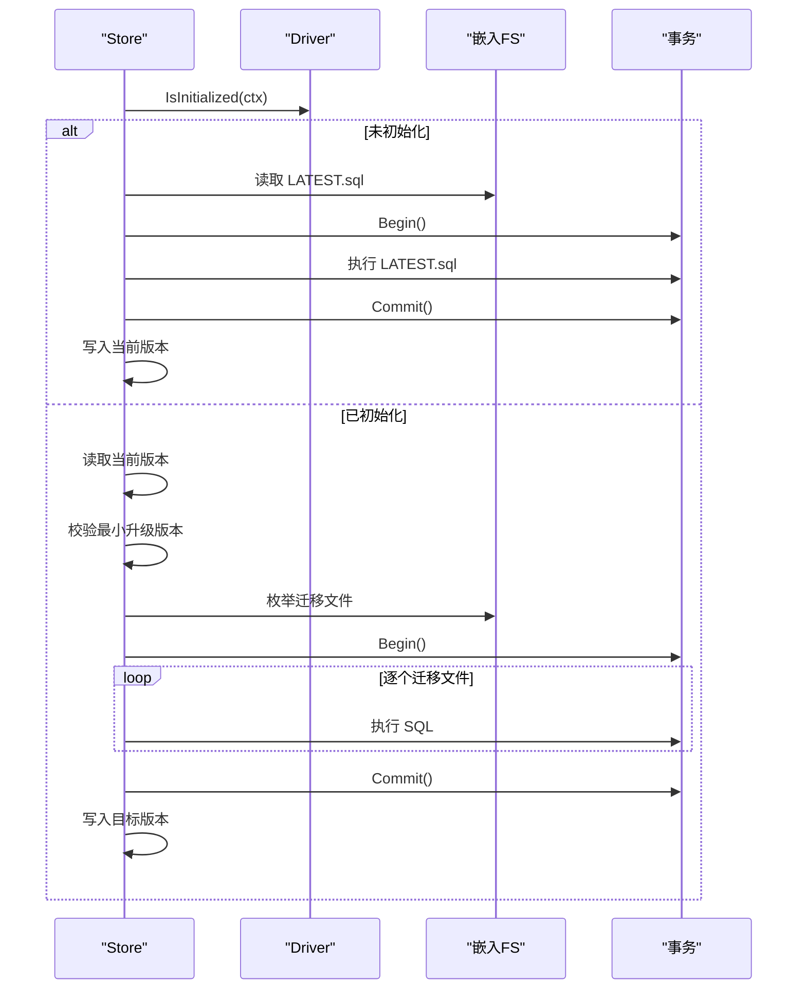
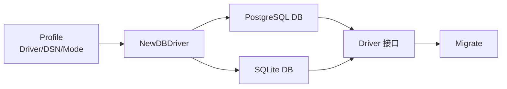

# 数据库驱动

<cite>
**本文引用的文件**
- [store/db/db.go](file://store/db/db.go)
- [store/driver.go](file://store/driver.go)
- [store/db/postgres/postgres.go](file://store/db/postgres/postgres.go)
- [store/db/postgres/memo.go](file://store/db/postgres/memo.go)
- [store/db/postgres/memo_embedding.go](file://store/db/postgres/memo_embedding.go)
- [store/db/postgres/common.go](file://store/db/postgres/common.go)
- [store/db/sqlite/sqlite.go](file://store/db/sqlite/sqlite.go)
- [store/db/sqlite/memo.go](file://store/db/sqlite/memo.go)
- [store/db/sqlite/common.go](file://store/db/sqlite/common.go)
- [store/migrator.go](file://store/migrator.go)
- [internal/profile/profile.go](file://internal/profile/profile.go)
</cite>

## 目录
1. [简介](#简介)
2. [项目结构](#项目结构)
3. [核心组件](#核心组件)
4. [架构总览](#架构总览)
5. [详细组件分析](#详细组件分析)
6. [依赖关系分析](#依赖关系分析)
7. [性能考量](#性能考量)
8. [故障排查指南](#故障排查指南)
9. [结论](#结论)
10. [附录](#附录)

## 简介
本文件系统性梳理数据库驱动体系，对比 PostgreSQL 与 SQLite 两种驱动在接口一致性、功能覆盖、性能特征与适用场景上的差异，并总结统一接口设计（连接管理、事务处理、查询执行）、SQL 优化策略、索引与并发控制实践，以及数据库选型与性能优化建议。

## 项目结构
数据库驱动位于 store 层，通过统一的 Driver 接口屏蔽底层差异；具体实现分为 PostgreSQL 与 SQLite 两套。迁移系统独立于驱动层，负责版本化迁移与初始化。

图表来源
- [store/db/db.go](file://store/db/db.go#L27-L44)
- [store/driver.go](file://store/driver.go#L10-L102)
- [store/db/postgres/postgres.go](file://store/db/postgres/postgres.go#L39-L89)
- [store/db/sqlite/sqlite.go](file://store/db/sqlite/sqlite.go#L46-L100)
- [store/migrator.go](file://store/migrator.go#L105-L146)

章节来源
- [store/db/db.go](file://store/db/db.go#L12-L44)
- [store/driver.go](file://store/driver.go#L8-L102)
- [store/migrator.go](file://store/migrator.go#L21-L42)

## 核心组件
- 统一接口 Driver：定义了所有模型的增删改查与检索方法，确保上层业务无感切换数据库。
- PostgreSQL 驱动：生产可用，支持向量检索、全文检索、混合检索、并发写入、复杂迁移等。
- SQLite 驱动：开发/测试可用，受限于并发写入与部分高级特性，优先保证高ROI功能的正确性。
- 迁移系统：负责新库初始化、增量迁移、版本记录与降级保护。

章节来源
- [store/driver.go](file://store/driver.go#L10-L102)
- [store/db/postgres/postgres.go](file://store/db/postgres/postgres.go#L17-L32)
- [store/db/sqlite/sqlite.go](file://store/db/sqlite/sqlite.go#L16-L36)
- [store/migrator.go](file://store/migrator.go#L105-L146)

## 架构总览
下图展示从配置到驱动实例化、接口调用与迁移流程的整体关系。

图表来源
- [store/db/db.go](file://store/db/db.go#L27-L44)
- [store/db/postgres/postgres.go](file://store/db/postgres/postgres.go#L39-L89)
- [store/db/sqlite/sqlite.go](file://store/db/sqlite/sqlite.go#L46-L100)
- [store/migrator.go](file://store/migrator.go#L105-L146)

## 详细组件分析

### 统一接口设计（Driver）
- 职责边界：覆盖 Activity/Attachment/Memo/MemoRelation/InstanceSetting/User/UserSetting/IdentityProvider/Inbox/Reaction/MemoEmbedding/Schedule/AIConversation/AIMessage 等模型的 CRUD 与检索方法。
- 事务与连接：Driver 暴露 GetDB() 与 Close()，由上层统一管理事务；迁移系统在关键路径以单事务执行多条 SQL，保证原子性。
- AI 能力：定义向量嵌入 Upsert/查询、向量检索、BM25 检索等方法，便于按需扩展。

图表来源
- [store/driver.go](file://store/driver.go#L10-L102)

章节来源
- [store/driver.go](file://store/driver.go#L10-L102)

### PostgreSQL 驱动实现
- 连接与池化：使用标准库 sql.Open("postgres", dsn)，设置最大连接数、空闲连接、生命周期与空闲超时，适配个人助理场景。
- 初始化检查：通过 information_schema 表判断是否已初始化。
- SQL 占位符：采用 $n 形式，工具函数生成占位符串。
- AI 能力：基于 pgvector 扩展，提供向量 Upsert、向量检索、嵌入列表查询、缺失嵌入查询等。

图表来源
- [store/db/postgres/postgres.go](file://store/db/postgres/postgres.go#L34-L89)
- [store/db/postgres/memo.go](file://store/db/postgres/memo.go#L16-L49)
- [store/db/postgres/memo_embedding.go](file://store/db/postgres/memo_embedding.go#L15-L42)
- [store/db/postgres/common.go](file://store/db/postgres/common.go#L16-L26)
- [store/driver.go](file://store/driver.go#L10-L102)

章节来源
- [store/db/postgres/postgres.go](file://store/db/postgres/postgres.go#L39-L89)
- [store/db/postgres/common.go](file://store/db/postgres/common.go#L16-L26)
- [store/db/postgres/memo.go](file://store/db/postgres/memo.go#L51-L197)
- [store/db/postgres/memo_embedding.go](file://store/db/postgres/memo_embedding.go#L111-L192)

### SQLite 驱动实现
- 连接与池化：使用 modernc.org/sqlite 驱动，WAL 日志模式 + busy_timeout，单连接池配置，适合本地文件与单用户场景。
- 初始化检查：通过 sqlite_master 判断表是否存在。
- SQL 占位符：采用 ? 形式，工具函数生成占位符串。
- 功能限制：并发写入受限、不支持 BM25/混合检索/高级 AI 能力，新增功能需遵循“高ROI优先”原则，必要时返回明确错误而非半成品。

图表来源
- [store/db/sqlite/sqlite.go](file://store/db/sqlite/sqlite.go#L38-L100)
- [store/db/sqlite/memo.go](file://store/db/sqlite/memo.go#L16-L52)
- [store/db/sqlite/common.go](file://store/db/sqlite/common.go#L15-L27)
- [store/driver.go](file://store/driver.go#L10-L102)

章节来源
- [store/db/sqlite/sqlite.go](file://store/db/sqlite/sqlite.go#L46-L100)
- [store/db/sqlite/common.go](file://store/db/sqlite/common.go#L15-L27)
- [store/db/sqlite/memo.go](file://store/db/sqlite/memo.go#L54-L192)

### 查询执行与 SQL 优化
- 参数化查询：统一使用占位符（$n 或 ?），避免拼接与注入风险。
- 条件拼接：根据查询条件动态构建 where 子句与参数数组，支持 ID/UID 列表、可见性过滤、排序字段等。
- 限制与偏移：对查询结果进行上限与偏移控制，防止过大结果集。
- 嵌套关联：通过 LEFT JOIN 关联评论与父级 Memo，支持排除评论等场景。
- Payload 解析：统一使用 protojson 解析/反序列化，忽略未知字段，提升健壮性。

图表来源
- [store/db/postgres/memo.go](file://store/db/postgres/memo.go#L51-L197)
- [store/db/sqlite/memo.go](file://store/db/sqlite/memo.go#L54-L192)
- [store/db/postgres/common.go](file://store/db/postgres/common.go#L16-L26)
- [store/db/sqlite/common.go](file://store/db/sqlite/common.go#L15-L27)

章节来源
- [store/db/postgres/memo.go](file://store/db/postgres/memo.go#L51-L197)
- [store/db/sqlite/memo.go](file://store/db/sqlite/memo.go#L54-L192)
- [store/db/postgres/common.go](file://store/db/postgres/common.go#L16-L26)
- [store/db/sqlite/common.go](file://store/db/sqlite/common.go#L15-L27)

### 事务处理与迁移
- 事务边界：迁移系统在关键路径开启单事务，依次执行迁移脚本，成功后提交并更新版本号；失败则回滚。
- 预迁移：若未初始化，直接应用 LATEST.sql 并写入当前版本。
- 版本校验：禁止降级；对极旧安装（< v0.22）给出强制升级路径。
- 种子数据：仅在 SQLite 的 demo 模式下应用种子脚本。

图表来源
- [store/migrator.go](file://store/migrator.go#L105-L264)
- [store/migrator.go](file://store/migrator.go#L274-L308)
- [store/db/db.go](file://store/db/db.go#L27-L44)

章节来源
- [store/migrator.go](file://store/migrator.go#L105-L264)
- [store/migrator.go](file://store/migrator.go#L274-L308)

### 并发控制与性能差异
- PostgreSQL：支持并发写入、连接池调优、向量检索与全文检索，适合生产环境。
- SQLite：单连接池 + WAL，避免锁争用；并发写入受限，不支持复杂迁移与高级 AI 能力，适合开发/测试。

章节来源
- [store/db/postgres/postgres.go](file://store/db/postgres/postgres.go#L51-L57)
- [store/db/sqlite/sqlite.go](file://store/db/sqlite/sqlite.go#L71-L77)

### 数据库选择指南
- 生产/多用户/高级 AI：优先 PostgreSQL，具备完整 AI 能力与并发写入。
- 开发/测试/单用户：可选 SQLite，注意其并发与高级特性限制。

章节来源
- [store/db/db.go](file://store/db/db.go#L13-L25)
- [store/db/sqlite/sqlite.go](file://store/db/sqlite/sqlite.go#L16-L36)
- [store/db/postgres/postgres.go](file://store/db/postgres/postgres.go#L17-L32)

## 依赖关系分析
- NewDBDriver 根据 Profile.Driver 选择具体驱动实现。
- Driver 接口被 Store 使用，迁移系统在关键路径通过 Driver.GetDB() 获取底层连接。
- PostgreSQL 与 SQLite 在 SQL 占位符、方言与能力上存在差异，但通过统一接口屏蔽。

图表来源
- [store/db/db.go](file://store/db/db.go#L27-L44)
- [store/driver.go](file://store/driver.go#L10-L102)
- [store/migrator.go](file://store/migrator.go#L105-L146)

章节来源
- [store/db/db.go](file://store/db/db.go#L27-L44)
- [store/driver.go](file://store/driver.go#L10-L102)
- [store/migrator.go](file://store/migrator.go#L105-L146)

## 性能考量
- 连接池与生命周期
  - PostgreSQL：较小连接池（如 5）与较短空闲超时，降低资源占用，适合个人使用场景。
  - SQLite：单连接池 + WAL，避免锁争用，适合本地文件。
- 查询限制
  - 对查询结果设置上限与偏移，避免大结果集导致内存与网络压力。
- 向量检索
  - PostgreSQL 使用 pgvector，建议在 embedding 列建立合适索引（如 ivfflat）并合理设置探测数量，平衡召回率与延迟。
- 索引与并发
  - SQLite 不支持并发写入，应尽量减少写放大与长事务；对热点查询建立索引。
- 磁盘 I/O 与 WAL
  - SQLite 使用 WAL 模式可显著降低锁冲突；注意磁盘空间与日志清理策略。
- 网络延迟
  - PostgreSQL 作为远程数据库时，关注网络抖动与超时设置；本地回环或容器内联则影响较小。

## 故障排查指南
- 连接失败
  - 检查 DSN 是否正确、网络连通性、PostgreSQL 认证配置或 SQLite 文件权限。
- 初始化失败
  - 若未初始化，迁移系统会尝试应用 LATEST.sql；确认嵌入文件可读且有足够权限。
- 迁移异常
  - 查看迁移事务回滚原因，确认 SQL 文件命名规范与内容合法性；必要时手动回滚并重试。
- SQLite 并发写入冲突
  - 减少并发写入、合并写操作、避免长时间事务；必要时切换至 PostgreSQL。
- AI 能力不可用
  - 确认驱动类型与功能支持范围；SQLite 不支持高级 AI 能力时，应切换 PostgreSQL。

章节来源
- [store/db/postgres/postgres.go](file://store/db/postgres/postgres.go#L44-L62)
- [store/db/sqlite/sqlite.go](file://store/db/sqlite/sqlite.go#L66-L69)
- [store/migrator.go](file://store/migrator.go#L220-L264)
- [store/db/db.go](file://store/db/db.go#L13-L25)

## 结论
该数据库驱动体系通过统一接口屏蔽底层差异，结合迁移系统实现稳定的版本演进。PostgreSQL 提供生产级能力与并发写入，SQLite 专注开发/测试场景并保持简洁可靠。实际选型应综合业务规模、并发需求与 AI 能力要求，必要时在两者间灵活切换。

## 附录
- 配置要点
  - Profile.Mode 支持 prod/dev/demo；Driver 限定 postgres/sqlite；SQLite 默认 DSN 由数据目录与模式拼接生成。
- 迁移文件组织
  - store/migration/{driver}/{minor_version}/*.sql；命名以序号前缀与描述组成，按字典序执行。
- 种子数据
  - 仅在 SQLite demo 模式下应用，位于 store/seed/{driver}/*.sql。

章节来源
- [internal/profile/profile.go](file://internal/profile/profile.go#L120-L152)
- [store/migrator.go](file://store/migrator.go#L37-L42)
- [store/migrator.go](file://store/migrator.go#L266-L272)
- [store/migrator.go](file://store/migrator.go#L274-L308)