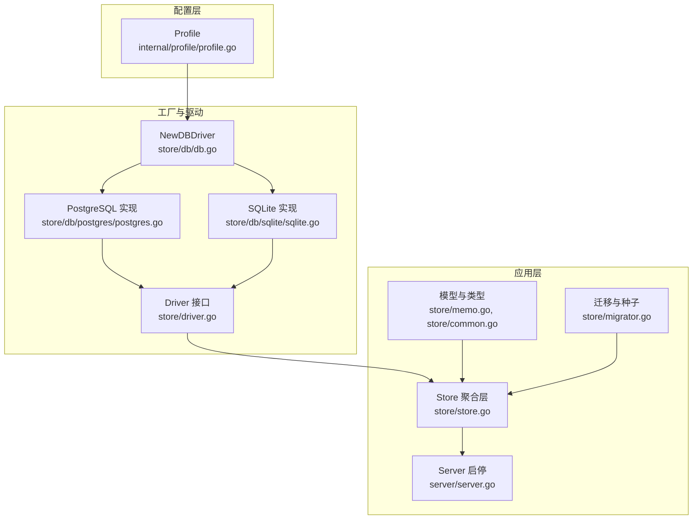
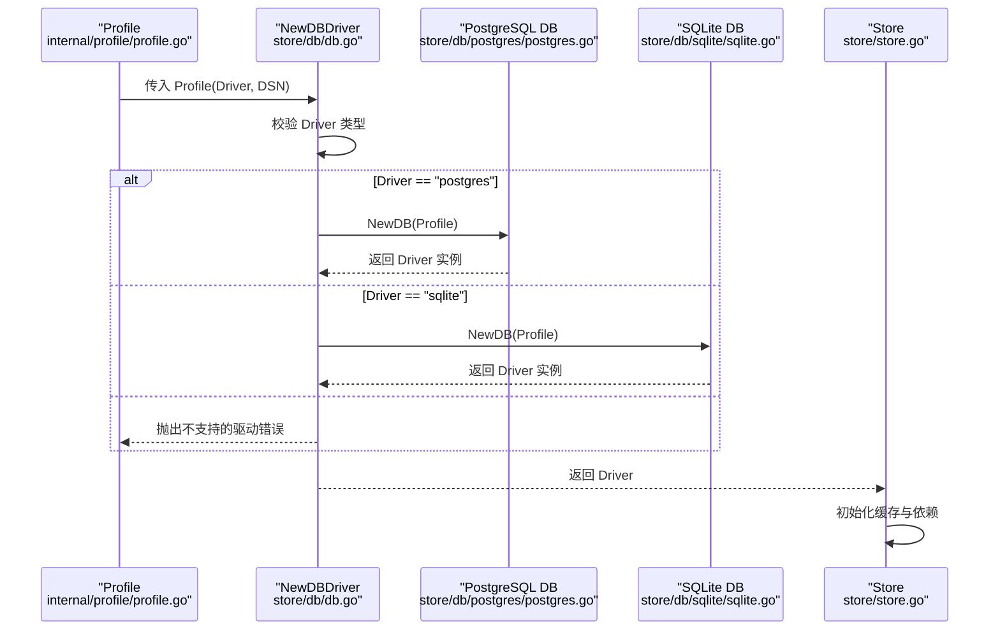
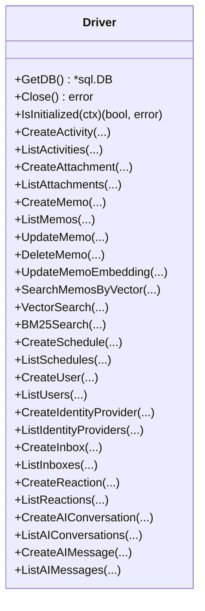
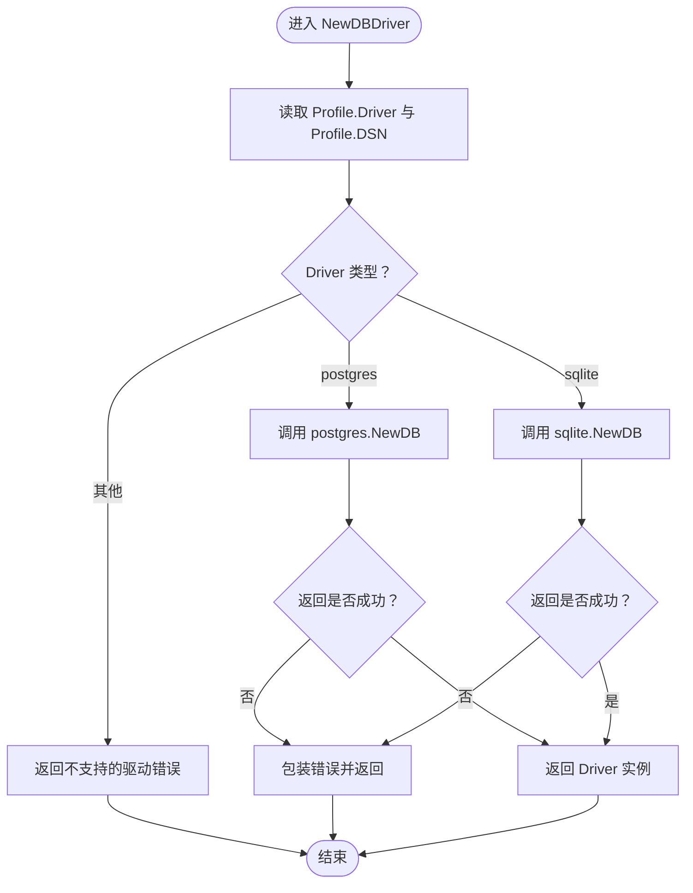
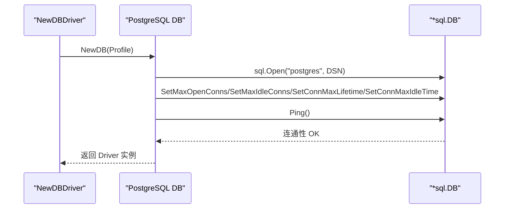
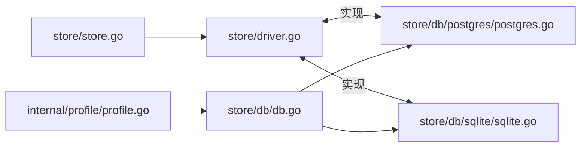

# 驱动接口设计

<cite>
**本文档引用的文件**
- [store/driver.go](file://store/driver.go)
- [store/db/db.go](file://store/db/db.go)
- [store/db/postgres/postgres.go](file://store/db/postgres/postgres.go)
- [store/db/sqlite/sqlite.go](file://store/db/sqlite/sqlite.go)
- [internal/profile/profile.go](file://internal/profile/profile.go)
- [store/store.go](file://store/store.go)
- [server/server.go](file://server/server.go)
- [store/memo.go](file://store/memo.go)
- [store/common.go](file://store/common.go)
- [store/migrator.go](file://store/migrator.go)
- [docs/specs/AI-006-postgres-vector-search.md](file://docs/specs/AI-006-postgres-vector-search.md)
</cite>

## 目录
1. [简介](#简介)
2. [项目结构](#项目结构)
3. [核心组件](#核心组件)
4. [架构总览](#架构总览)
5. [详细组件分析](#详细组件分析)
6. [依赖关系分析](#依赖关系分析)
7. [性能考虑](#性能考虑)
8. [故障排除指南](#故障排除指南)
9. [结论](#结论)
10. [附录](#附录)

## 简介
本文件系统化阐述数据库驱动接口设计与实现，重点覆盖以下方面：
- 统一数据库驱动接口的设计原理：接口抽象、方法签名、错误处理机制
- NewDBDriver 工厂函数的工作原理：配置解析、驱动选择与初始化流程
- 多数据库后端支持策略：功能差异处理与兼容性保障
- 扩展指南：如何为新数据库类型实现驱动接口
- 使用示例与最佳实践建议

## 项目结构
数据库驱动相关代码主要分布在以下模块：
- 接口定义：store/driver.go
- 工厂与策略：store/db/db.go
- PostgreSQL 实现：store/db/postgres/postgres.go
- SQLite 实现：store/db/sqlite/sqlite.go
- 配置解析：internal/profile/profile.go
- Store 聚合层：store/store.go
- 服务器启动与关闭：server/server.go
- 模型与通用类型：store/memo.go、store/common.go
- 迁移与种子脚本：store/migrator.go
- PostgreSQL 向量搜索实现参考：docs/specs/AI-006-postgres-vector-search.md



图表来源
- [store/db/db.go](file://store/db/db.go#L27-L44)
- [store/driver.go](file://store/driver.go#L10-L102)
- [store/db/postgres/postgres.go](file://store/db/postgres/postgres.go#L39-L71)
- [store/db/sqlite/sqlite.go](file://store/db/sqlite/sqlite.go#L46-L81)
- [store/store.go](file://store/store.go#L12-L45)
- [server/server.go](file://server/server.go#L38-L87)
- [store/memo.go](file://store/memo.go#L35-L55)
- [store/common.go](file://store/common.go#L12-L24)
- [store/migrator.go](file://store/migrator.go#L266-L287)

章节来源
- [store/db/db.go](file://store/db/db.go#L12-L44)
- [store/driver.go](file://store/driver.go#L8-L102)
- [store/db/postgres/postgres.go](file://store/db/postgres/postgres.go#L17-L71)
- [store/db/sqlite/sqlite.go](file://store/db/sqlite/sqlite.go#L16-L81)
- [internal/profile/profile.go](file://internal/profile/profile.go#L14-L152)
- [store/store.go](file://store/store.go#L11-L45)
- [server/server.go](file://server/server.go#L29-L87)
- [store/memo.go](file://store/memo.go#L35-L55)
- [store/common.go](file://store/common.go#L12-L24)
- [store/migrator.go](file://store/migrator.go#L258-L287)

## 核心组件
- Driver 接口：统一抽象所有数据库操作，涵盖模型 CRUD、初始化检查、向量化检索等方法
- NewDBDriver 工厂：根据 Profile 驱动类型选择具体实现，并进行连接池与连通性校验
- PostgreSQL/SQLite 实现：分别实现 Driver 接口，提供各自特性与限制
- Store 聚合层：对外暴露统一的数据访问入口，内部委托 Driver
- Profile 配置：驱动类型、DSN、模式等关键参数来源

章节来源
- [store/driver.go](file://store/driver.go#L10-L102)
- [store/db/db.go](file://store/db/db.go#L27-L44)
- [store/db/postgres/postgres.go](file://store/db/postgres/postgres.go#L34-L88)
- [store/db/sqlite/sqlite.go](file://store/db/sqlite/sqlite.go#L38-L99)
- [store/store.go](file://store/store.go#L12-L58)
- [internal/profile/profile.go](file://internal/profile/profile.go#L14-L57)

## 架构总览
统一驱动接口通过工厂模式在运行时绑定具体数据库实现，Store 层仅依赖接口，从而实现多后端透明切换。



图表来源
- [store/db/db.go](file://store/db/db.go#L27-L44)
- [store/db/postgres/postgres.go](file://store/db/postgres/postgres.go#L39-L71)
- [store/db/sqlite/sqlite.go](file://store/db/sqlite/sqlite.go#L46-L81)
- [store/store.go](file://store/store.go#L25-L45)

## 详细组件分析

### Driver 接口设计
- 设计原则
  - 面向领域模型的方法集合：按实体分组（如 Memo、Attachment、User 等），便于按功能域扩展
  - 向量化与检索：提供向量嵌入管理与相似度搜索，支撑 AI 能力
  - 初始化检查：IsInitialized 用于判断数据库是否已具备基础结构
  - 生命周期：GetDB 暴露底层 *sql.DB；Close 负责资源释放
- 方法签名要点
  - 基本 CRUD：Create/List/Update/Delete 系列，参数与返回值均以结构体形式承载
  - 向量检索：SearchMemosByVector 返回结果与相似度分数
  - 高级检索：VectorSearch/BM25Search 为混合检索预留
- 错误处理
  - 统一使用包装错误返回，便于上层定位问题来源
  - 初始化检查与连通性校验失败时返回明确错误



图表来源
- [store/driver.go](file://store/driver.go#L10-L102)

章节来源
- [store/driver.go](file://store/driver.go#L8-L102)

### NewDBDriver 工厂函数
- 配置解析
  - 从 Profile 中读取 Driver 与 DSN 字段
  - 若 Driver 未指定或为空，默认行为由调用方决定（此处仅处理已知值）
- 驱动选择
  - "postgres" -> postgres.NewDB
  - "sqlite" -> sqlite.NewDB
  - 其他值 -> 返回错误
- 初始化过程
  - 调用具体实现 NewDB，完成连接打开、连接池配置、连通性校验
  - 返回实现后的 Driver 接口实例
- 错误处理
  - 对未知驱动类型抛出明确错误
  - 对 NewDB 内部错误进行包装，保留上下文



图表来源
- [store/db/db.go](file://store/db/db.go#L27-L44)
- [store/db/postgres/postgres.go](file://store/db/postgres/postgres.go#L39-L71)
- [store/db/sqlite/sqlite.go](file://store/db/sqlite/sqlite.go#L46-L81)

章节来源
- [store/db/db.go](file://store/db/db.go#L27-L44)
- [store/db/postgres/postgres.go](file://store/db/postgres/postgres.go#L39-L71)
- [store/db/sqlite/sqlite.go](file://store/db/sqlite/sqlite.go#L46-L81)

### PostgreSQL 实现
- 连接与池配置
  - 使用标准库驱动，设置最大连接数、空闲连接、生命周期与空闲超时
  - Ping 校验连通性，失败则返回错误
- 初始化检查
  - 通过 information_schema 判断基础表是否存在
- 特性支持
  - 完整支持 AI 能力（向量、全文检索、混合检索等）
  - 参考向量搜索实现可作为扩展模板



图表来源
- [store/db/postgres/postgres.go](file://store/db/postgres/postgres.go#L39-L71)

章节来源
- [store/db/postgres/postgres.go](file://store/db/postgres/postgres.go#L17-L88)

### SQLite 实现
- 连接与池配置
  - 使用 modernc.org/sqlite 驱动，启用 WAL 日志模式与 busy_timeout
  - 单连接池配置，适配本地单用户场景
- 初始化检查
  - 通过 sqlite_master 判断基础表是否存在
- 特性支持与限制
  - 仅支持高 ROI 功能；并发写入、高级 AI 能力不支持
  - 新功能需遵循“仅在高价值低维护成本时实现”的原则

```mermaid
flowchart TD
A["NewDB(Profile)"] --> B["校验 DSN 是否为空"]
B --> |为空| E["返回错误"]
B --> |非空| C["sql.Open(\"sqlite\", DSN+WAL+Pragma)"]
C --> D["SetMaxOpenConns=1<br/>SetMaxIdleConns=1<br/>禁用生命周期"]
D --> F["返回 Driver 实例"]
```

图表来源
- [store/db/sqlite/sqlite.go](file://store/db/sqlite/sqlite.go#L46-L81)

章节来源
- [store/db/sqlite/sqlite.go](file://store/db/sqlite/sqlite.go#L16-L99)

### Store 聚合层与使用示例
- Store 仅持有 Driver 接口，向上提供统一的数据访问方法
- 通过 Store 调用 Driver 的具体实现，实现多后端透明
- 示例路径（不展示代码内容）：
  - 创建 Memo：[store/memo.go](file://store/memo.go#L109-L114)
  - 更新 Memo：[store/memo.go](file://store/memo.go#L133-L138)
  - 删除 Memo（清理关联）：[store/memo.go](file://store/memo.go#L140-L159)
- 最佳实践
  - 在应用启动阶段通过 NewDBDriver 获取 Driver 并注入 Store
  - 使用 Store 方法而非直接操作 Driver，确保一致性
  - 对于需要底层 *sql.DB 的场景，使用 Driver.GetDB()

章节来源
- [store/store.go](file://store/store.go#L12-L58)
- [store/memo.go](file://store/memo.go#L109-L159)

### 多数据库后端支持与兼容性
- 支持策略
  - PostgreSQL：生产全量支持，AI 能力完整
  - SQLite：开发/测试有限支持，不支持并发写入与高级 AI
- 兼容性保障
  - Driver 接口统一方法签名，屏蔽 SQL 差异
  - Store 层不关心具体实现，仅依赖接口契约
  - 运行时通过工厂选择，避免编译期耦合
- 功能差异处理
  - 对不支持的功能返回明确错误或降级提示
  - 通过注释与策略文档约束新功能实现范围

章节来源
- [store/db/db.go](file://store/db/db.go#L12-L25)
- [store/db/sqlite/sqlite.go](file://store/db/sqlite/sqlite.go#L16-L36)
- [store/db/postgres/postgres.go](file://store/db/postgres/postgres.go#L17-L32)

### 扩展指南：新增数据库驱动
- 步骤
  1) 实现 Driver 接口：在新包中定义 DB 结构体与 NewDB 函数，完成连接、池配置与连通性校验
  2) 在工厂中注册：在 NewDBDriver 中增加 switch 分支，映射到新驱动 NewDB
  3) 验证与测试：确保初始化检查、CRUD、向量化检索等方法可用
  4) 文档与策略：在工厂注释中声明支持策略与限制
- 参考实现
  - PostgreSQL 实现：[store/db/postgres/postgres.go](file://store/db/postgres/postgres.go#L34-L88)
  - SQLite 实现：[store/db/sqlite/sqlite.go](file://store/db/sqlite/sqlite.go#L38-L99)
  - 工厂注册：[store/db/db.go](file://store/db/db.go#L27-L44)
- 注意事项
  - 明确错误语义，避免部分实现导致的隐性问题
  - 遵循现有注释风格与策略文档，保持一致性

章节来源
- [store/db/db.go](file://store/db/db.go#L12-L25)
- [store/db/db.go](file://store/db/db.go#L27-L44)
- [store/db/postgres/postgres.go](file://store/db/postgres/postgres.go#L34-L88)
- [store/db/sqlite/sqlite.go](file://store/db/sqlite/sqlite.go#L38-L99)

## 依赖关系分析
- 耦合与内聚
  - Store 与 Driver：强内聚弱耦合，Store 仅依赖接口
  - 工厂与实现：通过接口解耦，新增实现无需修改工厂
- 外部依赖
  - PostgreSQL 驱动：lib/pq
  - SQLite 驱动：modernc.org/sqlite
- 循环依赖
  - 无循环依赖：接口在 store 包，实现分别在 postgres 与 sqlite 子包



图表来源
- [store/driver.go](file://store/driver.go#L10-L102)
- [store/db/db.go](file://store/db/db.go#L27-L44)
- [store/db/postgres/postgres.go](file://store/db/postgres/postgres.go#L34-L88)
- [store/db/sqlite/sqlite.go](file://store/db/sqlite/sqlite.go#L38-L99)
- [store/store.go](file://store/store.go#L12-L45)
- [internal/profile/profile.go](file://internal/profile/profile.go#L14-L57)

章节来源
- [store/driver.go](file://store/driver.go#L10-L102)
- [store/db/db.go](file://store/db/db.go#L27-L44)
- [store/db/postgres/postgres.go](file://store/db/postgres/postgres.go#L34-L88)
- [store/db/sqlite/sqlite.go](file://store/db/sqlite/sqlite.go#L38-L99)
- [store/store.go](file://store/store.go#L12-L45)
- [internal/profile/profile.go](file://internal/profile/profile.go#L14-L57)

## 性能考虑
- 连接池优化
  - PostgreSQL：适度连接数与生命周期配置，平衡吞吐与资源占用
  - SQLite：单连接池，避免 WAL 模式下的并发竞争
- 初始化检查
  - 通过 IsInitialized 快速判断是否需要迁移或种子数据，减少不必要的开销
- 缓存策略
  - Store 内置缓存组件，降低高频查询压力（见 Store 构造）

章节来源
- [store/db/postgres/postgres.go](file://store/db/postgres/postgres.go#L51-L57)
- [store/db/sqlite/sqlite.go](file://store/db/sqlite/sqlite.go#L71-L77)
- [store/store.go](file://store/store.go#L26-L45)

## 故障排除指南
- 常见错误
  - 未知驱动类型：检查 Profile.Driver 是否为 "postgres" 或 "sqlite"
  - DSN 缺失：SQLite NewDB 会要求 DSN 非空
  - 连接失败：PostgreSQL NewDB 会在 Ping 失败时返回错误
- 定位方法
  - 查看工厂返回的包装错误，确认发生在 NewDBDriver 还是具体实现
  - 使用 IsInitialized 判断数据库是否已具备基础结构
- 相关实现参考
  - 工厂错误包装：[store/db/db.go](file://store/db/db.go#L38-L42)
  - PostgreSQL 连通性校验：[store/db/postgres/postgres.go](file://store/db/postgres/postgres.go#L58-L62)
  - SQLite 初始化检查：[store/db/sqlite/sqlite.go](file://store/db/sqlite/sqlite.go#L91-L99)

章节来源
- [store/db/db.go](file://store/db/db.go#L38-L42)
- [store/db/postgres/postgres.go](file://store/db/postgres/postgres.go#L58-L62)
- [store/db/sqlite/sqlite.go](file://store/db/sqlite/sqlite.go#L91-L99)

## 结论
该驱动接口设计通过统一抽象与工厂模式实现了多数据库后端的无缝切换，既保证了功能一致性，又为不同数据库提供了差异化支持策略。通过清晰的错误处理、连接池优化与初始化检查，系统在开发与生产环境中均具备良好的稳定性与可维护性。扩展新数据库驱动时，遵循接口契约与现有策略文档即可快速集成。

## 附录
- 向量搜索实现参考（PostgreSQL）：[docs/specs/AI-006-postgres-vector-search.md](file://docs/specs/AI-006-postgres-vector-search.md#L66-L108)
- 迁移与种子路径选择（按驱动）：[store/migrator.go](file://store/migrator.go#L266-L272)
- 服务器启动/关闭对 Store/Driver 的调用：[server/server.go](file://server/server.go#L133-L139)