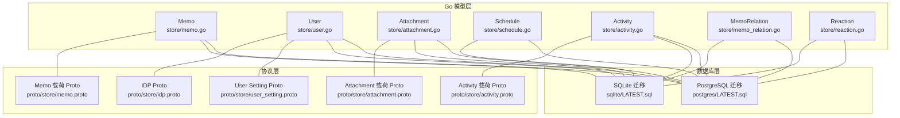
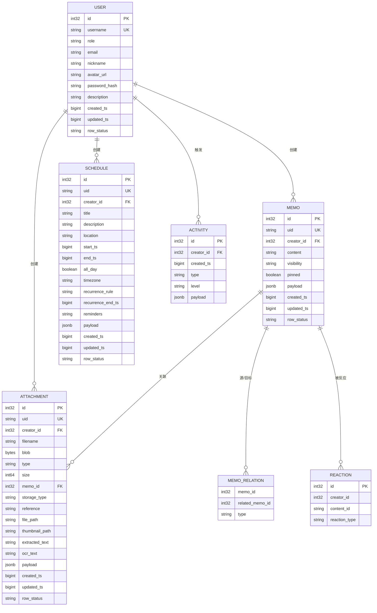
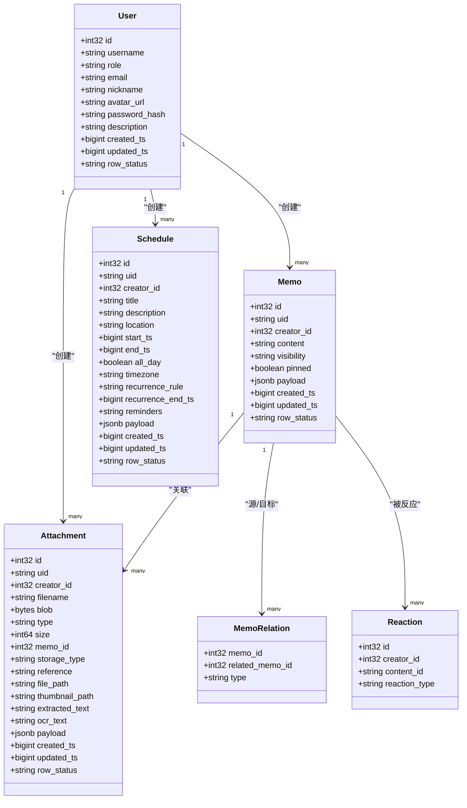

# 数据模型

<cite>
**本文引用的文件**
- [store/memo.go](file://store/memo.go)
- [store/user.go](file://store/user.go)
- [store/attachment.go](file://store/attachment.go)
- [store/schedule.go](file://store/schedule.go)
- [store/activity.go](file://store/activity.go)
- [store/memo_relation.go](file://store/memo_relation.go)
- [store/reaction.go](file://store/reaction.go)
- [store/migration/postgres/LATEST.sql](file://store/migration/postgres/LATEST.sql)
- [store/migration/sqlite/LATEST.sql](file://store/migration/sqlite/LATEST.sql)
- [proto/store/memo.proto](file://proto/store/memo.proto)
- [proto/store/attachment.proto](file://proto/store/attachment.proto)
- [proto/store/activity.proto](file://proto/store/activity.proto)
- [proto/store/user_setting.proto](file://proto/store/user_setting.proto)
- [proto/store/idp.proto](file://proto/store/idp.proto)
</cite>

## 目录
1. [简介](#简介)
2. [项目结构与数据模型定位](#项目结构与数据模型定位)
3. [核心数据实体总览](#核心数据实体总览)
4. [架构概览](#架构概览)
5. [详细实体分析](#详细实体分析)
6. [依赖与关系分析](#依赖与关系分析)
7. [性能与索引策略](#性能与索引策略)
8. [查询优化建议](#查询优化建议)
9. [数据模型演进指南](#数据模型演进指南)
10. [故障排查与常见问题](#故障排查与常见问题)
11. [结论](#结论)

## 简介
本文件系统化梳理 Memos 的核心数据模型，覆盖 Memo、User、Schedule、Attachment 及其关联实体（如 MemoRelation、Reaction、Activity），并结合数据库迁移脚本与 Proto 定义，说明实体属性、数据类型、约束与索引策略，给出查询优化与演进建议，帮助开发者在不破坏向后兼容的前提下进行安全迭代。

## 项目结构与数据模型定位
- 实体定义与业务模型：位于 store 层的 Go 结构体，统一抽象了领域对象与查询/更新参数。
- 数据库结构：通过迁移脚本定义 PostgreSQL 与 SQLite 的表结构、索引与约束。
- 协议与序列化：Proto 文件定义了跨语言传输的结构，用于服务间通信与持久化载荷。

图表来源
- [store/memo.go](file://store/memo.go#L35-L55)
- [store/user.go](file://store/user.go#L44-L60)
- [store/attachment.go](file://store/attachment.go#L15-L49)
- [store/schedule.go](file://store/schedule.go#L9-L27)
- [store/activity.go](file://store/activity.go#L29-L40)
- [store/migration/postgres/LATEST.sql](file://store/migration/postgres/LATEST.sql#L31-L44)
- [store/migration/postgres/LATEST.sql](file://store/migration/postgres/LATEST.sql#L59-L80)
- [store/migration/postgres/LATEST.sql](file://store/migration/postgres/LATEST.sql#L165-L192)
- [store/migration/sqlite/LATEST.sql](file://store/migration/sqlite/LATEST.sql#L32-L44)
- [store/migration/sqlite/LATEST.sql](file://store/migration/sqlite/LATEST.sql#L54-L69)
- [store/migration/sqlite/LATEST.sql](file://store/migration/sqlite/LATEST.sql#L110-L133)
- [proto/store/memo.proto](file://proto/store/memo.proto#L7-L27)
- [proto/store/attachment.proto](file://proto/store/attachment.proto#L10-L33)
- [proto/store/activity.proto](file://proto/store/activity.proto#L7-L14)

章节来源
- [store/migration/postgres/LATEST.sql](file://store/migration/postgres/LATEST.sql#L1-L301)
- [store/migration/sqlite/LATEST.sql](file://store/migration/sqlite/LATEST.sql#L1-L135)

## 核心数据实体总览
- Memo：笔记实体，包含内容、可见性、置顶、时间戳、行状态、UID、JSON 载荷等；支持按可见性、时间排序、分页等查询。
- User：用户实体，包含角色、邮箱、昵称、头像、密码哈希、描述等；支持按用户名、角色、邮箱等过滤。
- Schedule：日程实体，包含标题、描述、地点、起止时间、全天标记、时区、重复规则、提醒、JSON 载荷等；内置冲突检测约束。
- Attachment：附件实体，包含文件名、二进制内容或外部引用、类型、大小、存储类型、路径、OCR/提取文本、Memo 关联等；支持按存储类型、Memo 关联等过滤。
- Activity：活动实体，记录系统行为事件，包含类型、级别、JSON 载荷等。
- MemoRelation：笔记关系，支持“引用/评论”两类关系，建立双向引用能力。
- Reaction：反应/表情，记录对内容的反应类型，支持多条目去重。

章节来源
- [store/memo.go](file://store/memo.go#L35-L55)
- [store/user.go](file://store/user.go#L44-L60)
- [store/schedule.go](file://store/schedule.go#L9-L27)
- [store/attachment.go](file://store/attachment.go#L15-L49)
- [store/activity.go](file://store/activity.go#L29-L40)
- [store/memo_relation.go](file://store/memo_relation.go#L16-L20)
- [store/reaction.go](file://store/reaction.go#L7-L14)

## 架构概览
下图展示核心实体之间的关系与典型交互：

图表来源
- [store/migration/postgres/LATEST.sql](file://store/migration/postgres/LATEST.sql#L8-L21)
- [store/migration/postgres/LATEST.sql](file://store/migration/postgres/LATEST.sql#L31-L44)
- [store/migration/postgres/LATEST.sql](file://store/migration/postgres/LATEST.sql#L59-L80)
- [store/migration/postgres/LATEST.sql](file://store/migration/postgres/LATEST.sql#L165-L192)
- [store/migration/postgres/LATEST.sql](file://store/migration/postgres/LATEST.sql#L88-L96)
- [store/migration/postgres/LATEST.sql](file://store/migration/postgres/LATEST.sql#L51-L57)
- [store/migration/postgres/LATEST.sql](file://store/migration/postgres/LATEST.sql#L117-L125)

## 详细实体分析

### Memo 实体
- 设计理念
  - 以内容为中心，支持可见性控制（公开/受保护/私有）、置顶排序、时间戳与行状态管理。
  - 使用 JSONB 载荷承载富信息（如链接、任务列表、代码块、未完成任务等）与位置信息，便于扩展。
  - 支持向量嵌入列，配合 HNSW 索引实现语义检索。
- 关键属性与约束
  - 唯一标识：自增主键与 UID；UID 作为用户可读标识。
  - 时间与状态：created_ts、updated_ts、row_status；visibility 限定取值。
  - 载荷：payload 为 JSONB，默认空对象；同时存在 memo_embedding 向量列与索引。
- 查询与更新
  - 支持按 ID/UID、行状态、创建者、可见性列表、过滤条件、分页与排序（置顶优先、更新时间、时间顺序）。
  - 删除时清理关系与附件，确保数据一致性。
- 复杂度与性能
  - 常见查询：按创建者+可见性+时间范围；建议复合索引覆盖这些过滤条件。
  - 语义检索：依赖向量索引，需定期维护与批量更新嵌入。

章节来源
- [store/memo.go](file://store/memo.go#L35-L55)
- [store/memo.go](file://store/memo.go#L57-L82)
- [store/memo.go](file://store/memo.go#L93-L103)
- [store/migration/postgres/LATEST.sql](file://store/migration/postgres/LATEST.sql#L31-L44)
- [store/migration/postgres/LATEST.sql](file://store/migration/postgres/LATEST.sql#L46-L49)
- [proto/store/memo.proto](file://proto/store/memo.proto#L7-L27)

### User 实体
- 设计理念
  - 统一身份与权限模型，支持 HOST/ADMIN/USER 角色；内置系统机器人账户。
  - 提供标准字段与敏感信息（密码哈希）分离，便于安全处理。
- 关键属性与约束
  - 唯一约束：username 唯一；row_status 限定取值。
  - 角色与状态：role 限定枚举；默认 USER。
- 查询与缓存
  - 支持按 ID、用户名、角色、邮箱、昵称、过滤条件与上限限制。
  - 用户查询结果写入缓存，减少重复访问。

章节来源
- [store/user.go](file://store/user.go#L44-L60)
- [store/user.go](file://store/user.go#L77-L90)
- [store/user.go](file://store/user.go#L128-L152)
- [store/migration/postgres/LATEST.sql](file://store/migration/postgres/LATEST.sql#L8-L21)
- [store/migration/sqlite/LATEST.sql](file://store/migration/sqlite/LATEST.sql#L9-L22)

### Schedule 实体
- 设计理念
  - 全天/时间段/重复规则/提醒等日程要素统一建模；通过外键与约束保障数据完整性。
  - 冲突检测使用 GIST 排他约束，避免同一用户在时间区间内出现重叠日程。
- 关键属性与约束
  - 时间范围：start_ts 与 end_ts；end_ts 可为空表示全天或无结束。
  - 重复与提醒：recurrence_rule、reminders（JSON 字符串）；reminders JSON 校验。
  - 冲突约束：基于 tsrange 的排他约束，仅对 NORMAL 状态生效。
- 查询与更新
  - 支持按时间范围、创建者、状态与分页；提供解析与冲突判断工具方法。
  - 更新触发器自动更新 updated_ts。

章节来源
- [store/schedule.go](file://store/schedule.go#L9-L27)
- [store/schedule.go](file://store/schedule.go#L29-L51)
- [store/schedule.go](file://store/schedule.go#L53-L71)
- [store/migration/postgres/LATEST.sql](file://store/migration/postgres/LATEST.sql#L165-L192)
- [store/migration/postgres/LATEST.sql](file://store/migration/postgres/LATEST.sql#L199-L222)
- [store/migration/postgres/LATEST.sql](file://store/migration/postgres/LATEST.sql#L224-L235)

### Attachment 实体
- 设计理念
  - 支持本地文件系统、S3 与外部 URL 三种存储类型；可选二进制内容或引用。
  - 提供 OCR 与全文提取字段，便于检索与预览。
- 关键属性与约束
  - 存储类型：LOCAL/S3/EXTERNAL；存储类型与引用字段配合使用。
  - 关联关系：memo_id 可为空，表示未绑定到 Memo；存在索引加速查询。
  - 文本检索：extracted_text 与 ocr_text 的组合 GIN 索引，提升模糊匹配效率。
- 查询与删除
  - 支持按创建者、文件名、存储类型、是否有关联 Memo 等过滤；默认限制返回数量防止资源滥用。
  - 删除时根据存储类型清理物理文件，失败仅记录错误但不影响数据库记录删除。

章节来源
- [store/attachment.go](file://store/attachment.go#L15-L49)
- [store/attachment.go](file://store/attachment.go#L51-L65)
- [store/attachment.go](file://store/attachment.go#L67-L79)
- [store/attachment.go](file://store/attachment.go#L128-L153)
- [store/migration/postgres/LATEST.sql](file://store/migration/postgres/LATEST.sql#L59-L80)
- [store/migration/postgres/LATEST.sql](file://store/migration/postgres/LATEST.sql#L82-L86)
- [proto/store/attachment.proto](file://proto/store/attachment.proto#L10-L33)

### Activity 实体
- 设计理念
  - 记录系统关键事件（如评论），采用 JSONB 载荷扩展事件详情。
  - 类型与级别标准化，便于后续审计与统计。
- 关键属性
  - 类型：如 MEMO_COMMENT；级别：INFO 等。
  - 载荷：ActivityPayload，承载具体事件上下文。

章节来源
- [store/activity.go](file://store/activity.go#L29-L40)
- [store/activity.go](file://store/activity.go#L42-L45)
- [store/migration/postgres/LATEST.sql](file://store/migration/postgres/LATEST.sql#L88-L96)
- [proto/store/activity.proto](file://proto/store/activity.proto#L7-L14)

### MemoRelation 与 Reaction
- MemoRelation
  - 类型：REFERENCE/COMMENT；唯一索引覆盖三元组，避免重复关系。
  - 查询：支持按 MemoID、RelatedMemoID、类型与内容过滤。
- Reaction
  - 唯一索引覆盖 (creator_id, content_id, reaction_type)，保证单用户对单内容的反应唯一性。
  - 查询：支持按创建者、内容 ID 列表等过滤。

章节来源
- [store/memo_relation.go](file://store/memo_relation.go#L16-L20)
- [store/memo_relation.go](file://store/memo_relation.go#L22-L27)
- [store/reaction.go](file://store/reaction.go#L7-L14)
- [store/reaction.go](file://store/reaction.go#L16-L21)
- [store/migration/postgres/LATEST.sql](file://store/migration/postgres/LATEST.sql#L51-L57)
- [store/migration/postgres/LATEST.sql](file://store/migration/postgres/LATEST.sql#L117-L125)

## 依赖与关系分析
- 外键关系
  - Memo.creator_id → User.id（级联删除）
  - Attachment.creator_id → User.id（级联删除）
  - Schedule.creator_id → User.id（级联删除）
  - MemoRelation.memo_id → Memo.id；related_memo_id → Memo.id
  - Reaction.content_id 引用内容标识（非强约束，允许跨模块复用）
- 关系映射
  - 一对一/多对一：Attachment.memo_id 指向 Memo
  - 一对多：User → Memo/Attachment/Schedule；Memo → Attachment/MemoRelation/Reaction
  - 多对多：Memo ↔ Memo（通过 MemoRelation）

图表来源
- [store/migration/postgres/LATEST.sql](file://store/migration/postgres/LATEST.sql#L8-L21)
- [store/migration/postgres/LATEST.sql](file://store/migration/postgres/LATEST.sql#L31-L44)
- [store/migration/postgres/LATEST.sql](file://store/migration/postgres/LATEST.sql#L59-L80)
- [store/migration/postgres/LATEST.sql](file://store/migration/postgres/LATEST.sql#L165-L192)
- [store/migration/postgres/LATEST.sql](file://store/migration/postgres/LATEST.sql#L51-L57)
- [store/migration/postgres/LATEST.sql](file://store/migration/postgres/LATEST.sql#L117-L125)

## 性能与索引策略
- PostgreSQL 索引与约束
  - Memo：embedding 向量列 + HNSW 索引；payload JSONB 默认空对象。
  - Attachment：按 (creator_id, row_status)、type、memo_id（非空时）与文本 GIN 索引。
  - Schedule：按 (creator_id, start_ts)、(creator_id, row_status)、start_ts、uid；GIST tsrange 冲突检测；更新触发器自动更新 updated_ts。
  - MemoRelation：唯一索引 (memo_id, related_memo_id, type)。
  - Reaction：唯一索引 (creator_id, content_id, reaction_type)。
- SQLite 索引与约束
  - 与 PostgreSQL 对应表保持一致的字段与约束，使用 CHECK 与 UNIQUE 实现约束。
- 索引建议
  - Memo：按 creator_id + visibility + created_ts 的复合索引；对 payload 中高频查询字段考虑 GIN/BTree 索引。
  - Attachment：按 memo_id 建立索引以加速“某 Memo 的附件列表”查询。
  - Schedule：按 (creator_id, start_ts) 与 (creator_id, row_status) 复合索引，满足常用筛选与排序。
  - Activity：按 type/level/payload 字段按需建立索引，注意 JSONB 查询成本。

章节来源
- [store/migration/postgres/LATEST.sql](file://store/migration/postgres/LATEST.sql#L46-L49)
- [store/migration/postgres/LATEST.sql](file://store/migration/postgres/LATEST.sql#L82-L86)
- [store/migration/postgres/LATEST.sql](file://store/migration/postgres/LATEST.sql#L194-L197)
- [store/migration/postgres/LATEST.sql](file://store/migration/postgres/LATEST.sql#L199-L222)
- [store/migration/postgres/LATEST.sql](file://store/migration/postgres/LATEST.sql#L51-L57)
- [store/migration/postgres/LATEST.sql](file://store/migration/postgres/LATEST.sql#L117-L125)
- [store/migration/sqlite/LATEST.sql](file://store/migration/sqlite/LATEST.sql#L32-L44)
- [store/migration/sqlite/LATEST.sql](file://store/migration/sqlite/LATEST.sql#L54-L69)
- [store/migration/sqlite/LATEST.sql](file://store/migration/sqlite/LATEST.sql#L110-L133)

## 查询优化建议
- 避免全表扫描
  - 为高选择性的过滤条件（如 creator_id、visibility、memo_id）建立复合索引。
  - 对 JSONB 字段查询使用 GIN/BTree 索引，必要时将常用字段下沉为独立列。
- 控制返回规模
  - 附件列表默认限制数量，避免一次性加载过多大对象；按需开启 blob 获取。
- 时间范围查询
  - Schedule 与 Memo 的时间过滤应尽量结合索引列，避免函数包裹导致索引失效。
- 语义检索
  - 使用向量相似度查询时，合理设置 ef_search 与 m 参数，平衡召回与延迟。

章节来源
- [store/attachment.go](file://store/attachment.go#L93-L106)
- [store/migration/postgres/LATEST.sql](file://store/migration/postgres/LATEST.sql#L46-L49)
- [store/migration/postgres/LATEST.sql](file://store/migration/postgres/LATEST.sql#L194-L197)

## 数据模型演进指南
- 字段变更
  - 新增可选字段：先添加列与默认值，再逐步填充历史数据；避免阻塞迁移。
  - 修改现有字段：若涉及类型转换或长度限制，需分阶段执行（加列→迁移→回填→删旧列）。
- 表结构调整
  - 建议使用“零停机”方式：新增列/新表→数据迁移→切换读写→清理旧结构。
  - 对于索引与约束：先创建新索引/约束，再删除旧的，避免长时间锁表。
- 向后兼容性
  - JSONB 载荷：保持向后兼容，新增字段以可选形式存在；客户端/服务端对未知字段忽略。
  - UID：继续保留作为用户可读标识，避免破坏外部集成。
  - 触发器与约束：迁移脚本中明确注释约束用途，便于回滚与审计。
- 迁移脚本规范
  - 所有 DDL 变更需包含版本号与描述；在 LATEST.sql 中追加新版本迁移。
  - 对于 PostgreSQL：优先使用扩展（如 vector、btree_gist）与 GIST 排他约束；为新索引提供 WITH 参数说明。
  - 对于 SQLite：使用 CHECK/UNIQUE 等语法替代约束，保持跨引擎一致性。

章节来源
- [store/migration/postgres/LATEST.sql](file://store/migration/postgres/LATEST.sql#L295-L301)
- [store/migration/sqlite/LATEST.sql](file://store/migration/sqlite/LATEST.sql#L1-L7)
- [proto/store/memo.proto](file://proto/store/memo.proto#L7-L27)
- [proto/store/attachment.proto](file://proto/store/attachment.proto#L10-L33)

## 故障排查与常见问题
- 删除 Memo 时附件未清理
  - 现象：删除 Memo 后附件仍存在于数据库。
  - 处理：确认删除流程已调用清理逻辑；检查驱动层实现与事务边界。
- 附件删除未删除物理文件
  - 现象：数据库记录已删除，但本地文件残留。
  - 处理：检查存储类型与文件路径；确认删除流程中的文件系统操作权限与路径拼接。
- 日程冲突报错
  - 现象：插入/更新日程时报冲突。
  - 处理：确认冲突检测约束仅对 NORMAL 状态生效；检查时间范围与重复规则。
- JSONB 查询慢
  - 现象：payload 字段查询耗时较长。
  - 处理：为常用字段建立 GIN/BTree 索引；避免在 WHERE 中对 JSONB 字段做函数计算。

章节来源
- [store/memo.go](file://store/memo.go#L140-L159)
- [store/attachment.go](file://store/attachment.go#L128-L153)
- [store/migration/postgres/LATEST.sql](file://store/migration/postgres/LATEST.sql#L199-L222)
- [store/migration/postgres/LATEST.sql](file://store/migration/postgres/LATEST.sql#L82-L86)

## 结论
本文从实体设计、关系映射、索引策略与查询优化、演进与兼容性等方面系统梳理了 Memos 的核心数据模型。遵循本文建议可在保证功能完整性的同时，提升系统稳定性与可维护性，并为后续扩展打下坚实基础。