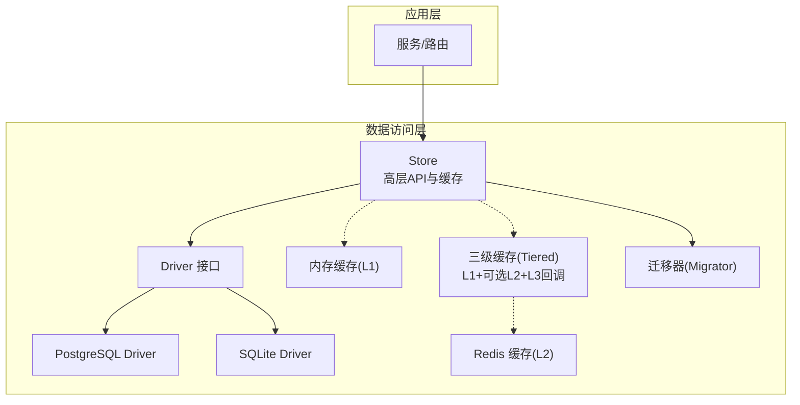
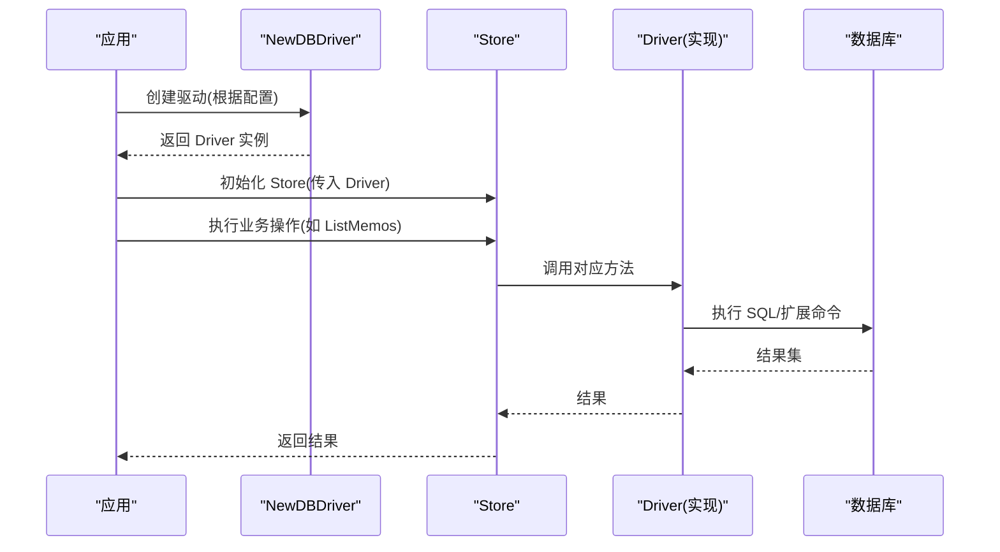
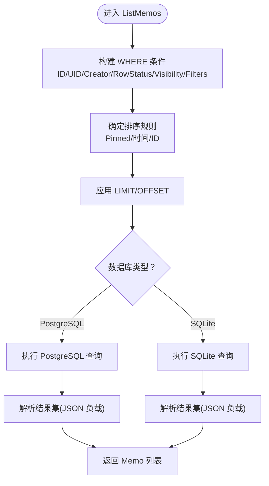
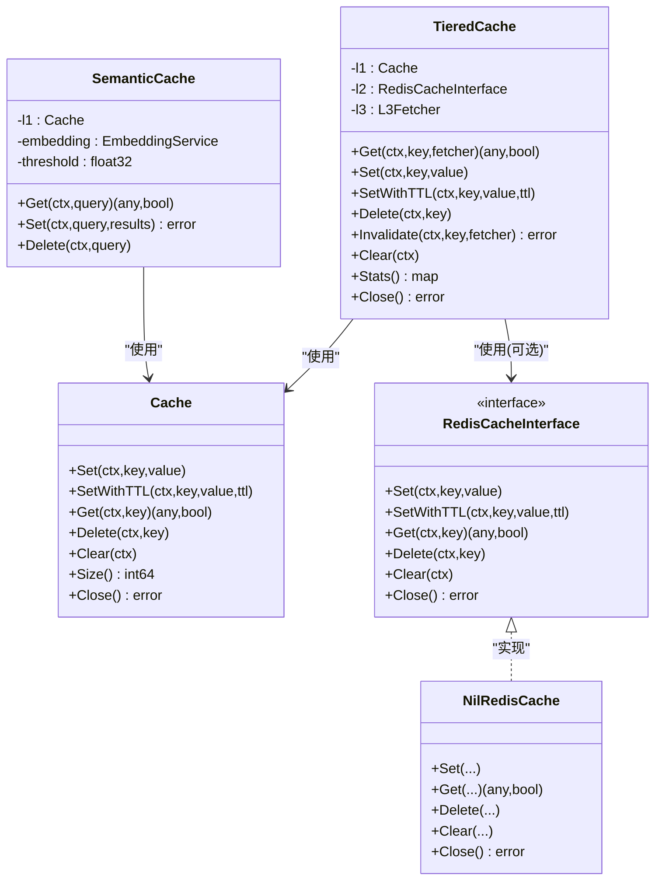
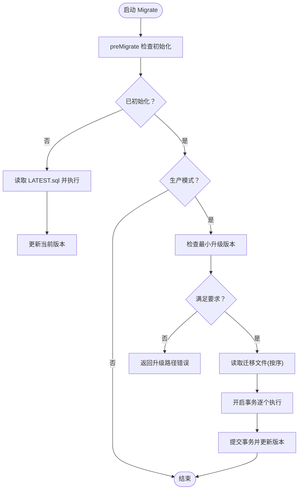
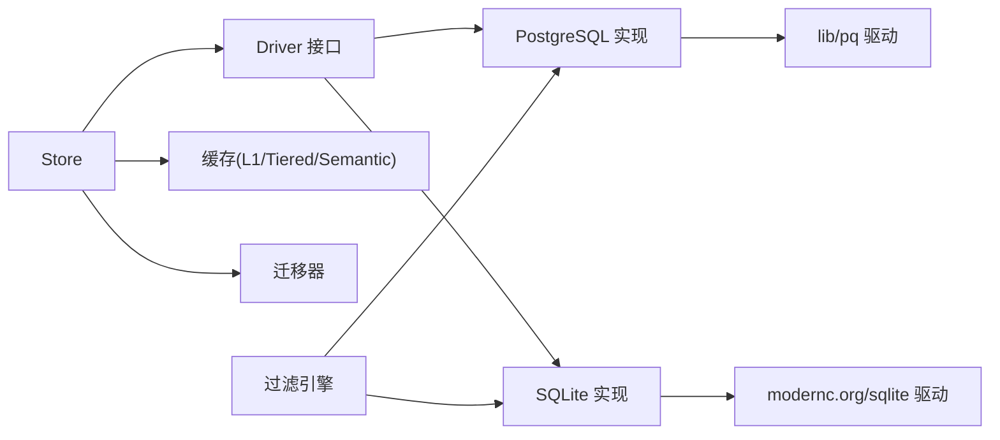

# 数据访问层

<cite>
**本文引用的文件**
- [store/driver.go](file://store/driver.go)
- [store/db/db.go](file://store/db/db.go)
- [store/store.go](file://store/store.go)
- [store/cache/cache.go](file://store/cache/cache.go)
- [store/cache/tiered.go](file://store/cache/tiered.go)
- [store/cache/redis.go](file://store/cache/redis.go)
- [store/migrator.go](file://store/migrator.go)
- [store/db/postgres/postgres.go](file://store/db/postgres/postgres.go)
- [store/db/sqlite/sqlite.go](file://store/db/sqlite/sqlite.go)
- [store/db/postgres/memo.go](file://store/db/postgres/memo.go)
- [store/db/sqlite/memo.go](file://store/db/sqlite/memo.go)
- [store/memo.go](file://store/memo.go)
- [store/user.go](file://store/user.go)
- [store/common.go](file://store/common.go)
- [plugin/filter/schema.go](file://plugin/filter/schema.go)
</cite>

## 目录
1. [简介](#简介)
2. [项目结构](#项目结构)
3. [核心组件](#核心组件)
4. [架构总览](#架构总览)
5. [详细组件分析](#详细组件分析)
6. [依赖关系分析](#依赖关系分析)
7. [性能考量](#性能考量)
8. [故障排查指南](#故障排查指南)
9. [结论](#结论)
10. [附录](#附录)

## 简介
本文件系统性梳理数据访问层的设计与实现，覆盖以下主题：
- 存储抽象层：统一的 Driver 接口与多数据库支持策略（PostgreSQL 与 SQLite）
- 功能支持范围与性能差异：两类数据库在 AI 能力、并发写入、全文检索等方面的差异
- 缓存策略：L1 内存缓存、可选 L2 Redis 分布式缓存、L3 数据库回调；以及语义缓存
- 数据库迁移管理：版本控制、迁移脚本组织、回滚策略与演示模式种子数据
- 数据模型设计原则与最佳实践：字段类型、可见性、JSON 负载、过滤表达式等

## 项目结构
数据访问层位于 store 目录，采用“抽象接口 + 多实现 + 统一入口”的分层设计：
- 抽象层：Driver 接口定义所有数据模型的 CRUD 与高级搜索能力
- 实现层：PostgreSQL 与 SQLite 各自提供 Driver 实现
- 统一层：db.go 根据配置选择具体 Driver；store.go 提供高层 API 与缓存集成
- 缓存层：内存 L1 缓存、可选 L2 Redis、L3 数据库回调；语义缓存用于向量相似检索
- 迁移层：migrator.go 统一处理初始化、增量迁移、版本跟踪与演示模式种子数据

图表来源
- [store/store.go](file://store/store.go#L11-L45)
- [store/driver.go](file://store/driver.go#L8-L102)
- [store/db/db.go](file://store/db/db.go#L27-L44)
- [store/cache/cache.go](file://store/cache/cache.go#L66-L90)
- [store/cache/tiered.go](file://store/cache/tiered.go#L28-L91)
- [store/migrator.go](file://store/migrator.go#L105-L146)

章节来源
- [store/db/db.go](file://store/db/db.go#L12-L25)
- [store/store.go](file://store/store.go#L11-L45)

## 核心组件
- Driver 接口：定义所有数据模型的增删改查与高级搜索方法，确保不同数据库实现的一致调用面
- Store 高层封装：持有 Driver 实例与缓存实例，提供统一的业务方法入口
- 缓存子系统：内存 L1 缓存、可选 L2 Redis、L3 数据库回调；语义缓存基于向量相似度
- 迁移器：负责数据库初始化、版本检查、增量迁移、版本更新与演示模式种子数据

章节来源
- [store/driver.go](file://store/driver.go#L8-L102)
- [store/store.go](file://store/store.go#L11-L45)
- [store/cache/cache.go](file://store/cache/cache.go#L66-L90)
- [store/cache/tiered.go](file://store/cache/tiered.go#L28-L91)
- [store/migrator.go](file://store/migrator.go#L105-L146)

## 架构总览
统一的 Driver 接口屏蔽了 PostgreSQL 与 SQLite 的差异，通过工厂函数按配置选择具体实现。Store 在 Driver 基础上提供缓存与常用组合操作；迁移器在启动阶段完成数据库初始化与版本升级。

图表来源
- [store/db/db.go](file://store/db/db.go#L27-L44)
- [store/store.go](file://store/store.go#L25-L45)
- [store/driver.go](file://store/driver.go#L16-L102)

## 详细组件分析

### 存储抽象层与多数据库支持
- 支持策略
  - 仅支持 PostgreSQL 与 SQLite；MySQL 已移除
  - 新功能优先在 PostgreSQL 完整实现，再评估是否在 SQLite 实现
- 统一接口
  - Driver 接口涵盖活动、附件、备忘、关系、实例设置、用户、用户设置、身份提供商、收件箱、反应、向量嵌入、日程、AI 对话与消息等模型的 CRUD 与高级搜索
- 工厂选择
  - 根据 profile.Driver 选择 sqlite 或 postgres，其他值返回错误

章节来源
- [store/db/db.go](file://store/db/db.go#L12-L25)
- [store/db/db.go](file://store/db/db.go#L27-L44)
- [store/driver.go](file://store/driver.go#L8-L102)

### PostgreSQL 实现
- 特性支持
  - 完整生产可用：CRUD、向量搜索(pgvector)、全文检索(tsvector/BM25)、混合检索(RRF融合)、高级 AI 能力、并发写入、复杂迁移
- 连接池优化
  - 最大连接数、空闲连接、连接生命周期与空闲超时针对个人助理场景优化
- 初始化检测
  - 通过 information_schema 检测表是否存在

章节来源
- [store/db/postgres/postgres.go](file://store/db/postgres/postgres.go#L17-L32)
- [store/db/postgres/postgres.go](file://store/db/postgres/postgres.go#L51-L62)
- [store/db/postgres/postgres.go](file://store/db/postgres/postgres.go#L81-L88)

### SQLite 实现
- 支持策略
  - 开发/测试用途的尽力而为支持：基础 CRUD、简单查询、单用户
  - 不支持并发写入、BM25/混合检索、高级 AI 能力、复杂迁移
- 连接池优化
  - 单连接、无生命周期限制，适配本地文件与 WAL 模式
- 初始化检测
  - 通过 sqlite_master 检测表是否存在

章节来源
- [store/db/sqlite/sqlite.go](file://store/db/sqlite/sqlite.go#L16-L36)
- [store/db/sqlite/sqlite.go](file://store/db/sqlite/sqlite.go#L71-L77)
- [store/db/sqlite/sqlite.go](file://store/db/sqlite/sqlite.go#L91-L99)

### 查询实现对比（以 Memo 为例）
- 共同点
  - 支持 ID/UID 列表、创建者、行状态、可见性列表、排除评论、排序与分页
  - 使用参数化查询防止注入
- 差异点
  - PostgreSQL 使用双引号标识符与信息模式检测
  - SQLite 使用反引号标识符与 sqlite_master 检测
  - PostgreSQL 支持更严格的 LIMIT 上限与 JSON 负载解析
  - SQLite 在某些高级特性（如混合检索）不可用时需降级或报错

图表来源
- [store/db/postgres/memo.go](file://store/db/postgres/memo.go#L51-L197)
- [store/db/sqlite/memo.go](file://store/db/sqlite/memo.go#L54-L192)

章节来源
- [store/db/postgres/memo.go](file://store/db/postgres/memo.go#L51-L197)
- [store/db/sqlite/memo.go](file://store/db/sqlite/memo.go#L54-L192)

### 缓存策略设计
- L1 内存缓存
  - 默认 TTL、清理周期、最大项数；过期与淘汰触发清理循环
  - 支持 Set/SetWithTTL/Get/Delete/Clear/Size/Close
- L2 Redis 缓存（可选）
  - 通过环境变量启用；提供接口但当前默认为 Nil 实现
  - 可扩展 Redis 实现（需要额外标签与依赖）
- L3 数据库回调
  - TieredCache 在 L1/L2 未命中时从 L3 回源加载并写入 L1/L2
- 语义缓存
  - 基于查询向量余弦相似度的语义命中，适合向量检索结果复用

图表来源
- [store/cache/cache.go](file://store/cache/cache.go#L66-L197)
- [store/cache/tiered.go](file://store/cache/tiered.go#L28-L91)
- [store/cache/tiered.go](file://store/cache/tiered.go#L113-L132)
- [store/cache/redis.go](file://store/cache/redis.go#L12-L30)
- [store/cache/redis.go](file://store/cache/redis.go#L116-L139)
- [store/cache/tiered.go](file://store/cache/tiered.go#L233-L330)

章节来源
- [store/cache/cache.go](file://store/cache/cache.go#L66-L197)
- [store/cache/tiered.go](file://store/cache/tiered.go#L28-L91)
- [store/cache/redis.go](file://store/cache/redis.go#L12-L30)

### 数据库迁移管理机制
- 初始化流程
  - 若未初始化，读取 LATEST.sql 并在一个事务中执行，随后更新当前版本
- 版本控制
  - 当前版本由内部版本模块计算，迁移文件按 minor 版本目录组织
- 增量迁移
  - 读取目标目录下所有迁移文件，按文件名序执行；每个迁移在单事务中保证原子性
- 版本检查
  - 生产模式下禁止降级；对极旧安装进行路径提示与强制中间版本升级
- 演示模式
  - 仅 SQLite 支持种子数据导入，其他数据库跳过

图表来源
- [store/migrator.go](file://store/migrator.go#L105-L146)
- [store/migrator.go](file://store/migrator.go#L220-L264)
- [store/migrator.go](file://store/migrator.go#L148-L218)
- [store/migrator.go](file://store/migrator.go#L374-L414)

章节来源
- [store/migrator.go](file://store/migrator.go#L105-L146)
- [store/migrator.go](file://store/migrator.go#L220-L264)
- [store/migrator.go](file://store/migrator.go#L148-L218)
- [store/migrator.go](file://store/migrator.go#L374-L414)

### 数据模型设计原则与最佳实践
- 字段与可见性
  - 使用 RowStatus 控制 NORMAL/ARCHIVED；Visibility 支持 PUBLIC/PROTECTED/PRIVATE
- JSON 负载
  - 使用 ProtoJSON 序列化/反序列化，允许部分字段与未知字段
- 过滤表达式
  - 通过过滤引擎生成跨方言的 WHERE 条件，PostgreSQL 与 SQLite 方言分别处理
- 关系与评论
  - 通过 memo_relation 表建立评论等关系，查询时左连接父备忘以返回 parent_uid
- 性能建议
  - 合理使用 LIMIT/OFFSET；避免在大结果集上进行昂贵的 JSON 路径扫描
  - 对高并发场景优先使用 PostgreSQL

章节来源
- [store/common.go](file://store/common.go#L12-L24)
- [store/memo.go](file://store/memo.go#L35-L55)
- [store/db/postgres/memo.go](file://store/db/postgres/memo.go#L116-L130)
- [store/db/sqlite/memo.go](file://store/db/sqlite/memo.go#L134-L137)
- [plugin/filter/schema.go](file://plugin/filter/schema.go#L99-L245)

## 依赖关系分析
- Store 依赖 Driver 接口，不直接依赖具体数据库实现
- Driver 实现依赖各自数据库驱动（lib/pq 与 modernc.org/sqlite）
- 缓存层与迁移器独立于 Driver，通过 Store 协同工作
- 过滤引擎与方言映射确保查询在不同数据库间一致

图表来源
- [store/store.go](file://store/store.go#L11-L45)
- [store/driver.go](file://store/driver.go#L8-L102)
- [store/db/postgres/postgres.go](file://store/db/postgres/postgres.go#L39-L71)
- [store/db/sqlite/sqlite.go](file://store/db/sqlite/sqlite.go#L46-L81)
- [plugin/filter/schema.go](file://plugin/filter/schema.go#L99-L245)

章节来源
- [store/store.go](file://store/store.go#L11-L45)
- [store/driver.go](file://store/driver.go#L8-L102)
- [store/db/postgres/postgres.go](file://store/db/postgres/postgres.go#L39-L71)
- [store/db/sqlite/sqlite.go](file://store/db/sqlite/sqlite.go#L46-L81)
- [plugin/filter/schema.go](file://plugin/filter/schema.go#L99-L245)

## 性能考量
- 连接池与并发
  - PostgreSQL：低资源占用下的响应优先，适合个人助理场景
  - SQLite：单连接 WAL 模式，避免并发写入冲突
- 查询性能
  - PostgreSQL 支持向量与 BM25 检索，适合大规模语义搜索
  - SQLite 不支持复杂检索，应简化查询条件
- 缓存收益
  - L1 内存缓存降低热点数据重复查询成本
  - TieredCache 在多实例场景可引入 Redis 提升命中率
- 迁移性能
  - LATEST.sql 快速初始化新库；增量迁移在事务内执行，保证一致性

[本节为通用性能讨论，无需特定文件引用]

## 故障排查指南
- 连接失败
  - 检查 DSN 是否正确；PostgreSQL 需要 lib/pq；SQLite 需要 modernc.org/sqlite
- 初始化失败
  - 查看 LATEST.sql 执行日志；确认数据库权限与表空间
- 迁移失败
  - 检查迁移文件命名与顺序；确认目标版本与当前版本关系
  - 生产模式禁止降级；极旧安装需先升级到中间版本
- 缓存问题
  - Redis 未启用时为 Nil 实现属预期；启用后检查地址/密码/键前缀
- 查询异常
  - 确认过滤表达式与方言映射；检查 LIMIT/OFFSET 合理性

章节来源
- [store/db/postgres/postgres.go](file://store/db/postgres/postgres.go#L44-L62)
- [store/db/sqlite/sqlite.go](file://store/db/sqlite/sqlite.go#L66-L81)
- [store/migrator.go](file://store/migrator.go#L105-L146)
- [store/migrator.go](file://store/migrator.go#L374-L414)
- [store/cache/redis.go](file://store/cache/redis.go#L78-L82)

## 结论
该数据访问层通过统一的 Driver 接口实现了 PostgreSQL 与 SQLite 的多数据库支持，兼顾开发效率与生产可用性。配合三层缓存与完善的迁移机制，既满足个人使用场景，也为未来扩展 AI 能力与多实例部署打下基础。建议在生产环境优先选用 PostgreSQL，并结合缓存与合理的查询设计提升性能。

[本节为总结性内容，无需特定文件引用]

## 附录
- 数据模型要点
  - Memo：包含 UID、创建者、可见性、内容、JSON 负载、排序字段
  - User：角色与认证相关字段，支持系统机器人
  - 过滤表达式：支持内容、创建者、时间戳、可见性、标签等字段
- 最佳实践
  - 优先在 PostgreSQL 实现新功能；SQLite 仅在高 ROI 场景实现
  - 合理设置缓存 TTL 与容量；对热点数据启用 L1/L2
  - 迁移前备份数据库；生产环境严格遵循版本升级路径

[本节为补充说明，无需特定文件引用]