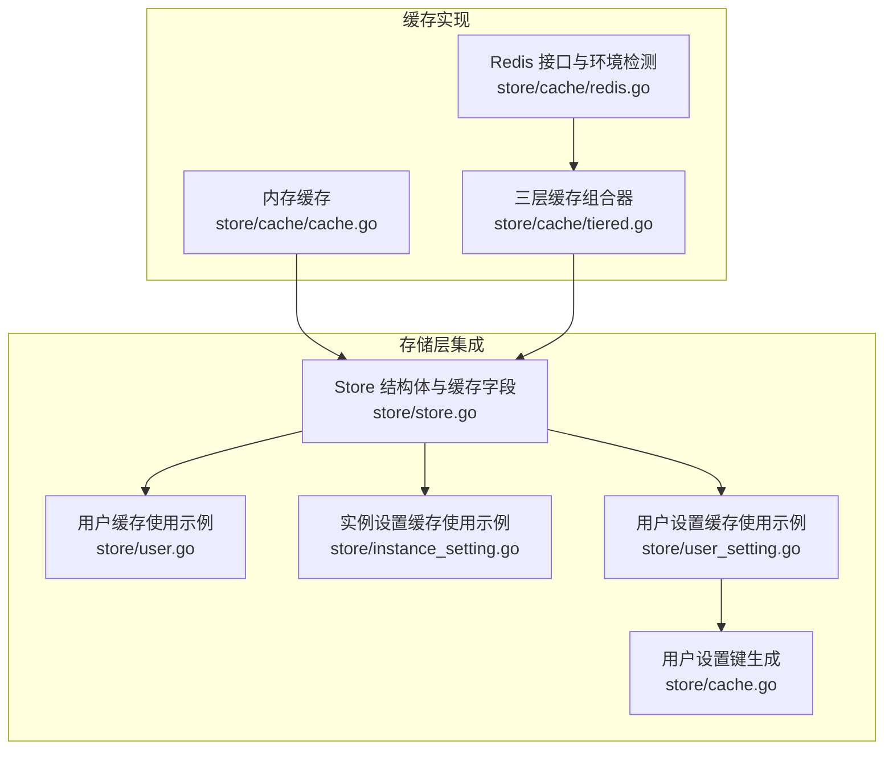
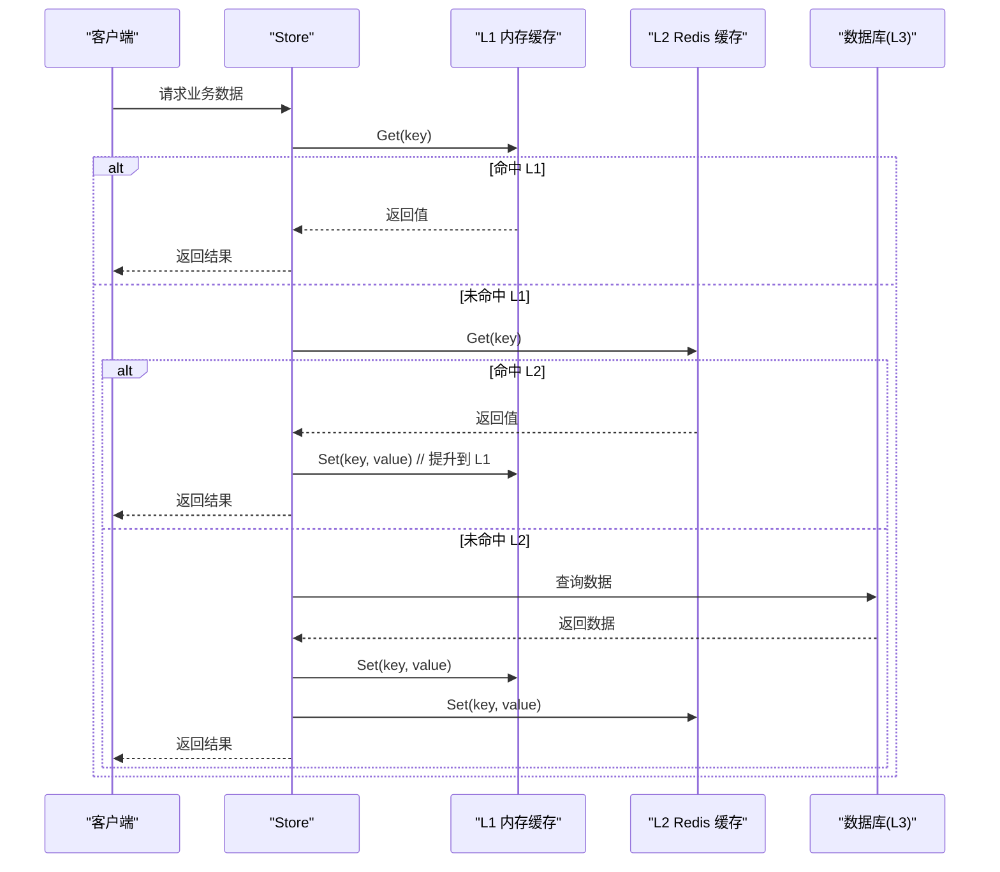
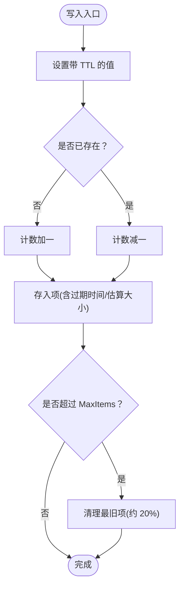
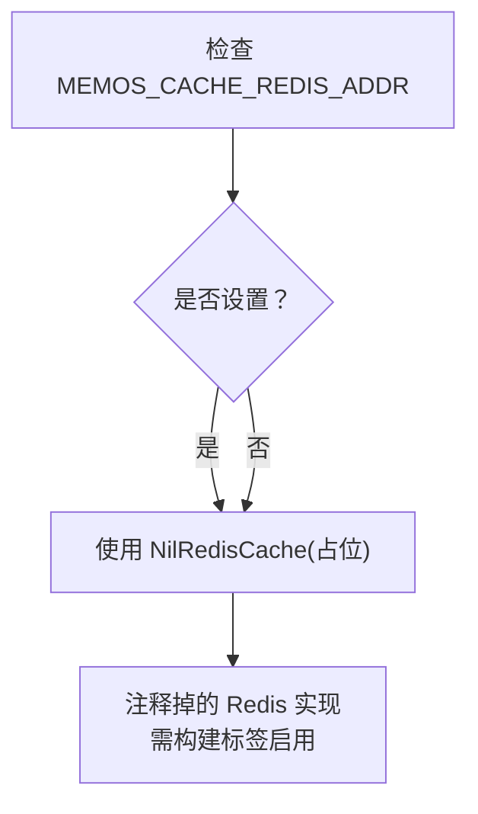
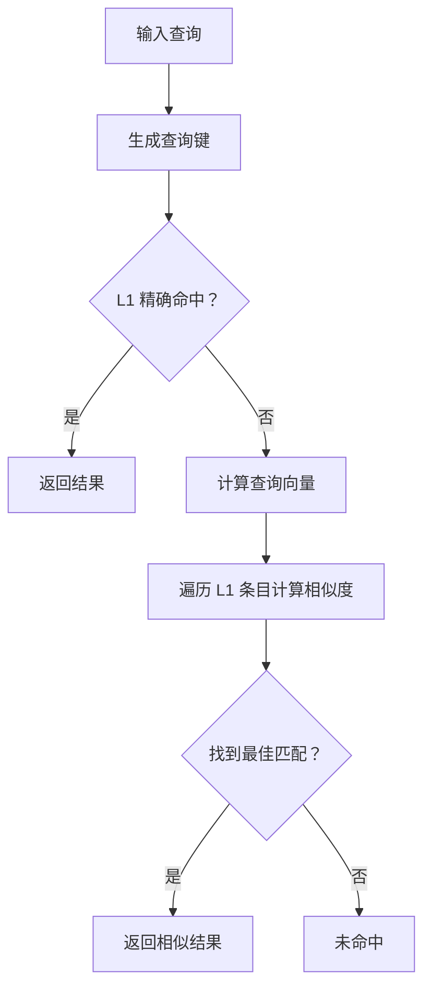
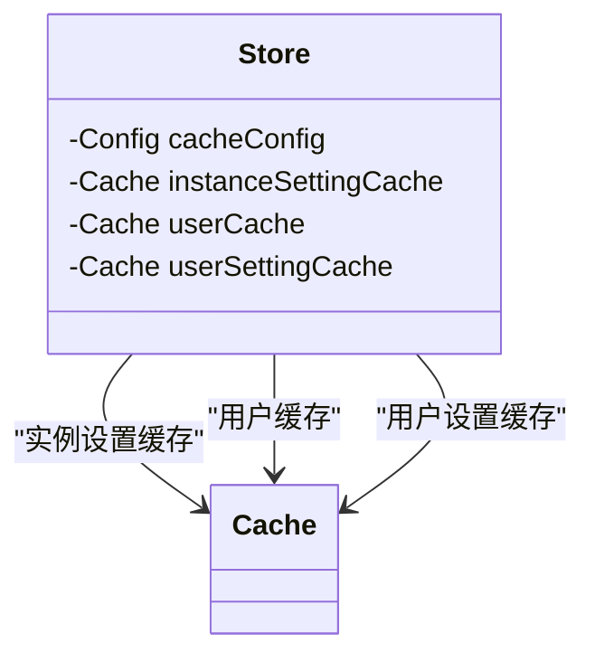
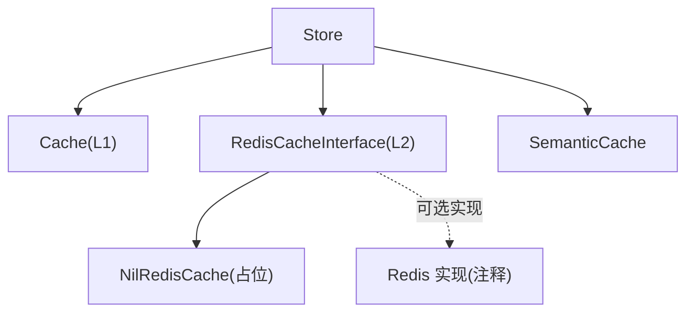

# 缓存策略

<cite>
**本文引用的文件列表**
- [store/cache/cache.go](file://store/cache/cache.go)
- [store/cache/tiered.go](file://store/cache/tiered.go)
- [store/cache/redis.go](file://store/cache/redis.go)
- [store/store.go](file://store/store.go)
- [store/user.go](file://store/user.go)
- [store/instance_setting.go](file://store/instance_setting.go)
- [store/user_setting.go](file://store/user_setting.go)
- [store/cache.go](file://store/cache.go)
</cite>

## 目录
1. [简介](#简介)
2. [项目结构与缓存相关模块](#项目结构与缓存相关模块)
3. [核心组件](#核心组件)
4. [架构总览](#架构总览)
5. [详细组件分析](#详细组件分析)
6. [依赖关系分析](#依赖关系分析)
7. [性能考量与调优建议](#性能考量与调优建议)
8. [监控与故障排除](#监控与故障排除)
9. [结论](#结论)

## 简介
本文件系统化梳理本项目的缓存策略与实现，重点覆盖三层缓存架构（L1 内存缓存、会话缓存、分布式缓存 L2），以及语义缓存（Semantic Cache）。文档围绕以下目标展开：
- 多级缓存设计理念与分层职责
- 缓存配置参数的含义与调优方法（TTL、清理间隔、最大项数）
- 不同类型缓存的使用场景与落地实现（实例设置缓存、用户缓存、用户设置缓存）
- 缓存性能监控与故障排除（命中率、内存使用优化）

## 项目结构与缓存相关模块
缓存能力主要集中在 store/cache 子目录，并在 store 层通过字段注入的方式为不同领域对象提供缓存能力：
- store/cache/cache.go：单机内存缓存实现，具备 TTL、清理循环、逐出回调等特性
- store/cache/tiered.go：三层缓存（L1/L2/L3）组合器，支持 L1 内存缓存与可选 L2 Redis 分布式缓存
- store/cache/redis.go：Redis 接口定义与环境变量驱动的启用逻辑（注释掉默认实现，需构建标签启用）
- store/store.go：在 Store 中注入三类缓存（实例设置、用户、用户设置）
- store/user.go、store/instance_setting.go、store/user_setting.go：具体业务对缓存的使用示例
- store/cache.go：用户设置缓存键生成工具函数



图表来源
- [store/cache/cache.go](file://store/cache/cache.go#L66-L90)
- [store/cache/tiered.go](file://store/cache/tiered.go#L17-L91)
- [store/cache/redis.go](file://store/cache/redis.go#L12-L82)
- [store/store.go](file://store/store.go#L12-L45)
- [store/user.go](file://store/user.go#L128-L152)
- [store/instance_setting.go](file://store/instance_setting.go#L81-L100)
- [store/user_setting.go](file://store/user_setting.go#L79-L103)
- [store/cache.go](file://store/cache.go#L7-L9)

章节来源
- [store/cache/cache.go](file://store/cache/cache.go#L66-L90)
- [store/cache/tiered.go](file://store/cache/tiered.go#L17-L91)
- [store/cache/redis.go](file://store/cache/redis.go#L12-L82)
- [store/store.go](file://store/store.go#L12-L45)

## 核心组件
- 内存缓存（L1）：基于并发 map 的线程安全缓存，支持默认 TTL、清理周期、逐出回调、按项数阈值触发“最旧项”清理
- 三层缓存组合器（L1/L2/L3）：优先 L1，其次 L2（可选 Redis），最后回源数据库（Fetcher）
- 语义缓存（Semantic Cache）：基于向量相似度的查询结果缓存，支持近似匹配
- Store 注入的三类缓存：实例设置缓存、用户缓存、用户设置缓存

章节来源
- [store/cache/cache.go](file://store/cache/cache.go#L66-L90)
- [store/cache/tiered.go](file://store/cache/tiered.go#L17-L91)
- [store/store.go](file://store/store.go#L12-L45)

## 架构总览
下图展示三层缓存的读取路径与回源策略，以及 Store 对三类业务缓存的注入位置。



图表来源
- [store/cache/tiered.go](file://store/cache/tiered.go#L93-L132)
- [store/cache/redis.go](file://store/cache/redis.go#L12-L30)
- [store/store.go](file://store/store.go#L12-L45)

## 详细组件分析

### 组件一：内存缓存（L1）
- 设计要点
  - 使用并发 map 存储键值，原子计数维护大小，避免重复计数
  - 定时清理任务按清理间隔扫描过期项；当超过最大项数阈值时，按“最旧项”批量清理
  - 支持逐出回调，便于外部统计或日志
  - 键值项包含过期时间与估算大小，用于内存管理
- 关键配置参数
  - DefaultTTL：默认过期时间
  - CleanupInterval：清理周期
  - MaxItems：最大项数阈值
  - OnEviction：逐出回调
- 性能特征
  - 读写为 O(1)，清理为 O(n) 遍历
  - 最旧项清理采用“候选集替换”策略，减少全表扫描成本



图表来源
- [store/cache/cache.go](file://store/cache/cache.go#L97-L120)
- [store/cache/cache.go](file://store/cache/cache.go#L252-L313)

章节来源
- [store/cache/cache.go](file://store/cache/cache.go#L66-L90)
- [store/cache/cache.go](file://store/cache/cache.go#L97-L120)
- [store/cache/cache.go](file://store/cache/cache.go#L252-L313)

### 组件二：三层缓存组合器（L1/L2/L3）
- 设计理念
  - L1：本地内存缓存，命中最快，容量小
  - L2：可选 Redis 分布式缓存，跨进程共享，持久性更好
  - L3：数据库回源，保证一致性
- 默认行为
  - 个人系统默认启用 L1，禁用 L2
  - L2 可通过环境变量自动启用
- 关键接口
  - Get：按 L1→L2→L3 顺序查找，命中后提升到 L1
  - Set/SetWithTTL/Delete/Clear/Invalidate/Stats/Close
- 与语义缓存的关系
  - 语义缓存独立于三层缓存，但同样基于 L1 内存缓存

```mermaid
classDiagram
class TieredCache {
-Cache l1
-RedisCacheInterface l2
-bool l1Enabled
-bool l2Enabled
+Get(ctx, key, fetcher) (any, bool)
+Set(ctx, key, value)
+SetWithTTL(ctx, key, value, ttl)
+Delete(ctx, key)
+Invalidate(ctx, key, fetcher) error
+Clear(ctx)
+Stats() map[string]interface{}
+Close() error
}
class Cache {
+Set(ctx, key, value)
+SetWithTTL(ctx, key, value, ttl)
+Get(ctx, key) (any, bool)
+Delete(ctx, key)
+Clear(ctx)
+Size() int64
+Close() error
}
class RedisCacheInterface {
<<interface>>
+Set(ctx, key, value)
+SetWithTTL(ctx, key, value, ttl)
+Get(ctx, key) (any, bool)
+Delete(ctx, key)
+Clear(ctx)
+Close() error
}
TieredCache --> Cache : "使用 L1"
TieredCache --> RedisCacheInterface : "使用 L2(可选)"
```

图表来源
- [store/cache/tiered.go](file://store/cache/tiered.go#L17-L91)
- [store/cache/cache.go](file://store/cache/cache.go#L66-L90)
- [store/cache/redis.go](file://store/cache/redis.go#L12-L30)

章节来源
- [store/cache/tiered.go](file://store/cache/tiered.go#L17-L91)
- [store/cache/tiered.go](file://store/cache/tiered.go#L93-L132)
- [store/cache/tiered.go](file://store/cache/tiered.go#L134-L187)
- [store/cache/tiered.go](file://store/cache/tiered.go#L189-L231)

### 组件三：Redis 缓存接口与启用逻辑
- 接口设计
  - RedisCacheInterface 定义了 Set/Get/Delete/Clear/Close 等操作
  - 默认实现为 NilRedisCache（无操作），允许在不启用 Redis 的情况下运行
- 启用方式
  - 通过环境变量 MEMOS_CACHE_REDIS_ADDR 判断是否启用 L2
  - 注释中提供了完整实现（需构建标签启用）
- 键空间与前缀
  - 提供键生成与哈希函数，支持带哈希的唯一键



图表来源
- [store/cache/redis.go](file://store/cache/redis.go#L78-L82)
- [store/cache/redis.go](file://store/cache/redis.go#L116-L139)
- [store/cache/redis.go](file://store/cache/redis.go#L141-L271)

章节来源
- [store/cache/redis.go](file://store/cache/redis.go#L12-L30)
- [store/cache/redis.go](file://store/cache/redis.go#L56-L82)
- [store/cache/redis.go](file://store/cache/redis.go#L92-L114)

### 组件四：语义缓存（Semantic Cache）
- 设计目标
  - 对自然语言查询进行向量嵌入，基于余弦相似度返回语义相近的历史结果
- 关键流程
  - 先尝试精确键命中，再尝试语义相似度匹配
  - 将查询、嵌入与结果封装为条目，存入 L1 内存缓存
- 配置
  - 阈值（threshold）控制相似度门槛，默认 0.95
  - 最大项数限制 L1 容量



图表来源
- [store/cache/tiered.go](file://store/cache/tiered.go#L263-L304)
- [store/cache/tiered.go](file://store/cache/tiered.go#L346-L382)

章节来源
- [store/cache/tiered.go](file://store/cache/tiered.go#L233-L339)

### 组件五：Store 注入的三类缓存与使用场景
- Store 中注入的缓存
  - instanceSettingCache：实例设置缓存
  - userCache：用户缓存
  - userSettingCache：用户设置缓存
- 使用场景
  - 实例设置缓存：频繁读取实例基础/通用/存储/相关设置，避免每次访问数据库
  - 用户缓存：用户列表与详情的热点数据缓存
  - 用户设置缓存：用户快捷键、通用设置、令牌、Webhook 等个性化配置的缓存



图表来源
- [store/store.go](file://store/store.go#L12-L45)

章节来源
- [store/store.go](file://store/store.go#L12-L45)
- [store/instance_setting.go](file://store/instance_setting.go#L81-L100)
- [store/user.go](file://store/user.go#L128-L152)
- [store/user_setting.go](file://store/user_setting.go#L79-L103)

## 依赖关系分析
- 组件耦合
  - Store 与内存缓存 Cache 强耦合，通过字段持有
  - 三层缓存组合器与 Redis 接口弱耦合，通过接口抽象实现可插拔
- 外部依赖
  - Redis 接口为可选依赖，通过环境变量与构建标签控制启用
- 潜在风险
  - L2 Redis 当前为占位实现，若直接使用三层缓存组合器，实际不会生效
  - 语义缓存与三层缓存并行存在，需避免重复缓存同一查询



图表来源
- [store/store.go](file://store/store.go#L12-L45)
- [store/cache/redis.go](file://store/cache/redis.go#L116-L139)
- [store/cache/tiered.go](file://store/cache/tiered.go#L17-L91)

章节来源
- [store/store.go](file://store/store.go#L12-L45)
- [store/cache/redis.go](file://store/cache/redis.go#L116-L139)
- [store/cache/tiered.go](file://store/cache/tiered.go#L17-L91)

## 性能考量与调优建议
- 参数调优
  - DefaultTTL：根据业务热点周期调整。高频短期数据可缩短 TTL，降低陈旧数据占比
  - CleanupInterval：过短会增加 CPU 开销，过长会导致过期项滞留。建议与 TTL 成比例
  - MaxItems：结合内存预算与访问模式设定。当命中率下降时，适当提高以减少逐出
- 清理策略
  - L1：按阈值触发“最旧项”清理，避免全表扫描；建议配合合理的 TTL 与 MaxItems
  - L2：当前为占位实现，启用 Redis 后应关注键空间增长与内存占用
- 命中率与可观测性
  - 当前统计接口返回 0（命中率/逐出计数未实现），建议在 Cache 结构中引入原子计数器以支持命中率统计
- 内存使用优化
  - 估算值仅作为粗略参考，建议结合实际对象大小与序列化开销评估
  - 对大对象（如设置项）建议压缩或拆分缓存键，降低内存碎片

章节来源
- [store/cache/cache.go](file://store/cache/cache.go#L41-L64)
- [store/cache/cache.go](file://store/cache/cache.go#L217-L250)
- [store/cache/tiered.go](file://store/cache/tiered.go#L409-L446)

## 监控与故障排除
- 监控指标
  - L1/L2/L3 大小与启用状态：通过 Stats 获取
  - 命中率：当前未实现，建议扩展 Cache 结构以记录命中/未命中计数
  - Redis 状态：键数量、内存占用、键空间（启用 Redis 后）
- 故障排除
  - L2 未生效：确认 MEMOS_CACHE_REDIS_ADDR 是否设置；当前实现为占位，需启用注释实现
  - 命中率低：检查 TTL 是否过短导致频繁失效；检查 MaxItems 是否过小；核对键生成是否稳定
  - 内存增长：检查对象大小估算与序列化体积；考虑降低 MaxItems 或缩短 TTL
  - 语义缓存误判：调整相似度阈值；确保嵌入模型稳定一致

章节来源
- [store/cache/tiered.go](file://store/cache/tiered.go#L189-L208)
- [store/cache/tiered.go](file://store/cache/tiered.go#L410-L446)
- [store/cache/redis.go](file://store/cache/redis.go#L78-L82)

## 结论
本项目采用“三层缓存 + 语义缓存”的混合策略：L1 内存缓存提供极致性能，L2 Redis 为可选的跨进程共享与持久化缓存，L3 数据库保障一致性。Store 层对实例设置、用户、用户设置三类热点数据分别注入缓存，显著降低数据库压力。当前实现中，L2 Redis 为占位实现，建议在生产环境中启用真实 Redis 实现并完善命中率统计与内存监控，以获得更稳健的性能表现。