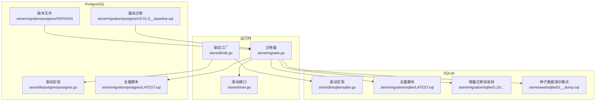
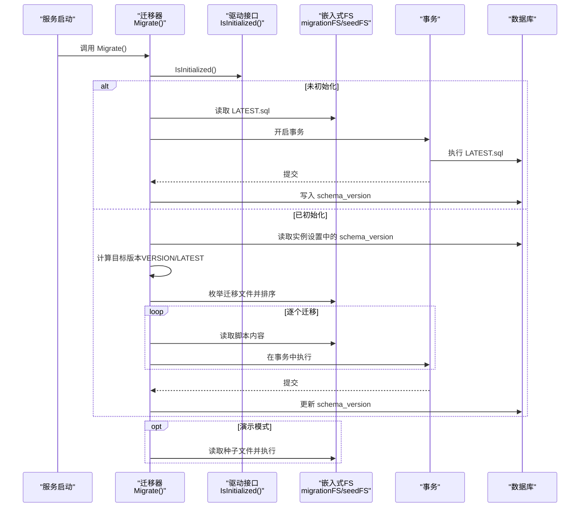
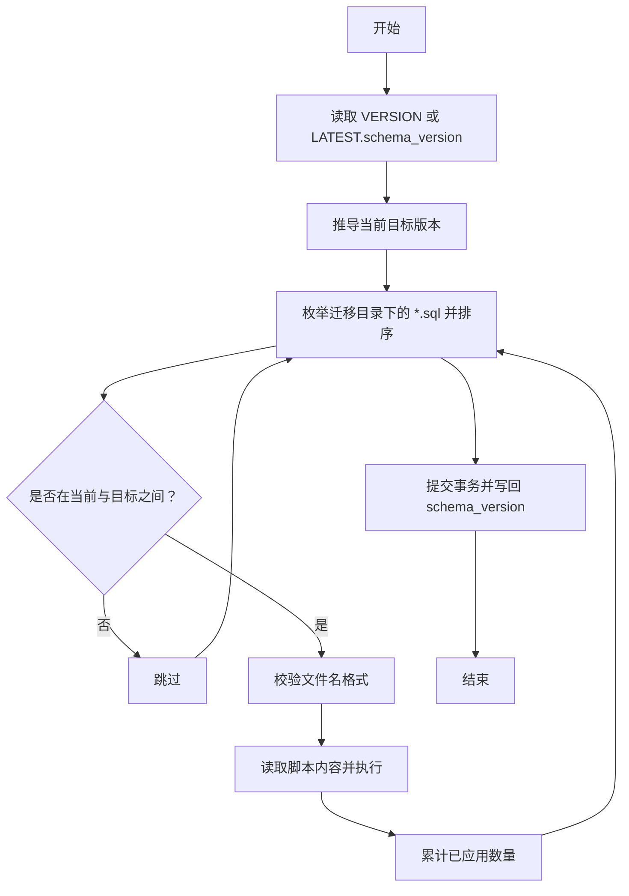
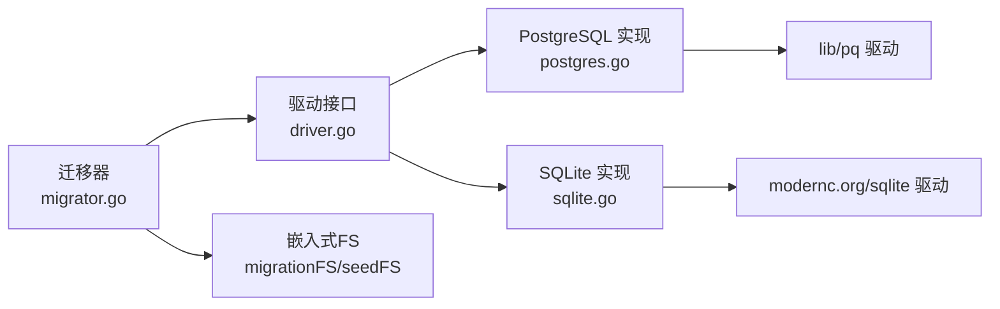

# 迁移管理

<cite>
**本文引用的文件**
- [migrator.go](file://store/migrator.go)
- [db.go](file://store/db/db.go)
- [driver.go](file://store/driver.go)
- [postgres.go](file://store/db/postgres/postgres.go)
- [sqlite.go](file://store/db/sqlite/sqlite.go)
- [LATEST.sql（PostgreSQL）](file://store/migration/postgres/LATEST.sql)
- [LATEST.sql（SQLite）](file://store/migration/sqlite/LATEST.sql)
- [VERSION（PostgreSQL）](file://store/migration/postgres/VERSION)
- [V0.51.0__baseline.sql](file://store/migration/postgres/V0.51.0__baseline.sql)
- [validate-migration.sh](file://scripts/validate-migration.sh)
- [01__dump.sql（种子数据）](file://store/seed/sqlite/01__dump.sql)
- [00__activity.sql（SQLite 增量迁移）](file://store/migration/sqlite/0.10/00__activity.sql)
- [00__webhook.sql（SQLite 增量迁移）](file://store/migration/sqlite/0.18/00__webhook.sql)
- [01__user_setting.sql（SQLite 增量迁移）](file://store/migration/sqlite/0.18/01__user_setting.sql)
</cite>

## 目录
1. [简介](#简介)
2. [项目结构](#项目结构)
3. [核心组件](#核心组件)
4. [架构总览](#架构总览)
5. [详细组件分析](#详细组件分析)
6. [依赖关系分析](#依赖关系分析)
7. [性能考量](#性能考量)
8. [故障排除指南](#故障排除指南)
9. [结论](#结论)
10. [附录](#附录)

## 简介
本文件系统化阐述数据库迁移管理的设计与实现，覆盖版本控制机制、迁移脚本组织与执行顺序、PostgreSQL 与 SQLite 的差异、迁移策略与最佳实践、故障排除与生产部署注意事项。目标是帮助开发者在不深入源码的情况下理解迁移体系，并在实际环境中安全地进行升级与维护。

## 项目结构
迁移系统由“运行时迁移器”和“嵌入式迁移脚本”两部分组成：
- 运行时迁移器：负责预检查、版本比较、增量应用、事务原子化提交、版本写回等。
- 嵌入式脚本：按目录层级组织，包含 PostgreSQL 与 SQLite 的全量 LATEST.sql 以及 SQLite 的增量迁移目录树。

图表来源
- [migrator.go](file://store/migrator.go#L105-L146)
- [db.go](file://store/db/db.go#L27-L44)
- [driver.go](file://store/driver.go#L10-L102)
- [postgres.go](file://store/db/postgres/postgres.go#L34-L89)
- [sqlite.go](file://store/db/sqlite/sqlite.go#L38-L100)
- [LATEST.sql（PostgreSQL）](file://store/migration/postgres/LATEST.sql#L295-L301)
- [LATEST.sql（SQLite）](file://store/migration/sqlite/LATEST.sql#L1-L135)
- [VERSION（PostgreSQL）](file://store/migration/postgres/VERSION#L1-L2)
- [V0.51.0__baseline.sql](file://store/migration/postgres/V0.51.0__baseline.sql#L1-L127)
- [01__dump.sql（种子数据）](file://store/seed/sqlite/01__dump.sql#L1-L40)

章节来源
- [migrator.go](file://store/migrator.go#L1-L415)
- [db.go](file://store/db/db.go#L1-L45)
- [driver.go](file://store/driver.go#L1-L103)
- [postgres.go](file://store/db/postgres/postgres.go#L1-L89)
- [sqlite.go](file://store/db/sqlite/sqlite.go#L1-L100)

## 核心组件
- 迁移器（Store.Migrate/applyMigrations/preMigrate）
  - 预迁移：若未初始化则一次性应用 LATEST.sql 并写入当前版本。
  - 生产模式：读取实例设置中的 schema_version，与目标版本比对后按序增量应用。
  - 演示模式：仅对 SQLite 应用种子数据。
- 驱动接口与工厂
  - 统一抽象 Driver 接口，通过工厂根据配置选择 PostgreSQL 或 SQLite 实现。
- 版本与命名规范
  - 文件名格式：NN__description.sql；排序基于字典序。
  - 版本号推导：minor/patch 由路径与文件名推断；最新版本来自 VERSION 文件或 LATEST.sql 中的 schema_version。
- 事务与原子性
  - 所有迁移在单个事务中执行，失败自动回滚，成功后更新 system_setting 中的 schema_version。

章节来源
- [migrator.go](file://store/migrator.go#L105-L146)
- [migrator.go](file://store/migrator.go#L148-L218)
- [migrator.go](file://store/migrator.go#L220-L264)
- [migrator.go](file://store/migrator.go#L310-L323)
- [migrator.go](file://store/migrator.go#L325-L346)
- [migrator.go](file://store/migrator.go#L357-L372)
- [db.go](file://store/db/db.go#L27-L44)
- [driver.go](file://store/driver.go#L10-L102)

## 架构总览
迁移流程分为三个阶段：预迁移、增量迁移、演示模式种子数据。下图展示了关键调用链与数据流。

图表来源
- [migrator.go](file://store/migrator.go#L105-L146)
- [migrator.go](file://store/migrator.go#L148-L218)
- [migrator.go](file://store/migrator.go#L220-L264)
- [postgres.go](file://store/db/postgres/postgres.go#L81-L88)
- [sqlite.go](file://store/db/sqlite/sqlite.go#L91-L99)

## 详细组件分析

### 版本控制与命名规范
- 命名约定
  - 文件名必须以“NN__描述.sql”，其中 NN 是零填充的序号，用于保证字典序即执行序。
  - LATEST.sql 为新安装的全量脚本，包含当前 schema_version。
- 版本推导
  - 当前版本：从 VERSION 文件或 LATEST.sql 的 schema_version 推导。
  - 迁移版本：从文件路径的 minor 版本段与文件名序号推导。
- 版本比较
  - 使用版本工具函数进行大于/大于等于比较，确保只应用目标版本之间的变更。

图表来源
- [migrator.go](file://store/migrator.go#L88-L103)
- [migrator.go](file://store/migrator.go#L175-L204)
- [migrator.go](file://store/migrator.go#L310-L346)
- [VERSION（PostgreSQL）](file://store/migration/postgres/VERSION#L1-L2)
- [LATEST.sql（PostgreSQL）](file://store/migration/postgres/LATEST.sql#L295-L301)

章节来源
- [migrator.go](file://store/migrator.go#L88-L103)
- [migrator.go](file://store/migrator.go#L310-L346)
- [VERSION（PostgreSQL）](file://store/migration/postgres/VERSION#L1-L2)
- [LATEST.sql（PostgreSQL）](file://store/migration/postgres/LATEST.sql#L295-L301)

### 迁移执行顺序与原子性
- 扫描与排序
  - 通过嵌入式文件系统枚举迁移文件，按字典序排序，确保稳定且可重复的执行顺序。
- 事务模型
  - 对每个迁移批次开启单事务，全部成功才提交；任一失败即回滚，避免中间态污染。
- 版本写回
  - 成功迁移后更新 system_setting 中的 schema_version，作为下次迁移的起点。

章节来源
- [migrator.go](file://store/migrator.go#L150-L204)
- [migrator.go](file://store/migrator.go#L157-L218)
- [migrator.go](file://store/migrator.go#L357-L372)

### PostgreSQL 与 SQLite 的差异
- 支持范围
  - PostgreSQL：生产全量支持，包含向量搜索、全文检索、混合检索、并发写入、复杂迁移。
  - SQLite：开发/测试支持，受限于并发写入、无全文/BM25/混合检索、不支持复杂迁移。
- 全量脚本差异
  - PostgreSQL：包含扩展（如向量扩展）、索引（HNSW）、触发器、约束（时间范围、JSON 校验、排他约束）等。
  - SQLite：使用 AUTOINCREMENT、CHECK 约束、TEXT/BLOB 字段、JSON 文本存储等，缺少扩展与高级索引。
- 驱动初始化差异
  - PostgreSQL：通过信息架构表判断初始化状态。
  - SQLite：通过 sqlite_master 判断表是否存在。

章节来源
- [db.go](file://store/db/db.go#L13-L25)
- [postgres.go](file://store/db/postgres/postgres.go#L17-L32)
- [sqlite.go](file://store/db/sqlite/sqlite.go#L16-L36)
- [LATEST.sql（PostgreSQL）](file://store/migration/postgres/LATEST.sql#L1-L301)
- [LATEST.sql（SQLite）](file://store/migration/sqlite/LATEST.sql#L1-L135)
- [postgres.go](file://store/db/postgres/postgres.go#L81-L88)
- [sqlite.go](file://store/db/sqlite/sqlite.go#L91-L99)

### 演示模式与种子数据
- 演示模式（demo）
  - 仅对 SQLite 应用种子数据，生成演示用户与示例笔记，便于本地体验。
- 种子数据来源
  - 通过嵌入式文件系统读取种子 SQL 并在单事务中顺序执行。

章节来源
- [migrator.go](file://store/migrator.go#L137-L142)
- [migrator.go](file://store/migrator.go#L274-L308)
- [01__dump.sql（种子数据）](file://store/seed/sqlite/01__dump.sql#L1-L40)

### 增量迁移组织（SQLite）
- 目录结构
  - 采用“主版本/次版本/序号__描述.sql”的层次，例如 0.10/00__activity.sql、0.18/00__webhook.sql、0.18/01__user_setting.sql。
- 适用场景
  - 新增表、字段、索引、数据修正等小步快跑的演进。
- 注意事项
  - SQLite 不支持复杂迁移与并发写入，应尽量保持幂等与简单。

章节来源
- [00__activity.sql（SQLite 增量迁移）](file://store/migration/sqlite/0.10/00__activity.sql#L1-L9)
- [00__webhook.sql（SQLite 增量迁移）](file://store/migration/sqlite/0.18/00__webhook.sql#L1-L13)
- [01__user_setting.sql（SQLite 增量迁移）](file://store/migration/sqlite/0.18/01__user_setting.sql#L1-L5)

### 回滚与降级策略
- 降级检测
  - 若实例设置中的 schema_version 大于当前版本，直接拒绝降级并报错。
- 回滚建议
  - 由于迁移器未内置回滚逻辑，建议通过备份/恢复或数据库导出导入的方式进行回滚。
  - 对于 PostgreSQL，可利用 LATEST.sql 作为“基准快照”进行重建。

章节来源
- [migrator.go](file://store/migrator.go#L123-L130)
- [LATEST.sql（PostgreSQL）](file://store/migration/postgres/LATEST.sql#L295-L301)

### 基线迁移与版本门槛
- 基线迁移
  - V0.51.0__baseline.sql 用于将旧版本（0.19–0.50）对齐到 0.51.0 的 schema，使用 IF NOT EXISTS 确保幂等。
- 版本门槛
  - 对于早于 0.22.0 的安装，需先升级至 0.25.3，再继续升级到当前版本，以完成 schema_version 追踪迁移。

章节来源
- [V0.51.0__baseline.sql](file://store/migration/postgres/V0.51.0__baseline.sql#L1-L127)
- [migrator.go](file://store/migrator.go#L374-L414)

## 依赖关系分析
- 组件耦合
  - 迁移器依赖驱动接口与嵌入式文件系统；驱动工厂负责选择具体实现。
  - PostgreSQL 与 SQLite 的初始化检查方式不同，但都通过 Driver 接口暴露统一能力。
- 外部依赖
  - PostgreSQL 使用 lib/pq 驱动；SQLite 使用 modernc.org/sqlite 驱动。
  - 版本比较依赖内部版本工具函数。

图表来源
- [migrator.go](file://store/migrator.go#L1-L415)
- [driver.go](file://store/driver.go#L10-L102)
- [postgres.go](file://store/db/postgres/postgres.go#L9-L11)
- [sqlite.go](file://store/db/sqlite/sqlite.go#L9-L10)

章节来源
- [migrator.go](file://store/migrator.go#L1-L415)
- [driver.go](file://store/driver.go#L10-L102)
- [postgres.go](file://store/db/postgres/postgres.go#L9-L11)
- [sqlite.go](file://store/db/sqlite/sqlite.go#L9-L10)

## 性能考量
- 连接池与并发
  - PostgreSQL：低并发优化（最大连接数、空闲连接、生命周期），适合个人助理场景。
  - SQLite：单连接 WAL 模式，避免并发写入冲突。
- 索引与查询
  - PostgreSQL：HNSW 向量索引、Gin 全文索引、Gist 时间范围索引等，提升检索性能。
  - SQLite：受限于存储类型与索引能力，建议减少复杂查询。
- 迁移性能
  - 迁移在单事务中执行，避免频繁 IO；建议在维护窗口执行大型迁移。

章节来源
- [postgres.go](file://store/db/postgres/postgres.go#L51-L57)
- [sqlite.go](file://store/db/sqlite/sqlite.go#L71-L77)
- [LATEST.sql（PostgreSQL）](file://store/migration/postgres/LATEST.sql#L46-L49)
- [LATEST.sql（PostgreSQL）](file://store/migration/postgres/LATEST.sql#L82-L87)
- [LATEST.sql（PostgreSQL）](file://store/migration/postgres/LATEST.sql#L145-L150)
- [LATEST.sql（PostgreSQL）](file://store/migration/postgres/LATEST.sql#L210-L219)

## 故障排除指南
- 常见错误与处理
  - 初始化失败：检查 DSN 与数据库可达性；确认驱动工厂正确选择。
  - 迁移失败：查看日志中具体文件与错误；确认脚本语法与目标数据库兼容性。
  - 降级被拒：若实例设置版本高于当前版本，需先回滚到允许版本再继续。
  - SQLite 并发写入冲突：避免多进程同时写入；必要时切换到 PostgreSQL。
- 数据备份与恢复
  - PostgreSQL：使用逻辑/物理备份工具定期备份；回滚时可基于 LATEST.sql 重建。
  - SQLite：备份 .db 文件；注意 WAL 模式下的文件一致性。
- 验证脚本
  - 使用迁移验证脚本检查 VERSION 与 LATEST.sql 的一致性、文件命名规范与 SQL 语法（若本地安装 psql）。

章节来源
- [migrator.go](file://store/migrator.go#L123-L130)
- [migrator.go](file://store/migrator.go#L220-L264)
- [validate-migration.sh](file://scripts/validate-migration.sh#L1-L90)

## 结论
该迁移系统以“嵌入式脚本 + 运行时迁移器 + 驱动抽象”为核心，实现了跨 PostgreSQL 与 SQLite 的统一迁移体验。通过严格的版本控制、幂等的增量迁移与原子事务，保障了升级过程的安全与可追溯。生产环境推荐使用 PostgreSQL，开发/测试可选 SQLite；遵循本文的最佳实践与故障排除建议，可在大多数场景下安全、高效地完成数据库演进。

## 附录
- 迁移策略与最佳实践
  - 增量优先：将大改动拆分为多个小迁移，降低风险。
  - 幂等性：使用 IF NOT EXISTS、ON CONFLICT 等确保重复执行安全。
  - 维护窗口：在业务低峰期执行大型迁移。
  - 备份先行：升级前完整备份数据库。
  - 测试先行：在非生产环境验证迁移脚本与数据一致性。
- 生产部署注意事项
  - PostgreSQL：启用 WAL、合理设置连接池；监控迁移耗时与锁等待。
  - SQLite：避免多进程写入；关注磁盘空间与 WAL 文件增长。