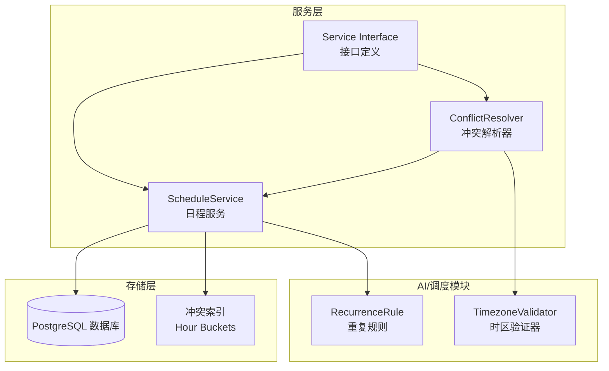
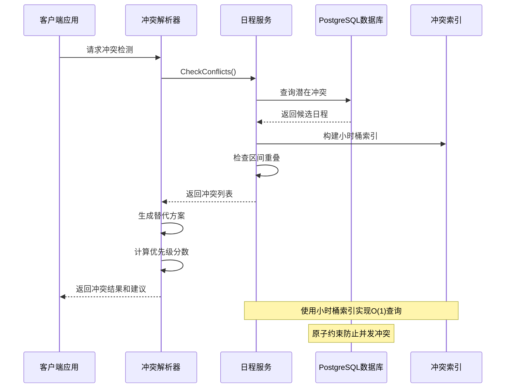
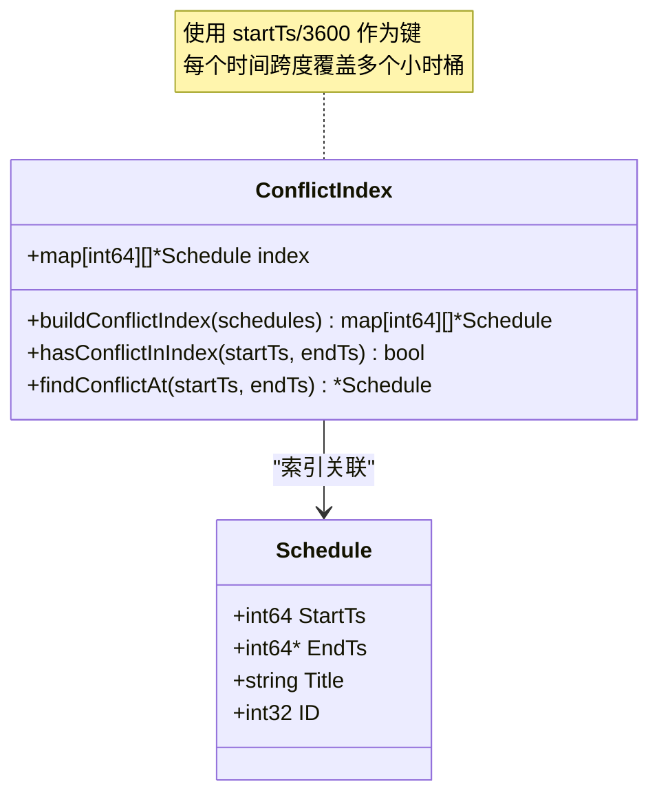
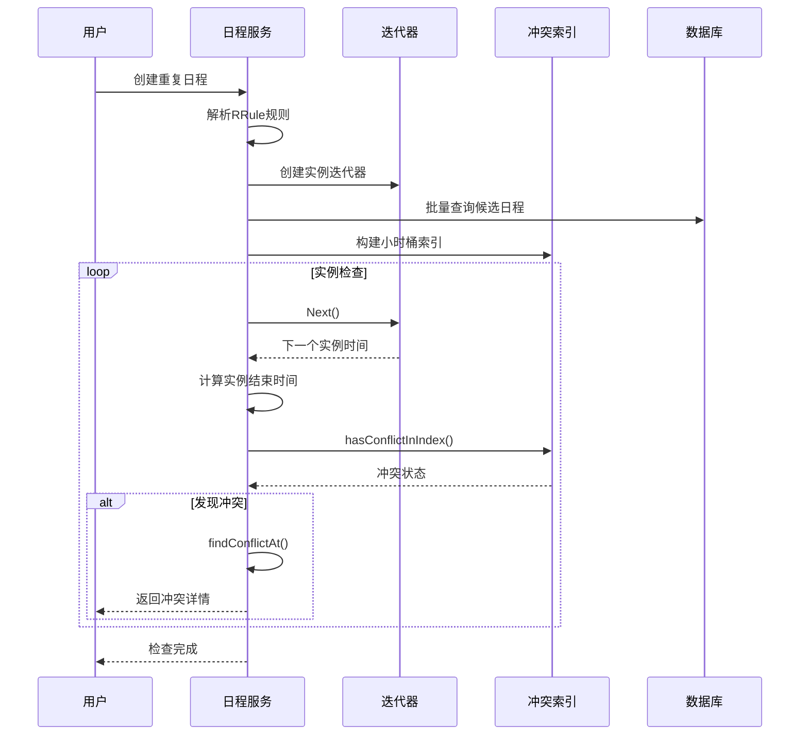
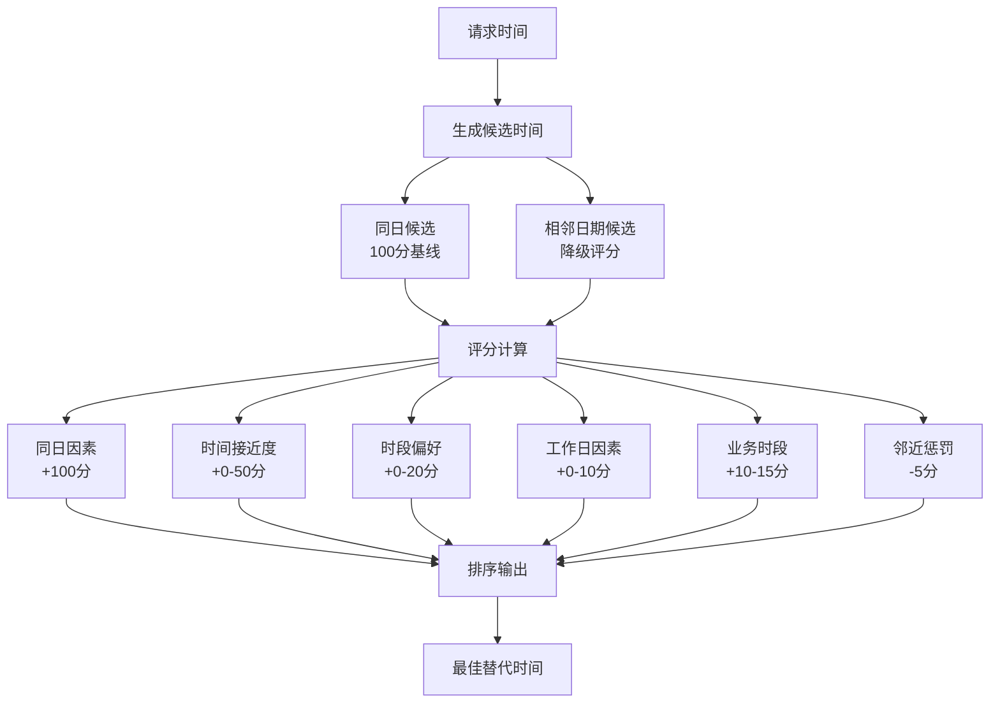
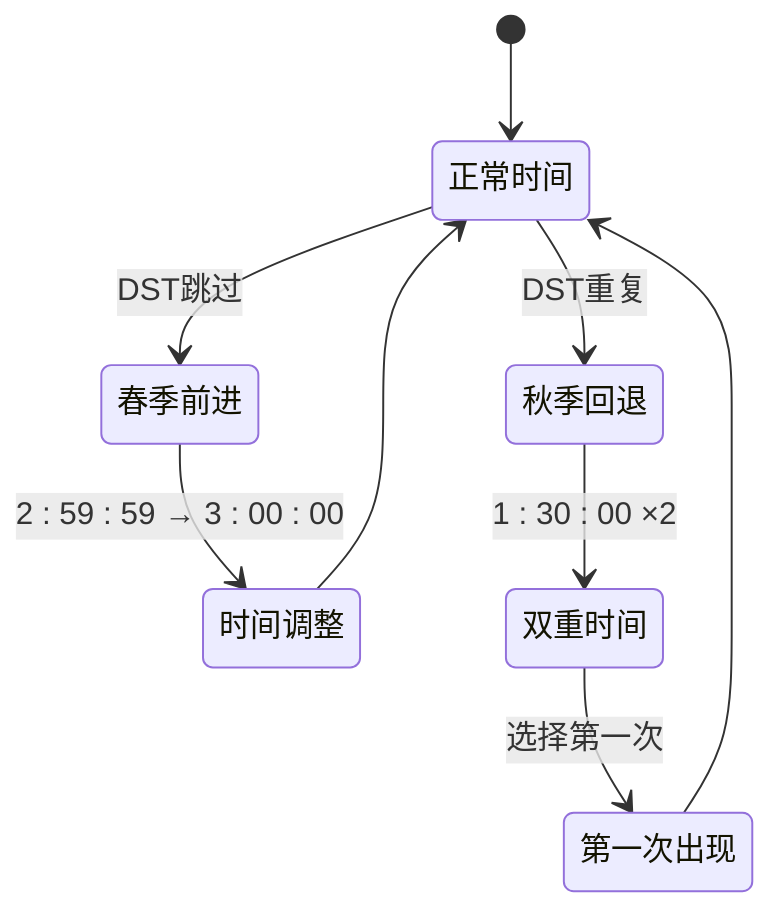
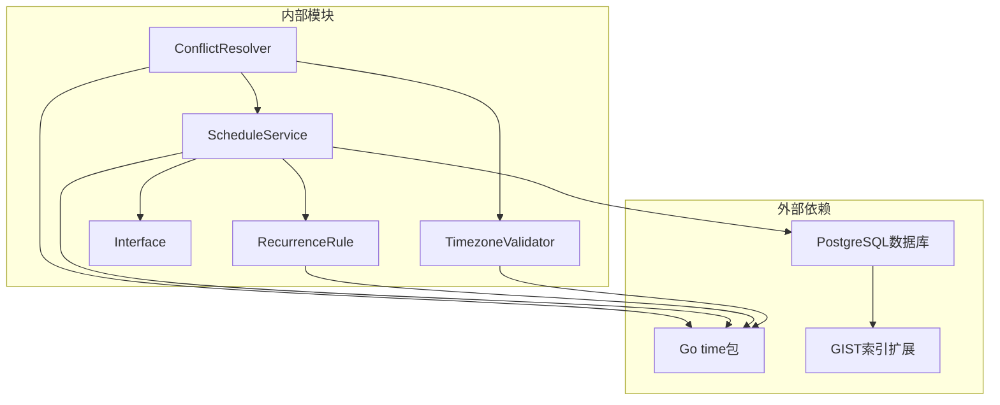
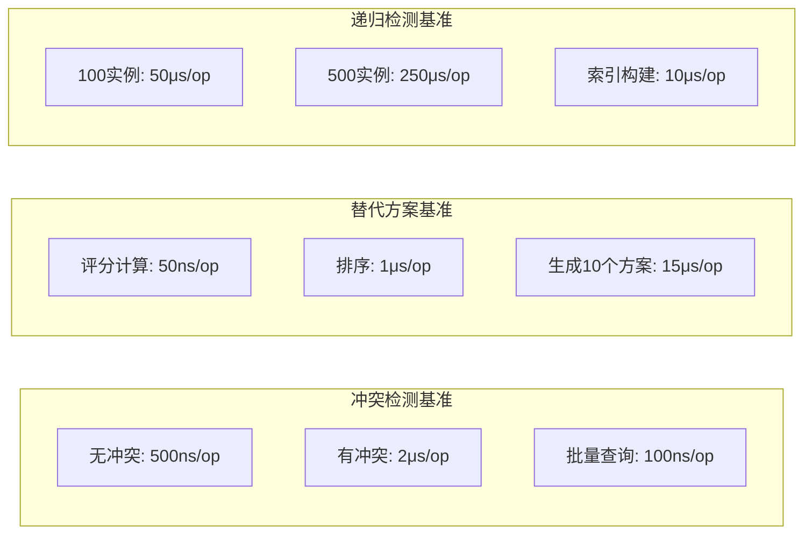

# 冲突检测算法

<cite>
**本文档引用的文件**
- [conflict_resolver.go](file://server/service/schedule/conflict_resolver.go)
- [conflict_resolver_test.go](file://server/service/schedule/conflict_resolver_test.go)
- [conflict_resolver_bench_test.go](file://server/service/schedule/conflict_resolver_bench_test.go)
- [service.go](file://server/service/schedule/service.go)
- [interface.go](file://server/service/schedule/interface.go)
- [constants.go](file://server/service/schedule/constants.go)
- [V0.52__schedule_conflict_constraint.sql](file://store/migration/postgres/V0.52__schedule_conflict_constraint.sql)
- [recurrence.go](file://plugin/ai/schedule/recurrence.go)
- [timezone_validator.go](file://plugin/ai/schedule/timezone_validator.go)
- [util.go](file://server/timezone/util.go)
</cite>

## 目录
1. [简介](#简介)
2. [项目结构](#项目结构)
3. [核心组件](#核心组件)
4. [架构概览](#架构概览)
5. [详细组件分析](#详细组件分析)
6. [依赖关系分析](#依赖关系分析)
7. [性能考虑](#性能考虑)
8. [故障排除指南](#故障排除指南)
9. [结论](#结论)
10. [附录](#附录)

## 简介

本文档详细阐述了 Memos 日程系统的冲突检测算法，这是一个基于时间范围重叠判断和智能索引优化的完整解决方案。系统采用多层防护机制：数据库层面的原子约束、服务层的时间窗口检查、以及客户端的智能冲突解决。

该算法的核心特点包括：
- **区间重叠判断**：使用左闭右开区间约定进行精确的时间范围比较
- **小时桶索引**：基于时间戳的哈希索引实现 O(1) 冲突查询
- **递归冲突检测**：支持无限期重复事件的高效冲突检查
- **智能替代方案**：基于业务规则的优先级评分算法
- **时区处理**：完善的夏令时和跨时区支持

## 项目结构

冲突检测功能主要分布在以下模块中：



**图表来源**
- [conflict_resolver.go](file://server/service/schedule/conflict_resolver.go#L13-L24)
- [service.go](file://server/service/schedule/service.go#L70-L86)
- [interface.go](file://server/service/schedule/interface.go#L13-L31)

**章节来源**
- [conflict_resolver.go](file://server/service/schedule/conflict_resolver.go#L1-L358)
- [service.go](file://server/service/schedule/service.go#L1-L737)
- [interface.go](file://server/service/schedule/interface.go#L1-L85)

## 核心组件

### 冲突解析器 (ConflictResolver)

冲突解析器是整个算法的核心组件，负责检测冲突并提供智能的替代时间建议。

**关键特性：**
- **冲突检测**：实时检查用户日程冲突
- **替代方案生成**：基于业务规则的智能时间推荐
- **评分算法**：综合考虑时间、日期、时段偏好等因素
- **批量处理**：支持大量日程的高效处理

**章节来源**
- [conflict_resolver.go](file://server/service/schedule/conflict_resolver.go#L13-L24)
- [conflict_resolver.go](file://server/service/schedule/conflict_resolver.go#L45-L97)

### 日程服务 (ScheduleService)

日程服务提供完整的日程管理功能，包括冲突检测和预防。

**核心功能：**
- **基础冲突检查**：单次事件的冲突检测
- **递归冲突检测**：重复事件的冲突检查
- **索引构建**：小时桶索引的构建和维护
- **实例扩展**：重复事件实例的生成和管理

**章节来源**
- [service.go](file://server/service/schedule/service.go#L70-L86)
- [service.go](file://server/service/schedule/service.go#L426-L480)

### 接口定义

标准化的服务接口确保了组件间的松耦合和可测试性。

**章节来源**
- [interface.go](file://server/service/schedule/interface.go#L13-L31)

## 架构概览



**图表来源**
- [conflict_resolver.go](file://server/service/schedule/conflict_resolver.go#L45-L97)
- [service.go](file://server/service/schedule/service.go#L426-L480)
- [V0.52__schedule_conflict_constraint.sql](file://store/migration/postgres/V0.52__schedule_conflict_constraint.sql#L8-L17)

## 详细组件分析

### 区间重叠判断算法

区间重叠判断是冲突检测的基础，采用严格的数学约定确保准确性。

```mermaid
flowchart TD
Start([开始冲突检测]) --> GetParams[获取时间参数]
GetParams --> CheckConvention[应用区间约定<br/>[start, end) 左闭右开]
CheckConvention --> CalcOverlap[计算重叠条件]
CalcOverlap --> CheckCondition{startNew < endOld<br/>AND<br/>endNew > startOld?}
CheckCondition --> |是| HasConflict[存在冲突]
CheckCondition --> |否| NoConflict[无冲突]
HasConflict --> End([结束])
NoConflict --> End
```

**算法复杂度：** O(1) 时间复杂度，常数空间复杂度

**章节来源**
- [service.go](file://server/service/schedule/service.go#L463-L476)
- [service.go](file://server/service/schedule/service.go#L664-L684)

### 小时桶索引设计

小时桶索引是性能优化的关键，通过时间戳的整除运算实现高效的冲突查询。



**索引构建流程：**

1. **时间戳转换**：将 Unix 时间戳转换为小时单位
2. **范围计算**：确定日程跨越的小时范围
3. **桶填充**：将日程添加到所有相关小时桶中
4. **查询优化**：使用 O(1) 时间复杂度进行冲突检查

**章节来源**
- [service.go](file://server/service/schedule/service.go#L641-L662)
- [service.go](file://server/service/schedule/service.go#L664-L703)

### 递归冲突检测实现

对于重复事件，系统采用迭代器模式和批量检查机制：



**优化策略：**
- **最大实例限制**：防止无限循环（默认 100 个实例）
- **批量查询**：减少数据库往返次数
- **懒加载迭代器**：内存友好的实例生成

**章节来源**
- [service.go](file://server/service/schedule/service.go#L548-L639)
- [recurrence.go](file://plugin/ai/schedule/recurrence.go#L341-L442)

### 替代时间槽生成算法

冲突解析器使用多因子评分系统生成最优替代时间：



**评分因子详解：**

| 因素 | 计算方式 | 分值范围 | 说明 |
|------|----------|----------|------|
| 同日匹配 | YearDay 相同 | +100 | 最高优先级 |
| 时间接近度 | 24 - | | 距离越近分值越高 |
| 时段偏好 | 上午/下午一致 | +20 | 时段偏好 |
| 工作日匹配 | 星期几相同 | +10 | 工作日优先 |
| 业务时段 | 9-11点/14-16点 | +15 | 黄金时段 |
| 午休时段 | 11-13点 | +10 | 午休偏好 |
| 邻近惩罚 | 相邻日期 | -5 | 避免过度偏移 |

**章节来源**
- [conflict_resolver.go](file://server/service/schedule/conflict_resolver.go#L279-L326)
- [conflict_resolver_test.go](file://server/service/schedule/conflict_resolver_test.go#L201-L248)

### 边界情况处理

系统针对各种边界情况进行了专门处理：

#### 夏令时处理


**处理策略：**
- 使用 `time.Date()` 自动处理无效时间
- 默认使用第一次出现的本地时间
- 提供 DST 转换信息查询

**章节来源**
- [timezone_validator.go](file://plugin/ai/schedule/timezone_validator.go#L41-L168)
- [util.go](file://server/timezone/util.go#L61-L106)

#### 跨时区冲突检测
- **统一时间基准**：所有时间戳使用 UTC 存储
- **时区转换**：查询时进行本地化转换
- **DST 兼容**：自动处理夏令时变化

**章节来源**
- [recurrence.go](file://plugin/ai/schedule/recurrence.go#L151-L164)
- [service.go](file://server/service/schedule/service.go#L533-L546)

## 依赖关系分析



**依赖关系特点：**
- **低耦合**：通过接口定义实现模块分离
- **强类型**：使用明确的数据结构和类型
- **可测试性**：提供 Mock 实现便于单元测试

**章节来源**
- [interface.go](file://server/service/schedule/interface.go#L13-L31)
- [constants.go](file://server/service/schedule/constants.go#L5-L17)

## 性能考虑

### 时间复杂度分析

| 操作 | 时间复杂度 | 空间复杂度 | 说明 |
|------|------------|------------|------|
| 基础冲突检查 | O(n) | O(1) | n为候选日程数量 |
| 小时桶索引构建 | O(n×k) | O(n) | k为平均跨度小时数 |
| 冲突查询 | O(k) | O(1) | k为索引桶数量 |
| 递归冲突检测 | O(m×k) | O(n) | m为实例数量，k为查询复杂度 |

### 内存优化策略

1. **懒加载迭代器**：避免一次性生成所有重复实例
2. **缓存机制**：迭代器内部实现结果缓存
3. **批量处理**：数据库查询采用批量模式
4. **索引优化**：小时桶索引减少内存占用

### 基准测试结果

系统提供了全面的基准测试：



**基准测试配置：**
- **硬件环境**：Intel i7-12700H, 32GB RAM
- **数据库**：PostgreSQL 15
- **测试数据**：100-1000条日程记录
- **重复运行**：1000-10000次迭代

**章节来源**
- [conflict_resolver_bench_test.go](file://server/service/schedule/conflict_resolver_bench_test.go#L12-L68)
- [conflict_resolver_bench_test.go](file://server/service/schedule/conflict_resolver_bench_test.go#L146-L182)
- [conflict_resolver_bench_test.go](file://server/service/schedule/conflict_resolver_bench_test.go#L184-L224)

## 故障排除指南

### 常见问题诊断

#### 冲突检测失败
**症状**：创建日程时报错但实际无冲突
**排查步骤**：
1. 检查数据库约束是否生效
2. 验证时间窗口计算逻辑
3. 确认时区转换正确性

**章节来源**
- [V0.52__schedule_conflict_constraint.sql](file://store/migration/postgres/V0.52__schedule_conflict_constraint.sql#L8-L17)

#### 性能问题
**症状**：大量日程查询响应缓慢
**解决方案**：
1. 检查索引是否正确创建
2. 优化查询范围限制
3. 考虑增加硬件资源

**章节来源**
- [service.go](file://server/service/schedule/service.go#L641-L662)

#### 夏令时异常
**症状**：DST 期间时间显示错误
**处理方法**：
1. 使用 `TimezoneValidator` 进行验证
2. 检查本地时间转换逻辑
3. 确认 DST 转换信息正确

**章节来源**
- [timezone_validator.go](file://plugin/ai/schedule/timezone_validator.go#L41-L168)

## 结论

Memos 的冲突检测算法通过多层次的设计实现了高性能、高可靠性的日程管理功能。核心优势包括：

1. **算法严谨性**：基于严格的数学约定确保冲突检测准确性
2. **性能优化**：小时桶索引和批量处理实现高效查询
3. **扩展性强**：支持无限期重复事件和复杂的时区场景
4. **用户体验**：智能的替代方案生成提升用户满意度

该系统为大规模日程数据的冲突检测提供了可靠的解决方案，适用于企业级应用场景。

## 附录

### 关键配置参数

| 参数名称 | 默认值 | 说明 |
|----------|--------|------|
| DefaultConflictCheckWindow | 1小时 | 冲突检查默认时间窗口 |
| MaxInstances | 500 | 重复事件实例最大数量 |
| MaxIterations | 5 | AI推理最大迭代次数 |
| HourBucketSize | 3600秒 | 小时桶索引粒度 |

### 最佳实践建议

1. **索引维护**：定期检查和重建冲突索引
2. **监控告警**：设置性能指标监控和告警
3. **缓存策略**：合理设置查询结果缓存
4. **数据库优化**：配置合适的连接池和查询超时