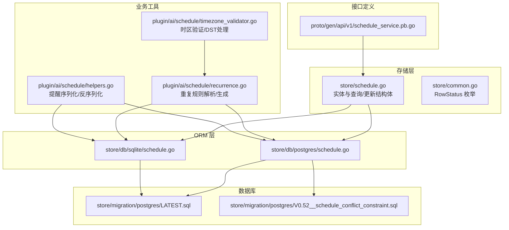
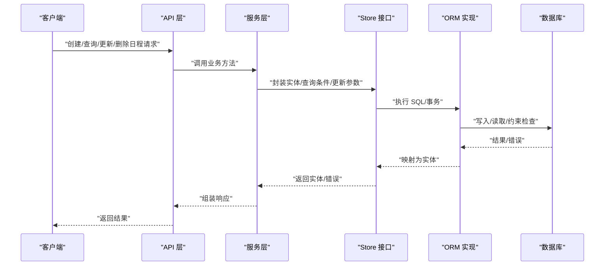
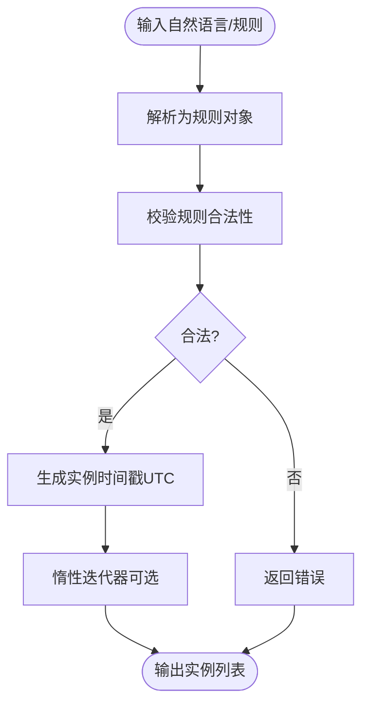
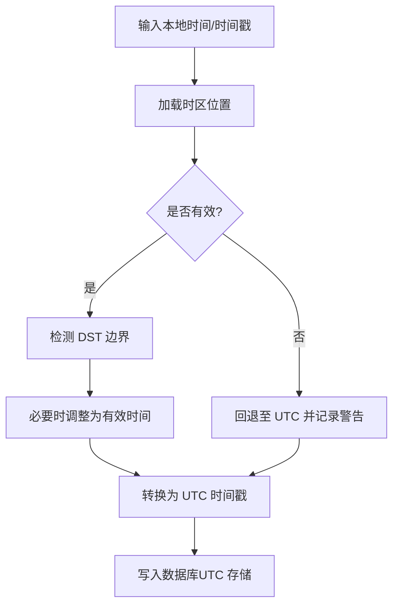
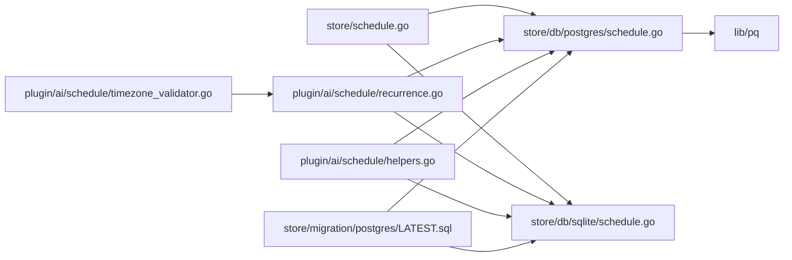

# 日程数据模型

<cite>
**本文引用的文件**
- [store/schedule.go](file://store/schedule.go)
- [store/common.go](file://store/common.go)
- [store/db/postgres/schedule.go](file://store/db/postgres/schedule.go)
- [store/db/sqlite/schedule.go](file://store/db/sqlite/schedule.go)
- [plugin/ai/schedule/recurrence.go](file://plugin/ai/schedule/recurrence.go)
- [plugin/ai/schedule/helpers.go](file://plugin/ai/schedule/helpers.go)
- [plugin/ai/schedule/timezone_validator.go](file://plugin/ai/schedule/timezone_validator.go)
- [store/migration/postgres/LATEST.sql](file://store/migration/postgres/LATEST.sql)
- [store/migration/postgres/V0.52__schedule_conflict_constraint.sql](file://store/migration/postgres/V0.52__schedule_conflict_constraint.sql)
- [proto/gen/api/v1/schedule_service.pb.go](file://proto/gen/api/v1/schedule_service.pb.go)
</cite>

## 目录
1. [简介](#简介)
2. [项目结构](#项目结构)
3. [核心组件](#核心组件)
4. [架构总览](#架构总览)
5. [详细组件分析](#详细组件分析)
6. [依赖关系分析](#依赖关系分析)
7. [性能考量](#性能考量)
8. [故障排查指南](#故障排查指南)
9. [结论](#结论)
10. [附录](#附录)

## 简介
本文件系统化梳理“日程”数据模型的设计与实现，覆盖以下方面：
- 日程实体的数据结构、字段定义、数据类型与约束
- 数据库表设计（主键、外键、索引、约束）
- 重复规则的存储格式与解析机制
- 时区字段的作用与处理方式
- 日程状态枚举与提醒机制的数据存储方案
- 数据库迁移脚本说明与版本演进历史
- ORM 层数据操作最佳实践

## 项目结构
围绕日程模型的关键代码分布在以下模块：
- 存储层接口与实体定义：store/schedule.go、store/common.go
- ORM 实现（PostgreSQL/SQLite）：store/db/postgres/schedule.go、store/db/sqlite/schedule.go
- 提醒与重复规则解析：plugin/ai/schedule/recurrence.go、plugin/ai/schedule/helpers.go
- 时区验证与 DST 处理：plugin/ai/schedule/timezone_validator.go
- 数据库迁移与约束：store/migration/postgres/LATEST.sql、V0.52__schedule_conflict_constraint.sql
- Protobuf 定义（用于服务层交互）：proto/gen/api/v1/schedule_service.pb.go

图表来源
- [store/schedule.go](file://store/schedule.go#L1-L176)
- [store/common.go](file://store/common.go#L1-L25)
- [store/db/postgres/schedule.go](file://store/db/postgres/schedule.go#L1-L327)
- [store/db/sqlite/schedule.go](file://store/db/sqlite/schedule.go#L1-L232)
- [plugin/ai/schedule/recurrence.go](file://plugin/ai/schedule/recurrence.go#L1-L557)
- [plugin/ai/schedule/timezone_validator.go](file://plugin/ai/schedule/timezone_validator.go#L1-L247)
- [plugin/ai/schedule/helpers.go](file://plugin/ai/schedule/helpers.go#L1-L33)
- [store/migration/postgres/LATEST.sql](file://store/migration/postgres/LATEST.sql#L165-L222)
- [store/migration/postgres/V0.52__schedule_conflict_constraint.sql](file://store/migration/postgres/V0.52__schedule_conflict_constraint.sql#L1-L35)
- [proto/gen/api/v1/schedule_service.pb.go](file://proto/gen/api/v1/schedule_service.pb.go#L122-L193)

章节来源
- [store/schedule.go](file://store/schedule.go#L1-L176)
- [store/common.go](file://store/common.go#L1-L25)
- [store/db/postgres/schedule.go](file://store/db/postgres/schedule.go#L1-L327)
- [store/db/sqlite/schedule.go](file://store/db/sqlite/schedule.go#L1-L232)
- [plugin/ai/schedule/recurrence.go](file://plugin/ai/schedule/recurrence.go#L1-L557)
- [plugin/ai/schedule/timezone_validator.go](file://plugin/ai/schedule/timezone_validator.go#L1-L247)
- [plugin/ai/schedule/helpers.go](file://plugin/ai/schedule/helpers.go#L1-L33)
- [store/migration/postgres/LATEST.sql](file://store/migration/postgres/LATEST.sql#L165-L222)
- [store/migration/postgres/V0.52__schedule_conflict_constraint.sql](file://store/migration/postgres/V0.52__schedule_conflict_constraint.sql#L1-L35)
- [proto/gen/api/v1/schedule_service.pb.go](file://proto/gen/api/v1/schedule_service.pb.go#L122-L193)

## 核心组件
- 日程实体与查询/更新结构体：定义了日程的完整字段集，包括标题、描述、位置、起止时间、是否全天、时区、重复规则、重复结束时间、提醒、扩展载荷等；同时提供查询条件与更新请求结构体。
- 行状态枚举 RowStatus：支持 NORMAL 与 ARCHIVED 两种状态，用于软删除或归档场景。
- ORM 接口与实现：统一的 Store 接口方法（创建、列表、获取、更新、删除），分别由 PostgreSQL 与 SQLite 的具体实现提供。
- 重复规则解析器：自定义 JSON 格式存储重复规则，支持每日/每周/每月三种类型，提供解析、校验、实例生成与惰性迭代能力。
- 时区验证器：处理夏令时（DST）边界问题，确保本地时间在 DST 转换期间的合法性与一致性。
- 提醒序列化工具：将 Protobuf 提醒结构与 JSON 字符串互转，保证存储与传输的一致性。
- 数据库迁移与约束：定义表结构、索引、外键与检查约束；引入原子冲突检测约束，防止同一用户在 NORMAL 状态下的时间重叠。

章节来源
- [store/schedule.go](file://store/schedule.go#L8-L76)
- [store/common.go](file://store/common.go#L12-L24)
- [store/db/postgres/schedule.go](file://store/db/postgres/schedule.go#L14-L284)
- [store/db/sqlite/schedule.go](file://store/db/sqlite/schedule.go#L12-L231)
- [plugin/ai/schedule/recurrence.go](file://plugin/ai/schedule/recurrence.go#L40-L75)
- [plugin/ai/schedule/timezone_validator.go](file://plugin/ai/schedule/timezone_validator.go#L14-L147)
- [plugin/ai/schedule/helpers.go](file://plugin/ai/schedule/helpers.go#L10-L32)
- [store/migration/postgres/LATEST.sql](file://store/migration/postgres/LATEST.sql#L165-L222)
- [store/migration/postgres/V0.52__schedule_conflict_constraint.sql](file://store/migration/postgres/V0.52__schedule_conflict_constraint.sql#L1-L35)

## 架构总览
日程数据模型贯穿以下层次：
- 模型层：store/schedule.go 定义实体与查询/更新结构体
- 服务层：server/* 使用 store 接口执行业务逻辑
- ORM 层：postgres/sqlite 实现具体持久化
- 工具层：重复规则解析、时区验证、提醒序列化
- 接口层：Protobuf 定义跨语言交互契约
- 数据层：PostgreSQL/SQLite 表结构与约束

图表来源
- [store/schedule.go](file://store/schedule.go#L78-L116)
- [store/db/postgres/schedule.go](file://store/db/postgres/schedule.go#L14-L284)
- [store/db/sqlite/schedule.go](file://store/db/sqlite/schedule.go#L12-L231)
- [store/migration/postgres/LATEST.sql](file://store/migration/postgres/LATEST.sql#L165-L222)

## 详细组件分析

### 日程实体与字段定义
- 关键字段
  - 基础信息：ID、UID、创建者 ID、创建/更新时间戳、行状态
  - 标题、描述、位置
  - 起止时间：StartTs（必填）、EndTs（可空，表示全天或无结束）
  - 全天标记：AllDay（布尔）
  - 时区：Timezone（字符串，默认值见迁移脚本）
  - 重复规则：RecurrenceRule（JSON 字符串，参考重复规则解析器）
  - 重复结束时间：RecurrenceEndTs（可空）
  - 提醒：Reminders（JSON 数组字符串，默认空数组）
  - 扩展载荷：Payload（JSON 对象字符串，默认空对象）
- 约束与默认值
  - 时间范围约束：结束时间不早于开始时间（可空）
  - 提醒 JSON 格式约束：仅允许空数组或数组元素为对象
  - 外键：creator_id 引用用户表，级联删除
  - 原子冲突检测：同一用户 NORMAL 状态下不允许时间区间重叠
- 查询模式
  - 支持 AUTO/STANDARD/STRICT 三种查询模式，控制时间范围匹配策略

章节来源
- [store/schedule.go](file://store/schedule.go#L9-L27)
- [store/schedule.go](file://store/schedule.go#L29-L51)
- [store/schedule.go](file://store/schedule.go#L118-L176)
- [store/migration/postgres/LATEST.sql](file://store/migration/postgres/LATEST.sql#L165-L222)
- [store/migration/postgres/V0.52__schedule_conflict_constraint.sql](file://store/migration/postgres/V0.52__schedule_conflict_constraint.sql#L8-L17)

### 数据库表设计
- 主键：自增 ID
- 外键：creator_id -> user(id)，ON DELETE CASCADE
- 索引：
  - 普通索引：creator_id,start_ts、creator_id,row_status、start_ts、uid
  - GIST 索引：creator_id,start_ts 的组合索引，以及基于 tsrange 的时间范围索引（仅 NORMAL 状态）
- 约束：
  - CHECK：结束时间为空或不早于开始时间
  - CHECK：提醒 JSON 合法性
  - EXCLUDE：使用 btree_gist 扩展，禁止同一用户 NORMAL 状态的时间重叠

章节来源
- [store/migration/postgres/LATEST.sql](file://store/migration/postgres/LATEST.sql#L165-L222)
- [store/migration/postgres/V0.52__schedule_conflict_constraint.sql](file://store/migration/postgres/V0.52__schedule_conflict_constraint.sql#L5-L30)

### 重复规则存储格式与解析机制
- 存储格式
  - JSON 字符串，结构包含：type（daily/weekly/monthly）、interval（间隔）、weekdays（每周指定工作日集合）、month_day（每月某日）
- 解析与生成
  - ParseRecurrenceRule：从自然语言解析为规则对象
  - Validate：校验规则合法性（类型、间隔、周几、月日范围）
  - GenerateInstances：按 UTC 时间轴生成实例时间戳（上限限制）
  - RecurrenceIterator：惰性迭代，缓存已生成实例，支持增量扩展
- 时区处理
  - 规则生成以 UTC 计算，避免 DST 边界复杂性；实际使用时应由调用方完成本地时间到 UTC 的转换

图表来源
- [plugin/ai/schedule/recurrence.go](file://plugin/ai/schedule/recurrence.go#L77-L149)
- [plugin/ai/schedule/recurrence.go](file://plugin/ai/schedule/recurrence.go#L151-L193)
- [plugin/ai/schedule/recurrence.go](file://plugin/ai/schedule/recurrence.go#L341-L442)

章节来源
- [plugin/ai/schedule/recurrence.go](file://plugin/ai/schedule/recurrence.go#L40-L75)
- [plugin/ai/schedule/recurrence.go](file://plugin/ai/schedule/recurrence.go#L77-L149)
- [plugin/ai/schedule/recurrence.go](file://plugin/ai/schedule/recurrence.go#L151-L193)
- [plugin/ai/schedule/recurrence.go](file://plugin/ai/schedule/recurrence.go#L341-L442)

### 时区字段的作用与处理方式
- 作用
  - Timezone 字段标识日程所属时区，用于提醒、显示与跨时区协作
- 处理方式
  - 本地时间到 UTC 的转换应在业务层完成，避免直接存储本地时间
  - DST 边界处理：使用 TimezoneValidator 验证本地时间合法性，处理“跳过小时”和“重复小时”
  - 规则生成：重复规则实例生成始终基于 UTC，确保一致性

图表来源
- [plugin/ai/schedule/timezone_validator.go](file://plugin/ai/schedule/timezone_validator.go#L27-L96)
- [plugin/ai/schedule/timezone_validator.go](file://plugin/ai/schedule/timezone_validator.go#L110-L129)
- [plugin/ai/schedule/recurrence.go](file://plugin/ai/schedule/recurrence.go#L156-L164)

章节来源
- [plugin/ai/schedule/timezone_validator.go](file://plugin/ai/schedule/timezone_validator.go#L14-L147)
- [plugin/ai/schedule/recurrence.go](file://plugin/ai/schedule/recurrence.go#L151-L164)

### 日程状态枚举与提醒机制
- 状态枚举 RowStatus
  - NORMAL：正常状态
  - ARCHIVED：归档状态
- 提醒机制
  - Reminders 字段以 JSON 数组字符串存储，ORM 在读取时保证默认值为“[]”
  - 提供 MarshalReminders/UnmarshalReminders 工具函数，负责与 Protobuf 结构之间的转换
  - 服务层/前端可据此渲染与管理提醒项

章节来源
- [store/common.go](file://store/common.go#L12-L24)
- [store/db/postgres/schedule.go](file://store/db/postgres/schedule.go#L187-L195)
- [store/db/sqlite/schedule.go](file://store/db/sqlite/schedule.go#L140-L148)
- [plugin/ai/schedule/helpers.go](file://plugin/ai/schedule/helpers.go#L10-L32)
- [proto/gen/api/v1/schedule_service.pb.go](file://proto/gen/api/v1/schedule_service.pb.go#L185-L193)

### 数据库迁移脚本说明与版本演进历史
- LATEST.sql
  - 创建 schedule 表，定义主键、外键、索引与约束
  - 添加触发器自动维护 updated_ts
- V0.52__schedule_conflict_constraint.sql
  - 引入 btree_gist 扩展
  - 添加 EXCLUDE 约束，基于 tsrange 防止 NORMAL 状态下时间重叠
  - 新增 GIST 索引提升冲突检测与查询性能
  - 注释说明约束适用范围

章节来源
- [store/migration/postgres/LATEST.sql](file://store/migration/postgres/LATEST.sql#L165-L222)
- [store/migration/postgres/V0.52__schedule_conflict_constraint.sql](file://store/migration/postgres/V0.52__schedule_conflict_constraint.sql#L1-L35)

### ORM 层数据操作最佳实践
- 创建
  - 统一通过 Store.CreateSchedule 写入，ORM 自动处理默认值与返回 created_ts/updated_ts/row_status
  - 若发生冲突（EXCLUDE 约束），捕获 ConflictConstraintError 并返回友好提示
- 列表查询
  - 使用 FindSchedule 进行多维过滤（ID/UID/创建者/状态/时间范围/分页）
  - QueryMode 控制时间范围匹配策略（AUTO/STANDARD/STRICT）
  - ORM 层对空值字段进行 NullInt64/NullString 安全处理
- 更新
  - UpdateSchedule 仅更新非空字段，避免全量更新
  - 返回 updated_ts 以供上层刷新缓存
- 删除
  - 通过 Store.DeleteSchedule 删除，若未找到返回明确错误
- 错误处理
  - 区分业务错误（如冲突）与通用数据库错误
  - PostgreSQL 下通过 SQLSTATE 23P01 或约束名识别冲突

章节来源
- [store/schedule.go](file://store/schedule.go#L78-L108)
- [store/db/postgres/schedule.go](file://store/db/postgres/schedule.go#L14-L57)
- [store/db/postgres/schedule.go](file://store/db/postgres/schedule.go#L59-L204)
- [store/db/postgres/schedule.go](file://store/db/postgres/schedule.go#L207-L269)
- [store/db/postgres/schedule.go](file://store/db/postgres/schedule.go#L271-L284)
- [store/db/postgres/schedule.go](file://store/db/postgres/schedule.go#L286-L326)

## 依赖关系分析
- 组件耦合
  - Store 接口与 ORM 实现解耦，便于切换数据库后端
  - 重复规则与提醒工具独立于 ORM，便于单元测试与复用
  - 时区验证器依赖标准库 time，提供可插拔的 DST 处理
- 外部依赖
  - PostgreSQL：lib/pq 错误码识别冲突
  - JSON：重复规则与提醒的序列化/反序列化
  - Protobuf：服务层交互的数据契约

图表来源
- [store/schedule.go](file://store/schedule.go#L78-L116)
- [store/db/postgres/schedule.go](file://store/db/postgres/schedule.go#L14-L284)
- [store/db/sqlite/schedule.go](file://store/db/sqlite/schedule.go#L12-L231)
- [plugin/ai/schedule/recurrence.go](file://plugin/ai/schedule/recurrence.go#L1-L557)
- [plugin/ai/schedule/timezone_validator.go](file://plugin/ai/schedule/timezone_validator.go#L1-L247)
- [plugin/ai/schedule/helpers.go](file://plugin/ai/schedule/helpers.go#L1-L33)
- [store/migration/postgres/LATEST.sql](file://store/migration/postgres/LATEST.sql#L165-L222)

章节来源
- [store/schedule.go](file://store/schedule.go#L78-L116)
- [store/db/postgres/schedule.go](file://store/db/postgres/schedule.go#L14-L284)
- [store/db/sqlite/schedule.go](file://store/db/sqlite/schedule.go#L12-L231)
- [plugin/ai/schedule/recurrence.go](file://plugin/ai/schedule/recurrence.go#L1-L557)
- [plugin/ai/schedule/timezone_validator.go](file://plugin/ai/schedule/timezone_validator.go#L1-L247)
- [plugin/ai/schedule/helpers.go](file://plugin/ai/schedule/helpers.go#L1-L33)
- [store/migration/postgres/LATEST.sql](file://store/migration/postgres/LATEST.sql#L165-L222)

## 性能考量
- 索引策略
  - 普通索引：creator_id,start_ts、creator_id,row_status、start_ts、uid，满足常见查询路径
  - GIST 索引：基于 tsrange 的时间范围索引，加速重叠检测与范围查询
- 冲突检测
  - EXCLUDE 约束结合 GIST 索引，实现原子级冲突检测，减少应用层竞争条件
- 查询限制
  - ORM 列表查询对 Limit 进行上限控制，避免超大结果集
- 重复规则生成
  - 提供惰性迭代器与缓存，降低大规模实例生成的内存与 CPU 开销

章节来源
- [store/migration/postgres/LATEST.sql](file://store/migration/postgres/LATEST.sql#L194-L197)
- [store/migration/postgres/LATEST.sql](file://store/migration/postgres/LATEST.sql#L210-L219)
- [store/migration/postgres/V0.52__schedule_conflict_constraint.sql](file://store/migration/postgres/V0.52__schedule_conflict_constraint.sql#L19-L30)
- [store/db/postgres/schedule.go](file://store/db/postgres/schedule.go#L117-L133)
- [plugin/ai/schedule/recurrence.go](file://plugin/ai/schedule/recurrence.go#L341-L442)

## 故障排查指南
- 冲突错误
  - 现象：创建/更新日程时报错，提示与其他日程重叠
  - 原因：同一用户 NORMAL 状态下时间区间重叠
  - 处理：调整时间范围或修改状态为 ARCHIVED
- PostgreSQL 冲突识别
  - 通过 SQLSTATE 23P01 或约束名 no_overlapping_schedules 识别
- 提醒格式错误
  - 现象：读取日程时发现提醒字段异常
  - 处理：确认 Reminders 是否符合 JSON 数组格式，ORM 层会将其规范化为“[]”
- 时区与 DST 问题
  - 现象：本地时间在 DST 转换期间出现跳过或重复
  - 处理：使用 TimezoneValidator 验证并调整，必要时记录警告

章节来源
- [store/db/postgres/schedule.go](file://store/db/postgres/schedule.go#L286-L326)
- [store/db/postgres/schedule.go](file://store/db/postgres/schedule.go#L187-L195)
- [plugin/ai/schedule/timezone_validator.go](file://plugin/ai/schedule/timezone_validator.go#L41-L96)

## 结论
该日程数据模型通过清晰的实体定义、完善的数据库约束与索引、可扩展的重复规则与提醒机制，以及严谨的时区与 DST 处理，实现了高可用的日程管理能力。配合 ORM 层的原子冲突检测与查询优化，能够在复杂场景下保持一致性和高性能。

## 附录
- Protobuf 中与日程相关的字段（示例）
  - 全天标记：GetAllDay
  - 时区：GetTimezone
  - 重复规则：GetRecurrenceRule
  - 重复结束时间：GetRecurrenceEndTs
  - 提醒数组：GetReminders
  - 创建者：GetCreator
  - 创建/更新时间戳：GetCreatedTs/GetUpdatedTs
  - 状态：GetState

章节来源
- [proto/gen/api/v1/schedule_service.pb.go](file://proto/gen/api/v1/schedule_service.pb.go#L122-L193)