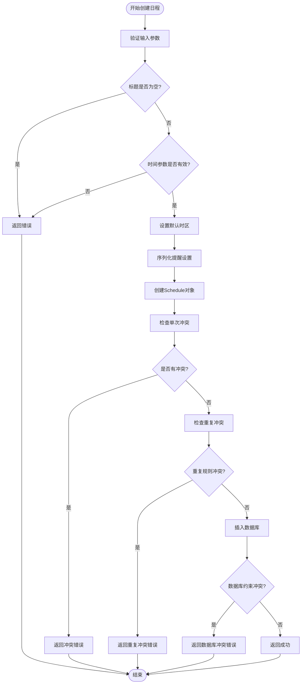

# 日程服务层

<cite>
**本文档引用的文件**
- [service.go](file://server/service/schedule/service.go)
- [interface.go](file://server/service/schedule/interface.go)
- [conflict_resolver.go](file://server/service/schedule/conflict_resolver.go)
- [constants.go](file://server/service/schedule/constants.go)
- [schedule.go](file://store/schedule.go)
- [schedule.go](file://store/db/postgres/schedule.go)
- [schedule_service.proto](file://proto/api/v1/schedule_service.proto)
- [schedule_service.go](file://server/router/api/v1/schedule_service.go)
- [recurrence.go](file://plugin/ai/schedule/recurrence.go)
- [error_class.go](file://plugin/ai/agent/error_class.go)
- [service_test.go](file://server/service/schedule/service_test.go)
- [conflict_resolver_test.go](file://server/service/schedule/conflict_resolver_test.go)
</cite>

## 目录
1. [简介](#简介)
2. [项目结构](#项目结构)
3. [核心组件](#核心组件)
4. [架构概览](#架构概览)
5. [详细组件分析](#详细组件分析)
6. [依赖关系分析](#依赖关系分析)
7. [性能考虑](#性能考虑)
8. [故障排除指南](#故障排除指南)
9. [结论](#结论)

## 简介

日程服务层是 Memos 系统中负责日程管理的核心业务逻辑层。该服务层提供了完整的日程生命周期管理功能，包括日程的创建、查询、更新和删除操作，支持重复事件的展开和冲突检测机制。服务层采用分层架构设计，将业务逻辑与存储层分离，提供了清晰的接口抽象和强大的扩展能力。

该服务层的主要特性包括：
- **重复规则展开**：支持每日、每周、每月等重复模式的日程展开
- **智能冲突检测**：提供单次冲突检查和递归冲突检查机制
- **时区处理**：支持多时区的日程管理和显示
- **事务处理**：通过数据库约束确保数据一致性
- **性能优化**：采用索引和缓存策略优化查询性能

## 项目结构

日程服务层位于 `server/service/schedule/` 目录下，采用模块化设计，每个文件负责特定的功能领域：

**图表来源**
- [service.go](file://server/service/schedule/service.go#L1-L737)
- [interface.go](file://server/service/schedule/interface.go#L1-L85)
- [schedule.go](file://store/schedule.go#L1-L176)

**章节来源**
- [service.go](file://server/service/schedule/service.go#L1-L737)
- [interface.go](file://server/service/schedule/interface.go#L1-L85)

## 核心组件

### 服务接口定义

服务层定义了清晰的接口契约，确保业务逻辑的可测试性和可维护性：

**图表来源**
- [interface.go](file://server/service/schedule/interface.go#L13-L31)
- [service.go](file://server/service/schedule/service.go#L70-L86)

### 数据模型

服务层使用统一的数据模型来表示日程实体：

| 字段名 | 类型 | 描述 | 必填 |
|--------|------|------|------|
| ID | int32 | 数据库自增ID | 否 |
| UID | string | 唯一标识符 | 是 |
| CreatorID | int32 | 创建者ID | 是 |
| Title | string | 日程标题 | 是 |
| Description | string | 日程描述 | 否 |
| Location | string | 地点 | 否 |
| StartTs | int64 | 开始时间戳 | 是 |
| EndTs | *int64 | 结束时间戳 | 否 |
| AllDay | bool | 是否全天事件 | 是 |
| Timezone | string | 时区 | 是 |
| RecurrenceRule | *string | 重复规则JSON | 否 |
| RecurrenceEndTs | *int64 | 重复结束时间戳 | 否 |
| Reminders | *string | 提醒设置JSON | 否 |
| Payload | *string | 扩展数据 | 否 |

**章节来源**
- [interface.go](file://server/service/schedule/interface.go#L33-L48)
- [schedule.go](file://store/schedule.go#L8-L27)

## 架构概览

日程服务层采用经典的三层架构模式，实现了业务逻辑与数据访问的分离：

**图表来源**
- [service.go](file://server/service/schedule/service.go#L70-L86)
- [conflict_resolver.go](file://server/service/schedule/conflict_resolver.go#L15-L24)

### 控制流分析

服务层的典型工作流程如下：

**图表来源**
- [service.go](file://server/service/schedule/service.go#L195-L302)
- [conflict_resolver.go](file://server/service/schedule/conflict_resolver.go#L46-L97)

## 详细组件分析

### 核心服务实现

#### 日程创建流程

日程创建是服务层最复杂的操作之一，涉及多个验证步骤和冲突检测：

**图表来源**
- [service.go](file://server/service/schedule/service.go#L195-L302)

#### 日程查询与实例展开

服务层支持查询指定时间范围内的日程，并自动展开重复规则：

**图表来源**
- [service.go](file://server/service/schedule/service.go#L88-L192)

**章节来源**
- [service.go](file://server/service/schedule/service.go#L88-L192)
- [service.go](file://server/service/schedule/service.go#L195-L302)

### 冲突检测机制

#### 单次冲突检查

单次冲突检查用于验证新创建或更新的日程是否与现有日程冲突：

**图表来源**
- [service.go](file://server/service/schedule/service.go#L427-L480)

#### 递归冲突检查

递归冲突检查专门用于验证重复日程规则的有效性：

**图表来源**
- [service.go](file://server/service/schedule/service.go#L548-L639)

**章节来源**
- [service.go](file://server/service/schedule/service.go#L427-L480)
- [service.go](file://server/service/schedule/service.go#L548-L639)

### 冲突解决器

冲突解决器提供了智能化的时间槽推荐功能：

**图表来源**
- [conflict_resolver.go](file://server/service/schedule/conflict_resolver.go#L15-L43)

#### 时间槽评分算法

冲突解决器使用综合评分系统来评估可用时间槽的质量：

| 评分因素 | 分值范围 | 说明 |
|----------|----------|------|
| 同一天 | 100分 | 最高优先级 |
| 相同时段 | 50分 | 上午/下午偏好 |
| 相同星期几 | 10分 | 连续性偏好 |
| 商务时间 | 15分 | 9-11点或14-16点 |
| 相邻日期 | -5分 | 距离惩罚 |
| 同一小时 | 取决于差异 | 越接近越好 |

**章节来源**
- [conflict_resolver.go](file://server/service/schedule/conflict_resolver.go#L264-L326)

### 重复规则处理

服务层支持简化的重复规则格式，基于自定义JSON格式而非完整的RFC 5545标准：

**图表来源**
- [recurrence.go](file://plugin/ai/schedule/recurrence.go#L42-L47)
- [recurrence.go](file://plugin/ai/schedule/recurrence.go#L342-L363)

**章节来源**
- [recurrence.go](file://plugin/ai/schedule/recurrence.go#L42-L75)
- [recurrence.go](file://plugin/ai/schedule/recurrence.go#L151-L193)

## 依赖关系分析

### 组件耦合度

服务层采用了松耦合的设计原则，通过接口抽象实现了良好的模块隔离：

**图表来源**
- [service.go](file://server/service/schedule/service.go#L70-L81)
- [conflict_resolver.go](file://server/service/schedule/conflict_resolver.go#L15-L24)

### 错误处理策略

服务层实现了分级的错误处理机制：

**图表来源**
- [error_class.go](file://plugin/ai/agent/error_class.go#L92-L109)

**章节来源**
- [error_class.go](file://plugin/ai/agent/error_class.go#L17-L32)

## 性能考虑

### 查询优化

服务层采用了多种性能优化策略：

1. **索引优化**：使用按小时分桶的冲突索引，提高查询效率
2. **批量查询**：一次性查询所有可能冲突的日程，减少多次数据库往返
3. **实例限制**：设置最大实例数量限制，防止内存溢出
4. **缓存机制**：重复规则迭代器使用缓存避免重复计算

### 内存管理

**图表来源**
- [service.go](file://server/service/schedule/service.go#L111-L165)

### 并发处理

服务层支持并发操作，但需要注意以下限制：
- **读操作**：查询和冲突检测支持并发
- **写操作**：创建和更新操作通过数据库约束保证原子性
- **迭代器**：重复规则迭代器使用互斥锁保护线程安全

**章节来源**
- [service.go](file://server/service/schedule/service.go#L641-L684)
- [recurrence.go](file://plugin/ai/schedule/recurrence.go#L342-L363)

## 故障排除指南

### 常见问题诊断

#### 冲突检测失败

当遇到冲突检测问题时，可以按照以下步骤排查：

1. **检查时区设置**：确认日程的时区设置正确
2. **验证时间范围**：确保开始时间和结束时间参数有效
3. **检查重复规则**：验证重复规则的JSON格式正确
4. **查看数据库约束**：检查是否存在违反唯一性约束的情况

#### 实例展开异常

重复日程实例展开失败的常见原因：

1. **重复规则解析错误**：检查JSON格式是否符合预期
2. **时间戳转换问题**：确认UTC时间戳转换正确
3. **实例数量限制**：检查是否达到最大实例数量限制
4. **内存不足**：监控内存使用情况，必要时调整限制

### 调试技巧

**图表来源**
- [service.go](file://server/service/schedule/service.go#L196-L204)

**章节来源**
- [service_test.go](file://server/service/schedule/service_test.go#L1-L517)
- [conflict_resolver_test.go](file://server/service/schedule/conflict_resolver_test.go#L1-L444)

## 结论

日程服务层展现了优秀的软件工程实践，通过清晰的分层架构、完善的错误处理机制和高效的性能优化策略，为整个系统提供了可靠的日程管理能力。

### 主要优势

1. **架构清晰**：采用分层设计，职责分离明确
2. **功能完整**：覆盖日程管理的所有核心功能
3. **性能优秀**：通过多种优化策略确保高效运行
4. **扩展性强**：接口设计支持未来功能扩展
5. **可靠性高**：多重约束和错误处理确保数据一致性

### 改进建议

1. **事务管理**：可以考虑引入更细粒度的事务控制
2. **缓存策略**：可以增加更多类型的缓存以提升性能
3. **监控指标**：可以添加更多性能监控指标
4. **国际化支持**：可以增强多语言支持能力

该服务层为日程管理功能奠定了坚实的基础，为用户提供了流畅的日程体验，同时也为系统的进一步发展提供了良好的技术支撑。