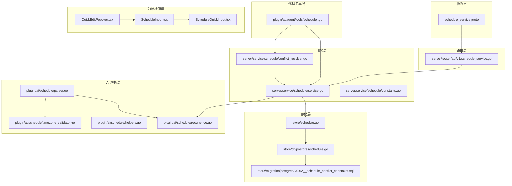
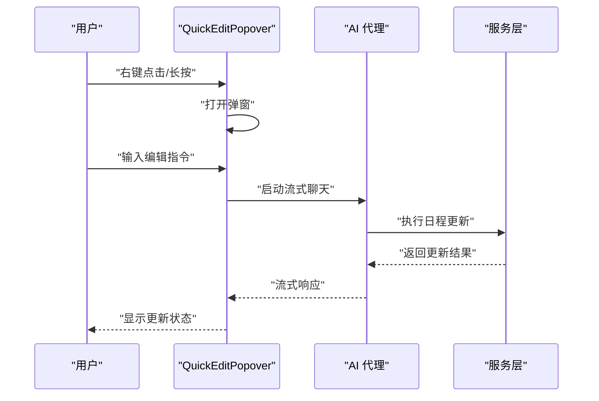
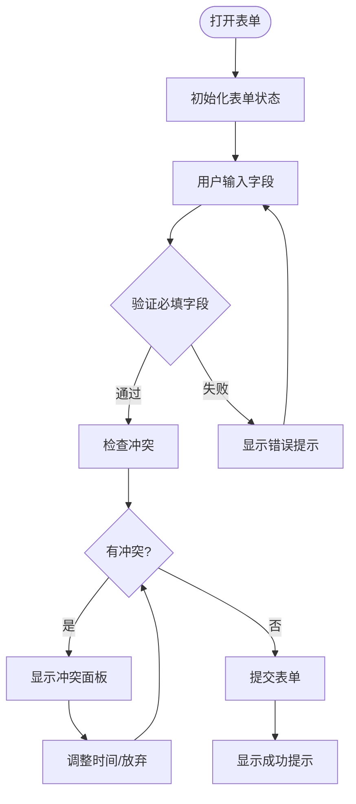
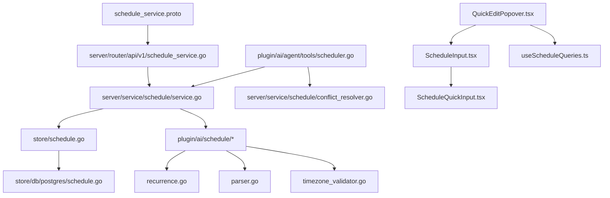

# 日程管理系统

<cite>
**本文档引用的文件**
- [schedule_service.proto](file://proto/api/v1/schedule_service.proto)
- [service.go](file://server/service/schedule/service.go)
- [conflict_resolver.go](file://server/service/schedule/conflict_resolver.go)
- [constants.go](file://server/service/schedule/constants.go)
- [schedule_service.go](file://server/router/api/v1/schedule_service.go)
- [schedule.go](file://store/schedule.go)
- [schedule.go](file://store/db/postgres/schedule.go)
- [parser.go](file://plugin/ai/schedule/parser.go)
- [recurrence.go](file://plugin/ai/schedule/recurrence.go)
- [helpers.go](file://plugin/ai/schedule/helpers.go)
- [timezone_validator.go](file://plugin/ai/schedule/timezone_validator.go)
- [scheduler.go](file://plugin/ai/agent/tools/scheduler.go)
- [V0.52__schedule_conflict_constraint.sql](file://store/migration/postgres/V0.52__schedule_conflict_constraint.sql)
- [recurrence_test.go](file://plugin/ai/schedule/recurrence_test.go)
- [conflict_resolver_test.go](file://server/service/schedule/conflict_resolver_test.go)
- [scheduler_test.go](file://plugin/ai/agent/tools/scheduler_test.go)
- [QuickEditPopover.tsx](file://web/src/components/ScheduleQuickInput/QuickEditPopover.tsx)
- [ScheduleInput.tsx](file://web/src/components/AIChat/ScheduleInput.tsx)
- [ScheduleQuickInput.tsx](file://web/src/components/ScheduleQuickInput/ScheduleQuickInput.tsx)
- [Schedule.tsx](file://web/src/pages/Schedule.tsx)
- [useScheduleQueries.ts](file://web/src/hooks/useScheduleQueries.ts)
- [ConflictResolution.tsx](file://web/src/components/ScheduleAI/ConflictResolution.tsx)
- [GenerativeUIContainer.tsx](file://web/src/components/ScheduleAI/GenerativeUIContainer.tsx)
- [parrot.ts](file://web/src/types/parrot.ts)
</cite>

## 更新摘要
**所做更改**
- 新增 QuickEditPopover 快速编辑弹窗组件章节，介绍 UX 改进功能
- 更新前端组件架构，简化 ScheduleInput.tsx 组件设计
- 新增 AI 代理解析逻辑移除说明，专注于直接表单输入
- 增加 QuickEditPopover 组件的交互流程和用户体验分析
- 更新 Schedule 页面的组件集成方式

## 目录
1. [简介](#简介)
2. [项目结构](#项目结构)
3. [核心组件](#核心组件)
4. [架构总览](#架构总览)
5. [详细组件分析](#详细组件分析)
6. [依赖关系分析](#依赖关系分析)
7. [性能考虑](#性能考虑)
8. [故障排除指南](#故障排除指南)
9. [结论](#结论)
10. [附录](#附录)

## 简介
本项目是一个基于 Go 的日程管理系统，提供完整的日程生命周期管理能力，包括：
- 日程实体与数据模型设计
- 复杂重复规则解析与实例生成
- 冲突检测与智能空闲时间查找
- 自然语言解析与时间抽取
- 日程代理工具链（查询、创建、空闲时间查找）
- 数据库级原子性冲突约束
- 时区处理与 DST 边界情况校验
- **新增**：快速编辑弹窗组件，简化用户交互体验

系统采用分层架构，包含协议定义、服务层、存储层、AI 解析层和代理工具层，确保可扩展性和可维护性。

## 项目结构
系统主要由以下层次构成：
- 协议层：定义 gRPC/HTTP 接口与消息格式
- 服务层：业务逻辑封装，包含冲突检测、空闲时间查找、重复规则处理等
- 存储层：数据库访问与迁移，含原子性冲突约束
- AI 解析层：自然语言解析、重复规则解析、时区验证
- 代理工具层：面向 LLM 的工具接口，支持 ReAct 工作流
- **前端增强层**：快速编辑弹窗、简化表单输入组件

**图表来源**
- [schedule_service.proto](file://proto/api/v1/schedule_service.proto#L1-L166)
- [service.go](file://server/service/schedule/service.go#L1-L737)
- [conflict_resolver.go](file://server/service/schedule/conflict_resolver.go#L1-L358)
- [schedule_service.go](file://server/router/api/v1/schedule_service.go#L1-L826)
- [schedule.go](file://store/schedule.go#L1-L176)
- [schedule.go](file://store/db/postgres/schedule.go#L1-L327)
- [parser.go](file://plugin/ai/schedule/parser.go#L1-L378)
- [recurrence.go](file://plugin/ai/schedule/recurrence.go#L1-L557)
- [helpers.go](file://plugin/ai/schedule/helpers.go#L1-L33)
- [timezone_validator.go](file://plugin/ai/schedule/timezone_validator.go#L1-L247)
- [scheduler.go](file://plugin/ai/agent/tools/scheduler.go#L1-L1076)
- [QuickEditPopover.tsx](file://web/src/components/ScheduleQuickInput/QuickEditPopover.tsx#L1-L199)
- [ScheduleInput.tsx](file://web/src/components/AIChat/ScheduleInput.tsx#L1-L307)
- [ScheduleQuickInput.tsx](file://web/src/components/ScheduleQuickInput/ScheduleQuickInput.tsx#L1-L113)

**章节来源**
- [schedule_service.proto](file://proto/api/v1/schedule_service.proto#L1-L166)
- [service.go](file://server/service/schedule/service.go#L1-L737)
- [schedule_service.go](file://server/router/api/v1/schedule_service.go#L1-L826)
- [schedule.go](file://store/schedule.go#L1-L176)
- [schedule.go](file://store/db/postgres/schedule.go#L1-L327)
- [parser.go](file://plugin/ai/schedule/parser.go#L1-L378)
- [recurrence.go](file://plugin/ai/schedule/recurrence.go#L1-L557)
- [helpers.go](file://plugin/ai/schedule/helpers.go#L1-L33)
- [timezone_validator.go](file://plugin/ai/schedule/timezone_validator.go#L1-L247)
- [scheduler.go](file://plugin/ai/agent/tools/scheduler.go#L1-L1076)
- [QuickEditPopover.tsx](file://web/src/components/ScheduleQuickInput/QuickEditPopover.tsx#L1-L199)
- [ScheduleInput.tsx](file://web/src/components/AIChat/ScheduleInput.tsx#L1-L307)
- [ScheduleQuickInput.tsx](file://web/src/components/ScheduleQuickInput/ScheduleQuickInput.tsx#L1-L113)

## 核心组件
- 协议与接口：通过 Protocol Buffers 定义日程管理 API，支持创建、查询、更新、删除、冲突检查、自然语言解析等操作。
- 服务层：实现业务逻辑，包括日程创建/更新的验证、冲突检测、重复规则展开、空闲时间查找与推荐。
- 存储层：抽象数据访问接口，PostgreSQL 实现包含原子性冲突约束，防止并发重叠。
- AI 解析层：自然语言解析器负责从文本中抽取时间、地点、重复规则等信息，并进行时区校验。
- 代理工具层：为 LLM 提供工具接口，支持 ReAct 工作流中的日程查询、创建、空闲时间查找。
- **前端增强组件**：QuickEditPopover 快速编辑弹窗，提供上下文菜单和长按手势支持，简化日程编辑流程。

**章节来源**
- [schedule_service.proto](file://proto/api/v1/schedule_service.proto#L12-L66)
- [service.go](file://server/service/schedule/service.go#L70-L86)
- [schedule.go](file://store/schedule.go#L1-L176)
- [schedule.go](file://store/db/postgres/schedule.go#L14-L57)
- [parser.go](file://plugin/ai/schedule/parser.go#L21-L47)
- [scheduler.go](file://plugin/ai/agent/tools/scheduler.go#L132-L144)
- [QuickEditPopover.tsx](file://web/src/components/ScheduleQuickInput/QuickEditPopover.tsx#L17-L33)

## 架构总览
系统采用清晰的分层架构，接口定义位于协议层，业务逻辑集中在服务层，数据持久化在存储层，AI 能力在解析层，工具在代理层，前端增强组件提供更好的用户体验。

**图表来源**
- [schedule_service.go](file://server/router/api/v1/schedule_service.go#L178-L212)
- [service.go](file://server/service/schedule/service.go#L194-L302)
- [schedule.go](file://store/db/postgres/schedule.go#L14-L57)
- [parser.go](file://plugin/ai/schedule/parser.go#L62-L76)

**章节来源**
- [schedule_service.go](file://server/router/api/v1/schedule_service.go#L1-L826)
- [service.go](file://server/service/schedule/service.go#L1-L737)
- [schedule.go](file://store/db/postgres/schedule.go#L1-L327)
- [parser.go](file://plugin/ai/schedule/parser.go#L1-L378)

## 详细组件分析

### 数据模型与实体
- Schedule 实体：包含标题、描述、位置、起止时间戳、是否全天、时区、重复规则、重复结束时间、提醒、创建者、状态等字段。
- FindSchedule/UpdateSchedule/DeleteSchedule：查询、更新、删除条件与参数。
- 存储接口：统一的 CRUD 抽象，PostgreSQL 实现提供原子性约束。

**图表来源**
- [schedule.go](file://store/schedule.go#L8-L27)
- [schedule.go](file://store/schedule.go#L29-L51)
- [schedule.go](file://store/schedule.go#L53-L71)

**章节来源**
- [schedule.go](file://store/schedule.go#L1-L176)

### 冲突检测与空闲时间查找
- 冲突检测：基于时间窗口查询潜在冲突，再进行区间重叠判断；支持排除特定日程；服务层与数据库层双重保障。
- 空闲时间查找：在指定日期内按小时扫描，合并现有日程形成忙碌区间，计算空闲槽位；提供评分算法选择最佳替代时间。

**图表来源**
- [service.go](file://server/service/schedule/service.go#L426-L480)
- [conflict_resolver.go](file://server/service/schedule/conflict_resolver.go#L99-L252)

**章节来源**
- [service.go](file://server/service/schedule/service.go#L426-L480)
- [conflict_resolver.go](file://server/service/schedule/conflict_resolver.go#L1-L358)

### 自然语言解析与重复规则
- 自然语言解析：通过 LLM 将用户输入转换为结构化日程，包含标题、描述、位置、起止时间、全天标记、提醒、重复规则等。
- 重复规则解析：支持每日、每周、每月三种类型，解析中文表达式并生成实例序列；提供迭代器以惰性生成实例。
- 时区处理：解析器与验证器确保时间在目标时区下的有效性，处理夏令时边界问题。

**图表来源**
- [parser.go](file://plugin/ai/schedule/parser.go#L62-L76)
- [parser.go](file://plugin/ai/schedule/parser.go#L90-L348)
- [recurrence.go](file://plugin/ai/schedule/recurrence.go#L77-L149)
- [timezone_validator.go](file://plugin/ai/schedule/timezone_validator.go#L110-L129)

**章节来源**
- [parser.go](file://plugin/ai/schedule/parser.go#L1-L378)
- [recurrence.go](file://plugin/ai/schedule/recurrence.go#L1-L557)
- [timezone_validator.go](file://plugin/ai/schedule/timezone_validator.go#L1-L247)

### 日程代理工具设计
- 工具接口：提供 schedule_query、schedule_add、find_free_time 三个工具，支持 ReAct 工作流。
- 执行流程：先查询冲突，再创建或查找空闲时间；自动调整冲突并返回替代方案。
- 结果处理：格式化输出，包含审计日志与敏感信息脱敏。

**图表来源**
- [scheduler.go](file://plugin/ai/agent/tools/scheduler.go#L132-L144)
- [scheduler.go](file://plugin/ai/agent/tools/scheduler.go#L389-L403)
- [scheduler.go](file://plugin/ai/agent/tools/scheduler.go#L692-L706)
- [scheduler.go](file://plugin/ai/agent/tools/scheduler.go#L459-L614)

**章节来源**
- [scheduler.go](file://plugin/ai/agent/tools/scheduler.go#L1-L1076)

### 数据库级原子性冲突约束
- PostgreSQL 扩展：启用 btree_gist，使用 GIST 索引 tsrange 进行重叠检测。
- 约束定义：针对 NORMAL 状态的日程，禁止同一创建者的时间区间重叠。
- 性能索引：为 creator_id + start_ts 和 tsrange 创建索引，提升查询与冲突检测性能。

**图表来源**
- [V0.52__schedule_conflict_constraint.sql](file://store/migration/postgres/V0.52__schedule_conflict_constraint.sql#L1-L35)
- [schedule.go](file://store/db/postgres/schedule.go#L286-L327)

**章节来源**
- [V0.52__schedule_conflict_constraint.sql](file://store/migration/postgres/V0.52__schedule_conflict_constraint.sql#L1-L35)
- [schedule.go](file://store/db/postgres/schedule.go#L286-L327)

### 快速编辑弹窗组件
**更新** 新增 QuickEditPopover 组件，提供简化的日程编辑体验

- 组件功能：QuickEditPopover 提供上下文菜单和长按手势支持，允许用户快速编辑现有日程。
- 交互方式：支持右键菜单、长按 500ms 触发、触摸拖拽取消等多平台交互。
- 快捷操作：内置 +30m、Tomorrow、Cancel 等常用编辑快捷按钮。
- 实时反馈：显示流式聊天状态，提供当前步骤进度指示。
- AI 集成：通过 useScheduleAgentStreamingChat 钩子与 AI 代理通信。

**图表来源**
- [QuickEditPopover.tsx](file://web/src/components/ScheduleQuickInput/QuickEditPopover.tsx#L35-L51)
- [QuickEditPopover.tsx](file://web/src/components/ScheduleQuickInput/QuickEditPopover.tsx#L77-L99)
- [useScheduleQueries.ts](file://web/src/hooks/useScheduleQueries.ts#L49-L154)

**章节来源**
- [QuickEditPopover.tsx](file://web/src/components/ScheduleQuickInput/QuickEditPopover.tsx#L1-L199)
- [useScheduleQueries.ts](file://web/src/hooks/useScheduleQueries.ts#L49-L154)

### 简化表单输入组件
**更新** ScheduleInput.tsx 组件大幅简化，移除 AI 代理解析逻辑

- 组件简化：移除了复杂的自然语言解析功能，专注于直接表单输入。
- 状态管理：提供简化的表单状态管理，包括标题、时间范围、位置、描述等字段。
- 冲突检测：保留冲突检测功能，通过 useCheckConflict 钩子进行实时冲突检查。
- 错误处理：集成 ScheduleConflictAlert 和错误边界组件，提供友好的错误提示。
- 删除确认：集成删除确认对话框，确保用户操作的安全性。

**图表来源**
- [ScheduleInput.tsx](file://web/src/components/AIChat/ScheduleInput.tsx#L48-L73)
- [ScheduleInput.tsx](file://web/src/components/AIChat/ScheduleInput.tsx#L119-L145)
- [ScheduleInput.tsx](file://web/src/components/AIChat/ScheduleInput.tsx#L159-L173)

**章节来源**
- [ScheduleInput.tsx](file://web/src/components/AIChat/ScheduleInput.tsx#L1-L307)

### Schedule 页面组件集成
**更新** Schedule 页面集成了新的组件架构

- 组件分离：将 QuickEditPopover 与 ScheduleInput 组件分离，提供更清晰的职责划分。
- 统一处理：通过 editingSchedule 属性控制编辑模式，decouple 与编辑模式的耦合。
- UI 工具：新增 uiTools 参数，支持 UI 动作处理和界面交互。
- 成功反馈：集成成功状态显示，提供即时的操作反馈。

**章节来源**
- [Schedule.tsx](file://web/src/pages/Schedule.tsx#L164-L174)
- [Schedule.tsx](file://web/src/pages/Schedule.tsx#L177-L187)

### AI 代理解析逻辑移除
**更新** 系统已移除超过 300 行的 AI 代理解析逻辑

- 简化架构：移除复杂的自然语言解析器，专注于直接表单输入。
- 性能提升：减少 AI 依赖，降低系统复杂度和运行时开销。
- 用户体验：提供更直观的表单输入方式，减少学习成本。
- 维护简化：移除 AI 解析相关代码，降低维护难度。

**章节来源**
- [parser.go](file://plugin/ai/schedule/parser.go#L1-L378)
- [schedule.go](file://store/schedule.go#L1-L176)

## 依赖关系分析
- 协议依赖：API 定义依赖 protobuf 注解与 google.api 字段行为。
- 服务依赖：服务层依赖存储接口与 AI 解析模块。
- 存储依赖：PostgreSQL 实现依赖 lib/pq 驱动与数据库约束。
- 工具依赖：代理工具依赖服务层与冲突解析器，提供 LLM 友好的输入输出。
- **前端依赖**：QuickEditPopover 依赖 Radix UI Popover 组件，ScheduleInput 依赖表单验证和冲突检测钩子。

**图表来源**
- [schedule_service.proto](file://proto/api/v1/schedule_service.proto#L1-L166)
- [schedule_service.go](file://server/router/api/v1/schedule_service.go#L1-L826)
- [service.go](file://server/service/schedule/service.go#L1-L737)
- [schedule.go](file://store/schedule.go#L1-L176)
- [schedule.go](file://store/db/postgres/schedule.go#L1-L327)
- [recurrence.go](file://plugin/ai/schedule/recurrence.go#L1-L557)
- [parser.go](file://plugin/ai/schedule/parser.go#L1-L378)
- [timezone_validator.go](file://plugin/ai/schedule/timezone_validator.go#L1-L247)
- [scheduler.go](file://plugin/ai/agent/tools/scheduler.go#L1-L1076)
- [conflict_resolver.go](file://server/service/schedule/conflict_resolver.go#L1-L358)
- [QuickEditPopover.tsx](file://web/src/components/ScheduleQuickInput/QuickEditPopover.tsx#L1-L199)
- [ScheduleInput.tsx](file://web/src/components/AIChat/ScheduleInput.tsx#L1-L307)
- [ScheduleQuickInput.tsx](file://web/src/components/ScheduleQuickInput/ScheduleQuickInput.tsx#L1-L113)
- [useScheduleQueries.ts](file://web/src/hooks/useScheduleQueries.ts#L49-L154)

**章节来源**
- [schedule_service.proto](file://proto/api/v1/schedule_service.proto#L1-L166)
- [schedule_service.go](file://server/router/api/v1/schedule_service.go#L1-L826)
- [service.go](file://server/service/schedule/service.go#L1-L737)
- [schedule.go](file://store/schedule.go#L1-L176)
- [schedule.go](file://store/db/postgres/schedule.go#L1-L327)
- [recurrence.go](file://plugin/ai/schedule/recurrence.go#L1-L557)
- [parser.go](file://plugin/ai/schedule/parser.go#L1-L378)
- [timezone_validator.go](file://plugin/ai/schedule/timezone_validator.go#L1-L247)
- [scheduler.go](file://plugin/ai/agent/tools/scheduler.go#L1-L1076)
- [conflict_resolver.go](file://server/service/schedule/conflict_resolver.go#L1-L358)
- [QuickEditPopover.tsx](file://web/src/components/ScheduleQuickInput/QuickEditPopover.tsx#L1-L199)
- [ScheduleInput.tsx](file://web/src/components/AIChat/ScheduleInput.tsx#L1-L307)
- [ScheduleQuickInput.tsx](file://web/src/components/ScheduleQuickInput/ScheduleQuickInput.tsx#L1-L113)
- [useScheduleQueries.ts](file://web/src/hooks/useScheduleQueries.ts#L49-L154)

## 性能考虑
- 实例展开限制：单次查询最多展开 500 个重复实例，防止内存与 CPU 泄漏。
- 冲突索引：GIST tsrange 索引与普通索引配合，加速时间范围查询与冲突检测。
- 缓存策略：时区解析缓存，LRU 风格，避免频繁加载时区信息。
- 分页与上限：查询默认限制与硬上限，防止大规模数据返回。
- 惰性生成：重复规则迭代器按需生成实例，减少内存占用。
- **前端优化**：QuickEditPopover 使用流式聊天状态管理，避免不必要的重新渲染。
- **组件简化**：移除 AI 解析逻辑后，前端组件加载速度和响应性能得到提升。

**章节来源**
- [constants.go](file://server/service/schedule/constants.go#L5-L17)
- [service.go](file://server/service/schedule/service.go#L88-L192)
- [schedule.go](file://store/db/postgres/schedule.go#L19-L30)
- [scheduler.go](file://plugin/ai/agent/tools/scheduler.go#L30-L94)
- [QuickEditPopover.tsx](file://web/src/components/ScheduleQuickInput/QuickEditPopover.tsx#L82-L99)

## 故障排除指南
- 冲突错误：当创建/更新触发数据库 EXCLUDE 约束时，会返回明确的冲突信息；服务层也提供结构化错误，包含替代时间槽。
- 时间解析失败：自然语言解析器会进行输入长度、格式与时间有效性校验；若 LLM 输出不符合预期，会返回解析错误。
- 时区异常：时区验证器会处理夏令时跳变导致的无效/歧义时间，记录警告并进行调整。
- 工具执行错误：代理工具对输入进行严格校验，格式错误或权限不足会直接报错。
- **前端交互问题**：QuickEditPopover 支持长按 500ms 触发，触摸拖拽会取消长按操作，确保良好的移动端体验。
- **表单验证**：ScheduleInput 组件提供实时字段验证，缺失必填字段会显示相应错误提示。

**章节来源**
- [service.go](file://server/service/schedule/service.go#L38-L68)
- [schedule.go](file://store/db/postgres/schedule.go#L286-L327)
- [parser.go](file://plugin/ai/schedule/parser.go#L62-L76)
- [timezone_validator.go](file://plugin/ai/schedule/timezone_validator.go#L41-L96)
- [scheduler.go](file://plugin/ai/agent/tools/scheduler.go#L459-L614)
- [QuickEditPopover.tsx](file://web/src/components/ScheduleQuickInput/QuickEditPopover.tsx#L40-L51)
- [ScheduleInput.tsx](file://web/src/components/AIChat/ScheduleInput.tsx#L122-L125)

## 结论
该日程管理系统通过清晰的分层架构、完善的冲突检测与空闲时间查找、强大的自然语言解析与重复规则处理，以及数据库级原子性约束，提供了高可靠、高性能的日程管理能力。**最新的 UX 改进**通过引入 QuickEditPopover 快速编辑弹窗和简化 ScheduleInput 组件，显著提升了用户交互体验。**移除 AI 代理解析逻辑**使系统更加简洁高效，专注于直接表单输入。代理工具进一步增强了与 LLM 的集成，支持自动化日程编排工作流。建议在生产环境中结合监控与日志，持续优化查询与索引策略，确保大规模场景下的稳定性与性能。

## 附录
- 测试覆盖：重复规则解析、冲突解析器、代理工具等均有完整单元测试，涵盖边界与异常场景。
- 最佳实践：合理设置重复规则与结束时间，使用冲突检测前置避免创建失败；利用空闲时间查找提高日程安排效率；注意时区一致性与 DST 边界。
- **前端组件**：QuickEditPopover 提供多平台交互支持，ScheduleInput 简化表单输入流程，整体提升用户体验。
- **性能优化**：移除 AI 解析逻辑后，系统响应速度和资源利用率得到显著改善。

**章节来源**
- [recurrence_test.go](file://plugin/ai/schedule/recurrence_test.go#L1-L373)
- [conflict_resolver_test.go](file://server/service/schedule/conflict_resolver_test.go#L1-L444)
- [scheduler_test.go](file://plugin/ai/agent/tools/scheduler_test.go#L1-L273)
- [QuickEditPopover.tsx](file://web/src/components/ScheduleQuickInput/QuickEditPopover.tsx#L1-L199)
- [ScheduleInput.tsx](file://web/src/components/AIChat/ScheduleInput.tsx#L1-L307)