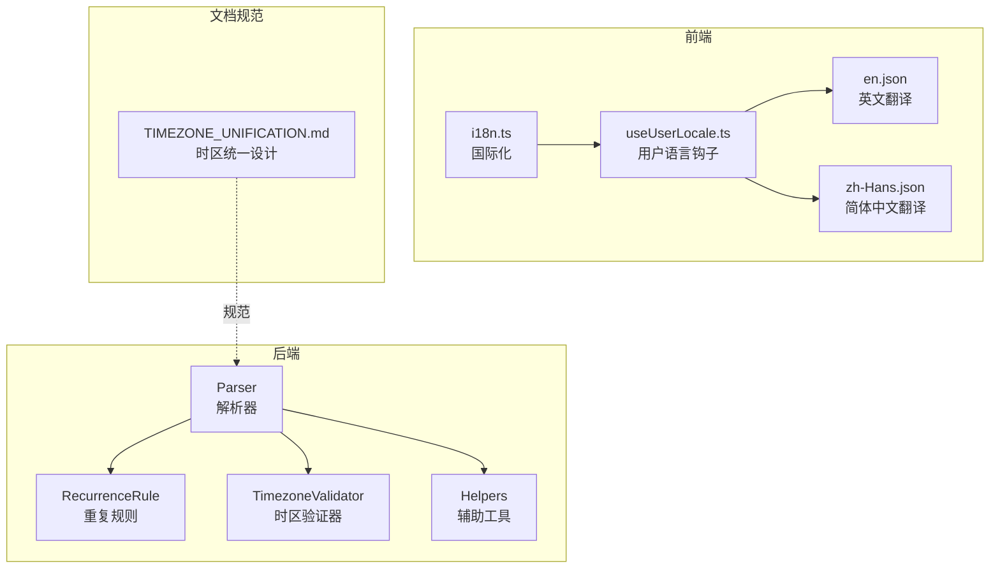
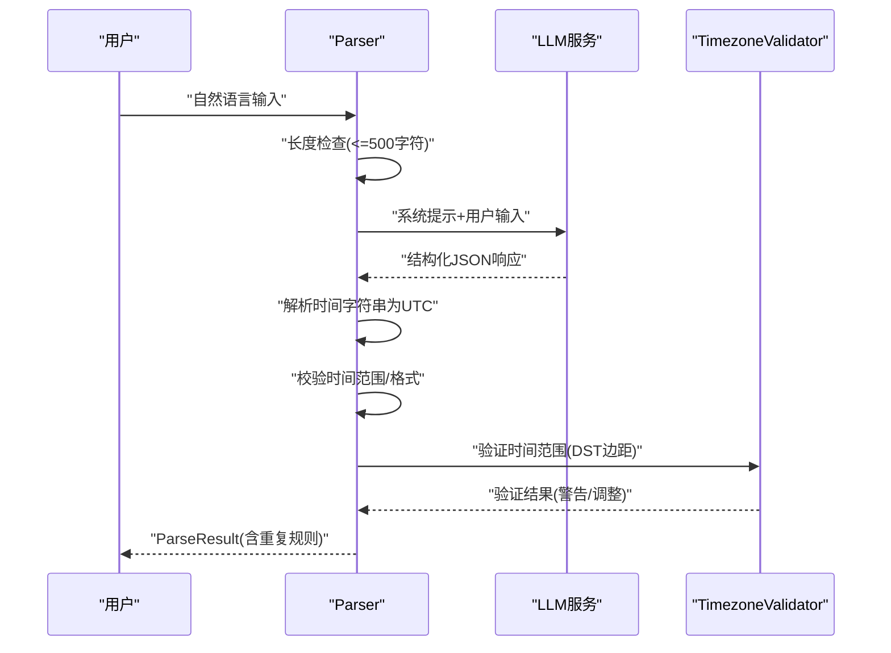
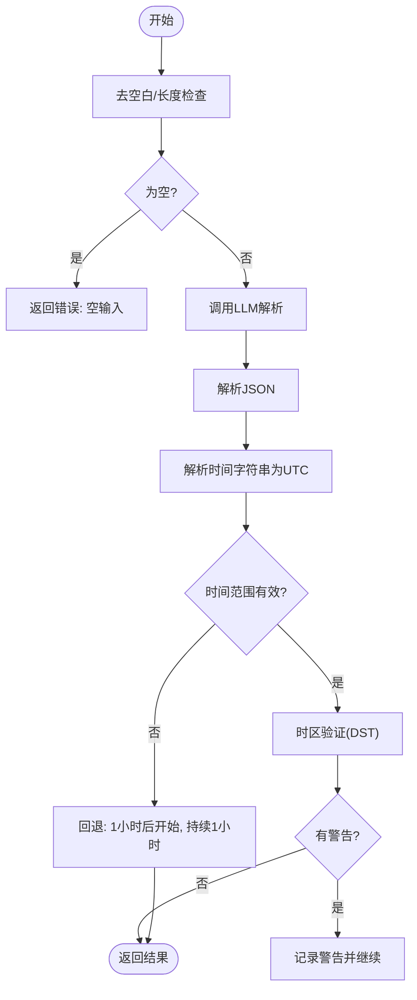
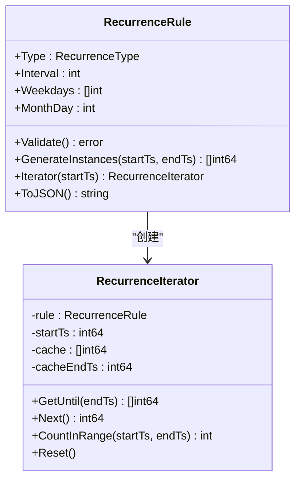
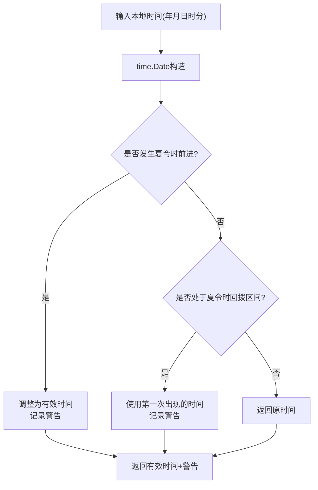
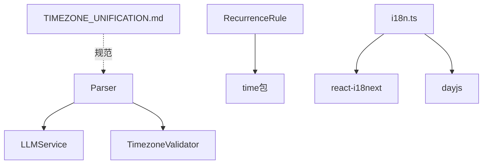

# 自然语言解析器

<cite>
**本文档引用的文件**
- [parser.go](file://plugin/ai/schedule/parser.go)
- [recurrence.go](file://plugin/ai/schedule/recurrence.go)
- [recurrence_test.go](file://plugin/ai/schedule/recurrence_test.go)
- [helpers.go](file://plugin/ai/schedule/helpers.go)
- [timezone_validator.go](file://plugin/ai/schedule/timezone_validator.go)
- [util.go](file://server/timezone/util.go)
- [en.json](file://web/src/locales/en.json)
- [zh-Hans.json](file://web/src/locales/zh-Hans.json)
- [i18n.ts](file://web/src/utils/i18n.ts)
- [useUserLocale.ts](file://web/src/hooks/useUserLocale.ts)
- [TIMEZONE_UNIFICATION.md](file://docs/archived/cleanup_20260123/chat_audit_fixes/specs/TIMEZONE_UNIFICATION.md)
</cite>

## 目录
1. [简介](#简介)
2. [项目结构](#项目结构)
3. [核心组件](#核心组件)
4. [架构总览](#架构总览)
5. [详细组件分析](#详细组件分析)
6. [依赖关系分析](#依赖关系分析)
7. [性能考虑](#性能考虑)
8. [故障排除指南](#故障排除指南)
9. [结论](#结论)
10. [附录](#附录)

## 简介
本文件系统性地阐述自然语言解析器的设计与实现，重点覆盖以下方面：
- 时间关键词识别与提取算法：相对时间（明天、下周一）、绝对时间（2026-01-21 14:30:00）与混合时间的解析策略
- 日期时间格式识别与标准化：统一输出为 UTC 的 "YYYY-MM-DD HH:mm:ss" 格式
- 时区解析与验证：基于 IANA 时区数据库的集成与 DST 边界处理
- 重复规则的自然语言表达解析：如"每天""每周一""每月15号"等
- 错误处理与回退策略：输入长度限制、JSON 解析失败、时间范围校验、DST 边界警告
- 解析精度评估与常见失败场景：相对时间歧义、非法时间、跨日事件、重复规则不完整
- 扩展指南：如何新增时间表达方式与本地化支持

## 项目结构
解析器位于后端 Go 模块中，采用模块化设计：
- 解析器主体：负责自然语言输入的解析、格式标准化与错误处理
- 重复规则引擎：提供简洁的 JSON 表达与实例生成
- 时区验证器：处理 DST 边界与无效/模糊时间
- 前端本地化：提供多语言支持与本地化显示

**图表来源**
- [parser.go](file://plugin/ai/schedule/parser.go#L21-L47)
- [recurrence.go](file://plugin/ai/schedule/recurrence.go#L40-L47)
- [timezone_validator.go](file://plugin/ai/schedule/timezone_validator.go#L21-L25)
- [i18n.ts](file://web/src/utils/i18n.ts#L1-L41)
- [useUserLocale.ts](file://web/src/hooks/useUserLocale.ts#L10-L21)
- [TIMEZONE_UNIFICATION.md](file://docs/archived/cleanup_20260123/chat_audit_fixes/specs/TIMEZONE_UNIFICATION.md#L40-L68)

**章节来源**
- [parser.go](file://plugin/ai/schedule/parser.go#L16-L47)
- [recurrence.go](file://plugin/ai/schedule/recurrence.go#L13-L47)
- [timezone_validator.go](file://plugin/ai/schedule/timezone_validator.go#L21-L39)
- [i18n.ts](file://web/src/utils/i18n.ts#L1-L41)
- [useUserLocale.ts](file://web/src/hooks/useUserLocale.ts#L10-L21)
- [TIMEZONE_UNIFICATION.md](file://docs/archived/cleanup_20260123/chat_audit_fixes/specs/TIMEZONE_UNIFICATION.md#L40-L68)

## 核心组件
- 解析器 Parser：接收自然语言输入，通过 LLM 输出结构化 JSON，再进行格式校验与时区验证
- 重复规则 RecurrenceRule：简化版 RRULE，支持每日/每周/每月，提供实例生成与迭代器
- 时区验证器 TimezoneValidator：处理 DST 边界（夏令时前进/回拨）与无效/模糊时间
- 辅助工具 Helpers：提醒项的序列化/反序列化
- 前端国际化：多语言翻译与用户语言应用

**章节来源**
- [parser.go](file://plugin/ai/schedule/parser.go#L21-L60)
- [recurrence.go](file://plugin/ai/schedule/recurrence.go#L40-L47)
- [timezone_validator.go](file://plugin/ai/schedule/timezone_validator.go#L21-L25)
- [helpers.go](file://plugin/ai/schedule/helpers.go#L10-L32)

## 架构总览
解析流程分为三个阶段：
1) 输入预处理与长度限制
2) LLM 结构化解析与格式校验
3) 时区验证与回退策略

**图表来源**
- [parser.go](file://plugin/ai/schedule/parser.go#L63-L76)
- [parser.go](file://plugin/ai/schedule/parser.go#L95-L254)
- [parser.go](file://plugin/ai/schedule/parser.go#L258-L348)
- [timezone_validator.go](file://plugin/ai/schedule/timezone_validator.go#L110-L129)

**章节来源**
- [parser.go](file://plugin/ai/schedule/parser.go#L63-L348)

## 详细组件分析

### 解析器 Parser
- 输入约束：最大长度 500 字符；空输入直接报错
- LLM Prompt：明确要求输出 UTC 时间、固定格式、相对时间计算步骤、全天事件规则、时长计算规则、标题清洗规则、提醒提取规则、验证清单
- 时间解析：去除 UTC 后缀，按 "YYYY-MM-DD HH:mm:ss" 解析为 UTC 秒级时间戳
- 校验规则：
  - 开始时间不得早于当前 UTC 时间前 24 小时
  - 结束时间不得早于开始时间
  - 若解析失败，回退到"1小时后开始，持续1小时"
- 时区验证：调用 TimezoneValidator 对起止时间进行 DST 边界检查，记录警告但继续执行

**图表来源**
- [parser.go](file://plugin/ai/schedule/parser.go#L63-L76)
- [parser.go](file://plugin/ai/schedule/parser.go#L258-L348)
- [timezone_validator.go](file://plugin/ai/schedule/timezone_validator.go#L110-L129)

**章节来源**
- [parser.go](file://plugin/ai/schedule/parser.go#L16-L76)
- [parser.go](file://plugin/ai/schedule/parser.go#L95-L254)
- [parser.go](file://plugin/ai/schedule/parser.go#L258-L348)

### 重复规则 RecurrenceRule
- 支持类型：daily、weekly、monthly
- 关键字段：interval（间隔）、weekdays（周一至周日映射为1-7）、month_day（1-31）
- 校验规则：
  - 类型必须有效
  - interval 必须为正数
  - weekly 必须指定至少一个 weekday
  - monthly 必须在 1-31 之间
- 实例生成：
  - daily：按 interval 天递增
  - weekly：按 interval 周递增，并匹配目标 weekday
  - monthly：按 interval 月递增，处理月末边界（如 1/31 → 2/28 或 2/29）
- 迭代器：RecurrenceIterator 支持懒加载与缓存，避免一次性生成大量实例

**图表来源**
- [recurrence.go](file://plugin/ai/schedule/recurrence.go#L40-L47)
- [recurrence.go](file://plugin/ai/schedule/recurrence.go#L342-L363)

**章节来源**
- [recurrence.go](file://plugin/ai/schedule/recurrence.go#L49-L75)
- [recurrence.go](file://plugin/ai/schedule/recurrence.go#L151-L193)
- [recurrence.go](file://plugin/ai/schedule/recurrence.go#L342-L557)

### 时区验证器 TimezoneValidator
- 功能：
  - ValidateLocalTime：处理夏令时前进（无效时间）与回拨（模糊时间），返回调整后的有效时间与警告
  - ValidateTimestamp：对 Unix 时间戳进行本地化验证
  - ValidateTimeRange：批量验证起止时间
  - DSTTransitionInfo：检测未来时间范围内的 DST 变更
- DST 边界处理：
  - 夏令时前进：缺失的本地时间向前调整
  - 夏令时回拨：同一本地时间出现两次，使用第一次出现的时间

**图表来源**
- [timezone_validator.go](file://plugin/ai/schedule/timezone_validator.go#L41-L96)
- [timezone_validator.go](file://plugin/ai/schedule/timezone_validator.go#L149-L168)

**章节来源**
- [timezone_validator.go](file://plugin/ai/schedule/timezone_validator.go#L41-L129)
- [timezone_validator.go](file://plugin/ai/schedule/timezone_validator.go#L149-L247)

### 本地化与多语言支持
- 前端 i18n.ts：支持 en、zh-Hans、zh-Hant；提供语言匹配与回退策略
- useUserLocale.ts：根据用户设置、localStorage、浏览器语言应用语言包
- 翻译文件：web/src/locales/*.json 提供界面文案与本地化标签
- 时区统一设计文档：明确全程使用用户本地时区策略，避免 UTC 与本地时区混淆

**章节来源**
- [i18n.ts](file://web/src/utils/i18n.ts#L1-L41)
- [useUserLocale.ts](file://web/src/hooks/useUserLocale.ts#L10-L35)
- [en.json](file://web/src/locales/en.json#L134-L142)
- [zh-Hans.json](file://web/src/locales/zh-Hans.json#L134-L142)
- [TIMEZONE_UNIFICATION.md](file://docs/archived/cleanup_20260123/chat_audit_fixes/specs/TIMEZONE_UNIFICATION.md#L40-L68)

## 依赖关系分析
- Parser 依赖 LLMService 与 TimezoneValidator
- RecurrenceRule 依赖 time 包进行时间运算
- 前端 i18n 依赖 react-i18next 与 dayjs
- 时区统一设计文档为系统级规范

**图表来源**
- [parser.go](file://plugin/ai/schedule/parser.go#L22-L26)
- [recurrence.go](file://plugin/ai/schedule/recurrence.go#L3-L11)
- [i18n.ts](file://web/src/utils/i18n.ts#L1-L41)
- [TIMEZONE_UNIFICATION.md](file://docs/archived/cleanup_20260123/chat_audit_fixes/specs/TIMEZONE_UNIFICATION.md#L40-L68)

**章节来源**
- [parser.go](file://plugin/ai/schedule/parser.go#L22-L26)
- [recurrence.go](file://plugin/ai/schedule/recurrence.go#L3-L11)
- [i18n.ts](file://web/src/utils/i18n.ts#L1-L41)
- [TIMEZONE_UNIFICATION.md](file://docs/archived/cleanup_20260123/chat_audit_fixes/specs/TIMEZONE_UNIFICATION.md#L40-L68)

## 性能考虑
- 重复规则实例生成限制：
  - daily 最多 1000 个实例或约 1 年范围
  - weekly 最多 520 个实例（约 10 年）
  - monthly 最多 120 个实例（约 10 年）
- RecurrenceIterator 懒加载与缓存，避免一次性生成大量实例
- 时区验证仅在必要时进行，减少额外开销

**章节来源**
- [recurrence.go](file://plugin/ai/schedule/recurrence.go#L196-L215)
- [recurrence.go](file://plugin/ai/schedule/recurrence.go#L217-L241)
- [recurrence.go](file://plugin/ai/schedule/recurrence.go#L243-L282)
- [recurrence.go](file://plugin/ai/schedule/recurrence.go#L365-L393)

## 故障排除指南
- 输入过长：超过 500 字符将直接报错
- LLM 响应非 JSON：解析失败时返回错误，提示响应内容
- 时间过早：开始时间早于当前 UTC 前 24 小时将报错
- 结束时间早于开始时间：直接报错
- 重复规则无效：类型不合法、interval 非正、weekly 缺少 weekday、monthly day 超界
- DST 边界警告：时区验证器会记录并警告，但不会阻止执行
- 本地化语言缺失：回退到 en，RTL 语言需单独处理

**章节来源**
- [parser.go](file://plugin/ai/schedule/parser.go#L69-L72)
- [parser.go](file://plugin/ai/schedule/parser.go#L273-L276)
- [parser.go](file://plugin/ai/schedule/parser.go#L306-L314)
- [recurrence.go](file://plugin/ai/schedule/recurrence.go#L49-L75)
- [timezone_validator.go](file://plugin/ai/schedule/timezone_validator.go#L110-L129)
- [i18n.ts](file://web/src/utils/i18n.ts#L73-L96)

## 结论
该解析器通过明确的 LLM Prompt、严格的格式与范围校验、完善的时区验证与回退策略，实现了高鲁棒性的自然语言日程解析。重复规则引擎提供了简洁而强大的周期性事件建模能力。前端多语言支持与系统级时区统一设计进一步提升了用户体验与一致性。

## 附录

### 时间关键词识别与提取算法
- 相对时间：基于用户本地时区的"明天""下周一""本周五"等，按步骤计算目标日期，再加时间片段，最终转换为 UTC
- 绝对时间：严格按 "YYYY-MM-DD HH:mm:ss" 解析，要求无时区后缀
- 混合时间：先解析相对部分得到基准日期，再解析时间片段，最后统一转换为 UTC

**章节来源**
- [parser.go](file://plugin/ai/schedule/parser.go#L111-L166)
- [parser.go](file://plugin/ai/schedule/parser.go#L281-L293)

### 日期时间格式识别与标准化
- 统一输出格式："YYYY-MM-DD HH:mm:ss"（UTC）
- 时区规则：LLM 必须返回 UTC 时间且不带时区后缀
- 标题清洗：移除时间/日期关键词，保留事件主体

**章节来源**
- [parser.go](file://plugin/ai/schedule/parser.go#L103-L108)
- [parser.go](file://plugin/ai/schedule/parser.go#L214-L227)

### 时区解析与验证机制
- IANA 时区数据库集成：time.LoadLocation 加载用户时区
- DST 边界处理：前进（无效时间）与回拨（模糊时间）分别处理
- 偏移量计算：time.Date 自动处理偏移变化

**章节来源**
- [parser.go](file://plugin/ai/schedule/parser.go#L29-L38)
- [timezone_validator.go](file://plugin/ai/schedule/timezone_validator.go#L49-L96)
- [util.go](file://server/timezone/util.go#L150-L170)

### 重复规则解析示例
- "每天" → daily, interval=1
- "每3天" → daily, interval=3
- "每周" → weekly, interval=1, weekdays=[1,2,3,4,5]
- "每周一" → weekly, interval=1, weekdays=[1]
- "每两周" → weekly, interval=2, weekdays=[1,2,3,4,5]
- "每月15号" → monthly, interval=1, month_day=15

**章节来源**
- [recurrence.go](file://plugin/ai/schedule/recurrence.go#L77-L149)
- [recurrence_test.go](file://plugin/ai/schedule/recurrence_test.go#L11-L121)

### 错误处理与回退策略
- 输入长度限制与空输入检查
- JSON 解析失败的错误提示
- 时间范围校验与回退到默认时间
- 重复规则校验与错误返回
- 时区验证警告记录与继续执行

**章节来源**
- [parser.go](file://plugin/ai/schedule/parser.go#L69-L72)
- [parser.go](file://plugin/ai/schedule/parser.go#L273-L276)
- [parser.go](file://plugin/ai/schedule/parser.go#L306-L323)
- [recurrence.go](file://plugin/ai/schedule/recurrence.go#L49-L75)
- [timezone_validator.go](file://plugin/ai/schedule/timezone_validator.go#L324-L334)

### 解析精度评估与常见失败场景
- 相对时间歧义：如"明天下午2点"与"明天上午9点到11点"，需明确时间段
- 非法时间：如 2:30 AM 在夏令时前进时不存在
- 跨日事件：如"今晚11点到凌晨2点"，需正确处理 UTC 边界
- 重复规则不完整：如"每周"未指定具体星期几，默认为周一至周五

**章节来源**
- [parser.go](file://plugin/ai/schedule/parser.go#L159-L166)
- [timezone_validator.go](file://plugin/ai/schedule/timezone_validator.go#L49-L96)
- [recurrence.go](file://plugin/ai/schedule/recurrence.go#L58-L72)

### 扩展解析器以支持新的时间表达方式
- 新增正则表达式与解析逻辑：在 ParseRecurrenceRule 中添加新模式
- 更新测试用例：在 recurrence_test.go 中补充用例
- 前端本地化：在 web/src/locales/*.json 中添加对应翻译
- 时区统一：遵循 TIMEZONE_UNIFICATION.md 的策略，确保用户本地时区一致性

**章节来源**
- [recurrence.go](file://plugin/ai/schedule/recurrence.go#L77-L149)
- [recurrence_test.go](file://plugin/ai/schedule/recurrence_test.go#L11-L121)
- [i18n.ts](file://web/src/utils/i18n.ts#L1-L41)
- [TIMEZONE_UNIFICATION.md](file://docs/archived/cleanup_20260123/chat_audit_fixes/specs/TIMEZONE_UNIFICATION.md#L40-L68)