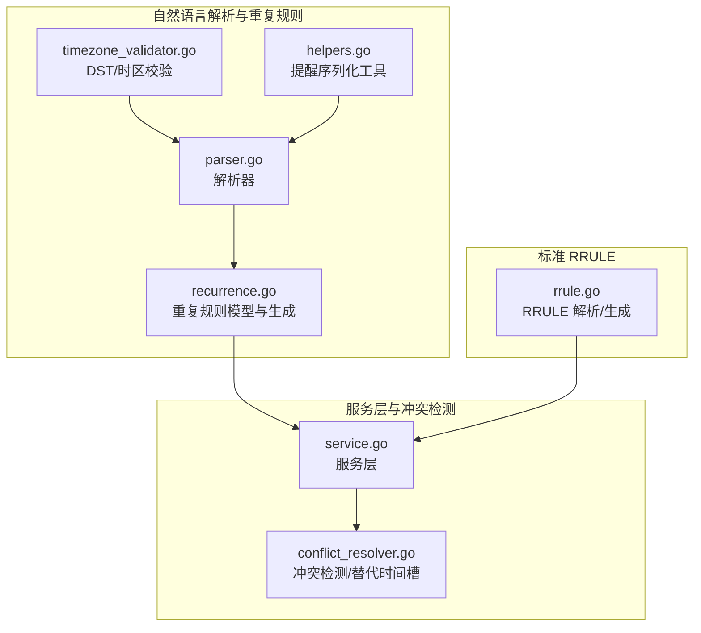
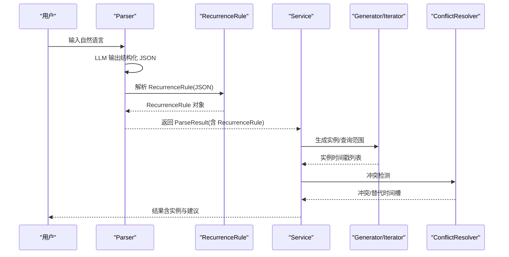
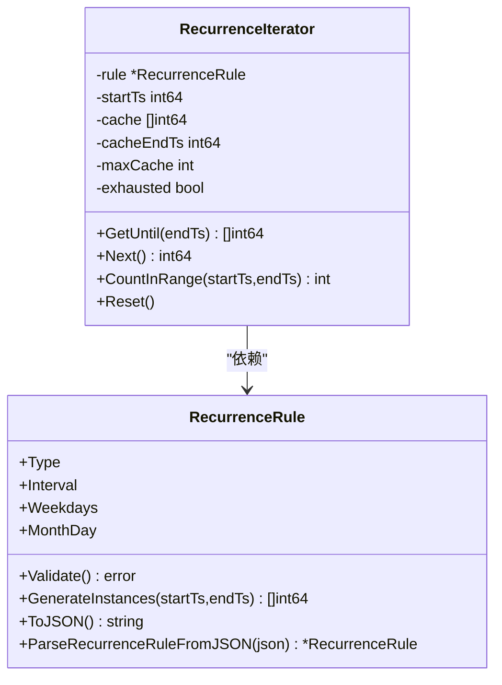
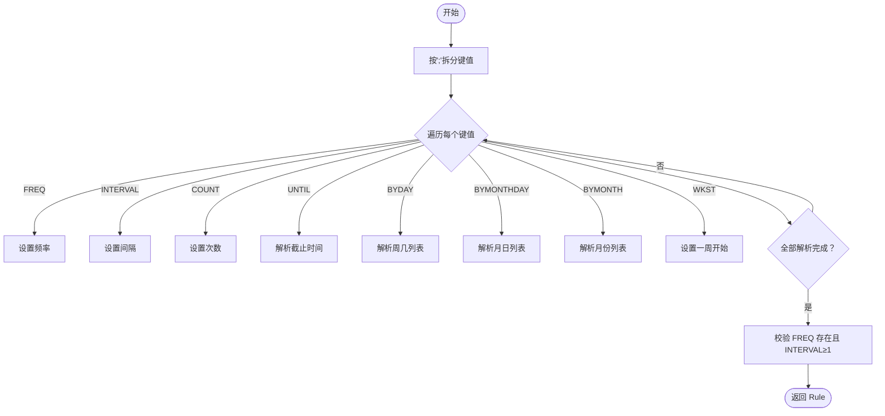
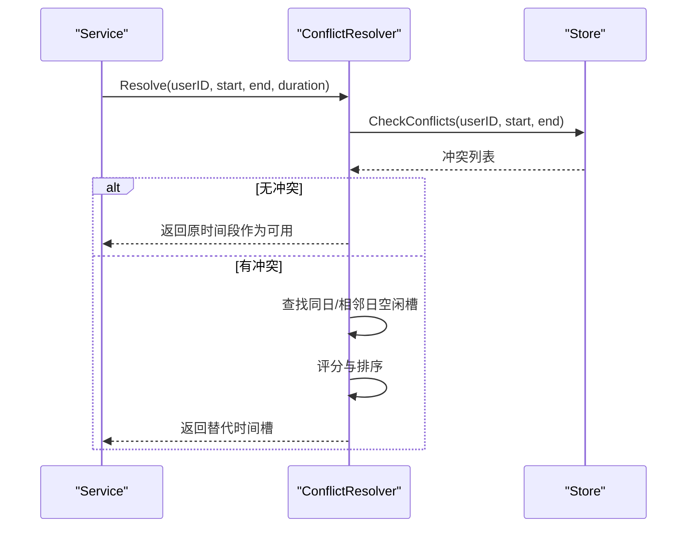
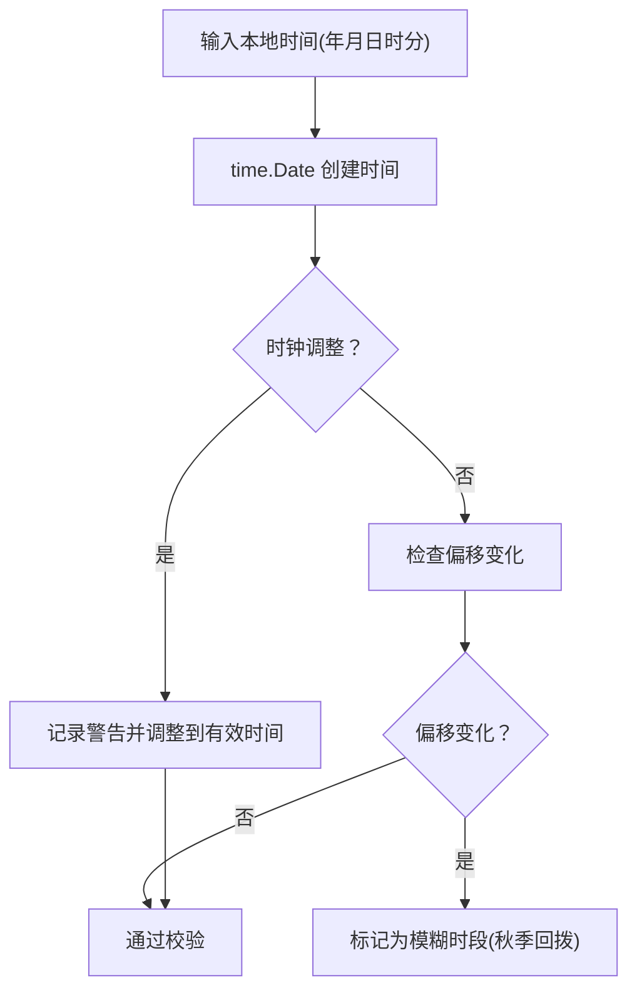
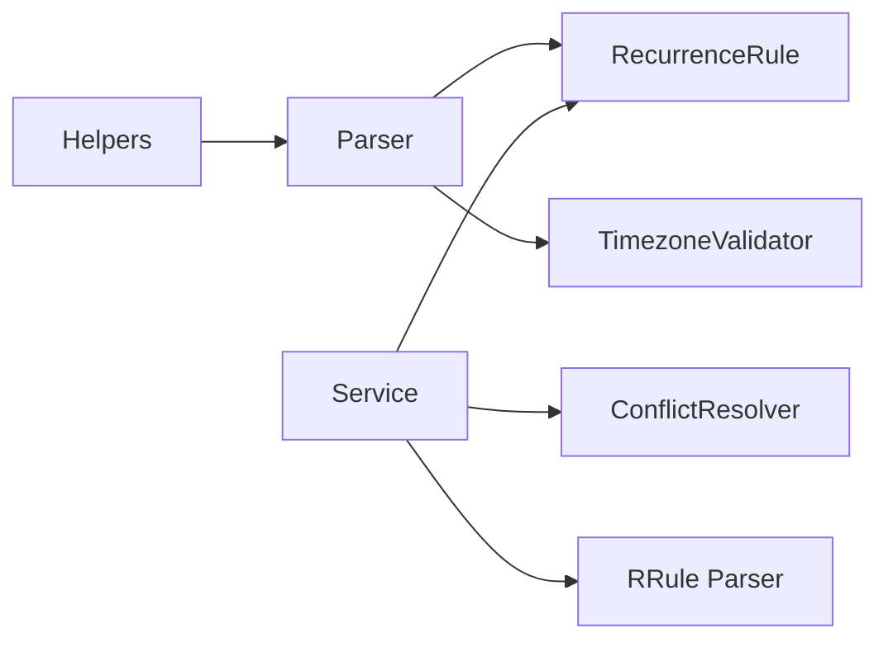

# 重复规则系统

<cite>
**本文引用的文件**
- [plugin/ai/schedule/recurrence.go](file://plugin/ai/schedule/recurrence.go)
- [plugin/ai/schedule/parser.go](file://plugin/ai/schedule/parser.go)
- [plugin/ai/schedule/timezone_validator.go](file://plugin/ai/schedule/timezone_validator.go)
- [server/scheduler/rrule/rrule.go](file://server/scheduler/rrule/rrule.go)
- [server/service/schedule/conflict_resolver.go](file://server/service/schedule/conflict_resolver.go)
- [server/service/schedule/service.go](file://server/service/schedule/service.go)
- [plugin/ai/schedule/recurrence_test.go](file://plugin/ai/schedule/recurrence_test.go)
- [server/scheduler/rrule/rrule_test.go](file://server/scheduler/rrule/rrule_test.go)
- [plugin/ai/schedule/helpers.go](file://plugin/ai/schedule/helpers.go)
- [server/service/schedule/conflict_resolver_test.go](file://server/service/schedule/conflict_resolver_test.go)
</cite>

## 目录
1. [简介](#简介)
2. [项目结构](#项目结构)
3. [核心组件](#核心组件)
4. [架构总览](#架构总览)
5. [详细组件分析](#详细组件分析)
6. [依赖关系分析](#依赖关系分析)
7. [性能考量](#性能考量)
8. [故障排查指南](#故障排查指南)
9. [结论](#结论)
10. [附录](#附录)

## 简介
本文件系统性地梳理并说明本仓库中的重复规则系统，涵盖两类实现：
- 自然语言到重复规则的解析（简化的自定义格式）
- 标准 RRULE（RFC 5545）解析与实例生成

重点内容包括：
- 频率类型、间隔设置、结束条件与例外日期处理
- 字符串到结构体的解析算法
- 实例生成算法（含时间戳迭代器与边界条件）
- 与冲突检测的集成方式
- 常见重复模式示例
- 验证与错误处理机制
- 复杂规则组合与时区问题处理

## 项目结构
重复规则系统主要分布在以下模块：
- 自然语言解析与重复规则生成：plugin/ai/schedule
- 标准 RRULE 解析与生成：server/scheduler/rrule
- 冲突检测与时间槽建议：server/service/schedule
- 时间区与夏令时处理：plugin/ai/schedule/timezone_validator.go

图表来源
- [plugin/ai/schedule/parser.go](file://plugin/ai/schedule/parser.go#L21-L47)
- [plugin/ai/schedule/recurrence.go](file://plugin/ai/schedule/recurrence.go#L40-L75)
- [plugin/ai/schedule/timezone_validator.go](file://plugin/ai/schedule/timezone_validator.go#L21-L39)
- [server/scheduler/rrule/rrule.go](file://server/scheduler/rrule/rrule.go#L37-L53)
- [server/service/schedule/service.go](file://server/service/schedule/service.go#L88-L192)
- [server/service/schedule/conflict_resolver.go](file://server/service/schedule/conflict_resolver.go#L13-L24)

章节来源
- [plugin/ai/schedule/parser.go](file://plugin/ai/schedule/parser.go#L21-L47)
- [plugin/ai/schedule/recurrence.go](file://plugin/ai/schedule/recurrence.go#L40-L75)
- [server/scheduler/rrule/rrule.go](file://server/scheduler/rrule/rrule.go#L37-L53)
- [server/service/schedule/service.go](file://server/service/schedule/service.go#L88-L192)
- [server/service/schedule/conflict_resolver.go](file://server/service/schedule/conflict_resolver.go#L13-L24)

## 核心组件
- 自然语言解析器 Parser：负责将用户输入的自然语言解析为结构化 Schedule，其中包含重复规则 RecurrenceRule。
- 重复规则 RecurrenceRule：自定义 JSON 格式，支持 daily/weekly/monthly，包含间隔、工作日集合、月日等字段。
- RRULE 解析器与生成器：遵循 RFC 5545 的 RRULE 解析与实例生成，支持 FREQ、INTERVAL、COUNT、UNTIL、BYDAY、BYMONTHDAY 等。
- 冲突检测 ConflictResolver：在创建/查询时检测冲突，并提供替代时间槽建议。
- 时间区与夏令时校验 TimezoneValidator：处理 DST 边界导致的无效/模糊时间。

章节来源
- [plugin/ai/schedule/parser.go](file://plugin/ai/schedule/parser.go#L49-L60)
- [plugin/ai/schedule/recurrence.go](file://plugin/ai/schedule/recurrence.go#L40-L47)
- [server/scheduler/rrule/rrule.go](file://server/scheduler/rrule/rrule.go#L37-L53)
- [server/service/schedule/conflict_resolver.go](file://server/service/schedule/conflict_resolver.go#L13-L43)
- [plugin/ai/schedule/timezone_validator.go](file://plugin/ai/schedule/timezone_validator.go#L14-L25)

## 架构总览
自然语言解析流程（简化的自定义格式）：
- 用户输入 → Parser → RecurrenceRule（JSON）→ 服务层 → 实例生成/冲突检测
- 服务层同时支持标准 RRULE（server/scheduler/rrule），可与自定义格式并存

图表来源
- [plugin/ai/schedule/parser.go](file://plugin/ai/schedule/parser.go#L90-L347)
- [plugin/ai/schedule/recurrence.go](file://plugin/ai/schedule/recurrence.go#L151-L193)
- [server/service/schedule/service.go](file://server/service/schedule/service.go#L88-L192)
- [server/service/schedule/conflict_resolver.go](file://server/service/schedule/conflict_resolver.go#L45-L96)

## 详细组件分析

### 组件A：自然语言解析与重复规则（RecurrenceRule）
- 支持的频率：daily、weekly、monthly
- 关键字段：
  - type：频率类型
  - interval：间隔（正整数）
  - weekdays：工作日集合（1-7，周一到周日）
  - month_day：月日（1-31）
- 校验规则：
  - type 必须有效
  - interval > 0
  - weekly：必须提供至少一个工作日
  - monthly：month_day 在 1-31 范围内
- 解析算法：
  - 使用正则匹配中文“每天/每周/每月”等模式，提取 interval 与具体工作日或月日
  - 支持“每N天/每N周/每月N号”等变体
- 实例生成：
  - GenerateInstances：按起止时间生成实例时间戳
  - RecurrenceIterator：惰性迭代器，带缓存与上限控制，适合大范围或无限规则
- 时区处理：
  - 所有时间戳以 UTC 存储与计算；调用方需在进入前完成本地时间到 UTC 的转换
  - 提供专用注释说明 UTC 行为与注意事项

图表来源
- [plugin/ai/schedule/recurrence.go](file://plugin/ai/schedule/recurrence.go#L40-L47)
- [plugin/ai/schedule/recurrence.go](file://plugin/ai/schedule/recurrence.go#L341-L363)

章节来源
- [plugin/ai/schedule/recurrence.go](file://plugin/ai/schedule/recurrence.go#L49-L75)
- [plugin/ai/schedule/recurrence.go](file://plugin/ai/schedule/recurrence.go#L77-L149)
- [plugin/ai/schedule/recurrence.go](file://plugin/ai/schedule/recurrence.go#L151-L282)
- [plugin/ai/schedule/recurrence.go](file://plugin/ai/schedule/recurrence.go#L341-L555)

### 组件B：标准 RRULE 解析与生成（RFC 5545）
- 支持的关键参数：
  - FREQ：频率（SECONDLY、MINUTELY、HOURLY、DAILY、WEEKLY、MONTHLY、YEARLY）
  - INTERVAL：间隔
  - COUNT：次数
  - UNTIL：截止时间（UTC 时间）
  - BYDAY：按周几过滤（MO、TU、WE、TH、FR、SA、SU）
  - BYMONTHDAY：按月日过滤
  - BYMONTH：按月过滤
  - WKST：一周开始日
- 解析流程：
  - 按分号拆分键值对，逐项解析并赋值到 Rule 结构
  - 校验 FREQ 存在且 INTERVAL ≥ 1
- 生成流程：
  - All：生成最多 maxOccurrences 或受 COUNT/UNTIL 限制
  - Between：在指定范围内生成
  - next：根据频率类型推进到下一个实例

图表来源
- [server/scheduler/rrule/rrule.go](file://server/scheduler/rrule/rrule.go#L63-L123)

章节来源
- [server/scheduler/rrule/rrule.go](file://server/scheduler/rrule/rrule.go#L37-L53)
- [server/scheduler/rrule/rrule.go](file://server/scheduler/rrule/rrule.go#L63-L123)
- [server/scheduler/rrule/rrule.go](file://server/scheduler/rrule/rrule.go#L148-L232)
- [server/scheduler/rrule/rrule.go](file://server/scheduler/rrule/rrule.go#L234-L266)

### 组件C：冲突检测与替代时间槽
- 功能：
  - 检测请求时间段与现有日程的冲突
  - 在同一天、相邻天寻找空闲时间槽
  - 计算评分并排序，提供最佳替代时间
- 关键点：
  - 服务层在查询/创建时调用冲突检测
  - 冲突检测会考虑重复规则展开后的实例
  - 提供替代时间槽建议，便于自动解决

图表来源
- [server/service/schedule/service.go](file://server/service/schedule/service.go#L88-L192)
- [server/service/schedule/conflict_resolver.go](file://server/service/schedule/conflict_resolver.go#L45-L96)
- [server/service/schedule/conflict_resolver.go](file://server/service/schedule/conflict_resolver.go#L114-L165)

章节来源
- [server/service/schedule/conflict_resolver.go](file://server/service/schedule/conflict_resolver.go#L13-L43)
- [server/service/schedule/conflict_resolver.go](file://server/service/schedule/conflict_resolver.go#L114-L165)
- [server/service/schedule/conflict_resolver.go](file://server/service/schedule/conflict_resolver.go#L254-L326)

### 组件D：时间区与时差处理（DST）
- TimezoneValidator：
  - 校验本地时间是否有效（春季前进跳过时段）
  - 处理秋季回拨的模糊时间（同一本地时间出现两次）
  - 提供 DST 过渡信息查询
- Parser：
  - 在解析过程中调用 TimezoneValidator 校验时间范围
  - 确保解析出的时间在目标时区下合法

图表来源
- [plugin/ai/schedule/timezone_validator.go](file://plugin/ai/schedule/timezone_validator.go#L41-L96)
- [plugin/ai/schedule/timezone_validator.go](file://plugin/ai/schedule/timezone_validator.go#L149-L168)

章节来源
- [plugin/ai/schedule/timezone_validator.go](file://plugin/ai/schedule/timezone_validator.go#L14-L25)
- [plugin/ai/schedule/timezone_validator.go](file://plugin/ai/schedule/timezone_validator.go#L41-L96)
- [plugin/ai/schedule/parser.go](file://plugin/ai/schedule/parser.go#L324-L334)

## 依赖关系分析
- 自然语言解析器依赖 RecurrenceRule 与 TimezoneValidator
- 服务层依赖冲突检测器与存储层
- RRULE 解析器独立于自然语言解析器，但服务层可同时支持两种格式
- 提醒序列化工具辅助存储 Reminder 字段

图表来源
- [plugin/ai/schedule/parser.go](file://plugin/ai/schedule/parser.go#L21-L47)
- [plugin/ai/schedule/recurrence.go](file://plugin/ai/schedule/recurrence.go#L40-L75)
- [plugin/ai/schedule/timezone_validator.go](file://plugin/ai/schedule/timezone_validator.go#L21-L39)
- [server/service/schedule/service.go](file://server/service/schedule/service.go#L88-L192)
- [server/service/schedule/conflict_resolver.go](file://server/service/schedule/conflict_resolver.go#L13-L24)
- [server/scheduler/rrule/rrule.go](file://server/scheduler/rrule/rrule.go#L55-L61)
- [plugin/ai/schedule/helpers.go](file://plugin/ai/schedule/helpers.go#L10-L32)

章节来源
- [plugin/ai/schedule/parser.go](file://plugin/ai/schedule/parser.go#L21-L47)
- [plugin/ai/schedule/recurrence.go](file://plugin/ai/schedule/recurrence.go#L40-L75)
- [plugin/ai/schedule/timezone_validator.go](file://plugin/ai/schedule/timezone_validator.go#L21-L39)
- [server/service/schedule/service.go](file://server/service/schedule/service.go#L88-L192)
- [server/service/schedule/conflict_resolver.go](file://server/service/schedule/conflict_resolver.go#L13-L24)
- [server/scheduler/rrule/rrule.go](file://server/scheduler/rrule/rrule.go#L55-L61)
- [plugin/ai/schedule/helpers.go](file://plugin/ai/schedule/helpers.go#L10-L32)

## 性能考量
- RecurrenceIterator：
  - 惰性生成 + 缓存，避免一次性生成大量实例
  - 设置最大缓存大小与安全上限（10 年），防止无限循环
- 服务层实例展开：
  - 对重复规则展开设置总量上限，避免查询窗口过大导致性能问题
- RRULE 生成：
  - 受 COUNT/UNTIL 限制，或最大生成数量限制
- 冲突检测：
  - 仅在必要范围内查找空闲槽，避免全量扫描

章节来源
- [plugin/ai/schedule/recurrence.go](file://plugin/ai/schedule/recurrence.go#L341-L555)
- [server/service/schedule/service.go](file://server/service/schedule/service.go#L28-L35)
- [server/scheduler/rrule/rrule.go](file://server/scheduler/rrule/rrule.go#L167-L206)

## 故障排查指南
- 重复规则解析失败：
  - 检查输入是否符合“每天/每周/每月”等模式
  - 确认 interval 与 weekdays/month_day 合法
- 实例生成异常：
  - 确认传入的起始时间戳已转换为 UTC
  - 检查 endTs 是否大于 0，否则使用默认一年限制
- 冲突检测：
  - 若提示冲突，查看 ConflictResolver 返回的替代时间槽
  - 检查重复规则是否正确展开（服务层会将 RecurrenceRule 展开为实例）
- 夏令时问题：
  - 使用 TimezoneValidator 校验本地时间是否有效
  - 注意春季前进与秋季回拨的边界情况

章节来源
- [plugin/ai/schedule/recurrence.go](file://plugin/ai/schedule/recurrence.go#L49-L75)
- [plugin/ai/schedule/recurrence.go](file://plugin/ai/schedule/recurrence.go#L151-L193)
- [server/service/schedule/conflict_resolver.go](file://server/service/schedule/conflict_resolver.go#L45-L96)
- [plugin/ai/schedule/timezone_validator.go](file://plugin/ai/schedule/timezone_validator.go#L41-L96)

## 结论
本重复规则系统提供了两条路径：
- 自然语言到简化的重复规则（daily/weekly/monthly），适合快速对话式输入
- 标准 RRULE（RFC 5545），适合复杂规则与兼容性需求

两者在服务层均可被统一处理，结合冲突检测与时间区校验，形成完整的日程管理能力。推荐在需要强一致性和复杂规则时采用 RRULE，在日常对话场景中采用简化的自然语言解析。

## 附录

### 常见重复模式示例
- 每日：每天、每3天、每N天
- 每周：每周、每周一、每两周、每周一至周五、每周三和周五
- 每月：每月15号、每月1号、每月31号

章节来源
- [plugin/ai/schedule/recurrence.go](file://plugin/ai/schedule/recurrence.go#L77-L149)
- [plugin/ai/schedule/recurrence_test.go](file://plugin/ai/schedule/recurrence_test.go#L11-L121)

### RRULE 示例
- 每周一、周三、周五：FREQ=WEEKLY;BYDAY=MO,WE,FR
- 每天上午10点：FREQ=DAILY;BYHOUR=10
- 每月15号：FREQ=MONTHLY;BYMONTHDAY=15
- 每年1月1日：FREQ=YEARLY;BYMONTH=1;BYMONTHDAY=1

章节来源
- [server/scheduler/rrule/rrule_test.go](file://server/scheduler/rrule/rrule_test.go#L216-L235)

### 验证与错误处理
- RecurrenceRule.Validate：校验类型、间隔、工作日与月日合法性
- Parser.Parse：输入长度限制、LLM 输出 JSON 校验、时间范围有效性
- RRULE 解析：缺失 FREQ 报错，INTERVAL 小于 1 归一化为 1
- 冲突检测：返回结构化冲突错误，包含替代时间槽

章节来源
- [plugin/ai/schedule/recurrence.go](file://plugin/ai/schedule/recurrence.go#L49-L75)
- [plugin/ai/schedule/parser.go](file://plugin/ai/schedule/parser.go#L62-L76)
- [plugin/ai/schedule/parser.go](file://plugin/ai/schedule/parser.go#L272-L347)
- [server/scheduler/rrule/rrule.go](file://server/scheduler/rrule/rrule.go#L114-L123)
- [server/service/schedule/service.go](file://server/service/schedule/service.go#L37-L48)

### 复杂规则组合与时区问题
- 复杂规则组合：RRULE 支持 BYDAY、BYMONTHDAY、BYMONTH 等多维过滤
- 时区问题：所有时间戳以 UTC 存储；Parser 在解析时进行 DST 校验；TimezoneValidator 提供过渡期信息

章节来源
- [server/scheduler/rrule/rrule.go](file://server/scheduler/rrule/rrule.go#L37-L53)
- [plugin/ai/schedule/parser.go](file://plugin/ai/schedule/parser.go#L324-L334)
- [plugin/ai/schedule/timezone_validator.go](file://plugin/ai/schedule/timezone_validator.go#L170-L213)