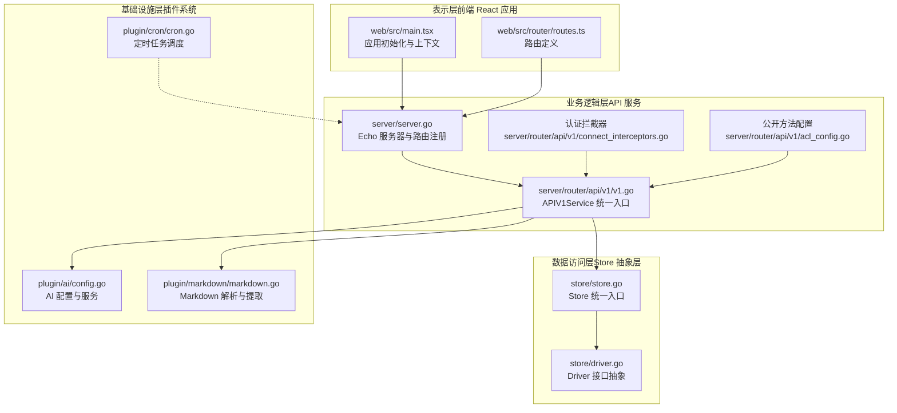
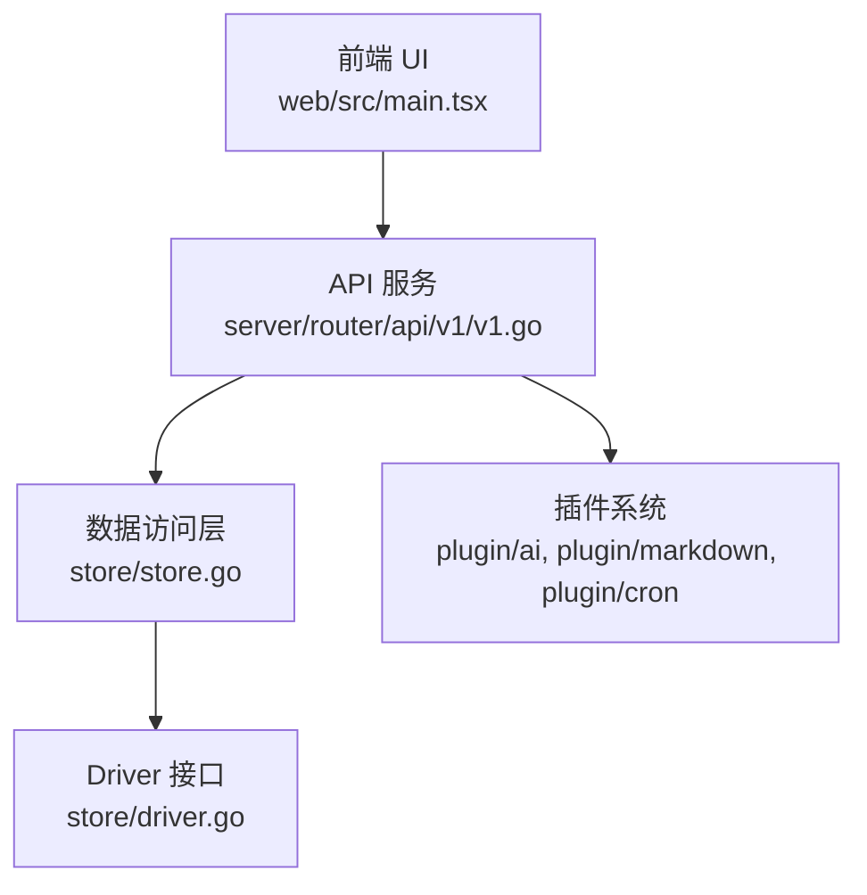
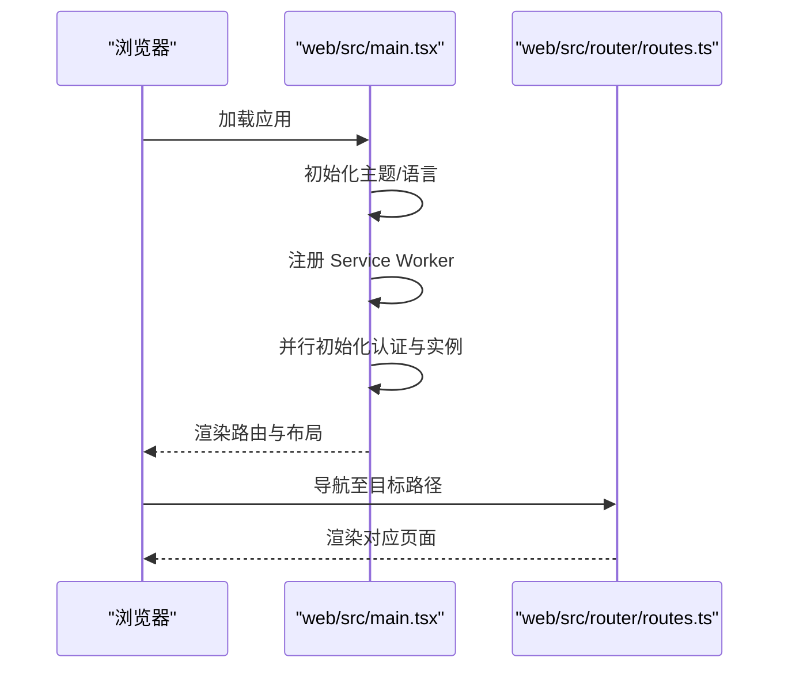
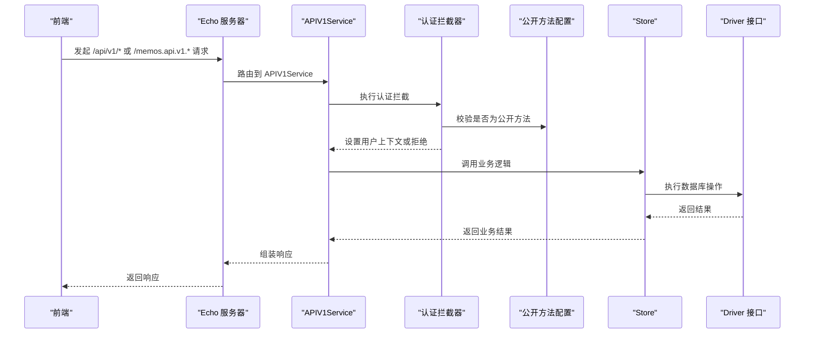
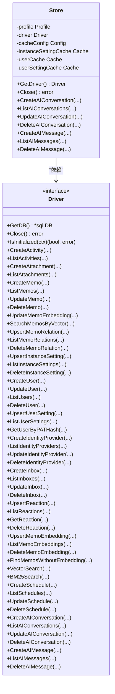
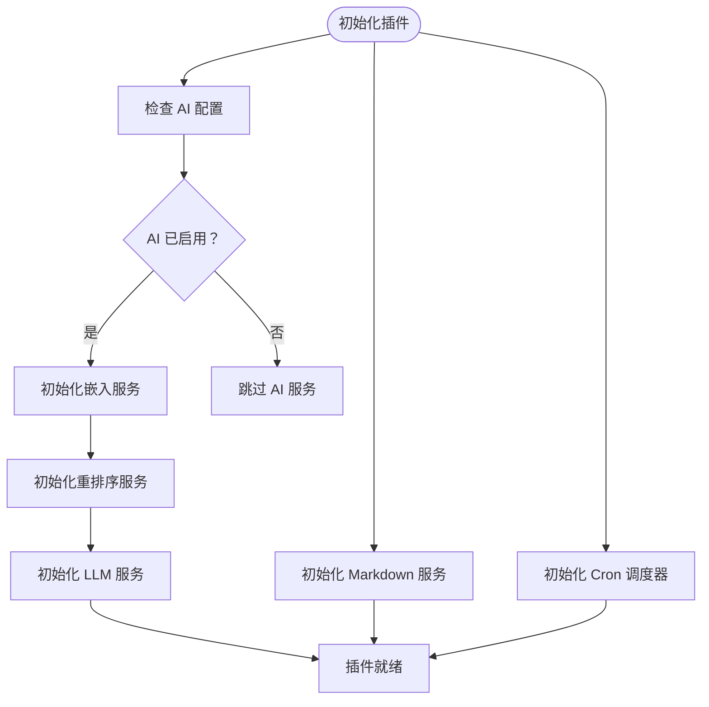
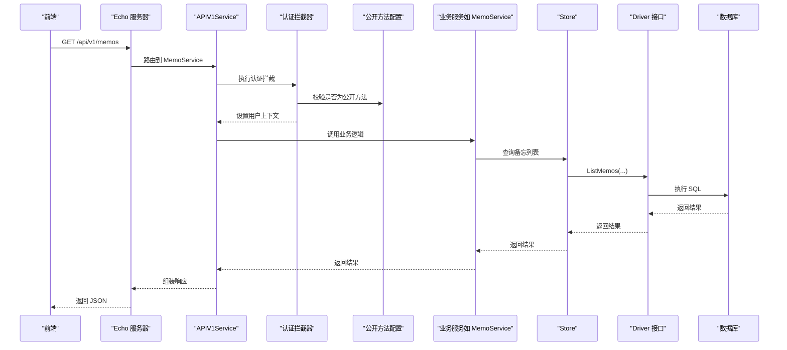
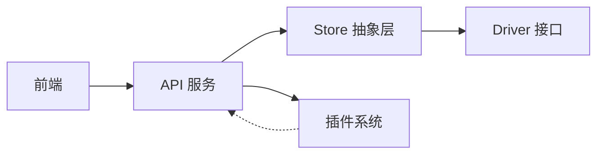

# 分层架构设计

<cite>
**本文档引用的文件**
- [README.md](file://README.md)
- [go.mod](file://go.mod)
- [server/server.go](file://server/server.go)
- [store/store.go](file://store/store.go)
- [store/driver.go](file://store/driver.go)
- [server/router/api/v1/v1.go](file://server/router/api/v1/v1.go)
- [plugin/ai/config.go](file://plugin/ai/config.go)
- [server/retrieval/adaptive_retrieval.go](file://server/retrieval/adaptive_retrieval.go)
- [server/service/schedule/service.go](file://server/service/schedule/service.go)
- [plugin/markdown/markdown.go](file://plugin/markdown/markdown.go)
- [plugin/cron/cron.go](file://plugin/cron/cron.go)
- [web/src/main.tsx](file://web/src/main.tsx)
- [web/src/router/routes.ts](file://web/src/router/routes.ts)
- [server/router/api/v1/acl_config.go](file://server/router/api/v1/acl_config.go)
- [server/router/api/v1/connect_interceptors.go](file://server/router/api/v1/connect_interceptors.go)
</cite>

## 目录
1. [引言](#引言)
2. [项目结构](#项目结构)
3. [核心组件](#核心组件)
4. [架构总览](#架构总览)
5. [详细组件分析](#详细组件分析)
6. [依赖分析](#依赖分析)
7. [性能考虑](#性能考虑)
8. [故障排除指南](#故障排除指南)
9. [结论](#结论)
10. [附录](#附录)

## 引言
本文件面向 Memos 项目的开发者与架构师，系统化阐述其分层架构设计：表示层（前端 React 应用）、业务逻辑层（API 服务）、数据访问层（Store 抽象层）、基础设施层（插件系统）。文档重点说明：
- 各层职责边界与接口定义
- 层间数据流与控制流
- 关注点分离、可维护性与可测试性的实现方式
- 依赖关系与解耦策略（接口抽象、依赖注入、事件驱动）
- 提供架构图与典型请求处理流程图，帮助快速理解系统层次化设计

## 项目结构
Memos 采用典型的四层架构组织代码：
- 表示层（前端）：React + Vite，负责用户交互与状态管理
- 业务逻辑层（后端 API）：Go + Echo + Connect RPC，提供 gRPC-HTTP 网关与 Connect 接口
- 数据访问层（Store 抽象层）：统一 Driver 接口，屏蔽数据库实现差异
- 基础设施层（插件系统）：AI、Markdown、Cron、邮件、OCR 等可插拔能力

图表来源
- [server/server.go](file://server/server.go#L38-L87)
- [server/router/api/v1/v1.go](file://server/router/api/v1/v1.go#L48-L118)
- [store/store.go](file://store/store.go#L25-L45)
- [store/driver.go](file://store/driver.go#L10-L103)
- [plugin/ai/config.go](file://plugin/ai/config.go#L46-L103)
- [plugin/markdown/markdown.go](file://plugin/markdown/markdown.go#L75-L101)
- [plugin/cron/cron.go](file://plugin/cron/cron.go#L113-L131)
- [web/src/main.tsx](file://web/src/main.tsx#L57-L81)
- [web/src/router/routes.ts](file://web/src/router/routes.ts#L1-L16)

章节来源
- [README.md](file://README.md#L296-L340)
- [go.mod](file://go.mod#L1-L75)

## 核心组件
- 服务器与路由
  - 服务器负责启动 Echo、注册静态资源、文件服务、RSS、gRPC-Gateway 与 Connect 接口，并启动后台 Runner（嵌入、OCR 等）
  - 参考：[server/server.go](file://server/server.go#L38-L87)、[server/server.go](file://server/server.go#L141-L179)

- APIV1Service
  - 统一承载所有 v1 服务（实例、认证、用户、备忘、附件、快捷方式、活动、身份提供商、AI、日程、日程代理）
  - 注册 gRPC-Gateway 与 Connect 处理器，内置认证与日志拦截器
  - 参考：[server/router/api/v1/v1.go](file://server/router/api/v1/v1.go#L48-L118)

- Store 抽象层
  - Store 作为统一入口，持有 Driver 与缓存配置；通过 Driver 接口暴露 CRUD 与检索能力
  - 参考：[store/store.go](file://store/store.go#L25-L45)、[store/driver.go](file://store/driver.go#L10-L103)

- 插件系统
  - AI：配置解析、嵌入、重排序、LLM 服务
  - Markdown：标签、属性、摘要、渲染、校验
  - Cron：通用定时任务调度器
  - 参考：[plugin/ai/config.go](file://plugin/ai/config.go#L46-L103)、[plugin/markdown/markdown.go](file://plugin/markdown/markdown.go#L75-L101)、[plugin/cron/cron.go](file://plugin/cron/cron.go#L113-L131)

章节来源
- [server/server.go](file://server/server.go#L38-L87)
- [server/router/api/v1/v1.go](file://server/router/api/v1/v1.go#L48-L118)
- [store/store.go](file://store/store.go#L25-L45)
- [store/driver.go](file://store/driver.go#L10-L103)
- [plugin/ai/config.go](file://plugin/ai/config.go#L46-L103)
- [plugin/markdown/markdown.go](file://plugin/markdown/markdown.go#L75-L101)
- [plugin/cron/cron.go](file://plugin/cron/cron.go#L113-L131)

## 架构总览
四层架构职责边界清晰：
- 表示层（前端）
  - 负责 UI 呈现、用户交互、状态管理（TanStack Query）、路由与上下文
  - 参考：[web/src/main.tsx](file://web/src/main.tsx#L57-L81)、[web/src/router/routes.ts](file://web/src/router/routes.ts#L1-L16)

- 业务逻辑层（API 服务）
  - 提供统一的 API 入口，封装认证、鉴权、日志、错误处理与服务编排
  - 参考：[server/router/api/v1/v1.go](file://server/router/api/v1/v1.go#L120-L237)、[server/router/api/v1/connect_interceptors.go](file://server/router/api/v1/connect_interceptors.go#L221-L242)

- 数据访问层（Store 抽象层）
  - 通过 Driver 接口屏蔽数据库差异，提供统一的模型操作与检索能力
  - 参考：[store/store.go](file://store/store.go#L25-L45)、[store/driver.go](file://store/driver.go#L10-L103)

- 基础设施层（插件系统）
  - 提供 AI、Markdown、Cron 等可插拔能力，通过配置驱动启用/禁用
  - 参考：[plugin/ai/config.go](file://plugin/ai/config.go#L46-L103)、[plugin/markdown/markdown.go](file://plugin/markdown/markdown.go#L75-L101)、[plugin/cron/cron.go](file://plugin/cron/cron.go#L113-L131)

图表来源
- [web/src/main.tsx](file://web/src/main.tsx#L57-L81)
- [server/router/api/v1/v1.go](file://server/router/api/v1/v1.go#L48-L118)
- [store/store.go](file://store/store.go#L25-L45)
- [store/driver.go](file://store/driver.go#L10-L103)
- [plugin/ai/config.go](file://plugin/ai/config.go#L46-L103)
- [plugin/markdown/markdown.go](file://plugin/markdown/markdown.go#L75-L101)
- [plugin/cron/cron.go](file://plugin/cron/cron.go#L113-L131)

## 详细组件分析

### 表示层（前端 React 应用）
- 应用初始化与上下文
  - 主应用在根节点初始化主题、语言、服务工作线程，并并行初始化认证与实例信息
  - 参考：[web/src/main.tsx](file://web/src/main.tsx#L29-L55)

- 路由与布局
  - 定义基础路由键值，配合布局组件实现响应式侧边栏与内容区域
  - 参考：[web/src/router/routes.ts](file://web/src/router/routes.ts#L1-L16)

图表来源
- [web/src/main.tsx](file://web/src/main.tsx#L29-L55)
- [web/src/router/routes.ts](file://web/src/router/routes.ts#L1-L16)

章节来源
- [web/src/main.tsx](file://web/src/main.tsx#L29-L55)
- [web/src/router/routes.ts](file://web/src/router/routes.ts#L1-L16)

### 业务逻辑层（API 服务）
- 服务器启动与路由注册
  - Echo 服务器启动，注册健康检查、前端静态资源、文件服务、RSS、gRPC-Gateway 与 Connect 接口
  - 参考：[server/server.go](file://server/server.go#L67-L86)

- APIV1Service 统一入口
  - 初始化 Markdown 服务、AI 服务（嵌入、重排序、LLM）、日程服务与日程代理服务
  - 注册 gRPC-Gateway 与 Connect 处理器，设置 CORS、中间件与拦截器
  - 参考：[server/router/api/v1/v1.go](file://server/router/api/v1/v1.go#L48-L118)、[server/router/api/v1/v1.go](file://server/router/api/v1/v1.go#L120-L237)

- 认证与权限控制
  - 公开方法白名单与拦截器，区分无状态访问令牌与 PAT，设置用户上下文
  - 参考：[server/router/api/v1/acl_config.go](file://server/router/api/v1/acl_config.go#L28-L42)、[server/router/api/v1/connect_interceptors.go](file://server/router/api/v1/connect_interceptors.go#L221-L242)

图表来源
- [server/server.go](file://server/server.go#L67-L86)
- [server/router/api/v1/v1.go](file://server/router/api/v1/v1.go#L120-L237)
- [server/router/api/v1/acl_config.go](file://server/router/api/v1/acl_config.go#L28-L42)
- [server/router/api/v1/connect_interceptors.go](file://server/router/api/v1/connect_interceptors.go#L221-L242)
- [store/store.go](file://store/store.go#L25-L45)
- [store/driver.go](file://store/driver.go#L10-L103)

章节来源
- [server/server.go](file://server/server.go#L67-L86)
- [server/router/api/v1/v1.go](file://server/router/api/v1/v1.go#L120-L237)
- [server/router/api/v1/acl_config.go](file://server/router/api/v1/acl_config.go#L28-L42)
- [server/router/api/v1/connect_interceptors.go](file://server/router/api/v1/connect_interceptors.go#L221-L242)

### 数据访问层（Store 抽象层）
- Store 统一入口
  - 持有 Driver 与缓存配置，提供统一的模型操作与检索接口
  - 参考：[store/store.go](file://store/store.go#L25-L45)

- Driver 接口抽象
  - 定义 Activity、Attachment、Memo、MemoRelation、InstanceSetting、User、UserSetting、IdentityProvider、Inbox、Reaction、MemoEmbedding、Schedule、AIConversation、AIMessage 等模型的 CRUD 与检索方法
  - 参考：[store/driver.go](file://store/driver.go#L10-L103)

图表来源
- [store/store.go](file://store/store.go#L11-L58)
- [store/driver.go](file://store/driver.go#L8-L103)

章节来源
- [store/store.go](file://store/store.go#L11-L58)
- [store/driver.go](file://store/driver.go#L8-L103)

### 基础设施层（插件系统）
- AI 配置与服务
  - 从 Profile 读取配置，校验必要参数，初始化嵌入、重排序与 LLM 服务
  - 参考：[plugin/ai/config.go](file://plugin/ai/config.go#L46-L103)

- Markdown 服务
  - 提供标签、属性、摘要、渲染、校验与重命名标签能力
  - 参考：[plugin/markdown/markdown.go](file://plugin/markdown/markdown.go#L75-L101)

- Cron 调度器
  - 支持时间解析、链式包装、并发安全、快照与停止等待
  - 参考：[plugin/cron/cron.go](file://plugin/cron/cron.go#L113-L131)

图表来源
- [plugin/ai/config.go](file://plugin/ai/config.go#L46-L103)
- [plugin/markdown/markdown.go](file://plugin/markdown/markdown.go#L75-L101)
- [plugin/cron/cron.go](file://plugin/cron/cron.go#L113-L131)

章节来源
- [plugin/ai/config.go](file://plugin/ai/config.go#L46-L103)
- [plugin/markdown/markdown.go](file://plugin/markdown/markdown.go#L75-L101)
- [plugin/cron/cron.go](file://plugin/cron/cron.go#L113-L131)

### 典型请求处理流程（前端到数据库）
以“获取备忘列表”为例，展示典型请求在四层间的流转：

图表来源
- [server/server.go](file://server/server.go#L67-L86)
- [server/router/api/v1/v1.go](file://server/router/api/v1/v1.go#L120-L237)
- [server/router/api/v1/acl_config.go](file://server/router/api/v1/acl_config.go#L28-L42)
- [server/router/api/v1/connect_interceptors.go](file://server/router/api/v1/connect_interceptors.go#L221-L242)
- [store/store.go](file://store/store.go#L25-L45)
- [store/driver.go](file://store/driver.go#L10-L103)

章节来源
- [server/server.go](file://server/server.go#L67-L86)
- [server/router/api/v1/v1.go](file://server/router/api/v1/v1.go#L120-L237)
- [server/router/api/v1/acl_config.go](file://server/router/api/v1/acl_config.go#L28-L42)
- [server/router/api/v1/connect_interceptors.go](file://server/router/api/v1/connect_interceptors.go#L221-L242)

## 依赖分析
- 模块依赖
  - 后端模块依赖 Echo、Connect、gRPC-Gateway、pgvector、SQLite 等
  - 参考：[go.mod](file://go.mod#L5-L30)

- 层间依赖方向
  - 前端仅依赖 API 服务（gRPC/HTTP），不直接依赖数据库
  - API 服务依赖 Store 抽象层，Store 依赖 Driver 接口
  - 插件系统通过配置注入到 API 服务，不反向依赖上层

图表来源
- [go.mod](file://go.mod#L5-L30)
- [server/router/api/v1/v1.go](file://server/router/api/v1/v1.go#L48-L118)
- [store/store.go](file://store/store.go#L25-L45)
- [store/driver.go](file://store/driver.go#L10-L103)

章节来源
- [go.mod](file://go.mod#L5-L30)
- [server/router/api/v1/v1.go](file://server/router/api/v1/v1.go#L48-L118)
- [store/store.go](file://store/store.go#L25-L45)
- [store/driver.go](file://store/driver.go#L10-L103)

## 性能考虑
- 并发与限流
  - API 层使用信号量限制缩略图并发生成，避免内存压力
  - 参考：[server/router/api/v1/v1.go](file://server/router/api/v1/v1.go#L57-L58)

- 检索性能
  - AdaptiveRetriever 并行执行向量与 BM25 检索，使用 RRF 融合，支持按质量扩展与重排
  - 参考：[server/retrieval/adaptive_retrieval.go](file://server/retrieval/adaptive_retrieval.go#L411-L491)

- 缓存策略
  - Store 内置多类缓存（实例设置、用户、用户设置），提升热点数据访问效率
  - 参考：[store/store.go](file://store/store.go#L25-L45)

- 调度与后台任务
  - Cron 调度器支持并发安全、快照与优雅停止，适合运行后台任务
  - 参考：[plugin/cron/cron.go](file://plugin/cron/cron.go#L214-L235)

章节来源
- [server/router/api/v1/v1.go](file://server/router/api/v1/v1.go#L57-L58)
- [server/retrieval/adaptive_retrieval.go](file://server/retrieval/adaptive_retrieval.go#L411-L491)
- [store/store.go](file://store/store.go#L25-L45)
- [plugin/cron/cron.go](file://plugin/cron/cron.go#L214-L235)

## 故障排除指南
- 认证失败
  - 检查公开方法配置与拦截器逻辑，确认请求头 Authorization 是否正确传递
  - 参考：[server/router/api/v1/acl_config.go](file://server/router/api/v1/acl_config.go#L28-L42)、[server/router/api/v1/connect_interceptors.go](file://server/router/api/v1/connect_interceptors.go#L221-L242)

- AI 功能不可用
  - 校验 AI 配置是否通过 Validate，确认嵌入、重排序与 LLM 服务初始化成功
  - 参考：[plugin/ai/config.go](file://plugin/ai/config.go#L106-L128)

- 检索结果异常
  - 检查 AdaptiveRetriever 的策略选择、输入长度限制、时间范围与最小分数过滤
  - 参考：[server/retrieval/adaptive_retrieval.go](file://server/retrieval/adaptive_retrieval.go#L69-L115)

- 日程冲突
  - 检查冲突检测逻辑与数据库约束，确认递归规则展开与实例生成
  - 参考：[server/service/schedule/service.go](file://server/service/schedule/service.go#L426-L480)

章节来源
- [server/router/api/v1/acl_config.go](file://server/router/api/v1/acl_config.go#L28-L42)
- [server/router/api/v1/connect_interceptors.go](file://server/router/api/v1/connect_interceptors.go#L221-L242)
- [plugin/ai/config.go](file://plugin/ai/config.go#L106-L128)
- [server/retrieval/adaptive_retrieval.go](file://server/retrieval/adaptive_retrieval.go#L69-L115)
- [server/service/schedule/service.go](file://server/service/schedule/service.go#L426-L480)

## 结论
Memos 的分层架构通过明确的职责边界与接口抽象，实现了：
- 关注点分离：前端专注 UI，后端专注业务，数据层专注持久化，插件层专注能力扩展
- 可维护性：Driver 接口与 Store 抽象屏蔽底层差异，便于演进与替换
- 可测试性：业务逻辑与数据访问解耦，便于单元测试与集成测试
- 可扩展性：插件系统与配置驱动，支持按需启用 AI、Markdown、Cron 等能力

该架构为 Memos 的隐私优先、AI 能力与智能检索提供了坚实的工程基础。

## 附录
- 术语
  - Store：统一的数据访问入口
  - Driver：数据库访问接口
  - 插件：可选的 AI、Markdown、Cron 等能力模块
  - Connect RPC：浏览器友好的 RPC 协议，替代传统 gRPC-Web