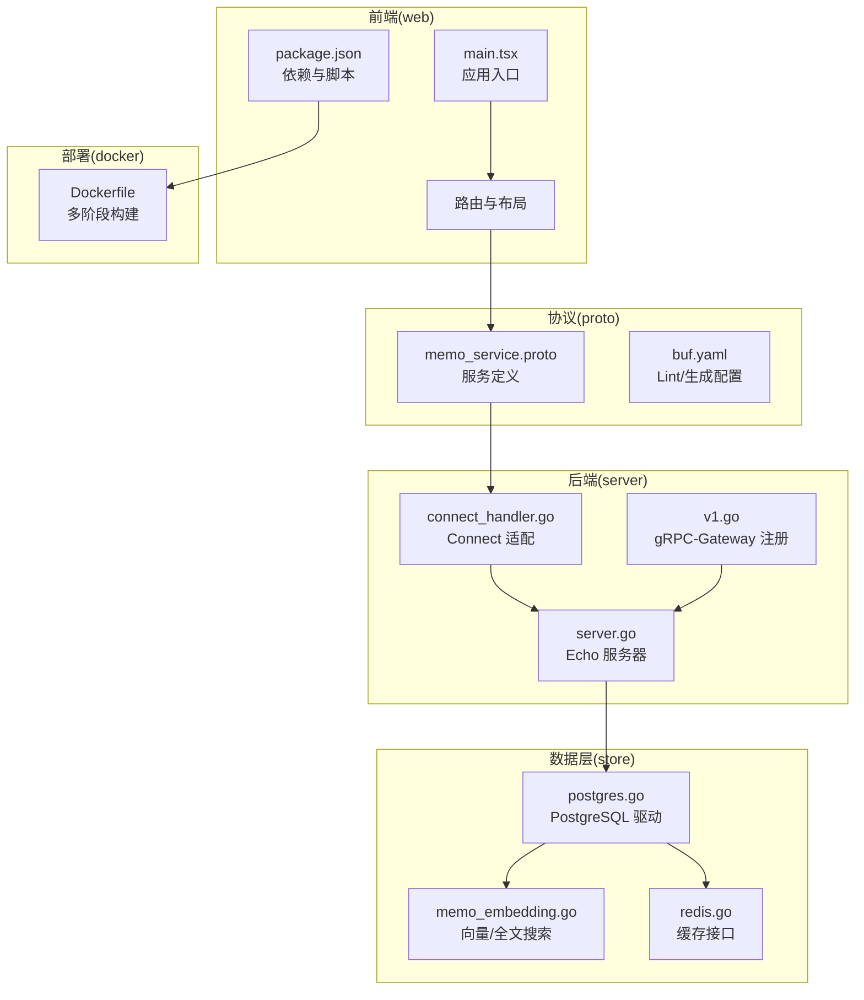
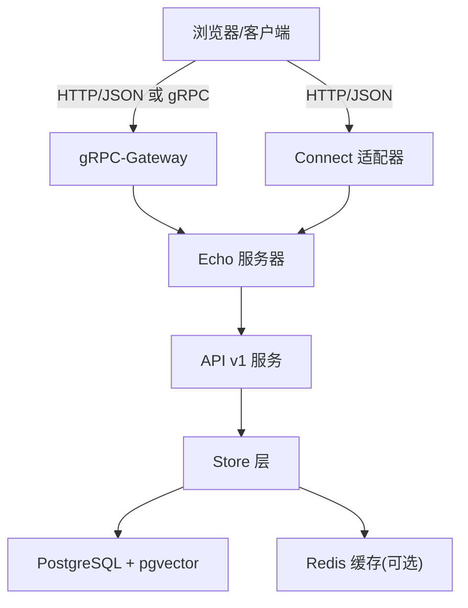
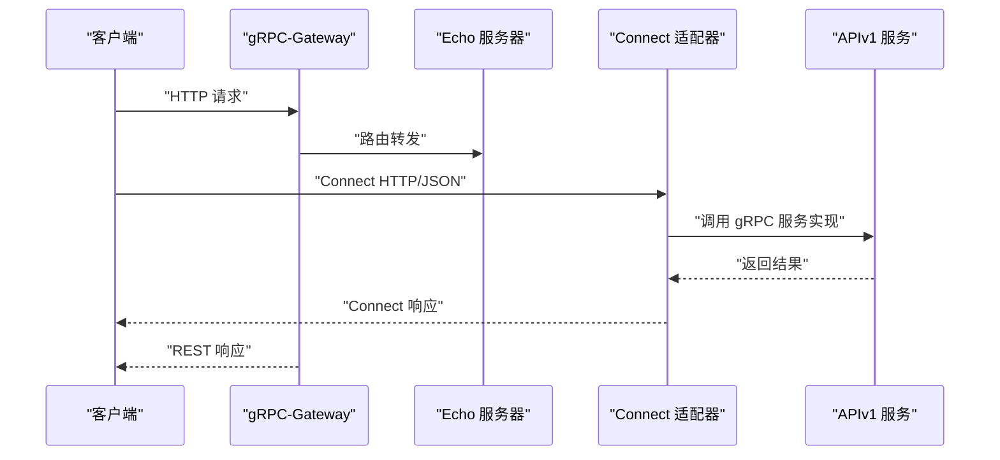
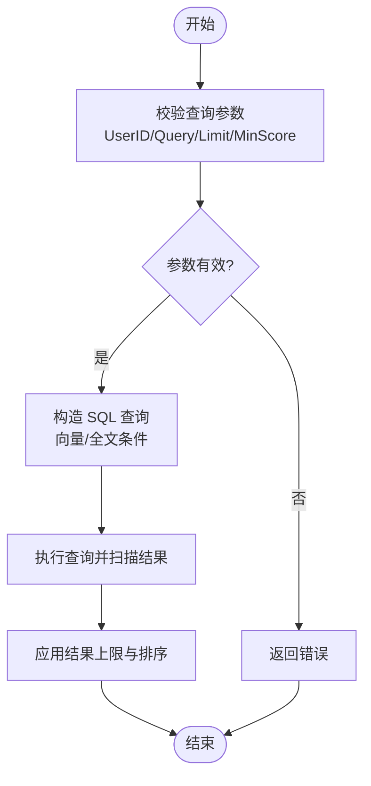
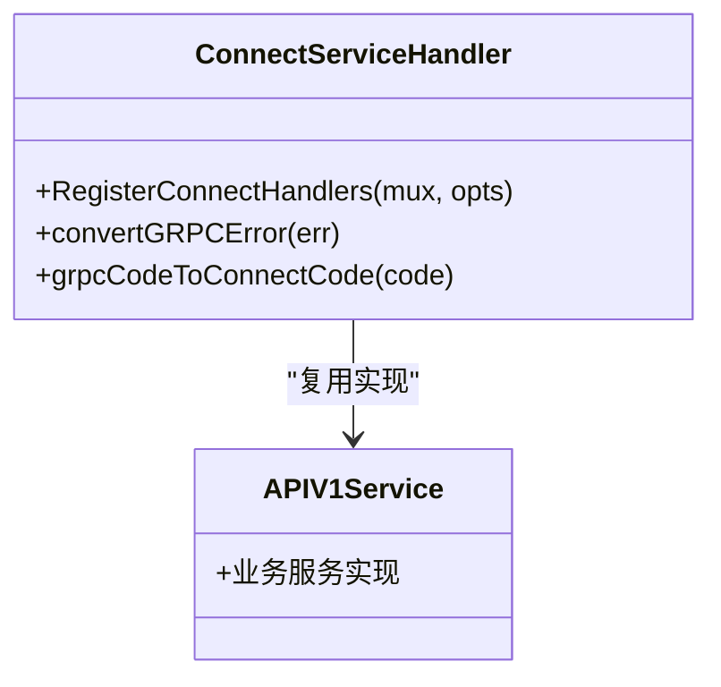
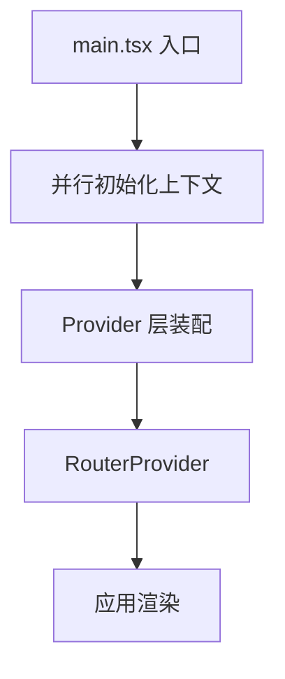
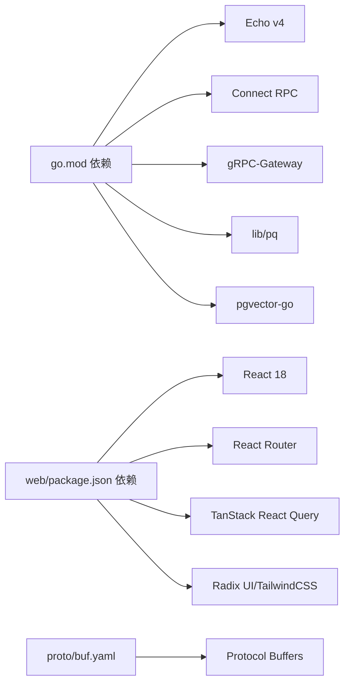

# 技术栈选型

<cite>
**本文档引用的文件**
- [go.mod](file://go.mod)
- [Dockerfile](file://docker/Dockerfile)
- [server.go](file://server/server.go)
- [postgres.go](file://store/db/postgres/postgres.go)
- [redis.go](file://store/cache/redis.go)
- [memo_service.proto](file://proto/api/v1/memo_service.proto)
- [connect_handler.go](file://server/router/api/v1/connect_handler.go)
- [v1.go](file://server/router/api/v1/v1.go)
- [package.json](file://web/package.json)
- [main.tsx](file://web/src/main.tsx)
- [vite.config.mts](file://web/vite.config.mts)
- [memo_embedding.go](file://store/memo_embedding.go)
- [AI-006-postgres-vector-search.md](file://docs/specs/AI-006-postgres-vector-search.md)
- [buf.yaml](file://proto/buf.yaml)
</cite>

## 目录
1. [引言](#引言)
2. [项目结构](#项目结构)
3. [核心组件](#核心组件)
4. [架构总览](#架构总览)
5. [详细组件分析](#详细组件分析)
6. [依赖关系分析](#依赖关系分析)
7. [性能考量](#性能考量)
8. [故障排查指南](#故障排查指南)
9. [结论](#结论)

## 引言
本文件系统性阐述 Memos 项目的整体技术栈选型与架构设计，重点围绕后端 Go + Echo、前端 React 18 + TypeScript、数据库 PostgreSQL + pgvector、RPC 通信 Connect RPC + gRPC-Gateway，以及 Redis 缓存、Docker 容器化等关键技术的决策依据与实践价值。通过对核心源码与规范文档的深入分析，帮助读者快速理解项目的技术取舍、性能特征与可维护性优势。

## 项目结构
Memos 采用前后端分离与模块化组织相结合的结构：
- 后端服务位于 server/ 目录，基于 Echo 框架提供 HTTP/gRPC 接口，并通过 gRPC-Gateway 将 gRPC 映射为 REST。
- 数据访问层位于 store/ 目录，支持 PostgreSQL 与 SQLite，生产环境推荐 PostgreSQL。
- 前端位于 web/ 目录，采用 React 18 + TypeScript，构建工具为 Vite，按需拆分 vendor chunk。
- 协议定义位于 proto/ 目录，使用 Protocol Buffers，生成 Connect/gRPC 客户端和服务端代码。
- 运维与部署位于 docker/ 目录，提供多阶段构建与容器化运行。

**图表来源**
- [server.go](file://server/server.go#L38-L87)
- [connect_handler.go](file://server/router/api/v1/connect_handler.go#L36-L69)
- [v1.go](file://server/router/api/v1/v1.go#L161-L207)
- [postgres.go](file://store/db/postgres/postgres.go#L34-L79)
- [memo_embedding.go](file://store/memo_embedding.go#L140-L155)
- [redis.go](file://store/cache/redis.go#L12-L30)
- [memo_service.proto](file://proto/api/v1/memo_service.proto#L17-L106)
- [buf.yaml](file://proto/buf.yaml#L1-L20)
- [Dockerfile](file://docker/Dockerfile#L1-L58)
- [main.tsx](file://web/src/main.tsx#L57-L81)
- [package.json](file://web/package.json#L1-L101)

**章节来源**
- [server.go](file://server/server.go#L38-L87)
- [postgres.go](file://store/db/postgres/postgres.go#L17-L32)
- [memo_embedding.go](file://store/memo_embedding.go#L140-L155)
- [redis.go](file://store/cache/redis.go#L12-L30)
- [memo_service.proto](file://proto/api/v1/memo_service.proto#L17-L106)
- [buf.yaml](file://proto/buf.yaml#L1-L20)
- [Dockerfile](file://docker/Dockerfile#L1-L58)
- [main.tsx](file://web/src/main.tsx#L57-L81)
- [package.json](file://web/package.json#L1-L101)

## 核心组件
- 后端框架与运行时
  - 使用 Echo v4 作为 HTTP 框架，具备高性能路由、中间件生态与良好的并发模型；结合自定义 gRPC-Gateway，实现 REST 与 gRPC 的统一接入。
  - 服务器启动流程包含健康检查、静态资源服务、文件服务、RSS 订阅与 API v1 注册，确保单一进程承载全部流量。
- 数据库与向量搜索
  - 生产环境使用 PostgreSQL，驱动层提供连接池配置、Ping 校验与初始化检测；支持 pgvector 扩展，实现向量相似度搜索与混合检索。
  - 提供向量嵌入与 BM25 全文搜索的统一接口，便于上层业务组合使用。
- RPC 通信
  - 采用 Connect RPC + gRPC-Gateway 的双栈方案：Connect 提供现代 HTTP/JSON 协议与流式传输，gRPC-Gateway 将 gRPC 映射为 REST，兼顾浏览器与服务间调用。
  - 通过 Connect 适配器复用既有 gRPC 服务实现，降低协议切换成本。
- 前端技术栈
  - React 18 + TypeScript，配合 Vite 构建，启用 React 18 并发特性与严格模式；使用 TailwindCSS、TanStack React Query、i18n、Mermaid、Leaflet 等生态组件。
  - 通过手动分包策略优化首屏与缓存命中率。
- 缓存与容器化
  - 提供 Redis 缓存接口（可选），支持键前缀、TTL、统计信息与无操作实现；Docker 多阶段构建，最小镜像与非 root 用户运行。

**章节来源**
- [server.go](file://server/server.go#L38-L87)
- [postgres.go](file://store/db/postgres/postgres.go#L34-L79)
- [memo_embedding.go](file://store/memo_embedding.go#L140-L155)
- [connect_handler.go](file://server/router/api/v1/connect_handler.go#L36-L69)
- [v1.go](file://server/router/api/v1/v1.go#L161-L207)
- [package.json](file://web/package.json#L12-L101)
- [vite.config.mts](file://web/vite.config.mts#L38-L64)
- [redis.go](file://store/cache/redis.go#L12-L30)
- [Dockerfile](file://docker/Dockerfile#L1-L58)

## 架构总览
下图展示了从浏览器到后端服务、再到数据库与缓存的整体交互路径，体现“REST/gRPC + Connect + gRPC-Gateway”的统一通信模型与“向量 + 全文”的混合检索能力。

**图表来源**
- [server.go](file://server/server.go#L70-L86)
- [v1.go](file://server/router/api/v1/v1.go#L161-L207)
- [connect_handler.go](file://server/router/api/v1/connect_handler.go#L36-L69)
- [postgres.go](file://store/db/postgres/postgres.go#L34-L79)
- [redis.go](file://store/cache/redis.go#L12-L30)

## 详细组件分析

### 后端：Go + Echo + Connect RPC + gRPC-Gateway
- 选择理由
  - Go 的并发模型与编译时优化带来高吞吐与低延迟；Echo 在微服务场景中具备简洁的路由与中间件机制。
  - Connect RPC 提供 HTTP/JSON 协议与流式传输，兼容 Web 与移动端；gRPC-Gateway 将 gRPC 映射为 REST，满足多端接入。
  - 单进程承载 HTTP/文件/RSS/网关的统一架构，简化运维与网络拓扑。
- 关键实现
  - Echo 服务器初始化、健康检查、静态文件与文件服务注册、RSS 路由注册与 gRPC-Gateway 注册。
  - Connect 适配器复用 gRPC 服务实现，转换错误码语义并处理流式响应。
  - gRPC-Gateway 通过中间件注入鉴权与 CORS，统一处理跨域与认证。
- 性能与可维护性
  - 通过连接池与 Ping 校验保障数据库稳定性；后台运行器（嵌入/OCR）按需启动，避免不必要的资源占用。
  - 协议层复用同一套业务逻辑，减少重复实现与维护成本。

**图表来源**
- [server.go](file://server/server.go#L70-L86)
- [v1.go](file://server/router/api/v1/v1.go#L161-L207)
- [connect_handler.go](file://server/router/api/v1/connect_handler.go#L36-L69)

**章节来源**
- [server.go](file://server/server.go#L38-L87)
- [connect_handler.go](file://server/router/api/v1/connect_handler.go#L36-L69)
- [v1.go](file://server/router/api/v1/v1.go#L161-L207)

### 数据库：PostgreSQL + pgvector
- 选择理由
  - PostgreSQL 是生产环境的首选数据库，功能完备、生态成熟、事务一致性强。
  - pgvector 扩展提供原生向量相似度计算，支持与 SQL 查询无缝融合，便于实现“向量 + BM25”的混合检索。
- 关键实现
  - 驱动层提供连接池参数、Ping 校验与初始化检测；向量搜索通过 <=> 操作符实现余弦距离排序。
  - Store 层抽象出向量与 BM25 搜索接口，限制查询长度与结果上限，防止 DoS 与性能退化。
- 扩展性与社区
  - pgvector 社区活跃，文档与示例丰富；结合迁移脚本与约束，保障演进过程中的数据一致性。

**图表来源**
- [memo_embedding.go](file://store/memo_embedding.go#L63-L97)
- [memo_embedding.go](file://store/memo_embedding.go#L140-L155)
- [AI-006-postgres-vector-search.md](file://docs/specs/AI-006-postgres-vector-search.md#L66-L108)

**章节来源**
- [postgres.go](file://store/db/postgres/postgres.go#L17-L32)
- [postgres.go](file://store/db/postgres/postgres.go#L34-L79)
- [memo_embedding.go](file://store/memo_embedding.go#L140-L155)
- [AI-006-postgres-vector-search.md](file://docs/specs/AI-006-postgres-vector-search.md#L1-L124)

### RPC 通信：Connect RPC + gRPC-Gateway
- 选择理由
  - Connect 提供 HTTP/JSON 协议与流式传输，兼容 Web 端与移动端 SDK；gRPC-Gateway 将 gRPC 映射为 REST，满足传统浏览器与第三方集成。
  - 错误码语义统一，适配器自动转换，降低协议差异带来的复杂度。
- 关键实现
  - Connect 适配器注册所有服务处理器，包装流式响应，转换 gRPC 错误码至 Connect 错误码。
  - gRPC-Gateway 注册鉴权中间件与 CORS，统一处理跨域与认证。
- 开发便利性
  - 通过 Protocol Buffers 定义服务契约，自动生成客户端与服务端代码，提升开发效率与类型安全。

**图表来源**
- [connect_handler.go](file://server/router/api/v1/connect_handler.go#L19-L35)
- [connect_handler.go](file://server/router/api/v1/connect_handler.go#L36-L69)

**章节来源**
- [connect_handler.go](file://server/router/api/v1/connect_handler.go#L82-L99)
- [v1.go](file://server/router/api/v1/v1.go#L161-L207)
- [buf.yaml](file://proto/buf.yaml#L1-L20)

### 前端：React 18 + TypeScript
- 选择理由
  - React 18 并发特性（Suspense、自动批处理）显著提升交互流畅度；TypeScript 提供静态类型检查，降低运行时风险。
  - Vite 构建速度快、热更新高效；TailwindCSS 与 Radix UI 提供一致的样式与无障碍组件。
- 关键实现
  - 应用入口并行初始化上下文（鉴权、实例配置），避免闪烁与阻塞；路由与布局解耦，便于按需加载。
  - 通过手动分包策略将常用依赖拆分为独立 chunk，优化缓存与加载性能。
- 开发体验
  - 生态完善：TanStack React Query 管理数据流，i18n 支持多语言，Mermaid/Leaflet 等可视化库增强内容表达。

**图表来源**
- [main.tsx](file://web/src/main.tsx#L29-L55)

**章节来源**
- [main.tsx](file://web/src/main.tsx#L57-L81)
- [package.json](file://web/package.json#L12-L101)
- [vite.config.mts](file://web/vite.config.mts#L38-L64)

### 缓存：Redis（可选）
- 选择理由
  - Redis 适合多实例部署、跨进程共享缓存与持久化重启场景；作为 L2 缓存可显著降低数据库压力。
- 关键实现
  - 提供 RedisCacheInterface 与默认配置，支持键前缀、TTL、统计信息；无操作实现保证单机内存缓存可用。
  - 通过环境变量开关启用，构建时可选标签启用 Redis 实现。
- 场景建议
  - 多实例部署、需要跨进程共享会话或热点数据时启用；单机或开发环境可不启用。

**章节来源**
- [redis.go](file://store/cache/redis.go#L12-L30)
- [redis.go](file://store/cache/redis.go#L56-L82)
- [redis.go](file://store/cache/redis.go#L116-L140)

### 容器化：Docker
- 选择理由
  - 多阶段构建减小镜像体积，Alpine 基础镜像提供安全更新；非 root 用户运行提升安全性。
  - 单二进制与静态资源打包，简化部署与回滚。
- 关键实现
  - 构建阶段下载依赖、编译二进制；运行阶段复制二进制与入口脚本，设置环境变量与卷挂载。

**章节来源**
- [Dockerfile](file://docker/Dockerfile#L1-L58)

## 依赖关系分析
- 后端依赖
  - Echo v4 提供 HTTP 框架；Connect RPC 与 gRPC-Gateway 提供协议适配；pgvector-go 用于向量操作；lib/pq 驱动 PostgreSQL。
- 前端依赖
  - React 18、React Router、TanStack React Query、i18n、TailwindCSS、Radix UI 等生态库。
- 协议依赖
  - buf.yaml 定义 lint 与生成规则，确保 proto 规范与一致性。

**图表来源**
- [go.mod](file://go.mod#L5-L29)
- [package.json](file://web/package.json#L12-L101)
- [buf.yaml](file://proto/buf.yaml#L1-L20)

**章节来源**
- [go.mod](file://go.mod#L5-L29)
- [package.json](file://web/package.json#L12-L101)
- [buf.yaml](file://proto/buf.yaml#L1-L20)

## 性能考量
- 后端
  - Echo 的轻量中间件与连接池配置（PostgreSQL 最大连接数、空闲连接、生命周期）在个人助理场景下平衡资源占用与响应速度。
  - Connect 与 gRPC-Gateway 的统一协议栈减少协议转换开销，适配浏览器与服务间调用。
- 数据库
  - pgvector 原生向量相似度计算与索引能力，结合 BM25 全文检索，支持混合排序与结果融合。
  - 查询参数校验与上限控制，防止过长查询与超大结果集导致的性能问题。
- 前端
  - Vite 快速构建与热更新；手动分包策略提升缓存命中率与首屏性能。
- 缓存
  - Redis 可选启用，适合多实例与跨进程共享场景；默认内存缓存满足单实例需求。

[本节为通用性能讨论，不直接分析具体文件]

## 故障排查指南
- 服务器启动失败
  - 检查 Echo 服务器监听地址与端口配置，确认健康检查端点可达。
  - 查看 gRPC-Gateway 注册日志，确认服务映射是否正确。
- 数据库连接异常
  - 校验 DSN 与连接池参数；确认 PostgreSQL 可用且 pgvector 扩展已安装。
  - 检查初始化检测逻辑，确保表结构存在。
- 向量搜索异常
  - 校验查询参数（UserID/Vector/Limit），确认向量维度与模型一致。
  - 检查向量字段类型与 <=> 操作符使用是否正确。
- 缓存不可用
  - 若启用 Redis，检查地址、密码与键前缀；若未启用，确认默认内存缓存可用。
- 前端请求失败
  - 检查 Vite 开发代理配置与后端 API 前缀；确认 Connect/gRPC-Gateway 路由映射。

**章节来源**
- [server.go](file://server/server.go#L89-L113)
- [postgres.go](file://store/db/postgres/postgres.go#L39-L79)
- [memo_embedding.go](file://store/memo_embedding.go#L43-L61)
- [redis.go](file://store/cache/redis.go#L56-L82)
- [vite.config.mts](file://web/vite.config.mts#L15-L32)

## 结论
Memos 的技术栈选型以“高性能、可维护、易扩展”为核心目标：后端采用 Go + Echo + Connect RPC + gRPC-Gateway，实现统一协议与良好并发；数据库选用 PostgreSQL + pgvector，兼顾关系型数据与向量搜索能力；前端采用 React 18 + TypeScript，提供现代化开发体验与组件化架构；Redis 缓存与 Docker 容器化进一步增强了可扩展性与部署便利性。该选型在个人助理到多用户场景下均具备良好的适应性与演进空间。