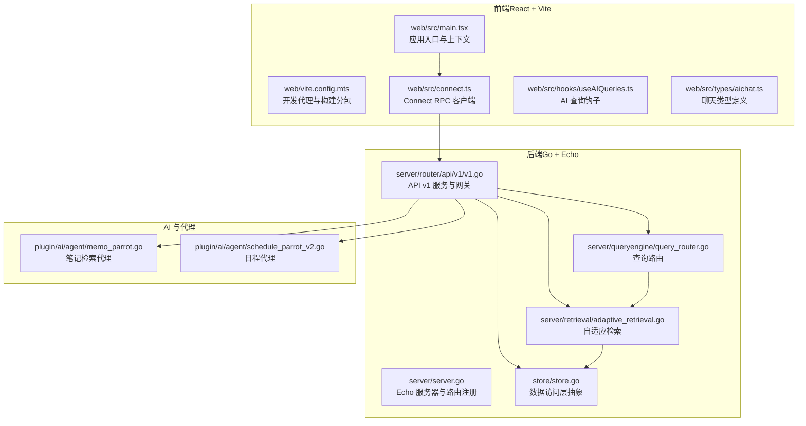
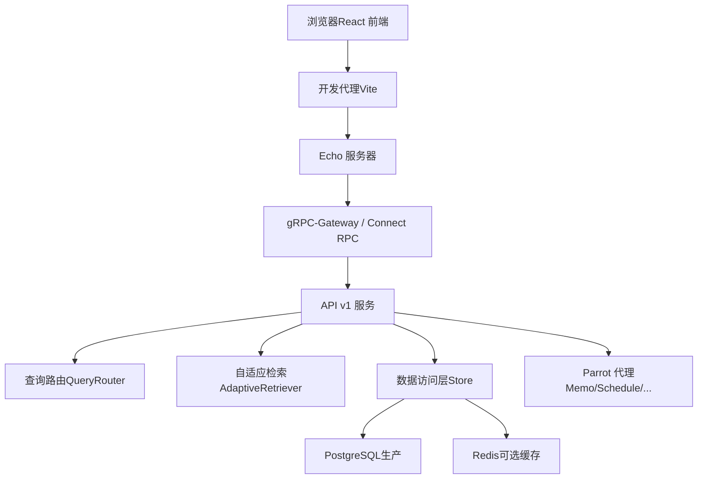
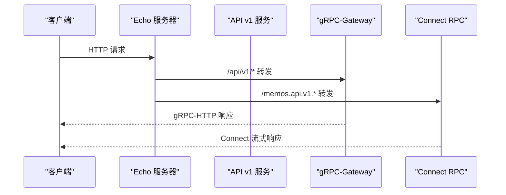
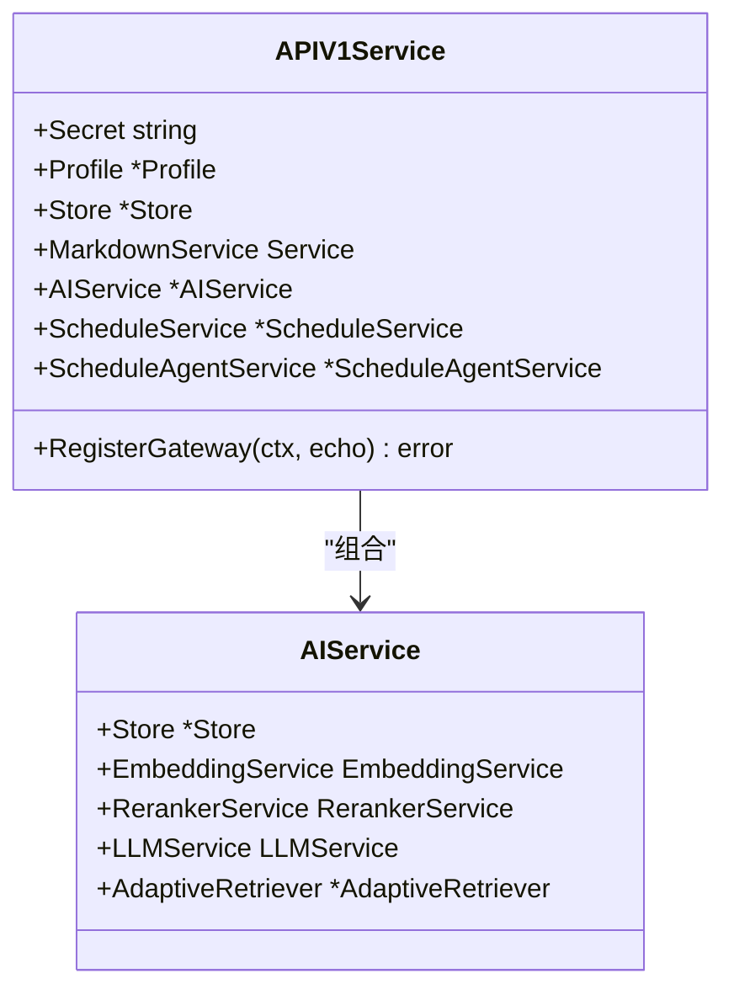
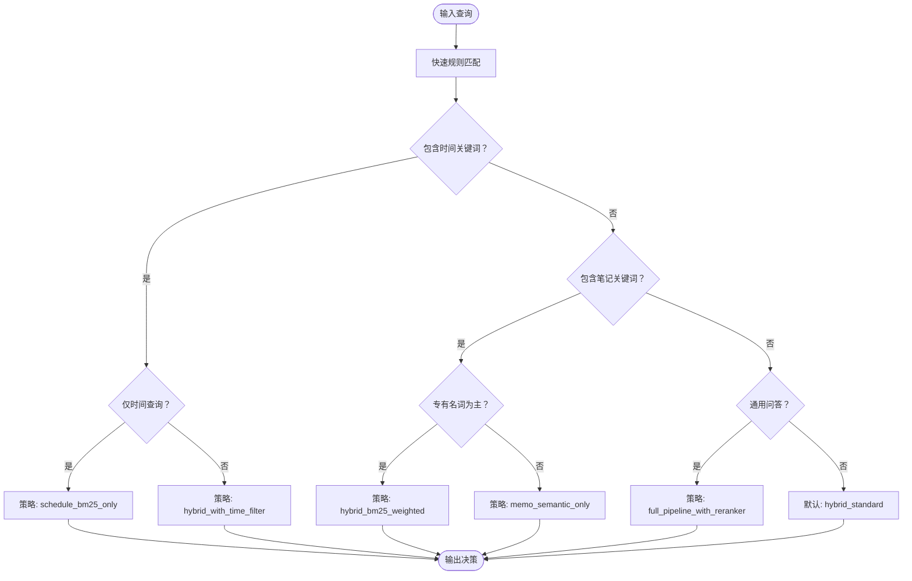
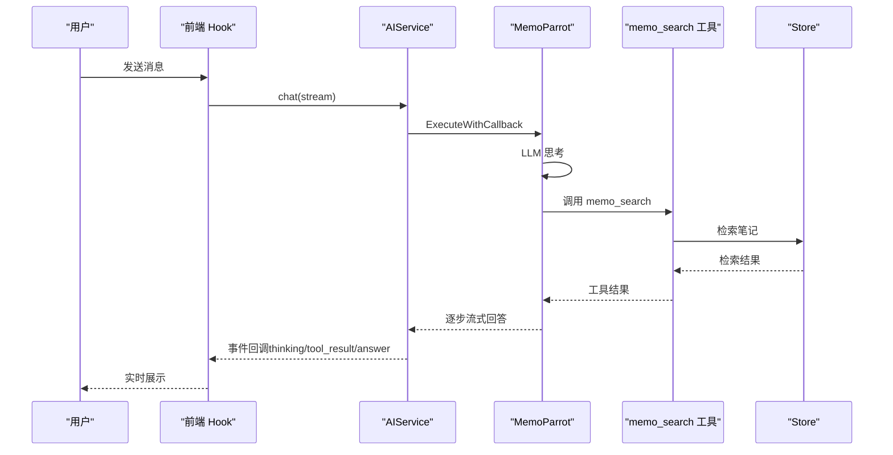
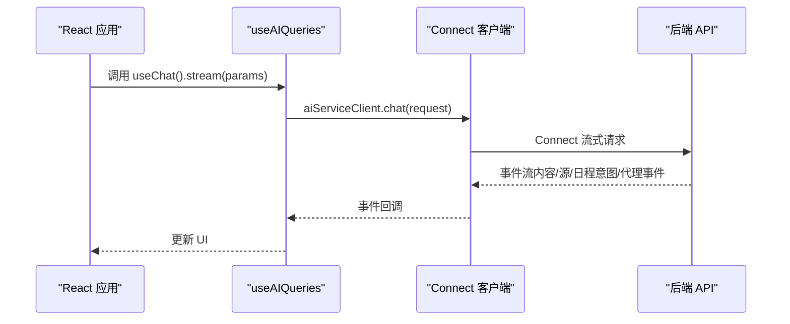
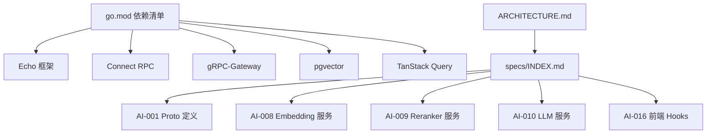

# 整体架构概览

<cite>
**本文档引用的文件**
- [README.md](file://README.md)
- [ARCHITECTURE.md](file://docs/dev-guides/ARCHITECTURE.md)
- [INDEX.md](file://docs/specs/INDEX.md)
- [go.mod](file://go.mod)
- [server.go](file://server/server.go)
- [v1.go](file://server/router/api/v1/v1.go)
- [query_router.go](file://server/queryengine/query_router.go)
- [adaptive_retrieval.go](file://server/retrieval/adaptive_retrieval.go)
- [memo_parrot.go](file://plugin/ai/agent/memo_parrot.go)
- [schedule_parrot_v2.go](file://plugin/ai/agent/schedule_parrot_v2.go)
- [store.go](file://store/store.go)
- [main.tsx](file://web/src/main.tsx)
- [vite.config.mts](file://web/vite.config.mts)
- [connect.ts](file://web/src/connect.ts)
- [useAIQueries.ts](file://web/src/hooks/useAIQueries.ts)
- [aichat.ts](file://web/src/types/aichat.ts)
</cite>

## 目录
1. [简介](#简介)
2. [项目结构](#项目结构)
3. [核心组件](#核心组件)
4. [架构总览](#架构总览)
5. [详细组件分析](#详细组件分析)
6. [依赖关系分析](#依赖关系分析)
7. [性能考虑](#性能考虑)
8. [故障排除指南](#故障排除指南)
9. [结论](#结论)

## 简介
本项目是一个隐私优先、AI 驱动的个人智能助理系统，结合轻量笔记与智能日程管理，并提供多代理 AI 能力。后端采用 Go + Echo + Connect RPC，前端采用 React + Vite，通过 gRPC-HTTP 网关与 Connect RPC 实现浏览器直连；数据层基于 PostgreSQL（生产环境，含 pgvector 向量能力）与 SQLite（开发环境，不含 AI 特性）。系统通过“查询路由 + 自适应检索 + 重排序”的智能检索引擎，配合多代理 AI（MemoParrot、ScheduleParrot 等）实现自然语言的笔记检索、日程管理和智能创作。

## 项目结构
项目采用前后端分离与模块化分层设计：
- 后端（Go）：Echo HTTP 服务器 + Connect RPC 网关 + API v1 层 + 业务逻辑层 + 数据访问层 + AI 服务层
- 前端（React）：Vite 构建 + Connect RPC 客户端 + TanStack Query 状态管理 + 主题与国际化
- AI 与检索：查询路由（QueryRouter）、自适应检索（AdaptiveRetriever）、向量/全文检索、重排序、Parrot 代理



图表来源
- [server.go](file://server/server.go#L1-L203)
- [v1.go](file://server/router/api/v1/v1.go#L1-L238)
- [query_router.go](file://server/queryengine/query_router.go#L1-L800)
- [adaptive_retrieval.go](file://server/retrieval/adaptive_retrieval.go#L1-L762)
- [store.go](file://store/store.go#L1-L87)
- [memo_parrot.go](file://plugin/ai/agent/memo_parrot.go#L1-L459)
- [schedule_parrot_v2.go](file://plugin/ai/agent/schedule_parrot_v2.go#L1-L173)
- [main.tsx](file://web/src/main.tsx#L1-L81)
- [vite.config.mts](file://web/vite.config.mts#L1-L65)
- [connect.ts](file://web/src/connect.ts#L1-L198)
- [useAIQueries.ts](file://web/src/hooks/useAIQueries.ts#L1-L331)
- [aichat.ts](file://web/src/types/aichat.ts#L1-L214)

章节来源
- [README.md](file://README.md#L157-L198)
- [ARCHITECTURE.md](file://docs/dev-guides/ARCHITECTURE.md#L20-L47)

## 核心组件
- Echo HTTP 服务器：负责启动、静态资源服务、gRPC-Gateway 注册、Connect RPC 路由与中间件
- API v1 服务：封装认证、CORS、Connect/网关注册、AI 服务初始化（嵌入、重排序、LLM）
- 查询引擎（QueryRouter）：意图识别与策略路由，支持时间关键词解析、混合检索策略
- 自适应检索（AdaptiveRetriever）：并行执行 BM25 与向量检索，RRF 融合，必要时重排序
- 数据访问层（Store）：统一驱动抽象，提供缓存与数据库操作接口
- Parrot 代理：MemoParrot（笔记检索）、ScheduleParrot（日程管理）等多代理框架
- 前端应用：Vite + React + Connect RPC，通过钩子与类型定义与后端交互

章节来源
- [server.go](file://server/server.go#L29-L86)
- [v1.go](file://server/router/api/v1/v1.go#L23-L118)
- [query_router.go](file://server/queryengine/query_router.go#L18-L106)
- [adaptive_retrieval.go](file://server/retrieval/adaptive_retrieval.go#L24-L66)
- [store.go](file://store/store.go#L11-L58)
- [memo_parrot.go](file://plugin/ai/agent/memo_parrot.go#L26-L66)
- [schedule_parrot_v2.go](file://plugin/ai/agent/schedule_parrot_v2.go#L9-L24)

## 架构总览
系统采用“前后端分离 + 服务端渲染与客户端渲染结合”的设计：
- 前端：Vite 开发服务器 + 代理转发，生产环境静态资源由后端统一托管
- 后端：Echo 提供 HTTP/2 连接，Connect RPC 与 gRPC-Gateway 双栈，支持浏览器直连
- 数据层：PostgreSQL（生产，含 pgvector）与 SQLite（开发），统一 Store 抽象
- AI 层：Embedding/Reranker/LLM 作为可选插件，按配置启用



图表来源
- [vite.config.mts](file://web/vite.config.mts#L15-L32)
- [server.go](file://server/server.go#L67-L86)
- [v1.go](file://server/router/api/v1/v1.go#L120-L237)
- [query_router.go](file://server/queryengine/query_router.go#L449-L552)
- [adaptive_retrieval.go](file://server/retrieval/adaptive_retrieval.go#L68-L115)
- [store.go](file://store/store.go#L11-L58)

## 详细组件分析

### Echo HTTP 服务器与路由
- 负责健康检查、静态资源托管、gRPC-Gateway 注册、Connect RPC 路由
- 启动时注册前端静态资源与 RSS 路由，随后注册 API v1 网关
- 支持 UNIX Socket 与 TCP 监听，优雅关闭与后台 Runner 管理



图表来源
- [server.go](file://server/server.go#L62-L86)
- [v1.go](file://server/router/api/v1/v1.go#L120-L237)

章节来源
- [server.go](file://server/server.go#L89-L139)

### API v1 服务与认证拦截
- 初始化 Markdown 服务、AI 服务（Embedding/Reranker/LLM）、ScheduleService、ScheduleAgentService
- 注册 gRPC-Gateway 与 Connect RPC 处理器，统一鉴权与日志拦截
- 支持公共方法白名单与访问令牌鉴权



图表来源
- [v1.go](file://server/router/api/v1/v1.go#L23-L118)

章节来源
- [v1.go](file://server/router/api/v1/v1.go#L120-L237)

### 查询路由（QueryRouter）
- 基于时间关键词、笔记关键词、疑问词与停用词进行快速规则匹配
- 支持相对时间（今天/明天/本周）、绝对日期（YYYY-MM-DD/1月21日）解析
- 输出路由决策（策略、置信度、时间范围、是否需要重排序）



图表来源
- [query_router.go](file://server/queryengine/query_router.go#L449-L552)
- [query_router.go](file://server/queryengine/query_router.go#L554-L800)

章节来源
- [query_router.go](file://server/queryengine/query_router.go#L18-L106)

### 自适应检索（AdaptiveRetriever）
- 并行执行 BM25 与向量检索，使用 RRF 融合，必要时调用重排序器
- 支持多种检索策略：纯日程、纯语义、加权混合、时间过滤、完整管线
- 内置质量评估与降级策略，支持结果截断与分数过滤

```mermaid
sequenceDiagram
participant Client as "客户端"
participant API as "API v1"
participant Router as "QueryRouter"
participant Retriever as "AdaptiveRetriever"
participant Store as "Store"
participant Embed as "EmbeddingService"
participant Rerank as "RerankerService"
Client->>API : SemanticSearch/Chat
API->>Router : Route(query, timezone)
Router-->>API : RouteDecision(strategy, timeRange, needsRerank)
API->>Retriever : Retrieve(opts)
par pool : EmbeddingService & Store.BM25Search
Embed-->>Retriever : 向量
Store-->>Retriever : BM25 结果
alt 需要重排序
Retriever->>Rerank : Rerank(query, docs)
Rerank-->>Retriever : 重排结果
end
Retriever-->>API : 融合结果
API-->>Client : 检索/对话结果
```

图表来源
- [adaptive_retrieval.go](file://server/retrieval/adaptive_retrieval.go#L68-L115)
- [adaptive_retrieval.go](file://server/retrieval/adaptive_retrieval.go#L409-L491)
- [adaptive_retrieval.go](file://server/retrieval/adaptive_retrieval.go#L330-L407)

章节来源
- [adaptive_retrieval.go](file://server/retrieval/adaptive_retrieval.go#L24-L66)

### Parrot 代理（MemoParrot 与 ScheduleParrot）
- MemoParrot：基于 ReAct 循环，先检索后回答，支持工具调用（memo_search）
- ScheduleParrot：原生工具调用风格，直接处理日程创建/查询/更新/空闲时间查找
- 代理具备超时保护、缓存、事件回调（思考/工具使用/结果/最终答案）



图表来源
- [memo_parrot.go](file://plugin/ai/agent/memo_parrot.go#L74-L289)
- [useAIQueries.ts](file://web/src/hooks/useAIQueries.ts#L86-L325)

章节来源
- [memo_parrot.go](file://plugin/ai/agent/memo_parrot.go#L26-L66)
- [schedule_parrot_v2.go](file://plugin/ai/agent/schedule_parrot_v2.go#L9-L24)

### 前端架构与客户端通信
- 应用入口并行初始化实例与认证上下文，注册 Service Worker 与主题/本地化
- Vite 开发代理将 /api、/memos.api.v1、/file 转发至后端
- Connect RPC 客户端注入超时与鉴权拦截器，提供 AI 查询钩子与聊天流式接口



图表来源
- [main.tsx](file://web/src/main.tsx#L29-L55)
- [vite.config.mts](file://web/vite.config.mts#L15-L32)
- [connect.ts](file://web/src/connect.ts#L170-L198)
- [useAIQueries.ts](file://web/src/hooks/useAIQueries.ts#L86-L325)

章节来源
- [main.tsx](file://web/src/main.tsx#L1-L81)
- [vite.config.mts](file://web/vite.config.mts#L1-L65)
- [connect.ts](file://web/src/connect.ts#L1-L198)
- [useAIQueries.ts](file://web/src/hooks/useAIQueries.ts#L1-L331)
- [aichat.ts](file://web/src/types/aichat.ts#L1-L214)

## 依赖关系分析
- 技术栈与外部依赖：Echo、Connect RPC、gRPC-Gateway、pgvector、TanStack Query、Radix UI、Tailwind CSS、FullCalendar 等
- 数据库支持：PostgreSQL（生产，含 AI 能力）与 SQLite（开发，不含 AI）
- AI 能力按规格文档分阶段演进，从前端 Hook 到后端服务与检索链路逐步完善



图表来源
- [go.mod](file://go.mod#L5-L30)
- [ARCHITECTURE.md](file://docs/dev-guides/ARCHITECTURE.md#L11-L18)
- [INDEX.md](file://docs/specs/INDEX.md#L23-L102)

章节来源
- [go.mod](file://go.mod#L1-L75)
- [ARCHITECTURE.md](file://docs/dev-guides/ARCHITECTURE.md#L1-L138)
- [INDEX.md](file://docs/specs/INDEX.md#L1-L102)

## 性能考虑
- 并行检索：向量与 BM25 检索并行执行，降低延迟
- RRF 融合：平衡语义与关键词检索，提升召回质量
- 缓存与降级：前端消息缓存、后端 L1/L2 缓存、重排序器降级回退
- 并发控制：连接级并发信号量、代理迭代上限、超时保护
- 构建优化：Vite 手动分包、懒加载、服务端渲染占位

## 故障排除指南
- 代理超时：前端 Connect RPC 默认流式请求超时，检查后端 LLM/重排序耗时
- 鉴权失败：Connect 拦截器自动刷新令牌并重试，若仍失败跳转登录
- 检索异常：QueryRouter/AdaptiveRetriever 记录结构化日志，检查时间解析与策略选择
- 数据库不支持：SQLite 不支持 AI 能力，需切换 PostgreSQL

章节来源
- [connect.ts](file://web/src/connect.ts#L76-L85)
- [connect.ts](file://web/src/connect.ts#L127-L164)
- [adaptive_retrieval.go](file://server/retrieval/adaptive_retrieval.go#L330-L407)
- [README.md](file://README.md#L283-L292)

## 结论
该系统通过清晰的分层与模块化设计，实现了前后端分离与 AI 能力的深度集成。后端以 Echo + Connect RPC 为核心，结合智能查询路由与自适应检索，提供稳定高效的检索与对话体验；前端以 React + Vite 为基础，通过 Connect RPC 实现流式交互与状态管理。可扩展性体现在插件化的 AI 服务、可配置的检索策略与多代理框架，便于持续演进与功能扩展。