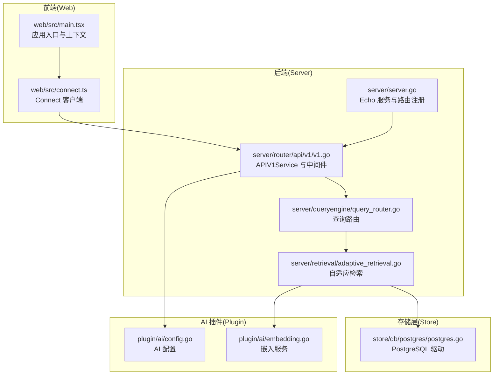
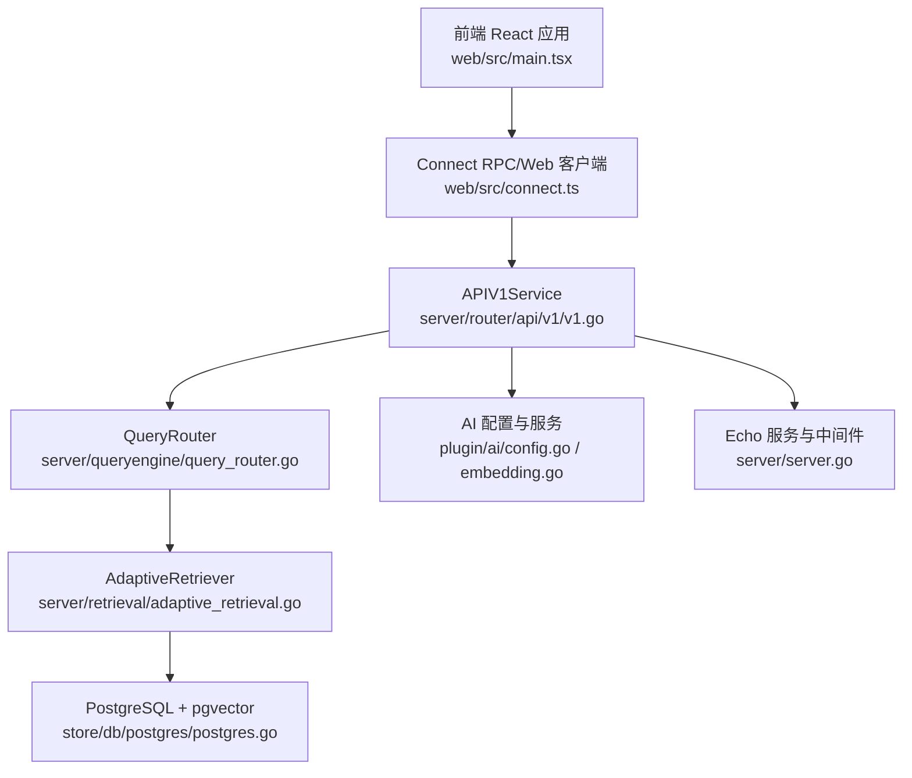
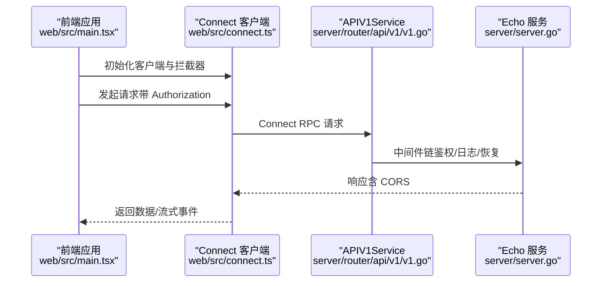
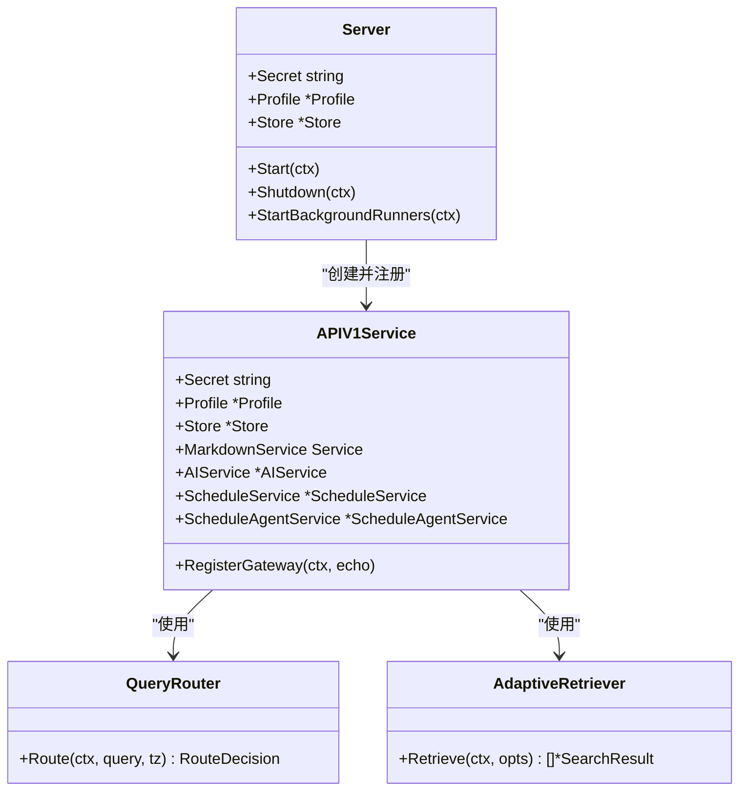
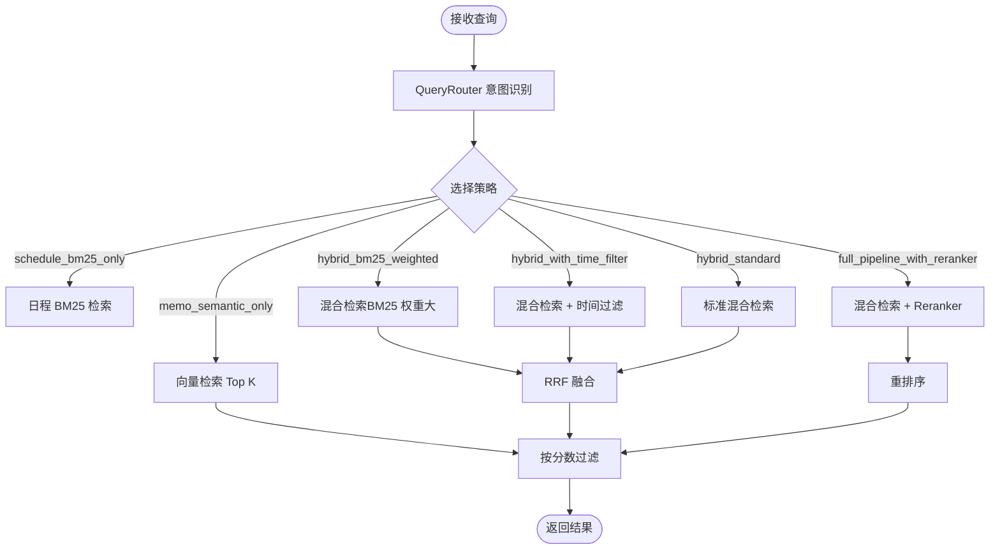
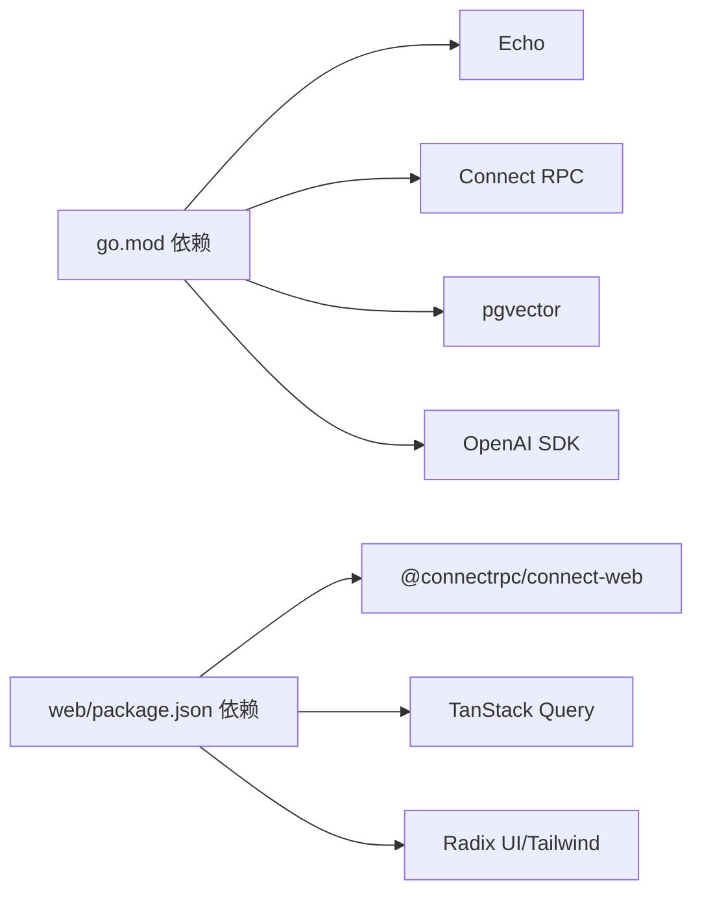

# 架构设计

<cite>
**本文档引用的文件**
- [README.md](file://README.md)
- [go.mod](file://go.mod)
- [Makefile](file://Makefile)
- [server/server.go](file://server/server.go)
- [server/router/api/v1/v1.go](file://server/router/api/v1/v1.go)
- [plugin/ai/config.go](file://plugin/ai/config.go)
- [plugin/ai/embedding.go](file://plugin/ai/embedding.go)
- [store/db/postgres/postgres.go](file://store/db/postgres/postgres.go)
- [web/src/main.tsx](file://web/src/main.tsx)
- [web/src/connect.ts](file://web/src/connect.ts)
- [web/package.json](file://web/package.json)
- [server/queryengine/query_router.go](file://server/queryengine/query_router.go)
- [server/retrieval/adaptive_retrieval.go](file://server/retrieval/adaptive_retrieval.go)
</cite>

## 目录
1. [引言](#引言)
2. [项目结构](#项目结构)
3. [核心组件](#核心组件)
4. [架构总览](#架构总览)
5. [详细组件分析](#详细组件分析)
6. [依赖关系分析](#依赖关系分析)
7. [性能考量](#性能考量)
8. [故障排查指南](#故障排查指南)
9. [结论](#结论)
10. [附录](#附录)

## 引言
本项目是一个“隐私优先、AI增强”的个人智能助理系统，结合轻量记事与智能日程管理，并提供多代理 AI 能力。系统采用前后端分离架构，后端基于 Go 语言与 Echo 框架，通过 Connect RPC 提供统一 API；前端使用 React + Vite，借助 TanStack Query 管理服务端状态；数据层以 PostgreSQL 为主，配合 pgvector 实现向量检索，并集成 Redis 作为可选缓存；AI 层通过可插拔的服务抽象对接多种提供商（SiliconFlow、OpenAI、DeepSeek 等）。

## 项目结构
项目采用模块化分层组织：
- 后端 server：HTTP 服务、API 路由、业务逻辑、AI 服务集成、后台任务运行器
- 存储层 store：数据库驱动（PostgreSQL/SQLite）、迁移、缓存
- 插件层 plugin：AI 能力（嵌入、重排序、LLM）、调度、OCR、邮件等
- 前端 web：React 应用、路由、上下文、Hooks、Protobuf 客户端
- 协议 proto：Connect RPC 与 gRPC-Gateway 的接口定义
- 文档 docs：开发者指南、技术规范、架构说明

**图表来源**
- [server/server.go](file://server/server.go#L1-L203)
- [server/router/api/v1/v1.go](file://server/router/api/v1/v1.go#L1-L238)
- [server/queryengine/query_router.go](file://server/queryengine/query_router.go#L1-L800)
- [server/retrieval/adaptive_retrieval.go](file://server/retrieval/adaptive_retrieval.go#L1-L762)
- [store/db/postgres/postgres.go](file://store/db/postgres/postgres.go#L1-L89)
- [plugin/ai/config.go](file://plugin/ai/config.go#L1-L129)
- [plugin/ai/embedding.go](file://plugin/ai/embedding.go#L1-L103)
- [web/src/main.tsx](file://web/src/main.tsx#L1-L81)
- [web/src/connect.ts](file://web/src/connect.ts#L1-L198)

**章节来源**
- [README.md](file://README.md#L296-L340)
- [Makefile](file://Makefile#L1-L384)

## 核心组件
- 前端 React 应用
  - 应用入口负责初始化认证、实例配置与主题/本地化，使用 TanStack Query 管理服务端状态，通过 Connect Web 客户端访问后端 API。
- 后端 Echo 服务
  - 负责健康检查、静态资源、gRPC-Gateway、Connect RPC 注册、鉴权与拦截器、后台任务启动。
- 存储层
  - PostgreSQL 作为主存储，支持 pgvector 向量检索、全文检索（BM25）、混合检索与重排序；SQLite 仅用于开发。
- AI 服务层
  - 嵌入服务、重排序服务、LLM 服务，支持多提供商配置与校验。
- 检索引擎
  - QueryRouter 基于意图识别选择检索策略；AdaptiveRetriever 实现混合检索（BM25 + 向量）与 RRF 融合、可选重排序。

**章节来源**
- [web/src/main.tsx](file://web/src/main.tsx#L1-L81)
- [web/src/connect.ts](file://web/src/connect.ts#L1-L198)
- [server/server.go](file://server/server.go#L1-L203)
- [server/router/api/v1/v1.go](file://server/router/api/v1/v1.go#L1-L238)
- [plugin/ai/config.go](file://plugin/ai/config.go#L1-L129)
- [plugin/ai/embedding.go](file://plugin/ai/embedding.go#L1-L103)
- [store/db/postgres/postgres.go](file://store/db/postgres/postgres.go#L1-L89)
- [server/queryengine/query_router.go](file://server/queryengine/query_router.go#L1-L800)
- [server/retrieval/adaptive_retrieval.go](file://server/retrieval/adaptive_retrieval.go#L1-L762)

## 架构总览
系统采用前后端分离与分层架构：
- 前端通过 Connect RPC（HTTP/2）与后端通信，支持浏览器直连与流式响应。
- 后端使用 Echo 作为 HTTP 框架，注册 gRPC-Gateway 与 Connect 服务，统一暴露 REST/JSON 与 gRPC 接口。
- 数据层以 PostgreSQL 为核心，pgvector 提供向量相似度检索，BM25 提供关键词检索，二者通过 RRF 融合提升召回质量。
- AI 层通过可插拔配置对接不同提供商，支持嵌入、重排序与 LLM，具备可扩展的 Agent 能力。

**图表来源**
- [web/src/main.tsx](file://web/src/main.tsx#L1-L81)
- [web/src/connect.ts](file://web/src/connect.ts#L1-L198)
- [server/router/api/v1/v1.go](file://server/router/api/v1/v1.go#L1-L238)
- [server/queryengine/query_router.go](file://server/queryengine/query_router.go#L1-L800)
- [server/retrieval/adaptive_retrieval.go](file://server/retrieval/adaptive_retrieval.go#L1-L762)
- [store/db/postgres/postgres.go](file://store/db/postgres/postgres.go#L1-L89)
- [plugin/ai/config.go](file://plugin/ai/config.go#L1-L129)
- [plugin/ai/embedding.go](file://plugin/ai/embedding.go#L1-L103)
- [server/server.go](file://server/server.go#L1-L203)

## 详细组件分析

### 前端组件分析
- 应用入口与上下文
  - 初始化认证、实例配置、主题与本地化，确保首屏无闪烁；并行初始化多个上下文以提升启动性能。
- Connect 客户端
  - 使用 @connectrpc/connect-web 创建传输层，内置超时拦截器与鉴权拦截器；支持刷新令牌与重试机制；针对流式请求设置较长超时。
- 依赖与构建
  - 前端依赖 @connectrpc/connect、@connectrpc/connect-web、TanStack Query、Radix UI、Tailwind CSS 等，构建产物发布到后端前端资源目录。

**图表来源**
- [web/src/main.tsx](file://web/src/main.tsx#L1-L81)
- [web/src/connect.ts](file://web/src/connect.ts#L1-L198)
- [server/router/api/v1/v1.go](file://server/router/api/v1/v1.go#L120-L237)
- [server/server.go](file://server/server.go#L67-L86)

**章节来源**
- [web/src/main.tsx](file://web/src/main.tsx#L1-L81)
- [web/src/connect.ts](file://web/src/connect.ts#L1-L198)
- [web/package.json](file://web/package.json#L1-L101)

### 后端组件分析
- Echo 服务与路由
  - 创建 Echo 实例，注册健康检查、静态资源、gRPC-Gateway、Connect RPC；支持 UNIX Socket 与 TCP 监听；优雅关闭与后台任务管理。
- APIV1Service
  - 负责注册各服务（实例、认证、用户、备忘、附件、快捷方式、活动、身份提供商、AI、日程、日程代理），并注入 Markdown、AI 服务、调度服务与调度代理服务。
  - 集成鉴权中间件与 Connect 拦截器，处理公共方法白名单与访问令牌。
- AI 配置与服务
  - 从 Profile 读取 AI 配置，校验提供商与密钥；初始化嵌入、重排序与 LLM 服务；在 PostgreSQL 驱动可用时启动嵌入 Runner。

**图表来源**
- [server/server.go](file://server/server.go#L29-L86)
- [server/router/api/v1/v1.go](file://server/router/api/v1/v1.go#L23-L118)
- [server/queryengine/query_router.go](file://server/queryengine/query_router.go#L18-L60)
- [server/retrieval/adaptive_retrieval.go](file://server/retrieval/adaptive_retrieval.go#L24-L66)

**章节来源**
- [server/server.go](file://server/server.go#L1-L203)
- [server/router/api/v1/v1.go](file://server/router/api/v1/v1.go#L1-L238)

### 检索与 AI 组件分析
- QueryRouter
  - 基于时间关键词、笔记关键词、疑问词与停用词进行意图识别，输出路由决策（策略、置信度、时间范围、是否需要重排序、日程查询模式）。
- AdaptiveRetriever
  - 支持多种检索策略：纯日程 BM25、纯语义向量、加权 BM25、时间过滤混合、标准混合、完整管线（含重排序）。采用 RRF 融合向量与 BM25 结果，并根据质量与查询复杂度动态决定是否重排序。
- AI 配置与嵌入服务
  - 支持 SiliconFlow、OpenAI 等提供商，统一 OpenAI 兼容 API；提供单文本与批量嵌入能力；维度可配置。

**图表来源**
- [server/queryengine/query_router.go](file://server/queryengine/query_router.go#L449-L552)
- [server/retrieval/adaptive_retrieval.go](file://server/retrieval/adaptive_retrieval.go#L68-L115)
- [plugin/ai/embedding.go](file://plugin/ai/embedding.go#L11-L21)

**章节来源**
- [server/queryengine/query_router.go](file://server/queryengine/query_router.go#L1-L800)
- [server/retrieval/adaptive_retrieval.go](file://server/retrieval/adaptive_retrieval.go#L1-L762)
- [plugin/ai/config.go](file://plugin/ai/config.go#L1-L129)
- [plugin/ai/embedding.go](file://plugin/ai/embedding.go#L1-L103)

## 依赖关系分析
- 技术栈与外部依赖
  - 后端：Echo、Connect RPC、gRPC-Gateway、pgvector、SQLite、UUID、OAuth2、CEL、OpenAI SDK 等。
  - 前端：@connectrpc/connect、@connectrpc/connect-web、TanStack Query、Radix UI、Tailwind CSS、Mermaid、FullCalendar 等。
- 模块耦合
  - 后端 APIV1Service 与存储层、AI 插件松耦合，通过接口抽象与配置注入；检索引擎独立于业务服务，便于演进与测试。
- 外部集成
  - AI 服务通过配置抽象对接多家提供商；数据库层区分开发（SQLite）与生产（PostgreSQL + pgvector）。

**图表来源**
- [go.mod](file://go.mod#L1-L75)
- [web/package.json](file://web/package.json#L1-L101)

**章节来源**
- [go.mod](file://go.mod#L1-L75)
- [web/package.json](file://web/package.json#L1-L101)

## 性能考量
- 连接与并发
  - PostgreSQL 连接池针对个人助理场景优化（最大连接数、空闲连接、生命周期），降低资源占用。
  - Echo 使用中间件与拦截器，限制并发缩略图生成，避免内存压力。
- 检索性能
  - QueryRouter 快速规则匹配（<10ms）覆盖 95% 场景；AdaptiveRetriever 并行执行 BM25 与向量检索，采用 RRF 融合；根据结果质量与查询复杂度动态启用重排序。
- 前端性能
  - 并行初始化认证与实例配置；Connect 客户端设置合理超时与重试；TanStack Query 缓存与增量同步减少网络请求。
- 可扩展性
  - 插件化 AI 服务与检索策略可替换；数据库层支持扩展索引与查询优化；前端通过 Hooks 与 Context 管理状态，易于拆分与复用。

**章节来源**
- [store/db/postgres/postgres.go](file://store/db/postgres/postgres.go#L51-L57)
- [server/router/api/v1/v1.go](file://server/router/api/v1/v1.go#L44-L58)
- [server/retrieval/adaptive_retrieval.go](file://server/retrieval/adaptive_retrieval.go#L410-L491)
- [web/src/connect.ts](file://web/src/connect.ts#L91-L122)

## 故障排查指南
- 启动与监听
  - 若监听失败，检查地址与端口或 UNIX Socket 权限；确认 Echo 服务监听成功后再启动后台任务。
- 鉴权与拦截器
  - Connect 与 gRPC-Gateway 共用鉴权与日志拦截器；若出现 401，检查 Authorization 头与令牌刷新流程。
- 数据库连接
  - PostgreSQL Ping 失败时检查 DSN、网络与扩展（pgvector）；开发环境可通过 Makefile 启动容器并验证扩展。
- AI 配置
  - AI 配置校验失败时检查提供商、模型与密钥；确保 PostgreSQL 驱动可用时再启动嵌入 Runner。
- 前端请求
  - 超时与流式请求异常时，检查 Connect 客户端超时设置与拦截器；必要时增大超时阈值。

**章节来源**
- [server/server.go](file://server/server.go#L89-L139)
- [server/router/api/v1/v1.go](file://server/router/api/v1/v1.go#L120-L237)
- [store/db/postgres/postgres.go](file://store/db/postgres/postgres.go#L58-L62)
- [plugin/ai/config.go](file://plugin/ai/config.go#L105-L128)
- [web/src/connect.ts](file://web/src/connect.ts#L66-L85)

## 结论
本项目通过前后端分离与分层架构，结合 Echo + Connect RPC、PostgreSQL + pgvector、React + TanStack Query 的技术组合，实现了隐私优先、可扩展、高性能的个人智能助理系统。AI 能力通过插件化配置与抽象接口实现灵活接入，检索引擎采用多策略融合与动态决策，兼顾准确性与效率。建议在生产环境中优先使用 PostgreSQL 与 pgvector，并结合 Redis 缓存与合理的连接池参数，持续优化检索与前端交互体验。

## 附录
- 开发与部署
  - 使用 Makefile 一键启动开发环境（PostgreSQL + 后端 + 前端），支持日志跟踪与数据库重置。
- 项目结构概览
  - 参考 README 的目录结构与模块划分，便于定位代码与扩展功能。

**章节来源**
- [README.md](file://README.md#L296-L340)
- [Makefile](file://Makefile#L59-L91)