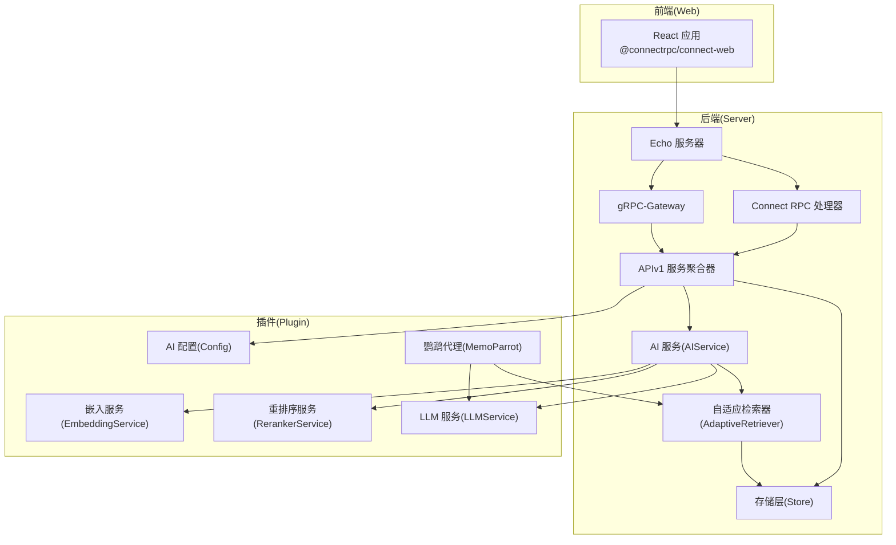
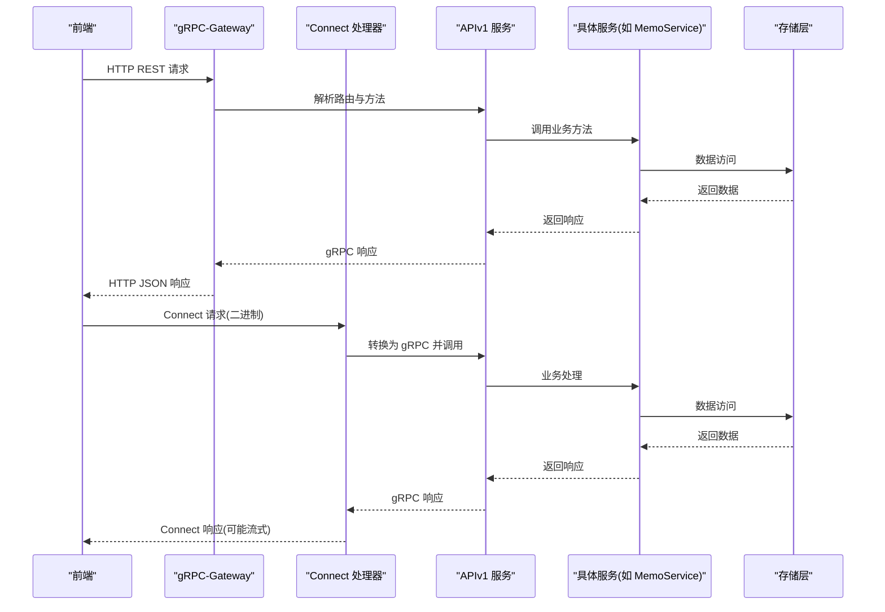
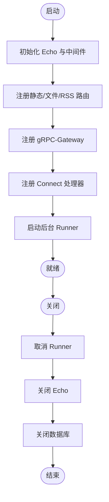
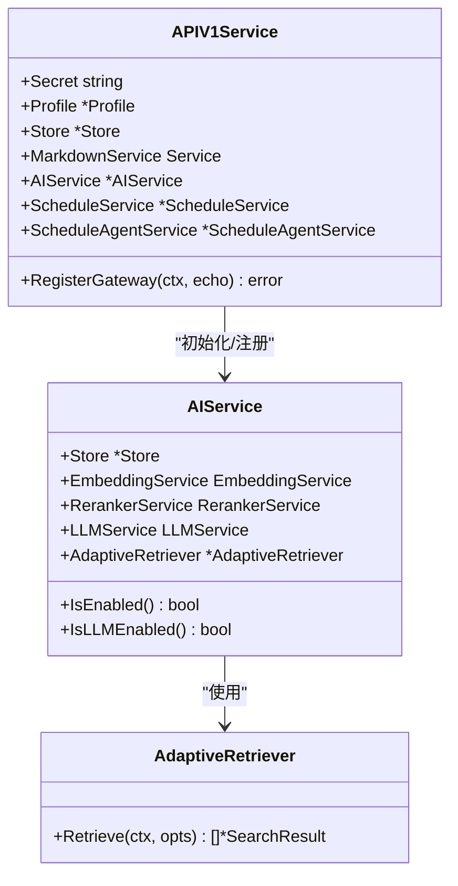
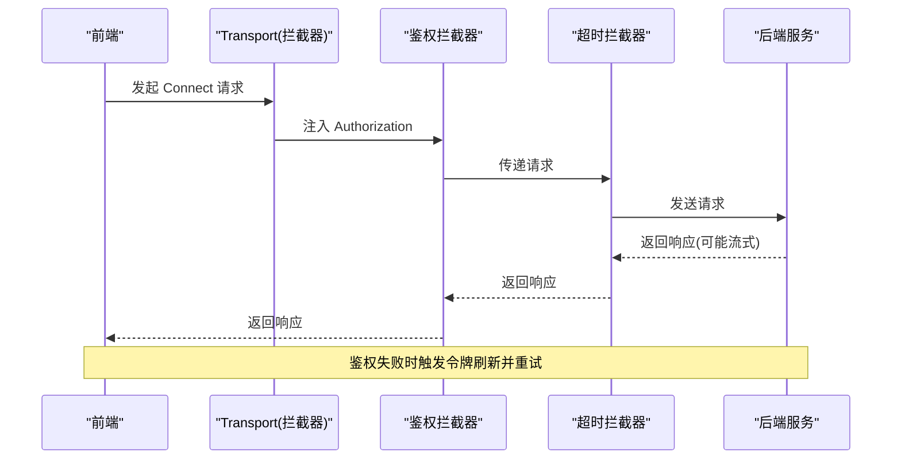
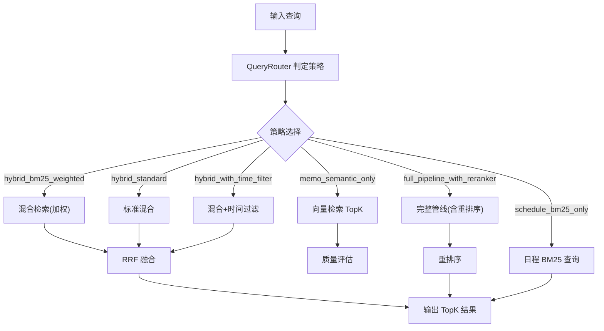
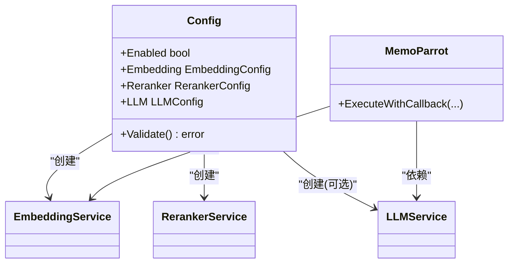
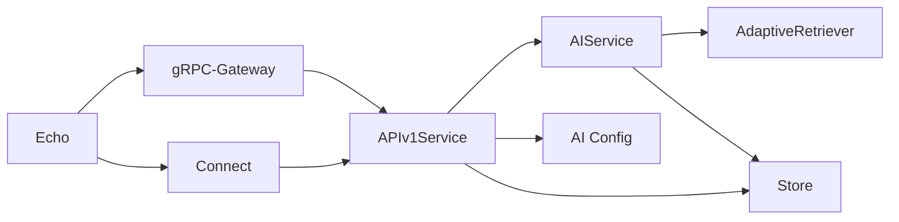

# 组件交互模式

<cite>
**本文档引用的文件**
- [README.md](file://README.md)
- [go.mod](file://go.mod)
- [server/server.go](file://server/server.go)
- [proto/api/v1/memo_service.proto](file://proto/api/v1/memo_service.proto)
- [proto/api/v1/user_service.proto](file://proto/api/v1/user_service.proto)
- [server/router/api/v1/v1.go](file://server/router/api/v1/v1.go)
- [server/router/api/v1/connect_services.go](file://server/router/api/v1/connect_services.go)
- [plugin/ai/config.go](file://plugin/ai/config.go)
- [store/store.go](file://store/store.go)
- [web/src/connect.ts](file://web/src/connect.ts)
- [plugin/ai/agent/memo_parrot.go](file://plugin/ai/agent/memo_parrot.go)
- [server/runner/embedding/runner.go](file://server/runner/embedding/runner.go)
- [server/retrieval/adaptive_retrieval.go](file://server/retrieval/adaptive_retrieval.go)
- [server/router/api/v1/ai_service.go](file://server/router/api/v1/ai_service.go)
- [web/src/hooks/useParrots.ts](file://web/src/hooks/useParrots.ts)
</cite>

## 目录
1. [简介](#简介)
2. [项目结构](#项目结构)
3. [核心组件](#核心组件)
4. [架构总览](#架构总览)
5. [详细组件分析](#详细组件分析)
6. [依赖关系分析](#依赖关系分析)
7. [性能考量](#性能考量)
8. [故障排查指南](#故障排查指南)
9. [结论](#结论)
10. [附录](#附录)

## 简介
本文件聚焦 Memos 项目的“组件交互模式”，系统性阐述前端与后端通过 Connect RPC/HTTP 的交互协议、gRPC-Gateway 的映射机制、AI 服务的检索与推理链路、以及后台任务与插件系统的扩展机制。文档同时给出关键时序图与数据流图，帮助开发者快速理解复杂交互。

## 项目结构
- 后端采用 Echo + Connect RPC + gRPC-Gateway 架构，统一暴露 REST 风格的 HTTP 接口与二进制 Connect 协议。
- 前端使用 @connectrpc/connect-web，通过拦截器实现鉴权、超时与自动刷新。
- AI 能力通过插件模块注入，包含嵌入、重排序与 LLM；检索层采用自适应融合策略。
- 存储层抽象出 Driver 与缓存层，支持 PostgreSQL/SQLite，并提供后台任务 Runner。

图表来源
- [server/server.go](file://server/server.go#L89-L113)
- [server/router/api/v1/v1.go](file://server/router/api/v1/v1.go#L120-L237)
- [server/router/api/v1/connect_services.go](file://server/router/api/v1/connect_services.go#L1-L491)
- [plugin/ai/config.go](file://plugin/ai/config.go#L46-L103)
- [server/retrieval/adaptive_retrieval.go](file://server/retrieval/adaptive_retrieval.go#L55-L66)
- [server/router/api/v1/ai_service.go](file://server/router/api/v1/ai_service.go#L21-L43)

章节来源
- [README.md](file://README.md#L157-L198)
- [go.mod](file://go.mod#L1-L75)

## 核心组件
- 服务器与生命周期
  - 服务器负责 Echo 初始化、健康检查、静态资源、gRPC-Gateway 注册、Connect 处理器注册、后台 Runner 启动与关闭。
- APIv1 服务聚合器
  - 负责根据配置初始化 AI 服务、检索器与调度服务；注册 gRPC-Gateway 与 Connect 处理器。
- 存储层
  - 抽象 Driver，内置多级缓存，提供 AI 对话、消息、附件等 CRUD 接口。
- 插件 AI
  - 提供 AI 配置、嵌入、重排序与 LLM 服务工厂方法；鹦鹉代理基于检索器与 LLM 执行 ReAct 循环。
- 前端 Connect 客户端
  - 通过拦截器注入 Authorization、令牌刷新、超时控制与流式请求支持。

章节来源
- [server/server.go](file://server/server.go#L29-L86)
- [server/router/api/v1/v1.go](file://server/router/api/v1/v1.go#L23-L118)
- [store/store.go](file://store/store.go#L12-L58)
- [plugin/ai/config.go](file://plugin/ai/config.go#L9-L103)
- [web/src/connect.ts](file://web/src/connect.ts#L1-L198)

## 架构总览
- 通信协议
  - HTTP/REST：由 gRPC-Gateway 将 gRPC 映射为 HTTP。
  - Connect RPC：浏览器直连，二进制格式，支持流式响应。
- 认证与授权
  - 基于 Access Token/JWT 的鉴权，Connect 与 Gateway 共享认证器。
- 异步与后台任务
  - 向量化 Runner 定时批量处理未嵌入的 Memo；OCR Runner 可选开启。
- 插件与扩展
  - 通过 Profile 驱动 AI 配置，按需启用嵌入、重排序与 LLM；鹦鹉代理作为插件式工具集成。

图表来源
- [server/router/api/v1/v1.go](file://server/router/api/v1/v1.go#L120-L237)
- [server/router/api/v1/connect_services.go](file://server/router/api/v1/connect_services.go#L1-L491)
- [proto/api/v1/memo_service.proto](file://proto/api/v1/memo_service.proto#L17-L106)
- [proto/api/v1/user_service.proto](file://proto/api/v1/user_service.proto#L16-L159)

## 详细组件分析

### 服务器启动与生命周期
- 启动流程
  - 初始化 Echo、注册健康检查、静态资源、文件服务、RSS、gRPC-Gateway、Connect 处理器。
  - 根据 Profile 条件启动 Embedding Runner 与 OCR Runner。
- 关闭流程
  - 取消所有 Runner、优雅关闭 Echo、关闭数据库连接。

图表来源
- [server/server.go](file://server/server.go#L89-L179)

章节来源
- [server/server.go](file://server/server.go#L89-L179)

### APIv1 服务聚合与认证
- 聚合器职责
  - 初始化 Markdown 服务、可选 AI 服务、检索器与调度服务；根据配置决定是否启用 LLM。
- 认证与授权
  - gRPC-Gateway 与 Connect 共用鉴权器；公共方法白名单由 IsPublicMethod 控制。
- Connect 处理器
  - 将 Connect 请求转换为 gRPC 调用，统一错误转换与响应封装。

图表来源
- [server/router/api/v1/v1.go](file://server/router/api/v1/v1.go#L23-L118)
- [server/router/api/v1/ai_service.go](file://server/router/api/v1/ai_service.go#L21-L74)
- [server/retrieval/adaptive_retrieval.go](file://server/retrieval/adaptive_retrieval.go#L68-L115)

章节来源
- [server/router/api/v1/v1.go](file://server/router/api/v1/v1.go#L120-L237)
- [server/router/api/v1/connect_services.go](file://server/router/api/v1/connect_services.go#L1-L491)

### 前端 Connect 客户端与拦截器
- 传输与拦截器
  - 二进制 Connect 传输，超时拦截器与鉴权拦截器组合；刷新令牌客户端独立，避免递归。
- 流式请求
  - 默认流式请求超时 5 分钟，适配 LLM 处理时延。
- 服务客户端
  - 统一导出实例，覆盖核心与 AI/调度服务。

图表来源
- [web/src/connect.ts](file://web/src/connect.ts#L117-L164)

章节来源
- [web/src/connect.ts](file://web/src/connect.ts#L1-L198)

### AI 检索与推理链路
- 自适应检索器
  - 根据查询意图与结果质量动态选择策略：纯 BM25、纯向量、混合加权、带时间过滤、完整管线（含重排序）。
  - 并行执行向量与 BM25 检索，使用 RRF 融合；支持质量评估与降级策略。
- 鹦鹉代理
  - 基于 MemoParrot 的 ReAct 循环：先检索、后回答；支持工具调用（memo_search）、缓存与流式回答。
- 向量化 Runner
  - 定时批量为未嵌入的 Memo 生成向量并写回数据库，降低峰值内存与 CPU 压力。

图表来源
- [server/retrieval/adaptive_retrieval.go](file://server/retrieval/adaptive_retrieval.go#L68-L115)
- [plugin/ai/agent/memo_parrot.go](file://plugin/ai/agent/memo_parrot.go#L74-L289)
- [server/runner/embedding/runner.go](file://server/runner/embedding/runner.go#L34-L95)

章节来源
- [server/retrieval/adaptive_retrieval.go](file://server/retrieval/adaptive_retrieval.go#L1-L762)
- [plugin/ai/agent/memo_parrot.go](file://plugin/ai/agent/memo_parrot.go#L1-L459)
- [server/runner/embedding/runner.go](file://server/runner/embedding/runner.go#L1-L139)

### 插件系统与扩展机制
- AI 配置
  - 从 Profile 读取嵌入、重排序与 LLM 的提供商、模型与密钥；支持 siliconflow/openai/ollama/deepseek 等。
- 动态加载与启用
  - APIv1 服务根据配置创建嵌入与重排序服务，若 LLM 可用则初始化检索器与调度服务；鹦鹉代理依赖检索器与 LLM。
- 本地化与 UI 扩展
  - 前端通过 hooks 获取本地化鹦鹉代理信息，便于 UI 展示与切换。

图表来源
- [plugin/ai/config.go](file://plugin/ai/config.go#L9-L129)
- [plugin/ai/agent/memo_parrot.go](file://plugin/ai/agent/memo_parrot.go#L26-L66)

章节来源
- [plugin/ai/config.go](file://plugin/ai/config.go#L46-L129)
- [web/src/hooks/useParrots.ts](file://web/src/hooks/useParrots.ts#L1-L65)

### 数据模型与 API 映射
- 服务定义
  - MemoService、UserService 等通过 proto 文件定义，gRPC-Gateway 映射为 HTTP REST。
- Connect 映射
  - ConnectServiceHandler 将 Connect 请求转换为 gRPC 调用，统一错误处理。

章节来源
- [proto/api/v1/memo_service.proto](file://proto/api/v1/memo_service.proto#L17-L106)
- [proto/api/v1/user_service.proto](file://proto/api/v1/user_service.proto#L16-L159)
- [server/router/api/v1/connect_services.go](file://server/router/api/v1/connect_services.go#L1-L491)

## 依赖关系分析
- 外部依赖
  - Echo、Connect、gRPC-Gateway、pgvector、sqlite 等。
- 内部耦合
  - APIv1 服务聚合器对存储层、AI 服务与检索器存在强依赖；Connect/Gateway 共享认证器。
- 循环依赖
  - 未见直接循环依赖；服务间通过接口与工厂方法解耦。

图表来源
- [go.mod](file://go.mod#L5-L30)
- [server/router/api/v1/v1.go](file://server/router/api/v1/v1.go#L120-L237)

章节来源
- [go.mod](file://go.mod#L1-L75)
- [server/router/api/v1/v1.go](file://server/router/api/v1/v1.go#L1-L238)

## 性能考量
- 并发与限流
  - Connect 层设置并发缩放；AI 全局速率限制器保护下游服务。
- 批处理与定时任务
  - 向量化 Runner 采用小批次与较长间隔，降低内存峰值与 CPU 竞争。
- 缓存与降级
  - 检索器支持缓存与质量评估；重排序失败时降级为混合结果。
- 前端超时与流式
  - 流式请求默认 5 分钟超时，适配长尾 LLM 处理。

章节来源
- [server/router/api/v1/v1.go](file://server/router/api/v1/v1.go#L44-L57)
- [server/runner/embedding/runner.go](file://server/runner/embedding/runner.go#L21-L32)
- [server/retrieval/adaptive_retrieval.go](file://server/retrieval/adaptive_retrieval.go#L330-L407)
- [web/src/connect.ts](file://web/src/connect.ts#L24-L26)

## 故障排查指南
- 认证失败
  - Connect/Gateway 鉴权失败会触发令牌刷新重试；若刷新失败则跳转登录。
- 请求超时
  - 前端对流式请求设置 5 分钟超时；可通过拦截器包装自定义超时。
- AI 配置无效
  - Validate 返回错误时，AI 功能降级为禁用或部分功能受限。
- Runner 异常
  - Runner 在批处理中捕获错误并继续；关注日志中的“failed to process batch”与“failed to embed”。

章节来源
- [web/src/connect.ts](file://web/src/connect.ts#L117-L164)
- [plugin/ai/config.go](file://plugin/ai/config.go#L105-L129)
- [server/runner/embedding/runner.go](file://server/runner/embedding/runner.go#L89-L94)

## 结论
Memos 通过统一的 Connect RPC 与 gRPC-Gateway，实现了前后端一致的协议栈与可观测性；AI 能力以插件形式按需注入，检索层采用自适应策略与质量评估，保证在不同场景下的稳定性与准确性；后台 Runner 与缓存策略共同保障了系统在大数据量下的性能与可靠性。

## 附录
- 术语
  - Connect RPC：浏览器直连的二进制协议，兼容 gRPC 生态。
  - gRPC-Gateway：将 gRPC 映射为 HTTP REST 的网关。
  - RRF：Reciprocal Rank Fusion，用于融合不同检索策略的结果。
  - ReAct：思维-行动循环，先推理再行动（工具调用）。