# 设计模式应用

<cite>
**本文引用的文件**
- [server/router/api/v1/connect_services.go](file://server/router/api/v1/connect_services.go)
- [server/router/api/v1/connect_interceptors.go](file://server/router/api/v1/connect_interceptors.go)
- [server/router/api/v1/memo_service.go](file://server/router/api/v1/memo_service.go)
- [store/db/db.go](file://store/db/db.go)
- [store/cache/cache.go](file://store/cache/cache.go)
- [store/cache/redis.go](file://store/cache/redis.go)
- [store/cache/tiered.go](file://store/cache/tiered.go)
- [plugin/cron/chain.go](file://plugin/cron/chain.go)
- [plugin/ai/agent/base_tool.go](file://plugin/ai/agent/base_tool.go)
- [plugin/ai/agent/context.go](file://plugin/ai/agent/context.go)
- [plugin/ai/agent/tool_adapter.go](file://plugin/ai/agent/tool_adapter.go)
- [server/router/api/v1/health_service.go](file://server/router/api/v1/health_service.go)
- [server/server.go](file://server/server.go)
</cite>

## 目录
1. [引言](#引言)
2. [项目结构](#项目结构)
3. [核心组件](#核心组件)
4. [架构总览](#架构总览)
5. [详细组件分析](#详细组件分析)
6. [依赖关系分析](#依赖关系分析)
7. [性能考量](#性能考量)
8. [故障排查指南](#故障排查指南)
9. [结论](#结论)

## 引言
本文件聚焦 Memos 项目中设计模式的实际应用，结合代码库现状，系统梳理工厂模式、策略模式、观察者模式、依赖注入、适配器模式、单例模式、模板方法与建造者等模式在服务创建、数据库驱动切换、事件处理、API 适配、配置与缓存管理、插件开发与工具体系中的落地实践，并辅以可视化图示与路径指引，帮助读者快速理解与迁移应用。

## 项目结构
Memos 采用分层清晰的服务架构：
- 服务入口与路由层：Echo 服务器承载 HTTP/1.1，注册静态资源、RSS、gRPC-Gateway 与 API v1 路由。
- API 层：Connect RPC 与 gRPC-Gateway 共存，统一对外暴露 API；拦截器负责元数据、认证、日志与恢复。
- 存储层：抽象出 Driver 接口，通过工厂方法按配置选择具体实现（PostgreSQL/SQLite）。
- 缓存层：三层缓存（L1 内存/L2 Redis/L3 数据库回调），并提供语义缓存能力。
- 插件与 AI：工具框架、对话上下文管理、事件总线、计划任务链式包装等。

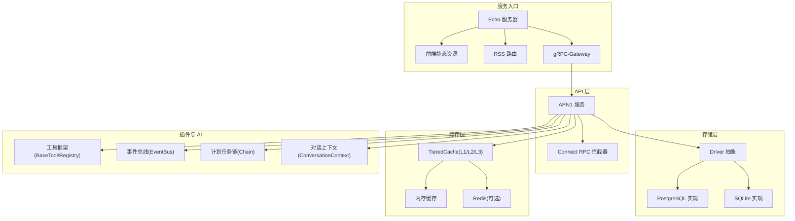

**图表来源**
- [server/server.go](file://server/server.go#L38-L87)
- [server/router/api/v1/connect_interceptors.go](file://server/router/api/v1/connect_interceptors.go#L19-L275)
- [store/db/db.go](file://store/db/db.go#L27-L44)
- [store/cache/tiered.go](file://store/cache/tiered.go#L17-L91)
- [plugin/ai/agent/base_tool.go](file://plugin/ai/agent/base_tool.go#L10-L251)
- [plugin/cron/chain.go](file://plugin/cron/chain.go#L11-L97)
- [plugin/ai/agent/context.go](file://plugin/ai/agent/context.go#L19-L488)

**章节来源**
- [server/server.go](file://server/server.go#L38-L87)

## 核心组件
- 工厂模式：在数据库层通过 NewDBDriver 根据配置选择具体驱动实现，屏蔽外部差异。
- 策略模式：API 层通过 Connect 拦截器链（Metadata/Auth/Logging/Recovery）在不同阶段注入行为。
- 观察者模式：聊天事件总线 EventBus 订阅/发布，实现事件驱动扩展。
- 依赖注入：服务构造函数集中注入 Store、Profile、Secret 等依赖，降低耦合。
- 适配器模式：ConnectServiceHandler 将 Connect 请求转换为 gRPC 风格调用，实现协议适配。
- 单例模式：实例配置模块通过全局变量提供只读配置访问；缓存层通过 NewDefault/New 等工厂方法提供默认实例。
- 模板方法：插件工具框架通过 BaseTool.Run 统一执行流程（校验/超时/执行/结果校验），子类仅需实现执行逻辑。
- 建造者模式：工具注册表 ToolRegistry 与 Agent 构建器 NewAgent，通过可选参数逐步构建复杂对象。

**章节来源**
- [store/db/db.go](file://store/db/db.go#L27-L44)
- [server/router/api/v1/connect_interceptors.go](file://server/router/api/v1/connect_interceptors.go#L19-L275)
- [server/router/api/v1/connect_services.go](file://server/router/api/v1/connect_services.go#L16-L491)
- [plugin/ai/agent/base_tool.go](file://plugin/ai/agent/base_tool.go#L24-L135)
- [plugin/ai/agent/tool_adapter.go](file://plugin/ai/agent/tool_adapter.go#L79-L237)
- [store/cache/cache.go](file://store/cache/cache.go#L75-L90)
- [store/cache/tiered.go](file://store/cache/tiered.go#L61-L91)

## 架构总览
Memos 的 API 层同时支持 Connect RPC 与 gRPC-Gateway，通过拦截器链实现横切关注点（认证、日志、恢复、元数据透传）。存储层通过工厂方法选择数据库驱动，缓存层采用三层缓存策略，插件层提供工具与上下文管理，整体形成“协议适配—服务编排—存储/缓存—插件”的清晰分层。

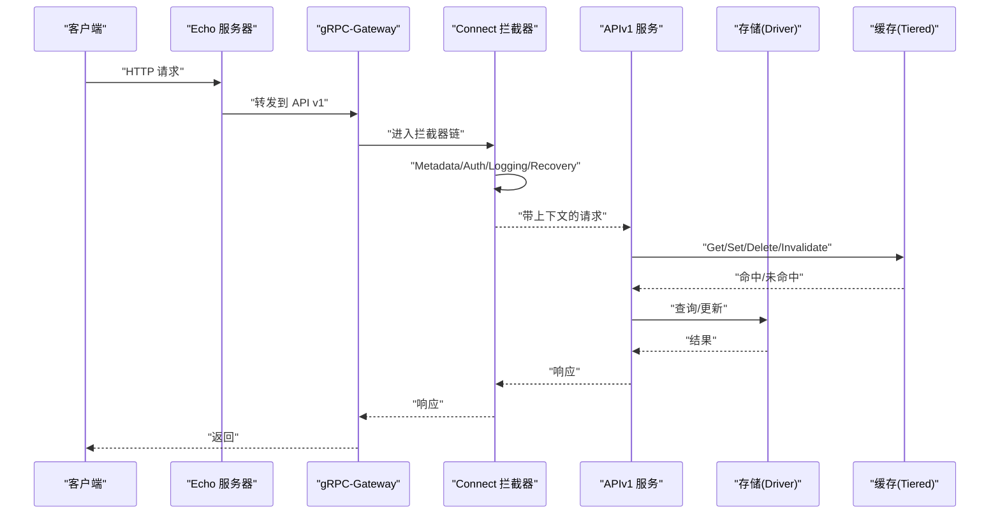

**图表来源**
- [server/server.go](file://server/server.go#L70-L86)
- [server/router/api/v1/connect_interceptors.go](file://server/router/api/v1/connect_interceptors.go#L19-L275)
- [server/router/api/v1/connect_services.go](file://server/router/api/v1/connect_services.go#L16-L491)
- [store/cache/tiered.go](file://store/cache/tiered.go#L93-L132)
- [store/db/db.go](file://store/db/db.go#L27-L44)

## 详细组件分析

### 工厂模式：服务创建与数据库驱动选择
- 数据库工厂：NewDBDriver 根据配置选择 PostgreSQL 或 SQLite 实现，不支持 MySQL，确保一致性与可维护性。
- 缓存工厂：NewDefault/New 提供默认内存缓存实例，TieredCache.NewTieredCache 支持 L1/L2/L3 组合。

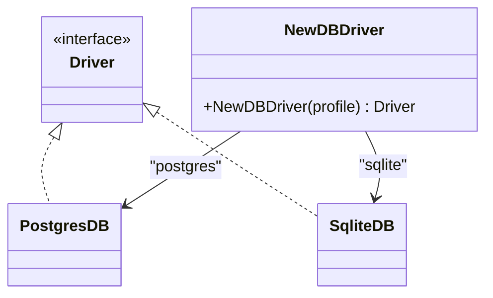

**图表来源**
- [store/db/db.go](file://store/db/db.go#L27-L44)

**章节来源**
- [store/db/db.go](file://store/db/db.go#L27-L44)
- [store/cache/cache.go](file://store/cache/cache.go#L75-L90)
- [store/cache/tiered.go](file://store/cache/tiered.go#L61-L91)

### 策略模式：API 拦截器链
- 元数据拦截器：将 HTTP 头转换为 gRPC 元数据，便于服务层统一读取。
- 日志拦截器：根据错误类型分级记录，区分客户端错误与服务端错误。
- 恢复拦截器：捕获 panic，避免崩溃并返回内部错误。
- 认证拦截器：基于 Authorization 头进行认证，非公开方法强制鉴权。

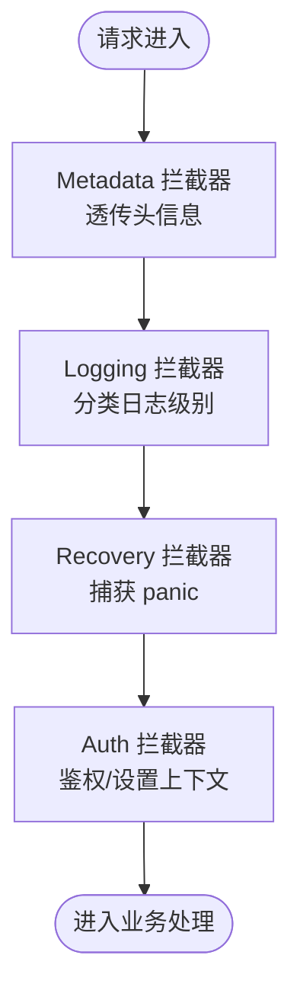

**图表来源**
- [server/router/api/v1/connect_interceptors.go](file://server/router/api/v1/connect_interceptors.go#L19-L275)

**章节来源**
- [server/router/api/v1/connect_interceptors.go](file://server/router/api/v1/connect_interceptors.go#L19-L275)

### 观察者模式：聊天事件总线
- EventBus 支持订阅/发布，监听器并发执行，每个监听器有独立超时上下文。
- 事件类型与回调约定明确，便于扩展新事件与处理器。

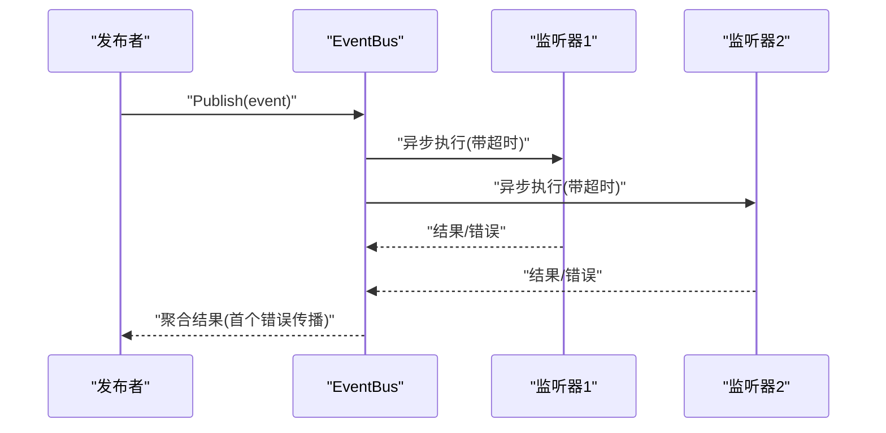

**图表来源**
- [server/router/api/v1/ai/conversation_service.go](file://server/router/api/v1/ai/conversation_service.go#L74-L134)

**章节来源**
- [server/router/api/v1/ai/conversation_service.go](file://server/router/api/v1/ai/conversation_service.go#L74-L134)

### 依赖注入：服务构造与解耦
- Server 构造函数集中注入 Store、Profile、Secret，随后创建 APIv1 服务并注册路由。
- APIv1 服务在方法中按需使用 Store、MarkdownService 等依赖，避免全局状态。

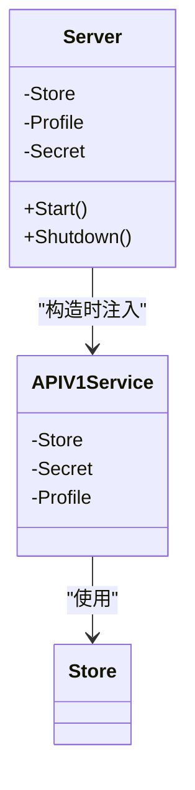

**图表来源**
- [server/server.go](file://server/server.go#L38-L87)

**章节来源**
- [server/server.go](file://server/server.go#L38-L87)

### 适配器模式：API 接口统一与 gRPC-Gateway 适配
- ConnectServiceHandler 将 Connect 请求转换为 gRPC 风格调用，统一响应格式与错误转换。
- MetadataInterceptor 将 HTTP 头转换为 gRPC 元数据，保证服务层无感知。

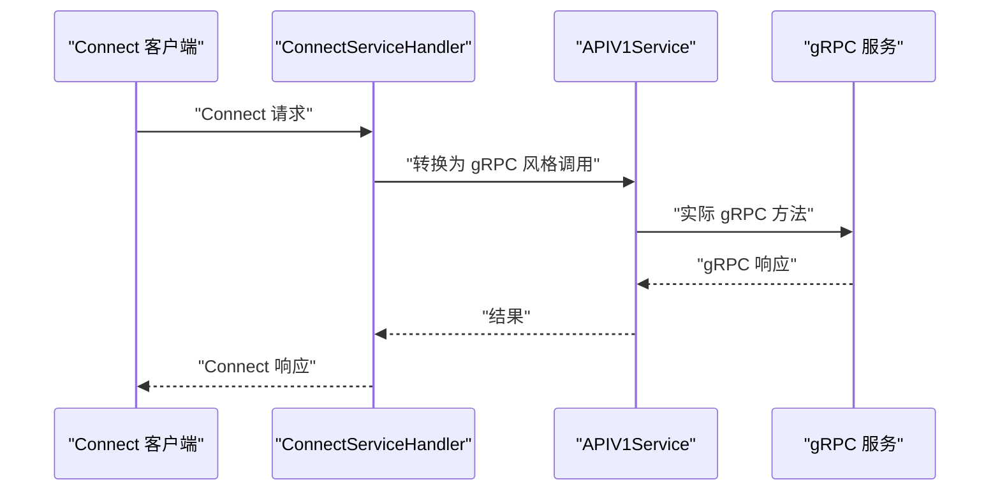

**图表来源**
- [server/router/api/v1/connect_services.go](file://server/router/api/v1/connect_services.go#L16-L491)
- [server/router/api/v1/connect_interceptors.go](file://server/router/api/v1/connect_interceptors.go#L19-L68)

**章节来源**
- [server/router/api/v1/connect_services.go](file://server/router/api/v1/connect_services.go#L16-L491)
- [server/router/api/v1/connect_interceptors.go](file://server/router/api/v1/connect_interceptors.go#L19-L68)

### 单例模式：配置管理与缓存系统
- 配置管理：实例配置模块通过全局变量提供只读访问，初始化后由上下文更新。
- 缓存系统：NewDefault/New 提供默认缓存实例；TieredCache 在启用 L2 时通过 NilRedisCache 提供空实现，保持一致接口。

```mermaid
classDiagram
class InstanceConfig {
+getInstanceConfig() InstanceConfig
+updateInstanceConfig(cfg)
}
class Cache {
+NewDefault()
+Set()/Get()/Delete()
}
class TieredCache {
+Get()/Set()/Delete()
}
InstanceConfig ..> "全局只读" : "单例"
Cache ..> "默认实例" : "工厂"
TieredCache --> Cache : "组合"
```

**图表来源**
- [web/src/instance-config.ts](file://web/src/instance-config.ts#L1-L23)
- [store/cache/cache.go](file://store/cache/cache.go#L75-L90)
- [store/cache/tiered.go](file://store/cache/tiered.go#L61-L91)

**章节来源**
- [web/src/instance-config.ts](file://web/src/instance-config.ts#L1-L23)
- [store/cache/cache.go](file://store/cache/cache.go#L75-L90)
- [store/cache/tiered.go](file://store/cache/tiered.go#L61-L91)

### 模板方法模式：插件开发与工具体系
- BaseTool.Run 定义了统一的执行模板：输入校验 → 超时上下文 → 执行 → 结果校验。
- ToolRegistry 提供注册、列举、描述等通用能力，配合 ToolWithSchema/ToolAdapter 实现工具定义与 LLM 对接。

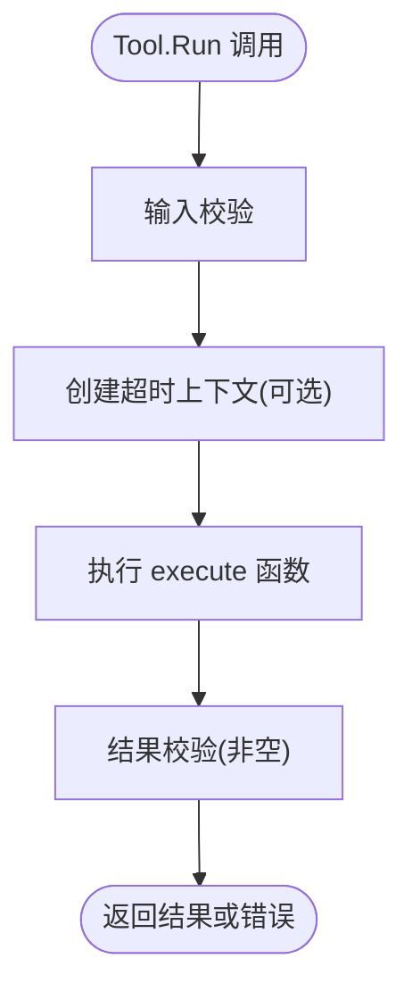

**图表来源**
- [plugin/ai/agent/base_tool.go](file://plugin/ai/agent/base_tool.go#L107-L135)

**章节来源**
- [plugin/ai/agent/base_tool.go](file://plugin/ai/agent/base_tool.go#L24-L135)
- [plugin/ai/agent/tool_adapter.go](file://plugin/ai/agent/tool_adapter.go#L79-L237)

### 建造者模式：复杂对象创建
- ToolRegistry：注册工具，提供描述与列表能力。
- Agent 构建器：通过可选配置（最大迭代次数、系统提示）逐步构建智能体。

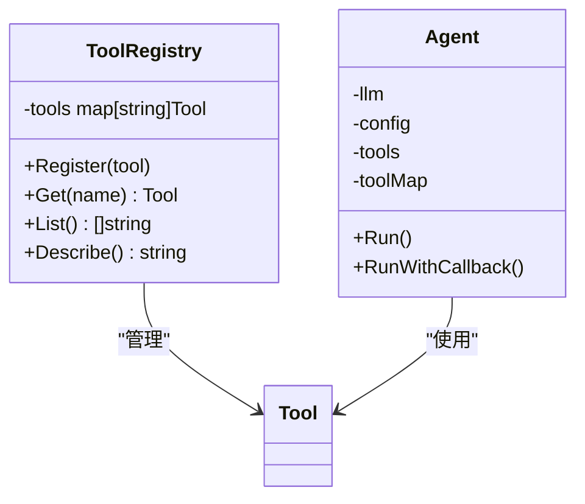

**图表来源**
- [plugin/ai/agent/base_tool.go](file://plugin/ai/agent/base_tool.go#L147-L221)
- [plugin/ai/agent/tool_adapter.go](file://plugin/ai/agent/tool_adapter.go#L79-L117)

**章节来源**
- [plugin/ai/agent/base_tool.go](file://plugin/ai/agent/base_tool.go#L147-L221)
- [plugin/ai/agent/tool_adapter.go](file://plugin/ai/agent/tool_adapter.go#L79-L117)

### 计划任务链式包装：职责链模式
- Chain 将多个 JobWrapper 组合，按顺序装饰作业，实现延迟、跳过、恢复等跨领域行为。


**图表来源**
- [plugin/cron/chain.go](file://plugin/cron/chain.go#L14-L39)

**章节来源**
- [plugin/cron/chain.go](file://plugin/cron/chain.go#L11-L97)

### 缓存策略：三层缓存与语义缓存
- TieredCache：L1 内存缓存（默认开启），L2 Redis（可选），L3 数据库回调；支持 Get/Set/Delete/Invalidate/Clear/Stats。
- 语义缓存：基于向量相似度的查询缓存，支持阈值控制与命中回退。

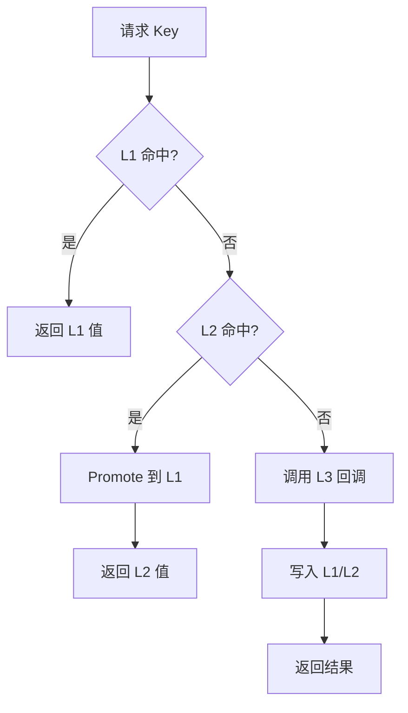

**图表来源**
- [store/cache/tiered.go](file://store/cache/tiered.go#L93-L132)

**章节来源**
- [store/cache/tiered.go](file://store/cache/tiered.go#L17-L208)
- [store/cache/redis.go](file://store/cache/redis.go#L12-L82)
- [store/cache/cache.go](file://store/cache/cache.go#L66-L197)

### 健康检查：最小可用性保障
- HealthService 通过检查实例基础设置与模式版本，判断服务是否处于 Serving 状态。

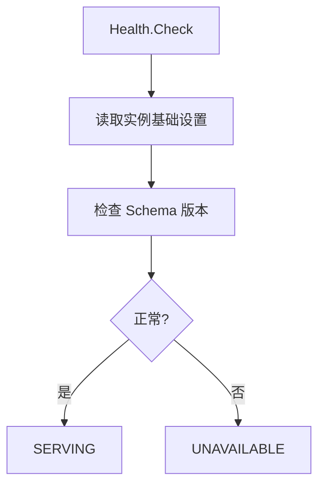

**图表来源**
- [server/router/api/v1/health_service.go](file://server/router/api/v1/health_service.go#L11-L25)

**章节来源**
- [server/router/api/v1/health_service.go](file://server/router/api/v1/health_service.go#L11-L25)

## 依赖关系分析
- 服务层依赖存储层（Store/Driver），通过工厂方法解耦数据库实现。
- API 层依赖拦截器链与 Connect 适配器，统一接入协议。
- 插件层（工具/事件/上下文/计划任务）作为横切能力被服务层复用。
- 缓存层与存储层解耦，通过 L3Fetcher 回调实现惰性加载。

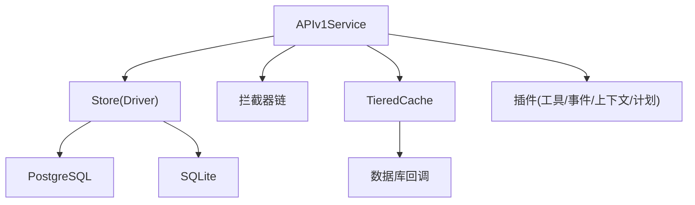

**图表来源**
- [store/db/db.go](file://store/db/db.go#L27-L44)
- [store/cache/tiered.go](file://store/cache/tiered.go#L93-L132)
- [plugin/ai/agent/context.go](file://plugin/ai/agent/context.go#L404-L446)
- [plugin/cron/chain.go](file://plugin/cron/chain.go#L11-L39)

**章节来源**
- [store/db/db.go](file://store/db/db.go#L27-L44)
- [store/cache/tiered.go](file://store/cache/tiered.go#L93-L132)
- [plugin/ai/agent/context.go](file://plugin/ai/agent/context.go#L404-L446)
- [plugin/cron/chain.go](file://plugin/cron/chain.go#L11-L39)

## 性能考量
- 缓存层：合理设置 L1/L2 TTL 与容量，利用 TieredCache 的 Promote 与 Invalidate 降低 L3 压力。
- 事件总线：监听器并发执行并带超时，避免阻塞主流程；注意监听器内部尊重取消信号。
- 工具执行：BaseTool 的超时控制与结果校验可防止长尾与无效输出。
- 数据库：生产环境优先 PostgreSQL，SQLite 仅限开发测试，避免功能割裂。

[本节为通用指导，无需特定文件引用]

## 故障排查指南
- 认证失败：确认 AuthInterceptor 是否正确解析 Authorization 头，非公开方法必须鉴权。
- 日志定位：LoggingInterceptor 按错误类型分级记录，结合 RecoveryInterceptor 的 panic 恢复信息快速定位。
- 缓存异常：检查 TieredCache 的 EnableL1/L2 配置与 L3Fetcher 是否返回错误；必要时调用 Invalidate 刷新。
- 健康检查：若健康状态为 UNAVAILABLE，检查实例基础设置与 Schema 版本是否正确初始化。

**章节来源**
- [server/router/api/v1/connect_interceptors.go](file://server/router/api/v1/connect_interceptors.go#L19-L275)
- [store/cache/tiered.go](file://store/cache/tiered.go#L164-L177)
- [server/router/api/v1/health_service.go](file://server/router/api/v1/health_service.go#L11-L25)

## 结论
Memos 在工程实践中系统性地应用了多种设计模式：以工厂与策略解耦实现与行为，以适配器统一协议入口，以观察者实现事件扩展，以依赖注入降低耦合，以模板方法与建造者简化复杂对象创建与配置。这些模式共同构成了高内聚、低耦合、易扩展的系统骨架。建议在新增模块时优先参考现有模式实现，保持风格一致与演进可控。