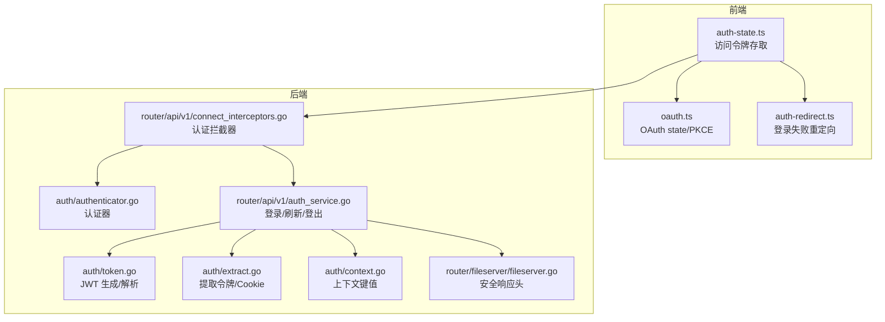
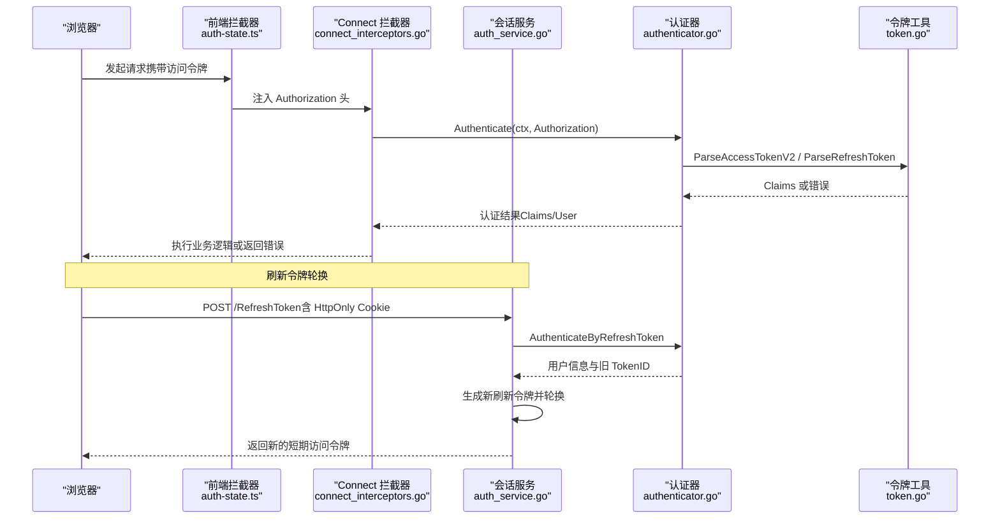
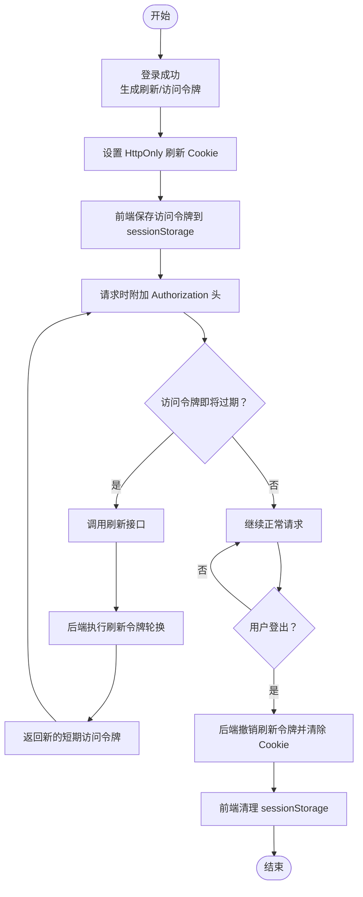
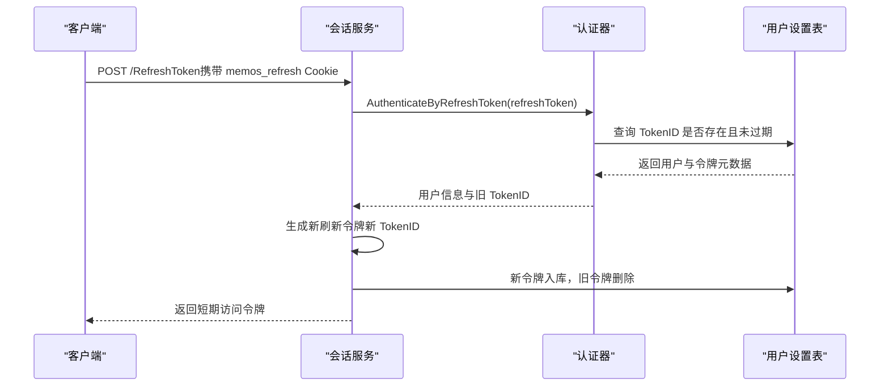
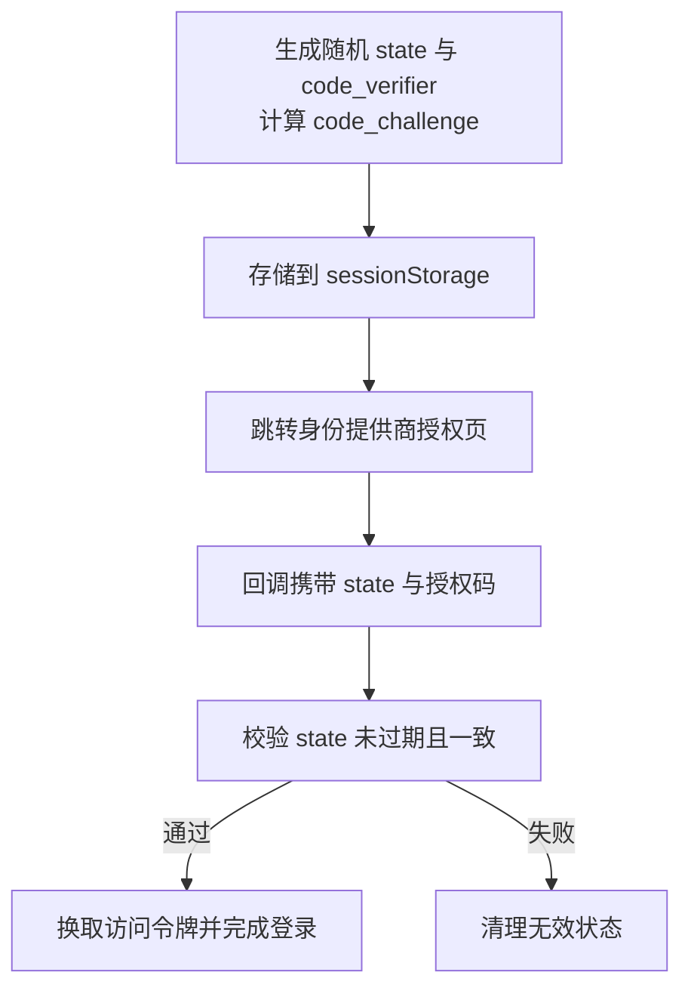
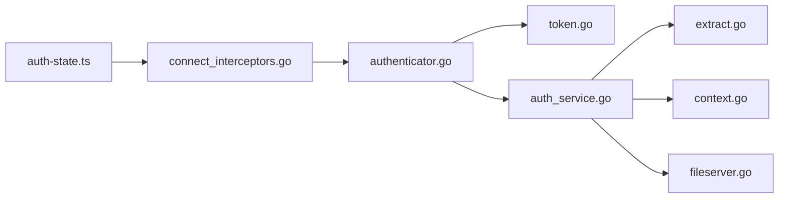

# 会话管理

<cite>
**本文引用的文件**
- [token.go](file://server/auth/token.go)
- [authenticator.go](file://server/auth/authenticator.go)
- [context.go](file://server/auth/context.go)
- [extract.go](file://server/auth/extract.go)
- [auth_service.go](file://server/router/api/v1/auth_service.go)
- [connect_interceptors.go](file://server/router/api/v1/connect_interceptors.go)
- [auth-state.ts](file://web/src/auth-state.ts)
- [oauth.ts](file://web/src/utils/oauth.ts)
- [auth-redirect.ts](file://web/src/utils/auth-redirect.ts)
- [fileserver.go](file://server/router/fileserver/fileserver.go)
</cite>

## 目录
1. [简介](#简介)
2. [项目结构](#项目结构)
3. [核心组件](#核心组件)
4. [架构总览](#架构总览)
5. [组件详解](#组件详解)
6. [依赖关系分析](#依赖关系分析)
7. [性能考量](#性能考量)
8. [故障排查指南](#故障排查指南)
9. [结论](#结论)
10. [附录：安全最佳实践](#附录安全最佳实践)

## 简介
本文件系统性阐述 Memos 的会话管理方案，覆盖以下主题：
- 用户会话生命周期：创建、维护与销毁
- 令牌刷新机制：刷新令牌的生成、验证与轮换策略
- 会话状态持久化与恢复：前端 sessionStorage 与后端刷新令牌存储
- 跨域与安全会话配置：Cookie 属性（HttpOnly、SameSite、Secure）与 HTTPS 推断
- 安全加固：CSRF 防护（OAuth state + PKCE）、XSS 防护、会话劫持防护

## 项目结构
围绕会话管理的关键代码分布在前后端：
- 后端（Go）
  - 认证与令牌：server/auth/*
  - 会话服务：server/router/api/v1/auth_service.go
  - 连接拦截器：server/router/api/v1/connect_interceptors.go
  - 文件服务器安全头：server/router/fileserver/fileserver.go
- 前端（TypeScript/React）
  - 令牌状态管理：web/src/auth-state.ts
  - OAuth 流程与 CSRF/PKCE：web/src/utils/oauth.ts
  - 登录失败重定向：web/src/utils/auth-redirect.ts

**图表来源**
- [auth-state.ts](file://web/src/auth-state.ts#L1-L74)
- [oauth.ts](file://web/src/utils/oauth.ts#L1-L124)
- [auth-redirect.ts](file://web/src/utils/auth-redirect.ts#L1-L37)
- [token.go](file://server/auth/token.go#L1-L250)
- [authenticator.go](file://server/auth/authenticator.go#L1-L166)
- [extract.go](file://server/auth/extract.go#L1-L34)
- [context.go](file://server/auth/context.go#L1-L84)
- [auth_service.go](file://server/router/api/v1/auth_service.go#L1-L613)
- [connect_interceptors.go](file://server/router/api/v1/connect_interceptors.go#L1-L275)
- [fileserver.go](file://server/router/fileserver/fileserver.go#L117-L151)

**章节来源**
- [auth-state.ts](file://web/src/auth-state.ts#L1-L74)
- [oauth.ts](file://web/src/utils/oauth.ts#L1-L124)
- [auth-redirect.ts](file://web/src/utils/auth-redirect.ts#L1-L37)
- [token.go](file://server/auth/token.go#L1-L250)
- [authenticator.go](file://server/auth/authenticator.go#L1-L166)
- [extract.go](file://server/auth/extract.go#L1-L34)
- [context.go](file://server/auth/context.go#L1-L84)
- [auth_service.go](file://server/router/api/v1/auth_service.go#L1-L613)
- [connect_interceptors.go](file://server/router/api/v1/connect_interceptors.go#L1-L275)
- [fileserver.go](file://server/router/fileserver/fileserver.go#L117-L151)

## 核心组件
- 前端访问令牌管理：封装在 auth-state.ts 中，使用 sessionStorage 持久化，支持过期判断与清理。
- OAuth 安全流程：oauth.ts 实现 state 与 PKCE，结合 CSRF 校验与过期清理。
- 后端令牌与认证：token.go 定义 JWT 结构与生成/解析；authenticator.go 提供无状态（Access V2）与基于数据库校验（Refresh/PAT）的认证；auth_service.go 实现登录、刷新、登出与 Cookie 设置。
- 请求拦截与上下文：connect_interceptors.go 将 HTTP 头转换为 gRPC 元数据，并注入认证上下文；context.go 定义上下文键值。
- 文件服务器安全：fileserver.go 设置安全响应头，降低 XSS 风险。

**章节来源**
- [auth-state.ts](file://web/src/auth-state.ts#L1-L74)
- [oauth.ts](file://web/src/utils/oauth.ts#L1-L124)
- [token.go](file://server/auth/token.go#L1-L250)
- [authenticator.go](file://server/auth/authenticator.go#L1-L166)
- [auth_service.go](file://server/router/api/v1/auth_service.go#L1-L613)
- [connect_interceptors.go](file://server/router/api/v1/connect_interceptors.go#L1-L275)
- [context.go](file://server/auth/context.go#L1-L84)
- [fileserver.go](file://server/router/fileserver/fileserver.go#L117-L151)

## 架构总览
下图展示从浏览器到后端服务的认证与会话流转，以及刷新令牌轮换与 Cookie 安全属性。

**图表来源**
- [auth-state.ts](file://web/src/auth-state.ts#L1-L74)
- [connect_interceptors.go](file://server/router/api/v1/connect_interceptors.go#L201-L275)
- [authenticator.go](file://server/auth/authenticator.go#L39-L99)
- [token.go](file://server/auth/token.go#L133-L187)
- [auth_service.go](file://server/router/api/v1/auth_service.go#L272-L357)

## 组件详解

### 1) 会话生命周期管理
- 创建会话
  - 密码或 SSO 登录成功后，后端生成刷新令牌与访问令牌，将刷新令牌以 HttpOnly Cookie 写回客户端，同时返回短期访问令牌给前端。
  - 前端使用 auth-state.ts 将访问令牌与过期时间写入 sessionStorage，用于后续请求自动附加 Authorization 头。
- 维护会话
  - 前端在每次请求前检查访问令牌是否即将过期（预留缓冲），必要时调用刷新接口。
  - 后端通过 Connect 拦截器解析访问令牌，无状态鉴权；若访问令牌缺失或过期，则尝试使用刷新令牌轮换新的访问令牌。
- 销毁会话
  - 登出时，后端根据请求中的 Cookie 解析刷新令牌，撤销对应记录，并清除 Cookie。
  - 前端清理 sessionStorage 中的访问令牌与过期时间。

**图表来源**
- [auth_service.go](file://server/router/api/v1/auth_service.go#L55-L190)
- [auth_service.go](file://server/router/api/v1/auth_service.go#L240-L270)
- [auth_service.go](file://server/router/api/v1/auth_service.go#L272-L357)
- [auth-state.ts](file://web/src/auth-state.ts#L10-L73)

**章节来源**
- [auth_service.go](file://server/router/api/v1/auth_service.go#L55-L190)
- [auth_service.go](file://server/router/api/v1/auth_service.go#L240-L270)
- [auth_service.go](file://server/router/api/v1/auth_service.go#L272-L357)
- [auth-state.ts](file://web/src/auth-state.ts#L10-L73)

### 2) 令牌刷新机制与轮换策略
- 刷新令牌生成与存储
  - 登录时生成 UUID 作为 TokenID，签发 30 天有效期的刷新令牌，同时将 TokenID、创建时间、过期时间与客户端信息写入用户设置表。
- 刷新流程
  - 从 Cookie 中提取刷新令牌，经后端解析并查询数据库确认未被撤销且未过期，随后生成新的刷新令牌（轮换），更新数据库记录并设置新 Cookie。
  - 同时签发短期访问令牌（15 分钟）返回给前端。
- 轮换收益
  - 滑动窗口会话：活跃用户可长期保持在线。
  - 偷窃防护：即使刷新令牌泄露，合法用户刷新后旧令牌即刻失效。

**图表来源**
- [auth_service.go](file://server/router/api/v1/auth_service.go#L272-L357)
- [authenticator.go](file://server/auth/authenticator.go#L60-L99)
- [token.go](file://server/auth/token.go#L162-L187)

**章节来源**
- [auth_service.go](file://server/router/api/v1/auth_service.go#L192-L238)
- [auth_service.go](file://server/router/api/v1/auth_service.go#L272-L357)
- [authenticator.go](file://server/auth/authenticator.go#L60-L99)
- [token.go](file://server/auth/token.go#L162-L187)

### 3) 会话状态持久化与恢复
- 前端持久化
  - 使用 sessionStorage 存储访问令牌与过期时间，页面刷新后尝试恢复未过期的令牌，避免频繁刷新。
- 后端持久化
  - 刷新令牌元数据（TokenID、过期时间、客户端信息）存储于用户设置表，便于用户查看与撤销特定会话。
- 恢复策略
  - 前端仅在 sessionStorage 中存在有效令牌时恢复；后端通过数据库校验刷新令牌有效性。

**章节来源**
- [auth-state.ts](file://web/src/auth-state.ts#L10-L35)
- [auth_service.go](file://server/router/api/v1/auth_service.go#L207-L217)

### 4) 跨域与安全会话配置
- Cookie 安全属性
  - 名称：memos_refresh
  - 属性：Path=/、HttpOnly、SameSite=Lax；在检测到 HTTPS（通过 Origin 判断）时追加 Secure。
- 会话识别与审计
  - 后端解析 User-Agent、X-Forwarded-For/X-Real-IP 等元数据，提取设备类型、操作系统、浏览器版本等，用于会话列表展示与可疑登录识别。

**章节来源**
- [auth_service.go](file://server/router/api/v1/auth_service.go#L369-L401)
- [auth_service.go](file://server/router/api/v1/auth_service.go#L420-L612)

### 5) OAuth 与 CSRF 防护
- CSRF 防护
  - 生成随机 state 并与回调参数对比，防止跨站请求伪造。
- 防钓鱼与中间人攻击
  - 使用 PKCE（code_verifier/code_challenge），确保授权码交换的安全性。
- 前端状态管理
  - 将 state、PKCE 参数与过期时间存入 sessionStorage，回调时进行匹配与清理。

**图表来源**
- [oauth.ts](file://web/src/utils/oauth.ts#L42-L105)

**章节来源**
- [oauth.ts](file://web/src/utils/oauth.ts#L1-L124)

### 6) XSS 防护与内容安全
- 文件下载与附件
  - 对潜在危险类型（如 text/html、javascript 等）强制改为二进制流输出，设置 nosniff、DENY 嵌入、限制默认源等安全头。
- 前端脚本校验（防御性）
  - 对自定义脚本输入进行基础模式匹配，阻断常见危险模式（事件处理器、document.cookie 等），作为纵深防御。

**章节来源**
- [fileserver.go](file://server/router/fileserver/fileserver.go#L117-L151)
- [App.tsx](file://web/src/App.tsx#L10-L27)

## 依赖关系分析
- 前端拦截器
  - auth-state.ts 读取/写入访问令牌；connect_interceptors.go 在请求头中注入 Authorization；auth-redirect.ts 控制未认证重定向。
- 后端拦截器
  - connect_interceptors.go 将 HTTP 头转换为元数据，转发 Cookie；AuthInterceptor 根据认证结果设置上下文。
- 认证与令牌
  - token.go 定义 JWT 结构与签名算法；authenticator.go 提供无状态与有状态认证；auth_service.go 调用上述模块完成登录/刷新/登出。

**图表来源**
- [auth-state.ts](file://web/src/auth-state.ts#L1-L74)
- [connect_interceptors.go](file://server/router/api/v1/connect_interceptors.go#L19-L67)
- [authenticator.go](file://server/auth/authenticator.go#L1-L166)
- [token.go](file://server/auth/token.go#L1-L250)
- [auth_service.go](file://server/router/api/v1/auth_service.go#L1-L613)
- [extract.go](file://server/auth/extract.go#L1-L34)
- [context.go](file://server/auth/context.go#L1-L84)
- [fileserver.go](file://server/router/fileserver/fileserver.go#L117-L151)

**章节来源**
- [connect_interceptors.go](file://server/router/api/v1/connect_interceptors.go#L19-L67)
- [authenticator.go](file://server/auth/authenticator.go#L1-L166)
- [token.go](file://server/auth/token.go#L1-L250)
- [auth_service.go](file://server/router/api/v1/auth_service.go#L1-L613)
- [extract.go](file://server/auth/extract.go#L1-L34)
- [context.go](file://server/auth/context.go#L1-L84)
- [fileserver.go](file://server/router/fileserver/fileserver.go#L117-L151)

## 性能考量
- 访问令牌短周期：15 分钟，降低泄露风险与服务端状态压力。
- 刷新令牌轮换：滑动窗口提升用户体验，减少频繁重新登录。
- 无状态访问令牌：后端无需查库即可验证，降低鉴权延迟。
- 前端 sessionStorage：避免每次刷新都触发刷新流程，减少网络往返。

[本节为通用建议，不直接分析具体文件]

## 故障排查指南
- “未认证”错误
  - 检查前端是否正确设置 Authorization 头；确认访问令牌未过期；若已过期，调用刷新接口。
- 刷新失败
  - 确认浏览器已携带 memos_refresh Cookie；检查后端是否能解析并校验刷新令牌；核对数据库中是否存在该 TokenID 且未过期。
- 登出后仍可访问
  - 确认后端已清除 Cookie 并撤销刷新令牌；前端是否清理了 sessionStorage。
- OAuth 回调失败
  - 检查 state 是否过期或不匹配；确认 PKCE code_verifier 是否正确传递；查看控制台错误日志。

**章节来源**
- [auth-state.ts](file://web/src/auth-state.ts#L57-L73)
- [auth_service.go](file://server/router/api/v1/auth_service.go#L288-L306)
- [auth_service.go](file://server/router/api/v1/auth_service.go#L359-L367)
- [oauth.ts](file://web/src/utils/oauth.ts#L67-L105)

## 结论
本系统采用“短期访问令牌 + 长期刷新令牌 + HttpOnly Cookie”的组合，结合刷新令牌轮换与前端 sessionStorage 持久化，实现了安全、顺滑的会话体验。配合 OAuth CSRF/PKCE、文件服务器安全头与前端脚本校验，整体具备较好的抗攻击能力。建议在生产环境启用 HTTPS、定期轮换密钥、监控异常登录行为，并对敏感操作增加二次验证。

[本节为总结，不直接分析具体文件]

## 附录：安全最佳实践
- CSRF 防护
  - OAuth 使用 state + PKCE；表单提交建议引入 CSRF token（前端可参考现有 state 机制扩展）。
- XSS 防护
  - 文件下载强制 nosniff 与 DENY 嵌入；前端对自定义脚本进行基础模式匹配；严格限制 CSP 默认源。
- 会话劫持防护
  - 使用 HttpOnly、SameSite=Lax（HTTPS 下追加 Secure）；基于 User-Agent/IP 等元数据识别异常会话；支持按会话撤销。
- 令牌安全
  - 严格保密服务端密钥；定期轮换；限制访问令牌作用域；对高危操作要求二次确认。

[本节为通用建议，不直接分析具体文件]