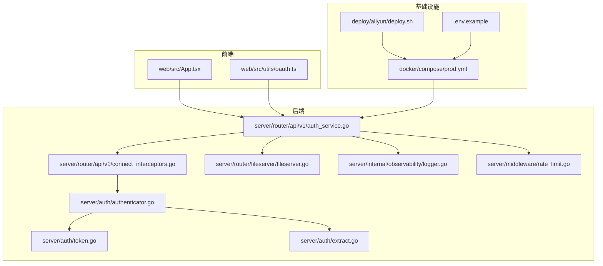
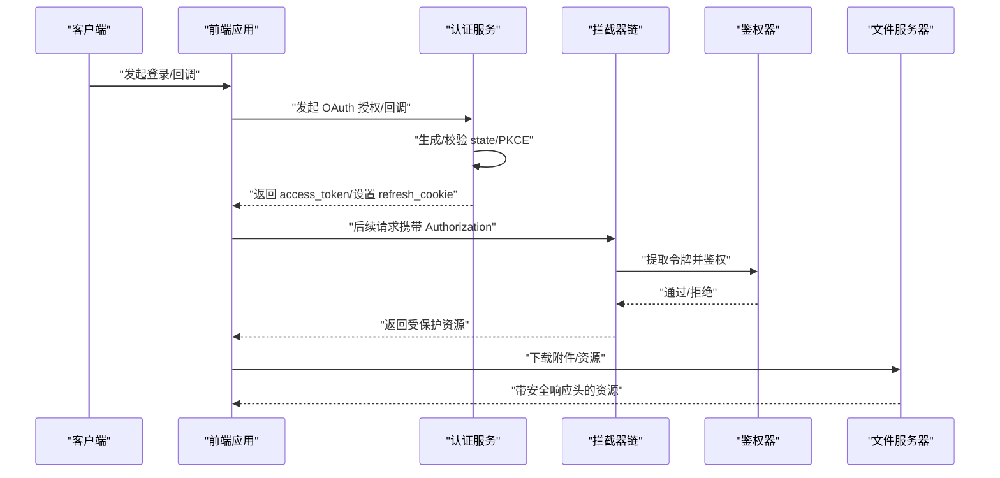
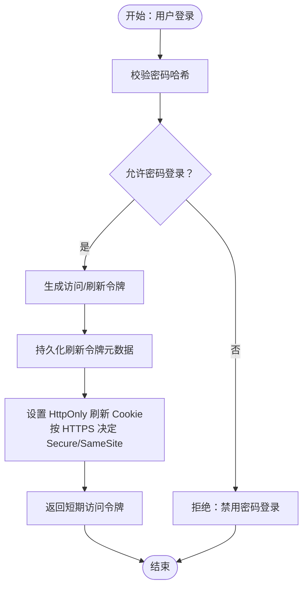
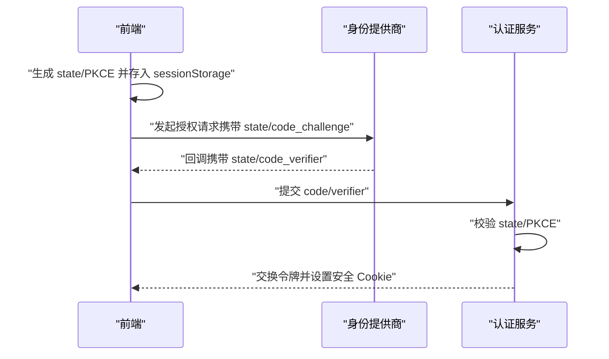
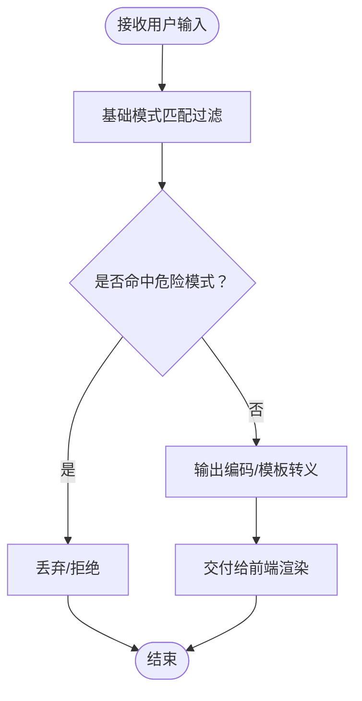
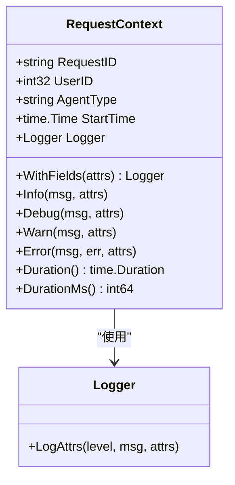
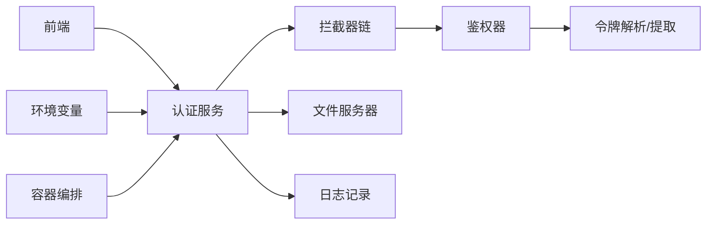

# 安全实践

<cite>
**本文档引用的文件**
- [SECURITY.md](file://SECURITY.md)
- [server/auth/authenticator.go](file://server/auth/authenticator.go)
- [server/auth/token.go](file://server/auth/token.go)
- [server/auth/extract.go](file://server/auth/extract.go)
- [server/router/api/v1/auth_service.go](file://server/router/api/v1/auth_service.go)
- [server/router/api/v1/connect_interceptors.go](file://server/router/api/v1/connect_interceptors.go)
- [server/router/fileserver/fileserver.go](file://server/router/fileserver/fileserver.go)
- [server/internal/observability/logger.go](file://server/internal/observability/logger.go)
- [server/middleware/rate_limit.go](file://server/middleware/rate_limit.go)
- [server/server.go](file://server/server.go)
- [deploy/aliyun/deploy.sh](file://deploy/aliyun/deploy.sh)
- [.env.example](file://.env.example)
- [docker/compose/prod.yml](file://docker/compose/prod.yml)
- [web/src/App.tsx](file://web/src/App.tsx)
- [web/src/utils/oauth.ts](file://web/src/utils/oauth.ts)
</cite>

## 目录
1. [简介](#简介)
2. [项目结构](#项目结构)
3. [核心组件](#核心组件)
4. [架构总览](#架构总览)
5. [详细组件分析](#详细组件分析)
6. [依赖关系分析](#依赖关系分析)
7. [性能与安全特性](#性能与安全特性)
8. [故障排查指南](#故障排查指南)
9. [结论](#结论)
10. [附录](#附录)

## 简介
本文件面向安全实践，基于仓库中的认证授权、令牌管理、CSRF/XSS 防护、日志与审计、漏洞预防与应急响应、安全配置检查清单与合规性要求进行系统化梳理与说明。目标是帮助开发者与运维人员在部署与维护过程中遵循最佳实践，降低风险并提升系统的整体安全性。

## 项目结构
围绕安全主题的关键模块分布如下：
- 后端认证与授权：JWT 访问令牌、刷新令牌、个人访问令牌（PAT）、拦截器链路
- 前端安全：OAuth 状态与 PKCE、基础 XSS 防护
- 文件服务器安全：响应头与内容安全策略
- 日志与可观测性：统一请求上下文与字段
- 部署与配置：环境变量、容器编排与安全加固

图表来源
- [server/router/api/v1/auth_service.go](file://server/router/api/v1/auth_service.go#L55-L190)
- [server/router/api/v1/connect_interceptors.go](file://server/router/api/v1/connect_interceptors.go#L201-L275)
- [server/auth/authenticator.go](file://server/auth/authenticator.go#L17-L166)
- [server/auth/token.go](file://server/auth/token.go#L7-L250)
- [server/auth/extract.go](file://server/auth/extract.go#L1-L33)
- [server/router/fileserver/fileserver.go](file://server/router/fileserver/fileserver.go#L117-L151)
- [server/internal/observability/logger.go](file://server/internal/observability/logger.go#L30-L152)
- [server/middleware/rate_limit.go](file://server/middleware/rate_limit.go#L1-L48)
- [docker/compose/prod.yml](file://docker/compose/prod.yml#L13-L119)
- [deploy/aliyun/deploy.sh](file://deploy/aliyun/deploy.sh#L55-L91)
- [.env.example](file://.env.example#L1-L58)
- [web/src/App.tsx](file://web/src/App.tsx#L10-L27)
- [web/src/utils/oauth.ts](file://web/src/utils/oauth.ts#L42-L77)

章节来源
- [server/router/api/v1/auth_service.go](file://server/router/api/v1/auth_service.go#L55-L190)
- [server/router/api/v1/connect_interceptors.go](file://server/router/api/v1/connect_interceptors.go#L201-L275)
- [server/auth/authenticator.go](file://server/auth/authenticator.go#L17-L166)
- [server/auth/token.go](file://server/auth/token.go#L7-L250)
- [server/router/fileserver/fileserver.go](file://server/router/fileserver/fileserver.go#L117-L151)
- [server/internal/observability/logger.go](file://server/internal/observability/logger.go#L30-L152)
- [server/middleware/rate_limit.go](file://server/middleware/rate_limit.go#L1-L48)
- [docker/compose/prod.yml](file://docker/compose/prod.yml#L13-L119)
- [deploy/aliyun/deploy.sh](file://deploy/aliyun/deploy.sh#L55-L91)
- [.env.example](file://.env.example#L1-L58)
- [web/src/App.tsx](file://web/src/App.tsx#L10-L27)
- [web/src/utils/oauth.ts](file://web/src/utils/oauth.ts#L42-L77)

## 核心组件
- 认证与授权
  - 访问令牌（短期，无状态校验）
  - 刷新令牌（长期，数据库撤销校验）
  - 个人访问令牌（PAT，程序化访问）
  - 拦截器链：元数据转换、日志、恢复、鉴权
- 前端安全
  - OAuth 状态与 PKCE 存储与校验
  - 基础 XSS 模式过滤
- 文件服务器安全
  - 安全响应头、禁止 MIME 嗅探、禁止嵌入框架
- 日志与审计
  - 统一请求上下文、结构化字段、错误码与事件类型
- 部署与配置
  - 环境变量与密钥注入、容器编排与资源限制

章节来源
- [server/auth/authenticator.go](file://server/auth/authenticator.go#L17-L166)
- [server/auth/token.go](file://server/auth/token.go#L7-L250)
- [server/router/api/v1/connect_interceptors.go](file://server/router/api/v1/connect_interceptors.go#L201-L275)
- [server/router/api/v1/auth_service.go](file://server/router/api/v1/auth_service.go#L55-L190)
- [server/router/fileserver/fileserver.go](file://server/router/fileserver/fileserver.go#L117-L151)
- [server/internal/observability/logger.go](file://server/internal/observability/logger.go#L30-L152)
- [web/src/utils/oauth.ts](file://web/src/utils/oauth.ts#L42-L77)
- [web/src/App.tsx](file://web/src/App.tsx#L10-L27)
- [docker/compose/prod.yml](file://docker/compose/prod.yml#L13-L119)
- [.env.example](file://.env.example#L1-L58)

## 架构总览
下图展示从浏览器到后端服务的典型认证流程，包括 OAuth 初始化、令牌发放、刷新与撤销、以及安全响应头与日志审计。

图表来源
- [server/router/api/v1/auth_service.go](file://server/router/api/v1/auth_service.go#L55-L190)
- [server/router/api/v1/connect_interceptors.go](file://server/router/api/v1/connect_interceptors.go#L201-L275)
- [server/auth/authenticator.go](file://server/auth/authenticator.go#L17-L166)
- [server/router/fileserver/fileserver.go](file://server/router/fileserver/fileserver.go#L117-L151)

## 详细组件分析

### 认证与授权最佳实践
- 密码加密存储
  - 登录时使用哈希算法对密码进行比较，避免明文存储与泄露
  - 禁止密码认证的场景可通过实例设置进行控制
- 令牌安全传输与存储
  - 访问令牌短期有效，减少暴露窗口；刷新令牌通过 HttpOnly Cookie 传输与存储
  - 刷新令牌支持轮换与撤销，结合滑动会话提升安全性
  - PAT 采用哈希存储，前端生成随机字符串作为 PAT 原始值
- 来源检查与 CSRF 防护
  - 前端通过 sessionStorage 存储 OAuth state 与 code_verifier，并在回调时校验
  - 后端在设置 Cookie 时根据请求是否 HTTPS 决定 SameSite/Lax 与 Secure 属性
- 授权与最小权限
  - 拦截器链强制非公开接口鉴权；角色与权限在服务层进一步细化

图表来源
- [server/router/api/v1/auth_service.go](file://server/router/api/v1/auth_service.go#L55-L190)
- [server/auth/token.go](file://server/auth/token.go#L133-L187)
- [server/auth/authenticator.go](file://server/auth/authenticator.go#L60-L99)

章节来源
- [server/router/api/v1/auth_service.go](file://server/router/api/v1/auth_service.go#L55-L190)
- [server/auth/token.go](file://server/auth/token.go#L133-L187)
- [server/auth/authenticator.go](file://server/auth/authenticator.go#L60-L99)
- [server/auth/extract.go](file://server/auth/extract.go#L22-L33)

### CSRF 防护机制
- OAuth 状态与 PKCE
  - 前端生成并存储 state 与 code_verifier，回调时校验以抵御 CSRF 与重放攻击
- Cookie 安全属性
  - 根据请求是否 HTTPS 设置 SameSite=Lax 与 Secure，降低跨站请求风险

图表来源
- [web/src/utils/oauth.ts](file://web/src/utils/oauth.ts#L42-L77)
- [server/router/api/v1/auth_service.go](file://server/router/api/v1/auth_service.go#L369-L401)

章节来源
- [web/src/utils/oauth.ts](file://web/src/utils/oauth.ts#L42-L77)
- [server/router/api/v1/auth_service.go](file://server/router/api/v1/auth_service.go#L369-L401)

### XSS 防护策略
- 输入验证与输出编码
  - 前端对自定义脚本进行基础模式匹配过滤，阻断常见危险模式
- 内容安全策略
  - 文件服务器设置安全响应头，禁止 MIME 嗅探与嵌入框架，限制默认策略
- 建议
  - 引入更严格的 CSP 策略与 HTML/JS 输出编码库，确保富文本渲染安全

图表来源
- [web/src/App.tsx](file://web/src/App.tsx#L10-L27)
- [server/router/fileserver/fileserver.go](file://server/router/fileserver/fileserver.go#L117-L151)

章节来源
- [web/src/App.tsx](file://web/src/App.tsx#L10-L27)
- [server/router/fileserver/fileserver.go](file://server/router/fileserver/fileserver.go#L117-L151)

### 安全审计与日志记录
- 统一请求上下文
  - 为每次请求生成唯一 request_id，附加 user_id、agent_type 等字段，便于追踪
- 结构化日志
  - 记录错误码、事件类型、消息长度、耗时等，支持快速定位问题
- 日志级别与异常恢复
  - 拦截器对错误进行分类记录；panic 恢复并返回内部错误，避免崩溃

图表来源
- [server/internal/observability/logger.go](file://server/internal/observability/logger.go#L30-L152)
- [server/router/api/v1/connect_interceptors.go](file://server/router/api/v1/connect_interceptors.go#L89-L158)

章节来源
- [server/internal/observability/logger.go](file://server/internal/observability/logger.go#L30-L152)
- [server/router/api/v1/connect_interceptors.go](file://server/router/api/v1/connect_interceptors.go#L89-L158)

### 安全配置检查清单
- 环境变量与密钥
  - 确认数据库连接、AI 服务密钥等敏感信息通过环境变量注入，避免硬编码
  - 部署脚本会检查默认配置是否已被修改
- 容器与网络
  - 使用独立网络隔离服务；限制资源使用，启用健康检查
- Cookie 安全
  - 刷新令牌使用 HttpOnly；根据 HTTPS 设置 Secure 与 SameSite
- 文件安全
  - 对潜在危险类型强制以二进制流返回，设置 nosniff 与 DENY 嵌入
- 日志与监控
  - 启用结构化日志与错误分类；对 panic 进行恢复处理

章节来源
- [.env.example](file://.env.example#L1-L58)
- [deploy/aliyun/deploy.sh](file://deploy/aliyun/deploy.sh#L55-L91)
- [docker/compose/prod.yml](file://docker/compose/prod.yml#L13-L119)
- [server/router/api/v1/auth_service.go](file://server/router/api/v1/auth_service.go#L369-L401)
- [server/router/fileserver/fileserver.go](file://server/router/fileserver/fileserver.go#L117-L151)
- [server/router/api/v1/connect_interceptors.go](file://server/router/api/v1/connect_interceptors.go#L58-L67)

### 应急响应流程
- 发现安全问题
  - 依据安全策略进行报告与处理，避免在公共渠道披露
- 快速处置
  - 临时封禁受影响的令牌或会话；回滚可疑变更；加强日志与告警
- 修复与验证
  - 修复后进行回归测试与渗透验证；更新部署与配置
- 总结与改进
  - 归档事件与处理过程，完善流程与工具

章节来源
- [SECURITY.md](file://SECURITY.md#L1-L47)

## 依赖关系分析
- 认证链路
  - 前端发起登录/回调 → 认证服务生成令牌 → 拦截器链进行鉴权 → 业务服务处理请求
- 安全相关依赖
  - 拦截器链依赖鉴权器；鉴权器依赖令牌解析与提取；文件服务器依赖安全响应头
- 配置与部署
  - 环境变量驱动服务行为；容器编排定义网络与资源；部署脚本负责环境检查与升级

图表来源
- [server/router/api/v1/auth_service.go](file://server/router/api/v1/auth_service.go#L55-L190)
- [server/router/api/v1/connect_interceptors.go](file://server/router/api/v1/connect_interceptors.go#L201-L275)
- [server/auth/authenticator.go](file://server/auth/authenticator.go#L17-L166)
- [server/auth/token.go](file://server/auth/token.go#L205-L249)
- [server/auth/extract.go](file://server/auth/extract.go#L1-L33)
- [server/router/fileserver/fileserver.go](file://server/router/fileserver/fileserver.go#L117-L151)
- [server/internal/observability/logger.go](file://server/internal/observability/logger.go#L30-L152)
- [.env.example](file://.env.example#L1-L58)
- [docker/compose/prod.yml](file://docker/compose/prod.yml#L13-L119)

章节来源
- [server/router/api/v1/auth_service.go](file://server/router/api/v1/auth_service.go#L55-L190)
- [server/router/api/v1/connect_interceptors.go](file://server/router/api/v1/connect_interceptors.go#L201-L275)
- [server/auth/authenticator.go](file://server/auth/authenticator.go#L17-L166)
- [server/auth/token.go](file://server/auth/token.go#L205-L249)
- [server/auth/extract.go](file://server/auth/extract.go#L1-L33)
- [server/router/fileserver/fileserver.go](file://server/router/fileserver/fileserver.go#L117-L151)
- [server/internal/observability/logger.go](file://server/internal/observability/logger.go#L30-L152)
- [.env.example](file://.env.example#L1-L58)
- [docker/compose/prod.yml](file://docker/compose/prod.yml#L13-L119)

## 性能与安全特性
- 令牌轮换与滑动会话
  - 刷新令牌轮换降低长期暴露风险；短令牌减少泄露影响面
- 速率限制
  - 基于限流器的通用速率限制，防止滥用与暴力破解
- 缓存控制
  - API 响应禁用缓存，避免浏览器缓存敏感数据

章节来源
- [server/router/api/v1/auth_service.go](file://server/router/api/v1/auth_service.go#L272-L357)
- [server/middleware/rate_limit.go](file://server/middleware/rate_limit.go#L1-L48)
- [server/router/api/v1/connect_interceptors.go](file://server/router/api/v1/connect_interceptors.go#L58-L67)

## 故障排查指南
- 认证失败
  - 检查访问令牌签名与受众校验、刷新令牌撤销与过期、PAT 哈希与有效期
- Cookie 问题
  - 确认是否 HTTPS、SameSite/Lax/Secure 是否正确设置
- 日志定位
  - 使用 request_id 关联请求链路；关注错误码与事件类型字段
- 部署检查
  - 环境变量是否修改、Docker 与 Compose 是否正常、健康检查是否通过

章节来源
- [server/auth/authenticator.go](file://server/auth/authenticator.go#L60-L124)
- [server/auth/token.go](file://server/auth/token.go#L205-L249)
- [server/router/api/v1/auth_service.go](file://server/router/api/v1/auth_service.go#L369-L401)
- [server/internal/observability/logger.go](file://server/internal/observability/logger.go#L30-L152)
- [deploy/aliyun/deploy.sh](file://deploy/aliyun/deploy.sh#L55-L91)
- [docker/compose/prod.yml](file://docker/compose/prod.yml#L13-L119)

## 结论
本项目在认证授权、令牌安全、CSRF/XSS 防护、日志审计与部署配置方面已具备较为完善的实践基础。建议持续强化 CSP 与输出编码、完善令牌撤销与审计、加强供应链与依赖安全扫描，并定期演练应急响应流程，以满足生产环境的安全与合规要求。

## 附录
- 安全配置检查清单
  - 环境变量与密钥：确保敏感信息通过环境变量注入
  - 容器编排：网络隔离、资源限制、健康检查
  - Cookie 安全：HttpOnly、SameSite/Lax、Secure（HTTPS）
  - 文件安全：nosniff、DENY 嵌入、危险类型二进制流
  - 日志与监控：结构化字段、错误分类、panic 恢复
- 合规性要求
  - 遵循最小权限原则与数据最小化；建立漏洞披露与应急响应流程；定期进行安全评估与渗透测试