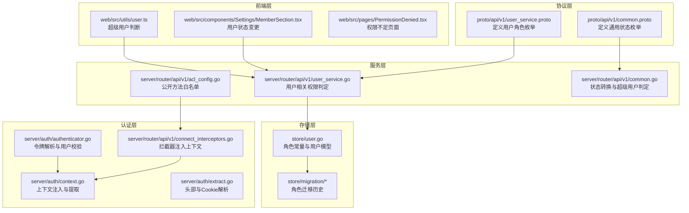
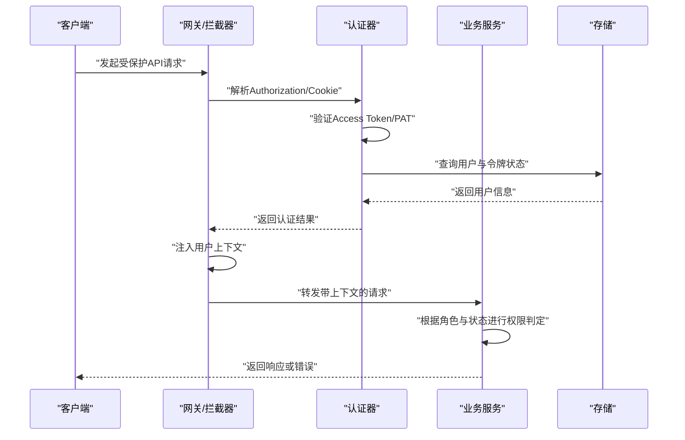
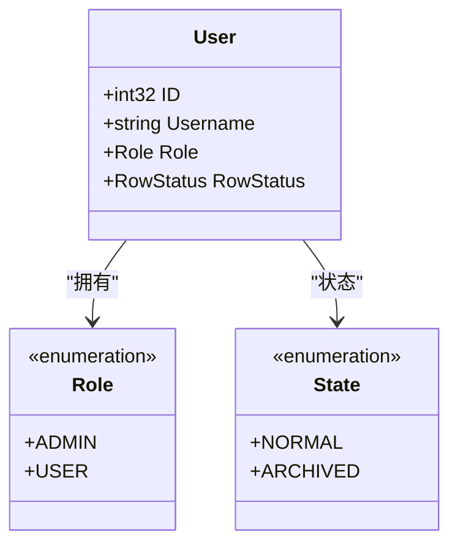
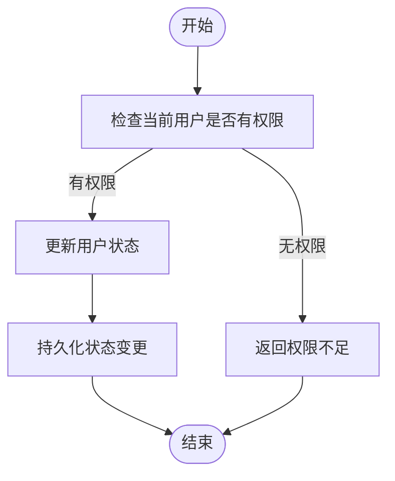
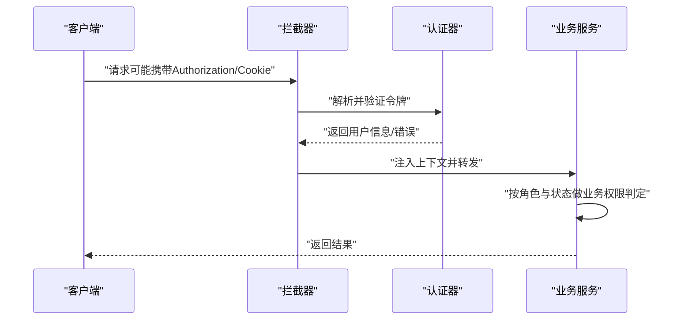
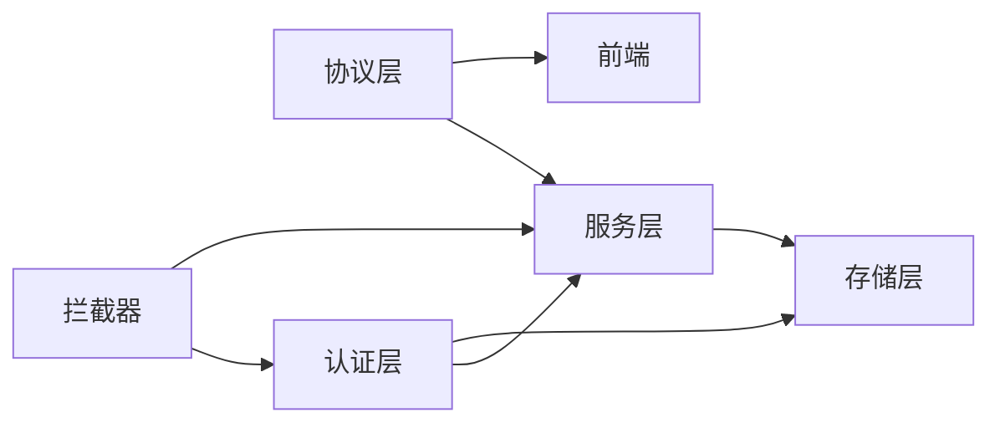

# 基于角色的访问控制

<cite>
**本文档引用的文件**
- [store/user.go](file://store/user.go)
- [proto/api/v1/user_service.proto](file://proto/api/v1/user_service.proto)
- [proto/api/v1/common.proto](file://proto/api/v1/common.proto)
- [server/router/api/v1/acl_config.go](file://server/router/api/v1/acl_config.go)
- [server/router/api/v1/acl_config_test.go](file://server/router/api/v1/acl_config_test.go)
- [server/router/api/v1/user_service.go](file://server/router/api/v1/user_service.go)
- [server/router/api/v1/common.go](file://server/router/api/v1/common.go)
- [server/auth/authenticator.go](file://server/auth/authenticator.go)
- [server/auth/context.go](file://server/auth/context.go)
- [server/auth/extract.go](file://server/auth/extract.go)
- [server/router/api/v1/connect_interceptors.go](file://server/router/api/v1/connect_interceptors.go)
- [server/router/api/v1/auth_service.go](file://server/router/api/v1/auth_service.go)
- [web/src/utils/user.ts](file://web/src/utils/user.ts)
- [web/src/components/Settings/MemberSection.tsx](file://web/src/components/Settings/MemberSection.tsx)
- [web/src/pages/PermissionDenied.tsx](file://web/src/pages/PermissionDenied.tsx)
- [store/migration/sqlite/0.2/00__user_role.sql](file://store/migration/sqlite/0.2/00__user_role.sql)
- [store/migration/sqlite/0.15/00__drop_user_open_id.sql](file://store/migration/sqlite/0.15/00__drop_user_open_id.sql)
- [docs/specs/sync-user-role-and-mode-refactor-20260121.md](file://docs/specs/sync-user-role-and-mode-refactor-20260121.md)
</cite>

## 目录
1. [简介](#简介)
2. [项目结构](#项目结构)
3. [核心组件](#核心组件)
4. [架构总览](#架构总览)
5. [详细组件分析](#详细组件分析)
6. [依赖关系分析](#依赖关系分析)
7. [性能考量](#性能考量)
8. [故障排查指南](#故障排查指南)
9. [结论](#结论)
10. [附录](#附录)

## 简介
本文件系统化梳理并说明本仓库中的基于角色的访问控制（RBAC）体系，覆盖以下主题：
- 用户角色定义与层级结构（管理员、普通用户等）
- 角色继承与权限组合机制
- 用户状态管理（激活、归档、删除）
- 权限分配与验证流程
- RBAC 最佳实践与常见问题解决
- 后端与前端的角色检查实现示例路径

## 项目结构
RBAC 相关能力横跨协议定义、服务层、认证授权中间件与前端工具函数等多个模块：
- 协议层：通过 protobuf 定义用户角色枚举与通用状态枚举
- 服务层：在 API 服务中进行权限判定与状态转换
- 认证层：在拦截器与认证器中注入用户上下文与校验令牌
- 前端层：通过工具函数与页面组件进行角色判断与状态操作

图表来源
- [proto/api/v1/user_service.proto](file://proto/api/v1/user_service.proto#L205-L214)
- [proto/api/v1/common.proto](file://proto/api/v1/common.proto#L7-L11)
- [server/router/api/v1/acl_config.go](file://server/router/api/v1/acl_config.go#L11-L35)
- [server/router/api/v1/user_service.go](file://server/router/api/v1/user_service.go#L32-L71)
- [server/router/api/v1/common.go](file://server/router/api/v1/common.go#L20-L38)
- [server/auth/authenticator.go](file://server/auth/authenticator.go#L41-L99)
- [server/auth/context.go](file://server/auth/context.go#L48-L83)
- [server/auth/extract.go](file://server/auth/extract.go#L8-L33)
- [server/router/api/v1/connect_interceptors.go](file://server/router/api/v1/connect_interceptors.go#L260-L274)
- [store/user.go](file://store/user.go#L7-L28)
- [store/migration/sqlite/0.2/00__user_role.sql](file://store/migration/sqlite/0.2/00__user_role.sql#L14-L18)
- [web/src/utils/user.ts](file://web/src/utils/user.ts#L3-L5)
- [web/src/components/Settings/MemberSection.tsx](file://web/src/components/Settings/MemberSection.tsx#L53-L95)

章节来源
- [store/user.go](file://store/user.go#L7-L28)
- [proto/api/v1/user_service.proto](file://proto/api/v1/user_service.proto#L205-L214)
- [proto/api/v1/common.proto](file://proto/api/v1/common.proto#L7-L11)
- [server/router/api/v1/acl_config.go](file://server/router/api/v1/acl_config.go#L11-L35)
- [server/router/api/v1/user_service.go](file://server/router/api/v1/user_service.go#L32-L71)
- [server/router/api/v1/common.go](file://server/router/api/v1/common.go#L20-L38)
- [server/auth/authenticator.go](file://server/auth/authenticator.go#L41-L99)
- [server/auth/context.go](file://server/auth/context.go#L48-L83)
- [server/auth/extract.go](file://server/auth/extract.go#L8-L33)
- [server/router/api/v1/connect_interceptors.go](file://server/router/api/v1/connect_interceptors.go#L260-L274)
- [web/src/utils/user.ts](file://web/src/utils/user.ts#L3-L5)
- [web/src/components/Settings/MemberSection.tsx](file://web/src/components/Settings/MemberSection.tsx#L53-L95)

## 核心组件
- 角色与状态定义
  - 用户角色：管理员（ADMIN）、普通用户（USER）。历史 HOST 角色已在上游版本中迁移到 ADMIN。
  - 用户状态：NORMAL（正常）、ARCHIVED（归档）。状态在服务层与存储层之间进行转换。

- 权限判定与公开接口
  - 公开方法白名单：登录、实例信息、公开用户资料、公开备忘录等无需认证。
  - 受保护方法：用户管理、写操作、实例设置等需要认证与权限。

- 认证与上下文
  - 支持短效访问令牌（Access Token V2）与个人访问令牌（PAT）两种认证方式。
  - 通过拦截器将用户信息注入到请求上下文中，供后续服务方法使用。

- 前端角色检查
  - 提供超级用户判断工具函数，用于界面元素的显示/隐藏与交互控制。

章节来源
- [store/user.go](file://store/user.go#L7-L28)
- [proto/api/v1/user_service.proto](file://proto/api/v1/user_service.proto#L205-L214)
- [proto/api/v1/common.proto](file://proto/api/v1/common.proto#L7-L11)
- [server/router/api/v1/acl_config.go](file://server/router/api/v1/acl_config.go#L11-L35)
- [server/router/api/v1/acl_config_test.go](file://server/router/api/v1/acl_config_test.go#L39-L72)
- [server/auth/authenticator.go](file://server/auth/authenticator.go#L41-L99)
- [server/auth/context.go](file://server/auth/context.go#L48-L83)
- [server/router/api/v1/connect_interceptors.go](file://server/router/api/v1/connect_interceptors.go#L260-L274)
- [web/src/utils/user.ts](file://web/src/utils/user.ts#L3-L5)

## 架构总览
下图展示了从客户端请求到服务端鉴权与权限判定的整体流程：

图表来源
- [server/router/api/v1/connect_interceptors.go](file://server/router/api/v1/connect_interceptors.go#L260-L274)
- [server/auth/authenticator.go](file://server/auth/authenticator.go#L41-L99)
- [server/auth/context.go](file://server/auth/context.go#L48-L83)
- [server/router/api/v1/user_service.go](file://server/router/api/v1/user_service.go#L32-L71)

## 详细组件分析

### 角色定义与层级结构
- 角色枚举
  - 协议层定义了用户角色枚举，包含 ADMIN 与 USER；历史 HOST 已移除。
  - 存储层保留了角色常量与字符串化方法，便于调试与日志输出。
- 角色继承与权限组合
  - 超级用户判定：ADMIN 与历史 HOST（前端工具仍兼容）被视为超级用户，具备更高权限。
  - 实际业务权限：例如用户列表、更新、删除等操作，要求 ADMIN 或 HOST（当前实现中 ADMIN 即可）。

图表来源
- [proto/api/v1/user_service.proto](file://proto/api/v1/user_service.proto#L205-L214)
- [store/user.go](file://store/user.go#L44-L60)
- [proto/api/v1/common.proto](file://proto/api/v1/common.proto#L7-L11)

章节来源
- [proto/api/v1/user_service.proto](file://proto/api/v1/user_service.proto#L205-L214)
- [store/user.go](file://store/user.go#L7-L28)
- [web/src/utils/user.ts](file://web/src/utils/user.ts#L3-L5)

### 用户状态管理（激活、归档、删除）
- 状态枚举与转换
  - NORMAL：正常可用
  - ARCHIVED：归档不可用
  - 服务层提供状态转换函数，将存储层 RowStatus 与协议层 State 互转。
- 归档与恢复
  - 管理员可通过更新用户状态将用户归档或恢复。
- 删除
  - 删除用户时调用存储层删除接口，确保数据一致性。

图表来源
- [server/router/api/v1/user_service.go](file://server/router/api/v1/user_service.go#L183-L200)
- [server/router/api/v1/common.go](file://server/router/api/v1/common.go#L20-L38)
- [web/src/components/Settings/MemberSection.tsx](file://web/src/components/Settings/MemberSection.tsx#L53-L95)

章节来源
- [server/router/api/v1/common.go](file://server/router/api/v1/common.go#L20-L38)
- [web/src/components/Settings/MemberSection.tsx](file://web/src/components/Settings/MemberSection.tsx#L53-L95)
- [store/db/postgres/user.go](file://store/db/postgres/user.go#L170-L179)
- [store/db/sqlite/user.go](file://store/db/sqlite/user.go#L165-L176)

### 权限分配与验证流程
- 公开接口与受保护接口
  - 公开接口：登录、实例信息、公开用户资料、公开备忘录等。
  - 受保护接口：用户管理、写操作、实例设置等。
- 认证与授权
  - 短效访问令牌：拦截器解析 Authorization 头部，验证并注入用户上下文。
  - 个人访问令牌：直接解析 PAT 并进行有效期与用户状态校验。
  - 用户状态校验：归档用户无法通过认证。
- 业务权限判定
  - 服务方法在执行前读取上下文中的用户信息，结合角色与状态进行权限判定。

图表来源
- [server/router/api/v1/acl_config.go](file://server/router/api/v1/acl_config.go#L11-L35)
- [server/auth/extract.go](file://server/auth/extract.go#L8-L33)
- [server/auth/authenticator.go](file://server/auth/authenticator.go#L41-L99)
- [server/router/api/v1/connect_interceptors.go](file://server/router/api/v1/connect_interceptors.go#L260-L274)
- [server/router/api/v1/user_service.go](file://server/router/api/v1/user_service.go#L32-L71)

章节来源
- [server/router/api/v1/acl_config.go](file://server/router/api/v1/acl_config.go#L11-L35)
- [server/router/api/v1/acl_config_test.go](file://server/router/api/v1/acl_config_test.go#L39-L72)
- [server/auth/extract.go](file://server/auth/extract.go#L8-L33)
- [server/auth/authenticator.go](file://server/auth/authenticator.go#L41-L99)
- [server/router/api/v1/connect_interceptors.go](file://server/router/api/v1/connect_interceptors.go#L260-L274)
- [server/router/api/v1/user_service.go](file://server/router/api/v1/user_service.go#L32-L71)

### 角色在不同资源上的权限分配
- 用户资源
  - 自己：可更新自己的资料（受部分字段限制）
  - 管理员：可列出、更新、删除其他用户
- 备忘录资源
  - 写操作（创建、更新、删除）通常需要认证与相应权限
- 实例资源
  - 更新实例设置等操作通常需要管理员权限

章节来源
- [server/router/api/v1/user_service.go](file://server/router/api/v1/user_service.go#L32-L71)
- [server/router/api/v1/user_service.go](file://server/router/api/v1/user_service.go#L183-L200)
- [server/router/api/v1/acl_config.go](file://server/router/api/v1/acl_config.go#L11-L35)

### 前后端角色检查实现示例
- 后端
  - 在服务方法中读取上下文中的用户信息，进行角色与状态校验。
  - 示例路径：[server/router/api/v1/user_service.go](file://server/router/api/v1/user_service.go#L32-L71)
- 前端
  - 使用工具函数判断是否为超级用户，以控制界面行为。
  - 示例路径：[web/src/utils/user.ts](file://web/src/utils/user.ts#L3-L5)
- 权限不足页面
  - 当权限不足时，前端跳转到 403 页面。
  - 示例路径：[web/src/pages/PermissionDenied.tsx](file://web/src/pages/PermissionDenied.tsx#L1-L15)

章节来源
- [server/router/api/v1/user_service.go](file://server/router/api/v1/user_service.go#L32-L71)
- [web/src/utils/user.ts](file://web/src/utils/user.ts#L3-L5)
- [web/src/pages/PermissionDenied.tsx](file://web/src/pages/PermissionDenied.tsx#L1-L15)

## 依赖关系分析
- 组件耦合
  - 服务层依赖协议层的角色与状态定义
  - 认证层依赖存储层的用户查询与令牌校验
  - 前端依赖协议层生成的类型与工具函数
- 外部依赖
  - 拦截器负责统一注入上下文，减少服务层重复逻辑
  - 公开接口白名单集中维护，避免分散配置导致遗漏

图表来源
- [proto/api/v1/user_service.proto](file://proto/api/v1/user_service.proto#L205-L214)
- [server/router/api/v1/user_service.go](file://server/router/api/v1/user_service.go#L32-L71)
- [server/auth/authenticator.go](file://server/auth/authenticator.go#L41-L99)
- [server/router/api/v1/connect_interceptors.go](file://server/router/api/v1/connect_interceptors.go#L260-L274)

章节来源
- [server/router/api/v1/acl_config.go](file://server/router/api/v1/acl_config.go#L11-L35)
- [server/router/api/v1/user_service.go](file://server/router/api/v1/user_service.go#L32-L71)
- [server/auth/authenticator.go](file://server/auth/authenticator.go#L41-L99)
- [server/router/api/v1/connect_interceptors.go](file://server/router/api/v1/connect_interceptors.go#L260-L274)

## 性能考量
- 令牌验证
  - Access Token V2 为无状态验证，避免频繁数据库查询
  - PAT 需要哈希匹配与过期检查，注意索引与缓存策略
- 缓存
  - 用户查询结果在存储层具备缓存逻辑，减少重复查询
- 分页与过滤
  - 列表接口支持分页与过滤，合理设置 Limit 与排序可降低负载

## 故障排查指南
- 权限不足
  - 确认请求是否命中公开接口白名单
  - 检查拦截器是否正确注入用户上下文
  - 核对服务方法中的角色与状态判定逻辑
  - 示例路径：[server/router/api/v1/acl_config.go](file://server/router/api/v1/acl_config.go#L11-L35)，[server/router/api/v1/user_service.go](file://server/router/api/v1/user_service.go#L32-L71)
- 认证失败
  - 校验 Authorization 头部格式与签名
  - 检查 Cookie 中刷新令牌是否存在与有效
  - 确认用户状态未被归档
  - 示例路径：[server/auth/extract.go](file://server/auth/extract.go#L8-L33)，[server/auth/authenticator.go](file://server/auth/authenticator.go#L41-L99)
- 用户状态异常
  - 归档用户无法登录或执行受保护操作
  - 管理员应能对用户状态进行归档/恢复
  - 示例路径：[server/router/api/v1/common.go](file://server/router/api/v1/common.go#L20-L38)，[web/src/components/Settings/MemberSection.tsx](file://web/src/components/Settings/MemberSection.tsx#L53-L95)

章节来源
- [server/router/api/v1/acl_config.go](file://server/router/api/v1/acl_config.go#L11-L35)
- [server/router/api/v1/user_service.go](file://server/router/api/v1/user_service.go#L32-L71)
- [server/auth/extract.go](file://server/auth/extract.go#L8-L33)
- [server/auth/authenticator.go](file://server/auth/authenticator.go#L41-L99)
- [server/router/api/v1/common.go](file://server/router/api/v1/common.go#L20-L38)
- [web/src/components/Settings/MemberSection.tsx](file://web/src/components/Settings/MemberSection.tsx#L53-L95)

## 结论
本项目的 RBAC 体系以协议层角色与状态定义为基础，通过拦截器与认证器实现统一的认证与上下文注入，并在服务层完成细粒度的权限判定。公开接口白名单与状态转换函数保证了安全与易维护性。前端通过工具函数与页面组件实现角色驱动的界面行为。建议在实际部署中遵循最佳实践，持续完善权限边界与审计日志。

## 附录
- 角色迁移与重构
  - 历史 HOST 角色已迁移至 ADMIN，前端工具仍兼容 HOST 以便平滑过渡
  - 示例路径：[docs/specs/sync-user-role-and-mode-refactor-20260121.md](file://docs/specs/sync-user-role-and-mode-refactor-20260121.md#L21-L33)
- 历史角色字段演进
  - SQLite 迁移脚本展示了角色字段从 OWNER/USER 到 HOST/USER 的变化
  - 示例路径：[store/migration/sqlite/0.2/00__user_role.sql](file://store/migration/sqlite/0.2/00__user_role.sql#L14-L18)
- 去除多余字段
  - 用户表去除了 open_id 字段，简化结构
  - 示例路径：[store/migration/sqlite/0.15/00__drop_user_open_id.sql](file://store/migration/sqlite/0.15/00__drop_user_open_id.sql#L8-L13)