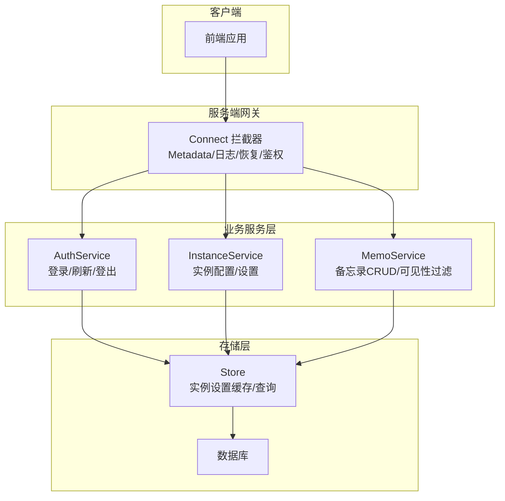
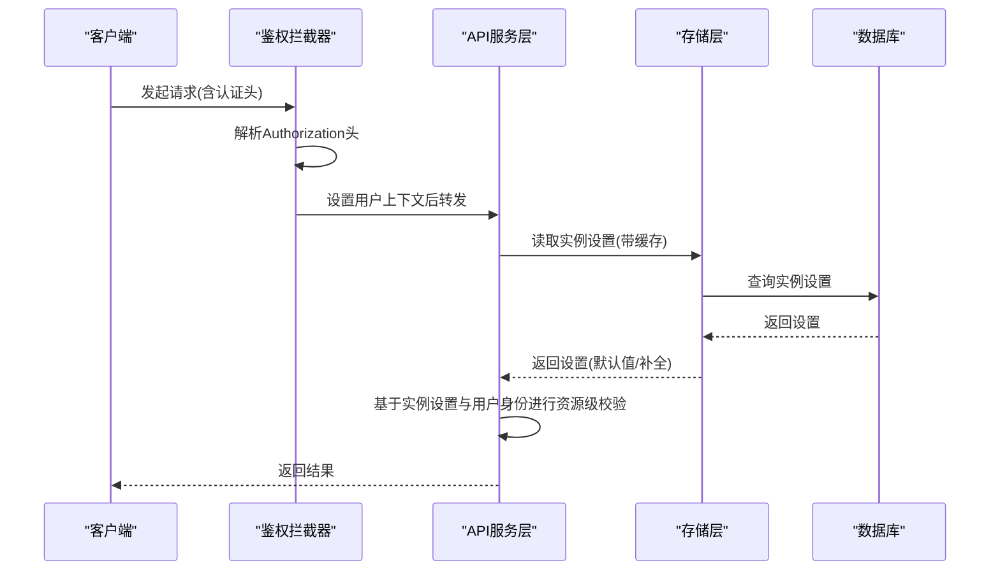
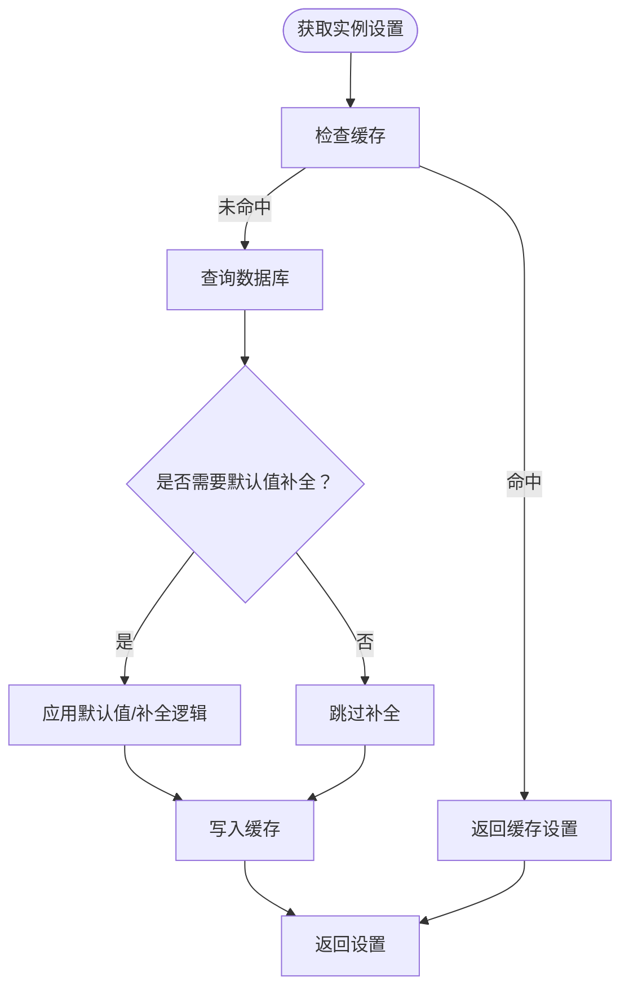
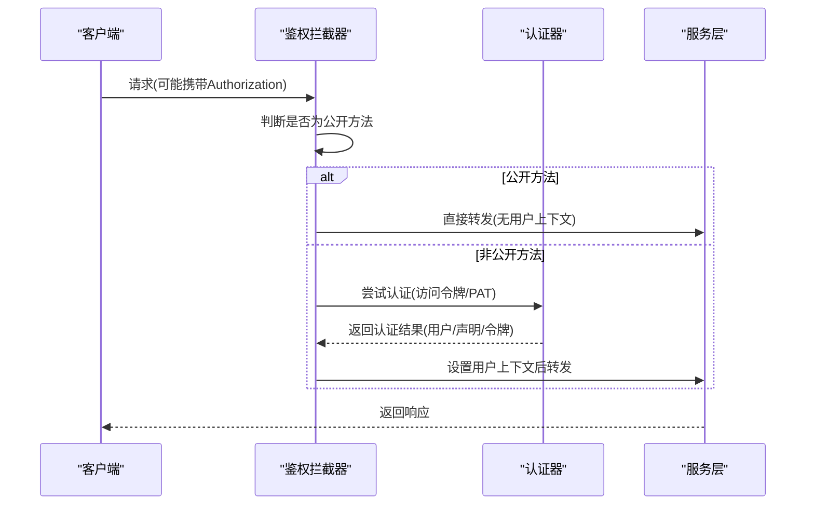
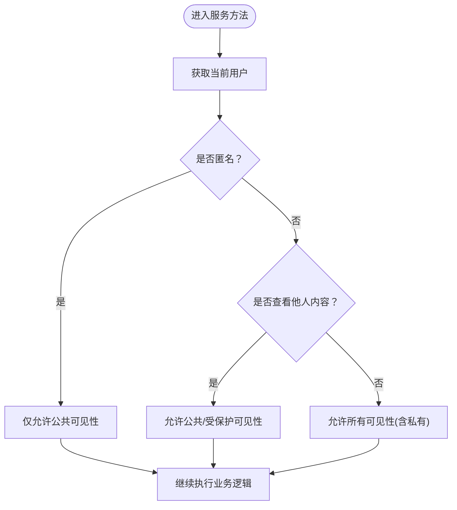
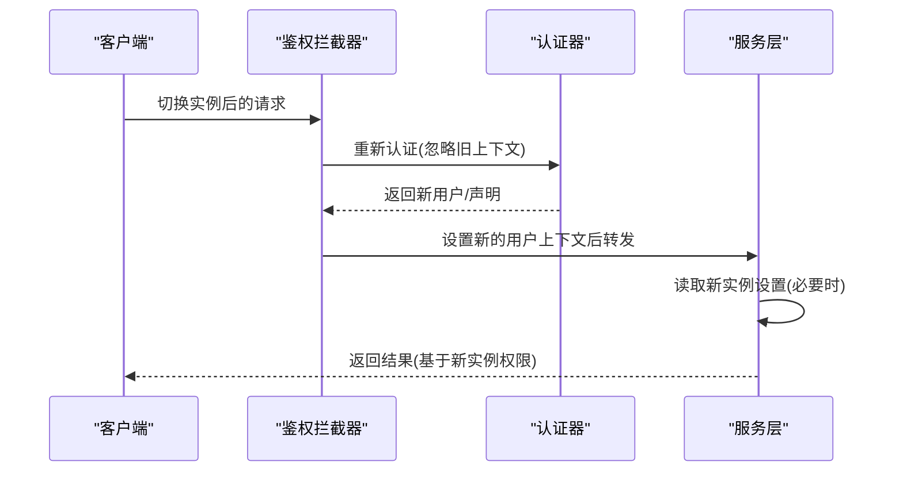
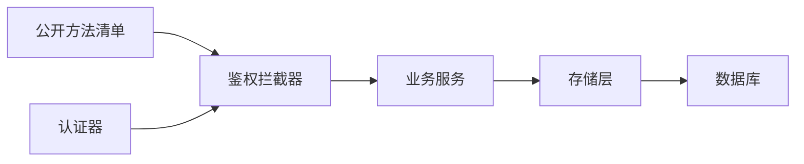

# 多租户权限隔离

<cite>
**本文档引用的文件**
- [instance_setting.proto](file://proto/store/instance_setting.proto)
- [instance_setting.go](file://store/instance_setting.go)
- [acl_config.go](file://server/router/api/v1/acl_config.go)
- [context.go](file://server/auth/context.go)
- [common.go](file://server/router/api/v1/common.go)
- [auth_service.go](file://server/router/api/v1/auth_service.go)
- [user.go](file://store/user.go)
- [memo_service.go](file://server/router/api/v1/memo_service.go)
- [memo.go](file://store/memo.go)
- [connect_interceptors.go](file://server/router/api/v1/connect_interceptors.go)
- [authenticator.go](file://server/auth/authenticator.go)
- [resource_name.go](file://server/router/api/v1/resource_name.go)
- [instance_service.go](file://server/router/api/v1/instance_service.go)
- [server.go](file://server/server.go)
- [resource_name.go](file://internal/base/resource_name.go)
</cite>

## 目录
1. [引言](#引言)
2. [项目结构](#项目结构)
3. [核心组件](#核心组件)
4. [架构总览](#架构总览)
5. [详细组件分析](#详细组件分析)
6. [依赖关系分析](#依赖关系分析)
7. [性能考量](#性能考量)
8. [故障排除指南](#故障排除指南)
9. [结论](#结论)
10. [附录](#附录)

## 引言
本文件面向多租户权限隔离系统，围绕实例级权限与资源级权限的分离设计，系统性阐述以下主题：
- 多租户架构下的权限模型：实例级（全局）与资源级（用户、备忘录等）权限如何协同工作
- 租户隔离机制：数据隔离、权限隔离与命名空间管理
- 实例设置对权限控制的影响：全局权限配置与租户特定设置
- 跨租户资源访问的限制与控制策略
- 多租户权限配置最佳实践与安全考虑
- 实例切换时的权限重新验证机制

## 项目结构
该系统采用分层架构，服务端通过拦截器统一处理认证与授权，业务服务在服务层进行资源级权限校验，存储层负责实例设置与资源持久化。

图表来源
- [connect_interceptors.go](file://server/router/api/v1/connect_interceptors.go#L201-L275)
- [auth_service.go](file://server/router/api/v1/auth_service.go#L55-L190)
- [instance_service.go](file://server/router/api/v1/instance_service.go#L16-L106)
- [memo_service.go](file://server/router/api/v1/memo_service.go#L24-L287)
- [instance_setting.go](file://store/instance_setting.go#L26-L100)

章节来源
- [connect_interceptors.go](file://server/router/api/v1/connect_interceptors.go#L1-L275)
- [auth_service.go](file://server/router/api/v1/auth_service.go#L1-L613)
- [instance_service.go](file://server/router/api/v1/instance_service.go#L1-L294)
- [memo_service.go](file://server/router/api/v1/memo_service.go#L1-L831)
- [instance_setting.go](file://store/instance_setting.go#L1-L244)

## 核心组件
- 认证与上下文
  - 鉴权拦截器：统一处理非公开方法的认证要求，支持访问令牌与个人访问令牌（PAT）
  - 用户上下文：在请求上下文中注入用户标识、访问令牌与声明
- 实例设置与权限
  - 实例设置键值：基础、通用、存储、备忘录相关四类设置
  - 权限控制：部分设置仅主机角色可读取或修改
- 资源与可见性
  - 资源命名规范：统一前缀与层级命名，便于解析与权限校验
  - 可见性枚举：公共、受保护、私有，服务层按用户身份与实例设置进行过滤

章节来源
- [context.go](file://server/auth/context.go#L1-L84)
- [connect_interceptors.go](file://server/router/api/v1/connect_interceptors.go#L201-L275)
- [instance_setting.proto](file://proto/store/instance_setting.proto#L7-L27)
- [instance_setting.go](file://store/instance_setting.go#L102-L207)
- [resource_name.go](file://server/router/api/v1/resource_name.go#L12-L22)
- [memo.go](file://store/memo.go#L12-L33)

## 架构总览
系统通过“实例设置 + 服务层权限校验”的双层控制实现多租户权限隔离：

图表来源
- [connect_interceptors.go](file://server/router/api/v1/connect_interceptors.go#L216-L242)
- [authenticator.go](file://server/auth/authenticator.go#L133-L165)
- [instance_setting.go](file://store/instance_setting.go#L81-L100)
- [memo_service.go](file://server/router/api/v1/memo_service.go#L147-L287)

## 详细组件分析

### 组件A：实例设置与权限控制
- 设计要点
  - 实例设置键值区分基础、通用、存储、备忘录相关四类，分别影响会话、注册、密码认证、存储类型、备忘录可见性等
  - 存储设置仅主机角色可读取，体现实例级权限的严格控制
  - 服务启动时自动补齐基础设置（如密钥），确保系统可用性
- 关键流程
  - 获取实例设置：优先从缓存读取，未命中则查询数据库并写入缓存
  - 更新实例设置：仅主机角色允许，更新后返回最新设置
  - 默认值补全：通用设置默认周起始日为周一；备忘录内容长度下限与反应列表默认值保障一致性

图表来源
- [instance_setting.go](file://store/instance_setting.go#L81-L100)
- [instance_setting.go](file://store/instance_setting.go#L121-L142)
- [instance_setting.go](file://store/instance_setting.go#L150-L173)
- [instance_setting.go](file://store/instance_setting.go#L181-L207)

章节来源
- [instance_setting.proto](file://proto/store/instance_setting.proto#L7-L27)
- [instance_setting.go](file://store/instance_setting.go#L26-L100)
- [instance_setting.go](file://store/instance_setting.go#L102-L207)
- [server.go](file://server/server.go#L181-L202)

### 组件B：认证与上下文
- 设计要点
  - 支持两种认证方式：短期访问令牌（无状态）、长期个人访问令牌（PAT）
  - 在请求上下文中注入用户ID、访问令牌与声明，供后续服务层使用
- 关键流程
  - 鉴权拦截器：根据公开方法清单决定是否强制认证；成功后设置上下文
  - 认证器：优先验证短期访问令牌，其次验证PAT；支持刷新令牌场景

图表来源
- [connect_interceptors.go](file://server/router/api/v1/connect_interceptors.go#L216-L242)
- [authenticator.go](file://server/auth/authenticator.go#L133-L165)
- [context.go](file://server/auth/context.go#L30-L83)

章节来源
- [acl_config.go](file://server/router/api/v1/acl_config.go#L11-L42)
- [connect_interceptors.go](file://server/router/api/v1/connect_interceptors.go#L201-L275)
- [authenticator.go](file://server/auth/authenticator.go#L1-L166)
- [context.go](file://server/auth/context.go#L1-L84)

### 组件C：资源命名与可见性控制
- 设计要点
  - 统一资源命名前缀（用户、备忘录、附件、反应、收件箱、身份提供商、活动、Webhook）
  - 可见性枚举：公共、受保护、私有；服务层根据当前用户身份与实例设置进行过滤
- 关键流程
  - 备忘录列表：匿名用户仅能看到公共备忘录；已登录用户能看到自己的私有与公共/受保护备忘录
  - 备忘录详情：非公开备忘录需满足创建者或管理员条件

图表来源
- [memo_service.go](file://server/router/api/v1/memo_service.go#L147-L190)
- [memo_service.go](file://server/router/api/v1/memo_service.go#L289-L335)
- [memo.go](file://store/memo.go#L12-L33)

章节来源
- [resource_name.go](file://server/router/api/v1/resource_name.go#L12-L22)
- [resource_name.go](file://server/router/api/v1/resource_name.go#L44-L96)
- [memo_service.go](file://server/router/api/v1/memo_service.go#L147-L287)
- [memo_service.go](file://server/router/api/v1/memo_service.go#L289-L335)
- [memo.go](file://store/memo.go#L12-L33)

### 组件D：实例切换时的权限重新验证机制
- 设计要点
  - 通过鉴权拦截器在每次请求中重新解析认证信息，确保实例切换后上下文与权限一致
  - 服务层在关键操作前再次读取实例设置，避免陈旧缓存导致的权限偏差
- 关键流程
  - 每次请求进入拦截器时，依据公开方法清单判断是否需要认证
  - 认证成功后，将用户上下文写入请求上下文，供后续服务调用

图表来源
- [connect_interceptors.go](file://server/router/api/v1/connect_interceptors.go#L216-L242)
- [authenticator.go](file://server/auth/authenticator.go#L133-L165)
- [instance_setting.go](file://store/instance_setting.go#L81-L100)

章节来源
- [connect_interceptors.go](file://server/router/api/v1/connect_interceptors.go#L201-L275)
- [authenticator.go](file://server/auth/authenticator.go#L1-L166)
- [instance_setting.go](file://store/instance_setting.go#L81-L100)

## 依赖关系分析
- 组件耦合
  - 鉴权拦截器依赖公开方法清单与认证器，认证器依赖存储层以验证PAT与刷新令牌
  - 业务服务依赖存储层读取实例设置，并结合用户上下文进行资源级权限校验
- 外部依赖
  - 数据库：实例设置与资源数据持久化
  - 前端：通过实例设置接口获取与更新实例配置

图表来源
- [acl_config.go](file://server/router/api/v1/acl_config.go#L11-L42)
- [connect_interceptors.go](file://server/router/api/v1/connect_interceptors.go#L201-L275)
- [authenticator.go](file://server/auth/authenticator.go#L1-L166)
- [instance_setting.go](file://store/instance_setting.go#L26-L100)

章节来源
- [acl_config.go](file://server/router/api/v1/acl_config.go#L1-L43)
- [connect_interceptors.go](file://server/router/api/v1/connect_interceptors.go#L1-L275)
- [authenticator.go](file://server/auth/authenticator.go#L1-L166)
- [instance_setting.go](file://store/instance_setting.go#L1-L244)

## 性能考量
- 缓存策略
  - 实例设置采用本地缓存，减少数据库查询压力；更新时同步写入缓存，保证一致性
- 分页与过滤
  - 备忘录列表支持分页与过滤表达式，避免一次性加载大量数据
- 日志与监控
  - 拦截器记录请求级别日志，便于定位性能瓶颈与异常

## 故障排除指南
- 认证失败
  - 确认请求头中包含有效的短期访问令牌或PAT
  - 检查公开方法清单，确认目标端点是否需要认证
- 权限不足
  - 存储设置仅主机可读取；更新实例设置需主机角色
  - 资源级权限：非公开备忘录需满足创建者或管理员条件
- 实例设置异常
  - 若实例设置缺失默认值，系统会在读取时自动补全；可通过实例设置接口手动修正

章节来源
- [connect_interceptors.go](file://server/router/api/v1/connect_interceptors.go#L216-L242)
- [instance_service.go](file://server/router/api/v1/instance_service.go#L67-L94)
- [memo_service.go](file://server/router/api/v1/memo_service.go#L303-L314)
- [instance_setting.go](file://store/instance_setting.go#L121-L142)

## 结论
本系统通过“实例设置 + 服务层权限校验”的双层控制，实现了多租户环境下的权限隔离：
- 实例级权限用于定义全局策略（如禁止密码登录、禁止公开可见性、存储配置等）
- 资源级权限用于细粒度控制（如备忘录可见性、编辑删除权限）
- 统一的命名空间与上下文注入机制确保跨租户访问受限且可控
- 完善的拦截器与认证器保障了实例切换时的权限重新验证

## 附录
- 最佳实践
  - 使用主机角色严格管理敏感实例设置（如存储配置）
  - 合理配置实例设置以平衡安全与可用性
  - 在前端与服务端均进行权限校验，避免绕过
- 安全考虑
  - 严格区分短期访问令牌与PAT的使用场景
  - 对敏感操作（如更新实例设置）实施严格的主机角色校验
  - 定期审计公开方法清单，避免无意暴露敏感端点