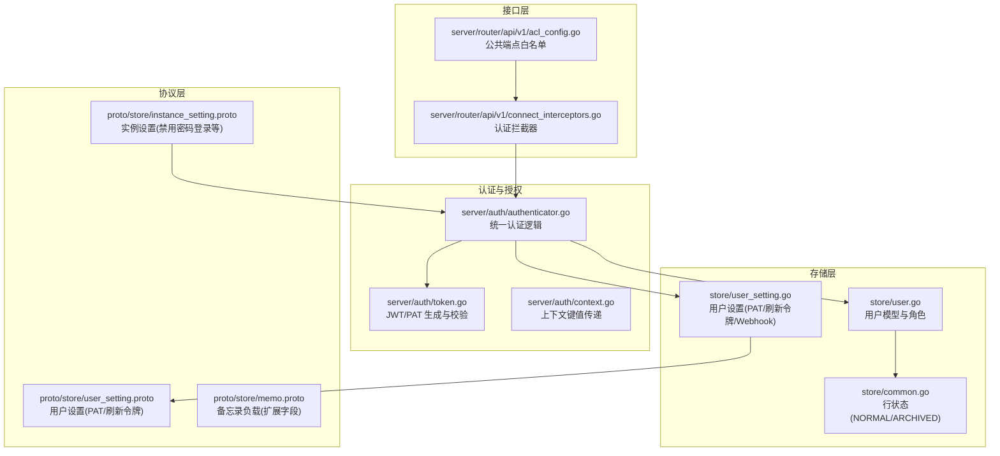
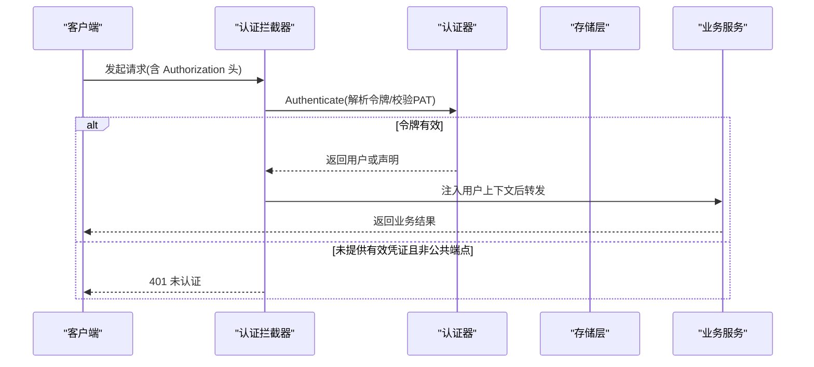
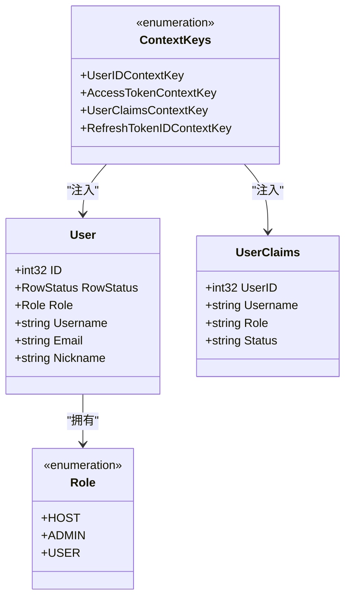
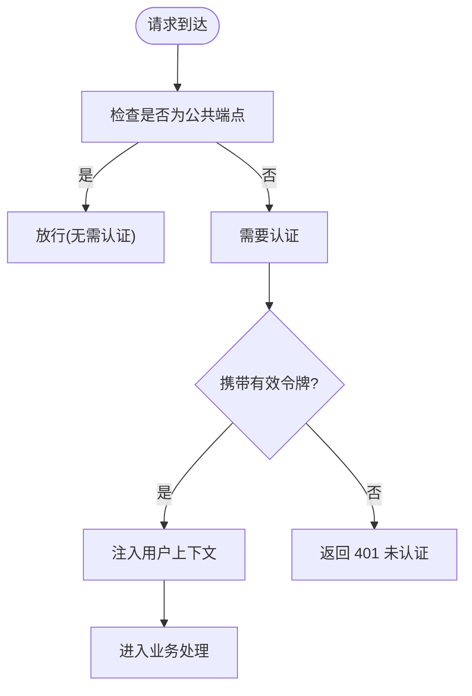
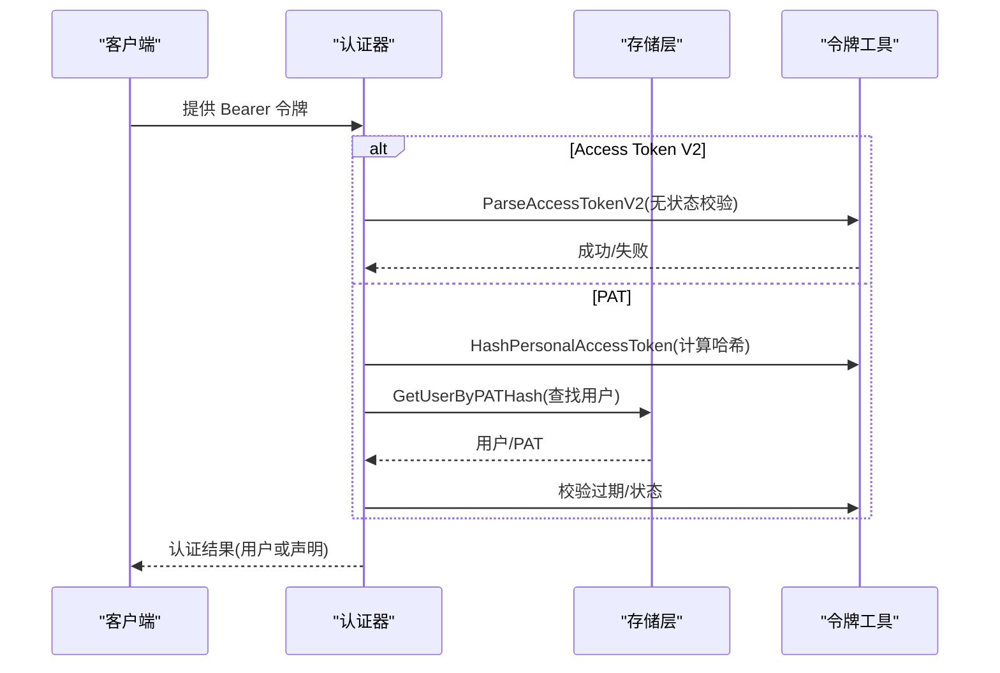
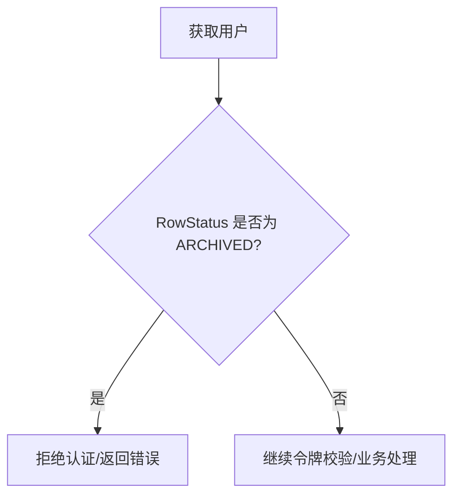
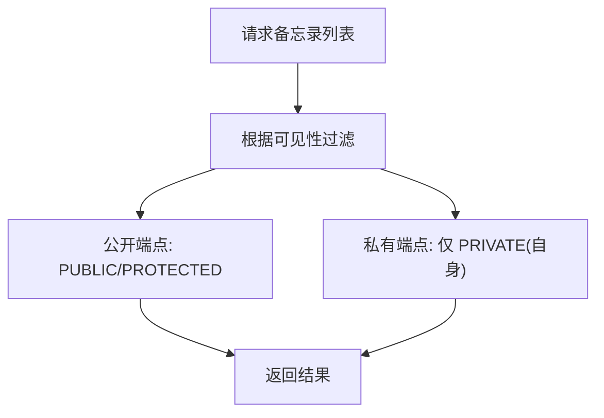
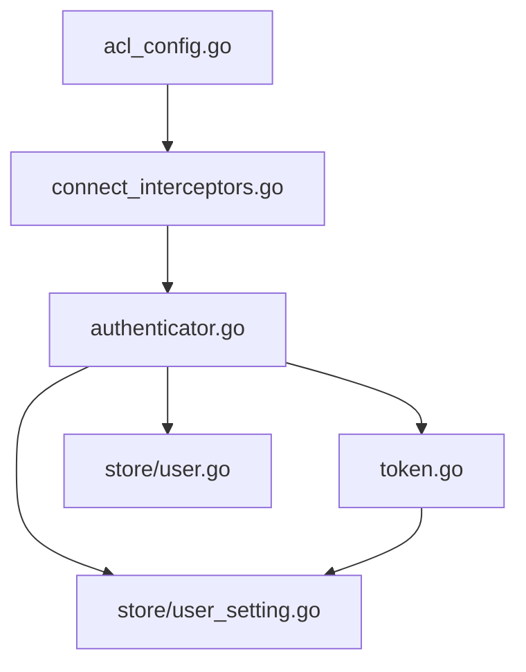

# 权限控制系统

<cite>
**本文档引用的文件**
- [store/user.go](file://store/user.go)
- [server/auth/context.go](file://server/auth/context.go)
- [server/auth/token.go](file://server/auth/token.go)
- [server/auth/authenticator.go](file://server/auth/authenticator.go)
- [server/router/api/v1/acl_config.go](file://server/router/api/v1/acl_config.go)
- [server/router/api/v1/connect_interceptors.go](file://server/router/api/v1/connect_interceptors.go)
- [store/user_setting.go](file://store/user_setting.go)
- [store/common.go](file://store/common.go)
- [proto/store/instance_setting.proto](file://proto/store/instance_setting.proto)
- [proto/store/user_setting.proto](file://proto/store/user_setting.proto)
- [proto/store/memo.proto](file://proto/store/memo.proto)
- [server/router/api/v1/auth_service.go](file://server/router/api/v1/auth_service.go)
- [server/router/api/v1/user_service.go](file://server/router/api/v1/user_service.go)
- [web/src/utils/user.ts](file://web/src/utils/user.ts)
</cite>

## 目录
1. [简介](#简介)
2. [项目结构](#项目结构)
3. [核心组件](#核心组件)
4. [架构总览](#架构总览)
5. [详细组件分析](#详细组件分析)
6. [依赖关系分析](#依赖关系分析)
7. [性能考量](#性能考量)
8. [故障排查指南](#故障排查指南)
9. [结论](#结论)
10. [附录](#附录)

## 简介
本文件系统性梳理权限控制体系，覆盖基于角色的访问控制（RBAC）架构、ACL（访问控制列表）配置机制、用户状态与账户生命周期管理、以及多租户/实例级权限隔离策略。文档同时提供最佳实践与常见问题解决方案，帮助开发者与运维人员快速理解并正确使用权限控制能力。

## 项目结构
权限控制相关代码主要分布在以下模块：
- 存储层：用户模型、用户设置、通用行状态等
- 认证与授权：令牌生成与解析、拦截器、上下文传递
- 接口层：ACL 白名单、连接拦截器、服务端点
- 协议层：实例设置、用户设置、备忘录可见性等

**图表来源**
- [server/router/api/v1/acl_config.go](file://server/router/api/v1/acl_config.go#L1-L43)
- [server/router/api/v1/connect_interceptors.go](file://server/router/api/v1/connect_interceptors.go#L201-L275)
- [server/auth/authenticator.go](file://server/auth/authenticator.go#L17-L166)
- [server/auth/token.go](file://server/auth/token.go#L1-L250)
- [store/user.go](file://store/user.go#L1-L162)
- [store/user_setting.go](file://store/user_setting.go#L1-L487)
- [store/common.go](file://store/common.go#L12-L25)
- [proto/store/instance_setting.proto](file://proto/store/instance_setting.proto#L1-L106)
- [proto/store/user_setting.proto](file://proto/store/user_setting.proto#L1-L114)
- [proto/store/memo.proto](file://proto/store/memo.proto#L1-L28)

**章节来源**
- [server/router/api/v1/acl_config.go](file://server/router/api/v1/acl_config.go#L1-L43)
- [server/router/api/v1/connect_interceptors.go](file://server/router/api/v1/connect_interceptors.go#L201-L275)
- [server/auth/authenticator.go](file://server/auth/authenticator.go#L17-L166)
- [server/auth/token.go](file://server/auth/token.go#L1-L250)
- [store/user.go](file://store/user.go#L1-L162)
- [store/user_setting.go](file://store/user_setting.go#L1-L487)
- [store/common.go](file://store/common.go#L12-L25)
- [proto/store/instance_setting.proto](file://proto/store/instance_setting.proto#L1-L106)
- [proto/store/user_setting.proto](file://proto/store/user_setting.proto#L1-L114)
- [proto/store/memo.proto](file://proto/store/memo.proto#L1-L28)

## 核心组件
- 角色与用户状态
  - 用户角色：HOST、ADMIN、USER；系统机器人角色为 ADMIN
  - 行状态：NORMAL、ARCHIVED，用于软删除与账户生命周期控制
- 令牌体系
  - 短期访问令牌（Access Token V2）：无状态校验，包含用户角色与状态
  - 刷新令牌（Refresh Token）：长期有效，数据库校验撤销与过期
  - 个人访问令牌（PAT）：程序化访问，持久化存储哈希并支持过期与最后使用时间
- ACL 白名单
  - 公共端点清单，Connect 与 gRPC-Gateway 拦截器共同使用
- 实例与用户设置
  - 实例设置：禁用密码登录、禁用用户名/昵称修改等
  - 用户设置：刷新令牌、PAT、Webhook 等

**章节来源**
- [store/user.go](file://store/user.go#L10-L42)
- [store/common.go](file://store/common.go#L12-L25)
- [server/auth/token.go](file://server/auth/token.go#L25-L86)
- [server/auth/authenticator.go](file://server/auth/authenticator.go#L26-L131)
- [server/router/api/v1/acl_config.go](file://server/router/api/v1/acl_config.go#L3-L42)
- [proto/store/instance_setting.proto](file://proto/store/instance_setting.proto#L36-L55)
- [proto/store/user_setting.proto](file://proto/store/user_setting.proto#L46-L92)

## 架构总览
整体流程：客户端请求经由 Connect 拦截器进行认证与上下文注入，随后进入业务服务处理；RBAC 在服务层通过用户角色与实例设置进行授权判断。

**图表来源**
- [server/router/api/v1/connect_interceptors.go](file://server/router/api/v1/connect_interceptors.go#L216-L242)
- [server/auth/authenticator.go](file://server/auth/authenticator.go#L133-L165)
- [server/auth/context.go](file://server/auth/context.go#L48-L61)

**章节来源**
- [server/router/api/v1/connect_interceptors.go](file://server/router/api/v1/connect_interceptors.go#L201-L275)
- [server/auth/authenticator.go](file://server/auth/authenticator.go#L17-L166)
- [server/auth/context.go](file://server/auth/context.go#L1-L84)

## 详细组件分析

### RBAC 架构与角色模型
- 角色定义与系统机器人
  - 角色枚举包含 HOST、ADMIN、USER；系统机器人以 ADMIN 角色存在
- 上下文传递
  - 通过自定义上下文键值在拦截器中注入用户 ID、访问令牌与声明
- 前端辅助判断
  - 超级用户判定基于角色（ADMIN 或 HOST）

**图表来源**
- [store/user.go](file://store/user.go#L44-L60)
- [store/user.go](file://store/user.go#L10-L17)
- [server/auth/context.go](file://server/auth/context.go#L9-L28)
- [server/auth/context.go](file://server/auth/context.go#L63-L83)

**章节来源**
- [store/user.go](file://store/user.go#L10-L60)
- [server/auth/context.go](file://server/auth/context.go#L1-L84)
- [web/src/utils/user.ts](file://web/src/utils/user.ts#L1-L5)

### ACL 配置与公共端点白名单
- 公共端点清单
  - 登录、实例信息、公开用户资料、SSO 列表、公开备忘录等
- 拦截器策略
  - Connect 与 gRPC-Gateway 使用同一白名单映射，非公共端点强制要求有效会话或访问令牌
- 可维护性
  - 白名单为“单一真相源”，便于集中治理与审计

**图表来源**
- [server/router/api/v1/acl_config.go](file://server/router/api/v1/acl_config.go#L3-L42)
- [server/router/api/v1/connect_interceptors.go](file://server/router/api/v1/connect_interceptors.go#L216-L242)

**章节来源**
- [server/router/api/v1/acl_config.go](file://server/router/api/v1/acl_config.go#L1-L43)
- [server/router/api/v1/connect_interceptors.go](file://server/router/api/v1/connect_interceptors.go#L201-L275)

### 令牌生成、解析与校验
- 访问令牌（V2）
  - 无状态签发，包含用户角色与状态，按固定时长过期
- 刷新令牌
  - 数据库存活校验，支持撤销与过期检查
- 个人访问令牌（PAT）
  - 以哈希形式持久化，支持过期与最后使用时间更新
- 关键常量
  - 签发者、密钥标识、受众、有效期等

**图表来源**
- [server/auth/authenticator.go](file://server/auth/authenticator.go#L133-L165)
- [server/auth/token.go](file://server/auth/token.go#L133-L250)
- [store/user_setting.go](file://store/user_setting.go#L105-L123)

**章节来源**
- [server/auth/token.go](file://server/auth/token.go#L25-L250)
- [server/auth/authenticator.go](file://server/auth/authenticator.go#L17-L166)
- [store/user_setting.go](file://store/user_setting.go#L105-L123)

### 用户状态管理与账户生命周期
- 行状态
  - NORMAL：正常账户
  - ARCHIVED：归档/冻结账户，影响登录与刷新令牌校验
- 生命周期控制
  - 归档账户无法通过认证；刷新令牌与 PAT 校验均会拒绝归档状态
- 实例级限制
  - 实例设置可禁用密码登录，强制使用 SSO；同时可限制用户名/昵称修改

**图表来源**
- [store/common.go](file://store/common.go#L12-L25)
- [server/auth/authenticator.go](file://server/auth/authenticator.go#L94-L96)
- [server/router/api/v1/auth_service.go](file://server/router/api/v1/auth_service.go#L82-L89)

**章节来源**
- [store/common.go](file://store/common.go#L12-L25)
- [server/auth/authenticator.go](file://server/auth/authenticator.go#L94-L96)
- [server/router/api/v1/auth_service.go](file://server/router/api/v1/auth_service.go#L67-L92)

### 多租户与实例级权限控制
- 实例级开关
  - 禁止密码登录、禁止用户名/昵称修改等
- 实例密钥
  - 用于会话与签名密钥管理
- 实例设置与服务集成
  - 认证服务在登录前读取实例设置，按策略拒绝密码登录

**图表来源**
- [proto/store/instance_setting.proto](file://proto/store/instance_setting.proto#L36-L55)
- [server/router/api/v1/auth_service.go](file://server/router/api/v1/auth_service.go#L82-L89)

**章节来源**
- [proto/store/instance_setting.proto](file://proto/store/instance_setting.proto#L1-L106)
- [server/router/api/v1/auth_service.go](file://server/router/api/v1/auth_service.go#L67-L92)

### 资源访问规则与可见性
- 备忘录可见性
  - 支持 PRIVATE、PROTECTED、PUBLIC 三种可见性
  - 前端与协议层均定义了可见性枚举与转换工具
- 服务层过滤
  - 公开端点对可见性进行过滤，确保仅返回符合当前上下文可见范围的数据

**图表来源**
- [proto/store/memo.proto](file://proto/store/memo.proto#L1-L28)
- [web/src/utils/memo.ts](file://web/src/utils/memo.ts#L1-L27)
- [web/src/components/VisibilityIcon.tsx](file://web/src/components/VisibilityIcon.tsx#L1-L28)

**章节来源**
- [proto/store/memo.proto](file://proto/store/memo.proto#L1-L28)
- [web/src/utils/memo.ts](file://web/src/utils/memo.ts#L1-L27)
- [web/src/components/VisibilityIcon.tsx](file://web/src/components/VisibilityIcon.tsx#L1-L28)

## 依赖关系分析
- 组件耦合
  - 拦截器依赖 ACL 白名单与认证器；认证器依赖存储层查询用户与令牌；令牌工具提供签发与解析
- 外部依赖
  - JWT 库用于签名与解析；数据库驱动用于令牌与用户数据存取
- 循环依赖
  - 当前结构清晰，未见循环导入

**图表来源**
- [server/router/api/v1/acl_config.go](file://server/router/api/v1/acl_config.go#L1-L43)
- [server/router/api/v1/connect_interceptors.go](file://server/router/api/v1/connect_interceptors.go#L201-L275)
- [server/auth/authenticator.go](file://server/auth/authenticator.go#L17-L166)
- [server/auth/token.go](file://server/auth/token.go#L1-L250)
- [store/user_setting.go](file://store/user_setting.go#L1-L487)
- [store/user.go](file://store/user.go#L1-L162)

**章节来源**
- [server/router/api/v1/acl_config.go](file://server/router/api/v1/acl_config.go#L1-L43)
- [server/router/api/v1/connect_interceptors.go](file://server/router/api/v1/connect_interceptors.go#L201-L275)
- [server/auth/authenticator.go](file://server/auth/authenticator.go#L17-L166)
- [server/auth/token.go](file://server/auth/token.go#L1-L250)
- [store/user_setting.go](file://store/user_setting.go#L1-L487)
- [store/user.go](file://store/user.go#L1-L162)

## 性能考量
- 无状态访问令牌
  - 解析仅依赖密钥与签名验证，避免数据库查询，降低延迟
- 令牌缓存与异步更新
  - PAT 最后使用时间更新采用异步方式，避免阻塞主流程
- 日志与可观测性
  - 拦截器内置日志分级与异常恢复，有助于定位性能瓶颈与错误

[本节为通用指导，不直接分析具体文件]

## 故障排查指南
- 401 未认证
  - 检查请求头 Authorization 是否携带有效 Bearer 令牌；确认端点是否在公共白名单
- 刷新令牌无效
  - 核对令牌是否撤销、是否过期、用户状态是否为归档
- PAT 过期或被撤销
  - 检查用户设置中的 PAT 列表与过期时间；确认用户状态
- 密码登录被拒
  - 检查实例设置是否禁用了密码登录；必要时切换为 SSO 登录

**章节来源**
- [server/router/api/v1/connect_interceptors.go](file://server/router/api/v1/connect_interceptors.go#L216-L242)
- [server/auth/authenticator.go](file://server/auth/authenticator.go#L60-L99)
- [store/user_setting.go](file://store/user_setting.go#L101-L123)
- [server/router/api/v1/auth_service.go](file://server/router/api/v1/auth_service.go#L82-L89)

## 结论
该权限控制系统以 RBAC 为核心，结合 ACL 白名单、多形态令牌与实例级设置，实现了从接入层到业务层的全链路安全控制。通过明确的角色定义、严格的令牌校验与灵活的可见性规则，系统在保证安全性的同时兼顾易用性与可维护性。建议在生产环境中配合审计日志与最小权限原则，持续优化权限策略与用户体验。

[本节为总结性内容，不直接分析具体文件]

## 附录

### 最佳实践
- 令牌管理
  - 定期轮换签名密钥；限制刷新令牌数量；启用 PAT 过期策略
- 端点治理
  - 将所有公共端点纳入白名单并定期审查；非公共端点一律强制认证
- 用户生命周期
  - 对离职或违规用户及时归档；定期清理过期 PAT 与刷新令牌
- 可见性策略
  - 默认使用更严格可见性；仅在确需时提升至 PROTECTED 或 PUBLIC

[本节为通用指导，不直接分析具体文件]