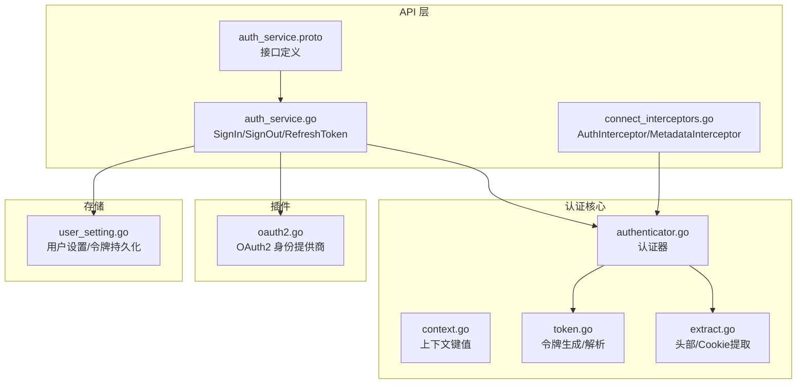
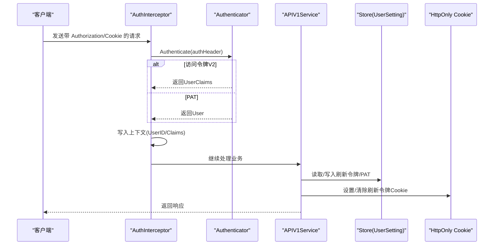
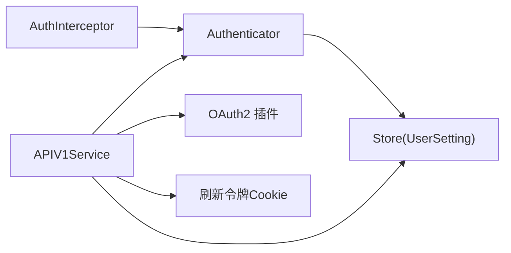
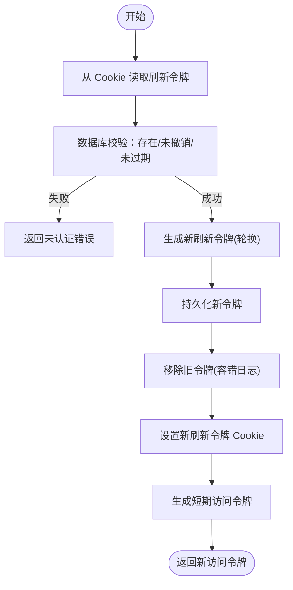

# 用户认证流程

<cite>
**本文引用的文件**
- [authenticator.go](file://server/auth/authenticator.go)
- [context.go](file://server/auth/context.go)
- [token.go](file://server/auth/token.go)
- [extract.go](file://server/auth/extract.go)
- [auth_service.proto](file://proto/api/v1/auth_service.proto)
- [auth_service.go](file://server/router/api/v1/auth_service.go)
- [connect_interceptors.go](file://server/router/api/v1/connect_interceptors.go)
- [oauth2.go](file://plugin/idp/oauth2/oauth2.go)
- [user_setting.go](file://store/user_setting.go)
- [auth_service_client_info_test.go](file://server/router/api/v1/auth_service_client_info_test.go)
</cite>

## 目录
1. [简介](#简介)
2. [项目结构](#项目结构)
3. [核心组件](#核心组件)
4. [架构总览](#架构总览)
5. [详细组件分析](#详细组件分析)
6. [依赖关系分析](#依赖关系分析)
7. [性能考量](#性能考量)
8. [故障排查指南](#故障排查指南)
9. [结论](#结论)
10. [附录](#附录)

## 简介
本文件系统性梳理了系统的用户认证与授权机制，覆盖以下主题：
- JWT 令牌生成、验证与刷新（短期访问令牌、长期刷新令牌）
- 认证上下文的建立与管理（用户ID、访问令牌、用户声明）
- 多种认证方式：密码认证、OAuth2/SSO、个人访问令牌（PAT）
- 会话管理与令牌生命周期控制（滑动窗口、轮换策略）
- 安全防护与错误处理
- 认证中间件实现与调试方法

## 项目结构
认证相关代码主要分布在以下模块：
- 令牌与认证逻辑：server/auth
- API 层认证与会话：server/router/api/v1
- 身份提供商插件：plugin/idp/oauth2
- 存储层用户设置与令牌持久化：store/user_setting.go
- 协议定义：proto/api/v1/auth_service.proto

图表来源
- [authenticator.go](file://server/auth/authenticator.go#L1-L166)
- [context.go](file://server/auth/context.go#L1-L84)
- [token.go](file://server/auth/token.go#L1-L250)
- [extract.go](file://server/auth/extract.go#L1-L34)
- [auth_service.go](file://server/router/api/v1/auth_service.go#L1-L613)
- [connect_interceptors.go](file://server/router/api/v1/connect_interceptors.go#L1-L275)
- [auth_service.proto](file://proto/api/v1/auth_service.proto#L1-L115)
- [oauth2.go](file://plugin/idp/oauth2/oauth2.go#L1-L135)
- [user_setting.go](file://store/user_setting.go#L1-L200)

章节来源
- [authenticator.go](file://server/auth/authenticator.go#L1-L166)
- [context.go](file://server/auth/context.go#L1-L84)
- [token.go](file://server/auth/token.go#L1-L250)
- [extract.go](file://server/auth/extract.go#L1-L34)
- [auth_service.go](file://server/router/api/v1/auth_service.go#L1-L613)
- [connect_interceptors.go](file://server/router/api/v1/connect_interceptors.go#L1-L275)
- [auth_service.proto](file://proto/api/v1/auth_service.proto#L1-L115)
- [oauth2.go](file://plugin/idp/oauth2/oauth2.go#L1-L135)
- [user_setting.go](file://store/user_setting.go#L1-L200)

## 核心组件
- 认证器（Authenticator）：统一处理访问令牌、刷新令牌与 PAT 的认证与校验，支持无状态访问令牌与有状态刷新令牌。
- 上下文工具（context.go）：定义并提供从 context 中读取/写入用户ID、访问令牌、用户声明的方法。
- 令牌工具（token.go）：生成短期访问令牌、长期刷新令牌与 PAT；解析并验证各类 JWT；定义令牌常量与声明结构。
- 提取工具（extract.go）：从 Authorization 头或 Cookie 中提取令牌。
- API 层（auth_service.go）：实现 SignIn/SignOut/RefreshToken；构建会话、设置 HttpOnly Cookie；集成 OAuth2/SSO。
- 连接拦截器（connect_interceptors.go）：将 HTTP 头转换为 gRPC 元数据，注入认证上下文。
- 插件（oauth2.go）：封装 OAuth2 授权码交换与用户信息获取。
- 存储（user_setting.go）：维护用户刷新令牌与 PAT 列表，支持增删查改与最后使用时间更新。

章节来源
- [authenticator.go](file://server/auth/authenticator.go#L17-L166)
- [context.go](file://server/auth/context.go#L9-L84)
- [token.go](file://server/auth/token.go#L25-L250)
- [extract.go](file://server/auth/extract.go#L8-L34)
- [auth_service.go](file://server/router/api/v1/auth_service.go#L55-L357)
- [connect_interceptors.go](file://server/router/api/v1/connect_interceptors.go#L201-L275)
- [oauth2.go](file://plugin/idp/oauth2/oauth2.go#L19-L135)
- [user_setting.go](file://store/user_setting.go#L105-L200)

## 架构总览
整体认证流程由“请求进入 -> 拦截器认证 -> 服务处理 -> 会话与令牌管理”构成。Connect 层通过 MetadataInterceptor 将必要头信息注入到 gRPC 上下文，AuthInterceptor 执行认证并写入上下文；API 层在 SignIn/RefreshToken 中生成/轮换刷新令牌并设置 Cookie；OAuth2 插件用于 SSO 流程。

图表来源
- [connect_interceptors.go](file://server/router/api/v1/connect_interceptors.go#L216-L242)
- [authenticator.go](file://server/auth/authenticator.go#L133-L166)
- [auth_service.go](file://server/router/api/v1/auth_service.go#L55-L357)
- [user_setting.go](file://store/user_setting.go#L125-L200)

## 详细组件分析

### 令牌生成与验证
- 访问令牌（Access Token V2）
  - 用途：短期 API 访问令牌，无状态验证，签名仅用于完整性校验。
  - 生命周期：默认 15 分钟。
  - 声明：包含用户ID、用户名、角色、状态等。
  - 生成与解析：通过专用函数生成与解析，严格校验签发方、受众与类型。
- 刷新令牌（Refresh Token）
  - 用途：长期令牌，换取新的访问令牌；支持撤销与过期检查。
  - 生命周期：默认 30 天。
  - 存储：数据库中按用户记录存储，支持轮换与删除。
  - 解析：除签名校验外，还需查询数据库确认未被撤销且未过期。
- 个人访问令牌（PAT）
  - 用途：程序化访问（CLI/第三方），可设置过期时间。
  - 存储：仅保存哈希值，原始令牌仅在创建时返回一次。
  - 验证：前缀识别 + 哈希匹配 + 过期与用户状态检查。

章节来源
- [token.go](file://server/auth/token.go#L25-L187)
- [authenticator.go](file://server/auth/authenticator.go#L39-L124)
- [user_setting.go](file://store/user_setting.go#L105-L200)

### 认证上下文与传递
- 上下文键值
  - 用户ID：所有已认证请求均携带。
  - 访问令牌：仅在 Bearer 令牌认证时携带。
  - 用户声明：访问令牌 V2 的无状态声明。
- 获取与设置
  - 提供 GetUserID、GetAccessToken、GetUserClaims 等便捷方法。
  - SetUserInContext/SetUserClaimsInContext 将认证结果写入上下文。

章节来源
- [context.go](file://server/auth/context.go#L9-L84)

### 多种认证方式
- 密码认证
  - 校验用户名存在与密码哈希匹配；支持实例级禁用密码登录限制。
  - 成功后生成访问令牌与刷新令牌，设置 HttpOnly Cookie。
- OAuth2/SSO
  - 通过配置的 OAuth2 提供商交换授权码，获取用户信息映射。
  - 支持可选的 PKCE（code_verifier）增强安全性。
  - 可配置标识符过滤正则表达式，限制允许登录的用户范围。
- 个人访问令牌（PAT）
  - 用户在设置中创建，一次性显示完整令牌字符串。
  - 后续仅以哈希形式存储，支持设置过期时间与描述。

章节来源
- [auth_service.go](file://server/router/api/v1/auth_service.go#L55-L190)
- [oauth2.go](file://plugin/idp/oauth2/oauth2.go#L43-L78)
- [auth_service.go](file://server/router/api/v1/auth_service.go#L569-L635)

### 会话管理与令牌生命周期
- 登录（SignIn）
  - 生成刷新令牌（30天），持久化到用户设置。
  - 设置 HttpOnly Cookie（memos_refresh）。
  - 生成访问令牌（15分钟）返回给客户端。
- 刷新（RefreshToken）
  - 从 Cookie 读取刷新令牌，数据库校验有效性与撤销状态。
  - 实施“刷新令牌轮换”：生成新刷新令牌，旧令牌移除，新 Cookie 设置。
  - 生成新的短期访问令牌返回。
- 注销（SignOut）
  - 清理刷新令牌 Cookie，并尝试撤销对应刷新令牌。
- PAT 使用
  - 仅在首次创建时返回完整令牌；后续仅以哈希校验。
  - 后台异步更新“最近使用时间”。

章节来源
- [auth_service.go](file://server/router/api/v1/auth_service.go#L192-L238)
- [auth_service.go](file://server/router/api/v1/auth_service.go#L272-L357)
- [auth_service.go](file://server/router/api/v1/auth_service.go#L240-L270)
- [user_setting.go](file://store/user_setting.go#L140-L185)
- [authenticator.go](file://server/auth/authenticator.go#L101-L124)

### 认证中间件实现
- MetadataInterceptor
  - 将 User-Agent、X-Forwarded-For、X-Real-Ip、Cookie 等头转换为 gRPC 元数据，便于服务层提取客户端信息与 Cookie。
- AuthInterceptor
  - 从 Authorization 头提取 Bearer 令牌，优先尝试访问令牌 V2，再尝试 PAT。
  - 对非公开方法强制要求认证；认证成功后写入上下文（用户ID/声明或完整用户对象）。
- 公开方法白名单
  - 通过 IsPublicMethod 判断是否需要认证（如 SignIn/RefreshToken/SignOut 在协议中定义为公开）。

章节来源
- [connect_interceptors.go](file://server/router/api/v1/connect_interceptors.go#L19-L87)
- [connect_interceptors.go](file://server/router/api/v1/connect_interceptors.go#L201-L275)

### OAuth2/SSO 流程
- 授权码交换
  - 使用 OAuth2 Config 交换授权码为访问令牌，支持 PKCE。
- 用户信息获取
  - 依据配置的字段映射（标识符/显示名/邮箱/头像）解析用户信息。
- 标识符过滤
  - 支持正则过滤不允许登录的标识符，避免越权。

章节来源
- [oauth2.go](file://plugin/idp/oauth2/oauth2.go#L43-L134)
- [auth_service.go](file://server/router/api/v1/auth_service.go#L91-L171)

### 客户端信息与安全
- 客户端信息提取
  - 从 User-Agent 解析设备类型、操作系统、浏览器版本。
  - 从 X-Forwarded-For/X-Real-Ip 获取 IP 地址。
- Cookie 安全属性
  - HttpOnly、SameSite=Lax；HTTPS 时追加 Secure。
  - 刷新令牌 Cookie 使用固定名称，到期时清空。

章节来源
- [auth_service.go](file://server/router/api/v1/auth_service.go#L420-L455)
- [auth_service.go](file://server/router/api/v1/auth_service.go#L369-L401)
- [auth_service_client_info_test.go](file://server/router/api/v1/auth_service_client_info_test.go#L12-L180)

## 依赖关系分析
- 认证器依赖存储层进行 PAT 与刷新令牌的查询与持久化。
- API 层依赖认证器与存储层完成登录、刷新与注销。
- 连接拦截器依赖认证器与上下文工具，负责将认证结果注入服务层上下文。
- OAuth2 插件为 SSO 提供授权码交换与用户信息解析能力。

图表来源
- [connect_interceptors.go](file://server/router/api/v1/connect_interceptors.go#L201-L275)
- [authenticator.go](file://server/auth/authenticator.go#L1-L166)
- [auth_service.go](file://server/router/api/v1/auth_service.go#L192-L357)
- [user_setting.go](file://store/user_setting.go#L125-L200)
- [oauth2.go](file://plugin/idp/oauth2/oauth2.go#L19-L135)

## 性能考量
- 无状态访问令牌验证：仅做签名与声明校验，避免数据库查询，降低延迟。
- 刷新令牌验证：需查询数据库确认未撤销且未过期，建议缓存用户设置以减少查询压力。
- PAT 验证：仅做哈希匹配与过期检查，避免复杂计算。
- 刷新令牌轮换：新增后再删除，减少并发场景下的竞态风险。
- 日志与异步更新：PAT 最近使用时间更新采用 fire-and-forget 异步方式，避免阻塞主流程。

## 故障排查指南
- 认证失败
  - 未携带有效 Authorization 或 Cookie：检查前端是否正确设置 Bearer 令牌或刷新 Cookie。
  - 访问令牌过期：调用刷新接口获取新令牌。
  - 刷新令牌无效/撤销：确认 Cookie 是否仍有效，或已在其他地方注销。
  - 用户被归档：检查用户状态。
- OAuth2/SSO 失败
  - 授权码交换失败：检查回调地址、PKCE 参数与提供商配置。
  - 用户信息映射缺失：确认字段映射配置与提供商返回字段一致。
  - 标识符被过滤：检查实例设置中的标识符过滤正则。
- 客户端信息异常
  - User-Agent 解析不准确：测试用例覆盖常见 UA，可参考测试用例定位问题。
- Cookie 安全
  - HTTPS 环境下未设置 Secure：确保服务端检测到 HTTPS 并附加 Secure 属性。

章节来源
- [authenticator.go](file://server/auth/authenticator.go#L60-L124)
- [auth_service.go](file://server/router/api/v1/auth_service.go#L272-L357)
- [oauth2.go](file://plugin/idp/oauth2/oauth2.go#L43-L134)
- [auth_service_client_info_test.go](file://server/router/api/v1/auth_service_client_info_test.go#L12-L180)

## 结论
该认证体系通过“短期访问令牌 + 长期刷新令牌 + PAT”的组合，实现了高安全性与良好用户体验的平衡。配合拦截器与上下文管理，确保了跨 gRPC/HTTP 的一致认证行为；通过刷新令牌轮换与撤销机制进一步提升安全性。OAuth2/SSO 与 PAT 的引入满足了多样化使用场景，同时通过严格的声明校验与客户端信息提取增强了可观测性与风控能力。

## 附录
- 关键流程图（刷新令牌轮换）

图表来源
- [auth_service.go](file://server/router/api/v1/auth_service.go#L272-L357)
- [user_setting.go](file://store/user_setting.go#L140-L185)