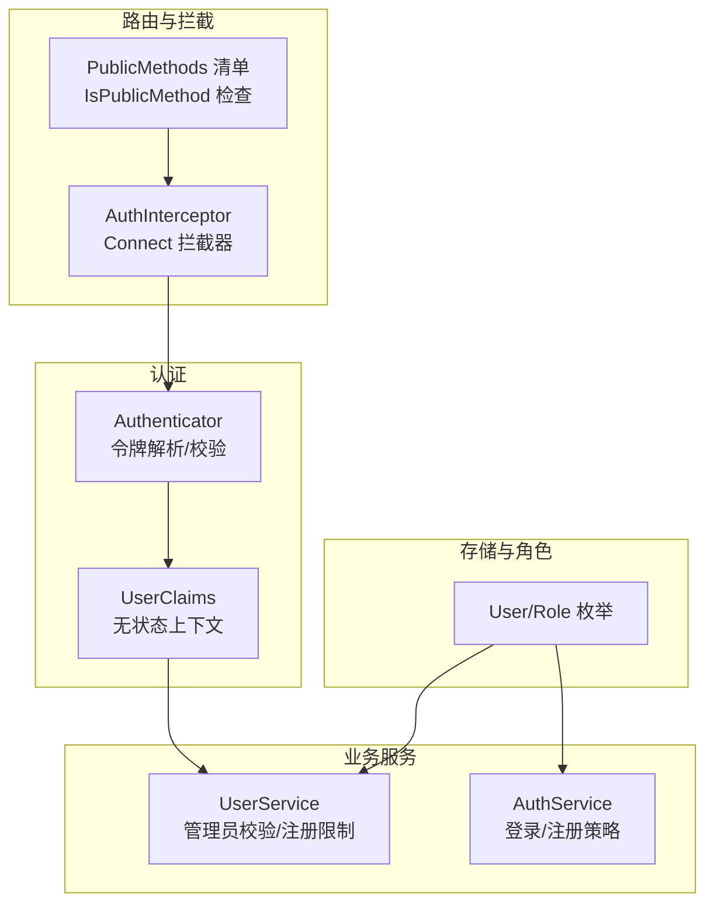
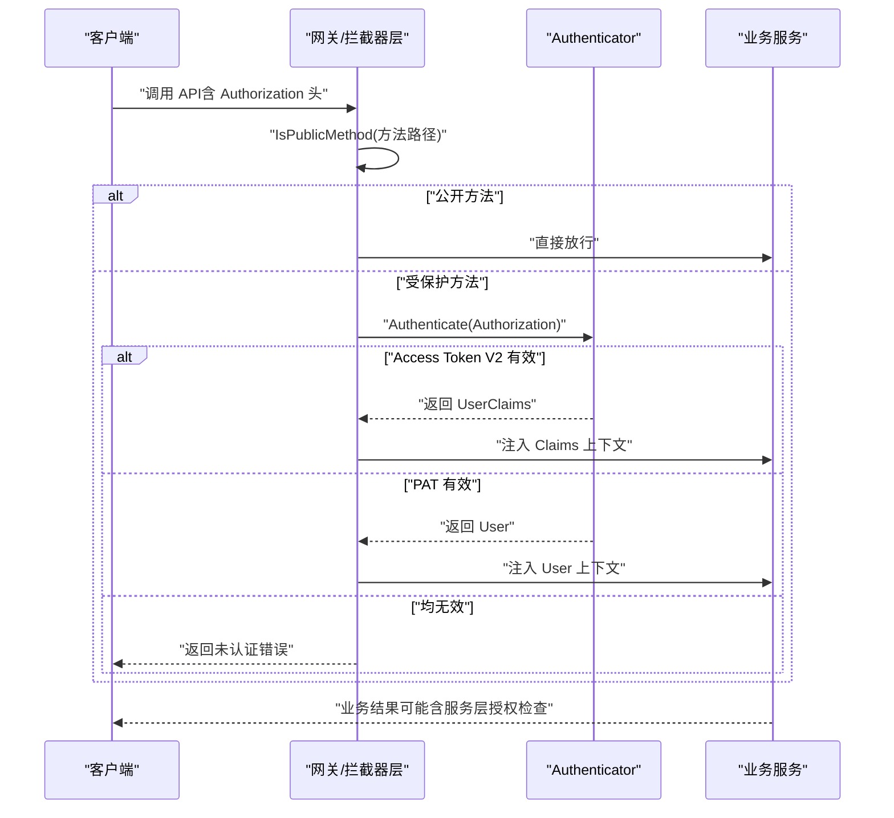
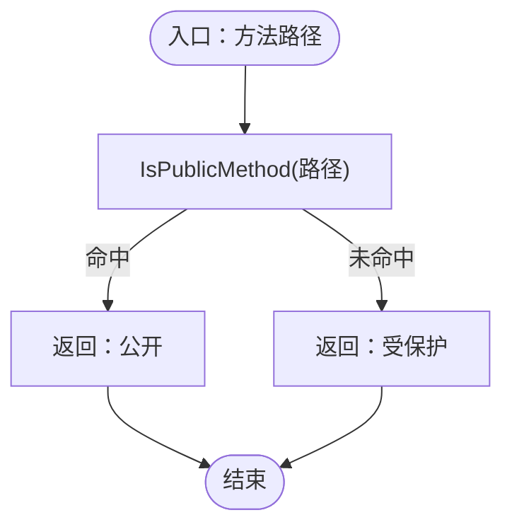
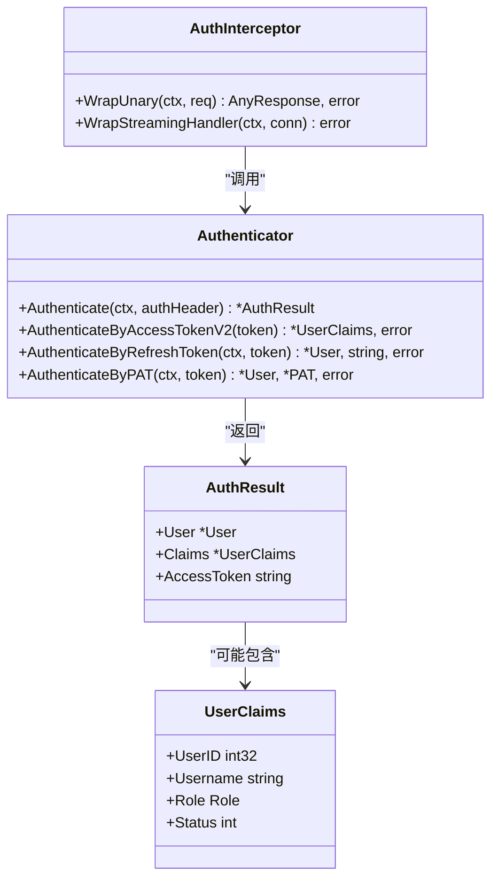
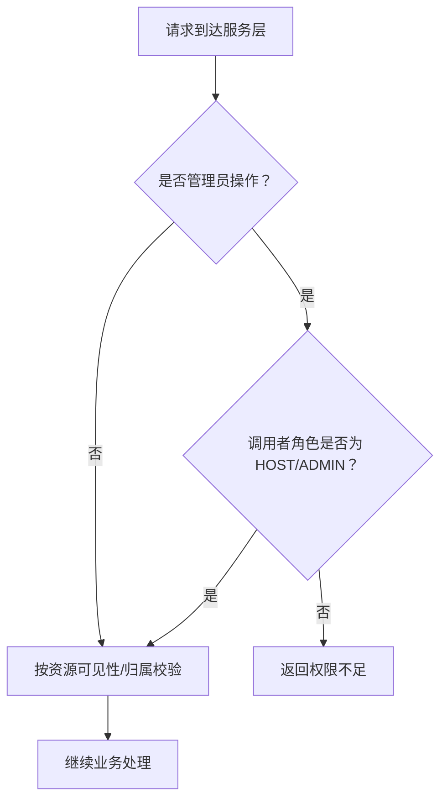
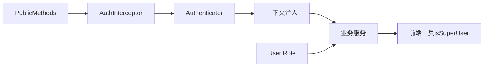

# 访问控制列表配置

<cite>
**本文引用的文件**
- [acl_config.go](file://server/router/api/v1/acl_config.go)
- [acl_config_test.go](file://server/router/api/v1/acl_config_test.go)
- [connect_interceptors.go](file://server/router/api/v1/connect_interceptors.go)
- [authenticator.go](file://server/auth/authenticator.go)
- [user.go](file://store/user.go)
- [user_service.go](file://server/router/api/v1/user_service.go)
- [auth_service.go](file://server/router/api/v1/auth_service.go)
- [user.ts](file://web/src/utils/user.ts)
- [auth-architecture.md](file://web/docs/auth-architecture.md)
</cite>

## 目录
1. [简介](#简介)
2. [项目结构](#项目结构)
3. [核心组件](#核心组件)
4. [架构总览](#架构总览)
5. [详细组件分析](#详细组件分析)
6. [依赖关系分析](#依赖关系分析)
7. [性能考量](#性能考量)
8. [故障排查指南](#故障排查指南)
9. [结论](#结论)
10. [附录](#附录)

## 简介
本文件系统性阐述本仓库中的访问控制列表（ACL）配置体系：从公开端点清单到认证拦截器、从用户角色模型到服务层授权策略，覆盖资源权限绑定、操作权限验证、优先级与继承关系，并提供实际应用场景与最佳实践。

## 项目结构
ACL 配置与实现主要分布在以下模块：
- 路由与拦截层：定义公开端点清单、统一认证拦截器
- 认证与令牌：无状态访问令牌、刷新令牌、个人访问令牌（PAT）
- 存储与角色：用户角色枚举与持久化
- 业务服务：在服务层执行细粒度授权（如管理员校验）

图表来源
- [acl_config.go](file://server/router/api/v1/acl_config.go#L1-L43)
- [connect_interceptors.go](file://server/router/api/v1/connect_interceptors.go#L201-L274)
- [authenticator.go](file://server/auth/authenticator.go#L17-L166)
- [user.go](file://store/user.go#L7-L28)
- [user_service.go](file://server/router/api/v1/user_service.go#L118-L151)
- [auth_service.go](file://server/router/api/v1/auth_service.go#L67-L92)

章节来源
- [acl_config.go](file://server/router/api/v1/acl_config.go#L1-L43)
- [connect_interceptors.go](file://server/router/api/v1/connect_interceptors.go#L201-L274)
- [authenticator.go](file://server/auth/authenticator.go#L17-L166)
- [user.go](file://store/user.go#L7-L28)
- [user_service.go](file://server/router/api/v1/user_service.go#L118-L151)
- [auth_service.go](file://server/router/api/v1/auth_service.go#L67-L92)

## 核心组件
- 公开端点清单与判定
  - PublicMethods：集中维护无需认证即可访问的 gRPC/HTTP 方法路径
  - IsPublicMethod：基于路径快速判定是否为公开方法
- 认证拦截器
  - AuthInterceptor：在非公开方法上强制要求有效凭据；支持 Access Token V2 与 PAT
  - MetadataInterceptor：透传客户端信息头，确保服务层可获取请求来源信息
- 认证器
  - Authenticator：解析与校验短时访问令牌、刷新令牌、PAT；返回用户或声明上下文
- 用户与角色
  - Role 枚举：HOST、ADMIN、USER；用于服务层授权判断
  - isSuperUser 工具：前端辅助判断超级用户角色

章节来源
- [acl_config.go](file://server/router/api/v1/acl_config.go#L3-L42)
- [connect_interceptors.go](file://server/router/api/v1/connect_interceptors.go#L201-L274)
- [authenticator.go](file://server/auth/authenticator.go#L17-L166)
- [user.go](file://store/user.go#L7-L28)
- [user.ts](file://web/src/utils/user.ts#L1-L5)

## 架构总览
ACL 的整体流程如下：
- 请求进入后，拦截器根据 PublicMethods 判定是否需要认证
- 若需认证，使用 Authenticator 解析 Authorization 头，优先尝试无状态访问令牌，再尝试 PAT
- 将用户或声明注入上下文，后续服务层进行业务授权（如管理员校验）

图表来源
- [acl_config.go](file://server/router/api/v1/acl_config.go#L37-L42)
- [connect_interceptors.go](file://server/router/api/v1/connect_interceptors.go#L216-L241)
- [authenticator.go](file://server/auth/authenticator.go#L133-L165)

## 详细组件分析

### 组件A：公开端点清单与判定
- 数据结构
  - PublicMethods：字符串到空结构体的映射，键为完整 gRPC 方法路径
  - IsPublicMethod：O(1) 查找，返回布尔值
- 存储机制
  - 单一真相源：所有拦截器与网关共享同一映射表
  - 路径格式：遵循 Connect/gRPC 规范的全限定过程名
- 验证与测试
  - 单元测试覆盖公开与受保护方法，以及未知方法默认需要认证的行为

图表来源
- [acl_config.go](file://server/router/api/v1/acl_config.go#L37-L42)
- [acl_config_test.go](file://server/router/api/v1/acl_config_test.go#L9-L88)

章节来源
- [acl_config.go](file://server/router/api/v1/acl_config.go#L3-L42)
- [acl_config_test.go](file://server/router/api/v1/acl_config_test.go#L9-L88)

### 组件B：认证拦截器与令牌解析
- 认证流程
  - 提取 Authorization 头，优先尝试无状态访问令牌（Access Token V2）
  - 若失败且以特定前缀开头，则尝试 PAT
  - 将用户或声明写入上下文，非公开方法若无有效凭据则拒绝
- 令牌类型
  - Access Token V2：无状态，仅包含用户声明
  - 刷新令牌：数据库侧校验（存在性、过期、用户状态）
  - PAT：带前缀的长期令牌，哈希存储于数据库

图表来源
- [connect_interceptors.go](file://server/router/api/v1/connect_interceptors.go#L201-L274)
- [authenticator.go](file://server/auth/authenticator.go#L17-L166)

章节来源
- [connect_interceptors.go](file://server/router/api/v1/connect_interceptors.go#L201-L274)
- [authenticator.go](file://server/auth/authenticator.go#L17-L166)

### 组件C：用户角色与服务层授权
- 角色模型
  - Role 枚举：HOST > ADMIN > USER
  - isSuperUser：前端工具函数，判断 HOST 或 ADMIN
- 服务层授权示例
  - 用户注册：首次用户自动成为 HOST；否则需具备 HOST 或 ADMIN 权限
  - 登录策略：实例设置可禁止普通用户的密码登录
  - 管理员校验：部分管理操作仅 HOST/ADMIN 可执行

图表来源
- [user.go](file://store/user.go#L7-L28)
- [user.ts](file://web/src/utils/user.ts#L1-L5)
- [user_service.go](file://server/router/api/v1/user_service.go#L118-L151)
- [auth_service.go](file://server/router/api/v1/auth_service.go#L67-L92)

章节来源
- [user.go](file://store/user.go#L7-L28)
- [user.ts](file://web/src/utils/user.ts#L1-L5)
- [user_service.go](file://server/router/api/v1/user_service.go#L118-L151)
- [auth_service.go](file://server/router/api/v1/auth_service.go#L67-L92)

### 组件D：资源权限绑定与操作验证
- 资源权限绑定
  - 用户与资源：服务层通过上下文中的用户身份与资源归属进行绑定
  - 用户组：当前代码未见“用户组”实体；可通过资源拥有者/可见性策略模拟
  - 资源类型：以服务/资源名称抽象（如 Memo、Attachment、User 等）
- 操作权限验证
  - 读取：通常仅需认证；公开资源可匿名访问（由服务层过滤）
  - 写入：需具备相应角色或资源所有权
  - 删除：通常要求管理员或资源拥有者
- 实际应用
  - 用户管理：仅 HOST/ADMIN 可变更他人角色
  - 注册限制：受实例设置与调用者角色影响
  - 登录限制：可禁止普通用户的密码登录

章节来源
- [user_service.go](file://server/router/api/v1/user_service.go#L118-L151)
- [auth_service.go](file://server/router/api/v1/auth_service.go#L67-L92)

### 组件E：ACL 规则优先级与继承
- 优先级
  - 公开端点优先：PublicMethods 优先于认证拦截器
  - 认证优先：非公开方法必须通过 Authenticator 校验
  - 服务层授权优先：即使已认证，仍需满足业务授权条件
- 继承关系
  - 角色继承：HOST > ADMIN > USER，权限逐级递减
  - 资源继承：当前未实现显式“用户组”，可通过资源拥有者与可见性策略实现继承式访问控制

章节来源
- [acl_config.go](file://server/router/api/v1/acl_config.go#L3-L42)
- [connect_interceptors.go](file://server/router/api/v1/connect_interceptors.go#L223-L226)
- [user.go](file://store/user.go#L7-L28)

## 依赖关系分析
- 拦截器依赖公开端点清单进行判定
- 认证器为拦截器提供凭据解析能力
- 服务层依赖存储中的用户角色与实例设置进行授权决策
- 前端工具函数用于简化角色判断

图表来源
- [acl_config.go](file://server/router/api/v1/acl_config.go#L3-L42)
- [connect_interceptors.go](file://server/router/api/v1/connect_interceptors.go#L201-L274)
- [authenticator.go](file://server/auth/authenticator.go#L17-L166)
- [user.go](file://store/user.go#L7-L28)
- [user.ts](file://web/src/utils/user.ts#L1-L5)

章节来源
- [acl_config.go](file://server/router/api/v1/acl_config.go#L3-L42)
- [connect_interceptors.go](file://server/router/api/v1/connect_interceptors.go#L201-L274)
- [authenticator.go](file://server/auth/authenticator.go#L17-L166)
- [user.go](file://store/user.go#L7-L28)
- [user.ts](file://web/src/utils/user.ts#L1-L5)

## 性能考量
- 公开端点判定为 O(1) 哈希查找，成本极低
- 认证拦截器仅在受保护方法上执行，避免对公开接口的额外开销
- Access Token V2 无状态解析，减少数据库查询
- PAT 使用哈希匹配，建议在数据库中建立索引以提升查找效率

## 故障排查指南
- 问题：未知方法被误判为公开
  - 排查：确认方法路径是否符合规范；检查 PublicMethods 是否遗漏
- 问题：受保护方法返回未认证
  - 排查：确认 Authorization 头格式正确；检查 Access Token V2/PAT 是否有效；核对刷新令牌是否撤销或过期
- 问题：管理员操作被拒绝
  - 排查：确认调用者角色是否为 HOST/ADMIN；检查实例设置与业务逻辑限制

章节来源
- [acl_config_test.go](file://server/router/api/v1/acl_config_test.go#L74-L88)
- [connect_interceptors.go](file://server/router/api/v1/connect_interceptors.go#L223-L226)
- [authenticator.go](file://server/auth/authenticator.go#L133-L165)

## 结论
本 ACL 配置体系以“公开端点清单 + 统一认证拦截器 + 服务层授权”为核心，结合角色模型与令牌机制，实现了清晰、可扩展的访问控制。通过单一真相源与明确的优先级，既保证了易维护性，也兼顾了性能与安全性。

## 附录

### 实际应用场景与配置示例
- 场景一：首次部署
  - 行为：首个用户创建为 HOST，不受注册限制
  - 配置：无需额外 ACL 设置，系统自动处理
- 场景二：禁用普通用户密码登录
  - 行为：实例设置禁止普通用户密码登录，HOST/ADMIN 可正常登录
  - 配置：在实例设置中开启对应开关
- 场景三：管理员批量管理用户
  - 行为：HOST/ADMIN 可调整他人角色；普通用户仅能创建 USER 角色
  - 配置：通过服务层授权策略实现

章节来源
- [user_service.go](file://server/router/api/v1/user_service.go#L118-L151)
- [auth_service.go](file://server/router/api/v1/auth_service.go#L67-L92)

### 权限冲突处理与继承最佳实践
- 冲突处理
  - 明确优先级：公开端点 > 认证拦截器 > 服务层授权
  - 对未知方法默认要求认证，避免安全漏洞
- 继承最佳实践
  - 角色继承：利用 HOST > ADMIN > USER 的层级关系，尽量将通用权限赋予更高角色
  - 资源继承：通过资源拥有者与可见性策略模拟“用户组”继承，减少重复授权逻辑

章节来源
- [acl_config.go](file://server/router/api/v1/acl_config.go#L3-L42)
- [user.go](file://store/user.go#L7-L28)