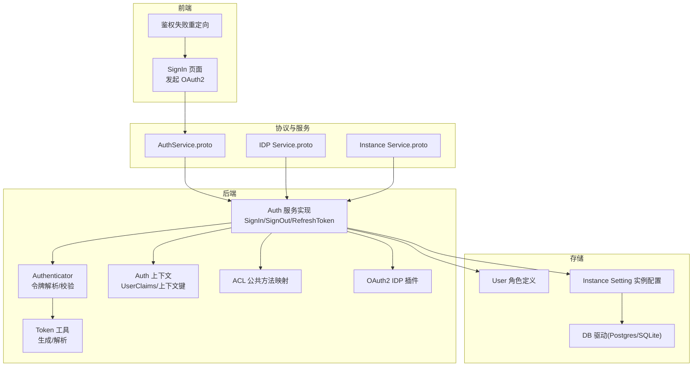
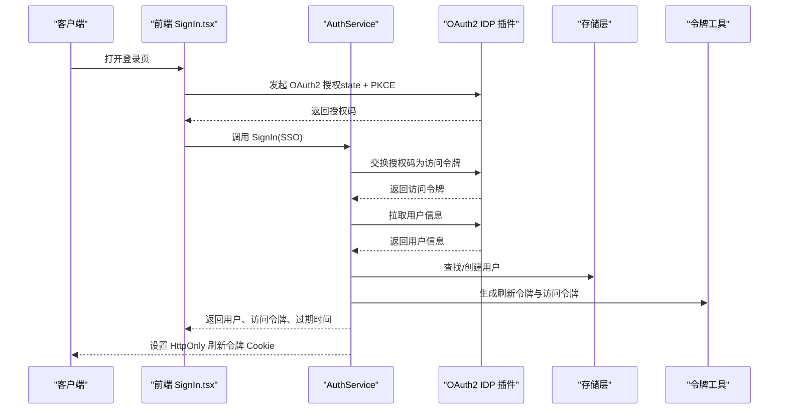
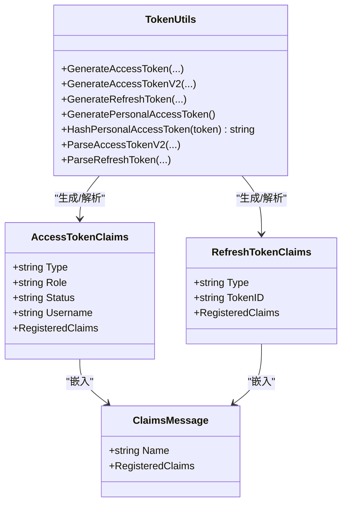
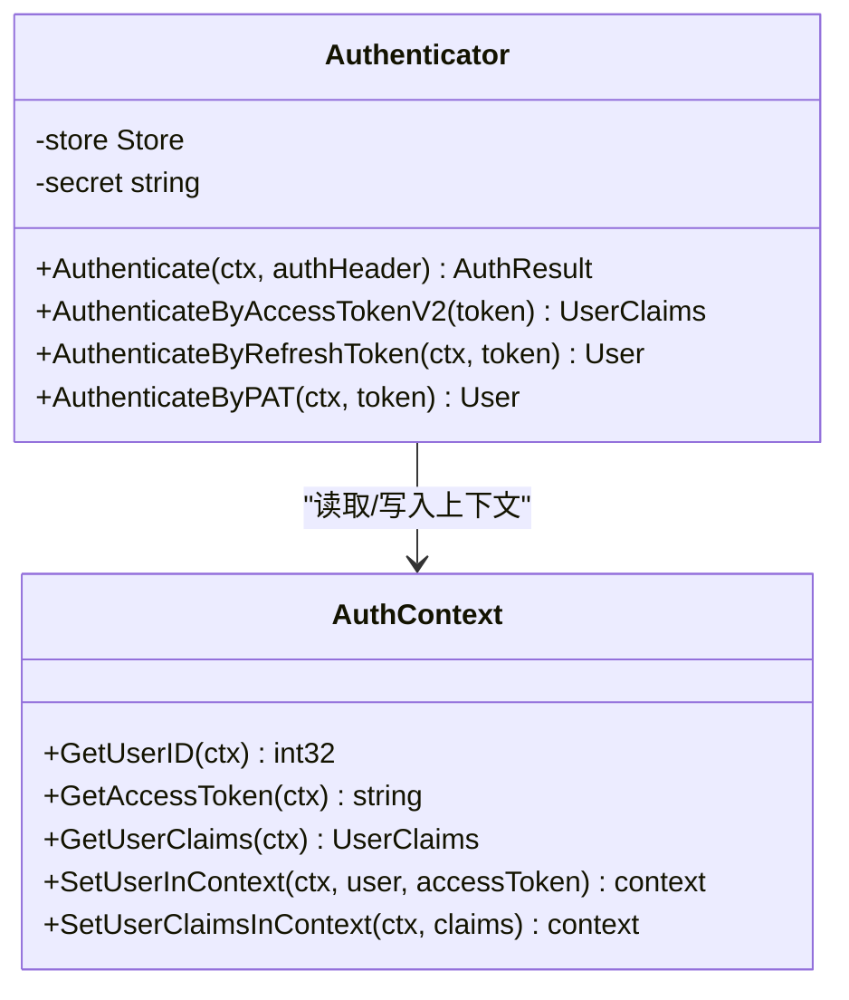
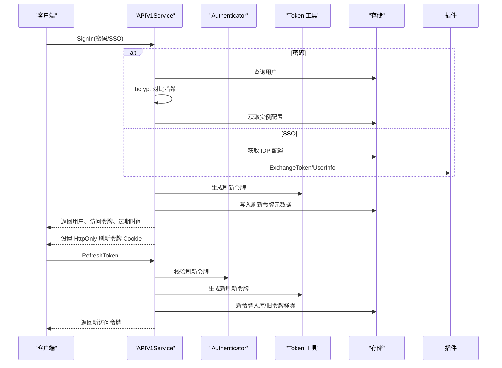
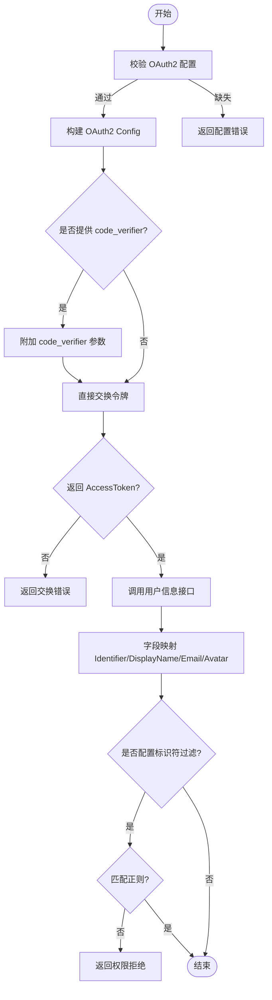
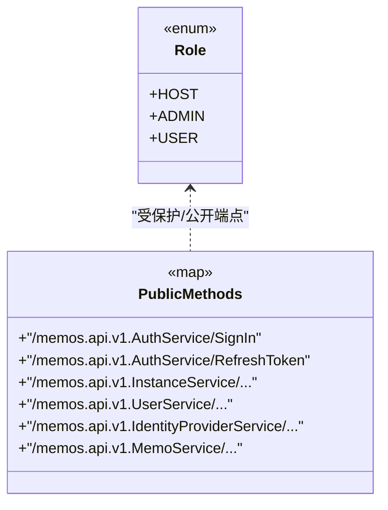
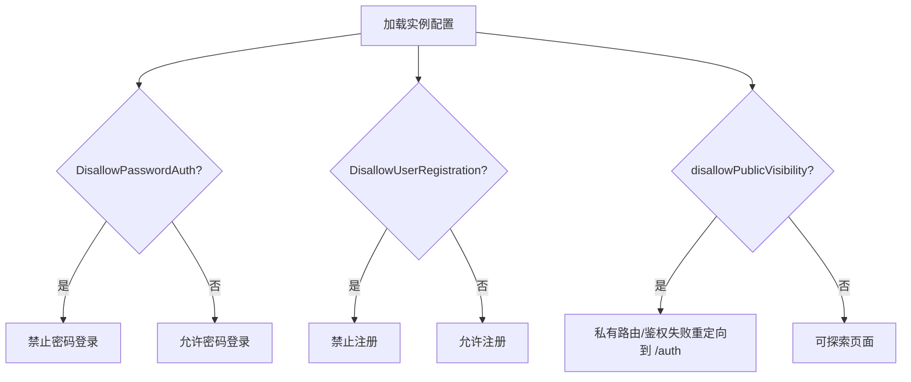
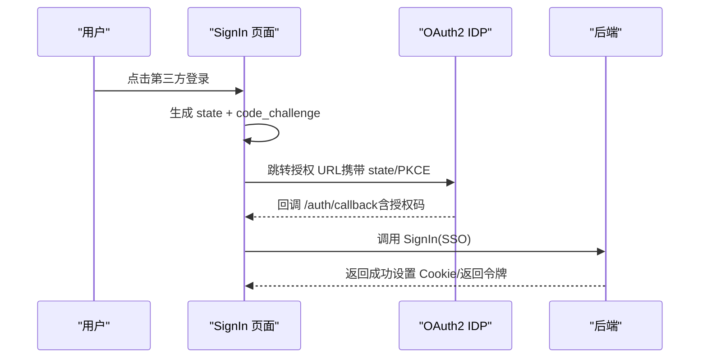
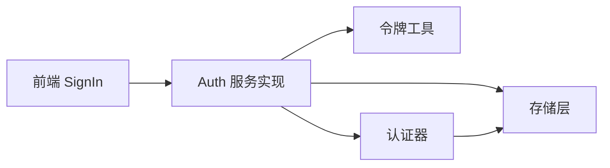

# 认证与授权

<cite>
**本文引用的文件**   
- [auth_service.proto](file://proto/api/v1/auth_service.proto)
- [authenticator.go](file://server/auth/authenticator.go)
- [token.go](file://server/auth/token.go)
- [context.go](file://server/auth/context.go)
- [auth_service.go](file://server/router/api/v1/auth_service.go)
- [acl_config.go](file://server/router/api/v1/acl_config.go)
- [oauth2.go](file://plugin/idp/oauth2/oauth2.go)
- [idp.go](file://plugin/idp/idp.go)
- [user.go](file://store/user.go)
- [instance_setting.go](file://store/instance_setting.go)
- [postgres_user.go](file://store/db/postgres/user.go)
- [sqlite_user.go](file://store/db/sqlite/user.go)
- [SignIn.tsx](file://web/src/pages/SignIn.tsx)
- [auth-redirect.ts](file://web/src/utils/auth-redirect.ts)
</cite>

## 目录
1. [简介](#简介)
2. [项目结构](#项目结构)
3. [核心组件](#核心组件)
4. [架构总览](#架构总览)
5. [详细组件分析](#详细组件分析)
6. [依赖关系分析](#依赖关系分析)
7. [性能考量](#性能考量)
8. [故障排查指南](#故障排查指南)
9. [结论](#结论)
10. [附录](#附录)

## 简介
本文件系统性梳理了本项目的认证与授权体系，覆盖以下主题：
- 用户认证流程：密码认证、OAuth2 与 IDP 集成
- 权限控制架构：角色管理、资源访问控制与操作权限验证
- 会话管理机制：令牌生成、刷新与失效处理
- 多租户与实例配置：实例级策略（如禁止密码登录、禁止注册等）
- 安全最佳实践：密码加密、CSRF 与 XSS 防护
- 认证集成 API 与前端实现示例

## 项目结构
认证与授权相关的核心位置分布如下：
- 协议与服务定义：proto/api/v1 下的 AuthService、IDP 与 Instance 等服务
- 后端实现：server/auth（令牌与上下文）、server/router/api/v1（拦截器与业务逻辑）、plugin/idp（OAuth2 身份提供商）
- 存储层：store/user.go（角色枚举）、store/instance_setting.go（实例设置）、数据库驱动（PostgreSQL/SQLite 用户表）
- 前端：web/src/pages/SignIn.tsx（登录页与 OAuth2 发起）、web/src/utils/auth-redirect.ts（鉴权失败重定向）

**图表来源**
- [auth_service.proto](file://proto/api/v1/auth_service.proto#L1-L115)
- [authenticator.go](file://server/auth/authenticator.go#L1-L166)
- [token.go](file://server/auth/token.go#L1-L250)
- [context.go](file://server/auth/context.go#L1-L84)
- [auth_service.go](file://server/router/api/v1/auth_service.go#L1-L613)
- [acl_config.go](file://server/router/api/v1/acl_config.go#L1-L43)
- [oauth2.go](file://plugin/idp/oauth2/oauth2.go#L1-L135)
- [user.go](file://store/user.go#L1-L162)
- [instance_setting.go](file://store/instance_setting.go#L1-L244)

**章节来源**
- [auth_service.proto](file://proto/api/v1/auth_service.proto#L1-L115)
- [authenticator.go](file://server/auth/authenticator.go#L1-L166)
- [token.go](file://server/auth/token.go#L1-L250)
- [context.go](file://server/auth/context.go#L1-L84)
- [auth_service.go](file://server/router/api/v1/auth_service.go#L1-L613)
- [acl_config.go](file://server/router/api/v1/acl_config.go#L1-L43)
- [oauth2.go](file://plugin/idp/oauth2/oauth2.go#L1-L135)
- [user.go](file://store/user.go#L1-L162)
- [instance_setting.go](file://store/instance_setting.go#L1-L244)

## 核心组件
- 令牌与会话
  - 短期访问令牌（Access Token V2）：无状态签名校验，有效期 15 分钟
  - 长期刷新令牌（Refresh Token）：有状态签名校验，数据库校验撤销与过期
  - 个人访问令牌（PAT）：长期令牌，用于程序化访问，哈希持久化
- 身份提供商（IDP）
  - OAuth2 插件：支持 PKCE（code_verifier），从用户信息接口映射标识符、显示名、邮箱、头像
- 角色与权限
  - 角色枚举：HOST、ADMIN、USER；通过 Access Token 的角色字段参与授权
- 实例配置
  - 禁止密码登录、禁止用户注册、禁止公开可见等策略由实例设置控制
- 前端交互
  - 登录页发起 OAuth2 授权，使用 state 与 PKCE；鉴权失败时按配置重定向

**章节来源**
- [token.go](file://server/auth/token.go#L25-L53)
- [authenticator.go](file://server/auth/authenticator.go#L26-L37)
- [oauth2.go](file://plugin/idp/oauth2/oauth2.go#L19-L41)
- [user.go](file://store/user.go#L10-L28)
- [instance_setting.go](file://store/instance_setting.go#L121-L142)
- [SignIn.tsx](file://web/src/pages/SignIn.tsx#L41-L72)

## 架构总览
认证与授权的整体流程如下：
- 密码认证：后端对 bcrypt 哈希进行比对，结合实例配置决定是否允许
- OAuth2 认证：通过 IDP 插件交换访问令牌并拉取用户信息，支持标识符过滤与自动注册
- 会话建立：签发短期访问令牌与长期刷新令牌，刷新令牌以 HttpOnly Cookie 形式存储
- 刷新流程：刷新令牌轮换（rotation）与滑动窗口会话，提升安全性
- 授权：基于 Access Token 中的角色与实例 ACL 映射判断公共/受保护端点

**图表来源**
- [auth_service.go](file://server/router/api/v1/auth_service.go#L91-L190)
- [oauth2.go](file://plugin/idp/oauth2/oauth2.go#L43-L78)
- [token.go](file://server/auth/token.go#L162-L187)
- [SignIn.tsx](file://web/src/pages/SignIn.tsx#L41-L72)

## 详细组件分析

### 组件一：令牌生成与解析（Access/Refresh/PAT）
- Access Token V2
  - 结构包含类型、角色、状态、用户名与标准声明
  - 使用 HS256 签名，kid 为 v1，受众为用户访问令牌
  - 有效期 15 分钟，无状态验证
- Refresh Token
  - 包含类型与 token_id，用于撤销与定位
  - 受众为刷新令牌，需数据库校验撤销与过期
- Personal Access Token（PAT）
  - 前缀 memos_pat_，真实值不持久化，仅存储哈希
  - 支持过期时间与最后使用时间更新

**图表来源**
- [token.go](file://server/auth/token.go#L64-L85)
- [token.go](file://server/auth/token.go#L96-L131)
- [token.go](file://server/auth/token.go#L134-L160)
- [token.go](file://server/auth/token.go#L163-L187)
- [token.go](file://server/auth/token.go#L199-L203)
- [token.go](file://server/auth/token.go#L220-L249)

**章节来源**
- [token.go](file://server/auth/token.go#L25-L53)
- [token.go](file://server/auth/token.go#L64-L85)
- [token.go](file://server/auth/token.go#L96-L131)
- [token.go](file://server/auth/token.go#L134-L160)
- [token.go](file://server/auth/token.go#L163-L187)
- [token.go](file://server/auth/token.go#L199-L203)
- [token.go](file://server/auth/token.go#L220-L249)

### 组件二：认证器与上下文
- Authenticator
  - 支持 Access Token V2 无状态校验与 PAT 哈希校验
  - 支持 Refresh Token 数据库校验（撤销、过期、用户状态）
- 上下文键
  - 用户 ID、访问令牌、用户声明、刷新令牌 ID
  - 提供便捷的获取与设置函数

**图表来源**
- [authenticator.go](file://server/auth/authenticator.go#L26-L37)
- [authenticator.go](file://server/auth/authenticator.go#L136-L165)
- [context.go](file://server/auth/context.go#L30-L83)

**章节来源**
- [authenticator.go](file://server/auth/authenticator.go#L17-L29)
- [authenticator.go](file://server/auth/authenticator.go#L136-L165)
- [context.go](file://server/auth/context.go#L9-L28)
- [context.go](file://server/auth/context.go#L30-L83)

### 组件三：认证服务（SignIn/SignOut/RefreshToken）
- SignIn
  - 密码认证：bcrypt 对比哈希，结合实例配置（禁止密码登录、禁止注册）决策
  - SSO 认证：OAuth2 插件交换令牌与拉取用户信息，支持标识符过滤与自动注册
  - 成功后生成访问令牌与刷新令牌，设置 HttpOnly Cookie
- SignOut
  - 清理刷新令牌 Cookie，并尝试撤销对应刷新令牌
- RefreshToken
  - 从 Cookie 读取刷新令牌，数据库校验后执行“刷新令牌轮换”（新旧替换），返回新的短期访问令牌

**图表来源**
- [auth_service.go](file://server/router/api/v1/auth_service.go#L64-L190)
- [auth_service.go](file://server/router/api/v1/auth_service.go#L199-L238)
- [auth_service.go](file://server/router/api/v1/auth_service.go#L288-L357)
- [authenticator.go](file://server/auth/authenticator.go#L61-L99)
- [token.go](file://server/auth/token.go#L163-L187)

**章节来源**
- [auth_service.go](file://server/router/api/v1/auth_service.go#L55-L64)
- [auth_service.go](file://server/router/api/v1/auth_service.go#L67-L91)
- [auth_service.go](file://server/router/api/v1/auth_service.go#L91-L171)
- [auth_service.go](file://server/router/api/v1/auth_service.go#L192-L238)
- [auth_service.go](file://server/router/api/v1/auth_service.go#L240-L270)
- [auth_service.go](file://server/router/api/v1/auth_service.go#L272-L288)
- [auth_service.go](file://server/router/api/v1/auth_service.go#L288-L357)

### 组件四：OAuth2 与 IDP 集成
- 配置校验：ClientId、ClientSecret、TokenUrl、UserInfoUrl、FieldMapping.Identifier 必填
- 令牌交换：支持 code_verifier（PKCE），统一使用 AccessToken 字段
- 用户信息映射：优先使用配置中的字段映射，缺失时回退策略明确
- 标识符过滤：支持正则表达式过滤不允许的标识符

**图表来源**
- [oauth2.go](file://plugin/idp/oauth2/oauth2.go#L24-L41)
- [oauth2.go](file://plugin/idp/oauth2/oauth2.go#L43-L78)
- [oauth2.go](file://plugin/idp/oauth2/oauth2.go#L80-L134)
- [auth_service.go](file://server/router/api/v1/auth_service.go#L120-L129)

**章节来源**
- [oauth2.go](file://plugin/idp/oauth2/oauth2.go#L19-L41)
- [oauth2.go](file://plugin/idp/oauth2/oauth2.go#L43-L78)
- [oauth2.go](file://plugin/idp/oauth2/oauth2.go#L80-L134)
- [idp.go](file://plugin/idp/idp.go#L3-L8)
- [auth_service.go](file://server/router/api/v1/auth_service.go#L91-L171)

### 组件五：角色管理与资源访问控制
- 角色定义：HOST、ADMIN、USER
- 授权依据：Access Token 中的角色字段参与授权判断
- 公共端点映射：ACL 配置集中维护，拦截器据此放行或要求认证

**图表来源**
- [user.go](file://store/user.go#L10-L28)
- [acl_config.go](file://server/router/api/v1/acl_config.go#L11-L35)

**章节来源**
- [user.go](file://store/user.go#L10-L28)
- [acl_config.go](file://server/router/api/v1/acl_config.go#L3-L43)

### 组件六：实例配置与多租户支持
- 实例配置项：基础、通用、存储、Memo 相关等
- 关键策略：
  - 禁止密码登录（DisallowPasswordAuth）
  - 禁止用户注册（DisallowUserRegistration）
  - 禁止公开可见（MemoRelatedSetting.disallowPublicVisibility）
- 多租户：通过实例设置隔离不同租户的策略与行为

**图表来源**
- [instance_setting.go](file://store/instance_setting.go#L121-L142)
- [auth_service.go](file://server/router/api/v1/auth_service.go#L82-L89)
- [auth-redirect.ts](file://web/src/utils/auth-redirect.ts#L21-L36)

**章节来源**
- [instance_setting.go](file://store/instance_setting.go#L121-L142)
- [auth_service.go](file://server/router/api/v1/auth_service.go#L82-L89)
- [auth-redirect.ts](file://web/src/utils/auth-redirect.ts#L21-L36)

### 组件七：前端认证集成与安全防护
- 登录页
  - 发起 OAuth2 授权时生成并存储 state，同时生成 PKCE 的 code_challenge
  - 将 state 与 code_challenge 作为安全参数传递给 IDP
- 鉴权失败重定向
  - 私有路由在鉴权失败时根据实例配置重定向至 /auth 或 /explore

**图表来源**
- [SignIn.tsx](file://web/src/pages/SignIn.tsx#L41-L72)
- [auth_service.go](file://server/router/api/v1/auth_service.go#L91-L190)

**章节来源**
- [SignIn.tsx](file://web/src/pages/SignIn.tsx#L41-L72)
- [auth-redirect.ts](file://web/src/utils/auth-redirect.ts#L21-L36)

## 依赖关系分析
- 服务到工具
  - AuthService 依赖 Token 工具生成/解析令牌，依赖 Authenticator 进行会话校验
- 工具到存储
  - Authenticator 与 RefreshToken 流程依赖存储层查询/更新用户与刷新令牌记录
- 前端到服务
  - SignIn 页面通过 Connect 客户端调用 AuthService，完成认证与会话建立

**图表来源**
- [auth_service.go](file://server/router/api/v1/auth_service.go#L199-L238)
- [authenticator.go](file://server/auth/authenticator.go#L61-L99)
- [token.go](file://server/auth/token.go#L163-L187)

**章节来源**
- [auth_service.go](file://server/router/api/v1/auth_service.go#L199-L238)
- [authenticator.go](file://server/auth/authenticator.go#L61-L99)
- [token.go](file://server/auth/token.go#L163-L187)

## 性能考量
- 令牌验证
  - Access Token V2 采用无状态签名验证，避免数据库查询，降低延迟
  - Refresh Token 与 PAT 需要数据库校验，建议缓存用户与 PAT 最近使用时间
- 会话轮换
  - 刷新令牌轮换减少长期暴露风险，但会增加一次写入与一次删除操作
- 前端重定向
  - 鉴权失败重定向避免不必要的请求，减少服务器压力

## 故障排查指南
- 无效访问令牌
  - 现象：返回未认证错误
  - 排查：确认令牌签名、issuer、audience、过期时间；检查密钥版本
- 无效刷新令牌
  - 现象：刷新失败或提示未认证
  - 排查：确认 Cookie 是否存在且 HttpOnly；检查 token_id 是否撤销；核对过期时间与用户状态
- PAT 过期或格式错误
  - 现象：PAT 校验失败
  - 排查：确认前缀与哈希一致性；检查过期时间与用户状态
- OAuth2 交换失败
  - 现象：无法获取用户信息或缺少 AccessToken
  - 排查：确认 IDP 配置、回调地址、PKCE 参数；检查网络可达性
- 密码登录被禁用
  - 现象：返回权限拒绝
  - 排查：检查实例配置中禁止密码登录策略

**章节来源**
- [authenticator.go](file://server/auth/authenticator.go#L41-L58)
- [authenticator.go](file://server/auth/authenticator.go#L61-L99)
- [authenticator.go](file://server/auth/authenticator.go#L101-L124)
- [oauth2.go](file://plugin/idp/oauth2/oauth2.go#L43-L78)
- [auth_service.go](file://server/router/api/v1/auth_service.go#L82-L89)

## 结论
本项目采用“短期访问令牌 + 长期刷新令牌 + 可选 PAT”的混合认证模型，结合 OAuth2 IDP 插件与实例配置实现了灵活的认证与授权能力。通过 ACL 映射与角色字段，系统在公共端点与受保护端点之间建立了清晰的安全边界。配合刷新令牌轮换与 PKCE 等安全措施，整体方案兼顾易用性与安全性。

## 附录

### 认证与授权 API 摘要
- GetCurrentUser
  - 方法：GET /api/v1/auth/me
  - 认证：需要有效访问令牌
  - 返回：当前用户信息
- SignIn
  - 方法：POST /api/v1/auth/signin
  - 支持：密码认证或 SSO（OAuth2）
  - 返回：用户、短期访问令牌、过期时间
- SignOut
  - 方法：POST /api/v1/auth/signout
  - 行为：撤销刷新令牌并清除 Cookie
- RefreshToken
  - 方法：POST /api/v1/auth/refresh
  - 行为：使用 Cookie 中的刷新令牌换取新的短期访问令牌

**章节来源**
- [auth_service.proto](file://proto/api/v1/auth_service.proto#L13-L46)
- [auth_service.go](file://server/router/api/v1/auth_service.go#L32-L53)
- [auth_service.go](file://server/router/api/v1/auth_service.go#L64-L190)
- [auth_service.go](file://server/router/api/v1/auth_service.go#L240-L270)
- [auth_service.go](file://server/router/api/v1/auth_service.go#L272-L357)

### 安全最佳实践清单
- 密码加密
  - 使用 bcrypt 对密码进行哈希存储
- CSRF 防护
  - 前端使用 state 参数与后端校验；Cookie 使用 HttpOnly、Lax/SameSite、Secure（HTTPS）
- XSS 防护
  - 前端渲染严格校验与转义；后端输出遵循最小暴露原则
- 令牌安全
  - Access Token V2 无状态验证；Refresh Token 与 PAT 数据库存根；定期清理过期令牌

**章节来源**
- [auth_service.go](file://server/router/api/v1/auth_service.go#L78-L81)
- [token.go](file://server/auth/token.go#L25-L53)
- [auth_service.go](file://server/router/api/v1/auth_service.go#L369-L401)