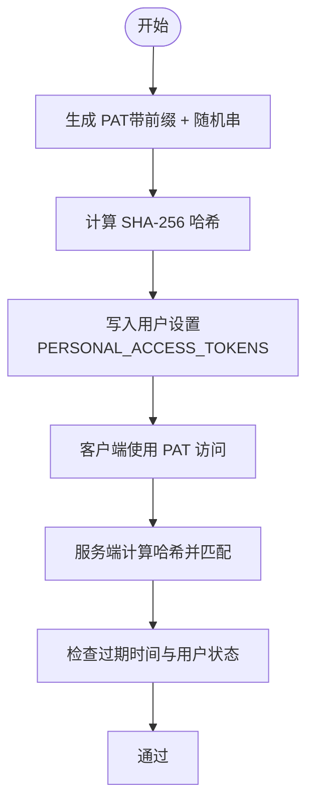

# JWT 访问令牌

<cite>
**本文引用的文件**
- [token.go](file://server/auth/token.go)
- [authenticator.go](file://server/auth/authenticator.go)
- [context.go](file://server/auth/context.go)
- [auth_service.go](file://server/router/api/v1/auth_service.go)
- [connect_interceptors.go](file://server/router/api/v1/connect_interceptors.go)
- [extract.go](file://server/auth/extract.go)
- [user_setting.go](file://store/user_setting.go)
- [user_setting.go(postgres)](file://store/db/postgres/user_setting.go)
- [user_setting.go(sqlite)](file://store/db/sqlite/user_setting.go)
- [token_test.go](file://server/auth/token_test.go)
</cite>

## 目录
1. [简介](#简介)
2. [项目结构](#项目结构)
3. [核心组件](#核心组件)
4. [架构总览](#架构总览)
5. [详细组件分析](#详细组件分析)
6. [依赖关系分析](#依赖关系分析)
7. [性能考量](#性能考量)
8. [故障排查指南](#故障排查指南)
9. [结论](#结论)
10. [附录：API 使用与最佳实践](#附录api-使用与最佳实践)

## 简介
本文件系统性阐述 Memos 后端的 JWT 访问令牌体系，重点覆盖：
- 短期访问令牌（Access Token V2）的生成、验证与使用机制
- 令牌结构、签名算法与有效期管理
- 无状态验证原理与上下文传递
- 刷新令牌（Refresh Token）的生成、轮换与撤销
- 个人访问令牌（PAT）的生成、哈希存储与校验
- 安全特性、性能考虑与最佳实践
- 完整的代码级流程图与 API 使用方法

## 项目结构
围绕 JWT 的关键模块分布如下：
- 令牌生成与解析：server/auth/token.go
- 认证器与无状态/有状态验证：server/auth/authenticator.go
- 请求上下文与用户声明传递：server/auth/context.go
- 会话与令牌生命周期：server/router/api/v1/auth_service.go
- 连接拦截器与鉴权注入：server/router/api/v1/connect_interceptors.go
- 令牌提取工具：server/auth/extract.go
- 存储层（PAT/Refresh Token）：store/user_setting.go 及其数据库实现
- 单元测试：server/auth/token_test.go

图表来源
- [token.go](file://server/auth/token.go#L1-L250)
- [authenticator.go](file://server/auth/authenticator.go#L1-L166)
- [context.go](file://server/auth/context.go#L1-L84)
- [auth_service.go](file://server/router/api/v1/auth_service.go#L1-L613)
- [connect_interceptors.go](file://server/router/api/v1/connect_interceptors.go#L221-L258)
- [user_setting.go](file://store/user_setting.go#L1-L487)
- [user_setting.go(postgres)](file://store/db/postgres/user_setting.go#L72-L110)
- [user_setting.go(sqlite)](file://store/db/sqlite/user_setting.go#L72-L109)

章节来源
- [token.go](file://server/auth/token.go#L1-L250)
- [authenticator.go](file://server/auth/authenticator.go#L1-L166)
- [context.go](file://server/auth/context.go#L1-L84)
- [auth_service.go](file://server/router/api/v1/auth_service.go#L1-L613)
- [connect_interceptors.go](file://server/router/api/v1/connect_interceptors.go#L221-L258)
- [user_setting.go](file://store/user_setting.go#L1-L487)
- [user_setting.go(postgres)](file://store/db/postgres/user_setting.go#L72-L110)
- [user_setting.go(sqlite)](file://store/db/sqlite/user_setting.go#L72-L109)

## 核心组件
- 访问令牌（Access Token V2）
  - 无状态验证：仅基于签名与注册声明校验
  - 结构：包含类型、角色、状态、用户名等自定义声明
  - 有效期：默认 15 分钟
- 刷新令牌（Refresh Token）
  - 有状态验证：需查询数据库确认未撤销且未过期
  - 有效期：默认 30 天
  - 支持轮换：每次刷新生成新令牌，旧令牌作废
- 个人访问令牌（PAT）
  - 长期令牌，用于程序化访问
  - 存储为哈希值，便于安全校验
- 认证器（Authenticator）
  - 统一入口：优先尝试 Access Token V2，再尝试 PAT
  - 提供无状态与有状态验证能力
- 上下文（Context）
  - 在请求链路中传递用户 ID、访问令牌与声明

章节来源
- [token.go](file://server/auth/token.go#L25-L85)
- [authenticator.go](file://server/auth/authenticator.go#L17-L166)
- [context.go](file://server/auth/context.go#L13-L84)

## 架构总览
下面以序列图展示一次完整登录与刷新流程，体现 Access Token V2 的无状态验证与 Refresh Token 的有状态校验。

图表来源
- [auth_service.go](file://server/router/api/v1/auth_service.go#L192-L357)
- [authenticator.go](file://server/auth/authenticator.go#L60-L99)
- [user_setting.go](file://store/user_setting.go#L140-L185)

## 详细组件分析

### 访问令牌（Access Token V2）生成与解析
- 生成
  - 使用对称签名算法（HS256），头部包含 key id（v1）
  - 注册声明：发行者、受众、主体、签发时间、过期时间
  - 自定义声明：类型（access）、角色、状态、用户名
  - 有效期固定为 15 分钟
- 解析与验证
  - 基于密钥函数校验签名算法与 key id
  - 校验发行者与受众
  - 校验类型必须为 access
  - 无状态：不查询数据库，仅依赖签名与声明

图表来源
- [token.go](file://server/auth/token.go#L133-L160)
- [token.go](file://server/auth/token.go#L219-L233)

章节来源
- [token.go](file://server/auth/token.go#L25-L85)
- [token.go](file://server/auth/token.go#L133-L160)
- [token.go](file://server/auth/token.go#L219-L233)
- [token_test.go](file://server/auth/token_test.go#L11-L33)

### 刷新令牌（Refresh Token）生成、轮换与撤销
- 生成
  - 生成随机 tokenID，生成 30 天有效期的 Refresh Token
  - 将 tokenID、创建时间、过期时间、客户端信息写入用户设置
  - 设置 HttpOnly Cookie（memos_refresh）
- 轮换（Refresh Token Rotation）
  - 从 Cookie 中提取 Refresh Token
  - 数据库校验：是否存在、是否过期
  - 生成新 tokenID 与新 Refresh Token，先写入再删除旧记录
  - 更新 Cookie 为新 Refresh Token
  - 生成新的 Access Token V2（15 分钟）
- 撤销
  - 登出时根据 Cookie 中的 Refresh Token 提取 tokenID
  - 从用户设置中移除对应记录

图表来源
- [auth_service.go](file://server/router/api/v1/auth_service.go#L192-L357)
- [authenticator.go](file://server/auth/authenticator.go#L60-L99)
- [user_setting.go](file://store/user_setting.go#L140-L185)

章节来源
- [auth_service.go](file://server/router/api/v1/auth_service.go#L192-L357)
- [authenticator.go](file://server/auth/authenticator.go#L60-L99)
- [user_setting.go](file://store/user_setting.go#L140-L185)

### 个人访问令牌（PAT）生成、哈希与校验
- 生成
  - 以固定前缀开头，后接随机字符串
- 存储
  - 仅保存 SHA-256 哈希，不保存明文
  - 用户设置中以 JSON 数组形式维护多个 PAT
- 校验
  - 对传入 PAT 计算哈希，与数据库中哈希匹配
  - 校验过期时间与用户状态

图表来源
- [token.go](file://server/auth/token.go#L189-L203)
- [user_setting.go](file://store/user_setting.go#L201-L287)
- [user_setting.go(postgres)](file://store/db/postgres/user_setting.go#L72-L110)
- [user_setting.go(sqlite)](file://store/db/sqlite/user_setting.go#L72-L109)

章节来源
- [token.go](file://server/auth/token.go#L189-L203)
- [user_setting.go](file://store/user_setting.go#L201-L287)
- [user_setting.go(postgres)](file://store/db/postgres/user_setting.go#L72-L110)
- [user_setting.go(sqlite)](file://store/db/sqlite/user_setting.go#L72-L109)

### 认证器与拦截器集成
- 认证器
  - 优先尝试 Access Token V2（无状态）
  - 再尝试 PAT（需要查询数据库）
  - 返回统一结果（用户或声明）
- 拦截器
  - 从 Authorization 头提取 Bearer 令牌
  - 若为 Access Token V2，则在上下文中注入声明与用户 ID
  - 若为 PAT，则注入用户信息与访问令牌

图表来源
- [authenticator.go](file://server/auth/authenticator.go#L17-L166)
- [context.go](file://server/auth/context.go#L63-L84)

章节来源
- [authenticator.go](file://server/auth/authenticator.go#L17-L166)
- [context.go](file://server/auth/context.go#L13-L84)
- [connect_interceptors.go](file://server/router/api/v1/connect_interceptors.go#L221-L258)

## 依赖关系分析
- 令牌生成与解析依赖对称加密与 JWT 库
- 认证器依赖存储层进行 Refresh Token 与 PAT 的数据库校验
- API 服务负责会话生命周期管理（登录、刷新、登出）
- 拦截器负责在请求进入业务逻辑前完成认证与上下文注入

图表来源
- [token.go](file://server/auth/token.go#L1-L250)
- [authenticator.go](file://server/auth/authenticator.go#L1-L166)
- [auth_service.go](file://server/router/api/v1/auth_service.go#L1-L613)
- [user_setting.go](file://store/user_setting.go#L1-L487)
- [user_setting.go(postgres)](file://store/db/postgres/user_setting.go#L72-L110)
- [user_setting.go(sqlite)](file://store/db/sqlite/user_setting.go#L72-L109)
- [connect_interceptors.go](file://server/router/api/v1/connect_interceptors.go#L221-L258)
- [extract.go](file://server/auth/extract.go#L1-L33)

章节来源
- [token.go](file://server/auth/token.go#L1-L250)
- [authenticator.go](file://server/auth/authenticator.go#L1-L166)
- [auth_service.go](file://server/router/api/v1/auth_service.go#L1-L613)
- [user_setting.go](file://store/user_setting.go#L1-L487)
- [user_setting.go(postgres)](file://store/db/postgres/user_setting.go#L72-L110)
- [user_setting.go(sqlite)](file://store/db/sqlite/user_setting.go#L72-L109)
- [connect_interceptors.go](file://server/router/api/v1/connect_interceptors.go#L221-L258)
- [extract.go](file://server/auth/extract.go#L1-L33)

## 性能考量
- Access Token V2 无状态验证，解析开销极低，适合高并发 API 调用
- Refresh Token 与 PAT 需要数据库查询，应配合缓存与索引优化
- 刷新令牌轮换采用“先写后删”，避免竞态导致的短暂不可用
- 建议对用户设置表的 JSON 字段建立合适的索引，加速 PAT 与 Refresh Token 查询

## 故障排查指南
- 无效访问令牌
  - 检查签名算法与 key id 是否正确
  - 确认发行者与受众匹配
  - 校验类型必须为 access
- 无效刷新令牌
  - 检查是否存在于用户设置中
  - 检查是否已过期
  - 检查用户状态是否被归档
- 无效 PAT
  - 检查前缀是否正确
  - 检查哈希是否匹配
  - 检查过期时间与用户状态
- 登录/刷新后无法获取新 Access Token
  - 确认刷新 Cookie 是否成功设置
  - 确认服务端日志中未出现存储写入失败

章节来源
- [token.go](file://server/auth/token.go#L205-L217)
- [authenticator.go](file://server/auth/authenticator.go#L60-L99)
- [user_setting.go](file://store/user_setting.go#L105-L123)
- [auth_service.go](file://server/router/api/v1/auth_service.go#L369-L401)

## 结论
Memos 的 JWT 体系通过 Access Token V2 实现高吞吐的无状态认证，结合 Refresh Token 的有状态校验与轮换机制，提供了滑动窗口会话体验；PAT 则满足长期程序化访问场景。整体设计兼顾安全性与性能，并通过拦截器与上下文在全链路中统一注入认证信息。

## 附录：API 使用与最佳实践

### API 使用方法
- 登录（获取 Access Token 与 Refresh Token）
  - 方法：POST /signin
  - 输入：用户名/密码或 SSO 授权码
  - 输出：用户信息、短期 Access Token、Access Token 过期时间、设置 HttpOnly Refresh Cookie
- 刷新（获取新的 Access Token）
  - 方法：POST /refresh
  - 输入：携带 memos_refresh Cookie
  - 输出：新的 Access Token 与过期时间，更新 Refresh Cookie
- 登出（撤销 Refresh Token）
  - 方法：POST /signout
  - 行为：根据 Cookie 中的 Refresh Token 执行撤销并清除 Cookie

章节来源
- [auth_service.go](file://server/router/api/v1/auth_service.go#L55-L190)
- [auth_service.go](file://server/router/api/v1/auth_service.go#L272-L357)
- [auth_service.go](file://server/router/api/v1/auth_service.go#L240-L270)

### 令牌生成与解析（代码路径）
- 生成 Access Token V2
  - [GenerateAccessTokenV2](file://server/auth/token.go#L133-L160)
- 解析 Access Token V2
  - [ParseAccessTokenV2](file://server/auth/token.go#L219-L233)
- 生成 Refresh Token
  - [GenerateRefreshToken](file://server/auth/token.go#L162-L187)
- 解析 Refresh Token
  - [ParseRefreshToken](file://server/auth/token.go#L235-L249)
- 生成 PAT
  - [GeneratePersonalAccessToken](file://server/auth/token.go#L189-L197)
- PAT 哈希
  - [HashPersonalAccessToken](file://server/auth/token.go#L199-L203)

章节来源
- [token.go](file://server/auth/token.go#L133-L249)

### 认证流程（代码路径）
- 认证器入口
  - [Authenticate](file://server/auth/authenticator.go#L136-L165)
- 无状态访问令牌验证
  - [AuthenticateByAccessTokenV2](file://server/auth/authenticator.go#L39-L58)
- 有状态刷新令牌验证
  - [AuthenticateByRefreshToken](file://server/auth/authenticator.go#L60-L99)
- PAT 验证
  - [AuthenticateByPAT](file://server/auth/authenticator.go#L101-L124)

章节来源
- [authenticator.go](file://server/auth/authenticator.go#L39-L124)

### 上下文与拦截器（代码路径）
- 上下文键与工具
  - [context.go](file://server/auth/context.go#L13-L84)
- 拦截器注入
  - [connect_interceptors.go](file://server/router/api/v1/connect_interceptors.go#L221-L258)

章节来源
- [context.go](file://server/auth/context.go#L13-L84)
- [connect_interceptors.go](file://server/router/api/v1/connect_interceptors.go#L221-L258)

### 存储与查询（代码路径）
- 用户设置抽象
  - [user_setting.go](file://store/user_setting.go#L105-L123)
  - [AddUserRefreshToken](file://store/user_setting.go#L140-L159)
  - [RemoveUserRefreshToken](file://store/user_setting.go#L161-L185)
  - [AddUserPersonalAccessToken](file://store/user_setting.go#L216-L235)
  - [RemoveUserPersonalAccessToken](file://store/user_setting.go#L237-L261)
  - [UpdatePATLastUsed](file://store/user_setting.go#L263-L287)
- PostgreSQL 实现
  - [GetUserByPATHash](file://store/db/postgres/user_setting.go#L72-L110)
- SQLite 实现
  - [GetUserByPATHash](file://store/db/sqlite/user_setting.go#L72-L109)

章节来源
- [user_setting.go](file://store/user_setting.go#L105-L287)
- [user_setting.go(postgres)](file://store/db/postgres/user_setting.go#L72-L110)
- [user_setting.go(sqlite)](file://store/db/sqlite/user_setting.go#L72-L109)

### 最佳实践
- 传输 Access Token 时始终使用 Bearer 头
- Refresh Token 必须以 HttpOnly Cookie 形式传输，避免 XSS 泄露
- 定期轮换 Refresh Token，降低泄露风险
- 对 PAT 进行最小权限设计，限制过期时间
- 在网关/反向代理层启用 HTTPS，确保 Cookie 的 Secure 属性生效
- 对频繁刷新的场景，考虑前端自动轮询策略，减少不必要的请求