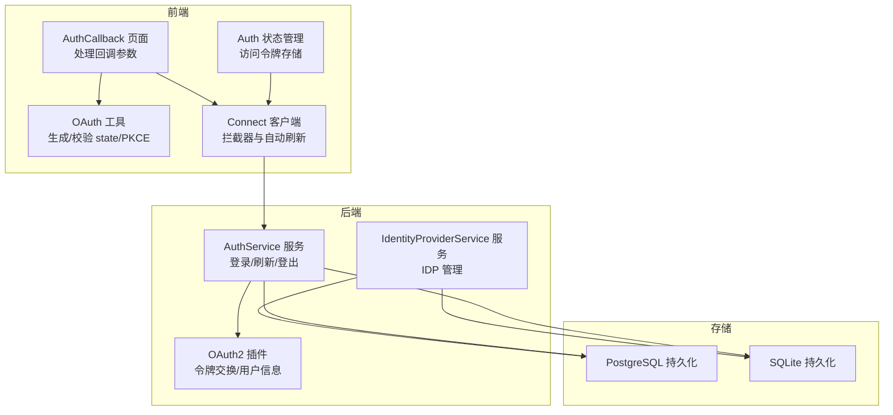
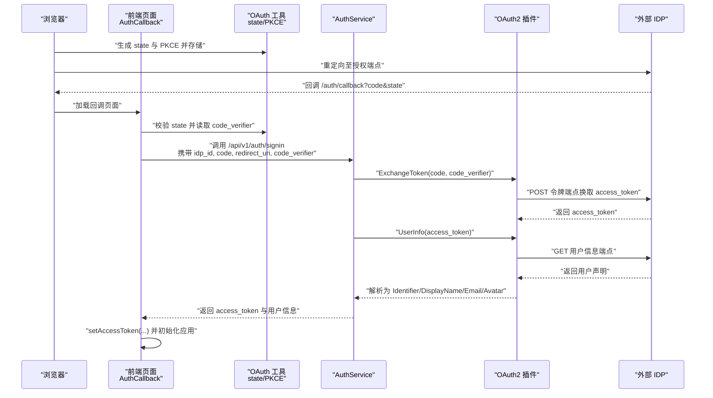
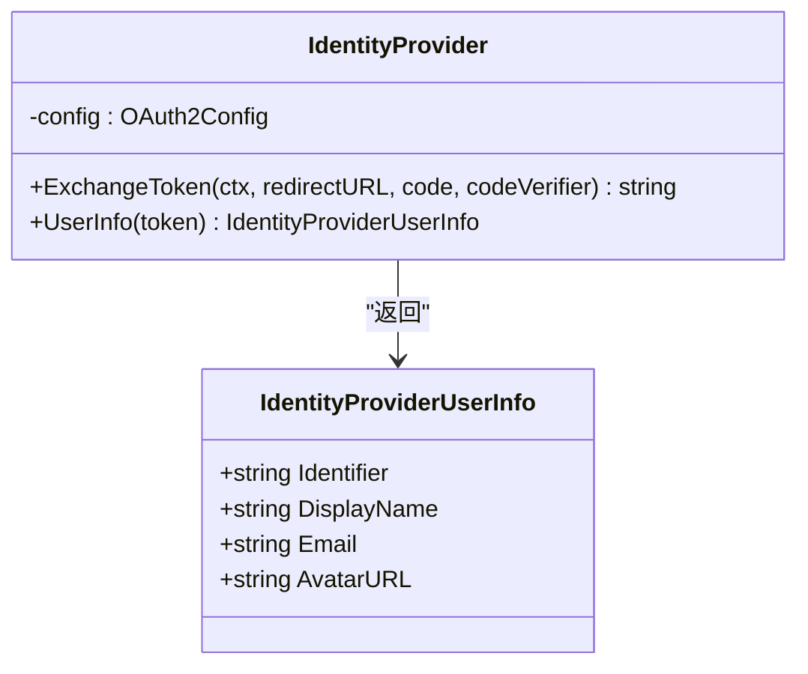
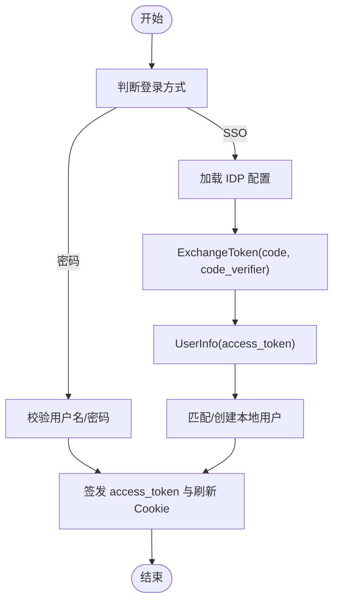
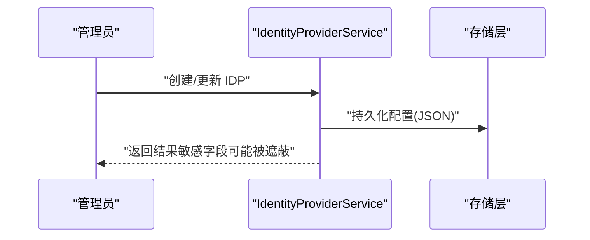
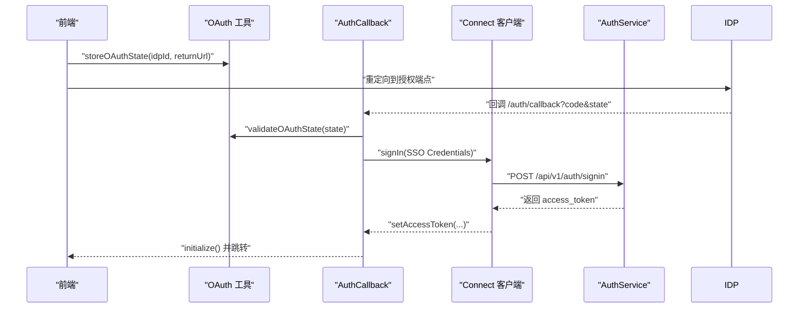
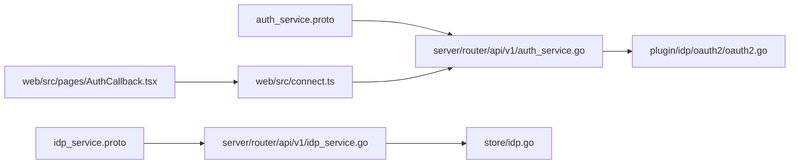

# OAuth2 认证

<cite>
**本文引用的文件**
- [plugin/idp/oauth2/oauth2.go](file://plugin/idp/oauth2/oauth2.go)
- [plugin/idp/oauth2/oauth2_test.go](file://plugin/idp/oauth2/oauth2_test.go)
- [plugin/idp/idp.go](file://plugin/idp/idp.go)
- [proto/api/v1/auth_service.proto](file://proto/api/v1/auth_service.proto)
- [proto/api/v1/idp_service.proto](file://proto/api/v1/idp_service.proto)
- [server/router/api/v1/auth_service.go](file://server/router/api/v1/auth_service.go)
- [server/router/api/v1/idp_service.go](file://server/router/api/v1/idp_service.go)
- [store/db/postgres/idp.go](file://store/db/postgres/idp.go)
- [store/db/sqlite/idp.go](file://store/db/sqlite/idp.go)
- [store/idp.go](file://store/idp.go)
- [web/src/pages/AuthCallback.tsx](file://web/src/pages/AuthCallback.tsx)
- [web/src/utils/oauth.ts](file://web/src/utils/oauth.ts)
- [web/src/auth-state.ts](file://web/src/auth-state.ts)
- [web/src/connect.ts](file://web/src/connect.ts)
</cite>

## 目录
1. [简介](#简介)
2. [项目结构](#项目结构)
3. [核心组件](#核心组件)
4. [架构总览](#架构总览)
5. [详细组件分析](#详细组件分析)
6. [依赖关系分析](#依赖关系分析)
7. [性能考量](#性能考量)
8. [故障排除指南](#故障排除指南)
9. [结论](#结论)
10. [附录](#附录)

## 简介
本文件系统性阐述本项目的 OAuth2 认证实现，覆盖授权码模式、令牌交换与用户信息获取的完整流程；解释身份提供商（IDP）集成架构与配置模型；给出前端重定向、回调处理与令牌存储的端到端实现；并总结安全要点、错误处理与会话管理策略。文档同时提供配置指南、集成示例与常见问题排查方法，帮助开发者快速完成第三方 OAuth2 提供商的接入与运维。

## 项目结构
围绕 OAuth2 的实现由后端服务、协议定义、存储层与前端客户端协同完成：
- 协议层：定义认证与 IDP 管理的 RPC 接口与消息格式
- 后端服务层：实现登录、刷新、登出与 IDP 列表管理等业务逻辑
- 插件层：封装 OAuth2 身份提供商的具体实现
- 存储层：持久化 IDP 配置与用户会话信息
- 前端层：负责 OAuth2 授权重定向、回调接收、状态校验与令牌存储

**图表来源**
- [web/src/pages/AuthCallback.tsx](file://web/src/pages/AuthCallback.tsx#L1-L125)
- [web/src/utils/oauth.ts](file://web/src/utils/oauth.ts#L1-L124)
- [web/src/auth-state.ts](file://web/src/auth-state.ts#L1-L74)
- [web/src/connect.ts](file://web/src/connect.ts#L1-L198)
- [server/router/api/v1/auth_service.go](file://server/router/api/v1/auth_service.go#L1-L613)
- [server/router/api/v1/idp_service.go](file://server/router/api/v1/idp_service.go#L1-L239)
- [plugin/idp/oauth2/oauth2.go](file://plugin/idp/oauth2/oauth2.go#L1-L135)
- [store/db/postgres/idp.go](file://store/db/postgres/idp.go#L1-L118)
- [store/db/sqlite/idp.go](file://store/db/sqlite/idp.go#L1-L118)

**章节来源**
- [web/src/pages/AuthCallback.tsx](file://web/src/pages/AuthCallback.tsx#L1-L125)
- [web/src/utils/oauth.ts](file://web/src/utils/oauth.ts#L1-L124)
- [web/src/auth-state.ts](file://web/src/auth-state.ts#L1-L74)
- [web/src/connect.ts](file://web/src/connect.ts#L1-L198)
- [server/router/api/v1/auth_service.go](file://server/router/api/v1/auth_service.go#L1-L613)
- [server/router/api/v1/idp_service.go](file://server/router/api/v1/idp_service.go#L1-L239)
- [plugin/idp/oauth2/oauth2.go](file://plugin/idp/oauth2/oauth2.go#L1-L135)
- [store/db/postgres/idp.go](file://store/db/postgres/idp.go#L1-L118)
- [store/db/sqlite/idp.go](file://store/db/sqlite/idp.go#L1-L118)

## 核心组件
- OAuth2 插件：封装授权码换取访问令牌、用户信息拉取与字段映射
- 认证服务：统一处理密码登录与 SSO 登录，生成短期访问令牌与长期刷新令牌（Cookie）
- IDP 管理服务：提供 IDP 的增删改查与配置暴露，支持字段映射与标识符过滤
- 前端 OAuth 工具：生成安全 state 与 PKCE 参数，校验回调参数，存储访问令牌
- 存储层：以 JSON 字符串形式保存 OAuth2 配置，支持 PostgreSQL 与 SQLite

**章节来源**
- [plugin/idp/oauth2/oauth2.go](file://plugin/idp/oauth2/oauth2.go#L1-L135)
- [server/router/api/v1/auth_service.go](file://server/router/api/v1/auth_service.go#L55-L190)
- [server/router/api/v1/idp_service.go](file://server/router/api/v1/idp_service.go#L16-L159)
- [web/src/utils/oauth.ts](file://web/src/utils/oauth.ts#L1-L124)
- [web/src/auth-state.ts](file://web/src/auth-state.ts#L1-L74)
- [store/idp.go](file://store/idp.go#L1-L183)

## 架构总览
下图展示从浏览器发起 OAuth2 授权到后端完成令牌交换与用户信息获取，并在前端建立会话的全链路：

**图表来源**
- [web/src/pages/AuthCallback.tsx](file://web/src/pages/AuthCallback.tsx#L74-L110)
- [web/src/utils/oauth.ts](file://web/src/utils/oauth.ts#L44-L105)
- [server/router/api/v1/auth_service.go](file://server/router/api/v1/auth_service.go#L91-L171)
- [plugin/idp/oauth2/oauth2.go](file://plugin/idp/oauth2/oauth2.go#L45-L78)
- [plugin/idp/oauth2/oauth2.go](file://plugin/idp/oauth2/oauth2.go#L81-L134)

**章节来源**
- [web/src/pages/AuthCallback.tsx](file://web/src/pages/AuthCallback.tsx#L1-L125)
- [web/src/utils/oauth.ts](file://web/src/utils/oauth.ts#L1-L124)
- [server/router/api/v1/auth_service.go](file://server/router/api/v1/auth_service.go#L55-L190)
- [plugin/idp/oauth2/oauth2.go](file://plugin/idp/oauth2/oauth2.go#L1-L135)

## 详细组件分析

### OAuth2 插件（令牌交换与用户信息）
- 初始化校验：要求 clientId、clientSecret、tokenUrl、userInfoUrl、fieldMapping.identifier 非空
- 令牌交换：基于授权码与可选 code_verifier 进行 PKCE 保护的授权码交换
- 用户信息：通过 Bearer Token 调用 userInfoUrl，按字段映射提取 Identifier、DisplayName、Email、Avatar

**图表来源**
- [plugin/idp/oauth2/oauth2.go](file://plugin/idp/oauth2/oauth2.go#L19-L41)
- [plugin/idp/oauth2/oauth2.go](file://plugin/idp/oauth2/oauth2.go#L43-L78)
- [plugin/idp/oauth2/oauth2.go](file://plugin/idp/oauth2/oauth2.go#L80-L134)
- [plugin/idp/idp.go](file://plugin/idp/idp.go#L3-L8)

**章节来源**
- [plugin/idp/oauth2/oauth2.go](file://plugin/idp/oauth2/oauth2.go#L1-L135)
- [plugin/idp/idp.go](file://plugin/idp/idp.go#L1-L9)

### 认证服务（登录/刷新/登出）
- 登录（SSO）：根据 idp_id 获取配置，调用 OAuth2 插件交换令牌并拉取用户信息，匹配或创建本地用户，签发短期访问令牌与 Cookie 中的刷新令牌
- 刷新：从 Cookie 中读取刷新令牌，验证后进行轮换（旋转），签发新的短期访问令牌
- 登出：撤销刷新令牌并清除 Cookie

**图表来源**
- [server/router/api/v1/auth_service.go](file://server/router/api/v1/auth_service.go#L55-L190)
- [server/router/api/v1/auth_service.go](file://server/router/api/v1/auth_service.go#L272-L357)

**章节来源**
- [server/router/api/v1/auth_service.go](file://server/router/api/v1/auth_service.go#L55-L190)
- [server/router/api/v1/auth_service.go](file://server/router/api/v1/auth_service.go#L272-L357)

### IDP 管理服务（配置与暴露）
- 支持创建、查询、更新、删除 IDP；对非 Host 角色隐藏敏感字段（如 client_secret）
- OAuth2 配置包含 client_id、client_secret、auth_url、token_url、user_info_url、scopes、field_mapping

**图表来源**
- [server/router/api/v1/idp_service.go](file://server/router/api/v1/idp_service.go#L16-L159)
- [store/idp.go](file://store/idp.go#L35-L183)

**章节来源**
- [server/router/api/v1/idp_service.go](file://server/router/api/v1/idp_service.go#L1-L239)
- [store/idp.go](file://store/idp.go#L1-L183)
- [store/db/postgres/idp.go](file://store/db/postgres/idp.go#L1-L118)
- [store/db/sqlite/idp.go](file://store/db/sqlite/idp.go#L1-L118)

### 前端 OAuth2 流程（重定向、回调与令牌存储）
- 生成并存储 state 与 PKCE（code_verifier/code_challenge），用于 CSRF 与拦截防护
- 回调页校验 state 并读取 code_verifier，调用后端登录接口，成功后将 access_token 写入 sessionStorage 并初始化应用
- Connect 客户端自动注入 Authorization 头并在未认证时触发刷新流程

**图表来源**
- [web/src/utils/oauth.ts](file://web/src/utils/oauth.ts#L44-L105)
- [web/src/pages/AuthCallback.tsx](file://web/src/pages/AuthCallback.tsx#L74-L110)
- [web/src/connect.ts](file://web/src/connect.ts#L127-L164)

**章节来源**
- [web/src/utils/oauth.ts](file://web/src/utils/oauth.ts#L1-L124)
- [web/src/pages/AuthCallback.tsx](file://web/src/pages/AuthCallback.tsx#L1-L125)
- [web/src/auth-state.ts](file://web/src/auth-state.ts#L1-L74)
- [web/src/connect.ts](file://web/src/connect.ts#L1-L198)

## 依赖关系分析
- 协议层定义了认证与 IDP 管理的 RPC 接口与消息体，确保前后端契约一致
- 服务层依赖插件层完成 OAuth2 交互，依赖存储层持久化配置与用户会话
- 前端通过 Connect 客户端与拦截器与后端通信，自动处理未认证与刷新

**图表来源**
- [proto/api/v1/auth_service.proto](file://proto/api/v1/auth_service.proto#L1-L115)
- [proto/api/v1/idp_service.proto](file://proto/api/v1/idp_service.proto#L1-L148)
- [server/router/api/v1/auth_service.go](file://server/router/api/v1/auth_service.go#L1-L613)
- [server/router/api/v1/idp_service.go](file://server/router/api/v1/idp_service.go#L1-L239)
- [plugin/idp/oauth2/oauth2.go](file://plugin/idp/oauth2/oauth2.go#L1-L135)
- [store/idp.go](file://store/idp.go#L1-L183)
- [web/src/connect.ts](file://web/src/connect.ts#L1-L198)
- [web/src/pages/AuthCallback.tsx](file://web/src/pages/AuthCallback.tsx#L1-L125)

**章节来源**
- [proto/api/v1/auth_service.proto](file://proto/api/v1/auth_service.proto#L1-L115)
- [proto/api/v1/idp_service.proto](file://proto/api/v1/idp_service.proto#L1-L148)
- [server/router/api/v1/auth_service.go](file://server/router/api/v1/auth_service.go#L1-L613)
- [server/router/api/v1/idp_service.go](file://server/router/api/v1/idp_service.go#L1-L239)
- [plugin/idp/oauth2/oauth2.go](file://plugin/idp/oauth2/oauth2.go#L1-L135)
- [store/idp.go](file://store/idp.go#L1-L183)
- [web/src/connect.ts](file://web/src/connect.ts#L1-L198)
- [web/src/pages/AuthCallback.tsx](file://web/src/pages/AuthCallback.tsx#L1-L125)

## 性能考量
- 令牌交换与用户信息获取均为网络请求，建议在前端使用连接池与超时控制，避免阻塞 UI
- 刷新令牌轮换采用“先新增后删除”的顺序，降低并发场景下的失效风险
- 前端访问令牌存储于 sessionStorage，减少不必要的刷新请求，提高响应速度

[本节为通用指导，无需列出具体文件来源]

## 故障排除指南
- 回调缺失参数：检查前端是否正确传递 state 与 code，以及是否在回调页进行校验
- CSRF 防护失败：确认 state 是否过期或不匹配，清理过期状态并重新发起授权
- PKCE 不匹配：确保 code_verifier 与授权端点的 code_challenge 对应
- 令牌交换失败：核对 token_url、client_id、client_secret 与 scopes 配置
- 用户信息缺失：确认 userInfo_url 返回的声明中包含映射字段（如 sub/name/email）
- 登录受限：若启用了 identifier_filter 或禁止用户注册，需调整策略或允许白名单

**章节来源**
- [web/src/pages/AuthCallback.tsx](file://web/src/pages/AuthCallback.tsx#L27-L110)
- [web/src/utils/oauth.ts](file://web/src/utils/oauth.ts#L67-L105)
- [plugin/idp/oauth2/oauth2.go](file://plugin/idp/oauth2/oauth2.go#L45-L78)
- [plugin/idp/oauth2/oauth2.go](file://plugin/idp/oauth2/oauth2.go#L80-L134)
- [server/router/api/v1/auth_service.go](file://server/router/api/v1/auth_service.go#L120-L171)

## 结论
本项目通过协议定义、插件化 OAuth2 实现、完善的前端工具与健壮的服务层，提供了可扩展、可维护的 OAuth2 认证方案。借助 PKCE、CSRF 校验与刷新令牌轮换，系统在安全性与可用性之间取得平衡。通过标准化的 IDP 管理接口，可灵活接入多种第三方 OAuth2 提供商。

[本节为总结，无需列出具体文件来源]

## 附录

### OAuth2 登录流程配置指南
- 在后台创建 OAuth2 类型的 IDP，填写以下关键字段：
  - client_id、client_secret
  - auth_url、token_url、user_info_url
  - scopes（如 ["openid","profile","email"]）
  - field_mapping（identifier、display_name、email、avatar_url）
- 可选：设置 identifier_filter（正则表达式）限制可登录的用户标识符
- 前端通过列表接口获取 IDP 列表，点击后生成并存储 state/PKCE，重定向至授权端点

**章节来源**
- [proto/api/v1/idp_service.proto](file://proto/api/v1/idp_service.proto#L96-L104)
- [server/router/api/v1/idp_service.go](file://server/router/api/v1/idp_service.go#L16-L159)
- [web/src/pages/SignIn.tsx](file://web/src/pages/SignIn.tsx#L32-L54)

### 支持的第三方认证提供商
- 本实现遵循标准 OAuth2 授权码流程，理论上可对接任何符合规范的 IDP（如 Google、GitHub、Azure AD、Keycloak 等）。实际适配时需确保：
  - 授权端点、令牌端点、用户信息端点可用
  - 返回的用户声明中包含与 field_mapping 对应的键
  - scopes 包含获取用户标识、显示名与邮箱所需的权限

[本节为概念性说明，无需列出具体文件来源]

### 安全考虑与最佳实践
- 使用 PKCE（RFC 7636）防止授权码拦截
- CSRF 防护：严格校验 state 并限制有效期
- 令牌存储：前端仅使用内存/SessionStorage 存放短期访问令牌，刷新令牌置于 HttpOnly Cookie
- 会话管理：启用刷新令牌轮换与滑动窗口，定期清理无效会话
- 最小权限：仅授予必要 scopes，避免过度授权

**章节来源**
- [web/src/utils/oauth.ts](file://web/src/utils/oauth.ts#L1-L124)
- [web/src/auth-state.ts](file://web/src/auth-state.ts#L1-L74)
- [server/router/api/v1/auth_service.go](file://server/router/api/v1/auth_service.go#L272-L357)

### 错误处理与会话管理
- 未认证自动刷新：Connect 拦截器检测未认证错误后自动调用刷新接口
- 登出：清除 Cookie 并撤销对应刷新令牌
- 异常上报：前端回调页捕获错误并提示用户

**章节来源**
- [web/src/connect.ts](file://web/src/connect.ts#L127-L164)
- [web/src/pages/AuthCallback.tsx](file://web/src/pages/AuthCallback.tsx#L98-L110)
- [server/router/api/v1/auth_service.go](file://server/router/api/v1/auth_service.go#L240-L270)