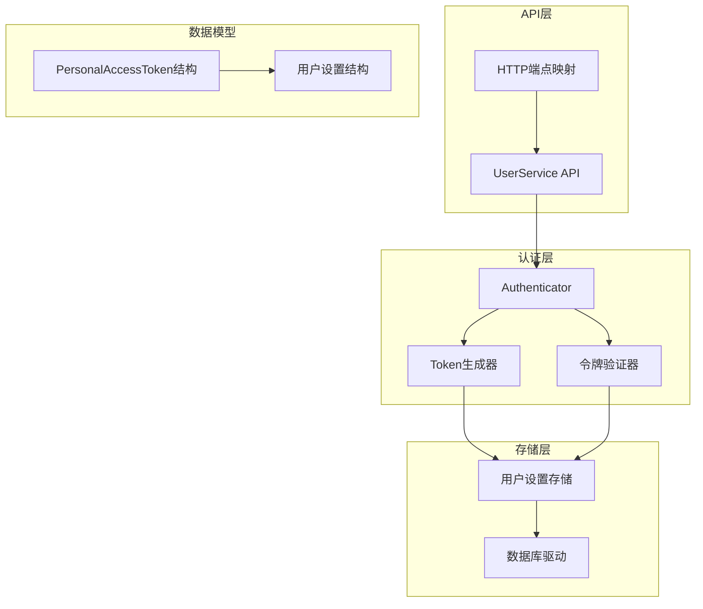
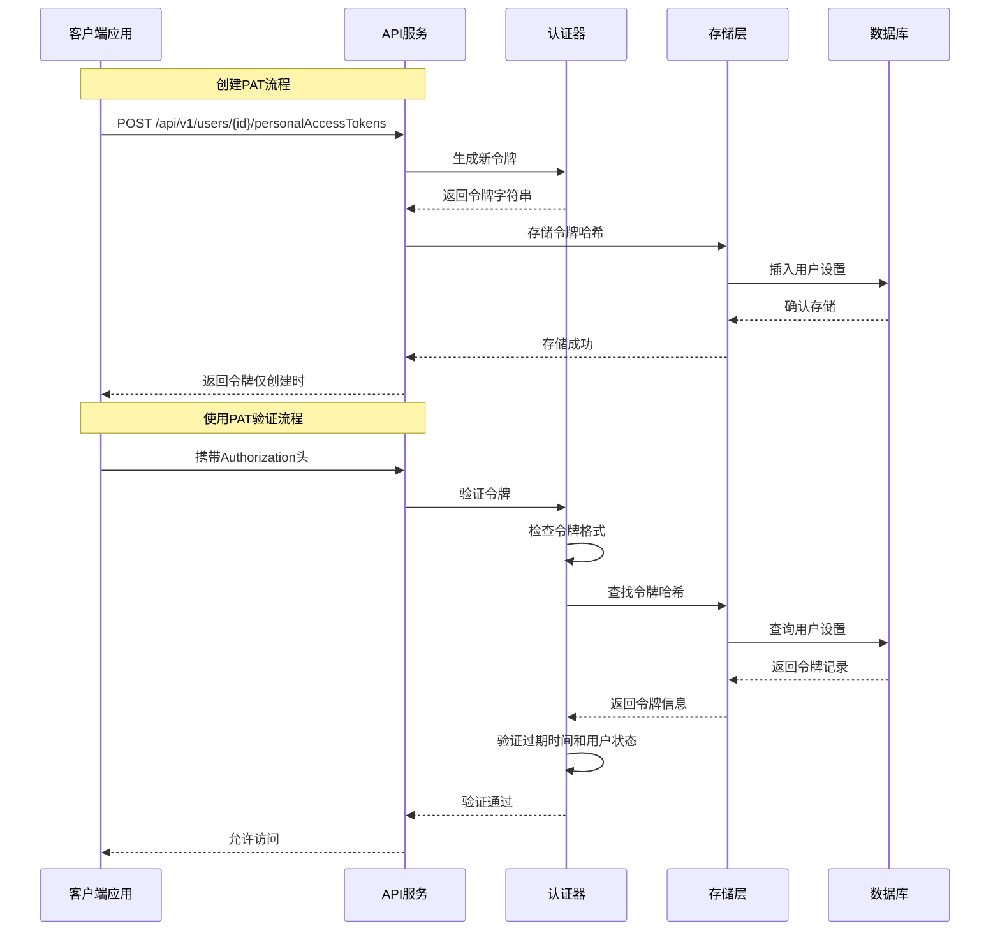
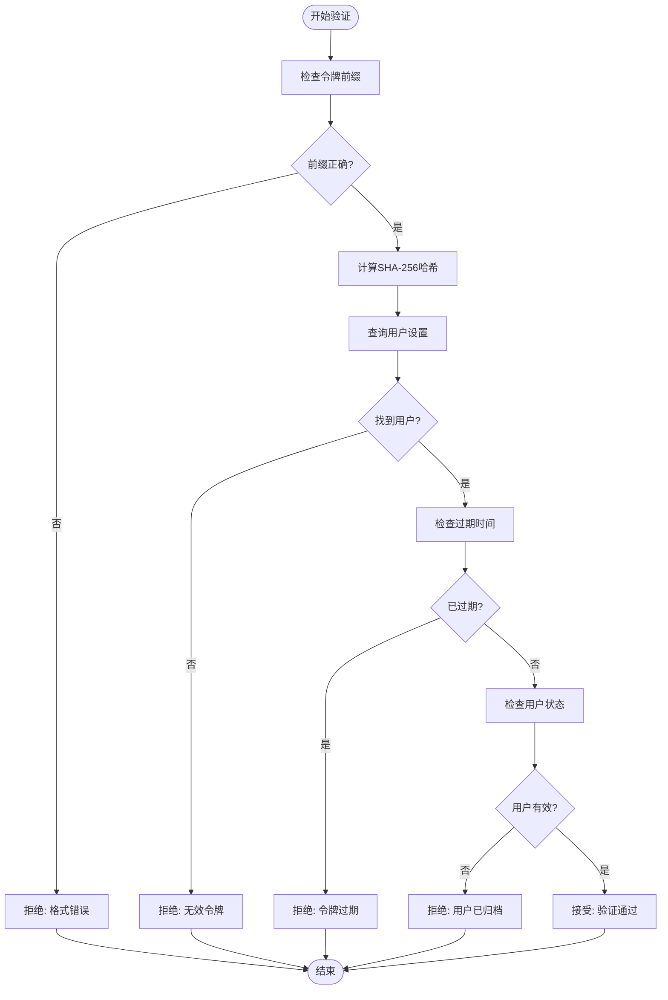
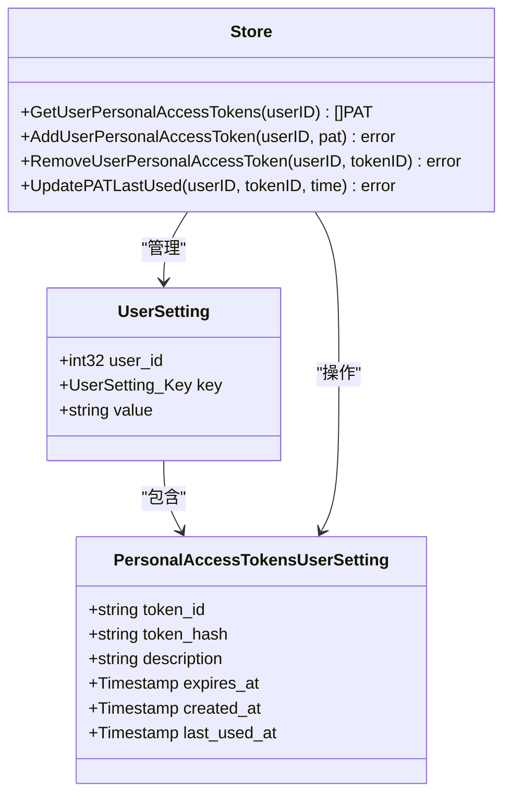
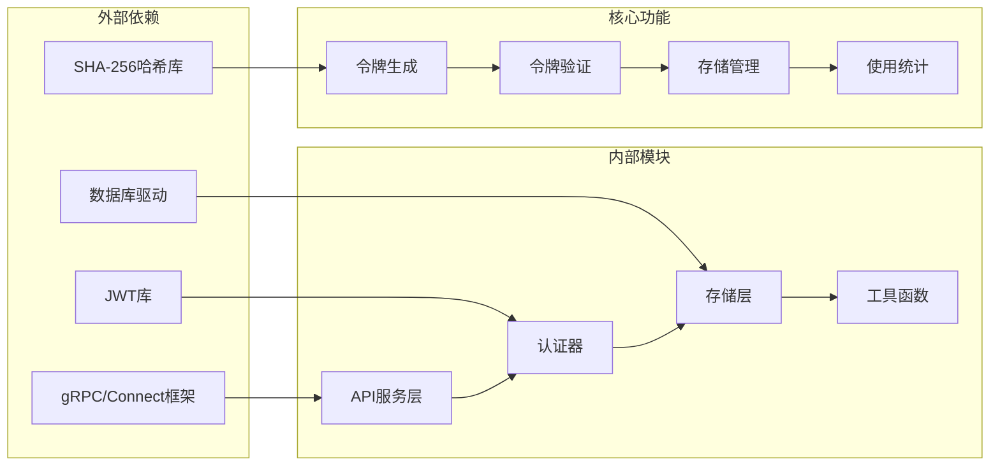

# 个人访问令牌 (PAT)

<cite>
**本文档引用的文件**
- [token.go](file://server/auth/token.go)
- [authenticator.go](file://server/auth/authenticator.go)
- [user_setting.go](file://store/user_setting.go)
- [user_service.go](file://server/router/api/v1/user_service.go)
- [user_service.proto](file://proto/api/v1/user_service.proto)
- [user_setting.proto](file://proto/store/user_setting.proto)
</cite>

## 目录
1. [简介](#简介)
2. [项目结构](#项目结构)
3. [核心组件](#核心组件)
4. [架构概览](#架构概览)
5. [详细组件分析](#详细组件分析)
6. [依赖关系分析](#依赖关系分析)
7. [性能考虑](#性能考虑)
8. [故障排除指南](#故障排除指南)
9. [结论](#结论)
10. [附录](#附录)

## 简介

个人访问令牌（Personal Access Token, PAT）是MemOS系统中用于程序化访问的核心认证机制。与短期有效的JWT访问令牌不同，PAT具有更长的有效期，专门设计用于移动应用、CLI工具、第三方集成等需要持久身份验证的场景。

PAT系统采用"明文令牌 + 哈希存储"的安全架构，确保在提供便利性的同时保持高度安全性。每个PAT都包含以下关键特性：

- **长期有效期**：相比15分钟的JWT访问令牌，PAT可以设置长期有效
- **强加密存储**：仅存储令牌的SHA-256哈希值，不保存原始令牌
- **灵活过期管理**：支持可选的过期时间设置
- **完整生命周期管理**：从创建到撤销的全生命周期控制
- **使用统计追踪**：记录令牌最后使用时间，便于审计和监控

## 项目结构

PAT功能在代码库中的分布遵循清晰的分层架构：

**图表来源**
- [user_service.go](file://server/router/api/v1/user_service.go#L569-L635)
- [authenticator.go](file://server/auth/authenticator.go#L101-L124)
- [user_setting.go](file://store/user_setting.go#L201-L287)

**章节来源**
- [user_service.go](file://server/router/api/v1/user_service.go#L569-L635)
- [token.go](file://server/auth/token.go#L189-L203)
- [user_setting.go](file://store/user_setting.go#L201-L287)

## 核心组件

### 令牌生成器
令牌生成器负责创建新的PAT，采用随机字符串生成策略：

- **令牌格式**：`memos_pat_` + 32位随机字符串
- **唯一性保证**：使用UUID作为回退方案
- **安全性**：基于密码学安全的随机数生成

### 哈希存储机制
所有PAT都通过SHA-256哈希进行存储，实现"只存哈希，不存明文"的安全策略：

- **哈希算法**：SHA-256提供强抗碰撞性
- **存储字段**：TokenHash字段保存哈希值
- **检索方式**：通过哈希值快速定位对应用户

### 验证流程
令牌验证采用多层检查机制：

1. **格式验证**：检查是否以`memos_pat_`前缀开头
2. **哈希匹配**：计算输入令牌的SHA-256哈希并与存储值比较
3. **过期检查**：验证令牌是否仍在有效期内
4. **用户状态检查**：确认用户未被归档或删除

**章节来源**
- [token.go](file://server/auth/token.go#L189-L203)
- [authenticator.go](file://server/auth/authenticator.go#L101-L124)
- [user_setting.go](file://store/user_setting.go#L105-L123)

## 架构概览

PAT系统的整体架构采用分层设计，确保了高内聚、低耦合的特性：

**图表来源**
- [user_service.go](file://server/router/api/v1/user_service.go#L569-L635)
- [authenticator.go](file://server/auth/authenticator.go#L101-L124)
- [user_setting.go](file://store/user_setting.go#L105-L123)

## 详细组件分析

### API接口设计

#### 创建个人访问令牌
创建PAT的API接口提供了完整的令牌管理能力：

**请求参数**
- `parent`: 用户资源标识符（如`users/123`）
- `description`: 令牌描述信息（用于识别用途）
- `expires_in_days`: 过期天数（0表示永不过期）

**响应内容**
- `personal_access_token`: 包含令牌元数据
- `token`: 仅在创建时返回的完整令牌值

**权限控制**
- 仅允许用户创建自己的令牌
- 支持管理员和宿主用户的特殊权限

#### 列出个人访问令牌
列出用户的所有PAT，但不包含实际的令牌值，仅返回元数据信息。

**返回字段**
- `name`: 令牌资源名称
- `description`: 用户提供的描述
- `created_at`: 创建时间
- `expires_at`: 过期时间
- `last_used_at`: 最后使用时间

#### 删除个人访问令牌
删除指定的PAT，立即使其失效。

**删除流程**
1. 验证用户权限
2. 从用户设置中移除该令牌
3. 立即生效，后续使用将失败

**章节来源**
- [user_service.go](file://server/router/api/v1/user_service.go#L569-L635)
- [user_service.proto](file://proto/api/v1/user_service.proto#L87-L107)

### 认证流程实现

#### 令牌验证算法
认证器实现了严格的令牌验证逻辑：

**图表来源**
- [authenticator.go](file://server/auth/authenticator.go#L101-L124)

#### 使用统计更新
每次成功的PAT验证都会自动更新令牌的最后使用时间：

**更新机制**
- 异步更新（fire-and-forget模式）
- 记录精确到秒的时间戳
- 用于审计和令牌管理

**章节来源**
- [authenticator.go](file://server/auth/authenticator.go#L154-L159)
- [user_setting.go](file://store/user_setting.go#L263-L287)

### 数据存储结构

#### 用户设置存储
PAT信息存储在用户设置的专用结构中：

**图表来源**
- [user_setting.go](file://store/user_setting.go#L201-L287)
- [user_setting.proto](file://proto/store/user_setting.proto#L75-L76)

#### 令牌数据模型
每个PAT包含以下关键字段：

**必需字段**
- `token_id`: 唯一标识符（UUID）
- `token_hash`: SHA-256哈希值
- `description`: 用户描述信息

**可选字段**
- `expires_at`: 过期时间戳
- `created_at`: 创建时间戳
- `last_used_at`: 最后使用时间戳

**章节来源**
- [user_setting.go](file://store/user_setting.go#L201-L287)
- [user_setting.proto](file://proto/store/user_setting.proto#L75-L76)

## 依赖关系分析

PAT系统的依赖关系体现了清晰的关注点分离：

**图表来源**
- [token.go](file://server/auth/token.go#L13-L23)
- [authenticator.go](file://server/auth/authenticator.go#L1-L15)
- [user_setting.go](file://store/user_setting.go#L1-L11)

### 关键依赖关系

**认证器依赖**
- 依赖JWT解析库进行令牌验证
- 依赖存储层进行用户信息查询
- 依赖工具库进行随机字符串生成

**存储层依赖**
- 依赖数据库驱动进行持久化操作
- 依赖协议缓冲区进行数据序列化
- 实现缓存机制提升查询性能

**API层依赖**
- 依赖gRPC/Connect框架处理HTTP请求
- 依赖认证器进行身份验证
- 依赖存储层进行数据操作

**章节来源**
- [token.go](file://server/auth/token.go#L13-L23)
- [authenticator.go](file://server/auth/authenticator.go#L1-L15)
- [user_setting.go](file://store/user_setting.go#L1-L11)

## 性能考虑

### 存储优化
PAT系统采用了多项性能优化措施：

**索引策略**
- 在`token_hash`字段上建立索引以加速查找
- 使用UUID作为主键确保良好的分布性
- 缓存用户设置减少数据库访问

**并发处理**
- 使用无锁数据结构处理高并发请求
- 异步更新令牌使用统计避免阻塞主流程
- 连接池管理数据库连接

### 内存管理
**对象复用**
- 复用JWT解析器实例
- 缓存用户设置结果
- 合理的内存分配策略

**垃圾回收优化**
- 减少临时对象创建
- 及时释放大对象引用
- 避免内存泄漏

## 故障排除指南

### 常见问题诊断

**令牌验证失败**
1. 检查令牌格式是否正确（必须以`memos_pat_`开头）
2. 验证令牌是否已过期
3. 确认用户账户状态正常
4. 检查服务器时间同步情况

**存储异常**
1. 确认数据库连接正常
2. 检查用户设置表结构完整性
3. 验证UUID生成器工作正常
4. 监控存储层性能指标

**权限问题**
1. 验证请求用户身份
2. 检查用户角色权限
3. 确认目标用户存在且可访问
4. 验证API调用权限

### 调试建议

**日志分析**
- 启用详细的认证日志
- 监控令牌验证成功率
- 记录异常错误信息
- 跟踪性能瓶颈

**监控指标**
- 认证请求QPS
- 令牌验证延迟
- 存储层响应时间
- 错误率统计

**章节来源**
- [authenticator.go](file://server/auth/authenticator.go#L101-L124)
- [user_setting.go](file://store/user_setting.go#L105-L123)

## 结论

PAT系统通过精心设计的安全架构和高效的实现机制，为MemOS提供了强大而灵活的程序化访问能力。其核心优势包括：

**安全性保障**
- 采用"明文令牌 + 哈希存储"的双重保护
- 完整的生命周期管理和撤销机制
- 细粒度的权限控制和审计追踪

**易用性设计**
- 简洁的API接口和标准的HTTP规范
- 灵活的过期时间配置
- 完整的使用统计和监控

**性能优化**
- 高效的哈希查找算法
- 智能的缓存策略
- 并发友好的架构设计

PAT系统不仅满足了当前的功能需求，还为未来的扩展和优化奠定了坚实的基础。通过持续的安全审计和性能优化，它将继续为用户提供可靠的身份验证服务。

## 附录

### API参考

#### 创建PAT
- **方法**: POST `/api/v1/{parent=users/*}/personalAccessTokens`
- **权限**: 用户本人或管理员
- **响应**: 包含令牌值（仅创建时）

#### 列出PAT
- **方法**: GET `/api/v1/{parent=users/*}/personalAccessTokens`
- **权限**: 用户本人或管理员
- **响应**: 令牌元数据列表

#### 删除PAT
- **方法**: DELETE `/api/v1/{name=users/*/personalAccessTokens/*}`
- **权限**: 用户本人或管理员
- **响应**: 空对象

### 最佳实践

**令牌管理**
- 为不同用途创建不同的描述标签
- 设置合理的过期时间
- 定期清理不再使用的令牌
- 在开发环境中使用短期令牌

**安全建议**
- 将令牌存储在安全的地方
- 避免在客户端显示完整令牌
- 及时撤销可疑的令牌
- 监控异常使用模式

**集成指南**
- 在客户端应用中实现令牌轮换
- 处理认证失败的重试逻辑
- 实现令牌刷新和撤销机制
- 集成使用统计和监控