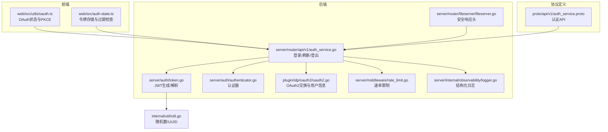
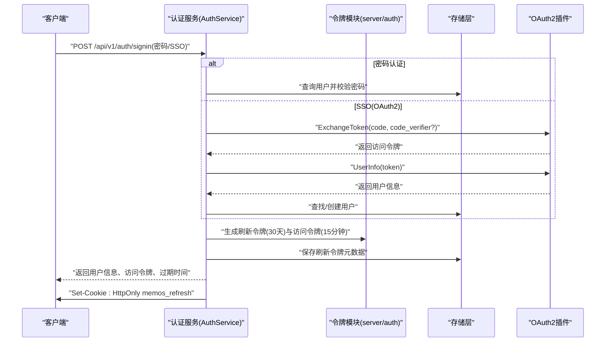
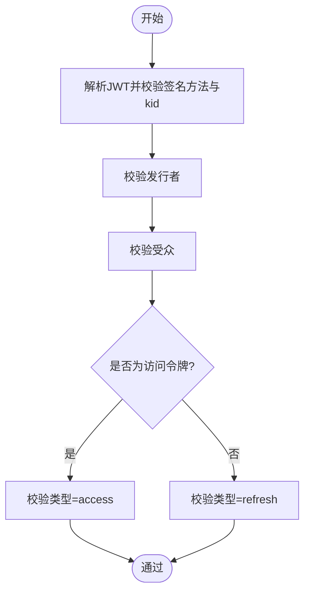
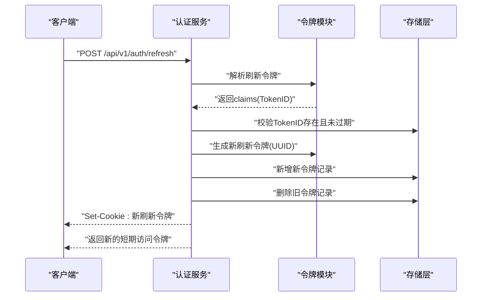
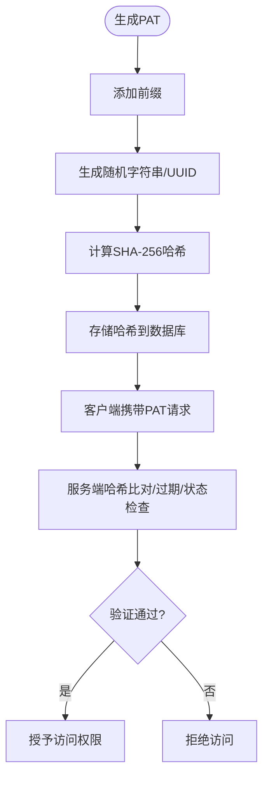
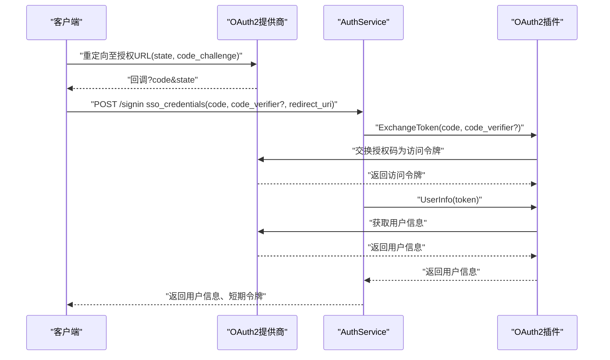
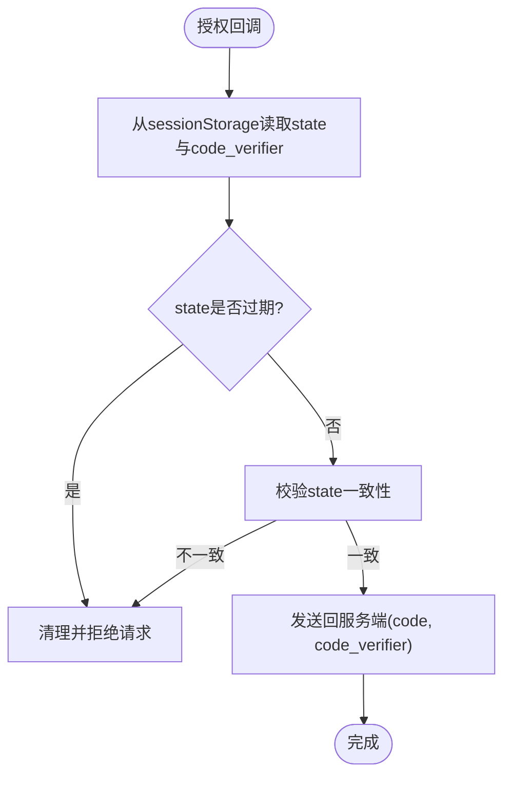
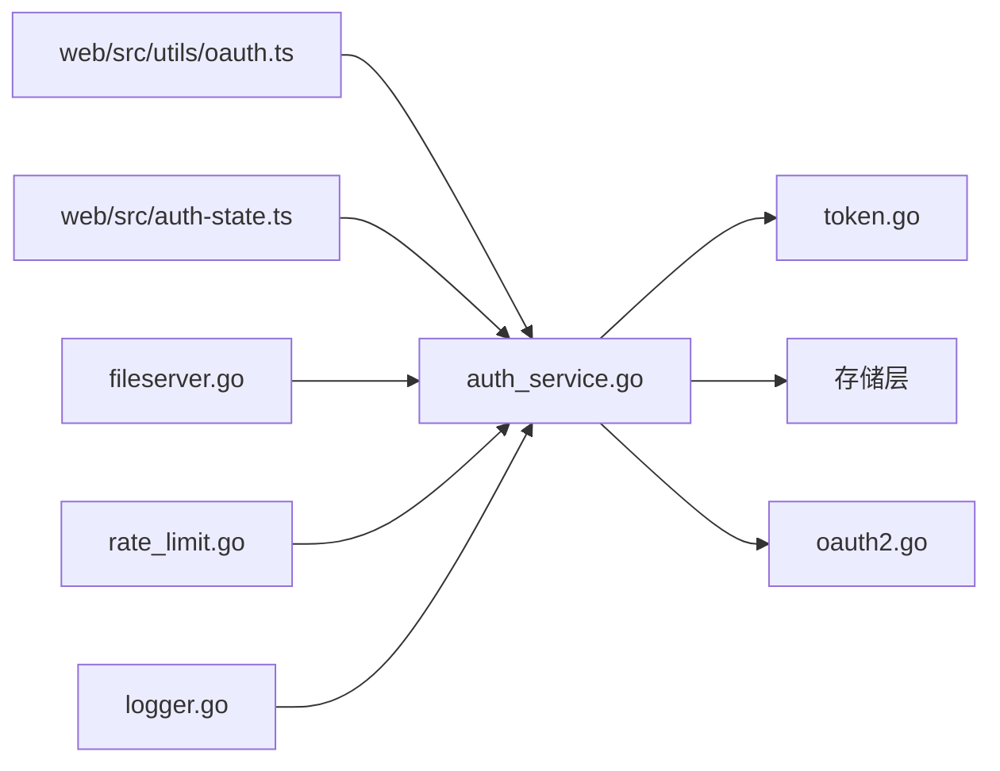

# 令牌安全与最佳实践

<cite>
**本文档引用的文件**
- [server/auth/token.go](file://server/auth/token.go)
- [server/auth/authenticator.go](file://server/auth/authenticator.go)
- [server/router/api/v1/auth_service.go](file://server/router/api/v1/auth_service.go)
- [plugin/idp/oauth2/oauth2.go](file://plugin/idp/oauth2/oauth2.go)
- [proto/api/v1/auth_service.proto](file://proto/api/v1/auth_service.proto)
- [internal/util/util.go](file://internal/util/util.go)
- [server/router/fileserver/fileserver.go](file://server/router/fileserver/fileserver.go)
- [web/src/utils/oauth.ts](file://web/src/utils/oauth.ts)
- [web/src/auth-state.ts](file://web/src/auth-state.ts)
- [server/middleware/rate_limit.go](file://server/middleware/rate_limit.go)
- [server/internal/observability/logger.go](file://server/internal/observability/logger.go)
- [SECURITY.md](file://SECURITY.md)
</cite>

## 目录
1. [引言](#引言)
2. [项目结构](#项目结构)
3. [核心组件](#核心组件)
4. [架构总览](#架构总览)
5. [详细组件分析](#详细组件分析)
6. [依赖关系分析](#依赖关系分析)
7. [性能考量](#性能考量)
8. [故障排查指南](#故障排查指南)
9. [结论](#结论)
10. [附录](#附录)

## 引言
本文件系统性梳理 Memos 项目中的令牌安全机制与最佳实践，覆盖以下方面：
- JWT 令牌的签名验证与声明校验
- 个人访问令牌（PAT）的生成、哈希存储与使用流程
- OAuth2 授权码流程的安全传输与 PKCE 支持
- 令牌泄露防护、会话劫持防范与 CSRF 保护
- 安全配置建议、密钥管理与轮换策略
- 审计日志、监控指标与异常检测
- 安全漏洞防护、合规要求与风险评估
- 安全编码规范与渗透测试指南

## 项目结构
围绕令牌安全的关键模块分布如下：
- 后端认证与令牌生成：server/auth
- 认证服务实现与会话管理：server/router/api/v1/auth_service.go
- OAuth2 身份提供商插件：plugin/idp/oauth2
- 前端 OAuth 状态与 PKCE 实现：web/src/utils/oauth.ts
- 通用工具与随机数生成：internal/util
- 文件服务器安全头设置：server/router/fileserver
- 速率限制中间件：server/middleware
- 观测性与日志：server/internal/observability
- 安全策略文档：SECURITY.md

**图表来源**
- [server/auth/token.go](file://server/auth/token.go#L1-L250)
- [server/auth/authenticator.go](file://server/auth/authenticator.go#L1-L166)
- [server/router/api/v1/auth_service.go](file://server/router/api/v1/auth_service.go#L1-L613)
- [plugin/idp/oauth2/oauth2.go](file://plugin/idp/oauth2/oauth2.go#L1-L135)
- [internal/util/util.go](file://internal/util/util.go#L1-L74)
- [server/router/fileserver/fileserver.go](file://server/router/fileserver/fileserver.go#L117-L151)
- [server/middleware/rate_limit.go](file://server/middleware/rate_limit.go#L1-L49)
- [server/internal/observability/logger.go](file://server/internal/observability/logger.go#L1-L152)
- [proto/api/v1/auth_service.proto](file://proto/api/v1/auth_service.proto#L1-L115)

**章节来源**
- [server/auth/token.go](file://server/auth/token.go#L1-L250)
- [server/auth/authenticator.go](file://server/auth/authenticator.go#L1-L166)
- [server/router/api/v1/auth_service.go](file://server/router/api/v1/auth_service.go#L1-L613)
- [plugin/idp/oauth2/oauth2.go](file://plugin/idp/oauth2/oauth2.go#L1-L135)
- [internal/util/util.go](file://internal/util/util.go#L1-L74)
- [server/router/fileserver/fileserver.go](file://server/router/fileserver/fileserver.go#L117-L151)
- [server/middleware/rate_limit.go](file://server/middleware/rate_limit.go#L1-L49)
- [server/internal/observability/logger.go](file://server/internal/observability/logger.go#L1-L152)
- [proto/api/v1/auth_service.proto](file://proto/api/v1/auth_service.proto#L1-L115)

## 核心组件
- JWT 访问令牌与刷新令牌
  - 访问令牌：短期（15 分钟），仅签名验证（无状态）
  - 刷新令牌：长期（30 天），结合数据库撤销检查
  - 关键常量与声明：发行者、受众、有效期、kid 等
- 个人访问令牌（PAT）
  - 随机前缀 + 随机字符串或 UUID
  - 存储为 SHA-256 哈希，使用时进行哈希比对
- OAuth2 授权码流程
  - 支持 PKCE（code_verifier），从授权提供商交换访问令牌并获取用户信息
- 会话与 Cookie
  - 刷新令牌以 HttpOnly Cookie 存储，支持 SameSite/Lax 与 Secure（HTTPS）
- 前端令牌存储
  - 访问令牌仅内存存储，避免持久化到本地存储；过期时间由服务端返回
- 速率限制与日志
  - 全局速率限制中间件，统一的结构化日志字段，便于审计与异常检测

**章节来源**
- [server/auth/token.go](file://server/auth/token.go#L25-L53)
- [server/auth/token.go](file://server/auth/token.go#L87-L187)
- [server/auth/token.go](file://server/auth/token.go#L189-L203)
- [server/auth/authenticator.go](file://server/auth/authenticator.go#L17-L29)
- [server/auth/authenticator.go](file://server/auth/authenticator.go#L39-L99)
- [server/router/api/v1/auth_service.go](file://server/router/api/v1/auth_service.go#L192-L238)
- [server/router/api/v1/auth_service.go](file://server/router/api/v1/auth_service.go#L272-L357)
- [plugin/idp/oauth2/oauth2.go](file://plugin/idp/oauth2/oauth2.go#L43-L78)
- [web/src/auth-state.ts](file://web/src/auth-state.ts#L37-L73)
- [server/middleware/rate_limit.go](file://server/middleware/rate_limit.go#L1-L49)
- [server/internal/observability/logger.go](file://server/internal/observability/logger.go#L11-L28)

## 架构总览
下图展示从客户端发起登录到令牌发放与后续请求验证的整体流程。

**图表来源**
- [server/router/api/v1/auth_service.go](file://server/router/api/v1/auth_service.go#L55-L190)
- [server/auth/token.go](file://server/auth/token.go#L162-L187)
- [plugin/idp/oauth2/oauth2.go](file://plugin/idp/oauth2/oauth2.go#L43-L78)

**章节来源**
- [server/router/api/v1/auth_service.go](file://server/router/api/v1/auth_service.go#L55-L190)
- [plugin/idp/oauth2/oauth2.go](file://plugin/idp/oauth2/oauth2.go#L43-L78)
- [server/auth/token.go](file://server/auth/token.go#L162-L187)

## 详细组件分析

### JWT 令牌安全与验证
- 签名算法与密钥标识
  - HS256 签名，kid 为 "v1"，用于未来密钥轮换与多版本并行验证
- 声明校验
  - 发行者、受众、主体、签发时间、过期时间
  - 访问令牌额外包含类型、角色、状态、用户名等自定义声明
- 解析与验证
  - 严格校验签名方法与 kid
  - 校验发行者与受众
  - 对访问令牌进一步校验类型为 "access"

**图表来源**
- [server/auth/token.go](file://server/auth/token.go#L205-L217)
- [server/auth/token.go](file://server/auth/token.go#L219-L233)
- [server/auth/token.go](file://server/auth/token.go#L235-L249)

**章节来源**
- [server/auth/token.go](file://server/auth/token.go#L205-L249)

### 刷新令牌与会话旋转
- 刷新令牌存储与撤销
  - 服务端生成 UUID 作为 token_id，并在用户设置中保存元数据（创建时间、过期时间、客户端信息）
  - 登录时写入 HttpOnly Cookie，刷新时执行“旋转”：新增一个刷新令牌并删除旧令牌
- 旋转策略收益
  - 滑动窗口会话：活跃用户可长期保持登录
  - 增强安全性：即使刷新令牌被窃取，合法用户再次刷新后旧令牌立即失效

**图表来源**
- [server/router/api/v1/auth_service.go](file://server/router/api/v1/auth_service.go#L272-L357)
- [server/auth/token.go](file://server/auth/token.go#L162-L187)

**章节来源**
- [server/router/api/v1/auth_service.go](file://server/router/api/v1/auth_service.go#L272-L357)
- [server/auth/token.go](file://server/auth/token.go#L162-L187)

### 个人访问令牌（PAT）安全
- 生成
  - 前缀 + 随机字符串或 UUID
- 存储
  - 数据库存储 SHA-256 哈希，不保存明文
- 使用
  - 请求头携带 PAT，服务端提取并哈希比对
  - 支持过期时间与用户状态检查
- 最佳实践
  - PAT 仅用于自动化场景，避免在浏览器中持久化
  - 定期轮换与撤销不再使用的 PAT

**图表来源**
- [server/auth/token.go](file://server/auth/token.go#L189-L203)
- [server/auth/authenticator.go](file://server/auth/authenticator.go#L101-L124)

**章节来源**
- [server/auth/token.go](file://server/auth/token.go#L189-L203)
- [server/auth/authenticator.go](file://server/auth/authenticator.go#L101-L124)

### OAuth2 安全传输与 PKCE
- 授权码交换
  - 使用标准 oauth2.Config，支持 AuthStyleInParams
  - 可选 code_verifier（PKCE）增强安全性
- 用户信息映射
  - 从用户信息接口按字段映射提取标识符、显示名、邮箱、头像等
- 前端配合
  - 在授权前生成 state 与 code_verifier，存储于 sessionStorage 并在回调时校验

**图表来源**
- [plugin/idp/oauth2/oauth2.go](file://plugin/idp/oauth2/oauth2.go#L43-L78)
- [plugin/idp/oauth2/oauth2.go](file://plugin/idp/oauth2/oauth2.go#L80-L134)
- [server/router/api/v1/auth_service.go](file://server/router/api/v1/auth_service.go#L91-L171)
- [web/src/utils/oauth.ts](file://web/src/utils/oauth.ts#L42-L123)

**章节来源**
- [plugin/idp/oauth2/oauth2.go](file://plugin/idp/oauth2/oauth2.go#L43-L78)
- [plugin/idp/oauth2/oauth2.go](file://plugin/idp/oauth2/oauth2.go#L80-L134)
- [server/router/api/v1/auth_service.go](file://server/router/api/v1/auth_service.go#L91-L171)
- [web/src/utils/oauth.ts](file://web/src/utils/oauth.ts#L42-L123)

### 会话劫持与 CSRF 防护
- 会话劫持
  - 刷新令牌采用 HttpOnly Cookie，降低 XSS 下的令牌窃取风险
  - 旋转机制使已泄露的刷新令牌在下次刷新后失效
- CSRF 防护
  - OAuth2 流程使用 state 参数与 sessionStorage 校验，防止 CSRF
  - 前端在回调时校验 state 一致性并清理存储，避免跨站请求伪造

**图表来源**
- [web/src/utils/oauth.ts](file://web/src/utils/oauth.ts#L67-L105)

**章节来源**
- [server/router/api/v1/auth_service.go](file://server/router/api/v1/auth_service.go#L369-L401)
- [web/src/utils/oauth.ts](file://web/src/utils/oauth.ts#L42-L123)

### 前端令牌存储与安全
- 访问令牌仅存储于内存（sessionStorage），避免持久化导致的 XSS 风险
- 过期时间由服务端返回，前端在过期前主动刷新
- 登出时清除存储，确保令牌无法被复用

**章节来源**
- [web/src/auth-state.ts](file://web/src/auth-state.ts#L37-L73)
- [proto/api/v1/auth_service.proto](file://proto/api/v1/auth_service.proto#L95-L101)

### 文件服务器安全头
- 设置 X-Content-Type-Options: nosniff，防止 MIME 类型嗅探
- 设置 X-Frame-Options: DENY，防止点击劫持
- 设置 Content-Security-Policy，限制资源加载
- 对潜在危险内容类型强制改为 application/octet-stream

**章节来源**
- [server/router/fileserver/fileserver.go](file://server/router/fileserver/fileserver.go#L117-L151)

## 依赖关系分析
- 组件耦合
  - 认证服务依赖令牌模块进行生成与解析，依赖存储层进行刷新令牌元数据管理
  - OAuth2 插件独立于业务逻辑，通过接口与认证服务交互
  - 前端仅通过 API 协议与后端通信，不直接依赖后端实现细节
- 外部依赖
  - 使用 golang-jwt 进行 JWT 操作
  - 使用 x/oauth2 进行授权码交换
  - 使用 bcrypt 进行密码哈希比较

**图表来源**
- [server/router/api/v1/auth_service.go](file://server/router/api/v1/auth_service.go#L1-L613)
- [server/auth/token.go](file://server/auth/token.go#L1-L250)
- [plugin/idp/oauth2/oauth2.go](file://plugin/idp/oauth2/oauth2.go#L1-L135)
- [web/src/utils/oauth.ts](file://web/src/utils/oauth.ts#L1-L123)
- [web/src/auth-state.ts](file://web/src/auth-state.ts#L1-L73)
- [server/router/fileserver/fileserver.go](file://server/router/fileserver/fileserver.go#L117-L151)
- [server/middleware/rate_limit.go](file://server/middleware/rate_limit.go#L1-L49)
- [server/internal/observability/logger.go](file://server/internal/observability/logger.go#L1-L152)

**章节来源**
- [server/router/api/v1/auth_service.go](file://server/router/api/v1/auth_service.go#L1-L613)
- [server/auth/token.go](file://server/auth/token.go#L1-L250)
- [plugin/idp/oauth2/oauth2.go](file://plugin/idp/oauth2/oauth2.go#L1-L135)
- [web/src/utils/oauth.ts](file://web/src/utils/oauth.ts#L1-L123)
- [web/src/auth-state.ts](file://web/src/auth-state.ts#L1-L73)
- [server/router/fileserver/fileserver.go](file://server/router/fileserver/fileserver.go#L117-L151)
- [server/middleware/rate_limit.go](file://server/middleware/rate_limit.go#L1-L49)
- [server/internal/observability/logger.go](file://server/internal/observability/logger.go#L1-L152)

## 性能考量
- 令牌验证
  - 访问令牌为无状态验证，CPU 开销低
  - 刷新令牌每次刷新需数据库查询与写入，应避免频繁刷新
- 速率限制
  - 默认每 IP/用户约 10 QPS，突发 20，可根据部署环境调整
- 日志与可观测性
  - 统一的日志字段包含请求 ID、用户 ID、耗时等，便于性能分析与问题定位

**章节来源**
- [server/middleware/rate_limit.go](file://server/middleware/rate_limit.go#L33-L34)
- [server/internal/observability/logger.go](file://server/internal/observability/logger.go#L11-L28)

## 故障排查指南
- 常见错误与定位
  - 无效访问令牌：检查签名方法、kid、发行者、受众与过期时间
  - 无效刷新令牌：检查 token_id 是否存在于用户设置、是否过期、用户状态是否有效
  - PAT 无效：确认哈希匹配、过期时间与用户状态
  - OAuth 回调失败：检查 state 是否过期或不一致、code_verifier 是否正确传递
- 审计与日志
  - 使用统一的日志上下文，记录请求 ID、用户 ID、事件类型、耗时与错误码
  - 对敏感操作（登录、刷新、登出、PAT 使用）增加审计日志字段
- 安全事件响应
  - 发现令牌泄露：立即撤销对应刷新令牌（数据库删除记录），必要时轮换密钥
  - 高频攻击：临时收紧速率限制，启用更严格的日志级别

**章节来源**
- [server/auth/token.go](file://server/auth/token.go#L205-L249)
- [server/auth/authenticator.go](file://server/auth/authenticator.go#L60-L124)
- [web/src/utils/oauth.ts](file://web/src/utils/oauth.ts#L67-L105)
- [server/internal/observability/logger.go](file://server/internal/observability/logger.go#L74-L97)

## 结论
Memos 的令牌体系在设计上兼顾了易用性与安全性：
- 短期访问令牌与长期刷新令牌分离，配合数据库撤销与旋转机制，显著降低会话泄露风险
- PAT 采用哈希存储，最小化明文暴露面
- OAuth2 支持 PKCE，前端通过 state 与 sessionStorage 防范 CSRF
- 前端仅内存存储访问令牌，减少 XSS 风险
- 提供速率限制与结构化日志，便于监控与异常检测

建议在生产环境中进一步完善密钥轮换策略、审计日志分级与告警联动，并持续进行渗透测试与安全评估。

## 附录

### 安全配置建议
- 密钥管理与轮换
  - 使用强随机源生成密钥，定期轮换；保留旧密钥一段时间以支持并行验证
  - 将密钥注入到只读环境变量，避免硬编码与版本库泄露
- Cookie 安全
  - 仅在 HTTPS 环境下启用 Secure；根据部署环境选择 SameSite 级别
- OAuth2
  - 强制使用 PKCE；限制授权范围与用户信息映射字段
- 前端
  - 严格禁止将访问令牌写入 localStorage；使用 sessionStorage 并在过期前刷新

### 审计日志与监控
- 日志字段建议
  - request_id、user_id、event_type、duration_ms、error_code、agent_type
- 监控指标
  - 登录成功率、刷新失败率、OAuth 回调失败率、令牌哈希比对失败次数
- 异常检测
  - 对短时间内大量失败的 IP 或用户 ID 进行告警与限流

### 合规与风险评估
- 自行托管实例需遵循最小暴露原则，使用反向代理与速率限制
- 安全披露流程：Beta 阶段通过邮件渠道报告，避免公开 Issue 暴露漏洞细节

**章节来源**
- [SECURITY.md](file://SECURITY.md#L1-L47)
- [server/internal/observability/logger.go](file://server/internal/observability/logger.go#L11-L28)