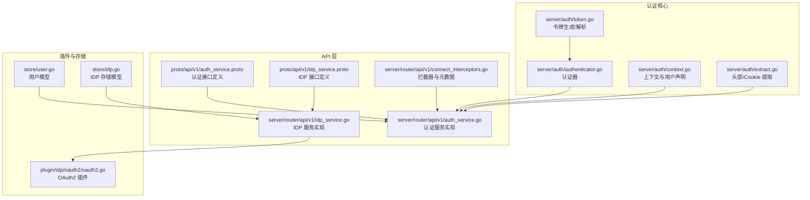
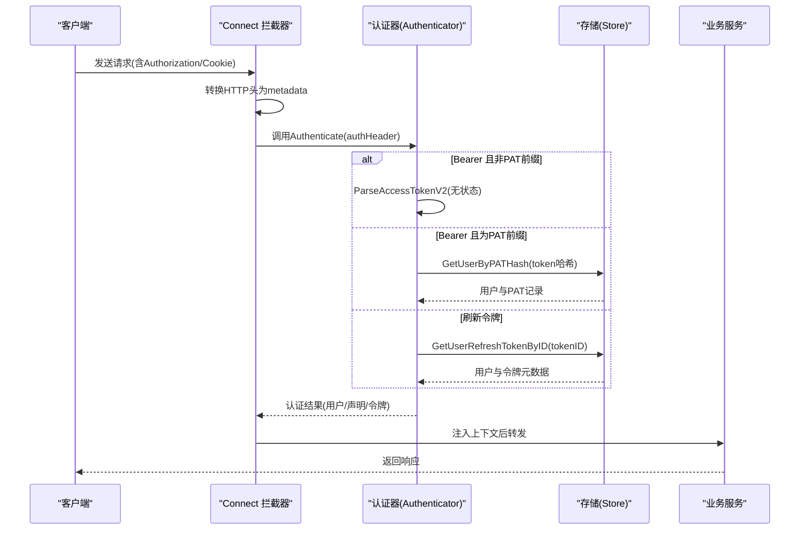
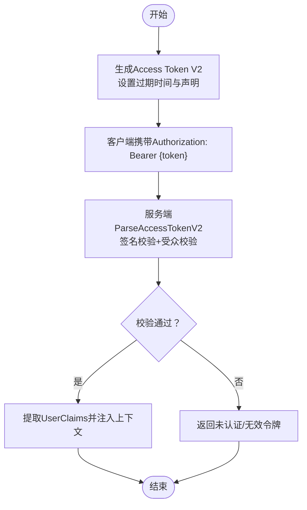
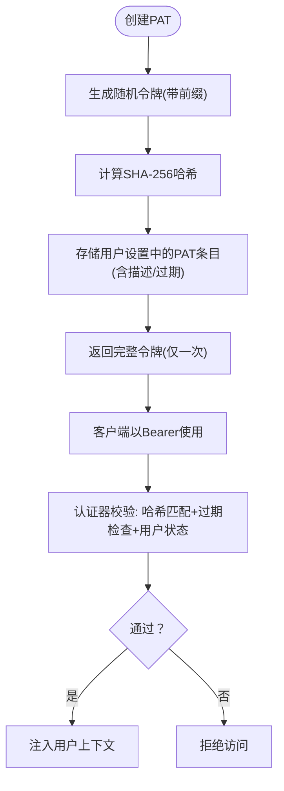
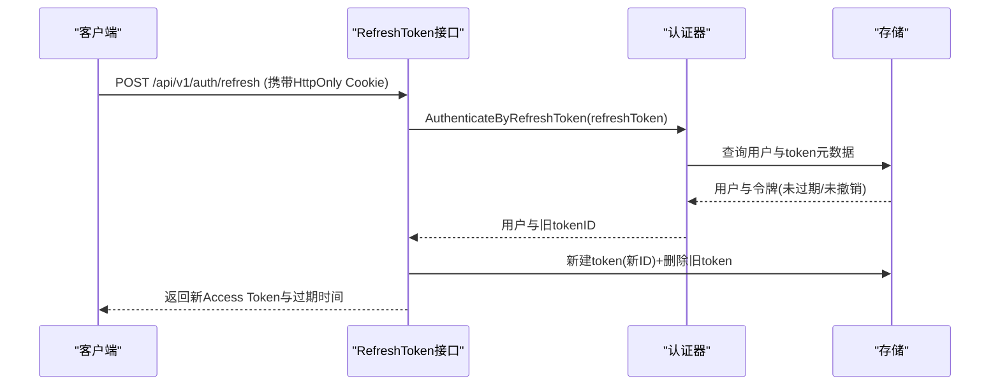
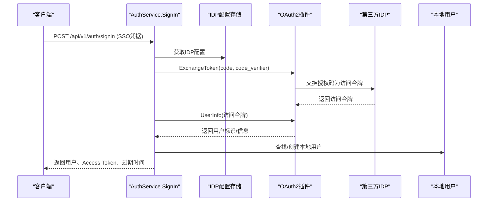
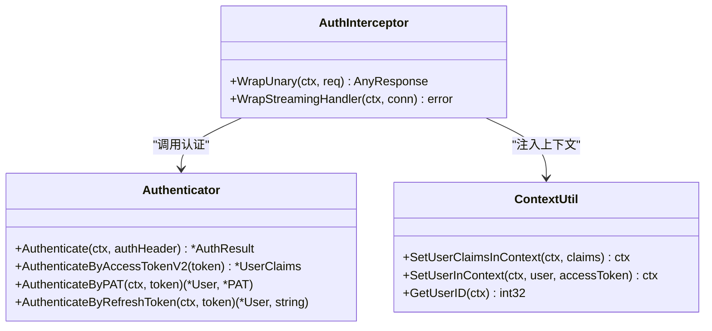
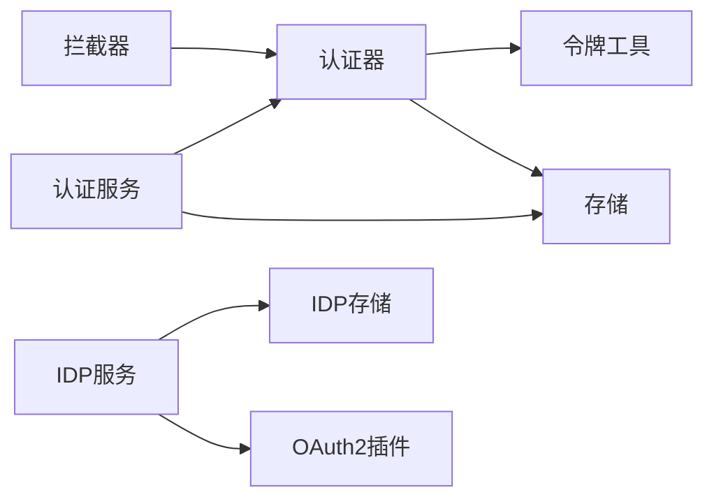

# 认证方式

<cite>
**本文引用的文件**
- [authenticator.go](file://server/auth/authenticator.go)
- [token.go](file://server/auth/token.go)
- [context.go](file://server/auth/context.go)
- [extract.go](file://server/auth/extract.go)
- [auth_service.proto](file://proto/api/v1/auth_service.proto)
- [auth_service.go](file://server/router/api/v1/auth_service.go)
- [connect_interceptors.go](file://server/router/api/v1/connect_interceptors.go)
- [oauth2.go](file://plugin/idp/oauth2/oauth2.go)
- [idp_service.proto](file://proto/api/v1/idp_service.proto)
- [idp_service.go](file://server/router/api/v1/idp_service.go)
- [user_service.go](file://server/router/api/v1/user_service.go)
- [user.go](file://store/user.go)
- [idp.go](file://store/idp.go)
</cite>

## 目录
1. [简介](#简介)
2. [项目结构与认证相关模块](#项目结构与认证相关模块)
3. [核心组件](#核心组件)
4. [架构总览](#架构总览)
5. [详细组件分析](#详细组件分析)
6. [依赖关系分析](#依赖关系分析)
7. [性能与安全考量](#性能与安全考量)
8. [故障排查指南](#故障排查指南)
9. [结论](#结论)
10. [附录：API 使用与最佳实践](#附录api-使用与最佳实践)

## 简介
本文件系统性阐述本项目的认证体系，覆盖以下能力：
- 基于短生命周期访问令牌（Access Token V2）的无状态认证
- 基于长期令牌（Personal Access Token，简称 PAT）的程序化访问
- 基于刷新令牌（Refresh Token）的会话轮换与续期
- 身份提供商（IDP）集成，以 OAuth2 为例的第三方登录流程
- 令牌生成、验证、轮换与撤销的完整工作流
- 安全特性、适用场景与最佳实践
- 具体 API 使用路径与调用示例

## 项目结构与认证相关模块
认证相关代码主要分布在如下位置：
- server/auth：令牌生成、解析、认证器与上下文工具
- server/router/api/v1：认证服务、IDP 管理服务、拦截器
- plugin/idp/oauth2：OAuth2 身份提供商插件
- proto/api/v1：认证与 IDP 的 API 定义
- store：用户与 IDP 配置的数据模型与存取

**图表来源**
- [token.go](file://server/auth/token.go#L1-L250)
- [authenticator.go](file://server/auth/authenticator.go#L1-L166)
- [context.go](file://server/auth/context.go#L1-L84)
- [extract.go](file://server/auth/extract.go#L1-L34)
- [auth_service.proto](file://proto/api/v1/auth_service.proto#L1-L115)
- [auth_service.go](file://server/router/api/v1/auth_service.go#L1-L613)
- [idp_service.proto](file://proto/api/v1/idp_service.proto#L1-L148)
- [idp_service.go](file://server/router/api/v1/idp_service.go#L1-L239)
- [connect_interceptors.go](file://server/router/api/v1/connect_interceptors.go#L1-L275)
- [oauth2.go](file://plugin/idp/oauth2/oauth2.go#L1-L135)
- [user.go](file://store/user.go#L1-L162)
- [idp.go](file://store/idp.go#L1-L183)

**章节来源**
- [token.go](file://server/auth/token.go#L1-L250)
- [authenticator.go](file://server/auth/authenticator.go#L1-L166)
- [context.go](file://server/auth/context.go#L1-L84)
- [extract.go](file://server/auth/extract.go#L1-L34)
- [auth_service.proto](file://proto/api/v1/auth_service.proto#L1-L115)
- [auth_service.go](file://server/router/api/v1/auth_service.go#L1-L613)
- [idp_service.proto](file://proto/api/v1/idp_service.proto#L1-L148)
- [idp_service.go](file://server/router/api/v1/idp_service.go#L1-L239)
- [connect_interceptors.go](file://server/router/api/v1/connect_interceptors.go#L1-L275)
- [oauth2.go](file://plugin/idp/oauth2/oauth2.go#L1-L135)
- [user.go](file://store/user.go#L1-L162)
- [idp.go](file://store/idp.go#L1-L183)

## 核心组件
- 令牌生成与解析
  - Access Token V2：15 分钟有效期，无状态验证（仅签名）
  - Refresh Token：30 天有效期，有状态验证（数据库校验撤销与过期）
  - PAT：长期令牌，用于程序化访问，哈希持久化，可设置过期
- 认证器 Authenticator
  - 支持 Access Token V2 无状态校验与 PAT 校验；刷新令牌通过数据库校验
- 上下文与声明
  - UserClaims：从 Access Token 中提取的用户信息
  - SetUserClaimsInContext/SetUserInContext：在请求上下文中注入用户信息
- 拦截器与元数据
  - 将 HTTP 请求头转换为 gRPC 元数据，透传 Cookie 与 User-Agent 等
- IDP 集成
  - OAuth2 插件：支持授权码交换、PKCE、用户信息映射

**章节来源**
- [token.go](file://server/auth/token.go#L25-L187)
- [authenticator.go](file://server/auth/authenticator.go#L26-L166)
- [context.go](file://server/auth/context.go#L63-L83)
- [connect_interceptors.go](file://server/router/api/v1/connect_interceptors.go#L31-L87)

## 架构总览
认证架构由“令牌生成—请求拦截—认证决策—上下文注入—业务处理”构成。请求进入后，拦截器提取认证头或 Cookie，交由认证器进行多策略认证，成功后将用户信息注入上下文，供后续业务逻辑使用。

**图表来源**
- [connect_interceptors.go](file://server/router/api/v1/connect_interceptors.go#L221-L274)
- [authenticator.go](file://server/auth/authenticator.go#L136-L166)
- [token.go](file://server/auth/token.go#L219-L249)
- [auth_service.go](file://server/router/api/v1/auth_service.go#L192-L238)

## 详细组件分析

### 组件一：Access Token V2（短期令牌）
- 用途：API 请求的短期访问令牌，15 分钟有效，无状态验证
- 生成：包含标准声明与自定义字段（角色、状态、用户名），使用服务器密钥签名
- 验证：仅需密钥与签名校验，无需查库
- 场景：浏览器端交互、移动端应用、服务间短时访问

**图表来源**
- [token.go](file://server/auth/token.go#L133-L160)
- [token.go](file://server/auth/token.go#L219-L233)
- [context.go](file://server/auth/context.go#L63-L83)

**章节来源**
- [token.go](file://server/auth/token.go#L25-L160)
- [context.go](file://server/auth/context.go#L63-L83)

### 组件二：Personal Access Token（PAT，长期令牌）
- 用途：程序化访问（CLI、第三方集成），可设置过期时间
- 生成：随机字符串并带固定前缀，仅在创建时返回完整令牌
- 存储：仅保存 SHA-256 哈希，支持按用户维度管理
- 使用：以 Bearer 方式携带，认证器优先识别 PAT 前缀并走数据库校验
- 场景：自动化脚本、CI/CD、外部工具集成

**图表来源**
- [token.go](file://server/auth/token.go#L189-L203)
- [authenticator.go](file://server/auth/authenticator.go#L101-L124)
- [user_service.go](file://server/router/api/v1/user_service.go#L569-L635)

**章节来源**
- [token.go](file://server/auth/token.go#L189-L203)
- [authenticator.go](file://server/auth/authenticator.go#L101-L124)
- [user_service.go](file://server/router/api/v1/user_service.go#L569-L635)

### 组件三：Refresh Token（刷新令牌）
- 用途：换取新的 Access Token V2，实现“滑动窗口会话”
- 生成：30 天有效期，包含 tokenID 以便撤销与轮换
- 轮换：旧令牌撤销，新令牌入库并写入 HttpOnly Cookie
- 场景：保持长期在线、提升安全性（被窃取后快速失效）

**图表来源**
- [auth_service.go](file://server/router/api/v1/auth_service.go#L272-L357)
- [authenticator.go](file://server/auth/authenticator.go#L60-L99)
- [token.go](file://server/auth/token.go#L162-L187)

**章节来源**
- [auth_service.go](file://server/router/api/v1/auth_service.go#L272-L357)
- [authenticator.go](file://server/auth/authenticator.go#L60-L99)
- [token.go](file://server/auth/token.go#L162-L187)

### 组件四：IDP（身份提供商）集成（OAuth2）
- 用途：支持第三方登录（如企业微信、GitHub、Google 等）
- 流程：配置 OAuth2 参数 → 引导用户到授权页 → 回调获取授权码 → 交换访问令牌 → 获取用户信息 → 创建/关联本地用户 → 返回会话令牌
- 安全：支持 PKCE（code_verifier），可配置标识符过滤正则

**图表来源**
- [auth_service.go](file://server/router/api/v1/auth_service.go#L55-L190)
- [oauth2.go](file://plugin/idp/oauth2/oauth2.go#L43-L134)
- [idp_service.proto](file://proto/api/v1/idp_service.proto#L14-L49)
- [idp_service.go](file://server/router/api/v1/idp_service.go#L16-L159)

**章节来源**
- [auth_service.go](file://server/router/api/v1/auth_service.go#L55-L190)
- [oauth2.go](file://plugin/idp/oauth2/oauth2.go#L19-L135)
- [idp_service.proto](file://proto/api/v1/idp_service.proto#L14-L49)
- [idp_service.go](file://server/router/api/v1/idp_service.go#L16-L159)

### 组件五：拦截器与上下文注入
- 拦截器负责：
  - 将 HTTP 头转换为 gRPC 元数据（User-Agent、X-Forwarded-For、Cookie 等）
  - 从 Authorization 头中提取 Bearer 令牌，优先尝试 Access Token V2，再尝试 PAT
  - 对非公开方法强制要求认证
- 上下文注入：
  - Access Token：注入 UserClaims 与用户 ID
  - PAT：注入完整用户对象与访问令牌字符串

**图表来源**
- [connect_interceptors.go](file://server/router/api/v1/connect_interceptors.go#L221-L274)
- [authenticator.go](file://server/auth/authenticator.go#L136-L166)
- [context.go](file://server/auth/context.go#L48-L83)

**章节来源**
- [connect_interceptors.go](file://server/router/api/v1/connect_interceptors.go#L19-L87)
- [authenticator.go](file://server/auth/authenticator.go#L136-L166)
- [context.go](file://server/auth/context.go#L48-L83)

## 依赖关系分析
- 认证器依赖：
  - 令牌解析函数（Access/Refresh）
  - 存储层查询用户与令牌元数据
- 服务层依赖：
  - 认证器进行认证决策
  - 拦截器负责请求预处理与上下文注入
- IDP 依赖：
  - OAuth2 插件封装第三方交互细节
  - IDP 配置存储于用户设置表中

**图表来源**
- [connect_interceptors.go](file://server/router/api/v1/connect_interceptors.go#L221-L274)
- [authenticator.go](file://server/auth/authenticator.go#L136-L166)
- [auth_service.go](file://server/router/api/v1/auth_service.go#L55-L190)
- [idp_service.go](file://server/router/api/v1/idp_service.go#L16-L159)
- [oauth2.go](file://plugin/idp/oauth2/oauth2.go#L19-L135)

**章节来源**
- [authenticator.go](file://server/auth/authenticator.go#L1-L166)
- [auth_service.go](file://server/router/api/v1/auth_service.go#L1-L613)
- [idp_service.go](file://server/router/api/v1/idp_service.go#L1-L239)
- [oauth2.go](file://plugin/idp/oauth2/oauth2.go#L1-L135)

## 性能与安全考量
- 性能
  - Access Token V2 无状态验证，避免数据库查询，适合高并发 API 调用
  - PAT 与 Refresh Token 需要数据库查询，应配合缓存与索引优化
- 安全
  - Access Token 15 分钟有效期，降低泄露风险
  - Refresh Token 30 天有效期，采用“轮换”策略，被窃取后立即失效
  - HttpOnly Cookie 保护刷新令牌，减少 XSS 风险
  - PAT 仅在创建时可见，建议最小权限与定期轮换
  - OAuth2 支持 PKCE，增强授权码保护
- 可运维性
  - 通过用户设置记录刷新令牌元数据（设备、IP、UA），便于审计与撤销

[本节为通用指导，不直接分析具体文件]

## 故障排查指南
- 未认证/401
  - 检查是否携带正确的 Authorization 头（Bearer）
  - 确认 Access Token 是否过期或签名校验失败
  - 若使用 PAT，请确认哈希匹配与未过期
- 刷新失败/401
  - 检查 HttpOnly Cookie 是否正确传递
  - 确认刷新令牌未被撤销或已过期
- OAuth2 登录失败
  - 检查 IDP 配置（ClientId/Secret/Endpoints/FieldMapping）
  - 确认回调地址与 code_verifier（若启用 PKCE）
  - 查看用户标识符是否匹配标识符过滤规则

**章节来源**
- [authenticator.go](file://server/auth/authenticator.go#L136-L166)
- [auth_service.go](file://server/router/api/v1/auth_service.go#L272-L357)
- [oauth2.go](file://plugin/idp/oauth2/oauth2.go#L24-L78)

## 结论
本项目采用“短期访问令牌 + 长期 PAT + 刷新令牌轮换”的混合认证方案，并通过拦截器与认证器实现统一的认证入口。结合 IDP 插件，既满足内部密码登录，也支持企业级 OAuth2 单点登录。整体设计兼顾性能、安全与可运维性。

[本节为总结，不直接分析具体文件]

## 附录：API 使用与最佳实践

### API 使用路径
- 获取当前用户
  - 方法：GET /api/v1/auth/me
  - 认证：需要 Access Token
  - 返回：当前用户信息
  - 参考：[auth_service.proto](file://proto/api/v1/auth_service.proto#L13-L53)
- 密码登录/SSO 登录
  - 方法：POST /api/v1/auth/signin
  - 认证：无需
  - 行为：返回 Access Token 与过期时间，并设置刷新令牌 Cookie
  - 参考：[auth_service.go](file://server/router/api/v1/auth_service.go#L55-L190)
- 刷新访问令牌
  - 方法：POST /api/v1/auth/refresh
  - 认证：需刷新令牌 Cookie
  - 行为：返回新的 Access Token 与过期时间
  - 参考：[auth_service.go](file://server/router/api/v1/auth_service.go#L272-L357)
- 注销
  - 方法：POST /api/v1/auth/signout
  - 认证：需 Access Token
  - 行为：撤销刷新令牌并清除 Cookie
  - 参考：[auth_service.go](file://server/router/api/v1/auth_service.go#L240-L270)
- 创建/删除 PAT
  - 方法：POST /api/v1/users/{uid}/personalAccessTokens
  - 认证：需会话或 Access Token
  - 行为：创建并返回完整令牌；删除后立即失效
  - 参考：[user_service.go](file://server/router/api/v1/user_service.go#L569-L635)
- IDP 管理
  - 方法：GET/POST/PATCH/DELETE /api/v1/identity-providers
  - 认证：需管理员权限
  - 行为：增删改查 IDP 配置（OAuth2）
  - 参考：[idp_service.proto](file://proto/api/v1/idp_service.proto#L14-L49)，[idp_service.go](file://server/router/api/v1/idp_service.go#L16-L159)

### 最佳实践
- Access Token V2
  - 仅保存在内存，不在前端持久化存储
  - 在到期前自动调用刷新接口
- PAT
  - 严格限制权限范围与过期时间
  - 定期轮换，及时撤销不再使用的令牌
- 刷新令牌
  - 仅通过 HttpOnly Cookie 传输
  - 启用“轮换”策略，保持长期在线同时降低风险
- OAuth2
  - 启用 PKCE（code_verifier）
  - 配置标识符过滤正则，限制可登录的用户范围
- 审计与监控
  - 关注刷新令牌的设备/IP/UA 信息，发现异常及时撤销

**章节来源**
- [auth_service.proto](file://proto/api/v1/auth_service.proto#L13-L115)
- [user_service.go](file://server/router/api/v1/user_service.go#L569-L635)
- [idp_service.proto](file://proto/api/v1/idp_service.proto#L14-L148)
- [auth_service.go](file://server/router/api/v1/auth_service.go#L55-L190)