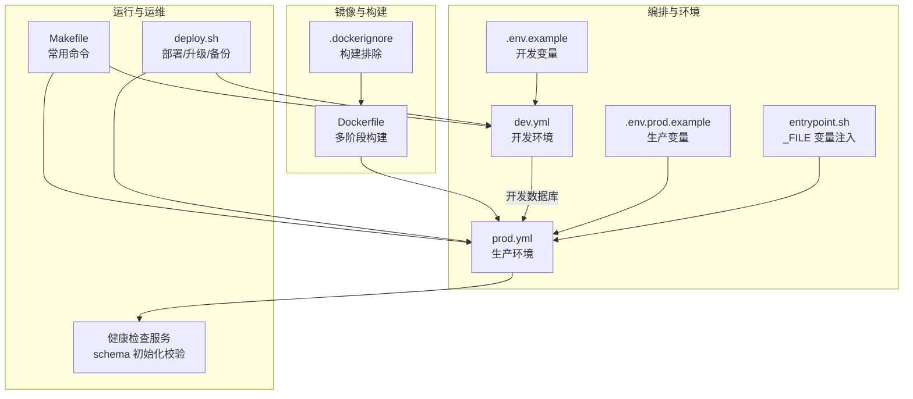
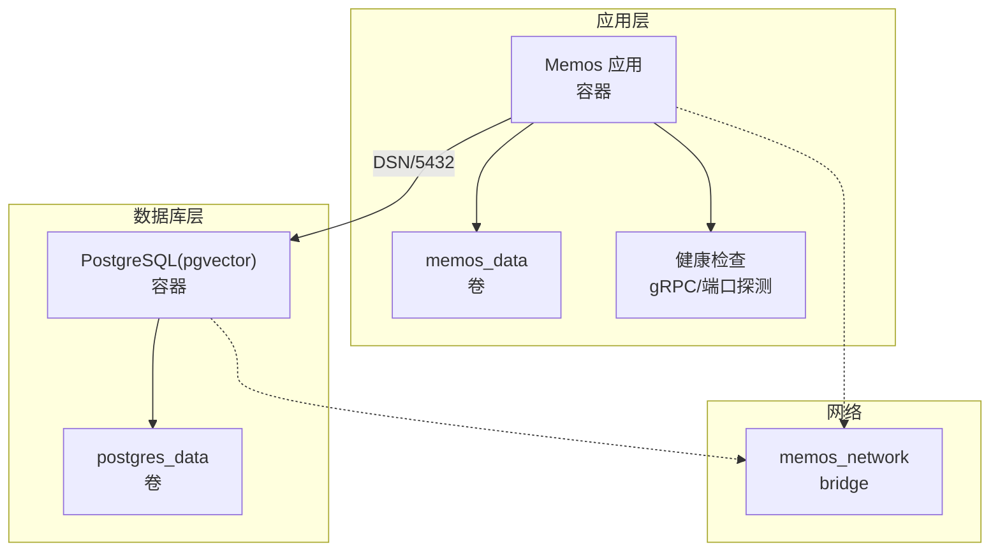
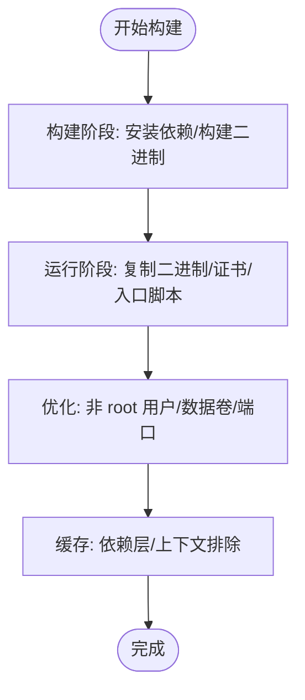
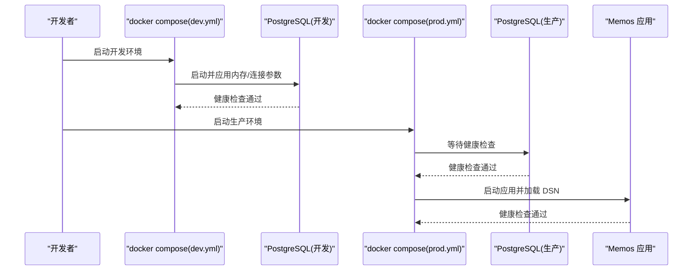
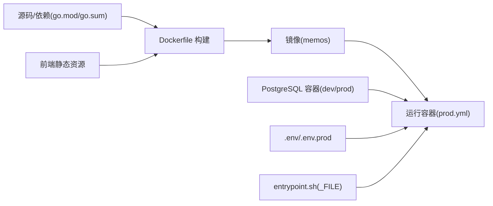

# Docker 容器化部署

<cite>
**本文引用的文件**
- [Dockerfile](file://docker/Dockerfile)
- [开发环境 compose](file://docker/compose/dev.yml)
- [生产环境 compose](file://docker/compose/prod.yml)
- [Docker 使用说明](file://docker/README.md)
- [入口脚本](file://scripts/entrypoint.sh)
- [.env 示例](file://.env.example)
- [.env.prod 示例](file://deploy/aliyun/.env.prod.example)
- [部署脚本](file://deploy/aliyun/deploy.sh)
- [.dockerignore](file://.dockerignore)
- [Makefile](file://Makefile)
- [健康检查服务](file://server/router/api/v1/health_service.go)
</cite>

## 目录
1. [简介](#简介)
2. [项目结构](#项目结构)
3. [核心组件](#核心组件)
4. [架构总览](#架构总览)
5. [组件详解](#组件详解)
6. [依赖关系分析](#依赖关系分析)
7. [性能与优化](#性能与优化)
8. [故障排查指南](#故障排查指南)
9. [结论](#结论)
10. [附录](#附录)

## 简介
本指南面向希望使用 Docker 进行 Memos 容器化部署的用户，涵盖镜像构建、多阶段与层缓存优化、Compose 配置（开发/生产）、PostgreSQL 容器参数（内存、连接数、向量扩展）、卷与数据持久化、健康检查与资源限制、网络与端口映射、以及环境变量传递等关键主题。文中所有技术细节均基于仓库中的实际配置文件与脚本进行整理与说明。

## 项目结构
与 Docker 容器化相关的核心文件组织如下：
- docker/Dockerfile：生产镜像构建（多阶段、静态二进制、非 root 用户）
- docker/compose/dev.yml：开发环境（PostgreSQL + pgvector）
- docker/compose/prod.yml：生产环境（PostgreSQL + Memos 服务）
- docker/README.md：Docker 使用说明与环境变量表
- scripts/entrypoint.sh：容器启动入口脚本（支持 _FILE 形式的敏感变量注入）
- .env.example 与 deploy/aliyun/.env.prod.example：环境变量模板
- deploy/aliyun/deploy.sh：生产部署脚本（镜像构建/拉取、升级、备份/恢复、资源限制）
- .dockerignore：构建排除清单
- Makefile：常用 docker-compose 命令别名
- server/router/api/v1/health_service.go：服务健康检查逻辑（数据库初始化与 schema 校验）

**图表来源**
- [Dockerfile](file://docker/Dockerfile#L1-L58)
- [.dockerignore](file://.dockerignore#L1-L16)
- [开发环境 compose](file://docker/compose/dev.yml#L1-L49)
- [生产环境 compose](file://docker/compose/prod.yml#L1-L119)
- [.env 示例](file://.env.example#L1-L58)
- [.env.prod 示例](file://deploy/aliyun/.env.prod.example#L1-L103)
- [入口脚本](file://scripts/entrypoint.sh#L1-L32)
- [Makefile](file://Makefile#L132-L169)
- [部署脚本](file://deploy/aliyun/deploy.sh#L1-L601)
- [健康检查服务](file://server/router/api/v1/health_service.go#L1-L25)

**章节来源**
- [Docker 使用说明](file://docker/README.md#L1-L64)
- [Dockerfile](file://docker/Dockerfile#L1-L58)
- [.dockerignore](file://.dockerignore#L1-L16)
- [开发环境 compose](file://docker/compose/dev.yml#L1-L49)
- [生产环境 compose](file://docker/compose/prod.yml#L1-L119)
- [.env 示例](file://.env.example#L1-L58)
- [.env.prod 示例](file://deploy/aliyun/.env.prod.example#L1-L103)
- [入口脚本](file://scripts/entrypoint.sh#L1-L32)
- [Makefile](file://Makefile#L132-L169)
- [部署脚本](file://deploy/aliyun/deploy.sh#L1-L601)
- [健康检查服务](file://server/router/api/v1/health_service.go#L1-L25)

## 核心组件
- 多阶段构建镜像：后端构建阶段使用 golang:1.25-alpine，下载依赖并构建静态二进制；最终运行阶段使用 alpine:3.21，非 root 用户运行，暴露数据卷与端口。
- Compose 编排：dev.yml 专注开发体验（端口映射、健康检查、资源限制），prod.yml 专注生产（镜像选择、网络隔离、卷持久化、健康检查、资源限制、DSN 环境变量）。
- 入口脚本：支持 MEMOS_DSN_FILE 等变量以文件形式注入敏感值，避免明文暴露。
- 环境变量：统一前缀 MEMOS_，支持通过 .env 或系统环境变量（结合 .env.prod 的示例）传入。
- 健康检查：PostgreSQL 使用 pg_isready；应用服务通过 gRPC 健康检查接口验证数据库初始化与 schema 版本。

**章节来源**
- [Dockerfile](file://docker/Dockerfile#L1-L58)
- [开发环境 compose](file://docker/compose/dev.yml#L1-L49)
- [生产环境 compose](file://docker/compose/prod.yml#L1-L119)
- [入口脚本](file://scripts/entrypoint.sh#L1-L32)
- [.env 示例](file://.env.example#L1-L58)
- [.env.prod 示例](file://deploy/aliyun/.env.prod.example#L1-L103)
- [健康检查服务](file://server/router/api/v1/health_service.go#L1-L25)

## 架构总览
下图展示生产环境的容器化架构：Memos 应用容器依赖已健康运行的 PostgreSQL 容器，二者通过自定义桥接网络通信，数据通过命名卷持久化，应用通过健康检查保障可用性。

**图表来源**
- [生产环境 compose](file://docker/compose/prod.yml#L57-L110)
- [健康检查服务](file://server/router/api/v1/health_service.go#L11-L24)

**章节来源**
- [生产环境 compose](file://docker/compose/prod.yml#L1-L119)
- [健康检查服务](file://server/router/api/v1/health_service.go#L1-L25)

## 组件详解

### Dockerfile 构建与镜像优化
- 多阶段构建
  - 构建阶段：基于 golang:1.25-alpine，安装 git/ca-certificates，使用 GOPROXY 加速下载依赖，复制源码并构建静态二进制（CGO_ENABLED=0、-trimpath、-ldflags 去除符号表）。
  - 运行阶段：基于 alpine:3.21，安装时区与证书，创建非 root 用户与数据目录，复制二进制与入口脚本，切换用户，声明数据卷与端口，设置默认环境变量。
- 层缓存利用
  - go.mod/go.sum 先复制再构建，确保依赖变更才重建后续层。
  - .dockerignore 排除 web/node_modules、web/dist、docs 等无关目录，减少上下文体积。
- 安全与合规
  - 非 root 用户运行，最小权限原则。
  - 使用只读根文件系统倾向（运行阶段未显式设置，但可按需启用）。
- 入口脚本
  - 支持 _FILE 形式的敏感变量注入（如 MEMOS_DSN_FILE），避免明文配置。

**图表来源**
- [Dockerfile](file://docker/Dockerfile#L1-L58)
- [.dockerignore](file://.dockerignore#L1-L16)
- [入口脚本](file://scripts/entrypoint.sh#L1-L32)

**章节来源**
- [Dockerfile](file://docker/Dockerfile#L1-L58)
- [.dockerignore](file://.dockerignore#L1-L16)
- [入口脚本](file://scripts/entrypoint.sh#L1-L32)

### docker-compose 配置（开发与生产）
- 开发环境（dev.yml）
  - 使用 pgvector/pgvector:pg16，设置数据库名、用户、密码与信任认证。
  - 内存参数：shared_buffers、effective_cache_size、maintenance_work_mem、work_mem。
  - 最大连接数：max_connections。
  - 启动时加载 vector 扩展：shared_preload_libraries=vector。
  - 健康检查：pg_isready，短间隔快速反馈。
  - 资源限制：限制 CPU 与内存，预留资源。
  - 端口映射：25432:5432，便于本地调试。
- 生产环境（prod.yml）
  - 使用 memos:latest 镜像，依赖 postgres 服务健康。
  - DSN 通过环境变量 MEMOS_DSN 指向 postgres:5432，默认 sslmode=disable。
  - 网络：自定义 bridge 网络 memos_network。
  - 卷：postgres_data、memos_data。
  - 健康检查：应用通过 gRPC 健康检查；数据库通过 pg_isready。
  - 资源限制：CPU 与内存上限与预留。
  - 环境变量：MEMOS_MODE、MEMOS_PORT、MEMOS_ADDR、MEMOS_DRIVER、MEMOS_DSN、MEMOS_INSTANCE_URL、AI 相关变量等。

**图表来源**
- [开发环境 compose](file://docker/compose/dev.yml#L1-L49)
- [生产环境 compose](file://docker/compose/prod.yml#L1-L119)

**章节来源**
- [开发环境 compose](file://docker/compose/dev.yml#L1-L49)
- [生产环境 compose](file://docker/compose/prod.yml#L1-L119)

### PostgreSQL 容器配置（内存、连接数、向量扩展）
- 内存设置（开发/生产一致）：
  - shared_buffers、effective_cache_size、maintenance_work_mem、work_mem。
- 连接数限制：
  - max_connections 控制最大并发连接。
- 向量扩展：
  - 通过 shared_preload_libraries=vector 预加载 pgvector 扩展。
- 初始化脚本：
  - 生产环境挂载数据库初始化 SQL 目录至 /docker-entrypoint-initdb.d:ro，实现首次创建时自动执行。
- 健康检查：
  - 使用 pg_isready 检测数据库可用性，开发/生产分别设置不同间隔与重试次数。

**章节来源**
- [开发环境 compose](file://docker/compose/dev.yml#L12-L44)
- [生产环境 compose](file://docker/compose/prod.yml#L22-L56)

### 卷挂载与数据持久化
- PostgreSQL 数据卷：
  - postgres_data：持久化数据库数据目录。
- Memos 附件卷：
  - memos_data：持久化应用数据目录（镜像声明 VOLUME /var/opt/memos）。
- 初始化脚本：
  - 生产环境将 store/migration/postgres 挂载为只读，首次启动执行初始化 SQL。
- 备份与恢复：
  - 部署脚本提供备份/恢复功能，支持压缩导出与自动清理。

**章节来源**
- [生产环境 compose](file://docker/compose/prod.yml#L28-L31)
- [部署脚本](file://deploy/aliyun/deploy.sh#L424-L501)

### 健康检查与资源限制
- 健康检查
  - PostgreSQL：pg_isready，开发短周期，生产较长周期。
  - 应用：通过 gRPC 健康检查接口验证数据库初始化与 schema 版本。
- 资源限制
  - 开发/生产均设置 CPU 与内存上限与预留，避免资源争抢。
- 启动顺序
  - 生产环境使用 depends_on: service_healthy，确保数据库健康后再启动应用。

**章节来源**
- [开发环境 compose](file://docker/compose/dev.yml#L22-L44)
- [生产环境 compose](file://docker/compose/prod.yml#L64-L110)
- [健康检查服务](file://server/router/api/v1/health_service.go#L11-L24)

### 网络、端口映射与环境变量传递
- 网络
  - 生产环境使用自定义 bridge 网络 memos_network，容器间通过服务名通信。
- 端口映射
  - 开发环境：25432:5432，便于本地直连数据库。
  - 生产环境：MEMOS_PORT 映射至 5230，可选外部映射（POSTGRES_PORT_MAPPING）。
- 环境变量
  - 统一前缀 MEMOS_，支持 .env 与系统环境变量（结合 .env.prod 示例）。
  - DSN 支持 _FILE 形式注入（入口脚本）。
  - AI 功能相关变量（提供商、模型、API Key）集中于 .env.prod 示例。

**章节来源**
- [生产环境 compose](file://docker/compose/prod.yml#L90-L91)
- [开发环境 compose](file://docker/compose/dev.yml#L18-L19)
- [.env 示例](file://.env.example#L22-L51)
- [.env.prod 示例](file://deploy/aliyun/.env.prod.example#L22-L103)
- [入口脚本](file://scripts/entrypoint.sh#L1-L32)

## 依赖关系分析
- 构建依赖
  - Dockerfile 依赖 go.mod/go.sum 与源码；.dockerignore 控制上下文大小。
  - 前端静态资源需在构建前生成（Dockerfile 注释提示）。
- 运行依赖
  - 生产环境依赖 PostgreSQL 容器健康；应用通过 gRPC 健康检查进一步验证初始化。
  - 环境变量通过 .env 与系统环境变量传递，入口脚本支持 _FILE 形式注入。

**图表来源**
- [Dockerfile](file://docker/Dockerfile#L1-L58)
- [.dockerignore](file://.dockerignore#L1-L16)
- [生产环境 compose](file://docker/compose/prod.yml#L60-L110)
- [开发环境 compose](file://docker/compose/dev.yml#L4-L44)
- [.env 示例](file://.env.example#L1-L58)
- [.env.prod 示例](file://deploy/aliyun/.env.prod.example#L1-L103)
- [入口脚本](file://scripts/entrypoint.sh#L1-L32)

**章节来源**
- [Dockerfile](file://docker/Dockerfile#L1-L58)
- [.dockerignore](file://.dockerignore#L1-L16)
- [生产环境 compose](file://docker/compose/prod.yml#L1-L119)
- [开发环境 compose](file://docker/compose/dev.yml#L1-L49)
- [.env 示例](file://.env.example#L1-L58)
- [.env.prod 示例](file://deploy/aliyun/.env.prod.example#L1-L103)
- [入口脚本](file://scripts/entrypoint.sh#L1-L32)

## 性能与优化
- 镜像构建
  - 使用多阶段构建与静态二进制，减小镜像体积与攻击面。
  - 依赖层缓存与 .dockerignore 排除无关文件，提升构建速度。
- 数据库性能
  - 合理设置 shared_buffers、effective_cache_size、work_mem、maintenance_work_mem，避免过度占用内存。
  - 控制 max_connections，防止连接风暴。
  - 预加载 vector 扩展，减少首次查询延迟。
- 资源限制
  - 为数据库与应用分别设置 CPU/内存上限与预留，避免资源争抢。
- 健康检查
  - 数据库短周期健康检查，应用长周期健康检查，平衡可用性与开销。

**章节来源**
- [Dockerfile](file://docker/Dockerfile#L1-L58)
- [.dockerignore](file://.dockerignore#L1-L16)
- [开发环境 compose](file://docker/compose/dev.yml#L12-L44)
- [生产环境 compose](file://docker/compose/prod.yml#L39-L56)

## 故障排查指南
- 服务无法启动
  - 查看日志：使用 Makefile 或部署脚本提供的日志命令。
  - 查看资源使用：docker stats。
- 数据库问题
  - 检查 pgvector 扩展是否加载。
  - 查看数据库 schema 版本，确认初始化是否完成。
- 升级与回滚
  - 升级前自动备份，执行增量迁移后重启服务。
  - 回滚：使用备份文件恢复数据库并重启服务。
- 环境变量问题
  - 确认 MEMOS_DSN 是否正确，必要时使用 MEMOS_DSN_FILE 注入。
  - 检查 .env 与系统环境变量的优先级与拼写。

**章节来源**
- [Docker 使用说明](file://docker/README.md#L16-L64)
- [部署脚本](file://deploy/aliyun/deploy.sh#L380-L501)
- [健康检查服务](file://server/router/api/v1/health_service.go#L11-L24)

## 结论
本指南基于仓库中的实际配置，系统性地梳理了 Memos 的 Docker 容器化部署要点：多阶段构建与层缓存、开发/生产 Compose 差异、PostgreSQL 内存与向量扩展配置、卷与持久化、健康检查与资源限制、网络与端口映射、以及环境变量传递策略。结合部署脚本与健康检查服务，可实现稳定、可观测且易于维护的容器化运行环境。

## 附录
- 常用命令
  - 开发：make docker-up / docker-logs / docker-down
  - 生产：make docker-prod-up / docker-prod-logs / docker-prod-down
- 环境变量参考
  - MEMOS_DRIVER、MEMOS_DSN、MEMOS_AI_* 等，详见 .env 示例与 .env.prod 示例。

**章节来源**
- [Makefile](file://Makefile#L132-L169)
- [.env 示例](file://.env.example#L22-L51)
- [.env.prod 示例](file://deploy/aliyun/.env.prod.example#L22-L103)