# Kubernetes 部署

<cite>
**本文引用的文件**
- [deploy.sh](file://deploy/aliyun/deploy.sh)
- [README.md](file://deploy/aliyun/README.md)
- [.env.prod.example](file://deploy/aliyun/.env.prod.example)
- [prod.yml](file://docker/compose/prod.yml)
- [dev.yml](file://docker/compose/dev.yml)
- [Dockerfile](file://docker/Dockerfile)
- [entrypoint.sh](file://scripts/entrypoint.sh)
- [logger.go](file://server/internal/observability/logger.go)
</cite>

## 目录
1. [简介](#简介)
2. [项目结构](#项目结构)
3. [核心组件](#核心组件)
4. [架构总览](#架构总览)
5. [详细组件分析](#详细组件分析)
6. [依赖关系分析](#依赖关系分析)
7. [性能考量](#性能考量)
8. [故障排查指南](#故障排查指南)
9. [结论](#结论)
10. [附录](#附录)

## 简介
本指南面向希望在 Kubernetes 集群中部署 Memos 的工程团队，结合仓库中的单机部署脚本与 Compose 配置，系统讲解如何将现有容器化方案迁移到 Kubernetes 环境，并扩展出面向生产的 Deployment、Service、ConfigMap、Secret、Ingress、Helm Chart 使用、滚动更新与蓝绿/金丝雀发布策略，以及数据库高可用与监控日志集成方案。  
本指南严格基于仓库现有文件进行分析与映射，避免臆造未出现的配置。

## 项目结构
围绕 Kubernetes 部署，与之直接相关的文件主要集中在以下路径：
- 部署脚本与说明：deploy/aliyun
- Compose 配置：docker/compose
- 容器镜像构建：docker/Dockerfile
- 运行入口与环境变量注入：scripts/entrypoint.sh
- 日志可观测性：server/internal/observability/logger.go

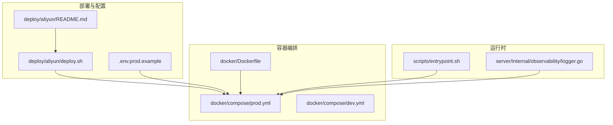

**图表来源**
- [deploy.sh](file://deploy/aliyun/deploy.sh#L1-L601)
- [README.md](file://deploy/aliyun/README.md#L1-L331)
- [.env.prod.example](file://deploy/aliyun/.env.prod.example#L1-L103)
- [prod.yml](file://docker/compose/prod.yml#L1-L119)
- [dev.yml](file://docker/compose/dev.yml#L1-L49)
- [Dockerfile](file://docker/Dockerfile#L1-L58)
- [entrypoint.sh](file://scripts/entrypoint.sh#L1-L32)
- [logger.go](file://server/internal/observability/logger.go#L1-L90)

**章节来源**
- [deploy.sh](file://deploy/aliyun/deploy.sh#L1-L601)
- [README.md](file://deploy/aliyun/README.md#L1-L331)
- [.env.prod.example](file://deploy/aliyun/.env.prod.example#L1-L103)
- [prod.yml](file://docker/compose/prod.yml#L1-L119)
- [dev.yml](file://docker/compose/dev.yml#L1-L49)
- [Dockerfile](file://docker/Dockerfile#L1-L58)
- [entrypoint.sh](file://scripts/entrypoint.sh#L1-L32)
- [logger.go](file://server/internal/observability/logger.go#L1-L90)

## 核心组件
- 应用服务（Memos）：由 Dockerfile 构建的单体镜像，暴露固定端口，使用非 root 用户运行，具备健康检查。
- 数据库（PostgreSQL + pgvector）：通过 Compose 提供，具备内存参数优化与健康检查；支持外部端口映射以便外部工具连接。
- 部署与运维脚本：deploy.sh 提供构建、部署、升级、备份、恢复、日志、状态等能力。
- 环境变量注入：entrypoint.sh 支持通过 _FILE 变量从挂载文件注入敏感配置（如 DSN）。
- 日志可观测性：内置结构化日志字段，便于统一采集与检索。

**章节来源**
- [Dockerfile](file://docker/Dockerfile#L1-L58)
- [prod.yml](file://docker/compose/prod.yml#L1-L119)
- [deploy.sh](file://deploy/aliyun/deploy.sh#L1-L601)
- [entrypoint.sh](file://scripts/entrypoint.sh#L1-L32)
- [logger.go](file://server/internal/observability/logger.go#L1-L90)

## 架构总览
将现有 Compose 架构映射到 Kubernetes 的典型布局：
- 命名空间隔离：应用与数据库分别置于独立命名空间或同命名空间但不同标签。
- Deployment：分别为 Memos 与 PostgreSQL 部署控制器，设置副本数、资源限制与健康检查。
- Service：为 Memos 暴露 ClusterIP/LoadBalancer，为数据库暴露 ClusterIP。
- ConfigMap：存放非敏感配置（如实例 URL、AI Provider 等）。
- Secret：存放敏感配置（如数据库密码、API Key、DSN 文件）。
- Ingress：通过 Ingress 控制器暴露域名与 TLS。
- 存储：PersistentVolumeClaim 绑定到 postgres_data 与 memos_data。
- 网络策略：最小权限与命名空间隔离。
- 调度与亲和性：根据资源需求设置节点亲和性与容忍度。
- 发布策略：滚动更新、蓝绿或金丝雀。

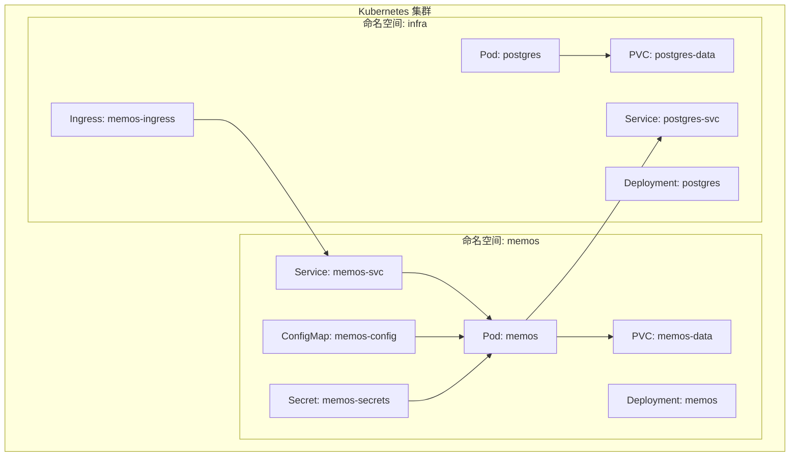

**图表来源**
- [prod.yml](file://docker/compose/prod.yml#L1-L119)
- [.env.prod.example](file://deploy/aliyun/.env.prod.example#L1-L103)
- [Dockerfile](file://docker/Dockerfile#L1-L58)

## 详细组件分析

### Memos 应用容器与健康检查
- 镜像与运行参数：镜像基于 Alpine，非 root 用户运行，暴露固定端口，具备健康检查探测。
- 环境变量：通过 ConfigMap 注入，Secret 注入敏感值；支持 _FILE 变量从挂载文件注入。
- 数据卷：挂载 /var/opt/memos 以持久化附件与缓存。

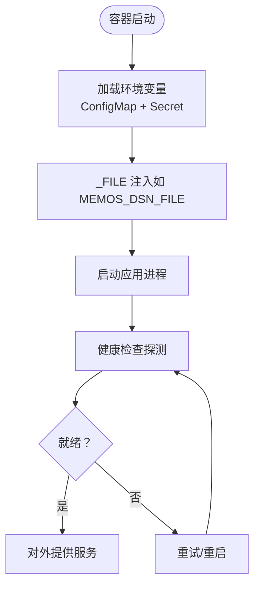

**图表来源**
- [Dockerfile](file://docker/Dockerfile#L1-L58)
- [entrypoint.sh](file://scripts/entrypoint.sh#L1-L32)
- [prod.yml](file://docker/compose/prod.yml#L60-L110)

**章节来源**
- [Dockerfile](file://docker/Dockerfile#L1-L58)
- [entrypoint.sh](file://scripts/entrypoint.sh#L1-L32)
- [prod.yml](file://docker/compose/prod.yml#L60-L110)

### PostgreSQL 数据库与初始化
- 镜像与扩展：使用 pgvector/pgvector:pg16，预加载 vector 扩展。
- 内存参数：通过 Compose 命令行参数设置 shared_buffers、effective_cache_size、work_mem 等。
- 初始化脚本：首次启动挂载 store/migration/postgres 下的 SQL 脚本自动执行。
- 健康检查：使用 pg_isready 检查数据库可用性。
- 外部访问：可选端口映射，便于外部工具连接。

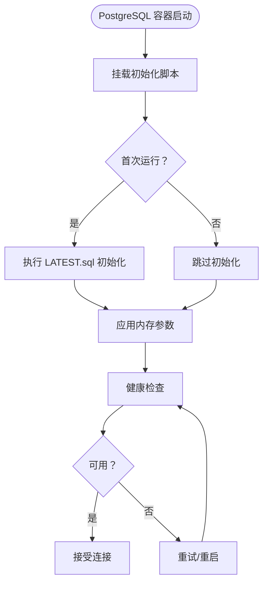

**图表来源**
- [prod.yml](file://docker/compose/prod.yml#L13-L56)
- [dev.yml](file://docker/compose/dev.yml#L4-L44)

**章节来源**
- [prod.yml](file://docker/compose/prod.yml#L13-L56)
- [dev.yml](file://docker/compose/dev.yml#L4-L44)

### 部署脚本与运维能力
- 构建镜像：检查 Go 与前端依赖，构建前端产物与后端二进制，生成镜像。
- 拉取镜像：支持使用预构建镜像替代本地构建。
- 部署/升级：启动服务、等待就绪、执行数据库迁移、重启服务。
- 备份/恢复：pg_dump 备份与恢复，支持自动备份与清理。
- 日志/状态：查看服务日志与资源使用情况。

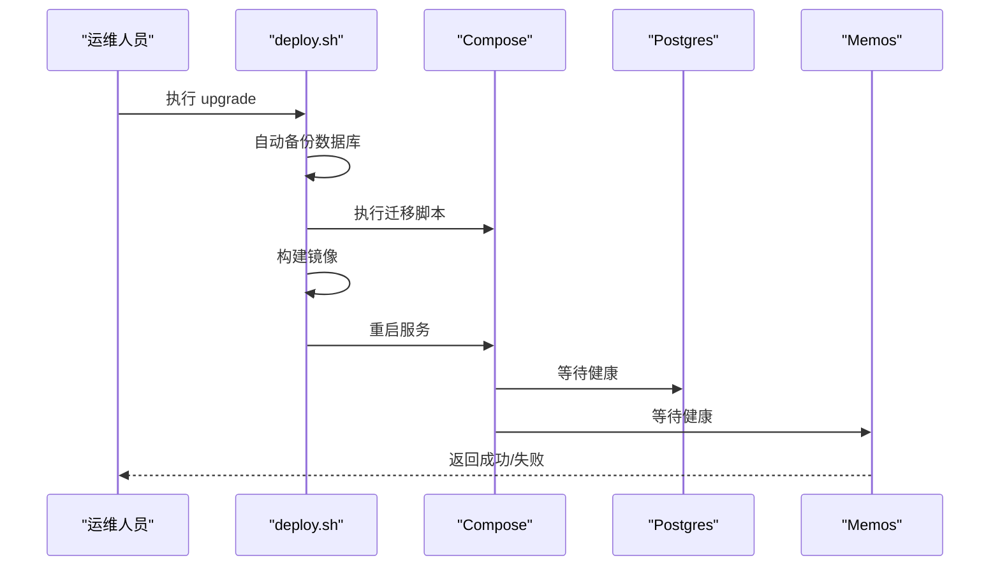

**图表来源**
- [deploy.sh](file://deploy/aliyun/deploy.sh#L311-L378)
- [prod.yml](file://docker/compose/prod.yml#L60-L110)

**章节来源**
- [deploy.sh](file://deploy/aliyun/deploy.sh#L180-L378)
- [README.md](file://deploy/aliyun/README.md#L206-L331)

### 环境变量与配置注入
- 非敏感配置：实例 URL、AI Provider、模型、时区等，通过 ConfigMap 注入。
- 敏感配置：数据库密码、API Key、DSN 等，通过 Secret 注入；支持 _FILE 变量从挂载文件注入。
- Compose 中的环境变量来源于 .env.prod.example。

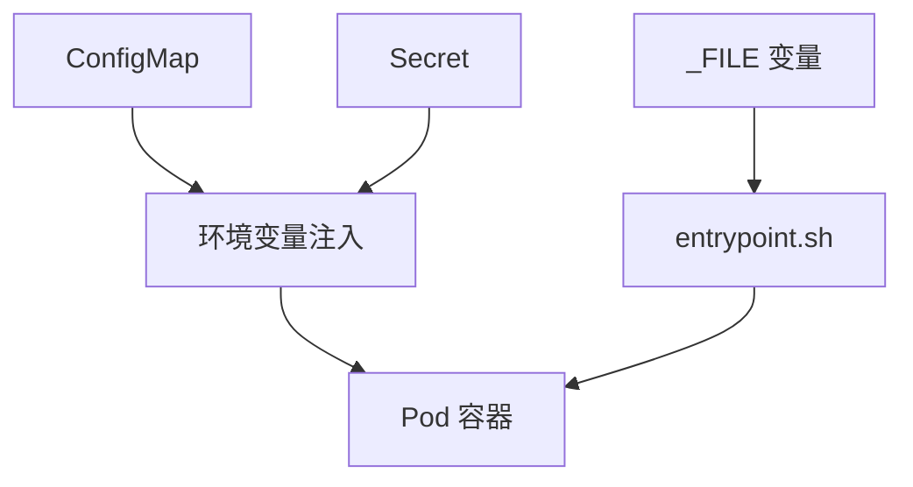

**图表来源**
- [.env.prod.example](file://deploy/aliyun/.env.prod.example#L1-L103)
- [entrypoint.sh](file://scripts/entrypoint.sh#L1-L32)
- [prod.yml](file://docker/compose/prod.yml#L67-L89)

**章节来源**
- [.env.prod.example](file://deploy/aliyun/.env.prod.example#L1-L103)
- [entrypoint.sh](file://scripts/entrypoint.sh#L1-L32)
- [prod.yml](file://docker/compose/prod.yml#L67-L89)

### Ingress 控制器与域名解析
- Ingress：通过 Ingress 控制器暴露域名与 TLS，将流量转发至 Memos Service。
- 建议：为 Ingress 配置证书管理（如 cert-manager）、限流与 WAF。
- 域名解析：在 DNS 层面将域名指向 Ingress 控制器的负载均衡器。

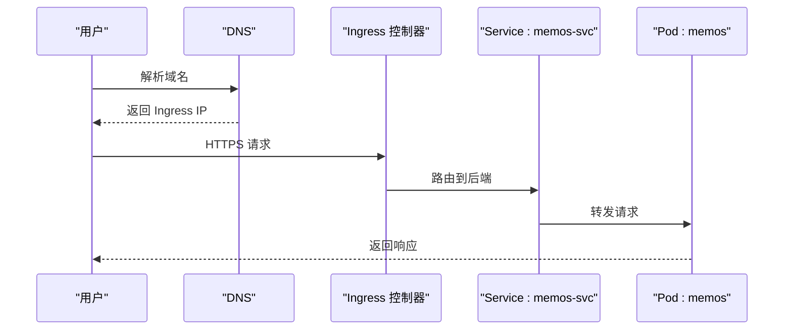

**图表来源**
- [prod.yml](file://docker/compose/prod.yml#L90-L110)

**章节来源**
- [prod.yml](file://docker/compose/prod.yml#L90-L110)

### 数据库高可用与读写分离
- 主从复制：在 Kubernetes 中通过 StatefulSet 部署 PostgreSQL 主从，使用只读副本提供读流量。
- 读写分离：应用侧通过不同的 DSN 连接主库与只读副本；或使用中间件（如 pgbouncer）实现。
- 备份策略：定期逻辑备份与 PITR 结合，配合 Ingress 与 DNS 切换演练。

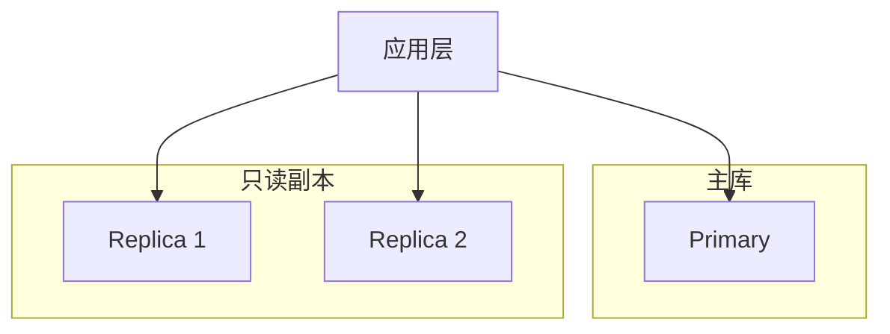

**图表来源**
- [prod.yml](file://docker/compose/prod.yml#L13-L56)

**章节来源**
- [prod.yml](file://docker/compose/prod.yml#L13-L56)

### Helm Chart 使用与自定义
- Chart 结构：values.yaml、templates/Deployment、Service、ConfigMap、Secret、Ingress、PVC。
- 自定义项：镜像仓库与标签、资源限制、探针阈值、Ingress 注解、存储类、节点亲和性。
- 最佳实践：将敏感配置放入 Secret，非敏感配置放入 ConfigMap；通过覆盖 values.yaml 实现多环境差异化。

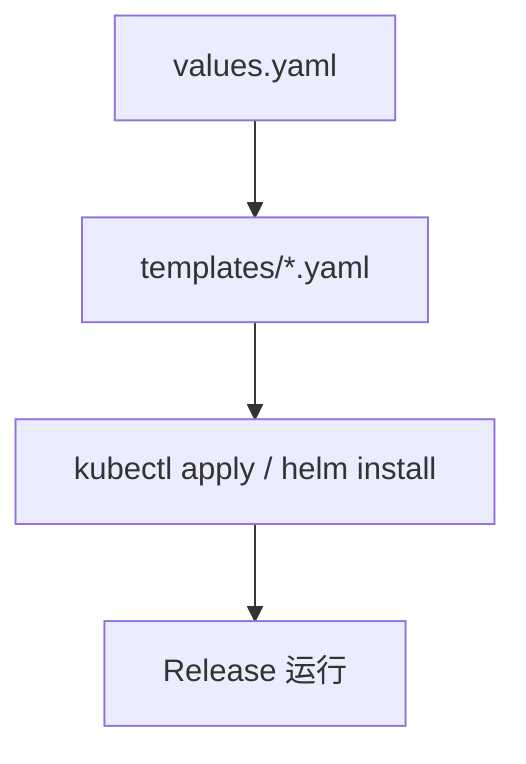

**图表来源**
- [prod.yml](file://docker/compose/prod.yml#L1-L119)

**章节来源**
- [prod.yml](file://docker/compose/prod.yml#L1-L119)

### 滚动更新、蓝绿与金丝雀发布
- 滚动更新：设置 maxUnavailable 与 maxSurge，保证平滑切换。
- 蓝绿：两套 Deployment，通过 Service 切换标签。
- 金丝雀：基于权重或标签的渐进式流量切分，结合探针与回滚策略。

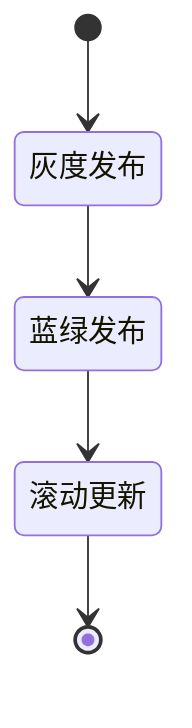

**图表来源**
- [prod.yml](file://docker/compose/prod.yml#L60-L110)

**章节来源**
- [prod.yml](file://docker/compose/prod.yml#L60-L110)

### 集群监控与日志收集
- 指标采集：Prometheus Exporter 或原生指标，采集 CPU/内存/连接数/健康检查状态。
- 日志采集：Sidecar 或 DaemonSet 收集 stdout/stderr，结合结构化日志字段（request_id、user_id 等）进行聚合与检索。
- 告警：基于探针失败、资源使用率阈值、错误码分布设置告警。

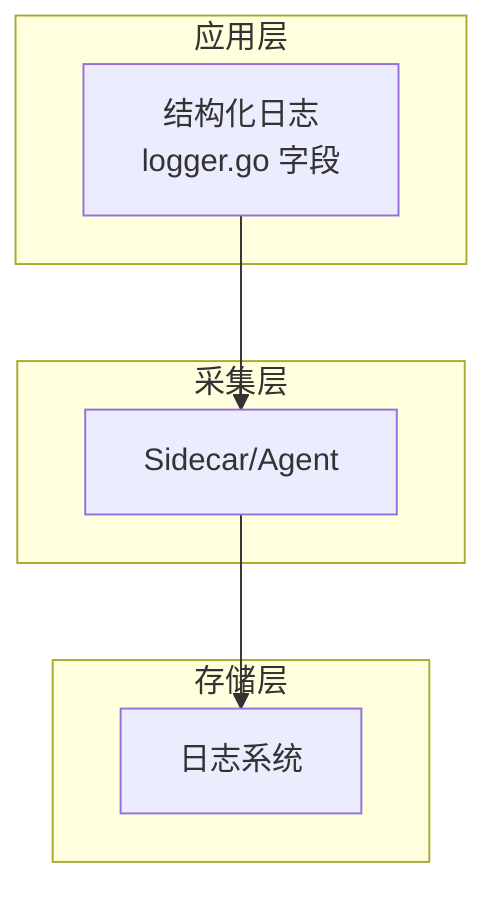

**图表来源**
- [logger.go](file://server/internal/observability/logger.go#L1-L90)

**章节来源**
- [logger.go](file://server/internal/observability/logger.go#L1-L90)

## 依赖关系分析
- Compose 依赖：Memos 依赖 PostgreSQL 健康；PostgreSQL 依赖数据卷与初始化脚本。
- 环境变量依赖：Memos 通过 MEMOS_DSN 连接数据库；AI 功能依赖 Provider Key。
- 运维脚本依赖：构建阶段依赖 Go 与前端工具链；升级阶段依赖迁移脚本与备份。

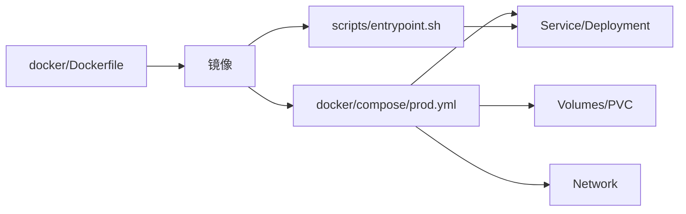

**图表来源**
- [Dockerfile](file://docker/Dockerfile#L1-L58)
- [prod.yml](file://docker/compose/prod.yml#L1-L119)
- [entrypoint.sh](file://scripts/entrypoint.sh#L1-L32)

**章节来源**
- [Dockerfile](file://docker/Dockerfile#L1-L58)
- [prod.yml](file://docker/compose/prod.yml#L1-L119)
- [entrypoint.sh](file://scripts/entrypoint.sh#L1-L32)

## 性能考量
- 资源配额：为 PostgreSQL 与 Memos 设置合理的 limits 与 reservations，避免争抢。
- 数据库参数：依据 Compose 中的内存参数优化策略，结合集群规模调整。
- 健康检查：合理设置探针间隔与超时，避免误判导致频繁重启。
- 存储：使用高性能存储类与合适的 IOPS，保障数据库与附件读写性能。

**章节来源**
- [prod.yml](file://docker/compose/prod.yml#L39-L56)
- [prod.yml](file://docker/compose/prod.yml#L100-L108)

## 故障排查指南
- 服务无法启动：查看日志与资源使用，确认镜像拉取、卷挂载与网络连通。
- 数据库异常：检查初始化脚本执行、扩展加载与健康检查；必要时回滚到备份。
- 升级失败：查看迁移脚本输出与备份状态，回滚到上一版本并修复问题。

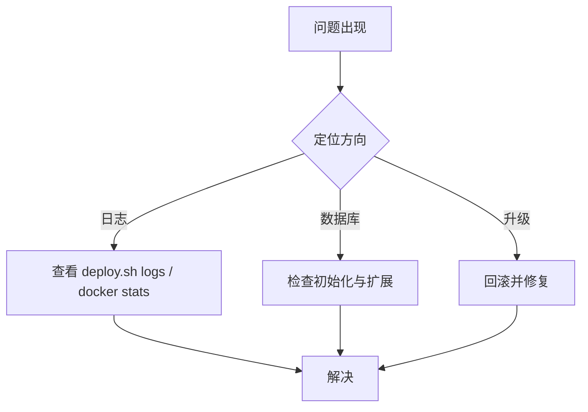

**图表来源**
- [deploy.sh](file://deploy/aliyun/deploy.sh#L396-L422)
- [README.md](file://deploy/aliyun/README.md#L284-L331)

**章节来源**
- [deploy.sh](file://deploy/aliyun/deploy.sh#L396-L422)
- [README.md](file://deploy/aliyun/README.md#L284-L331)

## 结论
通过将仓库中的 Compose 与脚本能力映射到 Kubernetes，可以快速搭建稳定、可观测且可演进的生产环境。建议以 ConfigMap/Secret 管理配置，以 PVC 持久化数据，以 Ingress 对外暴露，以探针与备份保障稳定性，并以 Helm 实现多环境一致性与可审计性。

## 附录
- 快速对照表（Kubernetes 与现有配置映射）
  - Deployment → Compose Service
  - Service → Compose Service 端口映射
  - ConfigMap → 非敏感环境变量
  - Secret → 敏感环境变量与 _FILE
  - PVC → Compose Volume
  - Ingress → 外部域名与 TLS
  - Job/CronJob → 备份与清理任务

**章节来源**
- [prod.yml](file://docker/compose/prod.yml#L1-L119)
- [.env.prod.example](file://deploy/aliyun/.env.prod.example#L1-L103)
- [deploy.sh](file://deploy/aliyun/deploy.sh#L519-L598)