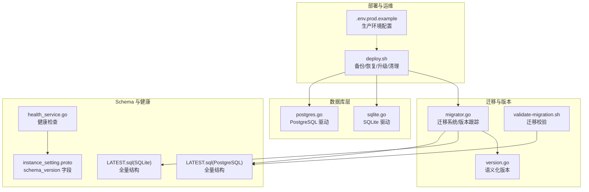
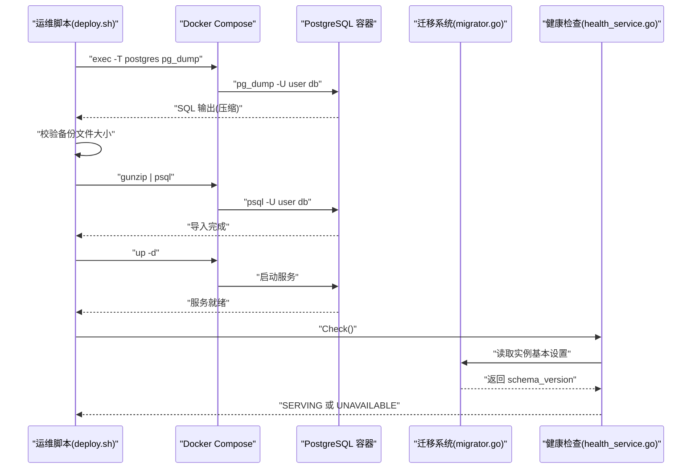
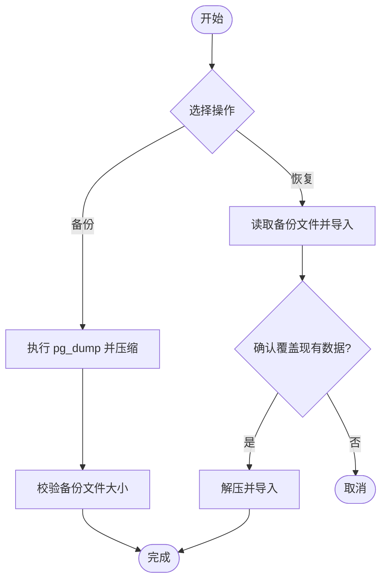
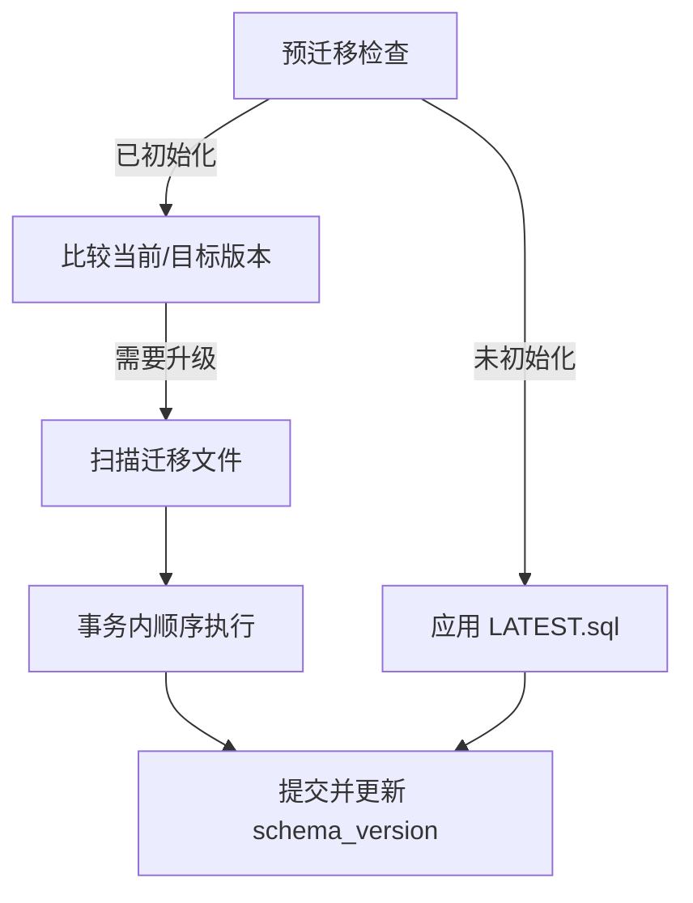
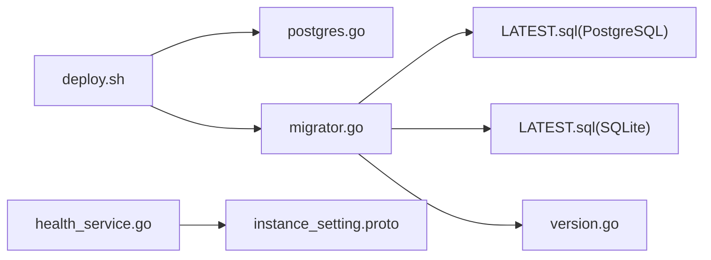

# 备份与恢复

<cite>
**本文引用的文件**
- [deploy.sh](file://deploy/aliyun/deploy.sh)
- [LATEST.sql（PostgreSQL）](file://store/migration/postgres/LATEST.sql)
- [LATEST.sql（SQLite）](file://store/migration/sqlite/LATEST.sql)
- [migrator.go](file://store/migrator.go)
- [postgres.go](file://store/db/postgres/postgres.go)
- [sqlite.go](file://store/db/sqlite/sqlite.go)
- [validate-migration.sh](file://scripts/validate-migration.sh)
- [version.go](file://internal/version/version.go)
- [.env.prod.example](file://deploy/aliyun/.env.prod.example)
- [instance_setting.proto](file://proto/store/instance_setting.proto)
- [health_service.go](file://server/router/api/v1/health_service.go)
- [SECURITY.md](file://SECURITY.md)
</cite>

## 目录
1. [简介](#简介)
2. [项目结构](#项目结构)
3. [核心组件](#核心组件)
4. [架构总览](#架构总览)
5. [详细组件分析](#详细组件分析)
6. [依赖关系分析](#依赖关系分析)
7. [性能考量](#性能考量)
8. [故障排查指南](#故障排查指南)
9. [结论](#结论)
10. [附录](#附录)

## 简介
本指南聚焦于数据库备份与恢复的完整操作流程，涵盖：
- 备份策略：全量备份与增量迁移的配置与执行
- 导出与导入：自动化脚本与结构/数据迁移处理
- 灾难恢复计划：制定与演练流程
- 版本升级与回滚：安全策略与回退机制
- 数据一致性检查与验证：迁移与健康检查
- 备份存储安全与生命周期管理：加密、隔离与归档
- 跨环境同步与迁移：最佳实践与注意事项

## 项目结构
围绕备份与恢复的关键文件分布如下：
- 部署与运维脚本：部署、升级、备份、恢复、清理
- 数据库驱动与初始化：PostgreSQL/SQLite 初始化与连接
- 迁移系统：版本跟踪、增量迁移、种子数据
- 版本与校验：语义化版本、迁移校验脚本
- 健康检查：数据库初始化与版本校验
- 安全策略：自托管安全与配置隔离

图表来源
- [deploy.sh](file://deploy/aliyun/deploy.sh#L424-L501)
- [postgres.go](file://store/db/postgres/postgres.go#L34-L89)
- [sqlite.go](file://store/db/sqlite/sqlite.go#L38-L100)
- [migrator.go](file://store/migrator.go#L105-L146)
- [LATEST.sql（PostgreSQL）](file://store/migration/postgres/LATEST.sql#L296-L301)
- [LATEST.sql（SQLite）](file://store/migration/sqlite/LATEST.sql#L1-L135)
- [validate-migration.sh](file://scripts/validate-migration.sh#L1-L90)
- [version.go](file://internal/version/version.go#L10-L44)
- [health_service.go](file://server/router/api/v1/health_service.go#L11-L25)
- [instance_setting.proto](file://proto/store/instance_setting.proto#L29-L34)

章节来源
- [deploy.sh](file://deploy/aliyun/deploy.sh#L1-L601)
- [postgres.go](file://store/db/postgres/postgres.go#L1-L89)
- [sqlite.go](file://store/db/sqlite/sqlite.go#L1-L100)
- [migrator.go](file://store/migrator.go#L1-L415)
- [LATEST.sql（PostgreSQL）](file://store/migration/postgres/LATEST.sql#L1-L301)
- [LATEST.sql（SQLite）](file://store/migration/sqlite/LATEST.sql#L1-L135)
- [validate-migration.sh](file://scripts/validate-migration.sh#L1-L90)
- [version.go](file://internal/version/version.go#L1-L61)
- [health_service.go](file://server/router/api/v1/health_service.go#L1-L25)
- [instance_setting.proto](file://proto/store/instance_setting.proto#L1-L34)

## 核心组件
- 备份与恢复脚本：基于 Docker Compose 的 pg_dump/pg_restore 流水线，支持自动备份与手动恢复
- 迁移系统：基于嵌入式文件系统的增量迁移，带事务原子性与版本比较
- 健康检查：通过实例基本设置中的 schema_version 判断数据库初始化状态
- 版本与校验：语义化版本比较与迁移文件命名校验，确保一致性
- 驱动层：PostgreSQL 生产级支持；SQLite 仅限开发/测试

章节来源
- [deploy.sh](file://deploy/aliyun/deploy.sh#L424-L501)
- [migrator.go](file://store/migrator.go#L105-L218)
- [health_service.go](file://server/router/api/v1/health_service.go#L11-L25)
- [validate-migration.sh](file://scripts/validate-migration.sh#L1-L90)
- [postgres.go](file://store/db/postgres/postgres.go#L17-L32)
- [sqlite.go](file://store/db/sqlite/sqlite.go#L16-L36)

## 架构总览
备份与恢复涉及以下关键交互：
- 备份：通过部署脚本调用容器内 pg_dump，输出压缩文件并进行体积校验
- 恢复：通过部署脚本将压缩包解压并通过 psql 导入
- 升级：升级前自动备份，随后执行增量迁移脚本，最后重启服务
- 迁移：应用迁移脚本在单事务中执行，完成后更新 schema_version
- 健康：服务启动时检查 schema_version 是否存在，确保数据库已正确初始化

图表来源
- [deploy.sh](file://deploy/aliyun/deploy.sh#L424-L501)
- [migrator.go](file://store/migrator.go#L105-L146)
- [health_service.go](file://server/router/api/v1/health_service.go#L11-L25)

## 详细组件分析

### 备份与恢复自动化脚本
- 备份流程
  - 自动备份：升级前自动执行，生成带时间戳的压缩文件，并校验非空
  - 手动备份：可直接调用备份命令，生成压缩文件并显示大小
  - 备份文件校验：通过统计字节数判断有效性
- 恢复流程
  - 恢复前确认：要求用户提供备份文件路径
  - 恢复确认：交互式确认覆盖现有数据
  - 恢复执行：解压后通过 psql 导入数据库
- 生命周期管理
  - 清理旧备份：按天数清理历史备份文件，避免磁盘占用增长

图表来源
- [deploy.sh](file://deploy/aliyun/deploy.sh#L424-L501)

章节来源
- [deploy.sh](file://deploy/aliyun/deploy.sh#L424-L501)

### 迁移系统与增量备份策略
- 迁移系统
  - 预迁移：若数据库未初始化，则应用 LATEST.sql 并写入 schema_version
  - 增量迁移：按版本范围扫描迁移文件，按文件名顺序在单事务中执行
  - 种子数据：仅 SQLite 的演示模式下应用种子 SQL
  - 版本比较：使用语义化版本比较，禁止降级
- 增量备份策略
  - 增量备份：通过增量迁移脚本实现结构/数据变更的逐步应用
  - 全量备份：使用 LATEST.sql 作为新安装的全量结构基线
  - 版本一致性：通过 VERSION 文件与 LATEST.sql 中的 schema_version 对齐校验

图表来源
- [migrator.go](file://store/migrator.go#L105-L218)
- [LATEST.sql（PostgreSQL）](file://store/migration/postgres/LATEST.sql#L296-L301)
- [validate-migration.sh](file://scripts/validate-migration.sh#L25-L66)

章节来源
- [migrator.go](file://store/migrator.go#L105-L218)
- [LATEST.sql（PostgreSQL）](file://store/migration/postgres/LATEST.sql#L296-L301)
- [validate-migration.sh](file://scripts/validate-migration.sh#L25-L66)

### 数据导出与导入处理
- 结构迁移
  - 新安装：直接应用 LATEST.sql，快速建立完整结构
  - 已安装：按版本范围应用增量迁移，保证原子性
- 数据迁移
  - 迁移脚本中包含结构变更与数据修正，通过事务一次性提交
  - 通过健康检查确保 schema_version 存在，避免未初始化状态下的误操作

章节来源
- [migrator.go](file://store/migrator.go#L105-L218)
- [health_service.go](file://server/router/api/v1/health_service.go#L11-L25)

### 灾难恢复计划（DRP）
- 触发条件
  - 数据库不可用、迁移失败、schema_version 缺失
- 恢复步骤
  - 使用备份文件进行恢复（确认覆盖）
  - 重启服务并执行健康检查
  - 验证数据库版本与代码版本一致
- 回滚策略
  - 迁移系统禁止降级，若出现严重问题，应回滚到上一稳定版本并修复后再发布

章节来源
- [deploy.sh](file://deploy/aliyun/deploy.sh#L471-L501)
- [migrator.go](file://store/migrator.go#L123-L130)

### 版本升级与回滚安全策略
- 升级流程
  - 升级前自动备份
  - 扫描并顺序执行增量迁移脚本
  - 更新镜像并重启服务
  - 校验数据库版本与代码版本一致
- 回滚策略
  - 若迁移失败，使用备份文件回滚
  - 迁移系统禁止降级，避免 schema_version 回退
  - 严格遵循最小升级路径（旧安装需先升级至中间版本）

章节来源
- [deploy.sh](file://deploy/aliyun/deploy.sh#L311-L378)
- [migrator.go](file://store/migrator.go#L123-L130)
- [version.go](file://internal/version/version.go#L36-L44)

### 数据一致性检查与验证
- 迁移一致性
  - 迁移文件命名规范校验
  - 迁移脚本顺序执行并在单事务中提交
- 版本一致性
  - VERSION 文件与 LATEST.sql 中 schema_version 对齐
  - SQL 语法解析校验（若可用 psql）
- 健康检查
  - 服务启动时检查 schema_version 是否存在
  - 未初始化或版本缺失时返回不可用状态

章节来源
- [validate-migration.sh](file://scripts/validate-migration.sh#L25-L84)
- [migrator.go](file://store/migrator.go#L105-L146)
- [health_service.go](file://server/router/api/v1/health_service.go#L11-L25)

### 备份存储安全与生命周期管理
- 安全措施
  - 生产环境配置文件不提交到仓库，使用 .env.prod.example 作为模板
  - 备份文件生成在脚本指定目录，建议结合外部存储与访问控制
- 生命周期管理
  - 自动清理：按天数清理旧备份文件
  - 建议：结合对象存储（如 S3）与加密传输，定期轮换密钥

章节来源
- [.env.prod.example](file://deploy/aliyun/.env.prod.example#L1-L103)
- [deploy.sh](file://deploy/aliyun/deploy.sh#L512-L517)

### 跨环境数据同步与迁移最佳实践
- 同步策略
  - 使用增量迁移脚本在不同环境间传播结构变更
  - 通过健康检查确保目标环境数据库处于一致状态
- 最佳实践
  - 在生产环境执行升级前先在预生产环境验证
  - 使用自动备份与回滚策略降低风险
  - 对迁移脚本进行命名规范与语法校验

章节来源
- [migrator.go](file://store/migrator.go#L105-L218)
- [validate-migration.sh](file://scripts/validate-migration.sh#L25-L84)
- [health_service.go](file://server/router/api/v1/health_service.go#L11-L25)

## 依赖关系分析
- 组件耦合
  - 运维脚本依赖 Docker Compose 与容器内的 PostgreSQL 工具链
  - 迁移系统依赖嵌入式文件系统与数据库驱动
  - 健康检查依赖实例基本设置中的 schema_version
- 外部依赖
  - PostgreSQL 驱动与连接池配置
  - 语义化版本比较库
  - 可选的 psql 语法校验

图表来源
- [deploy.sh](file://deploy/aliyun/deploy.sh#L424-L501)
- [postgres.go](file://store/db/postgres/postgres.go#L34-L89)
- [migrator.go](file://store/migrator.go#L105-L218)
- [LATEST.sql（PostgreSQL）](file://store/migration/postgres/LATEST.sql#L296-L301)
- [LATEST.sql（SQLite）](file://store/migration/sqlite/LATEST.sql#L1-L135)
- [version.go](file://internal/version/version.go#L10-L44)
- [health_service.go](file://server/router/api/v1/health_service.go#L11-L25)
- [instance_setting.proto](file://proto/store/instance_setting.proto#L29-L34)

章节来源
- [deploy.sh](file://deploy/aliyun/deploy.sh#L424-L501)
- [postgres.go](file://store/db/postgres/postgres.go#L34-L89)
- [migrator.go](file://store/migrator.go#L105-L218)
- [LATEST.sql（PostgreSQL）](file://store/migration/postgres/LATEST.sql#L296-L301)
- [LATEST.sql（SQLite）](file://store/migration/sqlite/LATEST.sql#L1-L135)
- [version.go](file://internal/version/version.go#L10-L44)
- [health_service.go](file://server/router/api/v1/health_service.go#L11-L25)
- [instance_setting.proto](file://proto/store/instance_setting.proto#L29-L34)

## 性能考量
- 连接池与并发
  - PostgreSQL 连接池针对个人使用场景进行了优化，限制最大连接数以降低资源消耗
  - SQLite 采用 WAL 模式与单连接配置，适合本地单用户场景
- 迁移性能
  - 增量迁移在单事务中执行，减少多次提交开销
  - 新安装直接应用 LATEST.sql，避免大量小迁移累积

章节来源
- [postgres.go](file://store/db/postgres/postgres.go#L51-L57)
- [sqlite.go](file://store/db/sqlite/sqlite.go#L71-L77)
- [migrator.go](file://store/migrator.go#L157-L162)

## 故障排查指南
- 备份失败
  - 检查数据库连接与凭据
  - 校验备份文件大小是否为 0
  - 确认 Docker Compose 与容器状态
- 恢复失败
  - 确认备份文件存在且可读
  - 恢复前确认覆盖现有数据的操作
  - 恢复后执行健康检查
- 迁移失败
  - 检查迁移文件命名与顺序
  - 使用迁移校验脚本验证 SQL 语法
  - 确认 schema_version 与目标版本关系
- 健康检查失败
  - 检查实例基本设置中 schema_version 是否存在
  - 确认数据库初始化状态

章节来源
- [deploy.sh](file://deploy/aliyun/deploy.sh#L424-L501)
- [validate-migration.sh](file://scripts/validate-migration.sh#L70-L84)
- [health_service.go](file://server/router/api/v1/health_service.go#L11-L25)

## 结论
本指南基于仓库中的部署脚本、迁移系统与健康检查机制，提供了完整的备份与恢复操作路径。通过自动备份、增量迁移与健康检查，能够在升级与灾难恢复中保障数据一致性与服务可用性。建议在生产环境中结合外部存储与访问控制，完善备份生命周期管理，并在预生产环境充分验证迁移脚本与升级流程。

## 附录
- 关键命令与文件
  - 备份：./deploy.sh backup
  - 恢复：./deploy.sh restore backups/xxx.sql.gz
  - 升级：./deploy.sh upgrade
  - 清理：./deploy.sh cleanup
  - 迁移校验：./scripts/validate-migration.sh
  - 环境配置：cp .env.prod.example .env.prod && vi .env.prod