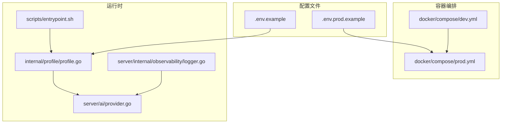
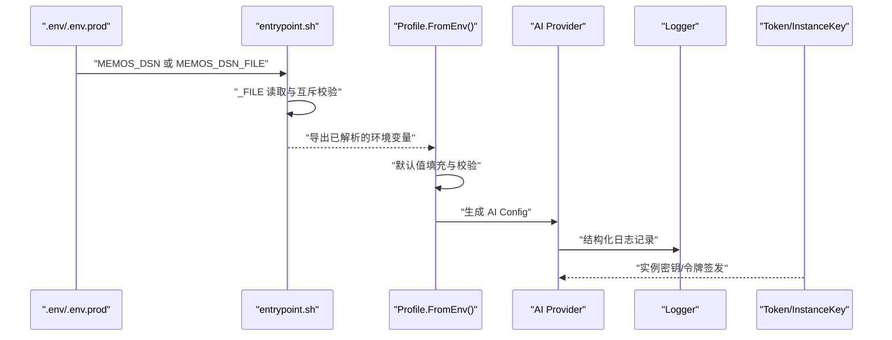
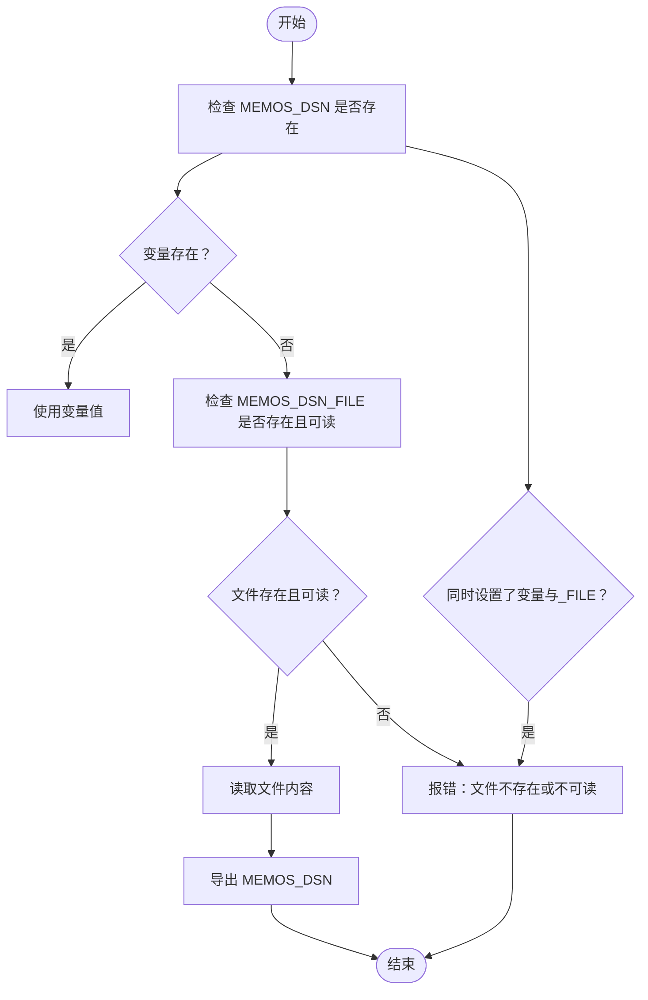
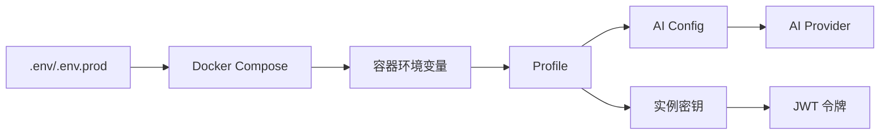

# 环境配置与管理

<cite>
**本文引用的文件**
- [.env.example](file://.env.example)
- [.env.prod.example](file://deploy/aliyun/.env.prod.example)
- [dev.yml](file://docker/compose/dev.yml)
- [prod.yml](file://docker/compose/prod.yml)
- [profile.go](file://internal/profile/profile.go)
- [entrypoint.sh](file://scripts/entrypoint.sh)
- [entrypoint_test.sh](file://scripts/entrypoint_test.sh)
- [build.sh](file://scripts/build.sh)
- [dev.sh](file://scripts/dev.sh)
- [provider.go](file://server/ai/provider.go)
- [AI-007-ai-plugin-config.md](file://docs/specs/AI-007-ai-plugin-config.md)
- [logger.go](file://server/internal/observability/logger.go)
- [token.go](file://server/auth/token.go)
- [instance_setting.proto](file://proto/store/instance_setting.proto)
- [instance_setting.pb.go](file://proto/gen/store/instance_setting.pb.go)
- [redis.go](file://store/cache/redis.go)
- [frontend.go](file://server/router/frontend/frontend.go)
- [P2_IMPROVEMENTS_REPORT.md](file://docs/archived/cleanup_20260123/optimal_rag/P2_IMPROVEMENTS_REPORT.md)
</cite>

## 目录
1. [简介](#简介)
2. [项目结构](#项目结构)
3. [核心组件](#核心组件)
4. [架构总览](#架构总览)
5. [详细组件分析](#详细组件分析)
6. [依赖关系分析](#依赖关系分析)
7. [性能考量](#性能考量)
8. [故障排查指南](#故障排查指南)
9. [结论](#结论)
10. [附录](#附录)

## 简介
本指南聚焦于 Memos 项目的环境配置与管理，涵盖 .env 文件结构与配置项含义、数据库连接、AI 服务配置、安全密钥管理；对比开发与生产环境配置差异；阐明环境变量优先级与覆盖规则；给出敏感信息安全管理策略（密钥轮换与加密存储）；说明配置热更新与动态配置管理的实现思路；并总结配置验证与错误处理的最佳实践。

## 项目结构
围绕环境配置与管理的关键文件与目录如下：
- 示例与生产配置：.env.example、deploy/aliyun/.env.prod.example
- Docker Compose：docker/compose/dev.yml、docker/compose/prod.yml
- 配置加载与校验：internal/profile/profile.go
- 启动前环境变量处理：scripts/entrypoint.sh、scripts/entrypoint_test.sh
- 构建与开发脚本：scripts/build.sh、scripts/dev.sh
- AI 配置与校验：docs/specs/AI-007-ai-plugin-config.md、server/ai/provider.go
- 日志与可观测性：server/internal/observability/logger.go
- 安全与密钥：server/auth/token.go、proto/store/instance_setting.proto、proto/gen/store/instance_setting.pb.go
- 缓存与加密：store/cache/redis.go
- 前端缓存策略：server/router/frontend/frontend.go
- 热更新与动态配置建议：docs/archived/cleanup_20260123/optimal_rag/P2_IMPROVEMENTS_REPORT.md

**图表来源**
- [.env.example](file://.env.example#L1-L58)
- [.env.prod.example](file://deploy/aliyun/.env.prod.example#L1-L103)
- [dev.yml](file://docker/compose/dev.yml#L1-L49)
- [prod.yml](file://docker/compose/prod.yml#L1-L119)
- [profile.go](file://internal/profile/profile.go#L1-L153)
- [entrypoint.sh](file://scripts/entrypoint.sh#L1-L32)
- [provider.go](file://server/ai/provider.go#L1-L73)
- [logger.go](file://server/internal/observability/logger.go#L50-L90)

**章节来源**
- [dev.yml](file://docker/compose/dev.yml#L1-L49)
- [prod.yml](file://docker/compose/prod.yml#L1-L119)
- [profile.go](file://internal/profile/profile.go#L1-L153)

## 核心组件
- 配置加载与校验：Profile 结构体负责解析环境变量、设置默认值、校验数据目录与驱动等。
- 环境变量处理：entrypoint.sh 提供 _FILE 形式的安全注入机制，避免明文写入配置文件。
- AI 配置：从 Profile 生成 AI Config，并进行必填项校验。
- 日志与可观测性：统一的日志上下文与字段规范，便于问题定位。
- 安全与密钥：实例密钥用于会话管理，令牌签发使用对称签名算法。
- 缓存与加密：缓存键哈希与无操作实现，支持可选 Redis。
- 前端缓存策略：静态资源缓存与 HTML5 路由回退。

**章节来源**
- [profile.go](file://internal/profile/profile.go#L14-L99)
- [entrypoint.sh](file://scripts/entrypoint.sh#L3-L27)
- [AI-007-ai-plugin-config.md](file://docs/specs/AI-007-ai-plugin-config.md#L15-L148)
- [logger.go](file://server/internal/observability/logger.go#L50-L90)
- [token.go](file://server/auth/token.go#L100-L135)
- [redis.go](file://store/cache/redis.go#L97-L156)
- [frontend.go](file://server/router/frontend/frontend.go#L32-L69)

## 架构总览
下图展示从环境变量到运行时配置的整体流程，以及与 AI 服务、日志与安全模块的交互。

**图表来源**
- [entrypoint.sh](file://scripts/entrypoint.sh#L3-L27)
- [profile.go](file://internal/profile/profile.go#L77-L99)
- [provider.go](file://server/ai/provider.go#L43-L73)
- [logger.go](file://server/internal/observability/logger.go#L74-L90)
- [token.go](file://server/auth/token.go#L100-L135)

## 详细组件分析

### .env 文件结构与配置项
- 数据库配置
  - 驱动与连接串：MEMOS_DRIVER、MEMOS_DSN
  - 示例中默认使用 Postgres，DSN 包含 sslmode 等参数
- AI 配置
  - 开关：MEMOS_AI_ENABLED
  - 向量化与重排序：MEMOS_AI_EMBEDDING_PROVIDER/MODEL、MEMOS_AI_RERANK_MODEL
  - 大模型：MEMOS_AI_LLM_PROVIDER/MODEL
  - API Key 与 Base URL：分别对应不同提供商
- 安全与实例
  - 实例 URL：MEMOS_INSTANCE_URL
  - 时区：TZ（生产示例）

**章节来源**
- [.env.example](file://.env.example#L20-L58)
- [.env.prod.example](file://deploy/aliyun/.env.prod.example#L27-L103)

### 开发与生产环境差异
- 端口与绑定
  - 开发：本地端口映射与容器内端口
  - 生产：MEMOS_PORT、MEMOS_ADDR、MEMOS_MODE=prod
- 数据库
  - 开发：共享缓冲、缓存大小、最大连接数等针对小内存服务器的优化
  - 生产：通过 .env.prod 注入 POSTGRES_* 与 MEMOS_DSN
- AI 配置
  - 开发与生产均支持多提供商切换与 Base URL 自定义
- 实例 URL
  - 生产需配置公网可访问地址，用于回调链接生成

**章节来源**
- [dev.yml](file://docker/compose/dev.yml#L13-L56)
- [prod.yml](file://docker/compose/prod.yml#L60-L110)
- [.env.prod.example](file://deploy/aliyun/.env.prod.example#L53-L86)

### 环境变量优先级与覆盖规则
- 默认值回退：Profile 通过 getEnvOrDefault 读取环境变量，未设置时采用默认值
- _FILE 注入：entrypoint.sh 支持 MEMOS_DSN_FILE 指向只读文件，自动读取内容并覆盖同名变量
- 互斥校验：同一变量不可同时设置“变量”和“变量_FILE”
- Docker Compose 覆盖：prod.yml 将 .env.prod 的变量注入到容器环境，优先级高于镜像默认
- 构建与运行：dev.sh 在启动后端前加载 .env，随后以命令行参数覆盖部分行为

**图表来源**
- [entrypoint.sh](file://scripts/entrypoint.sh#L3-L27)
- [entrypoint_test.sh](file://scripts/entrypoint_test.sh#L30-L113)

**章节来源**
- [profile.go](file://internal/profile/profile.go#L68-L99)
- [entrypoint.sh](file://scripts/entrypoint.sh#L3-L27)
- [dev.yml](file://docker/compose/dev.yml#L67-L91)
- [prod.yml](file://docker/compose/prod.yml#L67-L91)
- [dev.sh](file://scripts/dev.sh#L96-L103)

### 敏感信息安全管理
- 实例密钥
  - 通过 proto 定义的 InstanceBasicSetting.secret_key 字段存储实例密钥，用于会话管理
- 令牌签发
  - 使用对称签名算法签发 JWT，密钥来源于实例密钥
- 缓存键哈希
  - 缓存键生成包含哈希，降低泄露风险
- 建议
  - 密钥轮换：定期更换实例密钥与各提供商 API Key，并在入口层支持平滑切换
  - 加密存储：生产环境使用 KMS 或密钥管理服务，避免明文落盘

**章节来源**
- [instance_setting.proto](file://proto/store/instance_setting.proto#L29-L34)
- [instance_setting.pb.go](file://proto/gen/store/instance_setting.pb.go#L260-L312)
- [token.go](file://server/auth/token.go#L100-L135)
- [redis.go](file://store/cache/redis.go#L97-L114)

### 配置热更新与动态配置管理
- 现状
  - 代码层面未提供运行时热更新接口；CI/CD 文档建议包含“配置热更新”“配置持久化”“配置 API”
- 建议实现
  - 配置热更新：监听配置文件变化或注册中心变更，触发配置重载
  - 配置持久化：将运行时配置写入数据库或配置中心
  - 配置 API：提供受控的 HTTP 接口动态调整非敏感配置

**章节来源**
- [P2_IMPROVEMENTS_REPORT.md](file://docs/archived/cleanup_20260123/optimal_rag/P2_IMPROVEMENTS_REPORT.md#L405-L415)

### 配置验证与错误处理最佳实践
- 必填项校验
  - Profile.Validate 对模式与数据目录进行校验
  - AI 配置 Validate 对提供商与 API Key 进行校验
- 启动前校验
  - entrypoint.sh 在容器启动前完成 _FILE 注入与互斥校验
- 日志规范
  - 统一结构化日志字段，包含组件、请求 ID、耗时、错误码等
- 错误处理
  - 明确报错信息与返回码，避免泄露敏感细节

**章节来源**
- [profile.go](file://internal/profile/profile.go#L120-L152)
- [AI-007-ai-plugin-config.md](file://docs/specs/AI-007-ai-plugin-config.md#L124-L147)
- [entrypoint.sh](file://scripts/entrypoint.sh#L10-L21)
- [logger.go](file://server/internal/observability/logger.go#L74-L90)

## 依赖关系分析
- 配置来源
  - .env/.env.prod → Docker Compose 环境变量 → Profile 解析 → 运行时配置
- AI 服务链路
  - Profile → AI Config → Provider → 外部模型服务
- 安全链路
  - 实例密钥 → 令牌签发 → 会话管理

**图表来源**
- [.env.example](file://.env.example#L1-L58)
- [.env.prod.example](file://deploy/aliyun/.env.prod.example#L1-L103)
- [prod.yml](file://docker/compose/prod.yml#L67-L91)
- [profile.go](file://internal/profile/profile.go#L77-L99)
- [AI-007-ai-plugin-config.md](file://docs/specs/AI-007-ai-plugin-config.md#L65-L122)
- [provider.go](file://server/ai/provider.go#L43-L73)
- [token.go](file://server/auth/token.go#L100-L135)

**章节来源**
- [prod.yml](file://docker/compose/prod.yml#L67-L91)
- [profile.go](file://internal/profile/profile.go#L77-L99)
- [AI-007-ai-plugin-config.md](file://docs/specs/AI-007-ai-plugin-config.md#L65-L122)

## 性能考量
- 数据库内存参数
  - 开发与生产均针对 2G 服务器设置 shared_buffers、effective_cache_size、work_mem 等
- 前端缓存策略
  - 静态资源使用长缓存与 immutable，根路径禁用缓存防止登出后缓存泄露
- 日志开销
  - 结构化日志字段应避免频繁分配，生产环境按需启用 Debug

**章节来源**
- [dev.yml](file://docker/compose/dev.yml#L12-L44)
- [prod.yml](file://docker/compose/prod.yml#L22-L56)
- [frontend.go](file://server/router/frontend/frontend.go#L38-L52)
- [logger.go](file://server/internal/observability/logger.go#L74-L90)

## 故障排查指南
- 环境变量冲突
  - 同时设置 MEMOS_DSN 与 MEMOS_DSN_FILE：entrypoint.sh 报错并退出
  - MEMOS_DSN_FILE 指向不可读文件：报错提示文件不存在或不可读
- 数据库连接失败
  - 检查 DSN 与驱动、网络连通性、容器健康检查状态
- AI 配置错误
  - 确认提供商与 API Key 设置，或 Base URL 正确
- 日志定位
  - 使用 dev.sh logs 查看后端/前端日志，结合结构化字段快速定位

**章节来源**
- [entrypoint_test.sh](file://scripts/entrypoint_test.sh#L30-L113)
- [dev.sh](file://scripts/dev.sh#L485-L530)
- [logger.go](file://server/internal/observability/logger.go#L74-L90)

## 结论
本指南梳理了 Memos 的环境配置与管理要点：从 .env 结构、开发/生产差异、变量优先级与覆盖规则，到敏感信息安全管理、配置热更新与动态管理的建议，以及配置验证与错误处理的最佳实践。建议在生产环境中严格遵循密钥轮换与加密存储策略，并结合 CI/CD 实施配置热更新与持久化方案，持续提升系统的安全性与可维护性。

## 附录
- 构建与运行
  - build.sh：跨平台构建二进制并设置 Go 缓存目录
  - dev.sh：一键启动开发环境（PostgreSQL + 后端 + 前端），支持状态查询与日志查看

**章节来源**
- [build.sh](file://scripts/build.sh#L1-L33)
- [dev.sh](file://scripts/dev.sh#L1-L682)