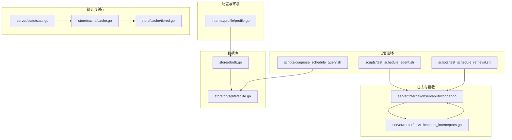
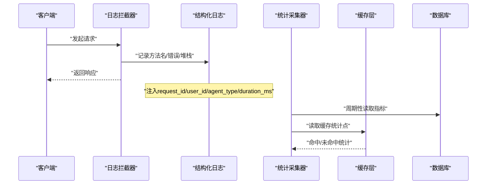
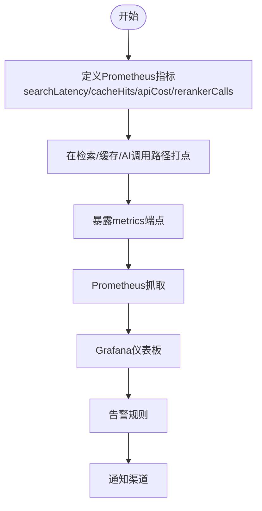
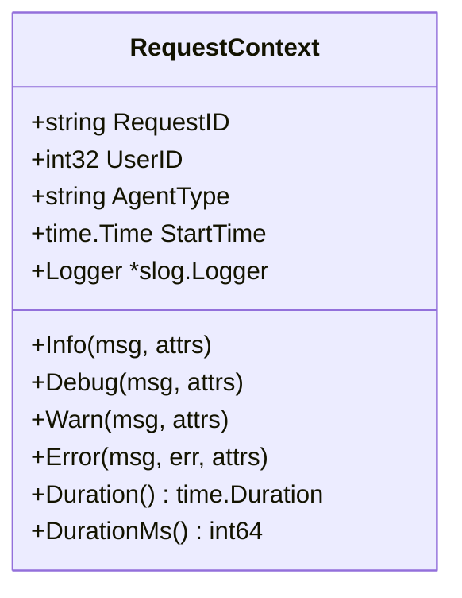
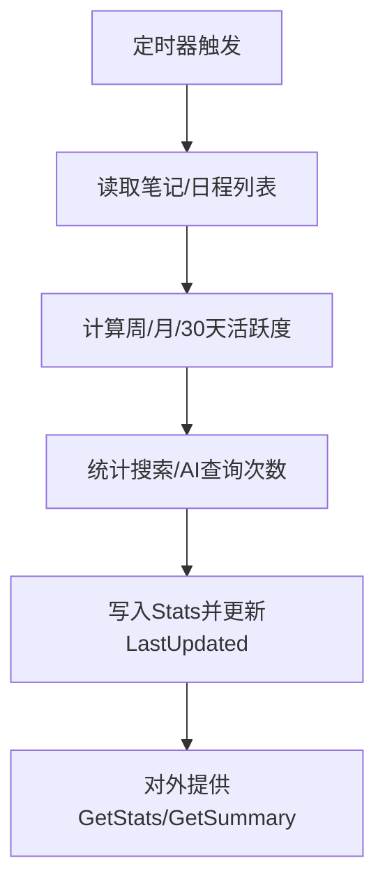
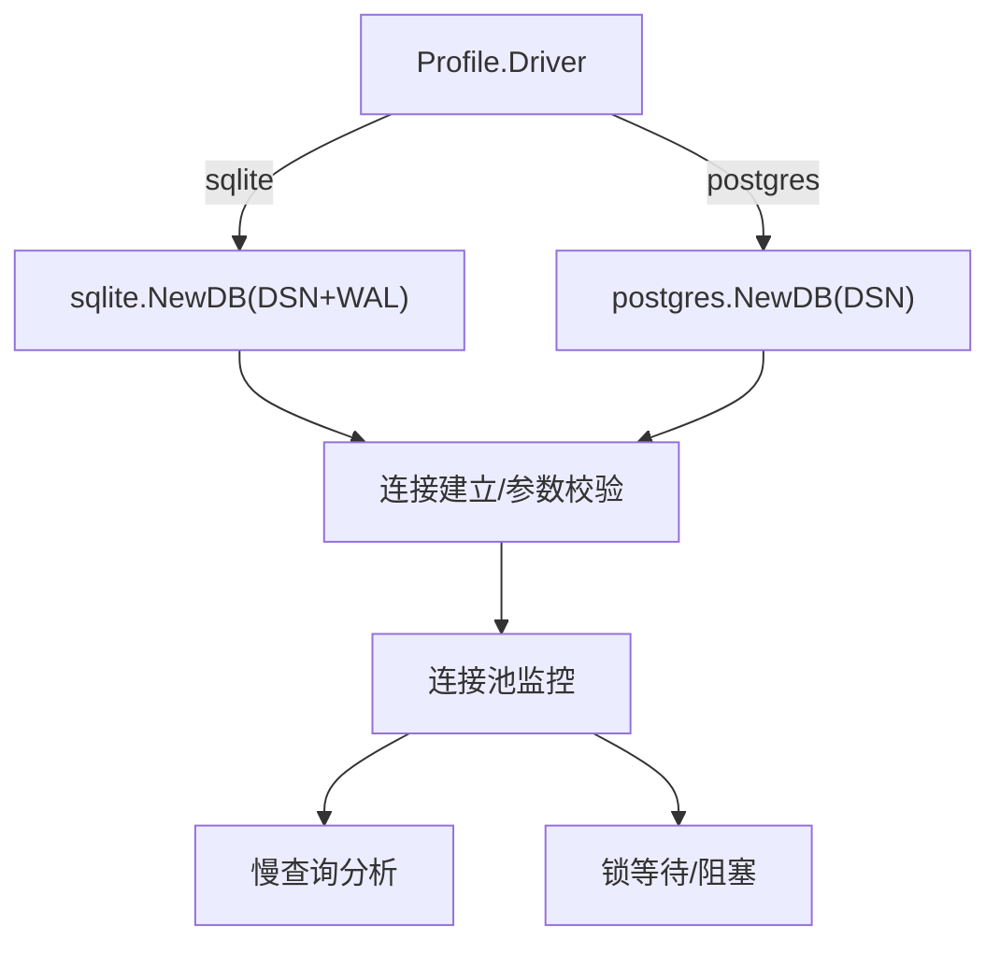
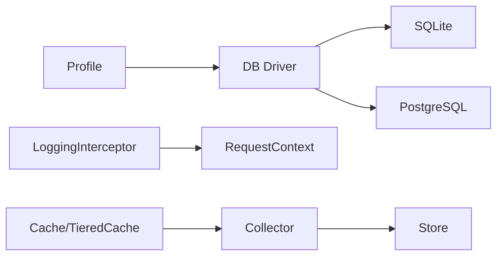
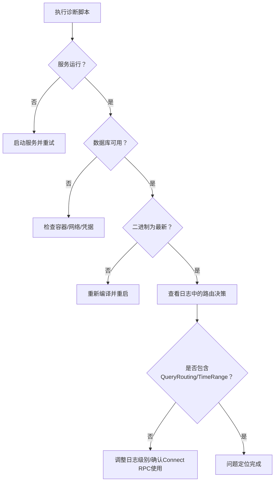

# 监控与日志

<cite>
**本文引用的文件**
- [internal/profile/profile.go](file://internal/profile/profile.go)
- [server/internal/observability/logger.go](file://server/internal/observability/logger.go)
- [server/router/api/v1/connect_interceptors.go](file://server/router/api/v1/connect_interceptors.go)
- [server/stats/stats.go](file://server/stats/stats.go)
- [store/db/db.go](file://store/db/db.go)
- [store/db/sqlite/sqlite.go](file://store/db/sqlite/sqlite.go)
- [store/cache/cache.go](file://store/cache/cache.go)
- [store/cache/tiered.go](file://store/cache/tiered.go)
- [scripts/diagnose_schedule_query.sh](file://scripts/diagnose_schedule_query.sh)
- [scripts/test_schedule_agent.sh](file://scripts/test_schedule_agent.sh)
- [scripts/test_schedule_retrieval.sh](file://scripts/test_schedule_retrieval.sh)
- [docs/archived/cleanup_20260123/RAG_SYSTEM_RESEARCH_REPORT.md](file://docs/archived/cleanup_20260123/RAG_SYSTEM_RESEARCH_REPORT.md)
</cite>

## 目录
1. [简介](#简介)
2. [项目结构](#项目结构)
3. [核心组件](#核心组件)
4. [架构总览](#架构总览)
5. [组件详解](#组件详解)
6. [依赖关系分析](#依赖关系分析)
7. [性能考量](#性能考量)
8. [故障排查指南](#故障排查指南)
9. [结论](#结论)
10. [附录](#附录)

## 简介
本指南面向运维与开发团队，系统化梳理本项目的监控与日志体系，覆盖应用性能监控（APM）、数据库监控、日志聚合与分析、告警规则与通知、性能基准与容量规划、故障诊断与调试技巧，以及分布式追踪与链路监控的落地方法。文档以仓库现有实现为依据，结合可扩展的最佳实践，帮助读者快速搭建稳定、可观测的生产环境。

## 项目结构
围绕监控与日志的关键目录与文件：
- 配置与环境：internal/profile/profile.go 提供运行模式、数据目录、数据库驱动与DSN等配置入口
- 结构化日志：server/internal/observability/logger.go 提供请求级上下文与字段注入
- 统一日志拦截器：server/router/api/v1/connect_interceptors.go 输出方法名与错误栈
- 内部统计：server/stats/stats.go 提供轻量本地统计（可作为观测数据源）
- 数据库层：store/db/db.go 与 store/db/sqlite/sqlite.go 定义数据库驱动与连接参数
- 缓存层：store/cache/cache.go 与 store/cache/tiered.go 提供缓存接口与分层缓存统计点
- 诊断脚本：scripts/*.sh 提供日程查询、智能体测试与检索诊断的自动化工具

**图表来源**
- [internal/profile/profile.go](file://internal/profile/profile.go#L15-L57)
- [server/internal/observability/logger.go](file://server/internal/observability/logger.go#L30-L72)
- [server/router/api/v1/connect_interceptors.go](file://server/router/api/v1/connect_interceptors.go#L98-L139)
- [server/stats/stats.go](file://server/stats/stats.go#L14-L45)
- [store/db/db.go](file://store/db/db.go#L27-L44)
- [store/db/sqlite/sqlite.go](file://store/db/sqlite/sqlite.go#L46-L69)
- [store/cache/cache.go](file://store/cache/cache.go#L10-L32)
- [store/cache/tiered.go](file://store/cache/tiered.go#L432-L446)
- [scripts/diagnose_schedule_query.sh](file://scripts/diagnose_schedule_query.sh#L1-L133)
- [scripts/test_schedule_agent.sh](file://scripts/test_schedule_agent.sh#L1-L188)
- [scripts/test_schedule_retrieval.sh](file://scripts/test_schedule_retrieval.sh#L79-L116)

**章节来源**
- [internal/profile/profile.go](file://internal/profile/profile.go#L15-L57)
- [server/internal/observability/logger.go](file://server/internal/observability/logger.go#L30-L72)
- [server/router/api/v1/connect_interceptors.go](file://server/router/api/v1/connect_interceptors.go#L98-L139)
- [server/stats/stats.go](file://server/stats/stats.go#L14-L45)
- [store/db/db.go](file://store/db/db.go#L27-L44)
- [store/db/sqlite/sqlite.go](file://store/db/sqlite/sqlite.go#L46-L69)
- [store/cache/cache.go](file://store/cache/cache.go#L10-L32)
- [store/cache/tiered.go](file://store/cache/tiered.go#L432-L446)
- [scripts/diagnose_schedule_query.sh](file://scripts/diagnose_schedule_query.sh#L1-L133)
- [scripts/test_schedule_agent.sh](file://scripts/test_schedule_agent.sh#L1-L188)
- [scripts/test_schedule_retrieval.sh](file://scripts/test_schedule_retrieval.sh#L79-L116)

## 核心组件
- 配置与环境(Profile)：集中管理运行模式、绑定地址、数据目录、数据库驱动与DSN、AI相关配置等，支持从环境变量加载与校验
- 结构化日志(RequestContext)：为每个请求生成唯一ID，注入用户ID、代理类型、耗时等字段，统一Info/Debug/Warn/Error输出
- 统一日志拦截器(LoggingInterceptor)：基于Connect错误分类输出方法名与错误栈，便于定位异常
- 内部统计(Collector)：周期性采集笔记、日程、搜索、活跃度、AI查询等指标，形成本地统计报表
- 数据库驱动(NewDBDriver)：根据配置选择SQLite或PostgreSQL驱动，确保连接参数合理
- 缓存接口与分层缓存：提供内存缓存与分层缓存接口，支持清理与淘汰回调；分层缓存统计点可用于观测命中率

**章节来源**
- [internal/profile/profile.go](file://internal/profile/profile.go#L15-L57)
- [server/internal/observability/logger.go](file://server/internal/observability/logger.go#L30-L72)
- [server/router/api/v1/connect_interceptors.go](file://server/router/api/v1/connect_interceptors.go#L98-L139)
- [server/stats/stats.go](file://server/stats/stats.go#L47-L88)
- [store/db/db.go](file://store/db/db.go#L27-L44)
- [store/cache/cache.go](file://store/cache/cache.go#L10-L32)
- [store/cache/tiered.go](file://store/cache/tiered.go#L432-L446)

## 架构总览
下图展示监控与日志在系统中的交互路径：请求经拦截器记录，结合结构化日志上下文输出；内部统计定期采集指标；数据库与缓存作为数据与性能观测对象；诊断脚本辅助问题定位。

**图表来源**
- [server/router/api/v1/connect_interceptors.go](file://server/router/api/v1/connect_interceptors.go#L98-L139)
- [server/internal/observability/logger.go](file://server/internal/observability/logger.go#L74-L97)
- [server/stats/stats.go](file://server/stats/stats.go#L66-L88)
- [store/cache/tiered.go](file://store/cache/tiered.go#L432-L446)

## 组件详解

### 应用性能监控与指标采集
- Prometheus 指标定义参考：RAG 研究报告中定义了检索延迟、缓存命中/未命中、API 成本、Reranker 调用次数等指标向量，可作为Prometheus采集目标
- 采集方式：在服务启动时注册指标，在关键路径（检索、缓存、AI调用）打点上报
- 可视化：结合Grafana仪表板对检索延迟分布、缓存命中率趋势、成本曲线进行可视化

**图表来源**
- [docs/archived/cleanup_20260123/RAG_SYSTEM_RESEARCH_REPORT.md](file://docs/archived/cleanup_20260123/RAG_SYSTEM_RESEARCH_REPORT.md#L1105-L1152)

**章节来源**
- [docs/archived/cleanup_20260123/RAG_SYSTEM_RESEARCH_REPORT.md](file://docs/archived/cleanup_20260123/RAG_SYSTEM_RESEARCH_REPORT.md#L1105-L1152)

### 结构化日志与请求上下文
- RequestContext 提供请求ID生成、用户ID、代理类型、起始时间注入，统一Info/Debug/Warn/Error输出
- 支持在中间件或业务逻辑中通过上下文提取请求信息，实现跨模块一致的日志风格

**图表来源**
- [server/internal/observability/logger.go](file://server/internal/observability/logger.go#L30-L72)

**章节来源**
- [server/internal/observability/logger.go](file://server/internal/observability/logger.go#L30-L72)

### 统一日志拦截器
- 基于Connect错误分类输出方法名与错误栈，支持可选堆栈跟踪输出
- 适用于gRPC/Connect服务，便于快速定位异常请求

**章节来源**
- [server/router/api/v1/connect_interceptors.go](file://server/router/api/v1/connect_interceptors.go#L98-L139)

### 内部统计与使用画像
- Collector 周期性采集笔记、日程、搜索、活跃度、AI查询等指标，形成本地统计
- GetSummary 提供人类可读摘要，适合在管理界面或运维面板展示

**图表来源**
- [server/stats/stats.go](file://server/stats/stats.go#L66-L88)
- [server/stats/stats.go](file://server/stats/stats.go#L125-L230)

**章节来源**
- [server/stats/stats.go](file://server/stats/stats.go#L47-L88)
- [server/stats/stats.go](file://server/stats/stats.go#L125-L230)

### 数据库监控策略
- 驱动选择：根据Profile.Driver选择SQLite或PostgreSQL
- SQLite连接参数：显式设置WAL、busy_timeout等，减少锁竞争
- 监控要点：连接池健康、慢查询、事务阻塞、表空间与索引使用情况

**图表来源**
- [store/db/db.go](file://store/db/db.go#L27-L44)
- [store/db/sqlite/sqlite.go](file://store/db/sqlite/sqlite.go#L46-L69)

**章节来源**
- [store/db/db.go](file://store/db/db.go#L27-L44)
- [store/db/sqlite/sqlite.go](file://store/db/sqlite/sqlite.go#L46-L69)

### 缓存监控与命中率
- 接口与实现：Interface定义Set/Get/Delete/Clear/Size/Close等操作
- 分层缓存统计点：tiered.go中预留L1/L2/语义缓存命中率与总数统计位，便于接入Prometheus
- 建议：在Cache实现中增加原子计数器，上报命中/未命中总量，计算命中率

**章节来源**
- [store/cache/cache.go](file://store/cache/cache.go#L10-L32)
- [store/cache/tiered.go](file://store/cache/tiered.go#L432-L446)

### 日志聚合与分析方案
- 结构化字段：request_id、user_id、agent_type、duration_ms、error_code、event_type、iteration
- 日志拦截器：输出方法名与错误栈，便于聚合与检索
- 建议：将日志输出到stdout，配合容器平台（如Kubernetes）收集；或对接ELK/Loki，实现全文检索与指标聚合

**章节来源**
- [server/internal/observability/logger.go](file://server/internal/observability/logger.go#L11-L28)
- [server/router/api/v1/connect_interceptors.go](file://server/router/api/v1/connect_interceptors.go#L119-L129)

### 告警规则与通知渠道
- 规则示例：检索延迟P95超阈、缓存命中率持续下降、API错误率上升、Reranker调用异常激增
- 通知渠道：邮件、Webhook、IM机器人等，结合Grafana告警中心或Prometheus Alertmanager

**章节来源**
- [docs/archived/cleanup_20260123/RAG_SYSTEM_RESEARCH_REPORT.md](file://docs/archived/cleanup_20260123/RAG_SYSTEM_RESEARCH_REPORT.md#L1105-L1152)

### 分布式追踪与链路监控
- 请求ID：RequestContext生成全局唯一request_id，贯穿请求生命周期
- 建议：在HTTP/gRPC网关、中间件、数据库访问、缓存调用、外部AI服务调用处注入/透传request_id
- 工具：OpenTelemetry或Jaeger，结合Grafana Tempo可视化

**章节来源**
- [server/internal/observability/logger.go](file://server/internal/observability/logger.go#L124-L127)

## 依赖关系分析
- 配置(Profile)驱动数据库驱动选择与数据目录校验
- 日志拦截器依赖结构化日志上下文，统一输出格式
- 统计采集器依赖存储层读取指标
- 缓存层为统计与检索提供性能支撑

**图表来源**
- [internal/profile/profile.go](file://internal/profile/profile.go#L15-L57)
- [store/db/db.go](file://store/db/db.go#L27-L44)
- [server/router/api/v1/connect_interceptors.go](file://server/router/api/v1/connect_interceptors.go#L98-L139)
- [server/internal/observability/logger.go](file://server/internal/observability/logger.go#L30-L72)
- [server/stats/stats.go](file://server/stats/stats.go#L47-L88)
- [store/cache/tiered.go](file://store/cache/tiered.go#L432-L446)

**章节来源**
- [internal/profile/profile.go](file://internal/profile/profile.go#L15-L57)
- [store/db/db.go](file://store/db/db.go#L27-L44)
- [server/router/api/v1/connect_interceptors.go](file://server/router/api/v1/connect_interceptors.go#L98-L139)
- [server/internal/observability/logger.go](file://server/internal/observability/logger.go#L30-L72)
- [server/stats/stats.go](file://server/stats/stats.go#L47-L88)
- [store/cache/tiered.go](file://store/cache/tiered.go#L432-L446)

## 性能考量
- 连接池与WAL：SQLite启用WAL与合理的busy_timeout，降低锁争用
- 缓存策略：合理设置TTL与最大项数，利用清理循环与淘汰回调控制内存占用
- 统计频率：每小时一次的统计采集频率适中，避免对在线业务造成压力
- 指标打点：在检索、缓存、AI调用等热点路径打点，避免过度采样影响性能

**章节来源**
- [store/db/sqlite/sqlite.go](file://store/db/sqlite/sqlite.go#L46-L69)
- [store/cache/cache.go](file://store/cache/cache.go#L56-L64)
- [server/stats/stats.go](file://server/stats/stats.go#L66-L88)

## 故障排查指南
- 日程查询诊断：脚本自动检查服务状态、数据库连接、二进制版本与日志中的日期解析
- 智能体测试：脚本自动检查环境变量、服务状态、Token并提供查询/创建/周查询测试
- 检索诊断：指导在实时日志中观察QueryRouting与时间范围，定位路由策略与日志级别问题

**图表来源**
- [scripts/diagnose_schedule_query.sh](file://scripts/diagnose_schedule_query.sh#L18-L99)
- [scripts/test_schedule_agent.sh](file://scripts/test_schedule_agent.sh#L44-L77)
- [scripts/test_schedule_retrieval.sh](file://scripts/test_schedule_retrieval.sh#L79-L116)

**章节来源**
- [scripts/diagnose_schedule_query.sh](file://scripts/diagnose_schedule_query.sh#L1-L133)
- [scripts/test_schedule_agent.sh](file://scripts/test_schedule_agent.sh#L1-L188)
- [scripts/test_schedule_retrieval.sh](file://scripts/test_schedule_retrieval.sh#L79-L116)

## 结论
本项目已具备完善的日志结构化、拦截与统计能力，并在数据库与缓存层面提供了可观测的切入点。结合Prometheus指标与Grafana仪表板，可快速构建应用性能监控体系；通过诊断脚本与请求ID追踪，能够高效定位问题根因。建议在此基础上逐步完善分布式追踪与告警通知，形成闭环的可观测性体系。

## 附录
- 配置项参考：运行模式、绑定地址、数据目录、数据库驱动与DSN、AI Provider与模型配置
- 指标清单参考：检索延迟、缓存命中/未命中、API成本、Reranker调用次数
- 诊断命令参考：日程查询诊断、智能体测试、检索诊断

**章节来源**
- [internal/profile/profile.go](file://internal/profile/profile.go#L15-L57)
- [docs/archived/cleanup_20260123/RAG_SYSTEM_RESEARCH_REPORT.md](file://docs/archived/cleanup_20260123/RAG_SYSTEM_RESEARCH_REPORT.md#L1105-L1152)
- [scripts/diagnose_schedule_query.sh](file://scripts/diagnose_schedule_query.sh#L1-L133)
- [scripts/test_schedule_agent.sh](file://scripts/test_schedule_agent.sh#L1-L188)
- [scripts/test_schedule_retrieval.sh](file://scripts/test_schedule_retrieval.sh#L79-L116)