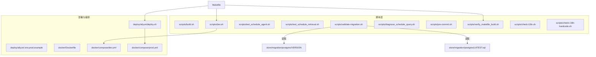
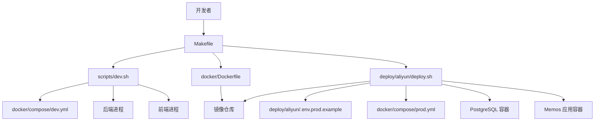
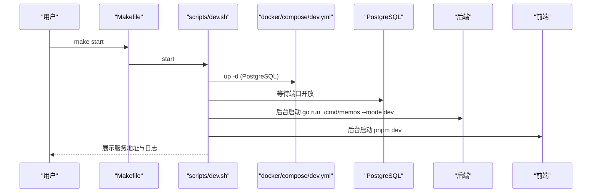
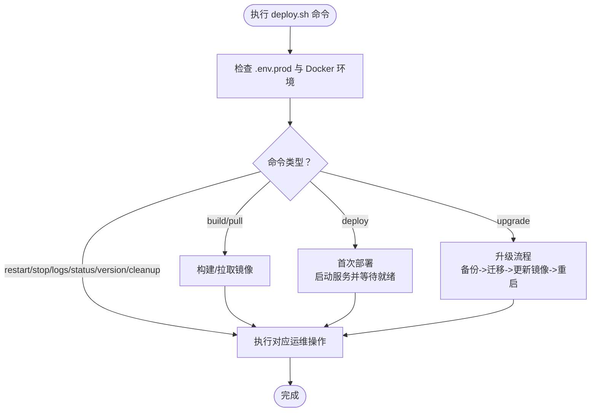
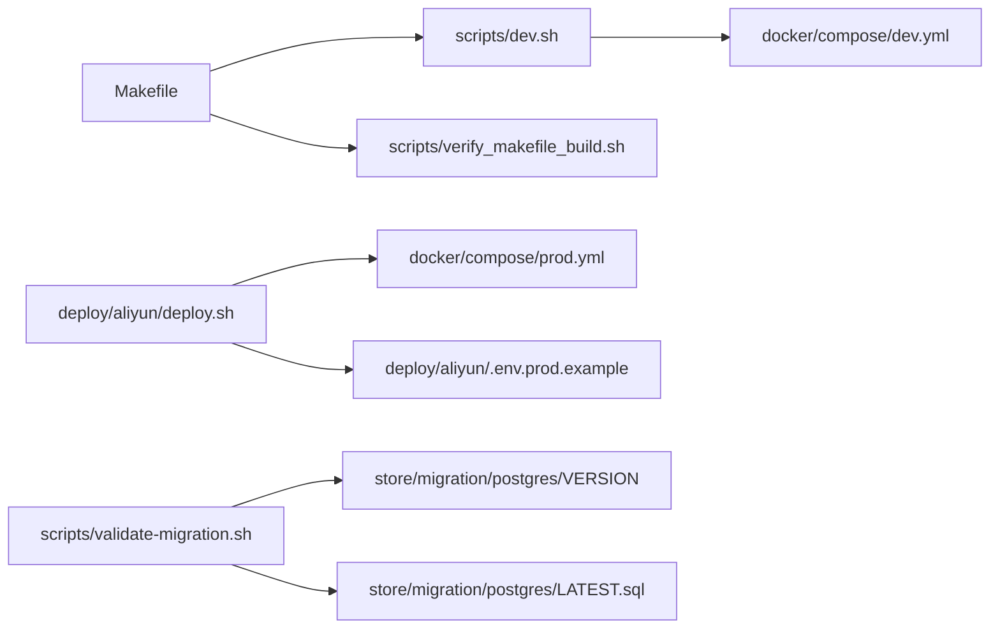

# 运维自动化脚本

<cite>
**本文引用的文件**
- [scripts/build.sh](file://scripts/build.sh)
- [scripts/dev.sh](file://scripts/dev.sh)
- [scripts/test_schedule_agent.sh](file://scripts/test_schedule_agent.sh)
- [scripts/test_schedule_retrieval.sh](file://scripts/test_schedule_retrieval.sh)
- [scripts/validate-migration.sh](file://scripts/validate-migration.sh)
- [scripts/diagnose_schedule_query.sh](file://scripts/diagnose_schedule_query.sh)
- [scripts/pre-commit.sh](file://scripts/pre-commit.sh)
- [scripts/verify_makefile_build.sh](file://scripts/verify_makefile_build.sh)
- [scripts/check-i18n.sh](file://scripts/check-i18n.sh)
- [scripts/check-i18n-hardcode.sh](file://scripts/check-i18n-hardcode.sh)
- [deploy/aliyun/deploy.sh](file://deploy/aliyun/deploy.sh)
- [deploy/aliyun/.env.prod.example](file://deploy/aliyun/.env.prod.example)
- [docker/Dockerfile](file://docker/Dockerfile)
- [docker/compose/dev.yml](file://docker/compose/dev.yml)
- [docker/compose/prod.yml](file://docker/compose/prod.yml)
- [Makefile](file://Makefile)
</cite>

## 目录
1. [简介](#简介)
2. [项目结构](#项目结构)
3. [核心组件](#核心组件)
4. [架构总览](#架构总览)
5. [详细组件分析](#详细组件分析)
6. [依赖分析](#依赖分析)
7. [性能考虑](#性能考虑)
8. [故障排除指南](#故障排除指南)
9. [结论](#结论)
10. [附录](#附录)

## 简介
本指南面向运维与开发工程师，系统讲解仓库中的运维自动化脚本与工具，涵盖构建脚本、开发环境启动脚本、测试脚本、数据库迁移校验、部署脚本以及 CI/CD 集成方法，并提供调试与排障技巧及自定义脚本开发模板与最佳实践。

## 项目结构
围绕“脚本与自动化”的组织方式如下：
- scripts/：各类运维与开发辅助脚本（构建、开发环境、测试、校验、预提交钩子等）
- deploy/aliyun/：生产部署脚本与示例环境配置
- docker/：容器镜像与开发/生产 Compose 编排
- Makefile：统一入口，封装常用运维动作
- store/migration/postgres/：数据库迁移脚本与版本文件

图表来源
- [Makefile](file://Makefile#L59-L66)
- [scripts/dev.sh](file://scripts/dev.sh#L1-L682)
- [scripts/verify_makefile_build.sh](file://scripts/verify_makefile_build.sh#L1-L70)
- [deploy/aliyun/deploy.sh](file://deploy/aliyun/deploy.sh#L1-L601)
- [docker/compose/dev.yml](file://docker/compose/dev.yml#L1-L49)
- [docker/compose/prod.yml](file://docker/compose/prod.yml#L1-L119)
- [scripts/validate-migration.sh](file://scripts/validate-migration.sh#L1-L90)

章节来源
- [Makefile](file://Makefile#L1-L384)
- [scripts/dev.sh](file://scripts/dev.sh#L1-L682)
- [scripts/verify_makefile_build.sh](file://scripts/verify_makefile_build.sh#L1-L70)
- [deploy/aliyun/deploy.sh](file://deploy/aliyun/deploy.sh#L1-L601)
- [docker/compose/dev.yml](file://docker/compose/dev.yml#L1-L49)
- [docker/compose/prod.yml](file://docker/compose/prod.yml#L1-L119)
- [scripts/validate-migration.sh](file://scripts/validate-migration.sh#L1-L90)

## 核心组件
- 构建脚本：scripts/build.sh，负责跨平台构建后端二进制并配置 Go 构建缓存。
- 开发环境脚本：scripts/dev.sh，一键启动/停止/重启 PostgreSQL、后端、前端，带健康检查、日志与状态展示。
- 测试脚本：scripts/test_schedule_agent.sh 与 scripts/test_schedule_retrieval.sh，分别用于 AI 日程智能体与日程检索功能的快速验证。
- 迁移校验：scripts/validate-migration.sh，校验 VERSION、LATEST.sql 一致性与约束存在性，并可选进行 SQL 语法校验。
- 诊断脚本：scripts/diagnose_schedule_query.sh，针对“某日查询无结果”场景的系统化诊断。
- 预提交钩子：scripts/pre-commit.sh，提交前检查 Go 构建、国际化键同步、前端 Lint。
- Makefile 验证：scripts/verify_makefile_build.sh，验证 Makefile 的 start/restart 是否自动触发 build。
- 生产部署：deploy/aliyun/deploy.sh，构建/拉取镜像、部署、升级、备份/恢复、日志/状态查看、版本信息、镜像加速配置。
- 环境配置：deploy/aliyun/.env.prod.example，生产环境关键配置项示例。
- 容器与编排：docker/Dockerfile、docker/compose/dev.yml、docker/compose/prod.yml，定义镜像构建、开发/生产服务编排与资源限制。
- 国际化检查：scripts/check-i18n.sh、scripts/check-i18n-hardcode.sh，保证前端文案键值一致与避免硬编码。

章节来源
- [scripts/build.sh](file://scripts/build.sh#L1-L33)
- [scripts/dev.sh](file://scripts/dev.sh#L1-L682)
- [scripts/test_schedule_agent.sh](file://scripts/test_schedule_agent.sh#L1-L188)
- [scripts/test_schedule_retrieval.sh](file://scripts/test_schedule_retrieval.sh#L1-L117)
- [scripts/validate-migration.sh](file://scripts/validate-migration.sh#L1-L90)
- [scripts/diagnose_schedule_query.sh](file://scripts/diagnose_schedule_query.sh#L1-L133)
- [scripts/pre-commit.sh](file://scripts/pre-commit.sh#L1-L58)
- [scripts/verify_makefile_build.sh](file://scripts/verify_makefile_build.sh#L1-L70)
- [deploy/aliyun/deploy.sh](file://deploy/aliyun/deploy.sh#L1-L601)
- [deploy/aliyun/.env.prod.example](file://deploy/aliyun/.env.prod.example#L1-L103)
- [docker/Dockerfile](file://docker/Dockerfile#L1-L58)
- [docker/compose/dev.yml](file://docker/compose/dev.yml#L1-L49)
- [docker/compose/prod.yml](file://docker/compose/prod.yml#L1-L119)
- [scripts/check-i18n.sh](file://scripts/check-i18n.sh#L1-L98)
- [scripts/check-i18n-hardcode.sh](file://scripts/check-i18n-hardcode.sh#L1-L57)

## 架构总览
下图展示了开发与生产的典型自动化路径，以及脚本之间的协作关系：

图表来源
- [Makefile](file://Makefile#L59-L66)
- [scripts/dev.sh](file://scripts/dev.sh#L536-L622)
- [docker/compose/dev.yml](file://docker/compose/dev.yml#L1-L49)
- [docker/Dockerfile](file://docker/Dockerfile#L1-L58)
- [deploy/aliyun/deploy.sh](file://deploy/aliyun/deploy.sh#L237-L309)
- [deploy/aliyun/.env.prod.example](file://deploy/aliyun/.env.prod.example#L1-L103)
- [docker/compose/prod.yml](file://docker/compose/prod.yml#L1-L119)

## 详细组件分析

### 构建脚本：scripts/build.sh
- 功能要点
  - 切换到仓库根目录，自动识别操作系统并设置输出二进制名称。
  - 创建构建缓存目录并设置 GOCACHE/GOMODCACHE，提升构建稳定性与速度。
  - 使用 go build 产出二进制，并给出运行提示（以 dev 模式启动）。
- 适用场景
  - 本地快速构建后端；CI 中作为独立构建步骤；配合 Makefile 的 build 目标。
- 参数与环境
  - 无显式参数；依赖当前目录与 go 环境。
- 注意事项
  - 若需交叉编译，可在 CI 中通过环境变量或参数扩展（当前脚本未实现）。

章节来源
- [scripts/build.sh](file://scripts/build.sh#L1-L33)

### 开发环境脚本：scripts/dev.sh
- 功能要点
  - 支持 start/stop/restart/status/logs 子命令。
  - 自动检查 Docker、端口占用、容器健康状态。
  - 后端：后台运行 go run ./cmd/memos --mode dev，记录 PID 与日志。
  - 前端：在 web 目录执行 pnpm dev，记录 PID 与日志。
  - PostgreSQL：基于 docker/compose/dev.yml 启停，等待端口开放。
  - 日志：支持 tail 最近日志与实时跟踪（-f），区分 postgres/backend/frontend。
  - 状态：统一展示各服务运行状态与 PID/URL。
- 参数与环境
  - 无参数；自动加载 .env；端口、容器名、日志路径可配置。
- 适用场景
  - 本地联调（后端+前端+数据库）；持续集成中的开发态服务启动。
- 优化建议
  - 可增加“优雅停止”与“孤儿进程清理”策略（脚本已具备基础清理逻辑）。

图表来源
- [Makefile](file://Makefile#L59-L66)
- [scripts/dev.sh](file://scripts/dev.sh#L536-L566)
- [docker/compose/dev.yml](file://docker/compose/dev.yml#L1-L49)

章节来源
- [scripts/dev.sh](file://scripts/dev.sh#L1-L682)
- [docker/compose/dev.yml](file://docker/compose/dev.yml#L1-L49)

### 测试脚本：scripts/test_schedule_agent.sh
- 功能要点
  - 校验 .env 中 AI 相关环境变量与后端服务可达性。
  - 提供交互菜单：查询明天日程、创建后天日程、查询本周日程、运行全部。
  - 使用 curl 调用 AI Chat 接口，解析响应内容。
- 参数与环境
  - 依赖 .env（MEMOS_AI_ENABLED、MEMOS_AI_LLM_PROVIDER、MEMOS_TEST_TOKEN 等）。
- 适用场景
  - 快速验证日程智能体能力与接口连通性。

章节来源
- [scripts/test_schedule_agent.sh](file://scripts/test_schedule_agent.sh#L1-L188)

### 测试脚本：scripts/test_schedule_retrieval.sh
- 功能要点
  - 查询数据库中某一天的日程，计算时间戳范围，核对日程是否落入范围。
  - 引导查看后端日志中的路由决策与检索结果，定位检索链路问题。
- 参数与环境
  - 无参数；依赖 docker exec 与 psql。
- 适用场景
  - 验证日程检索功能与时间范围过滤逻辑。

章节来源
- [scripts/test_schedule_retrieval.sh](file://scripts/test_schedule_retrieval.sh#L1-L117)

### 迁移校验：scripts/validate-migration.sh
- 功能要点
  - 校验 store/migration/postgres/VERSION 与 LATEST.sql 中 schema_version 是否一致。
  - 校验目标迁移文件是否存在，并检查约束是否出现在 LATEST.sql。
  - 可选使用 psql --parse-only 校验 SQL 语法。
- 参数与环境
  - 无参数；读取固定路径文件。
- 适用场景
  - 发布前的迁移一致性与语法检查。

章节来源
- [scripts/validate-migration.sh](file://scripts/validate-migration.sh#L1-L90)

### 诊断脚本：scripts/diagnose_schedule_query.sh
- 功能要点
  - 检查服务与数据库容器状态。
  - 查询某日程数量与详情，判断是否存在数据。
  - 检查代码版本与二进制编译时间，提示重新编译。
  - 引导查看后端日志中的 QueryRouting/TimeRange 关键信息。
- 参数与环境
  - 无参数；依赖 docker exec 与 psql。
- 适用场景
  - “某日查询无结果”的系统化排查。

章节来源
- [scripts/diagnose_schedule_query.sh](file://scripts/diagnose_schedule_query.sh#L1-L133)

### 预提交钩子：scripts/pre-commit.sh
- 功能要点
  - 提交前检查暂存文件类型（Go、前端 TS/TSX、JSON）。
  - 对 Go 文件执行 go build；对 i18n 文件执行 check-i18n.sh；对前端文件执行 pnpm lint。
- 参数与环境
  - 无参数；依赖 git 与 Node 生态。
- 适用场景
  - 本地提交前的质量门禁。

章节来源
- [scripts/pre-commit.sh](file://scripts/pre-commit.sh#L1-L58)
- [scripts/check-i18n.sh](file://scripts/check-i18n.sh#L1-L98)
- [scripts/check-i18n-hardcode.sh](file://scripts/check-i18n-hardcode.sh#L1-L57)

### Makefile 验证：scripts/verify_makefile_build.sh
- 功能要点
  - 检查 Makefile 的 start 与 restart 是否依赖 build。
  - 解释“make start/restart”如何先执行 build 再执行 dev.sh。
- 参数与环境
  - 无参数；读取 Makefile。
- 适用场景
  - 确保团队统一使用 Makefile 的自动编译流程。

章节来源
- [scripts/verify_makefile_build.sh](file://scripts/verify_makefile_build.sh#L1-L70)
- [Makefile](file://Makefile#L59-L66)

### 生产部署脚本：deploy/aliyun/deploy.sh
- 功能要点
  - build/pull：构建或拉取生产镜像（支持 USER_IMAGE 覆盖）。
  - deploy/upgrade：首次部署与升级（自动备份、执行迁移、更新镜像、重启服务）。
  - restart/stop/logs/status/version/cleanup：运维常用操作。
  - setup：配置 Docker 镜像加速（国内友好）。
- 参数与环境
  - 依赖 .env.prod（数据库、实例 URL、AI 配置、镜像配置等）。
- 适用场景
  - 2C2G 单机生产部署与日常运维。

图表来源
- [deploy/aliyun/deploy.sh](file://deploy/aliyun/deploy.sh#L520-L598)
- [deploy/aliyun/.env.prod.example](file://deploy/aliyun/.env.prod.example#L1-L103)

章节来源
- [deploy/aliyun/deploy.sh](file://deploy/aliyun/deploy.sh#L1-L601)
- [deploy/aliyun/.env.prod.example](file://deploy/aliyun/.env.prod.example#L1-L103)

### 容器与编排
- docker/Dockerfile
  - 分阶段构建：后端构建阶段下载依赖并编译静态二进制；最终镜像使用 Alpine，非 root 用户，暴露 5230 端口。
- docker/compose/dev.yml
  - 开发态 PostgreSQL，内存参数与健康检查，映射 25432:5432。
- docker/compose/prod.yml
  - 生产态 PostgreSQL + Memos，环境变量来自 .env.prod，健康检查与资源限制。

章节来源
- [docker/Dockerfile](file://docker/Dockerfile#L1-L58)
- [docker/compose/dev.yml](file://docker/compose/dev.yml#L1-L49)
- [docker/compose/prod.yml](file://docker/compose/prod.yml#L1-L119)

## 依赖分析
- Makefile 与脚本耦合
  - make start/restart 依赖 build，再调用 scripts/dev.sh，确保每次启动前都使用最新二进制。
- 脚本间依赖
  - deploy.sh 依赖 docker/compose/prod.yml 与 .env.prod；scripts/dev.sh 依赖 docker/compose/dev.yml。
  - scripts/validate-migration.sh 依赖 store/migration/postgres 下的 VERSION 与 LATEST.sql。
- 外部依赖
  - Docker 与 docker-compose；Go 与 pnpm（构建镜像时）；psql（迁移与诊断）。

图表来源
- [Makefile](file://Makefile#L59-L66)
- [scripts/dev.sh](file://scripts/dev.sh#L1-L682)
- [scripts/verify_makefile_build.sh](file://scripts/verify_makefile_build.sh#L1-L70)
- [docker/compose/dev.yml](file://docker/compose/dev.yml#L1-L49)
- [deploy/aliyun/deploy.sh](file://deploy/aliyun/deploy.sh#L1-L601)
- [deploy/aliyun/.env.prod.example](file://deploy/aliyun/.env.prod.example#L1-L103)
- [scripts/validate-migration.sh](file://scripts/validate-migration.sh#L1-L90)

章节来源
- [Makefile](file://Makefile#L59-L66)
- [scripts/dev.sh](file://scripts/dev.sh#L1-L682)
- [scripts/verify_makefile_build.sh](file://scripts/verify_makefile_build.sh#L1-L70)
- [deploy/aliyun/deploy.sh](file://deploy/aliyun/deploy.sh#L1-L601)
- [scripts/validate-migration.sh](file://scripts/validate-migration.sh#L1-L90)

## 性能考虑
- 构建缓存
  - scripts/build.sh 与 docker/Dockerfile 均利用缓存层（GOMODCACHE、go/pkg/mod、~/.cache/go-build），减少重复下载与编译时间。
- 容器资源限制
  - docker/compose/dev.yml 与 prod.yml 为 PostgreSQL 与应用设置了 CPU/内存上限与保留值，避免资源争抢。
- 日志轮转
  - docker/Dockerfile 中配置了 json-file 驱动与日志大小/文件数限制，便于生产日志管理（结合 deploy.sh 的日志查看与备份）。

章节来源
- [scripts/build.sh](file://scripts/build.sh#L22-L25)
- [docker/Dockerfile](file://docker/Dockerfile#L34-L43)
- [docker/compose/dev.yml](file://docker/compose/dev.yml#L27-L44)
- [docker/compose/prod.yml](file://docker/compose/prod.yml#L39-L56)

## 故障排除指南
- 开发环境无法启动
  - 使用 scripts/dev.sh status 查看各服务状态；使用 logs 查看后端/前端/数据库日志。
  - 确认 Docker 已运行且端口未被占用；必要时执行 scripts/dev.sh restart。
- 后端启动超时
  - 等待机制与端口检查会提示超时；查看后端日志定位启动失败原因。
- 前端无法访问
  - 确认前端端口映射与防火墙；查看前端日志；尝试 pnpm dev 直接启动。
- 生产部署失败
  - 使用 deploy.sh logs 查看服务日志；检查 .env.prod 配置；必要时执行 deploy.sh upgrade 并自动备份。
- 迁移失败
  - 使用 scripts/validate-migration.sh 校验 VERSION 与 LATEST.sql 一致性；若 psql 可用，启用语法校验。
- 日程查询无结果
  - 使用 scripts/diagnose_schedule_query.sh 检查服务、数据库、代码版本与日志中的路由决策信息。
- 提交被阻断
  - 运行 scripts/pre-commit.sh 或 make check-all；修复 Go 构建、i18n 键缺失、前端 Lint 问题。

章节来源
- [scripts/dev.sh](file://scripts/dev.sh#L429-L530)
- [deploy/aliyun/deploy.sh](file://deploy/aliyun/deploy.sh#L396-L422)
- [scripts/validate-migration.sh](file://scripts/validate-migration.sh#L70-L84)
- [scripts/diagnose_schedule_query.sh](file://scripts/diagnose_schedule_query.sh#L1-L133)
- [scripts/pre-commit.sh](file://scripts/pre-commit.sh#L1-L58)

## 结论
本仓库提供了完善的运维自动化脚本体系：从本地开发到生产部署，从构建、测试到迁移校验与诊断，形成闭环。通过 Makefile 统一入口与脚本间的明确分工，团队可高效地完成日常运维与发布任务。建议在 CI/CD 中集成上述脚本，以实现标准化、可追溯的流水线。

## 附录

### CI/CD 集成建议
- 触发条件
  - push 到 feature 分支触发构建与测试；push 到 main 触发生产部署。
- 关键步骤
  - 安装依赖：go、pnpm、docker、docker-compose。
  - 代码检查：make check-all。
  - 构建：make build 或 make start（自动触发 build）。
  - 测试：make test、scripts/test_schedule_agent.sh、scripts/test_schedule_retrieval.sh。
  - 迁移校验：scripts/validate-migration.sh。
  - 生产部署：deploy/aliyun/deploy.sh deploy/upgrade。
- 缓存策略
  - 缓存 GOMODCACHE、go/pkg/mod、node_modules、~/.cache/go-build。
- 日志与备份
  - 使用 deploy.sh logs 与 prod-backup 备份数据库。

章节来源
- [Makefile](file://Makefile#L245-L265)
- [scripts/test_schedule_agent.sh](file://scripts/test_schedule_agent.sh#L1-L188)
- [scripts/test_schedule_retrieval.sh](file://scripts/test_schedule_retrieval.sh#L1-L117)
- [scripts/validate-migration.sh](file://scripts/validate-migration.sh#L1-L90)
- [deploy/aliyun/deploy.sh](file://deploy/aliyun/deploy.sh#L311-L378)

### 常见运维任务自动化清单
- 数据库迁移
  - 校验：scripts/validate-migration.sh
  - 执行：deploy/aliyun/deploy.sh upgrade（自动备份与迁移）
- 缓存清理
  - 前端缓存：make clean-all（清理 node_modules 与构建缓存）
  - Go 构建缓存：scripts/build.sh 中的 .gocache/.gomodcache（可定期清理）
- 日志轮转
  - 使用 docker 日志驱动与大小限制（docker/Dockerfile），结合 deploy.sh logs 与备份

章节来源
- [scripts/validate-migration.sh](file://scripts/validate-migration.sh#L1-L90)
- [deploy/aliyun/deploy.sh](file://deploy/aliyun/deploy.sh#L424-L450)
- [scripts/build.sh](file://scripts/build.sh#L22-L25)
- [Makefile](file://Makefile#L205-L211)
- [docker/Dockerfile](file://docker/Dockerfile#L34-L43)

### 自定义运维脚本开发模板与最佳实践
- 模板结构
  - 解析参数与环境变量
  - 定义颜色输出与日志函数
  - 统一错误处理与退出码
  - 明确依赖检查（Docker、Go、psql 等）
  - 提供 help 与示例
- 最佳实践
  - 使用 set -e 与 set -u 防止静默失败
  - 优先使用 docker exec/psql 等容器内工具，避免主机依赖
  - 将关键配置放入 .env 或 .env.prod，避免硬编码
  - 为长耗时操作提供进度与超时控制
  - 为生产脚本提供 dry-run 与确认提示（如备份/恢复）

章节来源
- [scripts/pre-commit.sh](file://scripts/pre-commit.sh#L1-L58)
- [deploy/aliyun/deploy.sh](file://deploy/aliyun/deploy.sh#L55-L91)
- [scripts/dev.sh](file://scripts/dev.sh#L43-L86)