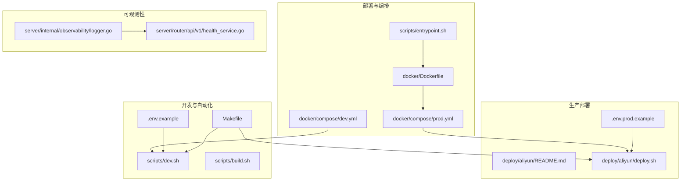
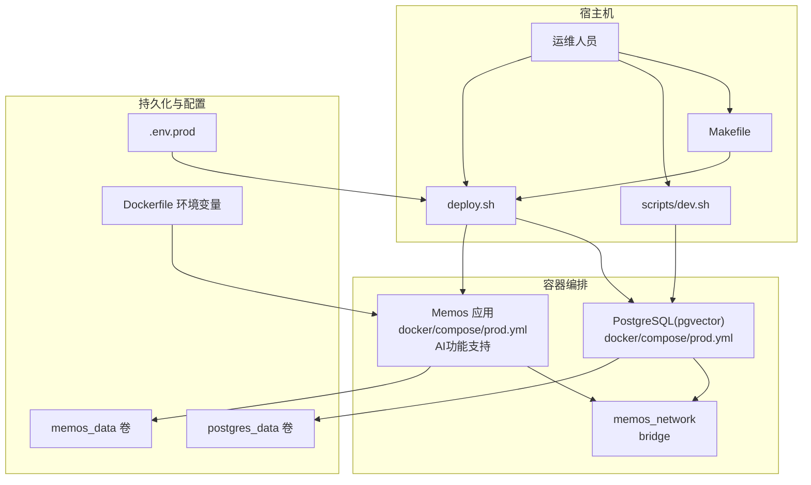
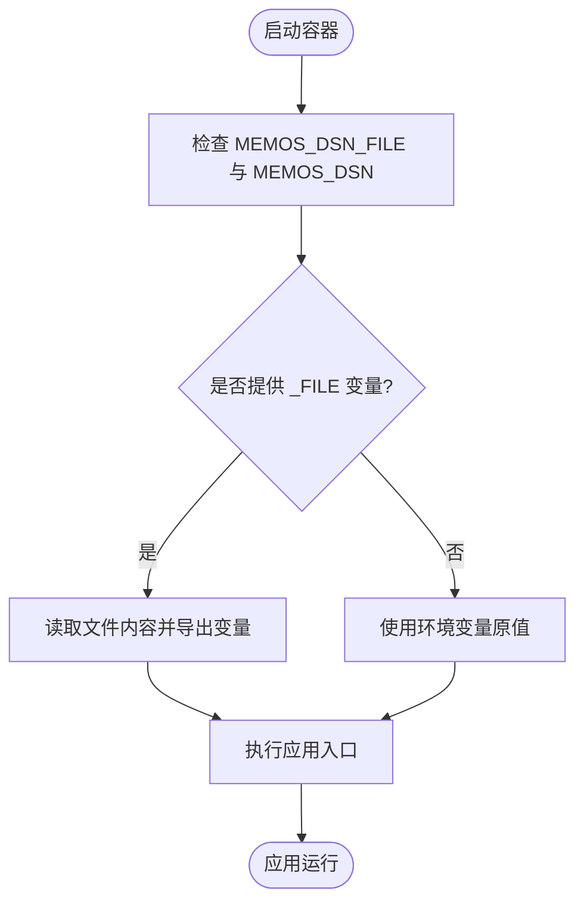
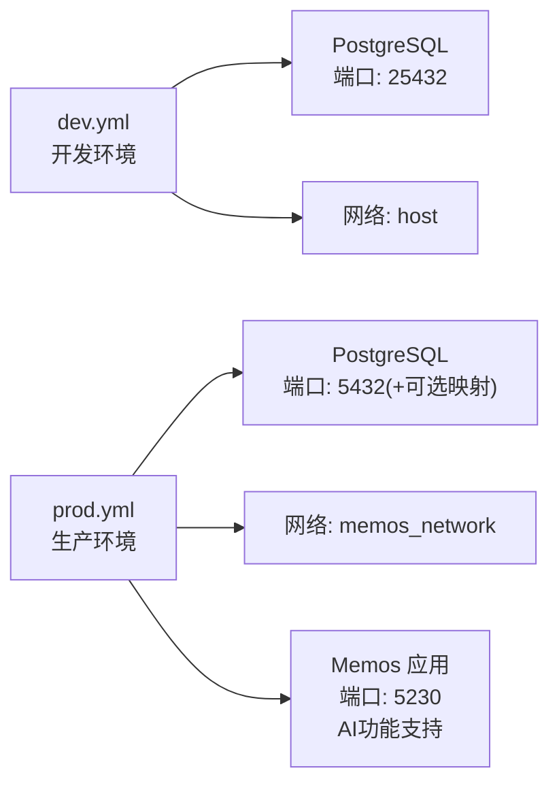
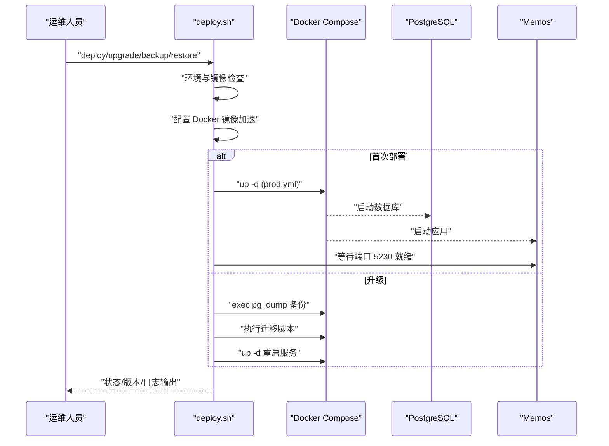
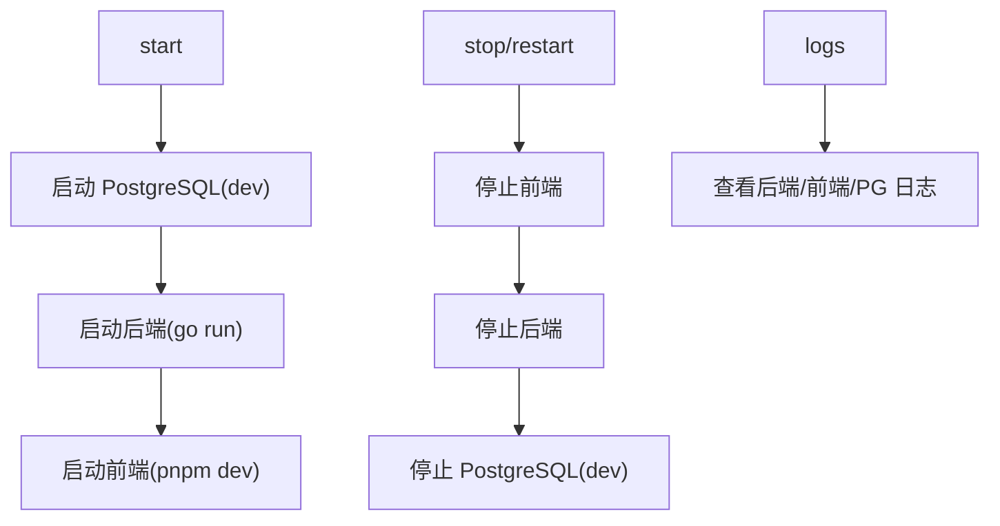
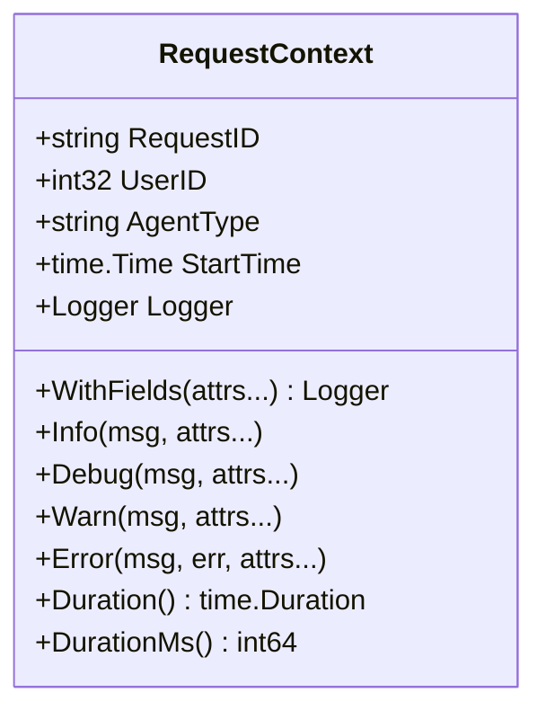
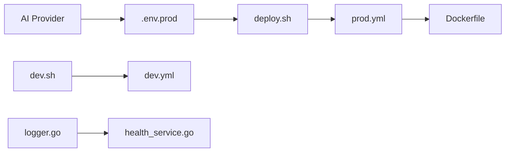

# 部署与运维

<cite>
**本文引用的文件**
- [deploy/aliyun/README.md](file://deploy/aliyun/README.md)
- [deploy/aliyun/.env.prod.example](file://deploy/aliyun/.env.prod.example)
- [deploy/aliyun/deploy.sh](file://deploy/aliyun/deploy.sh)
- [docker/compose/dev.yml](file://docker/compose/dev.yml)
- [docker/compose/prod.yml](file://docker/compose/prod.yml)
- [docker/Dockerfile](file://docker/Dockerfile)
- [docker/README.md](file://docker/README.md)
- [scripts/entrypoint.sh](file://scripts/entrypoint.sh)
- [scripts/dev.sh](file://scripts/dev.sh)
- [scripts/build.sh](file://scripts/build.sh)
- [Makefile](file://Makefile)
- [.env.example](file://.env.example)
- [server/internal/observability/logger.go](file://server/internal/observability/logger.go)
- [server/router/api/v1/health_service.go](file://server/router/api/v1/health_service.go)
</cite>

## 更新摘要
**变更内容**
- 新增了完整的阿里云2C2G单机部署指南和配置方案
- 重写了生产环境配置文件，全面支持AI功能配置
- 增强了部署脚本，支持预构建镜像和国内镜像加速
- 扩展了Docker Compose配置，包含AI功能支持
- 完善了环境变量管理，支持多种AI Provider和模型配置

## 目录
1. [简介](#简介)
2. [项目结构](#项目结构)
3. [核心组件](#核心组件)
4. [架构总览](#架构总览)
5. [详细组件分析](#详细组件分析)
6. [依赖关系分析](#依赖关系分析)
7. [性能考量](#性能考量)
8. [故障排查指南](#故障排查指南)
9. [结论](#结论)
10. [附录](#附录)

## 简介
本指南面向部署与运维工程师，系统性说明 Memos 的容器化与单机生产部署、开发与生产环境差异、环境变量与敏感信息管理、监控与日志、备份与灾难恢复、升级流程以及运维自动化脚本与故障排除工具。内容基于仓库中的部署脚本、Compose 编排、Dockerfile、环境变量模板与健康检查实现进行整理，特别强化了AI功能的部署支持。

## 项目结构
围绕部署与运维的关键目录与文件：
- deploy/aliyun：单机生产部署文档、环境变量模板与一键部署脚本
- docker：容器镜像构建与开发/生产 Compose 编排
- scripts：开发环境管理脚本、入口脚本与构建脚本
- Makefile：统一的开发与生产命令入口
- server/internal/observability：结构化日志与请求上下文
- server/router/api/v1：健康检查接口

**图表来源**
- [docker/Dockerfile](file://docker/Dockerfile#L1-L58)
- [docker/compose/dev.yml](file://docker/compose/dev.yml#L1-L49)
- [docker/compose/prod.yml](file://docker/compose/prod.yml#L1-L119)
- [scripts/entrypoint.sh](file://scripts/entrypoint.sh#L1-L32)
- [deploy/aliyun/README.md](file://deploy/aliyun/README.md#L1-L337)
- [deploy/aliyun/.env.prod.example](file://deploy/aliyun/.env.prod.example#L1-L174)
- [deploy/aliyun/deploy.sh](file://deploy/aliyun/deploy.sh#L1-L601)
- [scripts/dev.sh](file://scripts/dev.sh#L1-L682)
- [scripts/build.sh](file://scripts/build.sh#L1-L33)
- [Makefile](file://Makefile#L1-L384)
- [.env.example](file://.env.example#L1-L139)
- [server/internal/observability/logger.go](file://server/internal/observability/logger.go#L1-L152)
- [server/router/api/v1/health_service.go](file://server/router/api/v1/health_service.go#L1-L26)

**章节来源**
- [docker/Dockerfile](file://docker/Dockerfile#L1-L58)
- [docker/compose/dev.yml](file://docker/compose/dev.yml#L1-L49)
- [docker/compose/prod.yml](file://docker/compose/prod.yml#L1-L119)
- [scripts/entrypoint.sh](file://scripts/entrypoint.sh#L1-L32)
- [deploy/aliyun/README.md](file://deploy/aliyun/README.md#L1-L337)
- [deploy/aliyun/.env.prod.example](file://deploy/aliyun/.env.prod.example#L1-L174)
- [deploy/aliyun/deploy.sh](file://deploy/aliyun/deploy.sh#L1-L601)
- [scripts/dev.sh](file://scripts/dev.sh#L1-L682)
- [scripts/build.sh](file://scripts/build.sh#L1-L33)
- [Makefile](file://Makefile#L1-L384)
- [.env.example](file://.env.example#L1-L139)
- [server/internal/observability/logger.go](file://server/internal/observability/logger.go#L1-L152)
- [server/router/api/v1/health_service.go](file://server/router/api/v1/health_service.go#L1-L26)

## 核心组件
- 容器镜像与入口
  - Dockerfile 定义多阶段构建、非 root 用户运行、暴露端口与环境变量默认值，并通过 entrypoint.sh 支持从文件注入敏感配置。
- 开发与生产 Compose
  - dev.yml：开发环境 PostgreSQL，带内存参数与健康检查；prod.yml：生产环境 PostgreSQL + Memos，带资源限制、网络与环境变量注入，**新增AI功能支持**。
- 一键部署脚本
  - deploy.sh：提供 build/pull/deploy/upgrade/restart/stop/logs/status/backup/restore/version/setup 等运维命令，内置环境校验、镜像加速配置、自动备份与版本比对，**支持预构建镜像和国内镜像加速**。
- 开发环境管理脚本
  - scripts/dev.sh：一键启动/停止/重启 PostgreSQL + 后端 + 前端，日志追踪与端口占用处理。
- Makefile 统一入口
  - 提供 run/web/start/stop/restart/status/logs 等常用命令，以及生产部署命令 prod-build/prod-deploy/prod-logs/prod-status/prod-backup。
- 环境变量与敏感信息
  - .env.example 与 .env.prod.example 提供数据库、AI 服务、实例 URL 等配置模板；支持通过系统环境变量或文件注入（如 MEMOS_DSN_FILE）。
- 观测性
  - 结构化日志 RequestContext 与 gRPC 健康检查接口，便于日志关联与服务健康探测。

**章节来源**
- [docker/Dockerfile](file://docker/Dockerfile#L1-L58)
- [scripts/entrypoint.sh](file://scripts/entrypoint.sh#L1-L32)
- [docker/compose/dev.yml](file://docker/compose/dev.yml#L1-L49)
- [docker/compose/prod.yml](file://docker/compose/prod.yml#L1-L119)
- [deploy/aliyun/deploy.sh](file://deploy/aliyun/deploy.sh#L1-L601)
- [scripts/dev.sh](file://scripts/dev.sh#L1-L682)
- [Makefile](file://Makefile#L1-L384)
- [.env.example](file://.env.example#L1-L139)
- [deploy/aliyun/.env.prod.example](file://deploy/aliyun/.env.prod.example#L1-L174)
- [server/internal/observability/logger.go](file://server/internal/observability/logger.go#L1-L152)
- [server/router/api/v1/health_service.go](file://server/router/api/v1/health_service.go#L1-L26)

## 架构总览
下图展示单机生产部署的容器化架构：PostgreSQL（含向量扩展）与 Memos 服务通过 Compose 编排，使用环境变量与卷进行配置与数据持久化；部署脚本负责镜像构建/拉取、服务启动、健康检查与备份恢复，**支持多种AI Provider集成**。

**图表来源**
- [docker/compose/prod.yml](file://docker/compose/prod.yml#L1-L119)
- [docker/Dockerfile](file://docker/Dockerfile#L1-L58)
- [deploy/aliyun/deploy.sh](file://deploy/aliyun/deploy.sh#L1-L601)
- [scripts/dev.sh](file://scripts/dev.sh#L1-L682)
- [Makefile](file://Makefile#L1-L384)

**章节来源**
- [docker/compose/prod.yml](file://docker/compose/prod.yml#L1-L119)
- [docker/Dockerfile](file://docker/Dockerfile#L1-L58)
- [deploy/aliyun/deploy.sh](file://deploy/aliyun/deploy.sh#L1-L601)
- [scripts/dev.sh](file://scripts/dev.sh#L1-L682)
- [Makefile](file://Makefile#L1-L384)

## 详细组件分析

### 容器镜像与入口脚本
- 多阶段构建：后端使用 golang:1.25-alpine 构建，最终镜像基于 alpine，包含时区与非 root 用户，暴露端口并挂载数据卷。
- 入口脚本：支持从文件注入敏感配置（如 MEMOS_DSN_FILE），避免明文注入。

**图表来源**
- [scripts/entrypoint.sh](file://scripts/entrypoint.sh#L1-L32)
- [docker/Dockerfile](file://docker/Dockerfile#L1-L58)

**章节来源**
- [docker/Dockerfile](file://docker/Dockerfile#L1-L58)
- [scripts/entrypoint.sh](file://scripts/entrypoint.sh#L1-L32)

### 开发与生产 Compose 对比
- 开发环境（dev.yml）
  - 端口映射：25432:5432
  - 内存参数：shared_buffers/effective_cache_size/work_mem 等
  - 健康检查：pg_isready
  - 资源限制：CPU 1.0 核，内存 512M
- 生产环境（prod.yml）
  - 端口映射：可选外部映射（如 127.0.0.1:25432:5432）
  - 环境变量：MEMOS_MODE/MEMOS_PORT/MEMOS_ADDR、MEMOS_DRIVER/MEMOS_DSN、MEMOS_INSTANCE_URL、**AI 相关配置**
  - 健康检查：探测 127.0.0.1:5230
  - 资源限制：PostgreSQL 512M，Memos 1G
  - 网络：memos_network
  - **新增AI功能支持**：包含多种AI Provider配置和模型选择

**图表来源**
- [docker/compose/dev.yml](file://docker/compose/dev.yml#L1-L49)
- [docker/compose/prod.yml](file://docker/compose/prod.yml#L1-L119)

**章节来源**
- [docker/compose/dev.yml](file://docker/compose/dev.yml#L1-L49)
- [docker/compose/prod.yml](file://docker/compose/prod.yml#L1-L119)

### 一键部署脚本（deploy.sh）
- 命令集：build/pull/deploy/upgrade/restart/stop/logs/status/backup/restore/version/setup
- 环境校验：检查 .env.prod、默认配置、Docker 与 Compose
- 镜像策略：优先使用 USER_IMAGE（预构建镜像），否则本地构建
- 升级流程：自动备份 → 执行迁移脚本 → 重建镜像 → 重启服务
- 备份与恢复：支持自动备份与手动恢复，保留校验与交互确认
- **新增功能**：国内镜像加速配置、预构建镜像支持、Docker 镜像加速

**图表来源**
- [deploy/aliyun/deploy.sh](file://deploy/aliyun/deploy.sh#L1-L601)
- [docker/compose/prod.yml](file://docker/compose/prod.yml#L1-L119)

**章节来源**
- [deploy/aliyun/deploy.sh](file://deploy/aliyun/deploy.sh#L1-L601)

### 开发环境管理脚本（scripts/dev.sh）
- 服务编排：PostgreSQL → 后端 → 前端，按顺序启动与停止
- 日志追踪：支持查看各服务日志与实时跟踪
- 端口占用处理：检测并终止孤儿进程，避免端口冲突
- 状态查询：统一显示 PostgreSQL、后端、前端状态

**图表来源**
- [scripts/dev.sh](file://scripts/dev.sh#L1-L682)
- [docker/compose/dev.yml](file://docker/compose/dev.yml#L1-L49)

**章节来源**
- [scripts/dev.sh](file://scripts/dev.sh#L1-L682)

### Makefile 统一入口
- 开发命令：run/web/start/stop/restart/status/logs/logs-backend/logs-frontend/logs-postgres/logs-follow-*
- Docker 命令：docker-up/docker-down/docker-logs/docker-reset
- 生产命令：prod-build/prod-deploy/prod-restart/prod-stop/prod-logs/prod-status/prod-backup
- 数据库命令：db-connect/db-reset/db-vector
- 构建与清理：build/build-web/build-all/clean/clean-all

**章节来源**
- [Makefile](file://Makefile#L1-L384)

### 环境变量与敏感信息管理
- .env.example：开发/本地示例，支持通过系统环境变量引用（如 ${SILICONFLOW_API_KEY}）
- .env.prod.example：生产示例，包含镜像、数据库、实例 URL、**AI 配置与多种 Provider 选项**、数据持久化说明
- 入口脚本支持 _FILE 变量注入（如 MEMOS_DSN_FILE），避免明文注入敏感配置
- **新增AI配置**：支持 SiliconFlow、DeepSeek、OpenAI、Ollama 等多种 Provider，包含对话、向量、意图分类、重排等模型配置
- 建议
  - 生产环境使用密钥管理服务或外部注入（如 KMS/Secrets Manager），避免将 .env/.env.prod 提交至仓库
  - 使用只读卷挂载密钥文件，结合 _FILE 变量读取

**章节来源**
- [.env.example](file://.env.example#L1-L139)
- [deploy/aliyun/.env.prod.example](file://deploy/aliyun/.env.prod.example#L1-L174)
- [scripts/entrypoint.sh](file://scripts/entrypoint.sh#L1-L32)

### 观测性与健康检查
- 结构化日志：RequestContext 提供 request_id、user_id、agent_type 等字段，便于日志关联与追踪
- 健康检查：gRPC Health Check 通过数据库初始化状态与 schema 版本判断服务可用性

**图表来源**
- [server/internal/observability/logger.go](file://server/internal/observability/logger.go#L1-L152)

**章节来源**
- [server/internal/observability/logger.go](file://server/internal/observability/logger.go#L1-L152)
- [server/router/api/v1/health_service.go](file://server/router/api/v1/health_service.go#L1-L26)

## 依赖关系分析
- 组件耦合
  - deploy.sh 依赖 .env.prod 与 docker/compose/prod.yml；scripts/dev.sh 依赖 docker/compose/dev.yml
  - Memos 应用通过 MEMOS_DSN 连接 PostgreSQL，健康检查依赖数据库初始化状态
  - **新增依赖**：AI Provider 配置与模型选择
- 外部依赖
  - Docker 与 Docker Compose
  - 国内镜像加速（deploy.sh setup）
  - **新增依赖**：多种AI Provider API（SiliconFlow、DeepSeek、OpenAI、Ollama）
- 循环依赖
  - 无直接循环依赖，脚本间通过 Makefile 与命令调用解耦

**图表来源**
- [deploy/aliyun/deploy.sh](file://deploy/aliyun/deploy.sh#L1-L601)
- [deploy/aliyun/.env.prod.example](file://deploy/aliyun/.env.prod.example#L1-L174)
- [docker/compose/prod.yml](file://docker/compose/prod.yml#L1-L119)
- [docker/Dockerfile](file://docker/Dockerfile#L1-L58)
- [scripts/dev.sh](file://scripts/dev.sh#L1-L682)
- [docker/compose/dev.yml](file://docker/compose/dev.yml#L1-L49)
- [server/internal/observability/logger.go](file://server/internal/observability/logger.go#L1-L152)
- [server/router/api/v1/health_service.go](file://server/router/api/v1/health_service.go#L1-L26)

**章节来源**
- [deploy/aliyun/deploy.sh](file://deploy/aliyun/deploy.sh#L1-L601)
- [scripts/dev.sh](file://scripts/dev.sh#L1-L682)
- [Makefile](file://Makefile#L1-L384)

## 性能考量
- 资源限制
  - 生产环境 PostgreSQL 限制 CPU 1.0 核、内存 512M；Memos 限制 CPU 1.0 核、内存 1G
- 数据库内存参数
  - shared_buffers、effective_cache_size、work_mem 等在 dev.yml/prod.yml 中已优化
- 端口与网络
  - 生产环境通过 memos_network 桥接，减少跨网络延迟
- **AI性能优化**
  - **模型选择**：根据场景选择合适的AI模型，平衡性能与准确性
  - **Provider配置**：合理分配不同类型的AI任务给不同的Provider
  - **资源隔离**：AI功能独立于核心业务，避免相互影响
- 建议
  - 根据业务峰值调整资源限制与连接数（max_connections）
  - 使用 SSD 存储提升 I/O 性能
  - **AI功能监控**：监控AI Provider的响应时间和错误率

**章节来源**
- [docker/compose/dev.yml](file://docker/compose/dev.yml#L1-L49)
- [docker/compose/prod.yml](file://docker/compose/prod.yml#L1-L119)
- [deploy/aliyun/.env.prod.example](file://deploy/aliyun/.env.prod.example#L1-L174)

## 故障排查指南
- 常见问题
  - 镜像拉取失败：使用 deploy.sh setup 配置镜像加速，或设置 USER_IMAGE 使用预构建镜像
  - 构建超时：国内网络问题，参考 README 中的镜像加速与 GOPROXY 配置
  - 数据库连接失败：检查 MEMOS_DSN、网络与卷挂载
  - **AI功能异常**：检查AI Provider配置、API Key有效性、网络连通性
- 命令速查
  - 查看状态与版本：status/version
  - 查看日志：logs [服务名]，或 logs-follow-backend/logs-follow-frontend/logs-follow-postgres
  - 备份与恢复：backup/restore <备份文件>
  - 升级：upgrade（自动备份与迁移）
  - **AI配置检查**：验证AI Provider连接和模型可用性
- 健康检查
  - 使用 health_service 接口确认数据库初始化与 schema 版本
  - **AI功能健康检查**：验证AI Provider连接状态

**章节来源**
- [deploy/aliyun/README.md](file://deploy/aliyun/README.md#L1-L337)
- [deploy/aliyun/deploy.sh](file://deploy/aliyun/deploy.sh#L1-L601)
- [server/router/api/v1/health_service.go](file://server/router/api/v1/health_service.go#L1-L26)

## 结论
本指南基于仓库现有脚本与配置，提供了从开发到生产的容器化部署路径、环境变量与敏感信息管理、健康检查与日志结构化、备份与升级流程以及运维自动化工具。**新增的AI功能支持**使得部署更加完整，涵盖了从基础服务到智能功能的全方位配置。建议在生产环境中结合密钥管理与镜像加速策略，持续完善监控与告警体系，并定期演练备份与回滚流程。

## 附录
- 快速开始（生产）
  - 复制并编辑 .env.prod，设置 USER_IMAGE 或本地构建镜像，执行 deploy.sh deploy
- 快速开始（开发）
  - make docker-up 启动 PostgreSQL，make start 启动后端与前端
- 常用命令
  - 生产：prod-build/prod-deploy/prod-logs/prod-status/prod-backup
  - 开发：logs/logs-backend/logs-frontend/logs-postgres/logs-follow-*
- **AI功能配置**
  - 支持 SiliconFlow、DeepSeek、OpenAI、Ollama 等多种 Provider
  - 包含对话、向量、意图分类、重排等模型配置
  - 提供多种配置方案，满足不同需求和预算

**章节来源**
- [deploy/aliyun/README.md](file://deploy/aliyun/README.md#L1-L337)
- [Makefile](file://Makefile#L1-L384)
- [deploy/aliyun/.env.prod.example](file://deploy/aliyun/.env.prod.example#L1-L174)