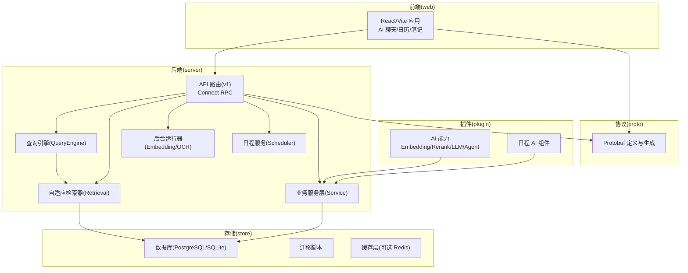
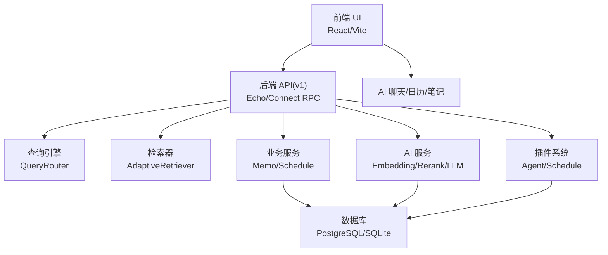
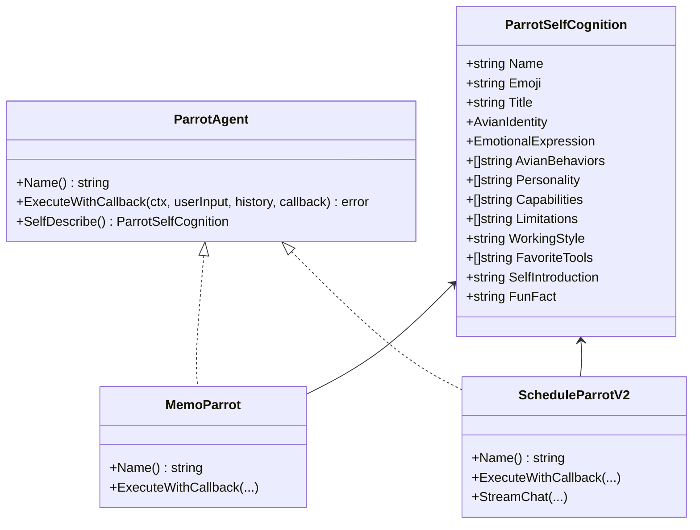
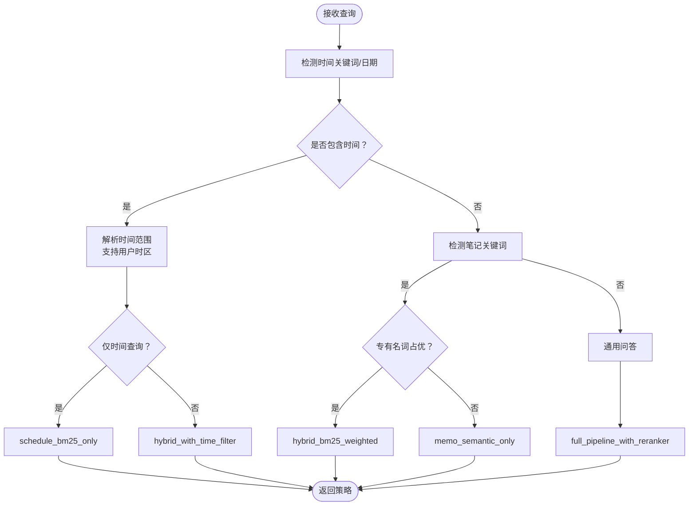
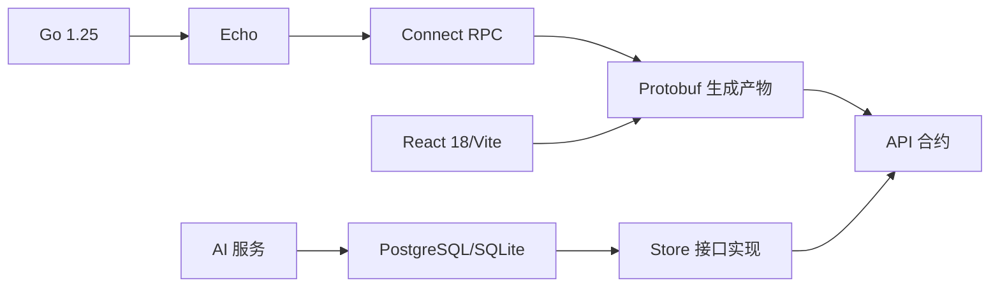

# 项目概述

<cite>
**本文引用的文件**
- [README.md](file://README.md)
- [CONTRIBUTING.md](file://CONTRIBUTING.md)
- [SECURITY.md](file://SECURITY.md)
- [go.mod](file://go.mod)
- [proto/README.md](file://proto/README.md)
- [docs/dev-guides/ARCHITECTURE.md](file://docs/dev-guides/ARCHITECTURE.md)
- [docs/specs/INDEX.md](file://docs/specs/INDEX.md)
- [plugin/ai/agent/types.go](file://plugin/ai/agent/types.go)
- [server/queryengine/query_router.go](file://server/queryengine/query_router.go)
- [store/migration/postgres/LATEST.sql](file://store/migration/postgres/LATEST.sql)
- [web/src/pages/AIChat.tsx](file://web/src/pages/AIChat.tsx)
- [plugin/ai/agent/memo_parrot.go](file://plugin/ai/agent/memo_parrot.go)
- [plugin/ai/agent/schedule_parrot_v2.go](file://plugin/ai/agent/schedule_parrot_v2.go)
- [server/router/api/v1/ai_service.go](file://server/router/api/v1/ai_service.go)
</cite>

## 目录
1. [简介](#简介)
2. [项目结构](#项目结构)
3. [核心组件](#核心组件)
4. [架构总览](#架构总览)
5. [详细组件分析](#详细组件分析)
6. [依赖关系分析](#依赖关系分析)
7. [性能考量](#性能考量)
8. [故障排查指南](#故障排查指南)
9. [结论](#结论)
10. [附录](#附录)

## 简介
Memos 是一个“隐私优先、AI 驱动”的个人智能助手，融合轻量笔记管理、智能日程管理与多代理 AI 能力。项目强调自托管、无遥测、数据主权，并通过多代理 AI（Parrot Agents）实现“笔记检索”“日程管理”“综合助理”“创意写作”等不同场景的自动化与智能化。

- 核心定位：隐私优先的个人生产力平台，将“轻量笔记 + 智能日程 + 多代理 AI”三者有机结合，帮助用户在本地构建自己的“个人智能助理”。
- 技术愿景：以轻量、可扩展、可自托管为目标，提供高可用的 RAG 搜索、自然语言日程解析、并行多代理协作与持久化对话体验。
- 设计理念：模块化插件体系、前后端分离、协议驱动（Connect RPC）、可选 AI 能力开关、面向生产的数据库与缓存层。

**章节来源**
- file://README.md#L5-L14
- file://docs/dev-guides/ARCHITECTURE.md#L3-L10

## 项目结构
仓库采用“前后端分离 + 插件化 AI 层 + 协议驱动”的分层组织方式：
- 前端（web/）：React + Vite + TypeScript，提供笔记编辑、日历视图、AI 聊天与多代理 Hub。
- 后端（server/）：Go + Echo + Connect RPC，提供 API 路由、查询引擎、检索器、运行器、调度器与业务服务。
- 插件（plugin/）：AI 能力（嵌入、重排序、LLM、Agent、Schedule 等），可按需启用。
- 存储（store/）：抽象存储接口与数据库实现（PostgreSQL/SQLite），迁移脚本与缓存层。
- 协议（proto/）：API 协议定义与生成产物，确保前后端契约一致。
- 文档（docs/）：开发者指南、设计文档、技术规范与路线图。

**图表来源**
- file://docs/dev-guides/ARCHITECTURE.md#L22-L47
- file://README.md#L296-L339

**章节来源**
- file://docs/dev-guides/ARCHITECTURE.md#L22-L47
- file://README.md#L296-L339

## 核心组件
- 多代理 AI 系统（Parrot Agents）
  - 灰灰（MEMO）：专注笔记检索与语义问答，ReAct 循环先检索再回答。
  - 金刚（SCHEDULE）：专注日程创建/查询/更新与空闲时间查找，冲突检测与默认时长策略。
  - 惊奇（AMAZING）：综合型代理，两阶段并发检索（意图分析 → 并行工具执行 → 结果合成）。
  - 灵灵（CREATIVE）：创意写作与头脑风暴，纯 LLM 模式。
- 智能 RAG 管线
  - 查询路由（QueryRouter）：根据意图自动选择策略（BM25/向量/混合/重排序）。
  - 自适应检索（AdaptiveRetriever）：BM25 + pgvector 向量 + 重排序融合。
  - 持久化对话（AI Chat）：消息类型、增量同步、自动摘要、跨设备同步。
- 智能日程管理
  - 自然语言解析：将“明天下午3点开会”转为具体时间。
  - 冲突检测与空闲时间查找：在 8:00–22:00 窗口中推荐可用时段。
  - 重复规则与提醒：RRULE 支持与 JSON 提醒数组。
- 存储与 AI 层
  - PostgreSQL 生产环境（完整 AI 能力），SQLite 开发环境（无 AI 能力）。
  - 向量扩展 pgvector + HNSW，索引优化参数（m、ef_construction）。
  - 可选 Redis 作为 L2 缓存与会话存储。

**章节来源**
- file://README.md#L16-L106
- file://README.md#L109-L198
- file://docs/dev-guides/ARCHITECTURE.md#L77-L138
- file://store/migration/postgres/LATEST.sql#L46-L49

## 架构总览
整体架构围绕“隐私优先 + AI 增强 + 可自托管”展开，前后端通过 Connect RPC 通信，AI 能力可选启用，数据库层提供生产级向量检索与日程管理能力。

**图表来源**
- file://README.md#L157-L198
- file://docs/dev-guides/ARCHITECTURE.md#L11-L18

**章节来源**
- file://README.md#L157-L198
- file://docs/dev-guides/ARCHITECTURE.md#L11-L18

## 详细组件分析

### 多代理 AI 系统（Parrot Agents）
- 接口与事件模型
  - 统一的 ParrotAgent 接口，支持 ExecuteWithCallback 与 SelfDescribe。
  - 事件类型涵盖“思考/工具使用/工具结果/答案/错误”，以及 UI 工具事件（日程建议、时间槽选择、冲突解决、快捷动作）。
  - 会话级缓存键生成（SHA256 + 用户 ID + 输入摘要），避免长输入导致内存问题。
- 代理职责
  - 灰灰（MEMO）：ReAct 循环 + 检索工具；支持缓存命中直接返回。
  - 金刚（SCHEDULE）：原生工具调用风格，直接高效，默认 1 小时时长，冲突检测。
  - 惊奇（AMAZING）：两阶段并发检索与合成，适合复杂多任务。
  - 灵灵（CREATIVE）：纯 LLM 模式，无工具限制，鼓励创意输出。
- 前端集成
  - AIChat 页面统一入口，支持能力面板（Parrot Hub）切换代理。
  - 通过 ChatRequest 设置 agentType，路由到对应代理执行路径。

**图表来源**
- file://plugin/ai/agent/types.go#L10-L23
- file://plugin/ai/agent/types.go#L25-L69
- file://plugin/ai/agent/memo_parrot.go#L26-L66
- file://plugin/ai/agent/schedule_parrot_v2.go#L9-L24

**章节来源**
- file://plugin/ai/agent/types.go#L10-L139
- file://plugin/ai/agent/memo_parrot.go#L26-L200
- file://plugin/ai/agent/schedule_parrot_v2.go#L9-L173
- file://web/src/pages/AIChat.tsx#L176-L200

### 智能查询路由（QueryRouter）
- 意图识别与策略选择
  - 时间关键词（今天/明天/本周/每月/季度/每年等）触发日程专用策略。
  - 笔记关键词（搜索/查找/内容等）触发语义检索或 BM25 加权混合策略。
  - 通用问答触发全链路 RAG + 重排序。
- 时间解析与时区支持
  - 支持多种日期格式（ISO、中文农历、斜杠等），并考虑用户时区。
  - 相对时间（今天/下周）与绝对时间（2025-01-21）自动区分查询模式（标准/严格）。
- 性能与并发
  - 快速规则匹配（>95% 场景）<10ms；默认回退到标准混合检索。
  - 配置可并发读取，支持运行时配置更新。

**图表来源**
- file://server/queryengine/query_router.go#L449-L552
- file://server/queryengine/query_router.go#L677-L800

**章节来源**
- file://server/queryengine/query_router.go#L18-L106
- file://server/queryengine/query_router.go#L449-L552
- file://server/queryengine/query_router.go#L677-L800

### 持久化 AI 聊天与消息管理
- 消息类型与特性
  - MSG：用户/助手消息（上限 100），前端 FIFO 缓存。
  - SEP：上下文分隔符（视觉分割）。
  - SUMMARY：自动生成的隐藏摘要。
- 同步机制
  - 首次加载：最新 100 条（含分隔符）。
  - 增量加载：基于 UID 分页，最多 100 条。
  - UID 不存在：触发全量刷新标志。
- 多设备同步与自动摘要
  - PostgreSQL 存储会话与消息。
  - 达到阈值自动摘要，提升上下文质量。
  - 前端 100 条缓存，后端持久化。

**章节来源**
- file://README.md#L16-L44
- file://server/router/api/v1/ai_service.go#L20-L55

### 智能日程管理
- 自然语言解析
  - 将“明天下午3点开会”解析为具体时间戳，支持默认时长与空闲时间查找。
- 冲突检测与空闲时间
  - 在 8:00–22:00 窗口内推荐可用时段，冲突时提供替代方案。
- 重复规则与提醒
  - RRULE 支持，JSON 提醒数组校验。
- 前端交互
  - 通过聊天输入构建带日期的消息，路由到 SCHEDULE 代理执行。

**章节来源**
- file://README.md#L148-L154
- file://plugin/ai/agent/schedule_parrot_v2.go#L104-L173
- file://web/src/pages/AIChat.tsx#L118-L128

### 存储与数据库支持
- 数据库支持矩阵
  - PostgreSQL：完整 AI 能力（对话、向量、重排序）。
  - SQLite：开发环境（无 AI 能力）。
  - MySQL：已移除。
- 向量与索引
  - pgvector 扩展 + HNSW 索引，Cosine 距离，参数 m=16、ef_construction=64。
  - 为 memo_embedding 建立唯一索引与触发器，保证更新时间戳一致性。
- 约束与安全
  - 日程结束时间约束、提醒字段 JSON 校验、冲突检测扩展。

**章节来源**
- file://README.md#L283-L293
- file://docs/specs/INDEX.md#L5-L14
- file://store/migration/postgres/LATEST.sql#L46-L49
- file://store/migration/postgres/LATEST.sql#L127-L192

## 依赖关系分析
- 技术栈与版本
  - 后端：Go 1.25，Echo + Connect RPC，pgvector，SQLite。
  - 前端：React 18 + Vite 7 + TypeScript + Tailwind CSS + Radix UI + TanStack Query。
  - AI：DeepSeek（LLM）、SiliconFlow（Embedding/Reranker）。
- 外部依赖与协议
  - Protobuf 生成与格式化工具（buf）。
  - gRPC/HTTP 转码网关，连接前后端契约。
- 数据库与迁移
  - LATEST.sql 定义了核心表结构与索引，迁移脚本管理演进。

**图表来源**
- file://go.mod#L3-L30
- file://proto/README.md#L3-L17
- file://docs/dev-guides/ARCHITECTURE.md#L11-L18

**章节来源**
- file://go.mod#L3-L30
- file://proto/README.md#L3-L17
- file://docs/dev-guides/ARCHITECTURE.md#L11-L18

## 性能考量
- 查询路由快速匹配：>95% 的场景在 <10ms 内完成策略选择，减少不必要的重排序与向量检索。
- 检索器缓存与命中：LRU 缓存 + 哈希键，避免重复计算；Redis 可选作为 L2 缓存与会话存储。
- 向量索引参数：HNSW 参数（m、ef_construction）平衡召回与性能；Cosine 距离适合语义相似度。
- 增量同步与消息上限：前端 FIFO 缓存 + 后端 UID 分页，降低网络与存储压力。
- 并发与限流：全局 AI 速率限制器，避免突发流量影响稳定性。

[本节为通用指导，无需特定文件引用]

## 故障排查指南
- 安全披露与报告
  - 项目处于 beta 阶段，不提供正式 CVE，建议通过邮件私下报告安全问题。
  - 自托管实例应保持更新、使用反向代理与限流策略。
- 常见问题定位
  - AI 功能不可用：确认 EmbeddingService/LLMService 是否启用，数据库是否为 PostgreSQL。
  - 查询路由异常：检查时间关键词与日期格式，确认用户时区设置。
  - 日程冲突：查看冲突检测与空闲时间查找逻辑，必要时调整窗口或重复规则。
  - 前端聊天无响应：检查增量同步 UID 与后端消息上限，确认会话持久化状态。
- 社区与贡献
  - 遵循提交规范（feat/fix/refactor/perf/docs/test/chore/style），作用域与类型明确。
  - 国际化双语要求（英文 + 中文），提交前运行 i18n 校验与硬编码检查。

**章节来源**
- file://SECURITY.md#L7-L27
- file://CONTRIBUTING.md#L18-L64
- file://CONTRIBUTING.md#L85-L171

## 结论
Memos 以“隐私优先 + AI 增强 + 可自托管”为核心价值主张，通过多代理 AI、智能 RAG 与日程解析，为个人生产力提供一体化解决方案。其模块化架构、可选 AI 能力与完善的文档体系，既适合初学者快速上手，也为有经验的开发者提供了深入扩展的空间。随着数据库与 AI 能力的持续完善，Memos 有望成为个人智能助手领域的标杆产品之一。

[本节为总结性内容，无需特定文件引用]

## 附录
- 开发与部署
  - 本地开发：依赖 Go 1.25、Node.js 22+、Docker（PostgreSQL），一键启动后端与前端。
  - 构建与打包：后端与前端分别提供构建脚本，支持容器化部署。
- 许可证
  - MIT 许可证，允许自由使用、修改与分发，需保留版权与许可声明。

**章节来源**
- file://README.md#L202-L248
- file://README.md#L362-L365