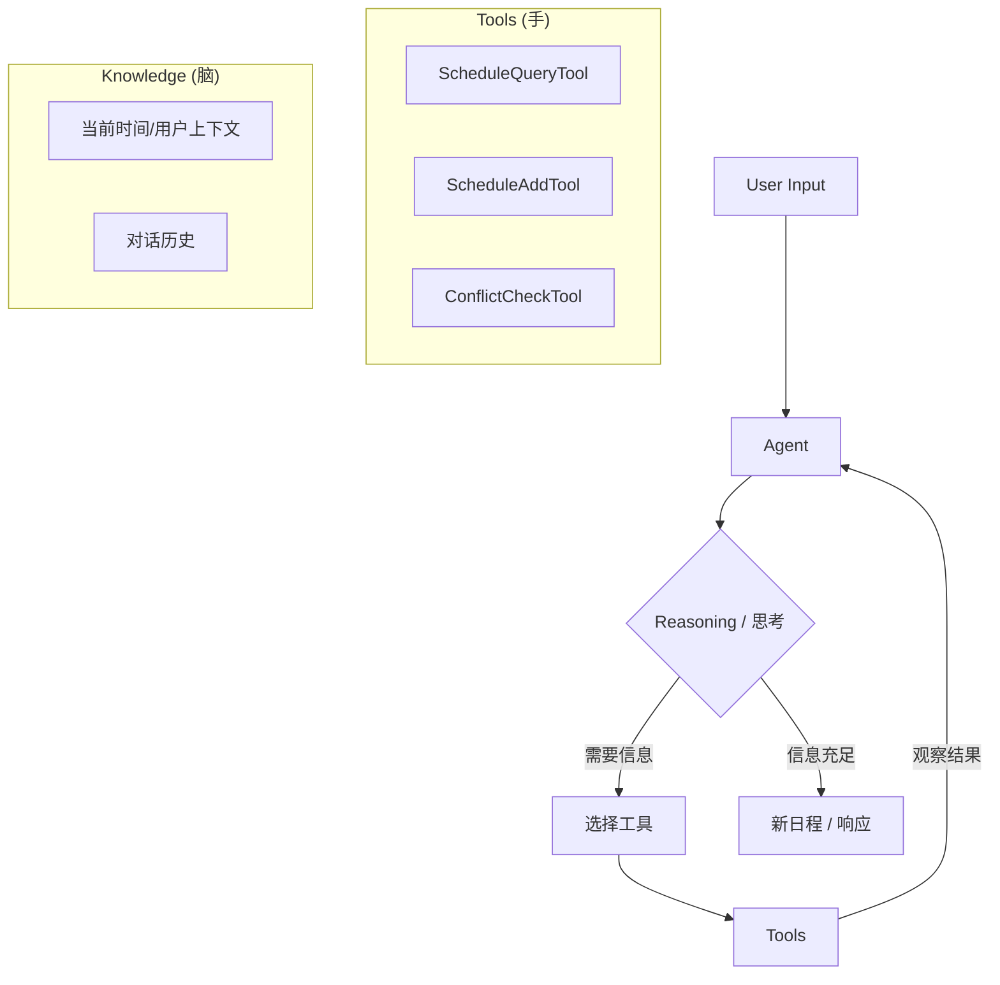

# RP-001: 日程服务重构 - ReAct 智能体架构

## 1. 背景与动机

目前 `memos` 的日程服务使用了一个无状态的 LLM 解析器 (`plugin/ai/schedule/parser.go`)。虽然对于简单的提取任务有效，但它存在显著的局限性：
*   **无上下文感知**：在创建事件之前，它无法检查现有的日程冲突。
*   **无交互推理能力**：它无法基于当前的可用性提出澄清问题或建议替代方案。
*   **扩展性受限**：增加新能力（例如“修改我的会议”）需要复杂的自定义逻辑，而不是简单的工具添加。

**目标**：使用 `langchaingo` 将当前的 `Parser` 重构为 **ReAct (Reasoning + Acting) 智能体**。这将使系统能够“思考”（推理）、“咨询”（通过工具行动）并智能地“响应”。

## 2. 架构概览

### 当前流程 (线性)
```mermaid
graph LR
    User Input --> [Parser (LLM)] --> JSON --> [Service Layer] --> Database
```

### 新 ReAct 智能体流程 (循环)


## 3. 技术实现

### 3.1 依赖
*   **框架**: `github.com/tmc/langchaingo` (已在 `go.mod` 中)
*   **智能体类型**: `OpenAIToolsAgent` (性能最佳，相比传统的 ReAct 提示词，显著减少了幻觉)。

### 3.2 新组件结构
我们将在 `plugin/ai/agent` 下引入新的包结构：

```
plugin/ai/
├── llm.go            # 现有 LLM 服务 (增强)
├── agent/            # [新增] 智能体逻辑
│   ├── scheduler.go  # 日程智能体定义
│   └── tools.go      # 工具实现
└── schedule/
    ├── parser.go     # [弃用 -> 适配器]
    └── service.go    # 核心业务逻辑
```

### 3.3 工具定义

智能体将有权访问以下工具，这些工具是对现有 Service 逻辑的封装：

#### `ScheduleQueryTool`
*   **描述**: “查找特定时间范围内的现有日程/事件。”
*   **输入 Schema**:
    ```json
    {
      "start_time": "ISO8601 字符串 (例如: 2026-01-21T09:00:00Z)",
      "end_time": "ISO8601 字符串"
    }
    ```
*   **输出**: 现有事件列表 (时间, 标题, 地点)。

#### `ScheduleAddTool`
*   **描述**: “创建一个新的日程事件。仅在确保没有重大冲突或用户确认后使用此工具。”
*   **输入 Schema**:
    ```json
    {
      "title": "字符串",
      "start_time": "ISO8601 字符串",
      "end_time": "ISO8601 字符串",
      "description": "字符串 (可选)"
    }
    ```

#### `CheckConflictTool` (可选辅助工具)
*   **描述**: “快速检查某个时间段是否空闲。”
*   **输入**: 时间范围。
*   **输出**: 布尔值 + 冲突详情。

### 3.4 智能体循环代码 (伪代码)

```go
// plugin/ai/agent/scheduler.go

func NewScheduleAgent(llm llms.Model, tools []tools.Tool) *Agent {
    return agents.NewOpenAIToolsAgent(
        llm,
        tools,
        agents.WithSystemPrompt(`
            你是一个用于 Memos 的智能日程助手。
            当前时间: {{.Now}}
            
            规则:
            1. 在添加日程之前，简单的查询可能只需要提取，但对于复杂的请求，必须先检查可用性。
            2. 如果存在冲突，请告知用户并建议下一个可用时段。
            3. 内部始终使用 UTC 处理时区，但在对话中使用用户的本地时间。
        `),
    )
}
```

## 4. 迁移策略

为了确保稳定性，我们将支持 **混合策略**：

1.  **重构阶段 1 (共存)**：
    *   保留 `Parser` 原样，用于直接的“快速添加”按钮（快速，低延迟）。
    *   构建 `ScheduleAgent` 用于“Chat / CoPilot”界面（较慢，更智能）。

2.  **重构阶段 2 (统一)**：
    *   将所有复杂的 NLU 请求路由通过智能体。
    *   保留简单的正则/规则解析用于极简指令（如“9点开会”），以节省 Token。

## 5. 未来扩展性

迁移到此架构为以下功能打开了大门：
*   **跨域任务**: “总结这个 memo 并添加一个会议来讨论它” (MemoTool + ScheduleTool)。
*   **外部集成**: “添加到 Google Calendar” (GoogleCalTool)。
*   **智能改期**: “把我不上午的所有会议移到下午” (需要 查询 -> 循环 -> 更新)。

## 6. 实施步骤

1.  [ ] **定义工具接口**: 将 `ScheduleService` 方法提取为 `langchaingo` 兼容的结构体。
2.  [ ] **实现工具**: 包装现有 DB 调用的 `Query` 和 `Add` 逻辑。
3.  [ ] **构建智能体**: 将 `llm.go` 与 `NewOpenAIToolsAgent` 连接。
4.  [ ] **测试 ReAct 循环**: 验证智能体能够正确调用 `Query` 查看输出，然后调用 `Add`。
