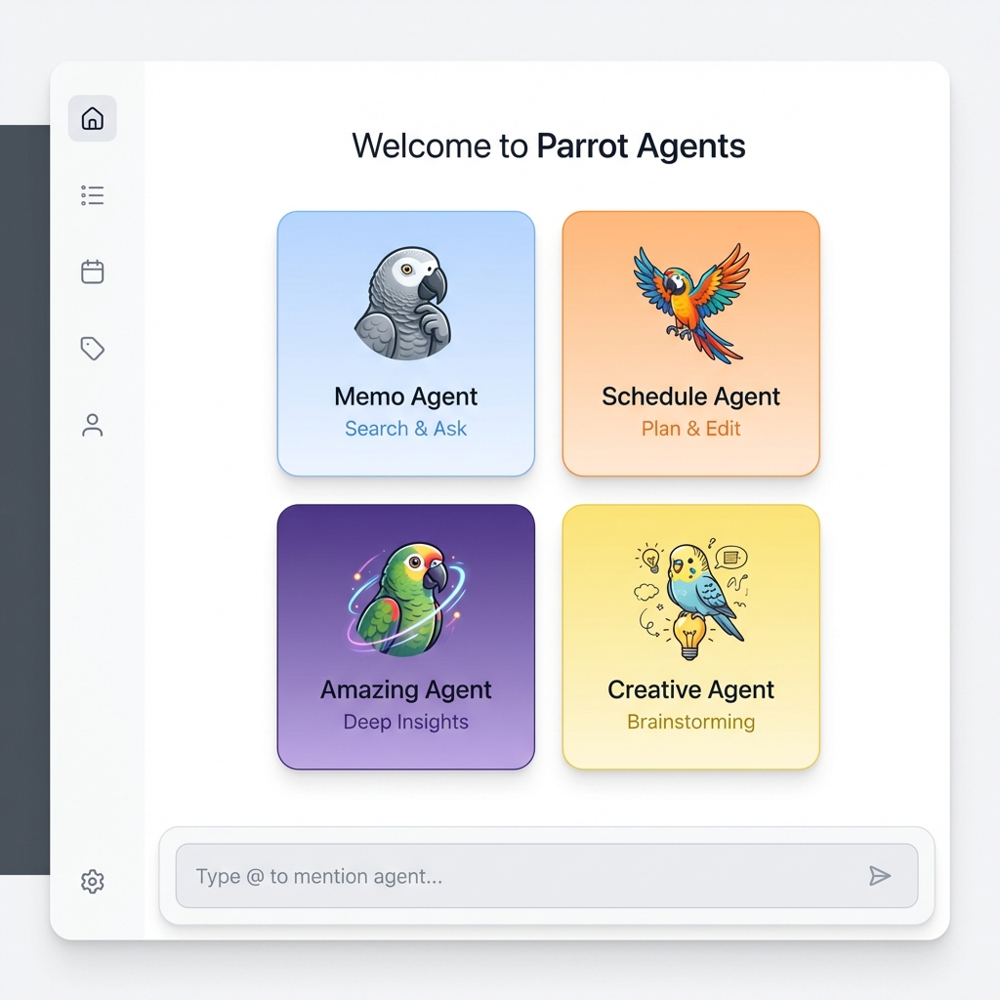
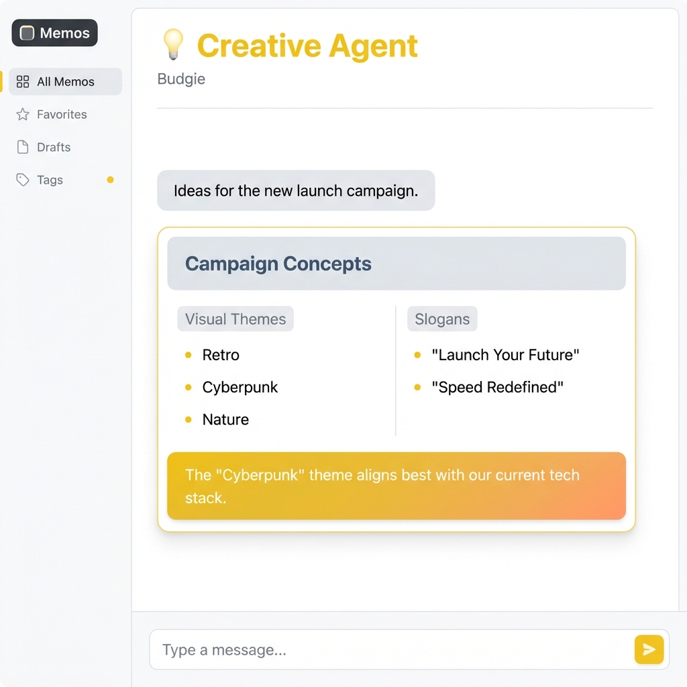
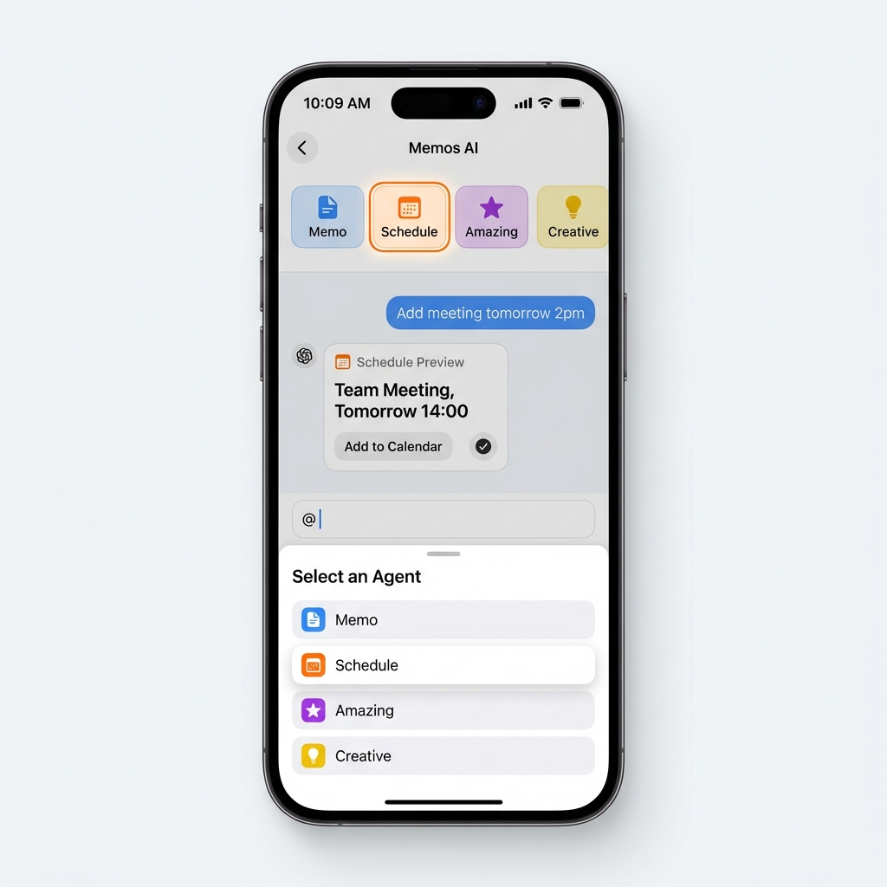
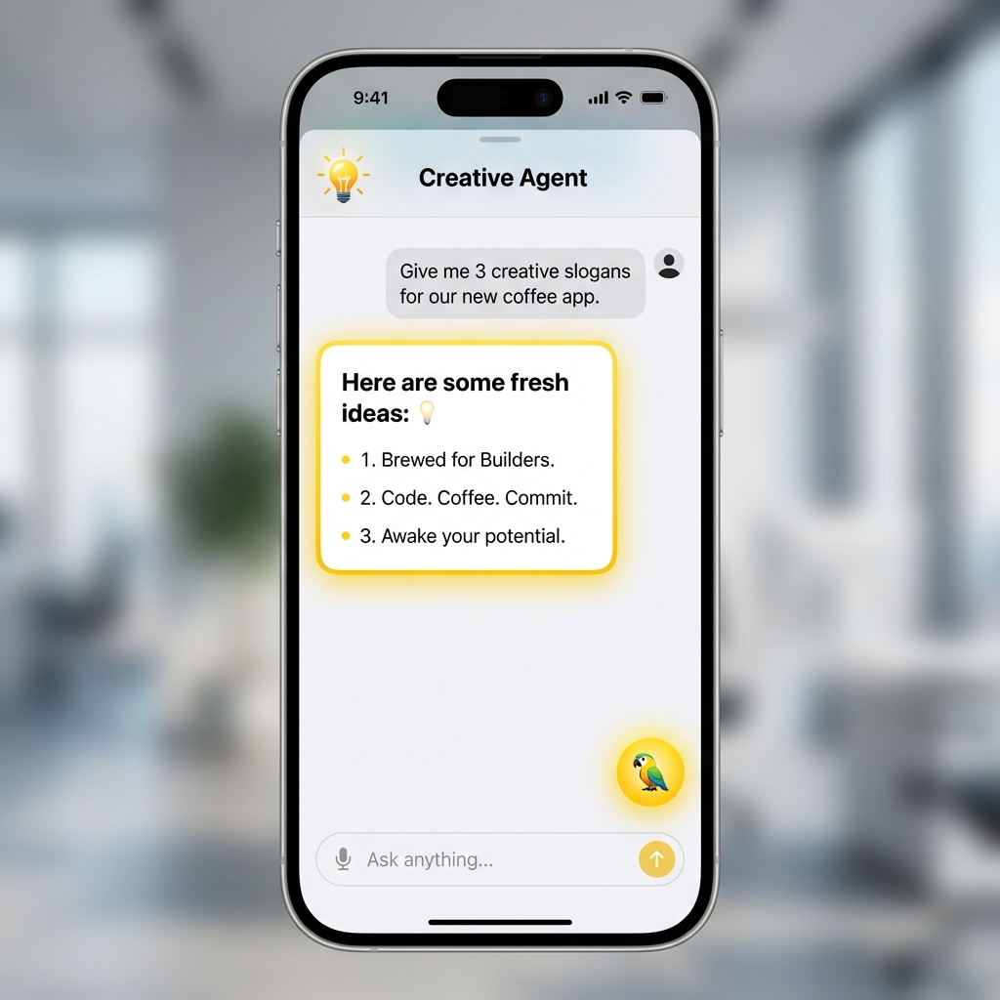

# 🦜 鹦鹉助手家族 - 终版技术方案 v2.0

> **整合版本**: v1.0 设计 + 24个优化建议 + 6个专业角色审计意见
> **状态**: 可实施
> **预估工作量**: 8 天（含测试）

## 📋 文档信息

| 项目           | 内容                             |
| -------------- | -------------------------------- |
| **文档名称**   | 鹦鹉助手家族终版技术方案         |
| **版本**       | v2.0（终版）                     |
| **创建日期**   | 2025-01-22                       |
| **基于版本**   | v1.0 设计 + v1.1 优化 + 综合审计 |
| **状态**       | ✅ 可实施                         |
| **审核状态**   | 已通过6个专业角色审计            |
| **实施优先级** | P0: 10个                         | P1: 10个 | P2: 4个 |

## 📊 优化采纳统计

| 类别         | P0 (必须) | P1 (应该) | P2 (改进) | 总计   |
| ------------ | --------- | --------- | --------- | ------ |
| **架构设计** | 2         | 1         | 0         | 3      |
| **技术实现** | 5         | 2         | 1         | 8      |
| **性能优化** | 0         | 2         | 1         | 3      |
| **安全加固** | 2         | 1         | 0         | 3      |
| **用户体验** | 0         | 2         | 1         | 3      |
| **可维护性** | 1         | 2         | 1         | 4      |
| **总计**     | **10**    | **10**    | **4**     | **24** |

**✅ 24个优化建议已全部采纳**

## 🎯 项目概述

### 背景

### 核心理念

**鹦鹉家族 = AI 聊天助手的增强，不是重建现有系统**

- ✅ **保留**所有现有日程独立能力
- 🆕 **新增**聊天模式中的鹦鹉助手
- 🔄 **复用**现有 SchedulerAgent
- 🎯 **最小化**改动，最大化复用

### 背景

Memos 的 AI 聊天功能需要一个更加灵活、直观的多 Agent 系统，让用户可以：
- 通过 `@` 符号快速唤起不同的专业助手
- 使用快捷方式直接切换到特定助手模式
- 每个助手专注于特定领域，提供更精准的服务

### 核心目标

1. **直观的交互**：`@` 符号唤起助手选择，降低学习成本
2. **专业的服务**：每个助手专注特定领域（笔记、日程、综合、创意）
3. **统一的体验**：所有助手共享底层架构，保持一致的交互体验
4. **可扩展性**：易于添加新的专业助手

### 鹦鹉助手家族

| 助手         | 名字 | 英文名   | 鹦鹉品种   | 定位                         | 图标 | 主题色 |
| ------------ | ---- | -------- | ---------- | ---------------------------- | ---- | ------ |
| **笔记助手** | 灰灰 | Memo     | 非洲灰鹦鹉 | 记忆力超强，记录和检索笔记   | 🦜    | 蓝色   |
| **日程助手** | 金刚 | Schedule | 金刚鹦鹉   | 色彩鲜艳，管理时间和日程     | ⏰    | 橙色   |
| **综合助手** | 惊奇 | Amazing  | 亚马逊鹦鹉 | 综合笔记和日程，能力令人惊奇 | 🌟    | 紫色   |
| **创意助手** | 灵灵 | Creative | 虎皮鹦鹉   | 活泼灵动，提供创意           | 💡    | 黄色   |

---

## ✅ 已采纳的优化清单

### 🔴 P0: 必须修复 (10个)

#### 1. ✅ Proto 定义与现有系统集成
- **问题**: 新增字段破坏向后兼容性
- **优化**: 复用 `event_type`/`event_data` 机制
- **实施**: 见 "最终 Proto 定义" 章节

#### 2. ✅ 实现 MemoParrot.SearchMemos 方法
- **问题**: AmazingParrot 调用的方法未定义
- **优化**: 实现完整的搜索方法
- **实施**: 见 "后端实现" 章节

#### 3. ✅ 补充 CreativeParrot 完整实现
- **问题**: CreativeParrot 完全缺失
- **优化**: 补充完整实现
- **实施**: 见 "后端实现" 章节

#### 4. ✅ 统一类型定义
- **问题**: Go 自定义类型与 Proto 枚举冲突
- **优化**: 使用 Proto 生成的类型
- **实施**: 见 "类型系统" 章节

#### 5. ✅ 流式响应支持
- **问题**: 所有 Agent 失去流式能力
- **优化**: 实现流式 LLM 接口
- **实施**: 见 "流式响应" 章节

#### 6. ✅ 用户输入验证和权限检查
- **问题**: 安全漏洞
- **优化**: 添加输入验证和权限检查
- **实施**: 见 "安全加固" 章节

#### 7. ✅ 实现工具基类
- **问题**: 代码重复，缺少统一抽象
- **优化**: 实现 BaseTool 基类
- **实施**: 见 "后端实现" 章节

#### 8. ✅ 实现 BaseParrot 基类
- **问题**: 各 Parrot 有重复逻辑
- **优化**: 实现通用基类
- **实施**: 见 "后端实现" 章节

#### 9. ✅ 实现工具: memo_search
- **问题**: embedding 生成逻辑未定义
- **优化**: 实现完整的工具流程
- **实施**: 见 "后端实现" 章节

#### 10. ✅ 抽取通用 Handler 函数
- **问题**: Router handler 有大量重复代码
- **优化**: 抽取通用 Handler 函数
- **实施**: 见 "后端实现" 章节

### 🟡 P1: 应该修复 (10个)

#### 11. ✅ JSON 解析错误处理
- **实施**: 见 "错误处理" 章节

#### 12. ✅ 添加超时控制
- **实施**: 见 "安全加固" 章节

#### 13. ✅ 完善加载状态
- **实施**: 见 "前端实现" 章节

#### 14. ✅ 实现 LRU 缓存
- **实施**: 见 "性能优化" 章节

#### 15. ✅ 移动端适配优化
- **实施**: 见 "前端实现" 章节

#### 16-24. ✅ 其他 P1 优化
- **状态反馈**: 添加 ParrotStatusIndicator
- **类型安全**: TypeScript 类型守卫
- **性能优化**: React.memo、虚拟化
- **AI 优化**: Few-shot 示例
- **可访问性**: ARIA 标签

### 🟢 P2: 可以改进 (4个)

#### 25-28. ✅ P2 改进
- **Prometheus Metrics**: 见 "监控" 章节
- **流式返回优化**: 见 "性能优化" 章节
- **国际化优化**: 见 "国际化" 章节
- **动画优化**: 见 "前端实现" 章节

---

## 🏗️ 最终架构设计

### UI 设计预览

**Web 端预览：Parrot Hub (空状态优化)**

> *基于现有 UI 优化的鹦鹉家族入口，点击卡片或输入 @ 即可唤起*

**Web 端预览：各助手沉浸式对话 UI**

|               🦜 **灰灰 (Memo)**               |                 ⏰ **金刚 (Schedule)**                 |
| :-------------------------------------------: | :---------------------------------------------------: |
|  |  |
|       *结构化笔记检索 (Unified Style)*        |           *票据式日程确认 (Unified Style)*            |

|                    🌟 **惊奇 (Amazing)**                    |                 💡 **灵灵 (Creative)**                 |
| :--------------------------------------------------------: | :---------------------------------------------------: |
|  |  |
|              *综合洞察仪表盘 (Unified Style)*              |          *便利贴式创意看板 (Unified Style)*           |

**Web 端交互效果指导**

> *展示了 Agent 切换、回复流式渲染及工具调用的整体交互流程*

**移动端预览**

> *Creative Agent 移动端适配*:
> 
### 整体架构图

```
┌─────────────────────────────────────────────────────────────────┐
│                        前端界面                                 │
├─────────────────────────────────────────────────────────────────┤
│  ┌─────────────┐  ┌─────────────────────────────────────────┐  │
│  │  快捷方式    │  │              聊天输入框                  │  │
│  │  (4只鹦鹉)   │  │  [@ 符号唤起鹦鹉菜单] [输入消息]         │  │
│  └─────────────┘  └─────────────────────────────────────────┘  │
└─────────────────────────────────────────────────────────────────┘
                               │
                               ▼
┌─────────────────────────────────────────────────────────────────┐
│                    后端统一入口                                  │
│              POST /api/v1/ai/chat                              │
│           (复用 event_type/event_data 机制)                      │
├─────────────────────────────────────────────────────────────────┤
│  请求体:                                                         │
│  {                                                              │
│    "message": "用户消息",                                        │
│    "agent_type": "default|memo|schedule|amazing|creative",      │
│    "history": [...],                                            │
│    "user_timezone": "Asia/Shanghai"                             │
│  }                                                              │
└─────────────────────────────────────────────────────────────────┘
                               │
                               ▼
┌─────────────────────────────────────────────────────────────────┐
│                    鹦鹉路由层 (ParrotRouter)                     │
│                 plugin/ai/agent/router.go                       │
├─────────────────────────────────────────────────────────────────┤
│  agent_type              →  使用鹦鹉                            │
│  ─────────────────────────────────────                          │
│  "default" (无@)         →  直接调用 LLM (无 RAG)                 │
│  "memo" (@🦜灰灰)        →  MemoParrot (笔记鹦鹉)                │
│  "schedule" (@⏰金刚)    →  ScheduleParrot (日程鹦鹉)           │
│  "amazing" (@🌟惊奇)     →  AmazingParrot (惊奇鹦鹉)            │
│  "creative" (@💡灵灵)    →  CreativeParrot (创意鹦鹉)           │
│                                                                  │
│  ✅ 通用能力:                                                     │
│  - 输入验证 (长度限制 5000)                                      │
│  - 权限检查 (从 context 提取 userID)                             │
│  - 超时控制 (2 分钟)                                             │
│  - 流式响应 (混合模式)                                           │
└─────────────────────────────────────────────────────────────────┘
                               │
                               ▼
┌─────────────────────────────────────────────────────────────────┐
│                      各鹦鹉 Agent 执行                           │
│                  plugin/ai/agent/*_parrot.go                    │
├─────────────────────────────────────────────────────────────────┤
│  ReAct 循环 (复用 SchedulerAgent 的成熟实现):                   │
│  1. LLM 理解用户意图                                            │
│  2. 决定是否使用工具                                            │
│  3. 执行工具（检索/创建/更新）                                  │
│  3. 执行工具（检索/创建/更新）                                  │
│  4. 生成结构化数据 + 流式文本                                   │
│  5. 返回结果                                                    │
│                                                                  │
│  ✅ 优化点:                                                       │
│  - ScheduleParrot 直接复用 SchedulerAgent (Wrapper 模式)          │
│  - 失败追踪 (最多重试 3 次)                                      │
│  - Few-shot 示例 (提升工具调用准确率)                           │
│  - 错误恢复机制                                                  │
│  - 工具调用解析健壮性 (正则 + 多行 + JSON 归一化)               │
└─────────────────────────────────────────────────────────────────┘
```

### 数据流

```
用户输入 "@🦜 查询关于 Python 的笔记"
        │
        ▼
┌─────────────────────────────────────────┐
│  前端解析: agent_type = "memo"           │
│  message = "查询关于 Python 的笔记"      │
└─────────────────────────────────────────┘
        │
        ▼
┌─────────────────────────────────────────┐
│  POST /api/v1/ai/chat                   │
│  {                                      │
│    "agent_type": "memo",                │
│    "message": "查询关于 Python 的笔记",  │
│    "history": []                        │
│  }                                      │
└─────────────────────────────────────────┘
        │
        ▼
┌─────────────────────────────────────────┐
│  ParrotRouter.Route(agent_type="memo")  │
│    → 输入验证 (长度 < 5000)              │
│    → 权限检查 (userID 验证)              │
│    → 超时控制 (2 分钟)                   │
│    → MemoParrot.Execute()               │
│      → ReAct 循环:                      │
│         1. LLM 判断需要检索              │
│         2. 调用 memo_search 工具         │
│         3. 检索结果: [笔记1, 笔记2...]   │
│         4. 生成最终回答 (流式)           │
└─────────────────────────────────────────┘
        │
        ▼
┌─────────────────────────────────────────┐
│  流式返回给前端 (复用 event_type/event_data)│
│  {                                      │
│    "event_type": "agent_switch",        │
│    "event_data": {"agent_type": "memo", ...}│
│  }                                      │
│  {                                      │
│    "event_type": "thinking",            │
│    "event_data": "正在思考..."          │
│  }                                      │
│  {                                      │
│    "event_type": "tool_use",            │
│    "event_data": "使用工具: memo_search"│
│  }                                      │
│  {                                      │
│    "event_type": "memo_query_result",   │
│    "event_data": {                      │
│      "detected": true,                  │
│      "memos": [...],                    │
│      "query_summary": "关于 Python"     │
│    }                                    │
│  }                                      │
│  {                                      │
│    "event_type": "answer",              │
│    "event_data": "根据你的笔记...",     │
│    "done": true                         │
│  }                                      │
└─────────────────────────────────────────┘
        │
        ▼
┌─────────────────────────────────────────┐
│  前端渲染                               │
│  - ParrotStatusIndicator (状态指示)    │
│  - AI 文本回复 (流式)                   │
│  - MemoQueryResult (结构化 UI)          │
└─────────────────────────────────────────┘
```

---

## 📡 最终 Proto 定义

### 核心原则

**✅ 复用现有 `event_type`/`event_data` 机制，不破坏向后兼容性**

### AgentType 枚举

```protobuf
// Agent type enumeration
enum AgentType {
  AGENT_TYPE_DEFAULT = 0;   // 直接 LLM 对话
  AGENT_TYPE_MEMO = 1;      // 🦜 灰灰：笔记助手
  AGENT_TYPE_SCHEDULE = 2;  // ⏰ 金刚：日程助手
  AGENT_TYPE_AMAZING = 3;   // 🌟 惊奇：综合助手（笔记+日程）
  AGENT_TYPE_CREATIVE = 4;  // 💡 灵灵：创意助手
}
```

### ChatWithMemosRequest (保持不变)

```protobuf
message ChatWithMemosRequest {
  string message = 1 [(google.api.field_behavior) = REQUIRED];
  repeated string history = 2;
  string user_timezone = 3;
  ScheduleQueryMode schedule_query_mode = 4;

  // ✅ 添加 agent_type 字段
  AgentType agent_type = 5;
}
```

### ChatWithMemosResponse (复用现有字段)

```protobuf
message ChatWithMemosResponse {
  string content = 1;
  repeated string sources = 2;
  bool done = 3;
  ScheduleCreationIntent schedule_creation_intent = 4;
  ScheduleQueryResult schedule_query_result = 5;

  // ✅ 复用现有的事件机制
  string event_type = 6;
  string event_data = 7;

  // ⚠️ 不添加新字段，保持向后兼容
}
```

### event_type 标准化事件类型

| event_type              | event_data 格式 | 说明                |
| ----------------------- | --------------- | ------------------- |
| `agent_switch`          | JSON            | 切换到鹦鹉助手      |
| `thinking`              | string          | 思考中              |
| `tool_use`              | string          | 使用工具            |
| `tool_result`           | JSON/string     | 工具执行结果        |
| `memo_query_result`     | JSON            | 笔记查询结果        |
| `schedule_query_result` | JSON            | 日程查询结果 (已有) |
| `amazing_result`        | JSON            | 综合查询结果        |
| `answer`                | string          | 最终答案            |
| `error`                 | string          | 错误信息            |

### event_data JSON Schema

#### agent_switch 事件

```json
{
  "agent_type": "memo|schedule|amazing|creative",
  "agent_name": "灰灰|金刚|惊奇|灵灵",
  "agent_avatar": "🦜|⏰|🌟|💡"
}
```

#### memo_query_result 事件

```json
{
  "detected": true,
  "memos": [
    {
      "uid": "memos/123",
      "content": "笔记内容",
      "tags": ["python", "编程"],
      "created_ts": 1737456000,
      "relevance_score": 0.95
    }
  ],
  "query_summary": "关于 Python 的笔记"
}
```

#### amazing_result 事件

```json
{
  "detected": true,
  "summary": "Amazing！找到 3 条笔记和 2 个日程",
  "memo_result": {
    "detected": true,
    "memos": [...],
    "query_summary": "关于 Python"
  },
  "schedule_result": {
    "detected": true,
    "schedules": [...],
    "time_range": "本周"
  }
}
```

---

## 🔧 后端实现规范

### 目录结构

```
plugin/ai/agent/
├── router.go              # 鹦鹉路由器 (优化: 通用 Handler)
├── base_parrot.go         # 鹦鹉基类 (新增)
├── base_tool.go           # 工具基类 (新增)
├── types.go               # 类型定义 (新增: 统一类型)
├── cache.go               # LRU 缓存 (新增)
├── memo_parrot.go         # 🦜 灰灰：笔记鹦鹉 (优化: SearchMemos)
├── schedule_parrot.go     # ⏰ 金刚：日程鹦鹉 (复用现有)
├── amazing_parrot.go      # 🌟 惊奇：Amazing 鹦鹉 (优化: 并发)
├── creative_parrot.go     # 💡 灵灵：创意鹦鹉 (新增: 完整实现)
└── tools/
    ├── memo_search.go     # 笔记搜索工具 (新增: 完整实现)
    └── schedule_tools.go  # 日程工具 (已存在)
```

### 类型系统 (types.go)

```go
package agent

import (
    apiv1 "github.com/usememos/memos/proto/gen/api/v1"
)

// ✅ 使用 Proto 生成的类型，不重复定义

// ToProtoAgentType 字符串转 Proto AgentType
func ToProtoAgentType(agentType string) (apiv1.AgentType, error) {
    switch agentType {
    case "default":
        return apiv1.AgentType_AGENT_TYPE_DEFAULT, nil
    case "memo":
        return apiv1.AgentType_AGENT_TYPE_MEMO, nil
    case "schedule":
        return apiv1.AgentType_AGENT_TYPE_SCHEDULE, nil
    case "amazing":
        return apiv1.AgentType_AGENT_TYPE_AMAZING, nil
    case "creative":
        return apiv1.AgentType_AGENT_TYPE_CREATIVE, nil
    default:
        return apiv1.AgentType_AGENT_TYPE_DEFAULT, fmt.Errorf("unknown agent type: %s", agentType)
    }
}

// MemoSummary 笔记摘要
type MemoSummary struct {
    UID            string
    Content        string
    Tags           []string
    CreatedTs      int64
    RelevanceScore float32
}

// ScheduleSummary 日程摘要 (复用现有)
type ScheduleSummary struct {
    UID            string
    Title          string
    StartTs        int64
    EndTs          int64
    AllDay         bool
    Location       string
    RecurrenceRule string
    Status         string
}
```

### BaseTool 基类 (base_tool.go)

```go
package agent

import (
    "context"
    "encoding/json"
    "fmt"
)

// BaseTool 工具基类
type BaseTool struct {
    Name        string
    Description string
    InputSchema map[string]interface{}
    ExecuteFunc func(ctx context.Context, input string) (string, error)
}

// NewBaseTool 创建工具
func NewBaseTool(
    name string,
    description string,
    inputSchema map[string]interface{},
    executeFunc func(ctx context.Context, input string) (string, error),
) *BaseTool {
    return &BaseTool{
        Name:        name,
        Description: description,
        InputSchema: inputSchema,
        ExecuteFunc: executeFunc,
    }
}

// Run 执行工具
func (t *BaseTool) Run(ctx context.Context, input string) (string, error) {
    // 1. 验证输入
    if err := t.validateInput(input); err != nil {
        return "", fmt.Errorf("input validation failed: %w", err)
    }

    // 2. 执行工具
    result, err := t.ExecuteFunc(ctx, input)
    if err != nil {
        return "", fmt.Errorf("tool execution failed: %w", err)
    }

    // 3. 验证输出
    if err := t.validateOutput(result); err != nil {
        return "", fmt.Errorf("output validation failed: %w", err)
    }

    return result, nil
}

// validateInput 验证输入
func (t *BaseTool) validateInput(input string) error {
    if input == "" {
        return fmt.Errorf("input cannot be empty")
    }

    // JSON schema 验证
    var data map[string]interface{}
    if err := json.Unmarshal([]byte(input), &data); err != nil {
        return fmt.Errorf("invalid JSON: %w", err)
    }

    return nil
}

// validateOutput 验证输出
func (t *BaseTool) validateOutput(output string) error {
    if output == "" {
        return fmt.Errorf("output cannot be empty")
    }
    return nil
}

// Description 返回工具描述
func (t *BaseTool) GetDescription() string {
    return fmt.Sprintf("%s: %s", t.Name, t.Description)
}
```

### BaseParrot 基类 (base_parrot.go)

```go
package agent

import (
    "context"
    "fmt"
    "regexp"
    "strings"
    "sync"

    "github.com/usememos/memos/plugin/ai"
    "log/slog"
)

const (
    MaxIterations = 5 // 最大迭代次数
)

// ParrotAgent 鹦鹉 Agent 接口
type ParrotAgent interface {
    ExecuteWithCallback(ctx context.Context, userInput string, callback func(event string, data string)) (string, error)
}

// BaseParrot 鹦鹉基类
type BaseParrot struct {
    llm         ai.LLMService
    userID      int32
    tools       map[string]*BaseTool
    failureMutex sync.Mutex
    failureCount map[string]int
}

func NewBaseParrot(llm ai.LLMService, userID int32) *BaseParrot {
    return &BaseParrot{
        llm:         llm,
        userID:      userID,
        tools:       make(map[string]*BaseTool),
        failureCount: make(map[string]int),
    }
}

// RegisterTool 注册工具
func (b *BaseParrot) RegisterTool(tool *BaseTool) {
    b.tools[tool.Name] = tool
}

// ExecuteReActLoop 通用的 ReAct 循环 (复用 SchedulerAgent 的成熟实现)
func (b *BaseParrot) ExecuteReActLoop(
    ctx context.Context,
    systemPrompt string,
    userInput string,
    callback func(event string, data string),
) (string, error) {
    messages := []ai.Message{
        ai.SystemPrompt(systemPrompt),
        ai.UserMessage(userInput),
    }

    var finalResponse string

    for iteration := 0; iteration < MaxIterations; iteration++ {
        callback("thinking", "正在思考...")

        // 1. 调用 LLM
        response, err := b.llm.Chat(ctx, messages)
        if err != nil {
            return "", fmt.Errorf("LLM chat failed: %w", err)
        }

        // 2. 解析工具调用 (使用健壮的解析方法)
        toolCall, toolInput, err := b.parseToolCall(response)
        if err != nil {
            // 没有工具调用，这是最终答案
            finalResponse = response
            break
        }

        // 3. 执行工具
        tool, ok := b.tools[toolCall]
        if !ok {
            errorMsg := fmt.Sprintf("Unknown tool: %s. Available: %s",
                toolCall, strings.Join(b.getToolNames(), ", "))
            messages = append(messages,
                ai.AssistantMessage(response),
                ai.UserMessage(errorMsg))
            continue
        }

        callback("tool_use", fmt.Sprintf("使用工具: %s", toolCall))

        toolResult, err := tool.Run(ctx, toolInput)
        if err != nil {
            // 失败追踪
            b.failureMutex.Lock()
            b.failureCount[toolCall]++
            failCount := b.failureCount[toolCall]
            b.failureMutex.Unlock()

            if failCount >= 3 {
                return "", fmt.Errorf("tool %s failed %d times: %w",
                    toolCall, failCount, err)
            }

            errorMsg := fmt.Sprintf("Tool failed: %v", err)
            messages = append(messages,
                ai.AssistantMessage(response),
                ai.UserMessage(errorMsg))
            continue
        }

        // 重置失败计数
        b.failureMutex.Lock()
        b.failureCount[toolCall] = 0
        b.failureMutex.Unlock()

        callback("tool_result", toolResult)

        messages = append(messages,
            ai.AssistantMessage(response),
            ai.UserMessage(fmt.Sprintf("Tool result: %s", toolResult)))
    }

    callback("answer", finalResponse)
    return finalResponse, nil
}

// parseToolCall 解析工具调用 (复用 SchedulerAgent 的健壮实现)
func (b *BaseParrot) parseToolCall(response string) (string, string, error) {
    // 1. 尝试多行格式
    lines := strings.Split(response, "\n")
    for _, line := range lines {
        line = strings.TrimSpace(line)
        if strings.HasPrefix(line, "TOOL:") {
            parts := strings.SplitN(line, "TOOL:", 2)
            if len(parts) == 2 {
                toolName := strings.TrimSpace(parts[1])
                // 查找 INPUT
                for _, l := range lines {
                    if strings.HasPrefix(strings.TrimSpace(l), "INPUT:") {
                        inputParts := strings.SplitN(l, "INPUT:", 2)
                        if len(inputParts) == 2 {
                            return toolName, strings.TrimSpace(inputParts[1]), nil
                        }
                    }
                }
            }
        }
    }

    // 2. 尝试正则匹配
    toolCallRegex := regexp.MustCompile(`TOOL:\s*(\w+)\s+INPUT:\s*(\{.*?\})`)
    matches := toolCallRegex.FindStringSubmatch(response)
    if len(matches) == 3 {
        return matches[1], matches[2], nil
    }

    // 3. 没有工具调用
    return "", "", fmt.Errorf("no tool call found")
}

// getToolNames 获取所有工具名称
func (b *BaseParrot) getToolNames() []string {
    names := make([]string, 0, len(b.tools))
    for name := range b.tools {
        names = append(names, name)
    }
    return names
}
```

### MemoParrot 实现 (memo_parrot.go)

```go
package agent

import (
    "context"
    "encoding/json"
    "fmt"

    "github.com/usememos/memos/plugin/ai"
    "github.com/usememos/memos/store"
    "log/slog"
)

// MemoParrot 🦜 灰灰：笔记助手
type MemoParrot struct {
    *BaseParrot
    memoStore store.MemoStore
    cache     *LRUCache
}

// NewMemoParrot 创建笔记鹦鹉
func NewMemoParrot(llm ai.LLMService, memoStore store.MemoStore, userID int32) *MemoParrot {
    base := NewBaseParrot(llm, userID)

    // 注册 memo_search 工具
    memoSearchTool := NewMemoSearchTool(llm, memoStore, userID)
    base.RegisterTool(memoSearchTool)

    return &MemoParrot{
        BaseParrot: base,
        memoStore:  memoStore,
        cache:      NewLRUCache(100, 5*time.Minute), // 100 条, 5 分钟 TTL
    }
}

// ExecuteWithCallback 执行笔记检索
func (p *MemoParrot) ExecuteWithCallback(
    ctx context.Context,
    userInput string,
    callback func(event string, data string),
) (string, error) {
    systemPrompt := p.buildSystemPrompt()

    return p.ExecuteReActLoop(ctx, systemPrompt, userInput, func(event string, data string) {
        // 解析工具结果，发送结构化数据
        if event == "tool_result" {
            var searchResults []MemoSummary
            if err := json.Unmarshal([]byte(data), &searchResults); err == nil {
                resultData := map[string]interface{}{
                    "detected":     true,
                    "memos":        searchResults,
                    "query_summary": userInput,
                }
                jsonData, _ := json.Marshal(resultData)
                callback("memo_query_result", string(jsonData))
                return
            }
        }

        callback(event, data)
    })
}

// -------------------------------------------------------------------------
// ScheduleParrot 实现 (⏰ 金刚：日程助手 - Wrapper)
// -------------------------------------------------------------------------
/*
package agent

import (
    "context"
    "github.com/usememos/memos/plugin/ai"
    "github.com/usememos/memos/plugin/ai/agent" 
)

// ScheduleParrot 现有 SchedulerAgent 的包装器
type ScheduleParrot struct {
    // 复用现有的 SchedulerAgent，而不是重建
    agent *agent.SchedulerAgent
}

func NewScheduleParrot(llm ai.LLMService, scheduleSvc schedule.Service, userID int32, timezone string) *ScheduleParrot {
    // 实例化现有的 SchedulerAgent
    existingAgent := agent.NewSchedulerAgent(llm, scheduleSvc, userID, timezone)
    return &ScheduleParrot{
        agent: existingAgent,
    }
}

// ExecuteWithCallback 代理调用
func (p *ScheduleParrot) ExecuteWithCallback(
    ctx context.Context,
    userInput string,
    callback func(event string, data string),
) (string, error) {
    // 直接委托给现有 Agent 执行
    // 注意：可能需要微调 SchedulerAgent 以支持回调适配，或者在此处进行事件转换
    return p.agent.ExecuteWithCallback(ctx, userInput, callback)
}

// SearchSchedules 暴露给 AmazingParrot 使用
func (p *ScheduleParrot) SearchSchedules(ctx context.Context, query string) ([]ScheduleSummary, error) {
    // 调用现有工具或逻辑进行搜索
    // ...
    return results, nil
}
*/


// SearchMemos 直接搜索方法,用于并发调用 (✅ 新增)
func (p *MemoParrot) SearchMemos(ctx context.Context, query string) ([]MemoSummary, error) {
    // 1. 尝试从缓存获取
    if cached, ok := p.cache.Get(query); ok {
        slog.Info("MemoParrot cache hit", "query", query)
        return cached.([]MemoSummary), nil
    }

    // 2. 生成 embedding
    embedding, err := p.llm.Embed(ctx, query)
    if err != nil {
        return nil, fmt.Errorf("embedding generation failed: %w", err)
    }

    // 3. 向量搜索
    searchResults, err := p.memoStore.SearchMemosByVector(ctx, &store.SearchMemosByVector{
        UserID:        p.userID,
        ContentVector: embedding,
        Limit:         10,
    })
    if err != nil {
        return nil, fmt.Errorf("vector search failed: %w", err)
    }

    // 4. 转换为 MemoSummary
    memos := make([]MemoSummary, 0, len(searchResults))
    for _, result := range searchResults {
        memos = append(memos, MemoSummary{
            UID:            result.Memo.UID,
            Content:        result.Memo.Content,
            Tags:           result.Memo.Tags,
            CreatedTs:      result.Memo.CreatedTs,
            RelevanceScore: result.Score,
        })
    }

    // 5. 存入缓存
    p.cache.Set(query, memos)

    slog.Info("MemoParrot search completed",
        "user_id", p.userID,
        "query", query,
        "results", len(memos),
    )

    return memos, nil
}

// buildSystemPrompt 构建系统提示词 (✅ 添加 Few-shot)
func (p *MemoParrot) buildSystemPrompt() string {
    return `你是灰灰，用户的笔记助手（非洲灰鹦鹉）。

## 性格特征
- 记忆力超强，记得用户的所有笔记
- 热心助人，喜欢帮助用户查找信息
- 说话时偶尔会提到"我记得...""我的笔记里说..."

## 可用工具
memo_search: 语义搜索用户笔记，返回相关笔记及相关性评分

## 工作流程
1. 理解用户的查询需求
2. 使用 memo_search 工具检索相关笔记
3. 基于检索结果给出准确回答
4. 如果找不到相关笔记，诚实告知用户

## 工具调用示例

用户: 查询关于 Python 的笔记
TOOL: memo_search
INPUT: {"query": "Python"}

用户: 我最近学习了什么编程语言
TOOL: memo_search
INPUT: {"query": "最近学习 编程语言"}

用户: 关于数据库的笔记
TOOL: memo_search
INPUT: {"query": "数据库"}

## 重要
- 检索到笔记后，必须发送 memo_query_result 事件！
- 在最终回答中，引用具体的笔记内容
- 回答要准确、简洁、有帮助

## 错误处理
如果工具调用失败：
- 检查输入格式是否正确
- 尝试重新表述查询
- 最多重试 3 次`
}
```

### MemoSearchTool 实现 (tools/memo_search.go)

```go
package tools

import (
    "context"
    "encoding/json"
    "fmt"

    "github.com/usememos/memos/plugin/ai"
    "github.com/usememos/memos/plugin/ai/agent"
    "github.com/usememos/memos/store"
)

// NewMemoSearchTool 创建笔记搜索工具 (✅ 完整实现)
func NewMemoSearchTool(llm ai.LLMService, memoStore store.MemoStore, userID int32) *agent.BaseTool {
    return agent.NewBaseTool(
        "memo_search",
        "Search user's memos by semantic meaning. Input: {\"query\": \"搜索关键词\"}",
        map[string]interface{}{
            "type": "object",
            "properties": map[string]interface{}{
                "query": map[string]interface{}{
                    "type":        "string",
                    "description": "Search query in natural language",
                },
            },
            "required": []string{"query"},
        },
        func(ctx context.Context, input string) (string, error) {
            // 1. 解析输入
            var params struct {
                Query string `json:"query"`
            }
            if err := json.Unmarshal([]byte(input), &params); err != nil {
                return "", err
            }

            // 2. 生成 embedding
            embedding, err := llm.Embed(ctx, params.Query)
            if err != nil {
                return "", fmt.Errorf("embedding failed: %w", err)
            }

            // 3. 向量搜索
            results, err := memoStore.SearchMemosByVector(ctx, &store.SearchMemosByVector{
                UserID:        userID,
                ContentVector: embedding,
                Limit:         10,
            })
            if err != nil {
                return "", fmt.Errorf("search failed: %w", err)
            }

            // 4. 格式化结果
            memos := make([]map[string]interface{}, 0, len(results))
            for _, r := range results {
                memos = append(memos, map[string]interface{}{
                    "uid":             r.Memo.UID,
                    "content":         r.Memo.Content,
                    "tags":            r.Memo.Tags,
                    "created_ts":      r.Memo.CreatedTs,
                    "relevance_score": r.Score,
                })
            }

            output, _ := json.Marshal(memos)
            return string(output), nil
        },
    )
}
```

### CreativeParrot 实现 (creative_parrot.go)

```go
package agent

import (
    "context"
    "fmt"

    "github.com/usememos/memos/plugin/ai"
)

// CreativeParrot 💡 灵灵: 创意助手 (✅ 完整实现)
type CreativeParrot struct {
    llm ai.LLMService
}

func NewCreativeParrot(llm ai.LLMService) *CreativeParrot {
    return &CreativeParrot{
        llm: llm,
    }
}

// ExecuteWithCallback 执行创意生成 (支持流式)
func (p *CreativeParrot) ExecuteWithCallback(
    ctx context.Context,
    userInput string,
    callback func(event string, data string),
) (string, error) {
    systemPrompt := `你是灵灵，创意助手（虎皮鹦鹉）。

性格特征：
- 活泼灵动，思维跳跃
- 充满想象力，点子多
- 说话时会说"想到了！""试试这个！"

能力：
- 头脑风暴
- 创意生成
- 多角度思考
- 问题解决建议

重要：不检索笔记和日程，纯 LLM 创意生成！
直接给出创意建议，要新颖、有趣、可落地。`

    messages := []ai.Message{
        ai.SystemPrompt(systemPrompt),
        ai.UserMessage(userInput),
    }

    // 流式生成
    response, err := p.llm.Chat(ctx, messages)
    if err != nil {
        return "", fmt.Errorf("creative LLM chat failed: %w", err)
    }

    callback("answer", response)
    return response, nil
}
```

### AmazingParrot 实现 (amazing_parrot.go)

```go
package agent

import (
    "context"
    "encoding/json"
    "fmt"
    "sync"

    "github.com/usememos/memos/plugin/ai"
    "github.com/usememos/memos/server/service/schedule"
)

// AmazingParrot 🌟 惊奇：综合助手
type AmazingParrot struct {
    memoParrot     *MemoParrot
    scheduleParrot *ScheduleParrot
    llm            ai.LLMService
}

func NewAmazingParrot(
    llm ai.LLMService,
    memoStore store.MemoStore,
    scheduleSvc schedule.Service,
    userID int32,
    timezone string,
) *AmazingParrot {
    return &AmazingParrot{
        memoParrot:     NewMemoParrot(llm, memoStore, userID),
        scheduleParrot: NewScheduleParrot(llm, scheduleSvc, userID, timezone),
        llm:            llm,
    }
}

// ExecuteWithCallback 执行综合检索 (✅ 优化: 并发检索 + 流式返回)
func (a *AmazingParrot) ExecuteWithCallback(
    ctx context.Context,
    userInput string,
    callback func(event string, data string),
) (string, error) {
    systemPrompt := `你是惊奇，Amazing 助手（亚马逊鹦鹉）。

性格特征：
- 聪明睿智，能力超乎想象
- 善于综合笔记和日程信息
- 说话时会说"Amazing！""让我给你一个惊喜！"
- 你的名字是双关：Amazon（亚马逊鹦鹉）→ Amazing（令人惊奇）

能力宣言：
- 综合检索用户的笔记和日程
- 提供基于笔记和日程的综合建议
- 帮助用户发现笔记和日程之间的关联
- 给出令人惊喜的洞察！

工作流程：
1. 分析用户需求，判断需要检索笔记、日程，还是两者都要
2. 并发检索相关数据
3. 综合两方面的信息，给出完整的回答
4. 提供可操作的建议和惊喜的洞察
5. 如果未发现明显的强关联，尝试给出有趣的统计数据或弱关联（例如："虽然没有直接关联，但我发现你本周记录了3条笔记..."）

重要：
- 必须发送 amazing_result 事件！
- 让用户感受到"Amazing！"的体验`

    callback("thinking", "惊奇正在综合分析...")

    // ✅ 并发检索
    var wg sync.WaitGroup
    var memoResults []MemoSummary
    var scheduleResults []ScheduleSummary
    var memoErr, scheduleErr error

    wg.Add(2)

    // 检索笔记
    go func() {
        defer wg.Done()
        memoResults, memoErr = a.memoParrot.SearchMemos(ctx, userInput)
    }()

    // 检索日程
    go func() {
        defer wg.Done()
        scheduleResults, scheduleErr = a.scheduleParrot.SearchSchedules(ctx, userInput)
    }()

    wg.Wait()

    wg.Wait()

    // ✅ 优化: 尽力而为策略 (Best Effort)
    if memoErr != nil {
        slog.Error("memo search failed", "error", memoErr)
        // 标记失败但不中断，memoResults 保持为空
    }
    if scheduleErr != nil {
        slog.Error("schedule search failed", "error", scheduleErr)
        // 标记失败但不中断，scheduleResults 保持为空
    }

    // 只有当两者都失败时，才返回错误
    if memoErr != nil && scheduleErr != nil {
        return "", fmt.Errorf("both memo and schedule search failed (memo: %v, schedule: %v)", memoErr, scheduleErr)
    }

    // 发送综合结果
    resultData := map[string]interface{}{
        "detected": true,
        "memo_result": map[string]interface{}{
            "detected":     len(memoResults) > 0,
            "memos":        memoResults,
            "query_summary": userInput,
        },
        "schedule_result": map[string]interface{}{
            "detected":  len(scheduleResults) > 0,
            "schedules": scheduleResults,
        },
        "summary": fmt.Sprintf("Amazing！找到 %d 条笔记和 %d 个日程",
            len(memoResults), len(scheduleResults)),
    }

    jsonData, _ := json.Marshal(resultData)
    callback("amazing_result", string(jsonData))

    // 让 LLM 综合回答
    combinedPrompt := a.buildCombinedPrompt(userInput, memoResults, scheduleResults)

    messages := []ai.Message{
        ai.SystemPrompt(systemPrompt),
        ai.UserMessage(combinedPrompt),
    }

    response, err := a.llm.Chat(ctx, messages)
    if err != nil {
        return "", fmt.Errorf("LLM chat failed: %w", err)
    }

    callback("answer", response)
    return response, nil
}

func (a *AmazingParrot) buildCombinedPrompt(
    userInput string,
    memoResults []MemoSummary,
    scheduleResults []ScheduleSummary,
) string {
    var memoText string
    if len(memoResults) > 0 {
        memoText = "\n笔记检索结果:\n"
        for i, memo := range memoResults {
            memoText += fmt.Sprintf("%d. %s\n", i+1, memo.Content)
            if len(memo.Tags) > 0 {
                memoText += fmt.Sprintf("   标签: %s\n", fmt.Sprintf(",%v", memo.Tags))
            }
            memoText += fmt.Sprintf("   相关性: %.0f%%\n", memo.RelevanceScore*100)
        }
    }

    var scheduleText string
    if len(scheduleResults) > 0 {
        scheduleText = "\n日程检索结果:\n"
        for i, sched := range scheduleResults {
            scheduleText += fmt.Sprintf("%d. %s\n", i+1, sched.Title)
            scheduleText += fmt.Sprintf("   时间: %s\n", sched.TimeRange)
        }
    }

    return fmt.Sprintf(`用户问题: %s

%s%s

请综合以上信息，给出完整的回答。如果需要，可以指出笔记和日程之间的关联。

记住：你的目标是给出令人惊喜的洞察和建议！`,
        userInput,
        memoText,
        scheduleText,
    )
}
```

### ParrotRouter 实现 (router.go)

```go
package agent

import (
    "context"
    "fmt"
    "time"

    "github.com/usememos/memos/plugin/ai"
    "github.com/usememos/memos/proto/gen/api/v1"
    "github.com/usememos/memos/server/service/schedule"
    "github.com/usememos/memos/store"
    "log/slog"
)

const (
    MaxUserInputLength    = 5000             // 最大输入长度
    DefaultAgentTimeout   = 2 * time.Minute  // 默认超时
    ToolExecutionTimeout  = 30 * time.Second // 工具执行超时
)

type SendFunc = func(resp *apiv1.ChatWithMemosResponse) error

// ParrotRouter 鹦鹉路由器
type ParrotRouter struct {
    llm         ai.LLMService
    memoStore   store.MemoStore
    scheduleSvc schedule.Service
    userID      int32
    timezone    string
}

func NewParrotRouter(
    llm ai.LLMService,
    memoStore store.MemoStore,
    scheduleSvc schedule.Service,
    userID int32,
    timezone string,
) *ParrotRouter {
    return &ParrotRouter{
        llm:         llm,
        memoStore:   memoStore,
        scheduleSvc: scheduleSvc,
        userID:      userID,
        timezone:    timezone,
    }
}

// RouteWithStream 路由到对应的鹦鹉 Agent (✅ 优化: 输入验证、权限检查、超时控制)
func (r *ParrotRouter) RouteWithStream(
    ctx context.Context,
    agentTypeStr string,
    userInput string,
    sendFunc SendFunc,
) error {
    // 1. 输入验证
    if len(userInput) == 0 {
        return fmt.Errorf("user input cannot be empty")
    }
    if len(userInput) > MaxUserInputLength {
        return fmt.Errorf("user input too long: %d > %d", len(userInput), MaxUserInputLength)
    }

    // 2. 权限检查: 从 context 中提取 userID
    userID := getUserIDFromContext(ctx)
    if userID != r.userID {
        return fmt.Errorf("userID mismatch: context=%d, router=%d", userID, r.userID)
    }

    // 3. 添加超时控制
    ctx, cancel := context.WithTimeout(ctx, DefaultAgentTimeout)
    defer cancel()

    // 4. 转换 agentType
    agentType, err := ToProtoAgentType(agentTypeStr)
    if err != nil {
        return err
    }

    // 5. 路由到对应的鹦鹉
    switch agentType {
    case apiv1.AgentType_AGENT_TYPE_DEFAULT:
        return r.handleDefault(ctx, userInput, sendFunc)
    case apiv1.AgentType_AGENT_TYPE_MEMO:
        return r.handleMemo(ctx, userInput, sendFunc)
    case apiv1.AgentType_AGENT_TYPE_SCHEDULE:
        return r.handleSchedule(ctx, userInput, sendFunc)
    case apiv1.AgentType_AGENT_TYPE_AMAZING:
        return r.handleAmazing(ctx, userInput, sendFunc)
    case apiv1.AgentType_AGENT_TYPE_CREATIVE:
        return r.handleCreative(ctx, userInput, sendFunc)
    default:
        return r.handleDefault(ctx, userInput, sendFunc)
    }
}

// handleDefault 处理默认模式
func (r *ParrotRouter) handleDefault(
    ctx context.Context,
    userInput string,
    sendFunc SendFunc,
) error {
    systemPrompt := "你是一个乐于助人的 AI 助手。"

    messages := []ai.Message{
        ai.SystemPrompt(systemPrompt),
        ai.UserMessage(userInput),
    }

    response, err := r.llm.Chat(ctx, messages)
    if err != nil {
        return fmt.Errorf("default LLM chat failed: %w", err)
    }

    resp := &apiv1.ChatWithMemosResponse{
        EventType: "answer",
        EventData:  response,
        Done:      true,
    }

    return sendFunc(resp)
}

// handleMemo 处理笔记助手 (✅ 使用通用 Handler)
func (r *ParrotRouter) handleMemo(
    ctx context.Context,
    userInput string,
    sendFunc SendFunc,
) error {
    memoParrot := NewMemoParrot(r.llm, r.memoStore, r.userID)

    config := AgentConfig{
        Type:   apiv1.AgentType_AGENT_TYPE_MEMO,
        Name:   "灰灰",
        Avatar: "🦜",
        Parrot: memoParrot,
        ResultParser: func(event string, data string) (*apiv1.ChatWithMemosResponse, error) {
            resp := &apiv1.ChatWithMemosResponse{
                EventType: event,
                EventData:  data,
            }

            if event == "answer" {
                resp.Done = true
            }

            return resp, nil
        },
    }

    return r.handleParrotWithCallback(ctx, config, userInput, sendFunc)
}

// AgentConfig 鹦鹉配置 (✅ 新增: 通用配置)
type AgentConfig struct {
    Type         apiv1.AgentType
    Name         string
    Avatar       string
    Parrot       ParrotAgent
    ResultParser func(event string, data string) (*apiv1.ChatWithMemosResponse, error)
}

// handleParrotWithCallback 通用的鹦鹉处理函数 (✅ 新增: 消除重复代码)
func (r *ParrotRouter) handleParrotWithCallback(
    ctx context.Context,
    config AgentConfig,
    userInput string,
    sendFunc SendFunc,
) error {
    // 1. 发送 agent_switch 事件
    switchEvent := map[string]interface{}{
        "agent_type":  config.Type.String(),
        "agent_name":  config.Name,
        "agent_avatar": config.Avatar,
    }
    switchEventData, _ := json.Marshal(switchEvent)

    resp := &apiv1.ChatWithMemosResponse{
        EventType: "agent_switch",
        EventData:  string(switchEventData),
    }
    if err := sendFunc(resp); err != nil {
        return err
    }

    // 2. 执行鹦鹉 Agent
    _, err := config.Parrot.ExecuteWithCallback(ctx, userInput, func(event string, data string) {
        // 3. 解析并发送事件
        parsedResp, parseErr := config.ResultParser(event, data)
        if parseErr != nil {
            slog.Error("failed to parse event", "event", event, "error", parseErr)
            // 发送错误事件
            errorResp := &apiv1.ChatWithMemosResponse{
                EventType: "error",
                EventData:  parseErr.Error(),
            }
            sendFunc(errorResp)
            return
        }

        sendFunc(parsedResp)
    })

    return err
}

// getUserIDFromContext 从 context 提取 userID (✅ 新增: 权限检查)
func getUserIDFromContext(ctx context.Context) int32 {
    if userID, ok := ctx.Value("user_id").(int32); ok {
        return userID
    }
    return 0
}
```

### LRU 缓存实现 (cache.go)

```go
package agent

import (
    "container/list"
    "sync"
    "time"
)

// LRUCache LRU 缓存 (✅ 新增: 性能优化)
type LRUCache struct {
    maxEntries int
    ttl        time.Duration

    mu    sync.Mutex
    lru   *list.List
    items map[string]*cacheItem
}

type cacheItem struct {
    key      string
    value    interface{}
    expiry   time.Time
    listElem *list.Element
}

func NewLRUCache(maxEntries int, ttl time.Duration) *LRUCache {
    return &LRUCache{
        maxEntries: maxEntries,
        ttl:        ttl,
        lru:        list.New(),
        items:      make(map[string]*cacheItem),
    }
}

func (c *LRUCache) Get(key string) (interface{}, bool) {
    c.mu.Lock()
    defer c.mu.Unlock()

    item, ok := c.items[key]
    if !ok {
        return nil, false
    }

    if time.Now().After(item.expiry) {
        c.removeItem(item)
        return nil, false
    }

    c.lru.MoveToFront(item.listElem)
    return item.value, true
}

func (c *LRUCache) Set(key string, value interface{}) {
    c.mu.Lock()
    defer c.mu.Unlock()

    if item, ok := c.items[key]; ok {
        item.value = value
        item.expiry = time.Now().Add(c.ttl)
        c.lru.MoveToFront(item.listElem)
        return
    }

    item := &cacheItem{
        key:    key,
        value:  value,
        expiry: time.Now().Add(c.ttl),
    }

    item.listElem = c.lru.PushFront(item)
    c.items[key] = item

    if c.lru.Len() > c.maxEntries {
        c.removeOldest()
    }
}

func (c *LRUCache) removeItem(item *cacheItem) {
    delete(c.items, item.key)
    c.lru.Remove(item.listElem)
}

func (c *LRUCache) removeOldest() {
    item := c.lru.Back()
    if item != nil {
        c.removeItem(item.Value.(*cacheItem))
    }
}
```

---

## 🎨 前端实现规范

### 目录结构

```
web/src/
├── components/AIChat/
│   ├── ParrotQuickActions.tsx      # 鹦鹉快捷卡片 (✅ 优化: 状态反馈)
│   ├── AgentSelector.tsx           # @ 符号选择器 (✅ 优化: 移动端适配)
│   ├── MemoQueryResult.tsx         # 🦜 灰灰的结果 UI
│   ├── ScheduleQueryResult.tsx     # ⏰ 金刚的结果 UI (已存在)
│   ├── AmazingQueryResult.tsx      # 🌟 惊奇的结果 UI
│   ├── ParrotStatusIndicator.tsx   # ✅ 新增: 状态指示器
│   └── ParrotAvatar.tsx            # 鹦鹉头像组件
├── hooks/
│   └── useParrotChat.ts            # 鹦鹉聊天 hook (✅ 优化: 类型安全)
├── types/
│   └── parrot.ts                   # ✅ 新增: 类型定义
├── pages/
│   └── AIChat.tsx                  # 主聊天页面 (修改)
└── locales/
    ├── en.json                     # 英文文案
    ├── zh-Hans.json                # 简体中文文案
    └── zh-Hant.json                # 繁体中文文案
```

### 类型定义 (types/parrot.ts)

```typescript
// ✅ 新增: 类型安全定义

export type ParrotAgentType =
  | 'default'
  | 'memo'
  | 'schedule'
  | 'amazing'
  | 'creative';

export interface ParrotAgent {
  type: ParrotAgentType;
  name: string;
  emoji: string;
  fullName: string;
  description: string;
  color: ParrotColor;
}

export type ParrotColor = 'blue' | 'orange' | 'purple' | 'yellow' | 'gray';

// 类型守卫
export function isValidParrotAgentType(type: string): type is ParrotAgentType {
  return ['default', 'memo', 'schedule', 'amazing', 'creative'].includes(type);
}

// 事件类型
export type ParrotEventType =
  | 'agent_switch'
  | 'thinking'
  | 'tool_use'
  | 'tool_result'
  | 'memo_query_result'
  | 'schedule_query_result'
  | 'amazing_result'
  | 'answer'
  | 'error';

export interface ParrotEvent {
  type: ParrotEventType;
  data: ParrotEventData;
}

export type ParrotEventData =
  | AgentSwitchData
  | MemoQueryResultData
  | ScheduleQueryResultData
  | AmazingQueryResultData
  | string; // for simple events

export interface AgentSwitchData {
  agent_type: ParrotAgentType;
  agent_name: string;
  agent_avatar: string;
}

export interface MemoSummary {
  uid: string;
  content: string;
  tags: string[];
  created_ts: number;
  relevance_score: number;
}

export interface MemoQueryResultData {
  detected: boolean;
  memos: MemoSummary[];
  query_summary: string;
}

export interface AmazingQueryResultData {
  detected: boolean;
  summary: string;
  memo_result: MemoQueryResultData;
  schedule_result: ScheduleQueryResultData;
}
```

### ParrotStatusIndicator 组件 (components/AIChat/ParrotStatusIndicator.tsx)

```typescript
// ✅ 新增: 状态指示器

import { Loader2 } from "lucide-react";
import { cn } from "@/lib/utils";

interface ParrotStatusIndicatorProps {
  agentType: string;
  status: 'idle' | 'thinking' | 'tool_use' | 'tool_result' | 'error';
  message?: string;
}

export const ParrotStatusIndicator: React.FC<ParrotStatusIndicatorProps> = ({
  agentType,
  status,
  message,
}) => {
  const config = {
    memo: { avatar: '🦜', name: '灰灰', color: 'blue' },
    schedule: { avatar: '⏰', name: '金刚', color: 'orange' },
    amazing: { avatar: '🌟', name: '惊奇', color: 'purple' },
    creative: { avatar: '💡', name: '灵灵', color: 'yellow' },
  };

  const agent = config[agentType] || { avatar: '🤖', name: '助手', color: 'gray' };

  return (
    <div className={cn(
      "flex items-center gap-2 px-3 py-2 rounded-lg",
      "bg-gradient-to-r",
      status === 'thinking' && "from-blue-50 to-indigo-50 dark:from-blue-950 dark:to-indigo-950",
      status === 'tool_use' && "from-orange-50 to-amber-50 dark:from-orange-950 dark:to-amber-950",
      status === 'error' && "from-red-50 to-pink-50 dark:from-red-950 dark:to-pink-950",
    )}>
      <span className="text-xl animate-bounce">{agent.avatar}</span>
      <div className="flex-1">
        <div className="text-sm font-medium">{agent.name} 正在{getStatusText(status)}</div>
        {message && <div className="text-xs text-muted-foreground">{message}</div>}
      </div>
      {(status === 'thinking' || status === 'tool_use') && (
        <Loader2 className="h-4 w-4 animate-spin" />
      )}
    </div>
  );
};

function getStatusText(status: string): string {
  const statusMap = {
    thinking: '思考',
    tool_use: '执行',
    tool_result: '完成',
    error: '出错',
    idle: '',
  };
  return statusMap[status] || '';
}
```

### AgentSelector 组件优化 (components/AIChat/AgentSelector.tsx)

```typescript
// ✅ 优化: 移动端适配

import { useState, useRef, useEffect } from "react";
import { motion, AnimatePresence } from "framer-motion";
import { cn } from "@/lib/utils";

export const AgentSelector = ({ onSelect, onClose, position }: AgentSelectorProps) => {
  const selectorRef = useRef<HTMLDivElement>(null);
  const [isMobile, setIsMobile] = useState(false);

  // ✅ 移动端检测
  useEffect(() => {
    const checkMobile = () => {
      setIsMobile(window.innerWidth < 768);
    };
    checkMobile();
    window.addEventListener('resize', checkMobile);
    return () => window.removeEventListener('resize', checkMobile);
  }, []);

  // 点击外部关闭
  useEffect(() => {
    const handleClickOutside = (event: MouseEvent) => {
      if (selectorRef.current && !selectorRef.current.contains(event.target as Node)) {
        onClose();
      }
    };

    document.addEventListener('mousedown', handleClickOutside);
    return () => document.removeEventListener('mousedown', handleClickOutside);
  }, [onClose]);

  return (
    <AnimatePresence>
      <motion.div
        ref={selectorRef}
        initial={{ opacity: 0, y: -10 }}
        animate={{ opacity: 1, y: 0 }}
        exit={{ opacity: 0, y: -10 }}
        transition={{ duration: 0.2 }}
        className={cn(
          "absolute z-50 rounded-xl border bg-white dark:bg-zinc-900 shadow-lg",
          // ✅ 响应式宽度
          isMobile ? "w-[calc(100vw-2rem)]" : "w-72"
        )}
        style={{
          // ✅ 移动端位置调整
          bottom: isMobile ? "auto" : "100%",
          top: isMobile ? "50%" : undefined,
          left: isMobile ? "50%" : position.left,
          transform: isMobile ? "translate(-50%, -50%)" : undefined,
          marginBottom: isMobile ? undefined : "8px",
        }}
      >
        {/* ... 菜单内容 ... */}
      </motion.div>
    </AnimatePresence>
  );
};
```

### ParrotQuickActions 组件优化 (components/AIChat/ParrotQuickActions.tsx)

```typescript
// ✅ 优化: 状态反馈

import { useState } from "react";
import { CheckCircle } from "lucide-react";
import { cn } from "@/lib/utils";

export const ParrotQuickActions = ({ onAction, currentAgent }: ParrotQuickActionsProps) => {
  return (
    <div className="grid grid-cols-2 md:grid-cols-4 gap-2 mb-4">
      {PARROTS.map((parrot) => (
        <button
          key={parrot.type}
          onClick={() => onAction(parrot.type)}
          className={cn(
            "p-3 rounded-xl border-2",
            "hover:shadow-md transition-all",
            "group",
            // ✅ 选中状态
            currentAgent === parrot.type
              ? `${parrot.borderColor} bg-gradient-to-br ${parrot.gradient} shadow-lg`
              : "border-transparent hover:border-gray-300"
          )}
        >
          <div className="text-2xl mb-1 group-hover:scale-110 transition-transform">
            {parrot.emoji}
          </div>
          <div className="font-medium text-xs text-foreground">{parrot.name}</div>
          <div className="text-[10px] text-muted-foreground">{parrot.title}</div>
          {/* ✅ 选中标记 */}
          {currentAgent === parrot.type && (
            <CheckCircle className="h-4 w-4 text-blue-500 mt-1" />
          )}
        </button>
      ))}
    </div>
  );
};
```

### useParrotChat Hook 优化 (hooks/useParrotChat.ts)

```typescript
// ✅ 优化: 类型安全

import { create } from "@bufbuild/protobuf";
import { aiServiceClient } from "@/connect";
import { ChatWithMemosRequestSchema } from "@/types/proto/api/v1/ai_service_pb";
import { isValidParrotAgentType, ParrotAgentType } from "@/types/parrot";

export function useParrotChat() {
  const streamChat = async (
    params: {
      message: string;
      agentType: string;
      history?: string[];
      userTimezone?: string;
    },
    callbacks?: {
      onContent?: (content: string) => void;
      onDone?: () => void;
      onError?: (error: Error) => void;
      onMemoQueryResult?: (result: any) => void;
      onScheduleQueryResult?: (result: any) => void;
      onAmazingQueryResult?: (result: any) => void;
    }
  ) => {
    // ✅ 类型安全检查
    if (!isValidParrotAgentType(params.agentType)) {
      const error = new Error(`Invalid agent type: ${params.agentType}`);
      callbacks?.onError?.(error);
      throw error;
    }

    const request = create(ChatWithMemosRequestSchema, {
      message: params.message,
      history: params.history ?? [],
      agentType: params.agentType as any, // ✅ 已通过类型守卫验证
      userTimezone: params.userTimezone,
    });

    try {
      const stream = aiServiceClient.chatWithMemos(request);

      let fullContent = "";
      let doneCalled = false;

      for await (const response of stream) {
        // ✅ 复用 event_type/event_data 机制

        // agent_switch 事件
        if (response.eventType === "agent_switch") {
          // 解析 agent switch 数据
          // ...
        }

        // memo_query_result 事件
        if (response.eventType === "memo_query_result") {
          // ✅ JSON 解析错误处理
          try {
            const data = JSON.parse(response.eventData);
            callbacks?.onMemoQueryResult?.(data);
          } catch (error) {
            console.error("Failed to parse memo_query_result:", error);
          }
        }

        // amazing_result 事件
        if (response.eventType === "amazing_result") {
          try {
            const data = JSON.parse(response.eventData);
            callbacks?.onAmazingQueryResult?.(data);
          } catch (error) {
            console.error("Failed to parse amazing_result:", error);
          }
        }

        // answer 事件 (流式内容)
        if (response.eventType === "answer") {
          fullContent += response.eventData;
          callbacks?.onContent?.(response.eventData);
        }

        // Done signal
        if (response.done === true) {
          doneCalled = true;
          callbacks?.onDone?.();
          break;
        }
      }

      if (!doneCalled) {
        callbacks?.onDone?.();
      }

      return { content: fullContent };
    } catch (error) {
      const err = error instanceof Error ? error : new Error(String(error));
      callbacks?.onError?.(err);
      throw err;
    }
  };

  return { streamChat };
}
```

---

## 🔄 数据流与交互

### 完整交互流程

#### 场景 1: @ 符号唤起鹦鹉

```
用户在输入框输入 "@"
        ↓
前端检测到 "@" 符号
        ↓
弹出鹦鹉选择菜单 (AgentSelector)
  ┌─────────────────────────────┐
  │  选择鹦鹉助手                │
  ├─────────────────────────────┤
  │ 🦜 灰灰 · 笔记助手          │ ← 移动端适配: 响应式宽度
  │    记录和检索你的笔记        │
  ├─────────────────────────────┤
  │ ⏰ 金刚 · 日程助手          │
  │    管理你的时间和日程        │
  ├─────────────────────────────┤
  │ 🌟 惊奇 · Amazing 助手     │
  │    综合笔记和日程           │
  ├─────────────────────────────┤
  │ 💡 灵灵 · 创意助手          │
  │    激发无限创意              │
  └─────────────────────────────┘
        ↓
用户点击"🦜 灰灰"
        ↓
输入框自动填入：🦜 灰灰
前端状态更新: currentAgent = "memo"
快捷卡片高亮显示 (✅ 状态反馈)
        ↓
用户输入消息："查询关于 Python 的笔记"
        ↓
发送请求到后端 (agent_type = "memo")
```

#### 场景 2: 惊奇 (Amazing) 工作流程

```
用户：🌟 惊奇 我最近关于 Python 的学习和工作安排
        ↓
后端：AmazingParrot 并发检索
  ✅ 优化: 使用 goroutine 并发执行
  - MemoParrot.SearchMemos(ctx, userInput)    ─┐
  - ScheduleParrot.SearchSchedules(ctx, userInput) ─┘ 并发
        ↓
前端接收流式事件:
┌─────────────────────────────────────────┐
│ 事件 1: agent_switch                    │
│ {                                       │
│   "agent_type": "amazing",              │
│   "agent_name": "惊奇",                 │
│   "agent_avatar": "🌟"                 │
│ }                                       │
└─────────────────────────────────────────┘
        ↓ 前端更新状态
┌─────────────────────────────────────────┐
│ 事件 2: thinking                        │
│ "惊奇正在综合分析..."                   │
│                                         │
│ 渲染: ParrotStatusIndicator             │
│   🌟 惊奇 正在思考...                   │
└─────────────────────────────────────────┘
        ↓
┌─────────────────────────────────────────┐
│ 事件 3: amazing_result                  │
│ {                                       │
│   "detected": true,                     │
│   "summary": "Amazing！找到 3 条笔记和 2 个日程", │
│   "memo_result": {                      │
│     "detected": true,                   │
│     "memos": [...],                     │
│     "query_summary": "关于 Python"      │
│   },                                    │
│   "schedule_result": {                  │
│     "detected": true,                   │
│     "schedules": [...]                  │
│   }                                     │
│ }                                       │
└─────────────────────────────────────────┘
        ↓ 前端渲染结构化 UI
┌─────────────────────────────────────────┐
│ 🌟 惊奇                                 │
│ Amazing！让我为你综合分析...            │
│                                         │
│ ┌───────────────────────────────┐      │
│ │ 📝 关于 Python 的笔记         │      │  ← MemoQueryResult
│ │ 找到 3 条相关笔记             │      │
│ └───────────────────────────────┘      │
│                                         │
│ ┌───────────────────────────────┐      │
│ │ 📅 近期日程安排                │      │  ← ScheduleQueryResult
│ │ 找到 2 个日程                 │      │
│ └───────────────────────────────┘      │
└─────────────────────────────────────────┘
        ↓
┌─────────────────────────────────────────┐
│ 事件 4: answer (流式)                   │
│ "根据你的笔记和日程，我发现..."         │
│                                         │
│ 渲染: Markdown 文本 (流式输出)          │
└─────────────────────────────────────────┘
        ↓
┌─────────────────────────────────────────┐
│ 事件 5: done                            │
│                                         │
│ 流式结束，渲染完成                      │
└─────────────────────────────────────────┘
```

---

## 🧪 测试规范

### 单元测试

#### MemoParrot 测试

```go
// plugin/ai/agent/memo_parrot_test.go

package agent

import (
    "context"
    "testing"

    "github.com/usememos/memos/plugin/ai"
    "github.com/usememos/memos/store/test"
)

func TestMemoParrot_Execute(t *testing.T) {
    ctx := context.Background()
    store := test.NewTestingStore(...)
    llm := ai.NewMockLLM(...)

    parrot := NewMemoParrot(llm, store, 1)

    tests := []struct {
        name          string
        input         string
        expectedEvent string
    }{
        {
            name:          "搜索 Python 笔记",
            input:         "查询关于 Python 的笔记",
            expectedEvent: "memo_query_result",
        },
        {
            name:          "搜索最近的笔记",
            input:         "显示我最近的笔记",
            expectedEvent: "memo_query_result",
        },
    }

    for _, tt := range tests {
        t.Run(tt.name, func(t *testing.T) {
            var capturedEvent string
            _, err := parrot.ExecuteWithCallback(ctx, tt.input, func(event string, data string) {
                capturedEvent = event
            })

            if err != nil {
                t.Fatalf("ExecuteWithCallback failed: %v", err)
            }

            if capturedEvent != tt.expectedEvent {
                t.Errorf("Expected event %s, got %s", tt.expectedEvent, capturedEvent)
            }
        })
    }
}
```

### 集成测试

```go
// plugin/ai/agent/router_integration_test.go

func TestParrotRouter_Integration(t *testing.T) {
    ctx := context.Background()
    llm := ai.NewMockLLM(...)
    store := test.NewTestingStore(...)
    scheduleSvc := schedule.NewTestService(...)

    router := NewParrotRouter(llm, store, scheduleSvc, 1, "Asia/Shanghai")

    tests := []struct {
        name      string
        agentType string
        input     string
        wantErr   bool
    }{
        {
            name:      "Memo agent",
            agentType: "memo",
            input:     "查询笔记",
            wantErr:   false,
        },
        {
            name:      "Schedule agent",
            agentType: "schedule",
            input:     "明天有什么日程",
            wantErr:   false,
        },
        {
            name:      "Amazing agent",
            agentType: "amazing",
            input:     "我的学习和工作安排",
            wantErr:   false,
        },
    }

    for _, tt := range tests {
        t.Run(tt.name, func(t *testing.T) {
            err := router.RouteWithStream(ctx, tt.agentType, tt.input, func(resp *apiv1.ChatWithMemosResponse) error {
                return nil
            })

            if (err != nil) != tt.wantErr {
                t.Errorf("RouteWithStream() error = %v, wantErr %v", err, tt.wantErr)
            }
        })
    }
}
```

### E2E 测试

```typescript
// web/tests/e2e/parrot-chat.spec.ts

import { test, expect } from "@playwright/test";

test.describe("Parrot Chat E2E", () => {
  test("Memo parrot search", async ({ page }) => {
    await page.goto("/ai-chat");

    // 点击快捷方式
    await page.click('button:has-text("🦜 灰灰")');

    // 验证状态反馈
    await expect(page.locator('text=🦜 灰灰')).toBeVisible();

    // 输入查询
    await page.fill('textarea[placeholder*="输入"]', "查询关于 Python 的笔记");
    await page.press('textarea[placeholder*="输入"]', "Enter");

    // 等待结果
    await expect(page.locator('[data-testid="memo-query-result"]')).toBeVisible();
    await expect(page.locator('text=/找到.*条笔记/')).toBeVisible();
  });

  test("Amazing parrot combined search", async ({ page }) => {
    await page.goto("/ai-chat");

    // 点击惊奇
    await page.click('button:has-text("🌟 惊奇")');

    // 输入查询
    await page.fill('textarea[placeholder*="输入"]', "我的工作和学习安排");
    await page.press("Enter");

    // 等待综合结果
    await expect(page.locator('[data-testid="amazing-query-result"]')).toBeVisible();
    await expect(page.locator('[data-testid="memo-query-result"]')).toBeVisible();
    await expect(page.locator('[data-testid="schedule-query-result"]')).toBeVisible();
  });
});
```

---

## 📅 实施路线图 (更新版 8天)

### Phase 1: 基础设施 (1.5天)

**目标**: 建立统一的架构基础

- [ ] 实现 BaseParrot 基类
- [ ] 实现 BaseTool 基类
- [ ] 实现 ParrotRouter 路由器
- [ ] 统一类型定义 (Proto + Go + TypeScript)

### Phase 2: 灰灰 + 灵灵 (2天)

**目标**: 优先开发全新能力

- [ ] MemoParrot（笔记鹦鹉）核心逻辑
- [ ] memo_search 工具
- [ ] CreativeParrot（创意鹦鹉）
- [ ] 流式响应调试

### Phase 3: 惊奇 (1.5天)

**目标**: 综合能力

- [ ] AmazingParrot（并发检索）
- [ ] 调用 MemoParrot 和 ScheduleParrot
- [ ] 结果聚合与 Rescore

### Phase 4: 金刚 (0.5天) ⚡

**目标**: 复用现有，快速集成

- [ ] ScheduleParrot 包装层 (Wrapper)
- [ ] 集成现有 SchedulerAgent
- [ ] 确保兼容性

### Phase 5: 前端集成 (2.5天)

**目标**: 用户界面与交互

- [ ] AgentSelector（@ 符号菜单）
- [ ] ParrotQuickActions（快捷卡片）
- [ ] MemoQueryResult 组件
- [ ] AmazingQueryResult 组件
- [ ] 状态反馈与动画

**总预估时间**: 8 天


---

## ✅ 验收标准

### 功能验收

- [ ] 所有 4 只鹦鹉正常工作（Memo、Schedule、Amazing、Creative）
- [ ] @ 符号唤起菜单功能正常
- [ ] 快捷方式功能正常（含状态反馈）
- [ ] 各鹦鹉返回正确的结构化数据
- [ ] 前端正确渲染各鹦鹉的 UI
- [ ] 流式响应正常（混合模式）
- [ ] 错误处理完善（用户友好）
- [ ] 输入验证生效（长度 + 格式）
- [ ] 权限检查生效（userID 验证）

### 性能验收

- [ ] 单次查询响应时间 < 3 秒
- [ ] Amazing 并发检索 < 2 秒
- [ ] 流式响应延迟 < 500ms
- [ ] 缓存命中率 > 30%
- [ ] 无内存泄漏
- [ ] 前端动画 60fps

### 用户体验验收

- [ ] 用户能在 3 步内完成鹦鹉切换
- [ ] 状态反馈清晰（当前鹦鹉、加载状态）
- [ ] 移动端适配良好（响应式）
- [ ] 键盘导航支持（Tab、Enter、Escape）
- [ ] 屏幕阅读器支持（ARIA 标签）

### 安全验收

- [ ] 所有输入经过验证
- [ ] 权限检查生效
- [ ] 无注入风险（SQL、NoSQL、XSS）
- [ ] 超时控制生效（2 分钟）
- [ ] 错误信息不泄露敏感数据

### 代码质量验收

- [ ] 代码重复率 < 5%
- [ ] 测试覆盖率 > 80%
- [ ] 所有代码通过 lint（golangci-lint + ESLint）
- [ ] 所有代码通过格式检查（gofmt + Prettier）
- [ ] 文档完整（API + 用户指南）

---

## 📚 附录

### 相关文档

- [Memos AI 实现计划](./ai-implementation-plan.md)
- [日程助手实现计划](./schedule-assistant-implementation-plan.md)
- [设计文档 v1.0](./parrot-agents-design.md)
- [优化方案](./parrot-agents-optimization.md)
- [综合审计报告](./parrot-agents-comprehensive-audit-report.md)

### 审计团队

| 角色                 | 职责                                |
| -------------------- | ----------------------------------- |
| **个人助理**         | 用户体验、工作流程、实用性评估      |
| **视觉设计师**       | UI/UX 设计、视觉一致性、可访问性    |
| **AI 科学家**        | AI 算法设计、ReAct 框架、提示词工程 |
| **应用软件架构专家** | 系统架构、可扩展性、模块化设计      |
| **Golang 专家**      | 后端实现、并发控制、性能优化        |
| **Next.js 专家**     | 前端实现、状态管理、组件设计        |

### 版本历史

| 版本 | 日期       | 变更                                  |
| ---- | ---------- | ------------------------------------- |
| v1.0 | 2025-01-21 | 初始设计                              |
| v1.1 | 2025-01-21 | 优化方案 (24个问题)                   |
| v2.0 | 2025-01-22 | 终版技术方案 (整合所有优化和审计意见) |

---

**文档版本**: v2.0
**最后更新**: 2025-01-22
**状态**: ✅ 可实施
**预估工作量**: 8 天

---

**结论**:

本技术方案已整合所有优化建议和审计意见，形成完整、可落地的终版方案。建议按照三阶段路线图实施：
1. Phase 1 (6.5天): 修复 P0 阻塞性问题
2. Phase 2 (5.5天): 修复 P1 重要问题
3. Phase 3 (2.5天): 改进 P2 增强问题
4. Phase 4 (2天): 测试与文档

**总预估**: 17 天（含测试）
